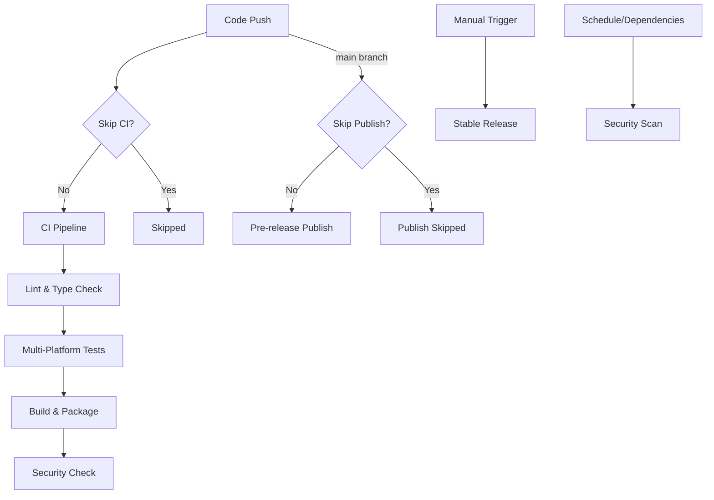

# 🚀 CI/CD Pipeline Documentation

This document explains the automated CI/CD pipeline setup for the VSCode Gosu Language Extension.

## 📋 **Workflow Overview**

### 1. **CI Pipeline** (`.github/workflows/ci.yml`)
**Triggers:**
- ✅ Push to `main` or `develop` branches
- ✅ Pull requests to `main` or `develop` branches
- ✅ Manual workflow dispatch

**What it does:**
- Lints and type-checks code across all modules
- Runs comprehensive tests with coverage enforcement (85% threshold)
- Builds extension and validates packaging
- Tests on multiple platforms (Ubuntu, Windows, macOS)
- Security vulnerability scanning

### 2. **Pre-release Publisher** (`.github/workflows/publish pre-release.yml`)
**Triggers:**
- ✅ Push to `main` branch (automatic)
- ✅ Manual workflow dispatch with version options

**What it does:**
- Automatically publishes pre-release versions on code changes
- Creates GitHub pre-releases with VSIX artifacts
- Publishes to VS Code Marketplace (pre-release channel)

### 3. **Stable Release Publisher** (`.github/workflows/publish.yml`)
**Triggers:**
- ✅ Manual workflow dispatch only (controlled releases)

**What it does:**
- Publishes stable versions to VS Code Marketplace
- Creates GitHub releases with release notes
- Full version control and tagging

### 4. **Security Scanner** (`.github/workflows/security.yml`)
**Triggers:**
- ✅ Weekly scheduled scans (Mondays 9:00 UTC)
- ✅ Dependency file changes
- ✅ Manual workflow dispatch

**What it does:**
- Scans for security vulnerabilities
- Checks license compliance
- Runs CodeQL security analysis

## 🎯 **Smart Triggering System**

### **Code Changes That Trigger Builds:**
- Source code (`src/**`, `modules/**`)
- Syntax definitions (`syntaxes/**`)
- Configuration files (`package*.json`, `tsconfig*.json`)
- Build configurations (`turbo.json`, `vitest.config.ts`)
- Language files (`language-configuration.json`)
- Extension metadata (`.vscodeignore`, `index.js`)

### **Changes That Are Ignored:**
- Documentation (`**.md`, `docs/**`)
- License and readme files
- Git configuration (`.gitignore`)
- Log files (`**.log`)
- CI configuration changes (for publishing workflows)

## 🚫 **Skip CI Functionality**

You can skip CI/CD execution by including any of these keywords in your **commit message**:

### **Universal Skip Keywords:**
- `[skip ci]` - Skips all CI workflows
- `[ci skip]` - Alternative skip format
- `[no ci]` - No CI execution
- `[skip actions]` - Skip GitHub Actions
- `[actions skip]` - Alternative actions skip

### **Workflow-Specific Skip Keywords:**
- `[skip publish]` / `[publish skip]` - Skip publishing workflows only
- `[skip security]` / `[security skip]` - Skip security scans only

### **Examples with Semantic Commits:**
```bash
# Skip all CI/CD
git commit -m "docs: update README with installation examples [skip ci]"

# Skip only publishing (CI tests still run)
git commit -m "style: fix code formatting in parser module [skip publish]"

# Skip security scanning only
git commit -m "refactor(server): improve symbol extraction performance [skip security]"
```

> **Note:** This project uses [Conventional Commits](https://www.conventionalcommits.org/) specification for semantic commit messages, which integrates with the [release-it](https://github.com/release-it/release-it) tool for automated versioning and changelog generation.

## 🔄 **Workflow Dependencies**



## 📊 **Quality Gates**

All workflows enforce these quality standards:

### **Code Quality:**
- ✅ **Linting:** Biome.js and ESLint compliance
- ✅ **Type Safety:** TypeScript strict mode validation
- ✅ **Test Coverage:** 85% minimum coverage threshold
- ✅ **Build Success:** All modules must compile

### **Security Standards:**
- ✅ **Vulnerability Scanning:** npm audit with moderate+ severity blocking
- ✅ **License Compliance:** Dependency license verification
- ✅ **Code Analysis:** CodeQL security scanning

### **Platform Compatibility:**
- ✅ **Cross-Platform:** Tests on Ubuntu, Windows, macOS
- ✅ **Node.js Version:** Pinned to 20.19.3 for consistency
- ✅ **Package Validation:** VSIX integrity and size checks

## 🛠️ **Manual Controls**

### **Force Publishing:**
```bash
# Trigger pre-release manually
gh workflow run "Publish Pre-release Extension"

# Trigger stable release
gh workflow run "Publish Extension" -f version=minor
```

### **Emergency Skip:**
```bash
# Skip all automation for urgent fixes
git commit -m "fix: critical security vulnerability in symbol resolver [skip ci]"
```

### **Development Workflow with Semantic Commits:**
```bash
# Normal development (triggers CI + pre-release)
git commit -m "feat(hover): add enhanced Java type information display"

# Documentation updates (automatically skipped by path filters)
git commit -m "docs: update hover provider API examples"

# Bug fixes (triggers CI + pre-release)
git commit -m "fix(parser): resolve ANTLR grammar conflicts in expressions"

# Code improvements without publishing
git commit -m "refactor(server): optimize symbol table lookup performance [skip publish]"

# Breaking changes (will bump major version with release-it)
git commit -m "feat(lsp)!: remove deprecated completion provider API"

# Chores and maintenance
git commit -m "chore(deps): update typescript to 5.8.4"

# CI/build changes
git commit -m "ci: add Node.js 22 to test matrix"

# Performance improvements
git commit -m "perf(completion): cache AST parsing results for faster responses"
```

## 🏷️ **Semantic Commit Types & Release Impact**

| Type | Description | Version Bump | Examples |
|------|-------------|--------------|----------|
| `feat` | New feature | **Minor** (0.1.0) | `feat(hover): add symbol documentation` |
| `fix` | Bug fix | **Patch** (0.0.1) | `fix(parser): handle malformed syntax gracefully` |
| `feat!` or `BREAKING CHANGE:` | Breaking change | **Major** (1.0.0) | `feat(api)!: remove legacy completion methods` |
| `docs` | Documentation only | No bump | `docs: update installation guide` |
| `style` | Code style/formatting | No bump | `style: apply biome formatting rules` |
| `refactor` | Code refactoring | No bump | `refactor(server): extract symbol utilities` |
| `perf` | Performance improvement | **Patch** (0.0.1) | `perf(lsp): optimize hover response time` |
| `test` | Test additions/changes | No bump | `test(completion): add edge case scenarios` |
| `build` | Build system changes | No bump | `build: update turbo configuration` |
| `ci` | CI configuration | No bump | `ci: add security vulnerability scanning` |
| `chore` | Maintenance tasks | No bump | `chore: update dependencies` |

> **Automated Releases:** The `release-it` tool automatically determines version bumps and generates changelogs based on semantic commit messages.

## 🔧 **Configuration Files**

- **Dependabot:** `.github/dependabot.yml` - Automated dependency updates
- **CI Pipeline:** `.github/workflows/ci.yml` - Main CI/CD logic
- **Pre-release:** `.github/workflows/publish pre-release.yml` - Auto publishing
- **Stable Release:** `.github/workflows/publish.yml` - Manual releases
- **Security:** `.github/workflows/security.yml` - Security scanning

## 📈 **Monitoring & Insights**

Each workflow provides:
- **Detailed summaries** in GitHub Actions UI
- **Artifact uploads** (VSIX packages, coverage reports)
- **Security reports** with actionable recommendations
- **Cross-platform compatibility** verification

---

**Need help?** Check the [GitHub Actions documentation](https://docs.github.com/en/actions) or review individual workflow files for detailed implementation.