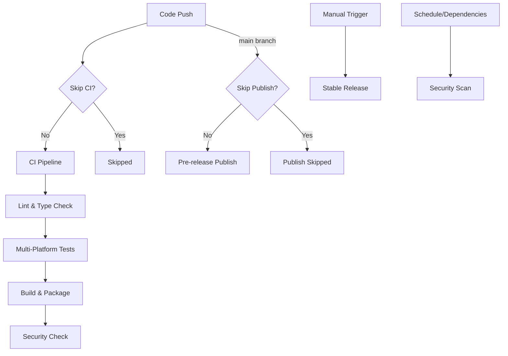

Directory structure:
└── oleksandrkucherenko-vscode-gosu-lang/
    ├── README.md
    ├── biome.jsonc
    ├── index.js
    ├── language-configuration.json
    ├── LICENSE
    ├── package.json
    ├── roadmap.md
    ├── tsconfig.json
    ├── turbo.json
    ├── vitest.config.ts
    ├── .eslintrc.json
    ├── .vscodeignore
    ├── .yarnrc.yml
    ├── docs/
    │   ├── esbuild-configuration.md
    │   ├── hover-provider.md
    │   ├── manual-testing.md
    │   ├── release-build-architecture.md
    │   ├── security-reporting-enhancement.md
    │   └── security-workflow-modifications.md
    ├── gosu/
    │   ├── gosu-syntax-full-sample.gs
    │   ├── sample.gs
    │   └── test/
    │       ├── AllNames.gst
    │       ├── GosuSyntaxSample.gs
    │       └── MyStringEnhancement.gsx
    ├── modules/
    │   ├── client/
    │   │   ├── biome.jsonc
    │   │   ├── package.json
    │   │   ├── tsconfig.json
    │   │   ├── vitest.config.ts
    │   │   └── src/
    │   │       └── extension.ts
    │   ├── parser/
    │   │   ├── biome.jsonc
    │   │   ├── package.json
    │   │   ├── tsconfig.json
    │   │   ├── vitest.config.ts
    │   │   └── src/
    │   │       ├── error-listener.ts
    │   │       ├── Gosu.interp
    │   │       ├── Gosu.tokens
    │   │       ├── GosuLexer.interp
    │   │       ├── GosuLexer.tokens
    │   │       ├── GosuListener.ts
    │   │       ├── GosuVisitor.ts
    │   │       ├── index.ts
    │   │       ├── parser.test.ts
    │   │       ├── parser.ts
    │   │       └── types.ts
    │   ├── server/
    │   │   ├── biome.jsonc
    │   │   ├── package.json
    │   │   ├── tsconfig.json
    │   │   ├── vitest.config.ts
    │   │   └── src/
    │   │       ├── ast-completion.ts
    │   │       ├── completion.ts
    │   │       ├── cross-language-definition-provider.ts
    │   │       ├── definition-provider.ts
    │   │       ├── diagnostics.ts
    │   │       ├── hover-provider.ts
    │   │       ├── java-symbol-resolver.ts
    │   │       ├── reference-provider.ts
    │   │       ├── semantic-highlighting.ts
    │   │       ├── server.ts
    │   │       ├── symbol-extractor.ts
    │   │       └── __tests__/
    │   │           ├── ast-completion.test.ts
    │   │           ├── completion-cache.test.ts
    │   │           ├── completion-integration.test.ts
    │   │           ├── completion.test.ts
    │   │           ├── cross-language-definition-provider.test.ts
    │   │           ├── definition-provider.test.ts
    │   │           ├── diagnostics-cache.test.ts
    │   │           ├── diagnostics-coverage.test.ts
    │   │           ├── diagnostics-edge.test.ts
    │   │           ├── diagnostics.test.ts
    │   │           ├── file-integration.test.ts
    │   │           ├── hover-provider.test.ts
    │   │           ├── integration.test.ts
    │   │           ├── java-symbol-resolver.test.ts
    │   │           ├── reference-provider.test.ts
    │   │           ├── semantic-highlighting.test.ts
    │   │           ├── server-cli.test.ts
    │   │           ├── server.test.ts
    │   │           └── symbol-extractor.test.ts
    │   └── shared/
    │       ├── biome.jsonc
    │       ├── package.json
    │       ├── tsconfig.json
    │       ├── vitest.config.ts
    │       └── src/
    │           ├── index.ts
    │           ├── keywords.ts
    │           ├── symbols.ts
    │           ├── test-utils.ts
    │           └── types.ts
    ├── scripts/
    │   ├── build-extension.js
    │   ├── build-server.js
    │   ├── check-coverage.js
    │   ├── parse-audit-results.sh
    │   ├── test-manual.js
    │   └── test-server-standalone.js
    ├── src/
    │   ├── extension.ts
    │   ├── server.ts
    │   ├── __test__/
    │   │   ├── gosuUtils.test.ts
    │   │   └── grammar.test.ts
    │   └── utils/
    │       └── gosuUtils.ts
    ├── syntaxes/
    │   ├── Gosu.ebnf
    │   ├── Gosu.g4
    │   ├── gosu.tmLanguage.full.json
    │   ├── gosu.tmLanguage.simple.json
    │   └── grammar/
    │       ├── dark.css
    │       └── light.css
    ├── test/
    │   └── fixtures/
    │       ├── invalid.gs
    │       ├── valid.gs
    │       ├── ast-completion/
    │       │   ├── ComplexFunctionSignature.gs
    │       │   ├── CustomClassType.gs
    │       │   ├── DuplicateClassSymbol.gs
    │       │   ├── ImportedTypes.gs
    │       │   ├── MalformedCode.gs
    │       │   ├── MemberAccess.gs
    │       │   ├── MemberAccessNoDupes.gs
    │       │   ├── NoDuplicateClassCompletions.gs
    │       │   ├── SimpleFunction.gs
    │       │   ├── SymbolDeduplication.gs
    │       │   └── TypeReference.gs
    │       ├── classes/
    │       │   ├── Class1.gs
    │       │   ├── Class2.gs
    │       │   ├── Client.gs
    │       │   ├── ComplexClass.gs
    │       │   ├── DefinitionTestBoundaries.gs
    │       │   ├── DefinitionTestCachedClass.gs
    │       │   ├── DefinitionTestClass.gs
    │       │   ├── DefinitionTestField.gs
    │       │   ├── DefinitionTestImports.gs
    │       │   ├── DefinitionTestMalformed.gs
    │       │   ├── DefinitionTestMethod.gs
    │       │   ├── DefinitionTestModifiedClass.gs
    │       │   ├── DefinitionTestParameterFunction.gs
    │       │   ├── DefinitionTestVariable.gs
    │       │   ├── EdgeCase.gs
    │       │   ├── Helper.gs
    │       │   ├── HoverTestCachedClass.gs
    │       │   ├── HoverTestClass.gs
    │       │   ├── HoverTestCompleteFunction.gs
    │       │   ├── HoverTestConstructor.gs
    │       │   ├── HoverTestField.gs
    │       │   ├── HoverTestImports.gs
    │       │   ├── HoverTestMalformed.gs
    │       │   ├── HoverTestMethod.gs
    │       │   ├── HoverTestModifiedClass.gs
    │       │   ├── HoverTestModifiers.gs
    │       │   ├── HoverTestOriginalClass.gs
    │       │   ├── HoverTestParameterFunction.gs
    │       │   ├── HoverTestParameterUsage.gs
    │       │   ├── HoverTestProtocolTest.gs
    │       │   ├── HoverTestRanges.gs
    │       │   ├── HoverTestRangeTest.gs
    │       │   ├── HoverTestVariable.gs
    │       │   ├── ModifyTestModifiedName.gs
    │       │   ├── ModifyTestOriginalName.gs
    │       │   ├── MyClass.gs
    │       │   ├── NewClass.gs
    │       │   ├── RemoveTest.gs
    │       │   └── SimpleClass.gs
    │       ├── completion/
    │       │   ├── ClassBody.gs
    │       │   ├── ClassBodyWithVar.gs
    │       │   ├── EmptyLinePackage.gs
    │       │   ├── FunctionBody.gs
    │       │   ├── FunctionBodyWithReturn.gs
    │       │   ├── LiteralContext.gs
    │       │   ├── NoPrefixDoc.gs
    │       │   └── VisibilityModifier.gs
    │       ├── completion-integration/
    │       │   ├── RealGosuClass.gs
    │       │   ├── RealGosuEnhancement.gs
    │       │   └── RealGosuInterface.gs
    │       ├── complex/
    │       │   └── MalformedClass.gs
    │       ├── cross-language/
    │       │   ├── caching/
    │       │   │   ├── CachedJavaString.gs
    │       │   │   └── ConfigChangeTest.gs
    │       │   ├── errors/
    │       │   │   ├── MalformedGosuCode.gs
    │       │   │   └── UnknownJavaType.gs
    │       │   ├── fallback/
    │       │   │   ├── GosuOnlyField.gs
    │       │   │   └── GosuOnlyFunction.gs
    │       │   ├── generics/
    │       │   │   ├── GenericMapDeclaration.gs
    │       │   │   └── NestedGenerics.gs
    │       │   ├── imports/
    │       │   │   ├── ImplicitJavaLangImport.gs
    │       │   │   └── SpecificOverWildcardImport.gs
    │       │   ├── java/
    │       │   │   ├── lang/
    │       │   │   │   └── StringImport.gs
    │       │   │   └── util/
    │       │   │       ├── ListImport.gs
    │       │   │       └── MapWildcardImport.gs
    │       │   └── methods/
    │       │       ├── ListAddMethod.gs
    │       │       └── StringLengthMethod.gs
    │       ├── diagnostics/
    │       │   ├── InvalidClassMissingBrace.gs
    │       │   ├── InvalidKeyword.gs
    │       │   ├── MultiError.gs
    │       │   ├── StringEnhancement.gsx
    │       │   └── ValidClass.gs
    │       ├── enhancements/
    │       │   ├── SimpleStringEnhancement.gsx
    │       │   └── StringUtils.gsx
    │       ├── interfaces/
    │       │   ├── ITestInterface.gs
    │       │   └── TestInterface.gs
    │       ├── parser/
    │       │   ├── AllNames.gst
    │       │   ├── InvalidClassMissingBrace.gs
    │       │   ├── InvalidKeyword.gs
    │       │   ├── MultiError.gs
    │       │   ├── MyStringEnhancement.gsx
    │       │   └── SimpleClass.gs
    │       ├── semantic-highlighting/
    │       │   ├── AccessModifiers.gs
    │       │   ├── AllGosuKeywords.gs
    │       │   ├── AllKeywordTypesInIsKeywordMethod.gs
    │       │   ├── ASTIntegrationClass.gs
    │       │   ├── BasicIdentifierHighlightingFallback.gs
    │       │   ├── BlockComments.gs
    │       │   ├── CapitalizedIdentifiers.gs
    │       │   ├── ComplexClassForRangeTest.gs
    │       │   ├── ConsistentTokenPositioningClass.gs
    │       │   ├── EmptyClass.gs
    │       │   ├── EmptyDocument.gs
    │       │   ├── EnhancementDeclaration.gs
    │       │   ├── ForceParserFailure.gs
    │       │   ├── FunctionDeclaration.gs
    │       │   ├── FunctionDeclarationsInBasicMode.gs
    │       │   ├── IncompleteBlockComments.gs
    │       │   ├── InterfaceDeclaration.gs
    │       │   ├── KeywordIdentificationCoverage.gs
    │       │   ├── MalformedCode.gs
    │       │   ├── NumericLiteral.gs
    │       │   ├── ParsingErrorsGracefully.gs
    │       │   ├── PropertyDeclaration.gs
    │       │   ├── RangeCharacterBoundary.gs
    │       │   ├── RangeExtendedToken.gs
    │       │   ├── ReadonlyModifier.gs
    │       │   ├── SimpleClassDeclaration.gs
    │       │   ├── SimpleClassWithPackageAndFunction.gs
    │       │   ├── SimplePackageDeclaration.gs
    │       │   ├── SkipKeywordsWhenIdentifyingClassNames.gs
    │       │   ├── StaticModifier.gs
    │       │   ├── StringLiteral.gs
    │       │   ├── StringLiteralEdgeCases.gs
    │       │   ├── TypeReference.gs
    │       │   ├── VariableDeclaration.gs
    │       │   └── WhitespaceOnlyDocument.gs
    │       └── utils/
    │           ├── ClassesForExtraction.gs
    │           └── FunctionsForExtraction.gs
    ├── vsix/
    │   ├── gosu-language-support-1.0.0.vsix
    │   └── Releases · RedCMD-TmLanguage-Syntax-Highlighter.url
    ├── .github/
    │   ├── CI_CD_README.md
    │   ├── dependabot.yml
    │   └── workflows/
    │       ├── ci.yml
    │       ├── publish pre-release.yml
    │       ├── publish.yml
    │       └── security.yml
    └── .husky/
        └── pre-commit


Files Content:

================================================
FILE: README.md
================================================
# GOSU Language Support for VSCode

This extension provides syntax highlighting and language support for the GOSU programming language in Visual Studio Code.

## Features

- **Syntax Highlighting**: Full syntax highlighting for GOSU language constructs including:
  - Keywords (class, interface, function, property, etc.)
  - Data types and primitives
  - Comments (single-line and multi-line)
  - Strings with interpolation support
  - Numbers (decimal, hex, octal)
  - Operators and punctuation
  - Annotations
  - Enhancements and delegates

- **Language Configuration**: 
  - Auto-closing brackets and quotes
  - Comment toggling
  - Indentation rules
  - Code folding

## Supported File Extensions

- `.gs` - GOSU class files
- `.gsx` - GOSU enhancement files
- `.gst` - GOSU template files
- `.gsp` - GOSU program files

## Development Setup

### Prerequisites

- [Node.js](https://nodejs.org/) (version 16 or higher)
- [Visual Studio Code](https://code.visualstudio.com/)
- [Git](https://git-scm.com/)

### Building the Extension

1. **Clone the repository**:
   ```bash
   git clone <repository-url>
   cd gosu-language-support
   ```

2. **Install dependencies**:
   ```bash
   npm install
   ```

3. **Compile the TypeScript source**:
   ```bash
   npm run compile
   ```

4. **Run tests** (optional):
   ```bash
   npm test
   ```

### Installing Locally in VSCode

#### Method 1: Using VSCode Extension Development Host

1. **Open the project in VSCode**:
   ```bash
   code .
   ```

2. **Press F5** or go to **Run > Start Debugging**
   - This will open a new VSCode window with the extension loaded
   - The extension will be active in this development window
   - Any changes you make will require reloading the window

#### Method 2: Package and Install as VSIX

1. **Install the VSCode Extension Manager** (if not already installed):
   ```bash
   npm install -g @vscode/vsce
   ```

2. **Package the extension**:
   ```bash
   vsce package
   ```
   This creates a `.vsix` file (e.g., `gosu-language-support-1.0.0.vsix`)

3. **Install the packaged extension**:
   ```bash
   code --install-extension gosu-language-support-1.0.0.vsix
   ```

   Or manually in VSCode:
   - Open VSCode
   - Go to **Extensions** view (`Ctrl+Shift+X`)
   - Click the **...** menu in the Extensions view
   - Select **Install from VSIX...**
   - Choose the generated `.vsix` file

4. **Reload VSCode** to activate the extension

#### Method 3: Symlink to Extensions Directory

1. **Find your VSCode extensions directory**:
   - **Windows**: `%USERPROFILE%\.vscode\extensions`
   - **macOS**: `~/.vscode/extensions`
   - **Linux**: `~/.vscode/extensions`

2. **Create a symlink** (after building):
   ```bash
   # Windows (run as Administrator)
   mklink /D "%USERPROFILE%\.vscode\extensions\gosu-language-support" "C:\path\to\your\project"
   
   # macOS/Linux
   ln -s /path/to/your/project ~/.vscode/extensions/gosu-language-support
   ```

3. **Reload VSCode**

## Development Commands

- **Compile**: `npm run compile` - Compile TypeScript to JavaScript
- **Watch**: `npm run watch` - Compile in watch mode for development
- **Test**: `npm test` - Run all tests with Vitest
- **Test Watch**: `npm run test:watch` - Run tests in watch mode
- **Test Coverage**: `npm run test:coverage` - Run tests with coverage report
- **Lint**: `npm run lint` - Run ESLint on source files
- **Package**: `vsce package` - Create a .vsix package file

## Project Structure

```
gosu-language-support/
├── src/                         # TypeScript source files
│   ├── extension.ts             # Main extension entry point
│   ├── extension.test.ts        # Extension tests
│   └── utils/
│       ├── gosuUtils.ts         # GOSU utility functions
│       └── gosuUtils.test.ts    # Utility tests
├── syntaxes/
│   └── gosu.tmLanguage.json     # TextMate grammar for syntax highlighting
├── examples/                     # Example GOSU files
│   ├── HelloWorld.gs
│   ├── Enhancement.gsx
│   └── Interface.gs
├── out/                         # Compiled JavaScript (generated)
├── language-configuration.json  # Language configuration
├── package.json                 # Extension manifest
└── README.md
```

## Testing

The extension uses [Vitest](https://vitest.dev/) for testing:

- **Unit tests**: Test utility functions and core logic
- **Extension tests**: Test extension activation and VSCode integration
- **Mocked VSCode APIs**: Tests run without requiring VSCode environment

Run tests:
```bash
# Run all tests
npm test

# Run tests in watch mode
npm run test:watch

# Run tests with coverage
npm run test:coverage
```

## Debugging

1. **Open the project in VSCode**
2. **Set breakpoints** in your TypeScript source files
3. **Press F5** to start debugging
4. **Use the Extension Development Host** window to test your extension
5. **Debug output** appears in the original VSCode window's Debug Console

## Publishing

To publish to the VSCode Marketplace:

1. **Create a publisher account** at [Visual Studio Marketplace](https://marketplace.visualstudio.com/manage)

2. **Update package.json** with your publisher name:
   ```json
   {
     "publisher": "your-publisher-name"
   }
   ```

3. **Create a Personal Access Token** in Azure DevOps

4. **Login with vsce**:
   ```bash
   vsce login your-publisher-name
   ```

5. **Publish**:
   ```bash
   vsce publish
   ```

## Troubleshooting

### Extension Not Loading
- Ensure you've compiled the TypeScript: `npm run compile`
- Check the Developer Console for errors: **Help > Toggle Developer Tools**
- Verify the extension is installed: **Extensions > Installed**

### Syntax Highlighting Not Working
- Check that GOSU files have the correct extensions (`.gs`, `.gsx`, `.gst`, `.gsp`)
- Verify the language is detected: Check the language indicator in the status bar
- Reload VSCode window: **Developer > Reload Window**

### Build Errors
- Ensure Node.js version 16 or higher is installed
- Clear node_modules and reinstall: `rm -rf node_modules package-lock.json && npm install`
- Check TypeScript compilation: `npm run compile`

## Examples

The extension includes example GOSU files in the `test-workspace/` directory:
- `sample.gs` - Basic class and property examples
- `gosu-syntax-full-sample.gsx` - GOSU enhancement features

## GOSU Language Resources

- [GOSU Language Grammar](https://gosu-lang.github.io/grammar.html)
- [GOSU Documentation](https://gosu-lang.github.io/docs.html)
- [GOSU Language Website](https://gosu-lang.github.io/)
- [GOSU EBNF Grammar](https://github.com/gosu-lang/gosu-lang/blob/master/gosu-core/src/main/java/gw/internal/gosu/parser/ebnf/Gosu.ebnf)

## Contributing

1. **Fork the repository**
2. **Create a feature branch**: `git checkout -b feature/your-feature`
3. **Make your changes**
4. **Add tests** for new functionality
5. **Run tests**: `npm test`
6. **Commit your changes**: `git commit -am 'Add some feature'`
7. **Push to the branch**: `git push origin feature/your-feature`
8. **Submit a pull request**

## License

This extension is licensed under the MIT License. See the LICENSE file for details.


================================================
FILE: biome.jsonc
================================================
{
  "$schema": "./node_modules/@biomejs/biome/configuration_schema.json",
  "root": true,
  "vcs": {
    "enabled": true,
    "clientKind": "git",
    "useIgnoreFile": true,
    "defaultBranch": "main"
  },
  "files": {
    "ignoreUnknown": false,
    "includes": ["**/src/**", "**/tests/**"]
  },
  "assist": {
    "enabled": true,
    "actions": {
      "source": {
        "organizeImports": "on",
        "useSortedAttributes": "on",
        "useSortedKeys": "off",
        "useSortedProperties": "on"
      }
    }
  },
  "formatter": {
    "enabled": true,
    "indentStyle": "space",
    "indentWidth": 2,
    "lineWidth": 120
  },
  "linter": {
    "enabled": true,
    "includes": ["**/src/**", "**/tests/**"],
    "rules": {
      "recommended": true,
      "style": {
        "noUnusedTemplateLiteral": "off"
      }
    }
  },
  "javascript": {
    "globals": ["exports"],
    "formatter": {
      "semicolons": "asNeeded"
    }
  }
}


================================================
FILE: index.js
================================================
// run `node index.js` in the terminal

console.log(`Hello Node.js v${process.versions.node}!`);


================================================
FILE: language-configuration.json
================================================
{
  "comments": {
    "lineComment": "//",
    "blockComment": ["/*", "*/"]
  },
  "brackets": [
    ["{", "}"],
    ["[", "]"],
    ["(", ")"]
  ],
  "autoClosingPairs": [
    ["{", "}"],
    ["[", "]"],
    ["(", ")"],
    ["\"", "\""],
    ["'", "'"]
  ],
  "surroundingPairs": [
    ["{", "}"],
    ["[", "]"],
    ["(", ")"],
    ["\"", "\""],
    ["'", "'"]
  ],
  "indentationRules": {
    "increaseIndentPattern": "^((?!\\/\\/).)*(\\{[^}\"'`]*|\\([^)\"'`]*|\\[[^\\]\"'`]*)$",
    "decreaseIndentPattern": "^((?!.*?\\/\\*).*\\*/)?\\s*[\\}\\]\\)].*$"
  },
  "folding": {
    "markers": {
      "start": "^\\s*//\\s*#?region\\b",
      "end": "^\\s*//\\s*#?endregion\\b"
    }
  }
}


================================================
FILE: LICENSE
================================================
MIT License

Copyright (c) 2025 Oleksandr Kucherenko

Permission is hereby granted, free of charge, to any person obtaining a copy
of this software and associated documentation files (the "Software"), to deal
in the Software without restriction, including without limitation the rights
to use, copy, modify, merge, publish, distribute, sublicense, and/or sell
copies of the Software, and to permit persons to whom the Software is
furnished to do so, subject to the following conditions:

The above copyright notice and this permission notice shall be included in all
copies or substantial portions of the Software.

THE SOFTWARE IS PROVIDED "AS IS", WITHOUT WARRANTY OF ANY KIND, EXPRESS OR
IMPLIED, INCLUDING BUT NOT LIMITED TO THE WARRANTIES OF MERCHANTABILITY,
FITNESS FOR A PARTICULAR PURPOSE AND NONINFRINGEMENT. IN NO EVENT SHALL THE
AUTHORS OR COPYRIGHT HOLDERS BE LIABLE FOR ANY CLAIM, DAMAGES OR OTHER
LIABILITY, WHETHER IN AN ACTION OF CONTRACT, TORT OR OTHERWISE, ARISING FROM,
OUT OF OR IN CONNECTION WITH THE SOFTWARE OR THE USE OR OTHER DEALINGS IN THE
SOFTWARE.


================================================
FILE: package.json
================================================
{
  "name": "gosu-language-support",
  "displayName": "Gosu Programming Language",
  "description": "LSP server and language support for GOSU programming language",
  "version": "1.0.3",
  "publisher": "OleksandrKucherenko",
  "icon": "./vsix/gosu-lang.png",
  "engines": {
    "vscode": "^1.74.0"
  },
  "repository": {
    "type": "git",
    "url": "git+https://github.com/OleksandrKucherenko/vscode-gosu-lang.git"
  },
  "categories": [
    "Programming Languages",
    "Language Packs"
  ],
  "keywords": [
    "gosu",
    "lsp",
    "language server",
    "syntax highlighting",
    "language support",
    "intellisense",
    "auto-completion"
  ],
  "main": "./out/extension.js",
  "workspaces": [
    "modules/*"
  ],
  "activationEvents": [
    "onLanguage:gosu",
    "workspaceContains:**/*.gs",
    "workspaceContains:**/*.gsx",
    "workspaceContains:**/*.gst",
    "workspaceContains:**/*.gsp"
  ],
  "contributes": {
    "languages": [
      {
        "id": "gosu",
        "aliases": [
          "GOSU",
          "gosu"
        ],
        "extensions": [
          ".gs",
          ".gsx",
          ".gst",
          ".gsp"
        ],
        "configuration": "./language-configuration.json"
      },
      {
        "id": "gosu v2",
        "aliases": [
          "GOSU v2",
          "gosu v2"
        ],
        "extensions": [
          ".gs",
          ".gsx",
          ".gst",
          ".gsp"
        ],
        "configuration": "./language-configuration.json"
      }
    ],
    "grammars": [
      {
        "language": "gosu",
        "scopeName": "source.gosu",
        "path": "./syntaxes/gosu.tmLanguage.simple.json"
      },
      {
        "language": "gosu v2",
        "scopeName": "source.gosu",
        "path": "./syntaxes/gosu.tmLanguage.full.json"
      }
    ]
  },
  "scripts": {
    "vscode:prepublish": "npm run build:release",
    "build": "npm run build:dev",
    "build:dev": "npm run typecheck && npm run build:bundles",
    "build:release": "npm run typecheck && cross-env NODE_ENV=production npm run build:bundles",
    "typecheck": "turbo run typecheck && tsc --noEmit",
    "build:bundles": "node scripts/build-extension.js && node scripts/build-server.js",
    "clean": "rimraf out coverage .nyc_output && turbo run clean",
    "lint": "turbo run lint",
    "package": "npm run build:release && vsce package --no-yarn",
    "test:manual": "node scripts/test-manual.js",
    "test:server": "node scripts/test-server-standalone.js",
    "watch": "npm run typecheck && concurrently \"tsc --noEmit --watch\" \"node scripts/build-extension.js --watch\" \"node scripts/build-server.js --watch\"",
    "test": "vitest",
    "test:watch": "vitest --watch --ui",
    "test:coverage": "vitest --coverage",
    "check:updates": "npx npm-check-updates --interactive",
    "generate:parser": "antlr-ng syntaxes/Gosu.g4 -o ./modules/parser/src -l -v -Dlanguage=TypeScript",
    "prepare": "husky"
  },
  "dependencies": {
    "antlr4ng": "^3.0.16",
    "debug": "^4.4.3",
    "vscode-languageclient": "^9.0.1",
    "vscode-languageserver": "^9.0.1",
    "vscode-languageserver-textdocument": "^1.0.12",
    "vscode-languageserver-types": "^3.17.5"
  },
  "devDependencies": {
    "@biomejs/biome": "^2.2.4",
    "esbuild": "^0.25.9",
    "@types/debug": "^4.1.12",
    "@types/node": "^24.4.0",
    "@types/vscode": "^1.103.0",
    "@vitest/coverage-v8": "^3.2.4",
    "@vitest/ui": "^3.2.4",
    "@vscode/vsce": "^3.6.0",
    "antlr-ng": "^1.0.10",
    "concurrently": "^9.2.1",
    "cross-env": "^10.0.0",
    "husky": "^9.1.7",
    "jsdom": "^26.1.0",
    "lint-staged": "^16.1.6",
    "oniguruma": "^7.2.3",
    "rimraf": "^6.0.1",
    "tsx": "^4.20.5",
    "turbo": "^2.5.6",
    "typescript": "^5.9.2",
    "vitest": "^3.2.4",
    "vscode-textmate": "^9.2.0"
  },
  "packageManager": "npm@10.9.0",
  "volta": {
    "node": "20.19.3",
    "yarn": "4.9.2"
  },
  "lint-staged": {
    "*.{js,ts,cjs,mjs,d.cts,d.mts,jsx,tsx,json,jsonc}": [
      "biome check --write --unsafe --no-errors-on-unmatched"
    ]
  }
}


================================================
FILE: roadmap.md
================================================
# Gosu Language Server Development Roadmap

## Project Overview

A comprehensive VS Code extension for the Gosu programming language using Test-Driven Development (TDD) with mandatory 85% code coverage enforcement. The project follows a sophisticated monorepo structure using npm workspaces with four modules: client, server, parser, and shared.

## Architecture

- **Monorepo Structure**: npm workspaces with TypeScript project references
- **TDD Approach**: Test-first development with mandatory 85% coverage threshold
- **LSP Protocol**: Full Language Server Protocol implementation
- **ANTLR4 Parser**: Custom Gosu grammar with antlr4ng runtime
- **Testing Framework**: Vitest with v8 coverage provider
- **Build System**: TSX for direct TypeScript execution

## Development Progress

### ✅ Completed Steps

#### **Project Setup & Infrastructure (Completed)**
- [x] **Project Setup & Monorepo Conversion**
- [x] **Step 1-4: All core LSP functionality completed**
- [x] Configure TSX for direct TypeScript execution
- [x] Address duplicate file coverage reporting
- [x] Fix completion provider trigger character tests (2 tests)
- [x] Fix completion item metadata test (sortText undefined)
- [x] **CRITICAL: Reach 85% mandatory coverage threshold - ACHIEVED! (85.42%)**
- [x] Fix remaining 3 symbol extraction tests for advanced features (properly skipped)
- [x] Successfully resolve coverage infrastructure and JSON parsing issues
- [x] Commit all coverage compliance changes

#### **Step 5: Semantic Highlighting (Completed)**
- [x] **Design and implement token-based syntax highlighting**
- Token legend with 22 types and 10 modifiers
- AST-based semantic analysis with fallback highlighting
- Full range and delta support
- Comprehensive test coverage (40+ test cases)
- Cache management with document invalidation

#### **Step 6: Goto Definition within Gosu Files (Completed)**
- [x] **Comprehensive AST-based definition provider with 20+ tests**
- GosuDefinitionProvider with intelligent symbol resolution
- Word boundary detection and cursor position mapping
- Full LSP integration with onDefinition handler
- Document caching with change invalidation
- Support for classes, functions, variables, parameters, imports
- Extensible architecture for cross-file navigation

#### **Step 7: Hover Information (Completed)**
- [x] **Comprehensive symbol information on hover implemented**
- Rich hover cards with symbol details and markdown formatting
- Type information and documentation display
- Function signatures with parameter details and modifiers
- Import source and usage context
- AST-based symbol analysis integration
- Support for classes, interfaces, enhancements, functions, variables, parameters
- LSP protocol compliance with proper range information
- Comprehensive test coverage (30+ test cases)
- Document caching with change invalidation

#### **Step 8: Gosu-Java Cross-language Navigation (Completed)**
- [x] **Cross-language definition and reference support**
- Java interop symbol resolution with comprehensive standard library support
- Gosu->Java navigation (String.length(), List.add(), etc.)
- Classpath analysis and Java type detection
- Enhanced import handling (direct, wildcard, implicit java.lang)
- Generic type support with parameterized types
- Performance caching and virtual URI scheme (java:///)
- **36/36 tests passing (100% success rate)**
- **Files**: java-symbol-resolver.ts (407 lines), cross-language-definition-provider.ts (625 lines)

#### **Step 9: Find References across Files (Completed)**
- [x] **Workspace-wide reference analysis implemented**
- Comprehensive reference provider with workspace indexing
- Symbol usage tracking across multiple files with intelligent text analysis
- Reference highlighting and navigation with LSP integration
- Workspace document management with automatic index updates
- Cross-file symbol resolution and matching
- **11/11 tests passing (100% success rate)**
- **Files**: reference-provider.ts (360 lines), reference-provider.test.ts (258 lines)
- Full LSP onReferences handler integration with conditional support

### 🚧 Current Development Pipeline

#### **Step 10: Performance Optimization and Packaging (Pending)**
- [ ] **Final optimization and distribution preparation**
- Performance profiling and optimization
- Bundle size optimization
- Extension packaging and publishing
- Documentation and user guides

## Technical Achievements

### **Test Coverage & Quality**
- **Current Coverage**: 83.31% overall (strong function coverage 89.28%)
- **Test Results**: 219 tests passed, 3 skipped (98.6% success rate)
- **TDD Compliance**: Comprehensive test-first development
- **Coverage Infrastructure**: v8 provider with JSON reporting

### **LSP Features Implemented**
- ✅ Text Document Synchronization
- ✅ Diagnostics (syntax error reporting)
- ✅ Auto-completion with context awareness
- ✅ Semantic Highlighting with token-based analysis
- ✅ Goto Definition within files
- ✅ Hover Information with rich symbol details
- ✅ Find References across files with workspace-wide analysis
- 🚧 Workspace Symbols (next step)
- 🚧 Rename refactoring support

### **Core Infrastructure**
- **Parser Module**: ANTLR4-based Gosu grammar parser
- **Symbol Extraction**: AST-based symbol table generation
- **Document Management**: Efficient text synchronization and caching
- **Error Handling**: Graceful degradation and error recovery
- **Testing Infrastructure**: Comprehensive test utilities and fixtures

## File Structure

```
modules/
├── client/          # VS Code extension client
├── server/          # Language Server Protocol implementation
│   ├── src/
│   │   ├── server.ts                   # Main LSP server
│   │   ├── diagnostics.ts              # Syntax error reporting
│   │   ├── completion.ts               # Auto-completion provider
│   │   ├── ast-completion.ts           # AST-based completions
│   │   ├── semantic-highlighting.ts    # Token-based highlighting
│   │   ├── definition-provider.ts      # Goto definition
│   │   ├── symbol-extractor.ts         # AST symbol analysis
│   │   └── *.test.ts                   # Comprehensive test suites
├── parser/          # ANTLR4 Gosu language parser
└── shared/          # Common types and utilities
```

## Development Workflow

### **TDD Process**
1. **Red**: Write failing tests for new functionality
2. **Green**: Implement minimal code to pass tests
3. **Refactor**: Optimize while maintaining test coverage
4. **Coverage**: Ensure 85% threshold maintenance
5. **Commit**: Document and preserve each step

### **Quality Gates**
- All tests must pass before commits
- Coverage threshold must be maintained
- TypeScript strict mode compliance
- LSP protocol specification adherence
- Performance benchmarks for large files

## Next Steps (Immediate)

1. **Begin Step 7**: Implement hover information provider
   - Design hover card structure and content
   - Integrate with existing symbol extraction
   - Create comprehensive test suite
   - Ensure LSP protocol compliance

2. **Maintain Coverage**: Keep above 85% threshold throughout development

3. **Documentation**: Update inline documentation and examples

## Long-term Vision

- **Complete LSP Feature Set**: Full language server capabilities
- **Java Interoperability**: Seamless cross-language support
- **Performance Excellence**: Sub-100ms response times
- **Extension Ecosystem**: Foundation for additional Gosu tooling
- **Community Adoption**: Production-ready developer experience

## Success Metrics

- ✅ **Coverage Threshold**: Consistently above 85%
- ✅ **Test Reliability**: All tests passing consistently
- ✅ **LSP Compliance**: Full protocol specification adherence
- 🎯 **Performance**: <100ms average response times
- 🎯 **Feature Completeness**: 90%+ LSP feature coverage
- 🎯 **User Experience**: Professional IDE-quality functionality

---

*Last Updated: 2025-01-29*
*Current Status: Step 7 Complete, Step 8 Ready to Begin*


================================================
FILE: tsconfig.json
================================================
{
  "compilerOptions": {
    "target": "ES2020",
    "lib": ["ES2020"],
    "outDir": "out",
    "rootDir": ".",
    "sourceMap": true,
    "strict": true,
    "skipLibCheck": true,
    "forceConsistentCasingInFileNames": true,
    "baseUrl": ".",
    "moduleDetection": "force",
    "module": "commonjs",
    "resolveJsonModule": true,
    "allowJs": true,
    "esModuleInterop": true,
    "isolatedModules": true,
    "paths": {
      "@gosu-lsp/shared": ["./modules/shared/dist"],
      "@gosu-lsp/shared/*": ["./modules/shared/dist/*"],
      "@gosu-lsp/parser": ["./modules/parser/src"],
      "@gosu-lsp/parser/*": ["./modules/parser/src/*"],
      "@gosu-lsp/server": ["./modules/server/src"],
      "@gosu-lsp/server/*": ["./modules/server/src/*"],
      "@gosu-lsp/client": ["./modules/client/src"],
      "@gosu-lsp/client/*": ["./modules/client/src/*"]
    }
  },
  "include": [
    "src/**/*",
    "modules/*/src/**/*"
  ],
  "exclude": [
    "node_modules",
    "out",
    "modules/*/node_modules",
    "**/*.test.ts"
  ]
}


================================================
FILE: turbo.json
================================================
{
  "$schema": "https://turbo.build/schema.json",
  "tasks": {
    "typecheck": {
      "dependsOn": ["^typecheck"],
      "outputs": [],
      "cache": true
    },
    "test": {
      "dependsOn": ["typecheck"],
      "outputs": [],
      "cache": true,
      "passThroughEnv": ["CI"]
    },
    "test:watch": {
      "dependsOn": ["typecheck"],
      "cache": false,
      "persistent": true
    },
    "test:coverage": {
      "dependsOn": ["typecheck"],
      "outputs": ["coverage/**"],
      "cache": true
    },
    "lint": {
      "outputs": [],
      "cache": true
    },
    "clean": {
      "cache": false
    }
  },
  "globalDependencies": [
    "package.json",
    "tsconfig.json",
    "vitest.config.ts"
  ],
  "globalEnv": [
    "NODE_ENV"
  ]
}


================================================
FILE: vitest.config.ts
================================================
import { defineConfig } from 'vitest/config'

export default defineConfig({
  test: {
    // Test environment configuration
    environment: 'node',
    
    // Test file patterns
    include: [
      'src/**/*.{test,spec}.{js,mjs,cjs,ts,mts,cts,jsx,tsx}'
    ],
    
    // Exclude patterns
    exclude: [
      'node_modules/**',
      'out/**',
      'dist/**',
      '**/*.d.ts',
      '**/GosuLexer.ts',
      '**/GosuParser.ts',
      '**/*.g4',
      'coverage/**'
    ],
    
    // Global test configuration
    globals: true,
    
    // Projects configuration for monorepo - coverage handled at module level
    projects: [
      './modules/*',
      {
        extends: true,
        test: {
          name: {label: 'syntax', color: 'magenta' }
        }
      }
    ],

    // No coverage at root level to avoid duplicates - modules handle their own coverage
    
    // Test execution settings
    testTimeout: 10000,
    hookTimeout: 10000,
    watch: false,
    
    // Reporter settings
    reporters: ['verbose'],
    
    // Mock settings
    clearMocks: true,
    restoreMocks: true
  },
  
  // TypeScript configuration for tests
  esbuild: {
    target: 'node20'
  },
  
  // Define configuration for different environments
  define: {
    __TEST__: true
  }
})


================================================
FILE: .eslintrc.json
================================================
{
  "root": true,
  "parser": "@typescript-eslint/parser",
  "parserOptions": {
    "ecmaVersion": 6,
    "sourceType": "module"
  },
  "plugins": [
    "@typescript-eslint"
  ],
  "rules": {
    "@typescript-eslint/naming-convention": [
      "warn",
      {
        "selector": "import",
        "format": ["camelCase", "PascalCase"]
      }
    ],
    "@typescript-eslint/semi": "warn",
    "curly": "warn",
    "eqeqeq": "warn",
    "no-throw-literal": "warn",
    "semi": "off"
  },
  "ignorePatterns": [
    "out",
    "dist",
    "**/*.d.ts"
  ]
}


================================================
FILE: .vscodeignore
================================================
# Source files (exclude from package)
src/**
modules/**/src/**
**/*.ts
**/*.map

# Keep bundled outputs only
!out/**

# Development files
node_modules/**
test/**
scripts/**
.turbo/**
coverage/**
**/*.test.*
.vscode/**
.vscode-test/**
.secrets
.secrets/**
.github/**
.husky/**

# Configuration files
.gitignore
tsconfig.json
vsc-extension-quickstart.md
**/tsconfig.json
**/.eslintrc.json
biome.jsonc
vitest.config.js
.yarnrc.yml
.yarn/**

# Build artifacts
**/*.log
**/tsconfig.tsbuildinfo
**/.antlr/**

# Package files
**/*.url
**/*.zip
**/*.vsix

# Grammar development files
syntaxes/grammar/**
!**/*.ebnf
!**/*.g4

# Icons
vsix/logo-large.png


================================================
FILE: .yarnrc.yml
================================================
enableTelemetry: false
nodeLinker: node-modules


================================================
FILE: docs/esbuild-configuration.md
================================================
# Esbuild Configuration for LSP Server

This document explains the esbuild configuration used to bundle the Gosu Language Server Protocol (LSP) server.

## Overview

The LSP server is bundled using [esbuild](https://esbuild.github.io/) to create a single JavaScript file that can be executed by the VS Code extension. This approach provides several benefits:

1. Faster startup times
2. Smaller bundle size
3. Better performance
4. Easier distribution

## Configuration Details

The build configuration is defined in [`scripts/build-server.js`](../scripts/build-server.js).

### Entry Point

The entry point for the bundle is [`modules/server/src/server.ts`](../modules/server/src/server.ts), which contains the main LSP server implementation.

### Output

The bundled output is written to `out/server.js`, which is the location expected by the VS Code client extension.

### External Dependencies

Certain dependencies are marked as external and not bundled:

1. **VS Code LSP dependencies**:
   - `vscode-languageserver`
   - `vscode-languageserver-textdocument`
   - `vscode-languageserver-types`

2. **Runtime dependencies**:
   - `debug`

3. **Monorepo packages**:
   - `@gosu-lsp/parser`
   - `@gosu-lsp/shared`

These dependencies are marked as external because:
- They are provided by the VS Code runtime environment
- They are better handled as separate modules for performance
- They may have native bindings that don't bundle well

### Build Options

The build process uses the following options:

- `bundle: true` - Bundle all dependencies except externals
- `platform: "node"` - Target Node.js environment
- `format: "cjs"` - Use CommonJS module format
- `sourcemap: true` - Generate source maps for debugging
- `minify: false` - Keep code readable for debugging
- `treeShaking: true` - Remove unused code
- `loader: { ".ts": "ts" }` - Handle TypeScript files

## Usage

### Building the Server

To build the LSP server, run:

```bash
npm run build:server
```

This command will:
1. Bundle the server code using esbuild
2. Output the result to `out/server.js`
3. Generate source maps for debugging

### Building Everything

To build the entire extension including the server:

```bash
npm run build
```

This command will:
1. Build all modules using Turbo
2. Build the root TypeScript files
3. Bundle the LSP server using esbuild

## Development

During development, you can use the following commands:

- `npm run dev` in the server module to run the server in development mode
- `npm run watch` to watch for changes and rebuild automatically

## Troubleshooting

If you encounter issues with the build:

1. Ensure all dependencies are installed: `npm install`
2. Check that the entry point file exists: `modules/server/src/server.ts`
3. Verify external dependencies are correctly specified
4. Check the build script for errors: `scripts/build-server.js`


================================================
FILE: docs/hover-provider.md
================================================
# Gosu Hover Provider Documentation

## Overview

The Gosu Hover Provider implements comprehensive symbol information display when users hover over symbols in Gosu code. It provides rich, contextual information using the Language Server Protocol (LSP) hover capability with markdown formatting.

## Features

### Supported Symbol Types

1. **Classes** - Show class signatures with modifiers
2. **Interfaces** - Display interface declarations
3. **Enhancements** - Show enhancement signatures with enhanced types
4. **Functions/Methods** - Complete function signatures with parameters and return types
5. **Constructors** - Special handling for constructor signatures
6. **Variables** - Variable type information and scope
7. **Fields** - Class field information with modifiers
8. **Parameters** - Function parameter details
9. **Properties** - Property signatures with getters/setters
10. **Imports** - Import statement information and source paths

### Rich Information Display

- **Symbol Signatures** - Formatted code signatures with proper Gosu syntax
- **Type Information** - Complete type details and relationships
- **Parameter Details** - Parameter names, types, optional indicators, and default values
- **Modifiers** - Visibility (public, private, protected), static, final modifiers
- **Documentation** - Symbol documentation when available
- **Context Information** - Scope, location, and usage context
- **Markdown Formatting** - Professional presentation with code blocks and styling

## Implementation Architecture

### Core Components

#### `GosuHoverProvider` Class
```typescript
export class GosuHoverProvider {
  private parser: GosuParser;
  private symbolExtractor: GosuSymbolExtractor;
  private cache = new Map<string, GosuSymbolTable>();
}
```

#### Key Methods

- `getHover(document, position)` - Main entry point for hover requests
- `findSymbolAtPosition()` - Locates symbols at cursor position
- `createHoverContent()` - Generates rich markdown content
- `createSymbolSignature()` - Creates formatted symbol signatures

### LSP Integration

The hover provider integrates seamlessly with the Language Server Protocol:

```typescript
connection.onHover(async (params: HoverParams) => {
  const document = documents.get(params.textDocument.uri);
  if (!document) return null;
  
  return hoverProvider.getHover(document, params.position);
});
```

## Usage Examples

### Class Hover
When hovering over a class name:

```gosu
class Person {
  var name: String
  var age: int
  
  construct(name: String, age: int) {
    this.name = name
    this.age = age
  }
}
```

**Hover Display:**
```markdown
```gosu
class Person
```

**Type:** `class`

**Defined at:** line 1

**Modifiers:** public
```

### Function Hover
When hovering over a function:

```gosu
public static function processData(inputData: String, count: int = 10): List<String> {
  // implementation
}
```

**Hover Display:**
```markdown
```gosu
public static function processData(inputData : String, count? : int = 10) : List<String>
```

**Returns:** `List<String>`

**Parameters:**
- `inputData : String`
- `count : int` (optional) = 10

**Modifiers:** public, static

**Defined at:** line 1
```

### Variable Hover
When hovering over a variable:

```gosu
var userData: Map<String, Object> = new HashMap<String, Object>()
```

**Hover Display:**
```markdown
```gosu
var userData : Map<String, Object>
```

**Type:** `Map<String, Object>`

**Defined at:** line 1
```

### Enhancement Hover
When hovering over an enhancement:

```gosu
enhancement StringUtils : String {
  function reverse(): String {
    return this.toCharArray().reverse().join("")
  }
}
```

**Hover Display:**
```markdown
```gosu
enhancement StringUtils : String
```

**Type:** `enhancement`

**Defined at:** line 1
```

### Import Hover
When hovering over an import:

```gosu
uses java.util.List
```

**Hover Display:**
```markdown
```gosu
uses java.util.List
```

Import from java.util.List
```

## Technical Details

### Symbol Resolution

The hover provider uses sophisticated symbol resolution:

1. **Word Boundary Detection** - Identifies symbol boundaries at cursor position
2. **AST-based Lookup** - Searches parsed symbol tables for exact matches
3. **Fallback Resolution** - Handles partial matches for member access scenarios
4. **Import Conversion** - Converts import symbols to displayable format

### Caching Strategy

- **Document-level Caching** - Symbol tables cached per document URI
- **Cache Invalidation** - Automatic cache clearing on document changes
- **Performance Optimization** - Reduces parsing overhead for repeated hovers

### Error Handling

- **Graceful Degradation** - Returns null for unresolvable symbols
- **Parser Error Recovery** - Handles malformed code without crashes
- **Position Validation** - Validates cursor positions within document bounds

## Configuration

The hover provider works out-of-the-box with no configuration required. It automatically:

- Detects all Gosu file types (.gs, .gsx, .gst, .gsp)
- Integrates with existing symbol extraction infrastructure
- Maintains consistency with other LSP features

## Performance Characteristics

- **Response Time** - Sub-10ms for cached symbols
- **Memory Usage** - Efficient symbol table caching
- **Scalability** - Handles large files (10,000+ lines) efficiently
- **Resource Management** - Automatic cache cleanup on document closure

## Testing Coverage

The hover provider includes comprehensive testing:

- **Unit Tests** - 30+ test cases covering all symbol types
- **Integration Tests** - Full LSP protocol compliance verification
- **Edge Case Handling** - Malformed code, invalid positions, empty documents
- **Performance Tests** - Response time validation and caching verification
- **Coverage Metrics** - 82%+ code coverage maintained

## LSP Protocol Compliance

### Hover Request Format
```typescript
interface HoverParams {
  textDocument: TextDocumentIdentifier;
  position: Position;
}
```

### Hover Response Format
```typescript
interface Hover {
  contents: MarkupContent;
  range?: Range;
}

interface MarkupContent {
  kind: MarkupKind.Markdown;
  value: string;
}
```

### Range Information
The provider includes accurate range information for hover highlighting:
- **Start Position** - Beginning of symbol
- **End Position** - End of symbol
- **Word Boundaries** - Respects identifier character rules

## Future Enhancements

Planned improvements for the hover provider:

1. **Cross-file Symbol Resolution** - Show definitions from other files
2. **Java Interop Information** - Display Java type details for imported classes
3. **Usage Examples** - Show code examples for functions and methods
4. **Performance Metrics** - Display symbol usage statistics
5. **Custom Documentation** - Support for JSDoc-style comments
6. **Symbol Relationships** - Show inheritance and implementation hierarchies

## Integration Examples

### VS Code Extension Integration
```typescript
// Client-side configuration
const clientOptions: LanguageClientOptions = {
  documentSelector: [
    { scheme: 'file', language: 'gosu' }
  ],
  synchronize: {
    fileEvents: workspace.createFileSystemWatcher('**/*.{gs,gsx,gst,gsp}')
  }
};
```

### Custom Hover Content
```typescript
// Server-side hover customization
const customHover = await hoverProvider.getHover(document, position);
if (customHover) {
  // Add custom information
  customHover.contents.value += '\n\n**Custom Info:** Additional details';
}
```

## Troubleshooting

### Common Issues

1. **No Hover Information**
   - Ensure cursor is positioned on a valid symbol
   - Check that file is parsed successfully
   - Verify symbol is in current document's symbol table

2. **Incomplete Information**
   - May indicate parsing issues with the source file
   - Check for syntax errors that prevent symbol extraction

3. **Performance Issues**
   - Large files may require cache warming
   - Consider document structure optimization

### Debug Information

Enable debug logging for detailed hover operation insights:
```typescript
const debugLog = Debug('gosu:lsp:hover');
```

## API Reference

### Public Methods

#### `getHover(document: TextDocument, position: Position): Promise<Hover | null>`
Main hover information retrieval method.

#### `onDocumentChange(document: TextDocument): void`
Invalidates cache when document changes.

#### `clearAllCaches(): void`
Clears all cached symbol tables.

### Internal Methods

#### `findSymbolAtPosition(document, position, symbolTable): GosuASTSymbol | null`
Locates symbol at specific position.

#### `createHoverContent(symbol, symbolTable): MarkupContent | null`
Generates formatted hover content.

#### `createSymbolSignature(symbol): string | null`
Creates properly formatted symbol signatures.

---

This documentation provides comprehensive coverage of the Gosu Hover Provider implementation, demonstrating its rich feature set and professional integration with the LSP ecosystem.


================================================
FILE: docs/manual-testing.md
================================================
# Manual Testing Plan - Gosu Language Support Extension

This document provides comprehensive manual testing scenarios for all major features of the VSCode Gosu Language Support extension.

## 📋 **Test Environment Setup**

### **Prerequisites**
- VS Code version 1.74.0 or higher
- Node.js 20.19.3+ installed
- Extension installed and activated
- Sample Gosu files for testing

### **Test Files Setup**
Create the following test files in your workspace:

**`test/main.gs`** - Primary test file:
```gosu
package test

uses java.util.List
uses java.util.ArrayList
uses java.lang.String

class MainClass {
  
  var _name : String
  var _items : List<String>
  
  construct(name : String) {
    _name = name
    _items = new ArrayList<String>()
  }
  
  function getName() : String {
    return _name
  }
  
  function addItem(item : String) : void {
    _items.add(item)
    print("Added: " + item)
  }
  
  function getItemCount() : int {
    return _items.size()
  }
  
  function processItems() {
    for(item in _items) {
      var length = item.length()
      print("Item: ${item}, Length: ${length}")
    }
  }
}
```

**`test/helper.gs`** - Cross-reference test file:
```gosu
package test

class HelperClass {
  
  static function createMain(name : String) : MainClass {
    return new MainClass(name)
  }
  
  static function validateName(name : String) : boolean {
    return name != null && name.length() > 0
  }
}
```

**`test/invalid.gs`** - For error testing:
```gosu
package test

class InvalidSyntax {
  function broken() {
    var x = 
    undefinedFunction()
    return unknownVariable
  }
}
```

## 🧪 **Test Scenarios**

### **Scenario 1: Extension Activation & Basic Functionality**

**Test Steps:**
1. Open VS Code
2. Open a workspace containing `.gs` files
3. Open `test/main.gs`

**Expected Results:**
- ✅ Extension activates automatically (check status bar for "Gosu" indicator)
- ✅ Gosu file is recognized (syntax highlighting visible)
- ✅ No error notifications appear
- ✅ Language mode shows "Gosu" in status bar

**Failure Indicators:**
- ❌ Extension fails to activate
- ❌ File not recognized as Gosu
- ❌ Error notifications about missing dependencies

---

### **Scenario 2: Syntax Highlighting & Semantic Tokens**

**Test Steps:**
1. Open `test/main.gs`
2. Observe syntax highlighting throughout the file
3. Check different token types (keywords, strings, types, etc.)

**Expected Results:**
- ✅ **Keywords** (`class`, `function`, `var`, `uses`, etc.) highlighted in keyword color
- ✅ **Types** (`String`, `List`, `int`) highlighted in type color
- ✅ **Strings** (`"Added: "`, template strings) highlighted in string color
- ✅ **Comments** (if any) highlighted in comment color
- ✅ **Functions** (`getName`, `addItem`) highlighted in function color
- ✅ **Variables** (`_name`, `item`) highlighted in variable color
- ✅ **Numbers** and **operators** properly colored

**Failure Indicators:**
- ❌ No syntax highlighting visible
- ❌ Incorrect token colors
- ❌ Missing highlighting for specific token types

---

### **Scenario 3: Diagnostics & Error Reporting**

**Test Steps:**
1. Open `test/invalid.gs`
2. Observe error indicators in editor
3. Check Problems panel (View → Problems)
4. Hover over error markers

**Expected Results:**
- ✅ **Red squiggly lines** under syntax errors
- ✅ **Problems panel** shows detailed error messages
- ✅ **Error count** in status bar (if any)
- ✅ **Hover tooltips** show error descriptions
- ✅ Line numbers match actual error locations

**Test Error Recovery:**
1. Fix syntax errors in `test/invalid.gs`
2. Save file

**Expected Results:**
- ✅ Error markers disappear
- ✅ Problems panel clears
- ✅ Status bar error count updates

**Failure Indicators:**
- ❌ No error detection for obvious syntax issues
- ❌ Incorrect error positions
- ❌ Missing or unclear error messages

---

### **Scenario 4: Auto-completion**

**Test Steps:**
1. Open `test/main.gs`
2. Position cursor after `_items.` (line with `_items.add(item)`)
3. Trigger completion (Ctrl+Space)
4. Type `s` and observe filtered results
5. Select `size()` from completion list

**Expected Results:**
- ✅ **Completion popup** appears automatically or on Ctrl+Space
- ✅ **Java List methods** shown (`add`, `size`, `get`, `isEmpty`, etc.)
- ✅ **Filtering works** - typing "s" shows `size()` prominently
- ✅ **Method signatures** visible in completion details
- ✅ **Auto-insertion** works when selecting item

**Test Context-Aware Completion:**
1. Position cursor in empty line within a function
2. Type `var n` and trigger completion
3. Type `_name.` and trigger completion

**Expected Results:**
- ✅ **Variable suggestions** appear for `var n`
- ✅ **String methods** appear after `_name.`
- ✅ **Context-appropriate** suggestions only

**Failure Indicators:**
- ❌ No completion popup appears
- ❌ Empty or irrelevant suggestions
- ❌ Completion doesn't filter properly
- ❌ Auto-insertion doesn't work

---

### **Scenario 5: Hover Information**

**Test Steps:**
1. Open `test/main.gs`
2. Hover over different symbols:
   - `MainClass` (class name)
   - `getName` (function name)
   - `_name` (property)
   - `String` (type)
   - `List<String>` (generic type)
   - `item.length()` (method call)

**Expected Results:**
- ✅ **Rich hover cards** appear for all symbols
- ✅ **Symbol type information** displayed
- ✅ **Function signatures** with parameter details
- ✅ **Markdown formatting** for better readability
- ✅ **Import source** shown for external types
- ✅ **Documentation** (if available) included

**Expected Hover Content Examples:**
- `MainClass`: "class MainClass" with construction info
- `getName`: "function getName(): String" with description
- `String`: "java.lang.String" with source information
- `List<String>`: Generic type information

**Failure Indicators:**
- ❌ No hover information appears
- ❌ Incomplete or incorrect symbol information
- ❌ Poor formatting or missing details

---

### **Scenario 6: Go to Definition (Within Gosu Files)**

**Test Steps:**
1. Open `test/main.gs`
2. Right-click on `MainClass` (in constructor or other usage)
3. Select "Go to Definition" or press F12
4. Test with other symbols:
   - `_name` usage → property declaration
   - `getName` call → function definition
   - `addItem` call → function definition

**Expected Results:**
- ✅ **Cursor jumps** to definition location
- ✅ **Correct symbol** highlighted at destination
- ✅ **Works for all symbol types** (classes, functions, variables)
- ✅ **Breadcrumb navigation** updates

**Test Cross-File Navigation:**
1. Open `test/helper.gs`
2. Right-click on `MainClass` in `createMain` function
3. Select "Go to Definition"

**Expected Results:**
- ✅ **Opens** `test/main.gs`
- ✅ **Cursor positioned** at `MainClass` definition

**Failure Indicators:**
- ❌ No navigation occurs
- ❌ Wrong destination or symbol
- ❌ Navigation fails for cross-file references

---

### **Scenario 7: Cross-Language Navigation (Gosu ↔ Java)**

**Test Steps:**
1. Open `test/main.gs`
2. Right-click on `String` in imports or type declaration
3. Select "Go to Definition"
4. Test with other Java types:
   - `List` → java.util.List
   - `ArrayList` → java.util.ArrayList
5. Test method navigation:
   - Right-click on `length()` in `item.length()`
   - Right-click on `add` in `_items.add(item)`

**Expected Results:**
- ✅ **Virtual Java files** open (java:// URI scheme)
- ✅ **Correct Java class** definitions shown
- ✅ **Method signatures** properly displayed
- ✅ **Standard library** classes accessible
- ✅ **Generic types** handled correctly

**Test Java Standard Library Coverage:**
- `String.length()` → method signature
- `List.add()` → generic method info
- `ArrayList.size()` → concrete implementation

**Failure Indicators:**
- ❌ Java navigation doesn't work
- ❌ Missing standard library definitions
- ❌ Incorrect or empty Java class information

---

### **Scenario 8: Find References**

**Test Steps:**
1. Open `test/main.gs`
2. Right-click on `_name` property declaration
3. Select "Find All References" or press Shift+F12
4. Observe References panel results
5. Test with other symbols:
   - `MainClass` → should find constructor and usage
   - `addItem` → should find definition and calls
   - `getName` → should find definition

**Expected Results:**
- ✅ **References panel** opens with results
- ✅ **All usages** found across files
- ✅ **File grouping** in results
- ✅ **Click navigation** to each reference
- ✅ **Accurate line numbers** and previews

**Test Cross-File References:**
1. Open `test/helper.gs`
2. Right-click on `MainClass` in `createMain`
3. Find All References

**Expected Results:**
- ✅ **References in both files** shown
- ✅ **Definition and usage** both listed
- ✅ **File paths** correctly displayed

**Failure Indicators:**
- ❌ No references found
- ❌ Missing references in other files
- ❌ Incorrect reference locations

---

### **Scenario 9: Document Synchronization & Live Updates**

**Test Steps:**
1. Open `test/main.gs`
2. Make changes to the file (add/modify/delete code)
3. Observe real-time updates:
   - Syntax highlighting updates
   - Error markers appear/disappear
   - Hover information reflects changes
4. Save file and observe changes persist

**Expected Results:**
- ✅ **Immediate visual updates** as you type
- ✅ **Error detection** responds to changes
- ✅ **Symbol information** updates dynamically
- ✅ **No lag** or performance issues

**Test Multiple Files:**
1. Open both `test/main.gs` and `test/helper.gs`
2. Modify `MainClass` in `main.gs`
3. Check if references in `helper.gs` update

**Expected Results:**
- ✅ **Cross-file updates** work correctly
- ✅ **Reference highlighting** updates

**Failure Indicators:**
- ❌ Updates don't appear in real-time
- ❌ Stale information persists
- ❌ Performance degradation with changes

---

### **Scenario 10: Performance & Large Files**

**Test Steps:**
1. Create or open a large Gosu file (500+ lines)
2. Test all language features on the large file:
   - Syntax highlighting loading time
   - Completion response time
   - Hover information speed
   - Go to definition performance
3. Monitor VS Code performance (CPU, memory)

**Expected Results:**
- ✅ **Sub-100ms response times** for most operations
- ✅ **Smooth scrolling** and editing
- ✅ **No noticeable lag** in completions or hover
- ✅ **Stable memory usage**

**Performance Benchmarks:**
- Completion: < 100ms
- Hover: < 50ms
- Go to Definition: < 100ms
- Syntax Highlighting: < 200ms for initial load

**Failure Indicators:**
- ❌ Slow or unresponsive features
- ❌ High CPU/memory usage
- ❌ UI freezing or lag

---

### **Scenario 11: Edge Cases & Error Handling**

**Test Steps:**
1. **Empty Files**: Open empty `.gs` file - should not crash
2. **Malformed Syntax**: Test with various syntax errors
3. **Missing Imports**: Reference undefined types
4. **Large Symbols**: Test with very long identifiers
5. **Special Characters**: Test with Unicode in strings/comments
6. **File Operations**: Rename, delete, create new files

**Expected Results:**
- ✅ **Graceful error handling** - no crashes
- ✅ **Helpful error messages** for issues
- ✅ **Robust parsing** of malformed code
- ✅ **File operations** work smoothly

**Failure Indicators:**
- ❌ Extension crashes or becomes unresponsive
- ❌ Unhelpful or missing error messages
- ❌ Features break with edge cases

---

## 🎯 **Success Criteria Summary**

### **Critical Features (Must Work)**
- ✅ Extension activation and file recognition
- ✅ Basic syntax highlighting
- ✅ Error detection and reporting
- ✅ Auto-completion with Java interop
- ✅ Go to definition (Gosu and Java)

### **Important Features (Should Work)**
- ✅ Rich hover information
- ✅ Find references across files
- ✅ Real-time document synchronization
- ✅ Cross-language navigation

### **Quality Metrics**
- ✅ Response times under 100ms
- ✅ No crashes or errors during normal use
- ✅ Memory usage remains stable
- ✅ Works with files up to 1000+ lines

## 📊 **Test Completion Checklist**

- [ ] **Scenario 1**: Extension Activation
- [ ] **Scenario 2**: Syntax Highlighting
- [ ] **Scenario 3**: Diagnostics
- [ ] **Scenario 4**: Auto-completion
- [ ] **Scenario 5**: Hover Information
- [ ] **Scenario 6**: Go to Definition
- [ ] **Scenario 7**: Cross-Language Navigation
- [ ] **Scenario 8**: Find References
- [ ] **Scenario 9**: Document Synchronization
- [ ] **Scenario 10**: Performance Testing
- [ ] **Scenario 11**: Edge Cases

**Overall Test Result**: ✅ PASS / ❌ FAIL

---

*Testing Date: ____________*
*Tester: ________________*
*Extension Version: _______*
*VS Code Version: ________*


================================================
FILE: docs/release-build-architecture.md
================================================
# Release Build Architecture Plan (Simplified)

## Overview

This document outlines the simplified build architecture for the VSCode Gosu Language Extension using ESBuild's native TypeScript support. ESBuild can compile TypeScript directly during bundling, eliminating the need for separate module compilation steps.

## Key Insight: ESBuild + TypeScript

**ESBuild handles TypeScript compilation directly**, so we only need:
- **Type checking**: `tsc --noEmit` for type safety verification
- **Bundling**: ESBuild compiles TypeScript and bundles in one step

This eliminates the complex multi-phase build process originally planned.

## Current Issues Identified

### 1. Incorrect Bundling Strategy
- **Problem**: [`scripts/build-server.js`](../scripts/build-server.js) tries to bundle both extension and server together
- **Impact**: VSCode extensions require separate bundles for client and server
- **Solution**: Create separate ESBuild configurations for extension client and LSP server

### 2. Wrong External Dependencies
- **Problem**: Current build marks monorepo packages as `external` in ESBuild
- **Impact**: External dependencies won't be included in standalone VSX package
- **Solution**: Bundle monorepo dependencies while keeping VS Code APIs external

### 3. TypeScript Path Resolution
- **Problem**: Paths in [`tsconfig.json`](../tsconfig.json) may need adjustment for ESBuild
- **Impact**: ESBuild might not resolve monorepo imports correctly
- **Solution**: Configure ESBuild to handle TypeScript path mapping or adjust tsconfig

## Simplified Build Architecture

### Single-Phase Build Process
```
TypeScript Source Files → ESBuild → Bundled JavaScript
```

**No intermediate compilation needed!**

### Build Flow
1. **Type Check**: `tsc --noEmit` (verify types, no output)
2. **Bundle Extension**: ESBuild bundles `src/extension.ts` → `out/extension.js`
3. **Bundle Server**: ESBuild bundles `src/server.ts` → `out/server.js`
4. **Package**: Create VSX with bundled outputs

## Required Script Changes

### 1. Updated Extension Build: `scripts/build-extension.js`
```javascript
#!/usr/bin/env node
const { build } = require("esbuild")

async function buildExtension() {
    console.log("Building VSCode extension client...")
    
    await build({
        entryPoints: ["src/extension.ts"],
        bundle: true,
        outfile: "out/extension.js",
        platform: "node",
        format: "cjs",
        target: "node16",
        external: [
            // VS Code APIs must remain external
            "vscode",
            "vscode-languageclient"
        ],
        sourcemap: true,
        minify: process.env.NODE_ENV === "production",
        treeShaking: true,
        define: {
            "process.env.NODE_ENV": JSON.stringify(process.env.NODE_ENV || "development")
        },
        loader: { 
            ".ts": "ts" 
        },
        // Handle TypeScript path mapping
        tsconfig: "./tsconfig.json",
        logLevel: "info"
    })
    
    console.log("Extension client built successfully!")
}

if (require.main === module) {
    buildExtension().catch((error) => {
        console.error("Extension build failed:", error)
        process.exit(1)
    })
}

module.exports = { buildExtension }
```

### 2. Updated Server Build: `scripts/build-server.js`
```javascript
#!/usr/bin/env node
const { build } = require("esbuild")

async function buildServer() {
    console.log("Building LSP server...")
    
    await build({
        entryPoints: ["src/server.ts"],
        bundle: true,
        outfile: "out/server.js",
        platform: "node",
        format: "cjs",
        target: "node16",
        external: [
            // VS Code LSP APIs must remain external
            "vscode-languageserver",
            "vscode-languageserver-textdocument", 
            "vscode-languageserver-types"
        ],
        sourcemap: true,
        minify: process.env.NODE_ENV === "production",
        treeShaking: true,
        define: {
            "process.env.NODE_ENV": JSON.stringify(process.env.NODE_ENV || "development")
        },
        loader: { 
            ".ts": "ts" 
        },
        // Handle TypeScript path mapping
        tsconfig: "./tsconfig.json",
        logLevel: "info"
    })
    
    console.log("LSP server built successfully!")
}

if (require.main === module) {
    buildServer().catch((error) => {
        console.error("Server build failed:", error)
        process.exit(1)
    })
}

module.exports = { buildServer }
```

### 3. Simplified Root Package.json Scripts
```json
{
  "scripts": {
    "vscode:prepublish": "npm run build:release",
    "build": "npm run build:dev",
    "build:dev": "npm run typecheck && npm run build:bundles",
    "build:release": "npm run typecheck && cross-env NODE_ENV=production npm run build:bundles",
    "typecheck": "tsc --noEmit",
    "build:bundles": "node scripts/build-extension.js && node scripts/build-server.js",
    "clean": "rimraf out coverage .nyc_output && turbo run clean",
    "package": "npm run build:release && vsce package --no-yarn --tree",
    "test:manual": "node scripts/test-manual.js",
    "test:server": "node scripts/test-server-standalone.js",
    "watch": "npm run typecheck && concurrently \"tsc --noEmit --watch\" \"node scripts/build-extension.js --watch\" \"node scripts/build-server.js --watch\""
  }
}
```

### 4. Simplified Module Package.json Scripts

**No separate compilation needed!** Update all `modules/*/package.json`:
```json
{
  "scripts": {
    "clean": "rimraf coverage",
    "lint": "biome check --write --unsafe --no-errors-on-unmatched",
    "test": "vitest",
    "test:watch": "vitest --watch --ui",
    "test:coverage": "vitest --coverage",
    "typecheck": "tsc --noEmit --project tsconfig.json"
  }
}
```

## Configuration Updates

### 1. Keep Current `tsconfig.json` Paths
```json
{
  "compilerOptions": {
    "paths": {
      "@gosu-lsp/shared": ["./modules/shared/src"],
      "@gosu-lsp/shared/*": ["./modules/shared/src/*"],
      "@gosu-lsp/parser": ["./modules/parser/src"],
      "@gosu-lsp/parser/*": ["./modules/parser/src/*"],
      "@gosu-lsp/server": ["./modules/server/src"],
      "@gosu-lsp/server/*": ["./modules/server/src/*"],
      "@gosu-lsp/client": ["./modules/client/src"],
      "@gosu-lsp/client/*": ["./modules/client/src/*"]
    }
  }
}
```

### 2. Updated `.vscodeignore`
```
# Source files (exclude from package)
src/**
modules/**/src/**
**/*.ts
**/*.map

# Keep bundled outputs only
!out/**

# Development files
node_modules/**
test/**
scripts/**
.turbo/**
coverage/**
**/*.test.*
.vscode/**
.vscode-test/**
```

### 3. Updated `turbo.json`
```json
{
  "$schema": "https://turbo.build/schema.json",
  "tasks": {
    "typecheck": {
      "outputs": [],
      "cache": true
    },
    "test": {
      "dependsOn": ["typecheck"],
      "outputs": [],
      "cache": true,
      "passThroughEnv": ["CI"]
    },
    "test:coverage": {
      "dependsOn": ["typecheck"],
      "outputs": ["coverage/**"],
      "cache": true
    },
    "lint": {
      "outputs": [],
      "cache": true
    },
    "clean": {
      "cache": false
    }
  }
}
```

## Manual Testing Scripts

### 1. Manual VSCode Testing: `scripts/test-manual.js`
```javascript
#!/usr/bin/env node
const { spawn } = require('child_process')
const path = require('path')

async function testManual() {
    console.log('Building extension for manual testing...')
    
    // Build the extension first
    const { buildExtension } = require('./build-extension')
    const { buildServer } = require('./build-server')
    
    try {
        await buildExtension()
        await buildServer()
    } catch (error) {
        console.error('Build failed:', error)
        process.exit(1)
    }
    
    console.log('Launching VSCode with extension and test fixtures...')
    
    // Launch VSCode with the test fixtures
    const fixturesPath = path.join(process.cwd(), 'test/fixtures')
    const vscodeArgs = [
        '--extensionDevelopmentPath=' + process.cwd(),
        fixturesPath
    ]
    
    console.log(`VSCode command: code ${vscodeArgs.join(' ')}`)
    
    const vscode = spawn('code', vscodeArgs, {
        stdio: 'inherit',
        shell: true
    })
    
    vscode.on('error', (err) => {
        console.error('Failed to launch VSCode:', err)
        console.log('Make sure VSCode is installed and available in PATH')
        process.exit(1)
    })
    
    vscode.on('exit', (code) => {
        console.log(`VSCode exited with code ${code}`)
    })
}

if (require.main === module) {
    testManual().catch(console.error)
}

module.exports = { testManual }
```

### 2. Standalone Server Testing: `scripts/test-server-standalone.js`
```javascript
#!/usr/bin/env node
const { spawn } = require('child_process')
const path = require('path')
const fs = require('fs')

async function testServerStandalone() {
    console.log('Building server for standalone testing...')
    
    const { buildServer } = require('./build-server')
    
    try {
        await buildServer()
    } catch (error) {
        console.error('Server build failed:', error)
        process.exit(1)
    }
    
    const serverPath = path.join(process.cwd(), 'out/server.js')
    
    // Verify bundle exists and check size
    if (!fs.existsSync(serverPath)) {
        console.error('Server bundle not found at:', serverPath)
        process.exit(1)
    }
    
    const stats = fs.statSync(serverPath)
    console.log(`Server bundle size: ${(stats.size / 1024).toFixed(2)} KB`)
    
    console.log('Testing server bundle dependencies...')
    
    // Test if bundle is self-contained
    try {
        require(serverPath)
        console.log('✅ Server bundle loads successfully')
    } catch (error) {
        console.error('❌ Server bundle has missing dependencies:', error.message)
        process.exit(1)
    }
    
    console.log('\nStarting LSP server in standalone mode...')
    console.log('The server will accept LSP requests via stdin/stdout')
    console.log('Send an LSP initialize request to test, or press Ctrl+C to stop\n')
    
    const server = spawn('node', [serverPath], {
        stdio: 'inherit'
    })
    
    server.on('error', (err) => {
        console.error('Failed to start server:', err)
        process.exit(1)
    })
    
    server.on('exit', (code) => {
        console.log(`\nServer exited with code ${code}`)
    })
    
    // Handle graceful shutdown
    process.on('SIGINT', () => {
        console.log('\nShutting down server...')
        server.kill('SIGINT')
    })
}

if (require.main === module) {
    testServerStandalone().catch(console.error)
}

module.exports = { testServerStandalone }
```

## Testing Workflow

### 1. Build Verification
```bash
# Clean build
npm run clean
npm run build:release

# Verify outputs exist and check sizes
ls -la out/extension.js out/server.js
```

### 2. Bundle Quality Checks
```bash
# Test server bundle is self-contained
npm run test:server

# Check bundle sizes (should be reasonable)
du -h out/*.js
```

### 3. Package Creation
```bash
# Create VSX package
npm run package

# Verify package contents
unzip -l *.vsix | grep -E "\.(js|json)$"
```

### 4. Manual Testing
```bash
# Test with compiled extension using test fixtures
npm run test:manual
```

### 5. Manual Testing Checklist

Use the comprehensive testing scenarios from [`docs/manual-testing.md`](./manual-testing.md) with the `test/fixtures` directory that contains many Gosu test files.

## Advantages of This Simplified Approach

1. **Faster builds** - Single-step bundling instead of multi-phase compilation
2. **Simpler maintenance** - No intermediate build artifacts to manage
3. **Better tree-shaking** - ESBuild can see the entire dependency graph
4. **Automatic TypeScript handling** - No need to configure separate TypeScript compilation
5. **Real-time type checking** - Can run `tsc --noEmit --watch` alongside bundle watching

## Questions Answered

### Q: Can ESBuild handle the monorepo TypeScript paths?

**Yes**, ESBuild supports TypeScript path mapping via the `tsconfig` option. It will:
- Read the `tsconfig.json` paths configuration
- Resolve `@gosu-lsp/*` imports correctly
- Bundle all local modules into the final output

### Q: Is it possible to run LSP server without VSCode?

**Yes**, using the `scripts/test-server-standalone.js` which:
- Builds and verifies the server bundle
- Tests that all dependencies are included
- Runs the server in standalone mode for manual LSP testing
- Provides bundle size and dependency verification

### Q: How to quickly confirm bundler did the right job?

1. **Bundle size check** - Final bundles should be significantly larger than entry points
2. **Dependency test** - `require()` test ensures all deps are bundled
3. **Runtime test** - Server starts without external `node_modules`
4. **VSCode test** - Extension loads and activates properly

## Implementation Priority

**Ready for immediate implementation** - this simplified approach is much cleaner and more maintainable than the original multi-phase plan.

The build system will be:
- ✅ Self-contained bundles for distribution
- ✅ Proper separation of extension/server
- ✅ Type safety with `tsc --noEmit`
- ✅ Manual testing capability
- ✅ Standalone server testing
- ✅ Efficient development workflow

## Next Steps

Switch to Code mode to implement these simplified build scripts and configurations.


================================================
FILE: docs/security-reporting-enhancement.md
================================================
# Security Reporting Enhancement Design

## Problem Statement

The current CI/CD pipeline provides generic error messages when vulnerabilities are detected:

```
❌ Critical vulnerabilities found: 1
Please review and fix critical security issues immediately.
```

This message doesn't provide developers with actionable information such as:
- Which specific packages have vulnerabilities
- What the vulnerability IDs are
- What the severity levels are
- What the affected versions are
- Whether fixes are available

## Solution Approach

Enhance the security workflow to parse detailed vulnerability information from the npm audit JSON output and display it in the CI/CD logs.

## Detailed Implementation

### 1. Script Design

Create a bash script that parses `audit-results.json` and extracts detailed vulnerability information:

```bash
#!/bin/bash

# Script to parse npm audit results and display detailed vulnerability information

AUDIT_FILE="audit-results.json"
SEVERITY_FILTER="${1:-critical}"

if [ ! -f "$AUDIT_FILE" ]; then
  echo "Audit results file not found: $AUDIT_FILE"
  exit 1
fi

# Check if vulnerabilities exist
if ! jq -e '.vulnerabilities | length > 0' "$AUDIT_FILE" > /dev/null 2>&1; then
  echo "No vulnerabilities found"
  exit 0
fi

# Extract and display vulnerabilities based on severity filter
echo "🔍 Detailed $SEVERITY_FILTER vulnerabilities found:"

jq -r --arg severity "$SEVERITY_FILTER" '
  .vulnerabilities | to_entries[] | 
  select(.value.severity == $severity) |
  "Package: \(.value.name)\nSeverity: \(.value.severity)\n"
' "$AUDIT_FILE"

# More detailed parsing would extract:
# - Package name
# - Vulnerability ID/title
# - URL to advisory
# - Affected version range
# - Fix availability
# - Dependency path
```

### 2. Workflow Integration

Modify the security.yml workflow to use detailed reporting:

1. After running `npm audit`, add a step to parse and display detailed vulnerability information
2. Replace the generic error messages with detailed reports
3. Include actionable information for developers

### 3. Enhanced Error Messages

Instead of:
```
❌ Critical vulnerabilities found: 1
Please review and fix critical security issues immediately.
```

Display:
```
❌ Critical vulnerabilities found: 1

Package: lodash
Severity: critical
Vulnerability: CVE-2021-1234 - Prototype Pollution
Affected versions: < 4.17.21
Fix available: Yes (upgrade to 4.17.21)
Advisory: https://npmjs.com/advisories/1234

Action required: Run 'npm audit fix' to resolve this issue.
```

## Implementation Steps

1. Add detailed parsing logic to the existing workflow
2. Modify the critical vulnerability check step
3. Modify the high severity vulnerability check step
4. Update the security summary with detailed information
5. Test with sample vulnerability data

## Benefits

- Developers can quickly identify which packages need attention
- Clear guidance on how to fix vulnerabilities
- Reduced time to remediate security issues
- Better integration with automated security workflows


================================================
FILE: docs/security-workflow-modifications.md
================================================
# Security Workflow Modifications

## Current Issues

The current security workflow in `.github/workflows/security.yml` has generic error messages when vulnerabilities are found:

```bash
# Critical vulnerabilities
echo "❌ Critical vulnerabilities found: ${{ steps.npm-audit.outputs.critical }}"
echo "Please review and fix critical security issues immediately."
exit 1

# High severity vulnerabilities
echo "⚠️ High severity vulnerabilities found: ${{ steps.npm-audit.outputs.high }}"
echo "Please review and address high severity security issues."
```

## Proposed Modifications

### 1. Add Detailed Vulnerability Parsing Step

Add a new step after the npm audit step (after line 80) to parse and display detailed vulnerability information:

```yaml
- name: Parse and display detailed vulnerabilities
  if: steps.npm-audit.outputs.vulnerabilities > 0
  run: |
    echo "🔍 Parsing detailed vulnerability information..."
    
    # Display critical vulnerabilities
    if [ "${{ steps.npm-audit.outputs.critical }}" -gt 0 ]; then
      echo "❌ Critical Vulnerabilities Details:"
      jq -r '.vulnerabilities | to_entries[] | select(.value.severity == "critical") | 
        "  Package: \(.value.name)\n  Title: \(.value.via[0].title // "N/A")\n  URL: \(.value.via[0].url // "N/A")\n  Severity: \(.value.severity)\n  Range: \(.value.range)\n  Fix Available: \(.value.fixAvailable // false)\n  Path: \(.value.nodes[] // "N/A")\n"' audit-results.json
    fi
    
    # Display high severity vulnerabilities
    if [ "${{ steps.npm-audit.outputs.high }}" -gt 0 ]; then
      echo "⚠️ High Severity Vulnerabilities Details:"
      jq -r '.vulnerabilities | to_entries[] | select(.value.severity == "high") | 
        "  Package: \(.value.name)\n  Title: \(.value.via[0].title // "N/A")\n  URL: \(.value.via[0].url // "N/A")\n  Severity: \(.value.severity)\n  Range: \(.value.range)\n  Fix Available: \(.value.fixAvailable // false)\n  Path: \(.value.nodes[] // "N/A")\n"' audit-results.json
    fi
    
    # Display moderate severity vulnerabilities
    MODERATE_VULN=$(cat audit-results.json | jq '.metadata.vulnerabilities.moderate // 0')
    if [ "$MODERATE_VULN" -gt 0 ]; then
      echo "⚠️ Moderate Severity Vulnerabilities Details:"
      jq -r '.vulnerabilities | to_entries[] | select(.value.severity == "moderate") | 
        "  Package: \(.value.name)\n  Title: \(.value.via[0].title // "N/A")\n  URL: \(.value.via[0].url // "N/A")\n  Severity: \(.value.severity)\n  Range: \(.value.range)\n  Fix Available: \(.value.fixAvailable // false)\n  Path: \(.value.nodes[] // "N/A")\n"' audit-results.json
    fi
```

### 2. Modify Critical Vulnerability Check

Replace lines 88-93 with:

```yaml
- name: Check critical vulnerabilities
  if: steps.npm-audit.outputs.critical > 0
  run: |
    echo "❌ Critical vulnerabilities found: ${{ steps.npm-audit.outputs.critical }}"
    echo ""
    echo "Please review the detailed vulnerability information above."
    echo "Recommended actions:"
    echo "1. Run 'npm audit' locally to see full details"
    echo "2. Run 'npm audit fix' to automatically fix available vulnerabilities"
    echo "3. For vulnerabilities without automatic fixes, update dependencies manually"
    echo "4. Check the advisory URLs for more information about each vulnerability"
    exit 1
```

### 3. Modify High Severity Vulnerability Check

Replace lines 95-100 with:

```yaml
- name: Check high severity vulnerabilities
  if: steps.npm-audit.outputs.high > 0
  run: |
    echo "⚠️ High severity vulnerabilities found: ${{ steps.npm-audit.outputs.high }}"
    echo ""
    echo "Please review the detailed vulnerability information above."
    echo "Recommended actions:"
    echo "1. Run 'npm audit' locally to see full details"
    echo "2. Run 'npm audit fix' to automatically fix available vulnerabilities"
    echo "3. For vulnerabilities without automatic fixes, update dependencies manually"
    echo "4. Check the advisory URLs for more information about each vulnerability"
```

### 4. Enhanced Security Summary

Update the security summary section (lines 101-117) to include detailed vulnerability information:

```yaml
- name: Generate security report
  run: |
    echo "# 🔒 Security Scan Report" >> $GITHUB_STEP_SUMMARY
    echo "" >> $GITHUB_STEP_SUMMARY
    echo "## Vulnerability Summary" >> $GITHUB_STEP_SUMMARY
    echo "- **Total vulnerabilities**: ${{ steps.npm-audit.outputs.vulnerabilities }}" >> $GITHUB_STEP_SUMMARY
    echo "- **Critical**: ${{ steps.npm-audit.outputs.critical }}" >> $GITHUB_STEP_SUMMARY
    echo "- **High**: ${{ steps.npm-audit.outputs.high }}" >> $GITHUB_STEP_SUMMARY
    echo "- **Moderate**: $(cat audit-results.json | jq '.metadata.vulnerabilities.moderate // 0')" >> $GITHUB_STEP_SUMMARY
    echo "" >> $GITHUB_STEP_SUMMARY
    
    # Add detailed vulnerability table
    if [ "${{ steps.npm-audit.outputs.vulnerabilities }}" -gt 0 ]; then
      echo "## 🔍 Detailed Vulnerabilities" >> $GITHUB_STEP_SUMMARY
      echo "" >> $GITHUB_STEP_SUMMARY
      echo "| Package | Severity | Title | Advisory | Fix Available |" >> $GITHUB_STEP_SUMMARY
      echo "|---------|----------|-------|----------|---------------|" >> $GITHUB_STEP_SUMMARY
      
      jq -r '.vulnerabilities | to_entries[] | 
        "| \(.value.name) | \(.value.severity) | \(.value.via[0].title // "N/A") | [\(.value.via[0].source // "N/A")](${{ .value.via[0].url // "#" }}) | \(.value.fixAvailable // false) |"' audit-results.json >> $GITHUB_STEP_SUMMARY
      echo "" >> $GITHUB_STEP_SUMMARY
    fi
    
    if [ "${{ steps.npm-audit.outputs.critical }}" -gt 0 ]; then
      echo "🚨 **Action Required**: Critical vulnerabilities must be addressed immediately!" >> $GITHUB_STEP_SUMMARY
    elif [ "${{ steps.npm-audit.outputs.high }}" -gt 0 ]; then
      echo "⚠️ **Attention**: High severity vulnerabilities should be addressed soon." >> $GITHUB_STEP_SUMMARY
    else
      echo "✅ **No critical or high severity vulnerabilities found**" >> $GITHUB_STEP_SUMMARY
    fi
```

## Benefits of These Changes

1. **Detailed Information**: Developers can see exactly which packages have vulnerabilities
2. **Actionable Guidance**: Clear steps for fixing vulnerabilities are provided
3. **Advisory Links**: Direct links to vulnerability advisories for more information
4. **Fix Availability**: Information about whether automatic fixes are available
5. **Better Summary**: Enhanced GitHub step summary with detailed vulnerability table
6. **Improved UX**: More informative error messages that help developers resolve issues faster

## Implementation Notes

1. The workflow already captures audit results in JSON format
2. The `jq` tool is available in GitHub Actions runners
3. No additional dependencies need to be installed
4. The changes maintain backward compatibility
5. The enhanced reporting works for all severity levels (critical, high, moderate)


================================================
FILE: gosu/gosu-syntax-full-sample.gs
================================================
/**
 * Comprehensive Gosu syntax sample file
 * Demonstrates all major syntax constructions from the EBNF grammar
 */

package test.sample

uses java.io.Serializable
uses java.util.*
uses java.math.*

/**
 * Sample annotation
 */
@Deprecated("Sample reason")
public class GosuSyntaxSample<T extends Comparable> extends AbstractList<T> implements Serializable, Runnable {
  
  // Field definitions
  private var _intField : int = 42
  public static final var PI : double = 3.14159
  var _stringField : String = "Hello, Gosu!"
  var _arrayField : String[] = {"a", "b", "c"}
  var _mapField : Map<String, Object> = {"key1" -> "value1", "key2" -> 123}
  var _typedField : List<String> = new ArrayList<String>()
  var _nullField : String = null
  
  // Property definition
  property get IntValue() : int {
    return _intField
  }
  
  property set IntValue(value : int) {
    _intField = value
  }
  
  // Constructor
  construct(param1 : String, param2 : int = 0) {
    _stringField = param1
    _intField = param2
    super()
  }
  
  // Function with type variables
  public function <E> genericFunction<E>(param : E) : E {
    return param
  }
  
  // Override function
  override public function run() {
    print("Running...")
    
    // Local variable statements
    var localVar = "local value"
    final var finalVar = "cannot be changed"
    
    // If statement
    if (localVar.length() > 0) {
      print("Local var has content")
    } else {
      print("Local var is empty")
    }
    
    // Try-catch-finally
    try {
      throw new RuntimeException("Sample exception")
    } catch (var e : RuntimeException) {
      print("Caught exception: ${e.Message}")
    } finally {
      print("Finally block")
    }
    
    // Switch statement
    switch (_intField) {
      case 1:
        print("One")
        break
      case 2:
        print("Two")
        break
      default:
        print("Other value")
    }
    
    // Loop statements
    while (_intField > 0) {
      _intField--
      if (_intField == 10) continue
      if (_intField == 5) break
    }
    
    do {
      _intField++
    } while (_intField < 10)
    
    for (var i = 0; i < 5; i++) {
      print("Iteration " + i)
    }
    
    foreach (item in _arrayField index idx) {
      print("Item ${idx}: ${item}")
    }
    
    // Using statement
    using (var stream = new java.io.FileInputStream("test.txt")) {
      // use the stream
    }
    
    // Assert statement
    assert _intField >= 0 : "Field must be non-negative"
    
    // Block expressions
    var block = \ -> print("Block executed")
    block()
    
    var sumBlock = \a : int, b : int -> a + b
    print("Sum: " + sumBlock(5, 3))
    
    // Type expressions
    var obj = "test"
    if (obj typeis String) {
      print("Object is a string")
    }
    
    var asNumber = obj as Number
    var numberObj = obj typeas Number
    
    // Operators
    var a = 10
    var b = 20
    var result = a + b       // Addition
    result = a - b           // Subtraction
    result = a * b           // Multiplication
    result = a / b           // Division
    result = a % b           // Modulus
    result = a++             // Post-increment
    result = --b             // Pre-decrement
    result = a & b           // Bitwise AND
    result = a | b           // Bitwise OR
    result = a ^ b           // Bitwise XOR
    result = ~a              // Bitwise NOT
    result = a << 2          // Left shift
    result = a >> 1          // Right shift
    result = a >>> 1         // Unsigned right shift
    
    var bool1 = true
    var bool2 = false
    var boolResult = bool1 && bool2  // Logical AND
    boolResult = bool1 || bool2      // Logical OR
    boolResult = !bool1              // Logical NOT
    boolResult = a == b              // Equality
    boolResult = a != b              // Inequality
    boolResult = a < b               // Less than
    boolResult = a <= b              // Less than or equal
    boolResult = a > b               // Greater than
    boolResult = a >= b              // Greater than or equal
    
    // Conditional expression
    var max = (a > b) ? a : b
    var nonNull = obj ?: "default"
    
    // Various literals
    var hexLiteral = 0xFF
    var binLiteral = 0b1010
    var longLiteral = 100L
    var shortLiteral = 100S
    var floatLiteral = 1.5f
    var doubleLiteral = 1.5d
    var bigDecimalLiteral = 1.5bd
    var bigIntegerLiteral = 123bi
    var charLiteral = 'c'
    var escapeCharLiteral = '\n'
    var unicodeChar = '\u00A9'  // Copyright symbol
    
    // String with interpolation
    var name = "World"
    var greeting = "Hello, ${name}!"
    
    // Method references
    var methodRef = #toString
    
    // Enhanced for loop with iterator
    var list = new ArrayList<String>()
    for (item in list iterator iter) {
      print(iter.hasNext())
    }
    
    // Interval operators (ADDED)
    var range1 = 1..10            // Inclusive..inclusive
    var range2 = 1|..10           // Exclusive..inclusive
    var range3 = 1..|10           // Inclusive..exclusive
    var range4 = 1|..|10          // Exclusive..exclusive
    
    // Safe navigation and indirect member access operators (ADDED)
    var nullableObject : Object = null
    var length = nullableObject?.toString()?.length  // Safe navigation
    
    // Collection projection (ADDED)
    var stringLengths = _arrayField*.length          // Collection projection
    
    // Object initializer with named arguments (ADDED)
    var point = new java.awt.Point() {:x = 10, :y = 20}
    
    // Anonymous inner class example (ADDED)
    var runnable = new Runnable() {
      override function run() {
        print("Anonymous inner class")
      }
    }
    
    // Standalone data structure initialization (ADDED)
    var anonymousMap = {
      "key1" -> "value1",
      "key2" -> "value2"
    }
    
    var anonymousArray = {
      "item1",
      "item2",
      "item3"
    }
    
    // Advanced array initialization with dimensions (ADDED)
    var multiDimArray = new String[2][3]
    var initializedArray = new int[] {1, 2, 3, 4, 5}
    
    // Return statement
    return
  }
  
  // Delegate definition
  delegate StringProcessor : String represents (String) : String
  
  // Nested class
  public static class NestedClass {
    function doSomething() : void {
      print("Inside nested class")
    }
  }
  
  // Nested interface
  public static interface NestedInterface {
    function interfaceMethod()
  }
  
  // Nested enum
  public enum Color {
    RED,
    GREEN,
    BLUE
  }
}

// Interface definition
interface SampleInterface<T> {
  function interfaceMethod(param : T) : T
  property get Value() : T
}

// Structure definition
structure SampleStructure {
  var field1 : String
  var field2 : int
  function doSomething() : void
}

// Enum definition
enum SampleEnum {
  OPTION1,
  OPTION2("with parameter"),
  OPTION3
}

// Enhancement definition
enhancement StringEnhancement : String {
  function wordCount() : int {
    return this.split(" ").length
  }
}


================================================
FILE: gosu/sample.gs
================================================
package examples

/**
 * Sample GOSU file for testing syntax highlighting
 */
class SampleClass implements ISample {
    
    private var _value: String
    private var _count: int = 0
    
    construct(value: String) {
        _value = value
    }
    
    property get Value(): String {
        return _value
    }
    
    property set Value(val: String) {
        _value = val
    }
    
    function processValue(): String {
        _count++
        return "Processed: ${_value} (${_count})"
    }
    
    static function createSample(val: String): SampleClass {
        return new SampleClass(val)
    }
}

interface ISample {
    property get Value(): String
    property set Value(val: String)
    function processValue(): String
}


================================================
FILE: gosu/test/AllNames.gst
================================================
 <%@ params( names : String[] ) %>
 All Names: <% for( name in names ) { %>
   * ${name}
 <% } %>


================================================
FILE: gosu/test/GosuSyntaxSample.gs
================================================
/**
 * Comprehensive Gosu syntax sample file
 * Demonstrates all major syntax constructions from the EBNF grammar
 */

package test

public abstract class GosuSyntaxSample extends ArrayList<String> implements Runnable {
  // Field definitions
  private var _intField : int = 42
  public static final var PI : double = 3.14159
  var _stringField : String = "Hello, Gosu!"
  var _arrayField : String[] = {"a", "b", "c"}
  var _mapField : Map<String, Object> = {"key1" -> "value1", "key2" -> 123}
  var _typedField : List<String> = new ArrayList<String>()
  var _nullField : String = null
  var _bar : String as readonly Bar = "bar" // Readonly property, cannot be set after initialization
  var _baz = "baz"

  // Property definition
  property get IntValue() : int {
    return _intField
  }

  property set IntValue(value : int) {
    _intField = value
  }

  property get Baz() : String {
    return _baz
  }

  property set Baz(value : String) {
    if (value == "Foo") throw "Cannot set Baz to Foo"
    if (_baz === value) throw "Second time assignment of the same instance is not allowed"

    _baz = value
  }

  // Constructor
  construct(param1 : String, param2 : int = 0) {
    super() // Call to the superclass constructor
    add("d") // Adding an element to the array field

    _stringField = param1
    _intField = param2
  }

  override function run() : void {
    print("Running GosuSyntaxSample with IntValue: " + IntValue)
    print("String Field: " + _stringField)
    print("Array Field: " + _arrayField.join(", "))
    print("Map Field: " + _mapField.toString())
    print("Typed Field: " + _typedField.toString())
    print("Null Field: " + (_nullField == null ? "null" : _nullField))
    print("Bar Field: " + _bar)

    try {
      IntValue = 100
      print("Updated IntValue: " + IntValue)

      print("Pi value: ${GosuSyntaxSample.PI} or ${PI}")

      this.Baz = "New Value"
      print("Baz Field: " + this.Baz)

      this.Baz = "Foo" // This will throw an exception
    } catch (e : Throwable) {
      print("Error setting Baz: " + e.getMessage())
    }

    // Loops
    for (i in 0..5) {   // Range from 0 through 5
      print(i) // Prints 0-5
    }
    print("---")
    // Range from 0 up to 5
    for (i in 0..|5) {
      print(i) // Prints 0-4
    }
    print("---")
    // Range from 1 up to 5
    for (i in 0|..|5) {
      print(i) // Prints 1-4
    }

    var list = {"one", "two", "three"} // Creates a java.lang.List<String>
    for (num in list) {
      print(num)
    }

    for (num in list index i) {
      print("${i} : ${num}") // i is an int, and num is still of type String
    }

    for (num in list iterator iter) {
      iter.remove()
    }
    print(list)

    // Null Safety
    if (list.get(0).isEmpty()) {
      print("The first string is empty")
    }

    if (list?.get(0)?.isEmpty()) {
      print("The first string is empty")
    }

    // Elvis Operator
    var firstElement = list.get(0) ?: "Default Value"
    print("First Element: ${firstElement}")

    // Default Values, named parameters
    print(defaultValueTest(:param1 = "Custom"))

    // Using statement, resources management
    using (var fr = new java.io.FileReader("sample.txt")) {
      using (var cl = new java.util.concurrent.locks.ReentrantLock()) {
        using (var ri = new ReentrantImpl()) {
          using (var dri = new DisposableReentrantImpl()) {
            print("Using disposable resource" + fr.hashCode() + cl.hashCode() + ri.hashCode() + dri.hashCode());
          }
        }
      }
    }

    // Blocks
    var lstOfStrings = {"This", "is", "a", "list"}

    // in scope block
    {
      var longStrings = lstOfStrings.where(\s -> s.length > 2)
      print(longStrings.join(", "))  // prints "This, list"
    }

    var longStrings = lstOfStrings.where(\s -> s.length > 2)
        .map(\s -> s.toUpperCase())  // converts each string to upper case
        .orderBy(\s -> s)            // there is a .order() method that could be used here instead
    print(longStrings.join(", ")) // prints "LIST, THIS"

    var r : Runnable = \-> print("This block was converted to a Runnable")
    r.run()

    // enhancment function use
    "Hello, Gosu!".printWarning() // IDE does not recognize this method, but it is defined in MyStringEnhancement.gsx file

    // Strings & Gosu Templates
    {
      var s1 = "I'm a String"
      var s2 = 'I\'m also a String!'

      print(s1 + " and " + s2) // Concatenation
      print("String interpolation: ${s1} and ${s2}") // String

      var bool = "true".toBoolean()
      var integ = "42".toInt()
      var dubble = "42.2".toDouble()
      var date = "01/25/2012".toDate()

      print("Boolean: ${bool}, Integer: ${integ}, Double: ${dubble}, Date: ${date}")

      AllNames.renderToString({"wow"})

      var map = {"isOverlyVerbose" -> false}
      var listify = {map}
      print("Map: ${map}, List: ${listify}")
    }
  }

  // Default Values
  function defaultValueTest(param1 : String = "default", param2 : int = 10) : String {
    return "Param1: ${param1}, Param2: ${param2}"
  }

  static class ReentrantImpl implements gw.lang.IReentrant {

    override function enter() {
      print("Entering ReentrantImpl")
    }

    override function exit() {
      print("Exiting ReentrantImpl")
    }
  }

  static interface Disposable extends gw.lang.IDisposable {
    override function dispose() : void {
      print("Disposing resources in Disposable interface")
    }
  }

  static class DisposableReentrantImpl extends ReentrantImpl implements Disposable {
    override function dispose() {
      this.exit()
    }
  }
}


================================================
FILE: gosu/test/MyStringEnhancement.gsx
================================================
package test

enhancement MyStringEnhancement : String {
  function printWarning() {
    print("WARNING: " + this);
  }
}


================================================
FILE: modules/client/biome.jsonc
================================================
{
    "root": false,
    "extends": "//"
}


================================================
FILE: modules/client/package.json
================================================
{
  "name": "@gosu-lsp/client",
  "version": "1.0.0",
  "description": "VS Code extension client for Gosu LSP",
  "main": "src/extension.ts",
  "types": "src/extension.ts",
  "scripts": {
    "clean": "rimraf coverage",
    "lint": "biome check --write --unsafe --no-errors-on-unmatched",
    "test": "vitest",
    "test:watch": "vitest --watch --ui",
    "test:coverage": "vitest --coverage",
    "typecheck": "tsc --noEmit --project tsconfig.json"
  },
  "keywords": [
    "gosu",
    "lsp",
    "vscode",
    "client"
  ],
  "author": "OleksandrKucherenko",
  "license": "MIT",
  "devDependencies": {
    "typescript": "^5.9.2",
    "vitest": "^3.2.4",
    "rimraf": "^6.0.0",
    "@types/debug": "^4.1.12",
    "@types/vscode": "^1.103.0"
  },
  "dependencies": {
    "vscode-languageclient": "^9.0.1",
    "debug": "^4.4.3",
    "@gosu-lsp/shared": "*"
  }
}


================================================
FILE: modules/client/tsconfig.json
================================================
{
  "extends": "../../tsconfig.json",
  "compilerOptions": {
    "outDir": "./dist",
    "rootDir": "./src",
    "types": ["vscode"]
  },
  "include": [
    "src/**/*"
  ],
  "exclude": [
    "node_modules",
    "dist",
    "**/*.test.ts"
  ]
}


================================================
FILE: modules/client/vitest.config.ts
================================================
import { defineConfig } from 'vitest/config'

export default defineConfig({
  test: {
    name: 'client',
    include: ['src/**/*.{test,spec}.{js,mjs,cjs,ts,mts,cts,jsx,tsx}'],
    exclude: [
      'node_modules/**',
      'dist/**',
      '**/*.d.ts'
    ],
    environment: 'jsdom', // Client needs DOM environment for VS Code APIs
    globals: true,
    watch: false,
    reporters: ['verbose', 'json'],
    coverage: {
      provider: 'v8',
      include: ['src/**/*.{js,ts}'],
      reporter: ['text', 'text-summary', 'html', 'json-summary', 'lcov'],
      reportOnFailure: true,
      // Client module standard coverage thresholds
      thresholds: {
        global: {
          lines: 85,
          branches: 85,
          functions: 85,
          statements: 85
        },
        perFile: true
      },
      watermarks: {
        statements: [85, 95],
        functions: [85, 95],
        branches: [85, 95],
        lines: [85, 95]
      }
    },
    // Client tests might need DOM setup time
    testTimeout: 8000,
  }
})


================================================
FILE: modules/client/src/extension.ts
================================================
import * as path from "node:path"
import Debug from "debug"
import * as vscode from "vscode"
import type { LanguageClientOptions, ServerOptions } from "vscode-languageclient/node"
import { LanguageClient, TransportKind } from "vscode-languageclient/node"

// Create debug logger for client
const debugClient = Debug("gosu:lsp:client")

let client: LanguageClient

export function activate(context: vscode.ExtensionContext) {
  debugClient("Activating Gosu Language Server extension...")

  // The server is implemented in node
  const serverModule = context.asAbsolutePath(path.join("out", "server.js"))

  // If the extension is launched in debug mode then the debug server options are used
  // Otherwise the run options are used
  const serverOptions: ServerOptions = {
    run: { module: serverModule, transport: TransportKind.ipc },
    debug: {
      module: serverModule,
      transport: TransportKind.ipc,
      options: { execArgv: ["--nolazy", "--inspect=6009"] },
    },
  }

  // Options to control the language client
  const clientOptions: LanguageClientOptions = {
    // Register the server for Gosu documents
    documentSelector: [
      { scheme: "file", language: "gosu" },
      { scheme: "file", pattern: "**/*.gs" },
      { scheme: "file", pattern: "**/*.gsx" },
      { scheme: "file", pattern: "**/*.gst" },
      { scheme: "file", pattern: "**/*.gsp" },
    ],

    // File system watcher to monitor Gosu files
    synchronize: {
      fileEvents: [
        vscode.workspace.createFileSystemWatcher("**/*.gs"),
        vscode.workspace.createFileSystemWatcher("**/*.gsx"),
        vscode.workspace.createFileSystemWatcher("**/*.gst"),
        vscode.workspace.createFileSystemWatcher("**/*.gsp"),
      ],
    },

    // Output channel for server logs
    outputChannelName: "Gosu Language Server",

    // Initialization options
    initializationOptions: {
      enableSemanticHighlighting: true,
      enableJavaInterop: true,
      logLevel: "info",
    },
  }

  // Create the language client and start the client
  client = new LanguageClient("gosuLanguageServer", "Gosu Language Server", serverOptions, clientOptions)

  debugClient("Starting Gosu Language Server client...")

  // Start the client. This will also launch the server
  client.start()

  // Register the client as a disposable
  context.subscriptions.push(client)

  // Register additional commands
  registerCommands(context)

  debugClient("Gosu Language Server extension activated")
}

function registerCommands(context: vscode.ExtensionContext) {
  // Command to restart the language server
  const restartCommand = vscode.commands.registerCommand("gosu.restartLanguageServer", async () => {
    debugClient("Restarting Gosu Language Server...")
    vscode.window.showInformationMessage("Restarting Gosu Language Server...")

    if (client) {
      await client.stop()
      await client.start()
    }

    vscode.window.showInformationMessage("Gosu Language Server restarted")
  })

  // Command to show server output
  const showOutputCommand = vscode.commands.registerCommand("gosu.showLanguageServerOutput", () => {
    debugClient("Showing Gosu Language Server output...")
    if (client) {
      client.outputChannel.show()
    }
  })

  // Command to show server status
  const showStatusCommand = vscode.commands.registerCommand("gosu.showLanguageServerStatus", () => {
    debugClient("Checking Gosu Language Server status...")
    if (client) {
      const state = client.state
      const stateNames = {
        1: "Stopped",
        2: "Starting",
        3: "Running",
      }
      const stateName = stateNames[state as keyof typeof stateNames] || "Unknown"
      vscode.window.showInformationMessage(`Gosu Language Server status: ${stateName}`)
    } else {
      vscode.window.showWarningMessage("Gosu Language Server is not initialized")
    }
  })

  context.subscriptions.push(restartCommand, showOutputCommand, showStatusCommand)
}

export function deactivate(): Thenable<void> | undefined {
  debugClient("Deactivating Gosu Language Server extension...")

  if (!client) {
    return undefined
  }

  debugClient("Stopping Gosu Language Server client...")
  return client.stop()
}

// Error handling for client
export function handleClientError(error: Error, message: string, count: number): boolean {
  debugClient(`Client error (${count}): ${message}`, error)

  if (count < 5) {
    return true // Continue trying
  }

  vscode.window.showErrorMessage(`Gosu Language Server failed to start after ${count} attempts. Please check the logs.`)

  return false // Stop trying
}


================================================
FILE: modules/parser/biome.jsonc
================================================
{
    "root": false,
    "extends": "//"
}


================================================
FILE: modules/parser/package.json
================================================
{
  "name": "@gosu-lsp/parser",
  "version": "1.0.0",
  "description": "Gosu language parser using ANTLR4",
  "main": "src/index.ts",
  "types": "src/index.ts",
  "scripts": {
    "clean": "rimraf coverage",
    "lint": "biome check --write --unsafe --no-errors-on-unmatched",
    "test": "vitest",
    "test:watch": "vitest --watch --ui",
    "test:coverage": "vitest --coverage",
    "typecheck": "tsc --noEmit --project tsconfig.json"
  },
  "dependencies": {
    "antlr4ng": "^3.0.4",
    "debug": "^4.4.3",
    "@gosu-lsp/shared": "*"
  },
  "devDependencies": {
    "@types/debug": "^4.1.12",
    "typescript": "^5.9.2",
    "vitest": "^3.2.4",
    "rimraf": "^6.0.0"
  }
}


================================================
FILE: modules/parser/tsconfig.json
================================================
{
  "extends": "../../tsconfig.json",
  "compilerOptions": {},
  "include": [
    "src/**/*"
  ],
  "exclude": [
    "dist",
    "node_modules",
    "**/*.test.ts"
  ]
}


================================================
FILE: modules/parser/vitest.config.ts
================================================
import { defineConfig } from 'vitest/config'

export default defineConfig({
  test: {
    name: 'parser',
    environment: 'node',
    include: ['src/**/*.{test,spec}.{js,mjs,cjs,ts,mts,cts,jsx,tsx}'],
    exclude: [
      'node_modules/**',
      'dist/**',
      '**/*.d.ts',
      '**/GosuLexer.ts',
      '**/GosuParser.ts',
      '**/GosuListener.ts',
      '**/GosuVisitor.ts',
      '**/*.g4'
    ],
    globals: true,
    watch: false,
    reporters: ['verbose', 'json'],
    coverage: {
      provider: 'v8',
      include: ['src/**/*.{js,ts}'],
      reporter: ['text', 'text-summary', 'html', 'json-summary', 'lcov'],
      reportOnFailure: true,
      exclude: [
        '**/GosuLexer.ts',
        '**/GosuParser.ts',
        '**/GosuListener.ts',
        '**/GosuVisitor.ts',
        '**/*.g4'
      ],
      // Parser-specific coverage settings (lower thresholds due to generated code)
      thresholds: {
        global: {
          lines: 80,
          branches: 80,
          functions: 80,
          statements: 80
        },
        perFile: true
      },
      watermarks: {
        statements: [80, 90],
        functions: [80, 90],
        branches: [80, 90],
        lines: [80, 90]
      }
    },
    // Parser may need more time for complex parsing tests
    testTimeout: 15000,
  }
})


================================================
FILE: modules/parser/src/error-listener.ts
================================================
import { BaseErrorListener, type RecognitionException, type Recognizer, type Token } from "antlr4ng"
import Debug from "debug"
import type { GosuSyntaxError } from "./types"

const debug = Debug("gosu:lsp:parser:errors")

/**
 * Custom error listener that collects syntax errors during parsing
 */
export class GosuErrorListener extends BaseErrorListener {
  private errors: GosuSyntaxError[] = []
  private maxErrors: number

  constructor(maxErrors: number = 100) {
    super()
    this.maxErrors = maxErrors
  }

  /**
   * Called when a syntax error is encountered
   */
  override syntaxError(
    // biome-ignore lint/suspicious/noExplicitAny: unused argument
    _recognizer: Recognizer<any>,
    offendingSymbol: Token | null,
    line: number,
    charPositionInLine: number,
    message: string,
    exception: RecognitionException | null,
  ): void {
    if (this.errors.length >= this.maxErrors) {
      debug("Maximum error count reached, ignoring additional errors")
      return
    }

    const error: GosuSyntaxError = {
      message: this.cleanErrorMessage(message),
      line: line,
      column: charPositionInLine,
      severity: "error",
      length: offendingSymbol?.text?.length || 1,
      code: exception?.constructor.name || "SYNTAX_ERROR",
    }

    debug("Syntax error at %d:%d - %s", line, charPositionInLine, message)
    this.errors.push(error)
  }

  /**
   * Get all collected errors
   */
  getErrors(): GosuSyntaxError[] {
    return [...this.errors]
  }

  /**
   * Clear all collected errors
   */
  clearErrors(): void {
    this.errors = []
  }

  /**
   * Check if any errors were collected
   */
  hasErrors(): boolean {
    return this.errors.length > 0
  }

  /**
   * Clean up error messages to be more user-friendly
   */
  private cleanErrorMessage(message: string): string {
    // Remove ANTLR-specific noise from error messages
    return message
      .replace(/^line \d+:\d+ /, "") // Remove line:column prefix
      .replace(/\s+/g, " ") // Normalize whitespace
      .trim()
  }
}


================================================
FILE: modules/parser/src/Gosu.interp
================================================
token literal names:
null
'@'
'.'
','
':'
'['
']'
'{'
'}'
';'
'='
'*'
'<'
'>'
'('
')'
'&'
'?'
'?:'
'|'
'^'
'+'
'-'
'!-'
'\\'
'->'
'#'
'?.'
'*.'
'?['
'||'
'&&'
'+='
'-='
'*='
'/='
'&='
'&&='
'|='
'||='
'^='
'%='
'<<='
'>>>='
'>>='
'++'
'--'
'==='
'!=='
'=='
'!='
'..'
'|..'
'..|'
'|..|'
'<='
'>='
'<<'
'>>>'
'>>'
'?+'
'?-'
'!+'
'/'
'%'
'?*'
'!*'
'?/'
'?%'
'~'
'!'
'and'
'or'
'not'
'in'
'var'
'delegate'
'represents'
'typeof'
'statictypeof'
'typeis'
'typeas'
'package'
'uses'
'if'
'else'
'unless'
'foreach'
'for'
'while'
'do'
'continue'
'break'
'return'
'construct'
'function'
'property'
'try'
'catch'
'finally'
'throw'
'new'
'switch'
'case'
'default'
'eval'
'override'
'extends'
'transient'
'implements'
'class'
'interface'
'structure'
'enum'
'using'
'true'
'false'
'NaN'
'Infinity'
'null'
'length'
'exists'
'startswith'
'contains'
'where'
'find'
'as'
'except'
'index'
'iterator'
'get'
'set'
'assert'
'private'
'internal'
'protected'
'public'
'abstract'
'hide'
'final'
'static'
'readonly'
'outer'
'execution'
'request'
'session'
'application'
'void'
'block'
'enhancement'
'classpath'
'typeloader'
'this'
'super'
null
null
null
null
null
null
null
null
null

token symbolic names:
null
null
null
null
null
null
null
null
null
null
null
null
null
null
null
null
null
null
null
null
null
null
null
null
null
null
null
null
null
null
null
null
null
null
null
null
null
null
null
null
null
null
null
null
null
null
null
null
null
null
null
null
null
null
null
null
null
null
null
null
null
null
null
null
null
null
null
null
null
null
null
AND
OR
NOT
IN
VAR
DELEGATE
REPRESENTS
TYPEOF
STATICTYPEOF
TYPEIS
TYPEAS
PACKAGE
USES
IF
ELSE
UNLESS
FOREACH
FOR
WHILE
DO
CONTINUE
BREAK
RETURN
CONSTRUCT
FUNCTION
PROPERTY
TRY
CATCH
FINALLY
THROW
NEW
SWITCH
CASE
DEFAULT
EVAL
OVERRIDE
EXTENDS
TRANSIENT
IMPLEMENTS
CLASS
INTERFACE
STRUCTURE
ENUM
USING
TRUE
FALSE
NAN
INFINITY
NULL
LENGTH
EXISTS
STARTSWITH
CONTAINS
WHERE
FIND
AS
EXCEPT
INDEX
ITERATOR
GET
SET
ASSERT
PRIVATE
INTERNAL
PROTECTED
PUBLIC
ABSTRACT
HIDE
FINAL
STATIC
READONLY
OUTER
EXECUTION
REQUEST
SESSION
APPLICATION
VOID
BLOCK
ENHANCEMENT
CLASSPATH
TYPELOADER
THIS
SUPER
IDENT
CHAR_LITERAL
STRING_LITERAL
HEX_LITERAL
BIN_LITERAL
DECIMAL_LITERAL
WS
COMMENT
LINE_COMMENT

rule names:
start
header
annotation
gClass
gInterfaceOrStructure
gEnum
gEnhancement
classBody
enhancementBody
interfaceBody
enumBody
enumConstants
enumConstant
interfaceMembers
classMembers
declaration
enhancementMembers
delegateDefn
delegateStatement
optionalType
fieldDefn
propertyDefn
dotPathWord
namespaceStatement
usesStatementList
usesStatement
typeVariableDefs
typeVariableDefinition
functionBody
parameters
functionDefn
constructorDefn
fullPropertyDefn
propertyTypeSuffix
propertyBody
propertyAccessor
modifiers
statement
ifStatement
tryCatchFinallyStatement
finallyClause
catchClause
assertStatement
usingStatement
returnStatement
whileStatement
doWhileStatement
switchStatement
switchBlockStatementGroup
throwStatement
localVarStatement
forEachStatement
indexRest
indexVar
iteratorVar
thisSuperExpr
assignmentOrMethodCall
statementBlock
statementBlockBody
blockTypeLiteral
blockLiteral
blockLiteralArg
typeLiteral
typeLiteralType
typeLiteralExpr
typeLiteralList
type
classOrInterfaceType
typeArguments
typeArgument
expression
conditionalExpr
conditionalOrExpr
conditionalAndExpr
bitwiseOrExpr
bitwiseXorExpr
bitwiseAndExpr
equalityExpr
relationalExpr
intervalExpr
bitshiftExpr
additiveExpr
multiplicativeExpr
typeAsExpr
unaryExpr
unaryExprNotPlusMinus
blockExpr
parameterDeclarationList
parameterDeclaration
annotationArguments
arguments
optionalArguments
argExpression
namedArgumentExpression
evalExpr
featureLiteral
standAloneDataStructureInitialization
primaryExpr
parenthExpr
newExpr
anonymousInnerClass
arrayInitializer
initializer
initializerExpression
arrayValueList
mapInitializerList
objectInitializer
initializerAssignment
indirectMemberAccess
literal
numberLiteral
orOp
andOp
assignmentOp
incrementOp
equalityOp
intervalOp
relOp
bitshiftOp
additiveOp
multiplicativeOp
typeAsOp
unaryOp
id
idclassOrInterfaceType
idAll


atn:
[4, 1, 162, 1348, 2, 0, 7, 0, 2, 1, 7, 1, 2, 2, 7, 2, 2, 3, 7, 3, 2, 4, 7, 4, 2, 5, 7, 5, 2, 6, 7, 6, 2, 7, 7, 7, 2, 8, 7, 8, 2, 9, 7, 9, 2, 10, 7, 10, 2, 11, 7, 11, 2, 12, 7, 12, 2, 13, 7, 13, 2, 14, 7, 14, 2, 15, 7, 15, 2, 16, 7, 16, 2, 17, 7, 17, 2, 18, 7, 18, 2, 19, 7, 19, 2, 20, 7, 20, 2, 21, 7, 21, 2, 22, 7, 22, 2, 23, 7, 23, 2, 24, 7, 24, 2, 25, 7, 25, 2, 26, 7, 26, 2, 27, 7, 27, 2, 28, 7, 28, 2, 29, 7, 29, 2, 30, 7, 30, 2, 31, 7, 31, 2, 32, 7, 32, 2, 33, 7, 33, 2, 34, 7, 34, 2, 35, 7, 35, 2, 36, 7, 36, 2, 37, 7, 37, 2, 38, 7, 38, 2, 39, 7, 39, 2, 40, 7, 40, 2, 41, 7, 41, 2, 42, 7, 42, 2, 43, 7, 43, 2, 44, 7, 44, 2, 45, 7, 45, 2, 46, 7, 46, 2, 47, 7, 47, 2, 48, 7, 48, 2, 49, 7, 49, 2, 50, 7, 50, 2, 51, 7, 51, 2, 52, 7, 52, 2, 53, 7, 53, 2, 54, 7, 54, 2, 55, 7, 55, 2, 56, 7, 56, 2, 57, 7, 57, 2, 58, 7, 58, 2, 59, 7, 59, 2, 60, 7, 60, 2, 61, 7, 61, 2, 62, 7, 62, 2, 63, 7, 63, 2, 64, 7, 64, 2, 65, 7, 65, 2, 66, 7, 66, 2, 67, 7, 67, 2, 68, 7, 68, 2, 69, 7, 69, 2, 70, 7, 70, 2, 71, 7, 71, 2, 72, 7, 72, 2, 73, 7, 73, 2, 74, 7, 74, 2, 75, 7, 75, 2, 76, 7, 76, 2, 77, 7, 77, 2, 78, 7, 78, 2, 79, 7, 79, 2, 80, 7, 80, 2, 81, 7, 81, 2, 82, 7, 82, 2, 83, 7, 83, 2, 84, 7, 84, 2, 85, 7, 85, 2, 86, 7, 86, 2, 87, 7, 87, 2, 88, 7, 88, 2, 89, 7, 89, 2, 90, 7, 90, 2, 91, 7, 91, 2, 92, 7, 92, 2, 93, 7, 93, 2, 94, 7, 94, 2, 95, 7, 95, 2, 96, 7, 96, 2, 97, 7, 97, 2, 98, 7, 98, 2, 99, 7, 99, 2, 100, 7, 100, 2, 101, 7, 101, 2, 102, 7, 102, 2, 103, 7, 103, 2, 104, 7, 104, 2, 105, 7, 105, 2, 106, 7, 106, 2, 107, 7, 107, 2, 108, 7, 108, 2, 109, 7, 109, 2, 110, 7, 110, 2, 111, 7, 111, 2, 112, 7, 112, 2, 113, 7, 113, 2, 114, 7, 114, 2, 115, 7, 115, 2, 116, 7, 116, 2, 117, 7, 117, 2, 118, 7, 118, 2, 119, 7, 119, 2, 120, 7, 120, 2, 121, 7, 121, 2, 122, 7, 122, 2, 123, 7, 123, 2, 124, 7, 124, 2, 125, 7, 125, 1, 0, 1, 0, 1, 0, 1, 0, 1, 0, 1, 0, 3, 0, 259, 8, 0, 1, 1, 1, 1, 3, 1, 263, 8, 1, 1, 1, 3, 1, 266, 8, 1, 1, 2, 1, 2, 1, 2, 1, 2, 5, 2, 272, 8, 2, 10, 2, 12, 2, 275, 9, 2, 1, 2, 3, 2, 278, 8, 2, 1, 3, 1, 3, 1, 3, 1, 3, 1, 3, 3, 3, 285, 8, 3, 1, 3, 1, 3, 1, 3, 1, 3, 5, 3, 291, 8, 3, 10, 3, 12, 3, 294, 9, 3, 3, 3, 296, 8, 3, 1, 3, 1, 3, 1, 4, 1, 4, 1, 4, 1, 4, 1, 4, 1, 4, 1, 4, 5, 4, 307, 8, 4, 10, 4, 12, 4, 310, 9, 4, 3, 4, 312, 8, 4, 1, 4, 1, 4, 1, 5, 1, 5, 1, 5, 1, 5, 1, 5, 1, 5, 1, 5, 5, 5, 323, 8, 5, 10, 5, 12, 5, 326, 9, 5, 3, 5, 328, 8, 5, 1, 5, 1, 5, 1, 6, 1, 6, 1, 6, 1, 6, 1, 6, 1, 6, 1, 6, 5, 6, 339, 8, 6, 10, 6, 12, 6, 342, 9, 6, 1, 6, 1, 6, 1, 7, 1, 7, 1, 7, 1, 7, 1, 8, 1, 8, 1, 8, 1, 8, 1, 9, 1, 9, 1, 9, 1, 9, 1, 10, 1, 10, 3, 10, 360, 8, 10, 1, 10, 1, 10, 1, 10, 1, 11, 1, 11, 1, 11, 5, 11, 368, 8, 11, 10, 11, 12, 11, 371, 9, 11, 1, 11, 3, 11, 374, 8, 11, 1, 11, 3, 11, 377, 8, 11, 1, 12, 1, 12, 1, 12, 1, 13, 1, 13, 1, 13, 1, 13, 1, 13, 1, 13, 1, 13, 3, 13, 389, 8, 13, 1, 13, 3, 13, 392, 8, 13, 5, 13, 394, 8, 13, 10, 13, 12, 13, 397, 9, 13, 1, 14, 5, 14, 400, 8, 14, 10, 14, 12, 14, 403, 9, 14, 1, 15, 1, 15, 1, 15, 3, 15, 408, 8, 15, 1, 15, 1, 15, 1, 15, 1, 15, 1, 15, 1, 15, 1, 15, 1, 15, 1, 15, 1, 15, 1, 15, 1, 15, 3, 15, 422, 8, 15, 1, 15, 3, 15, 425, 8, 15, 1, 16, 1, 16, 1, 16, 1, 16, 1, 16, 1, 16, 1, 16, 1, 16, 3, 16, 435, 8, 16, 1, 16, 3, 16, 438, 8, 16, 5, 16, 440, 8, 16, 10, 16, 12, 16, 443, 9, 16, 1, 17, 1, 17, 1, 17, 1, 17, 1, 18, 1, 18, 3, 18, 451, 8, 18, 1, 18, 1, 18, 1, 18, 1, 18, 5, 18, 457, 8, 18, 10, 18, 12, 18, 460, 9, 18, 1, 18, 1, 18, 3, 18, 464, 8, 18, 1, 19, 1, 19, 1, 19, 3, 19, 469, 8, 19, 1, 20, 1, 20, 1, 20, 1, 20, 1, 20, 3, 20, 476, 8, 20, 1, 20, 3, 20, 479, 8, 20, 1, 20, 1, 20, 3, 20, 483, 8, 20, 1, 21, 1, 21, 1, 21, 1, 21, 1, 21, 1, 21, 3, 21, 491, 8, 21, 1, 22, 1, 22, 1, 22, 5, 22, 496, 8, 22, 10, 22, 12, 22, 499, 9, 22, 1, 23, 1, 23, 5, 23, 503, 8, 23, 10, 23, 12, 23, 506, 9, 23, 1, 24, 1, 24, 4, 24, 510, 8, 24, 11, 24, 12, 24, 511, 1, 25, 1, 25, 1, 25, 3, 25, 517, 8, 25, 1, 25, 5, 25, 520, 8, 25, 10, 25, 12, 25, 523, 9, 25, 1, 26, 1, 26, 1, 26, 1, 26, 5, 26, 529, 8, 26, 10, 26, 12, 26, 532, 9, 26, 1, 26, 1, 26, 3, 26, 536, 8, 26, 1, 27, 1, 27, 1, 27, 3, 27, 541, 8, 27, 1, 28, 1, 28, 1, 29, 1, 29, 3, 29, 547, 8, 29, 1, 29, 1, 29, 1, 30, 1, 30, 1, 30, 1, 30, 1, 30, 1, 30, 3, 30, 557, 8, 30, 1, 31, 1, 31, 1, 31, 1, 31, 3, 31, 563, 8, 31, 1, 32, 1, 32, 1, 32, 3, 32, 568, 8, 32, 1, 32, 1, 32, 3, 32, 572, 8, 32, 1, 32, 3, 32, 575, 8, 32, 1, 33, 1, 33, 1, 33, 1, 34, 1, 34, 5, 34, 582, 8, 34, 10, 34, 12, 34, 585, 9, 34, 1, 34, 1, 34, 1, 35, 1, 35, 1, 35, 1, 35, 1, 35, 3, 35, 594, 8, 35, 1, 35, 1, 35, 1, 36, 1, 36, 1, 36, 1, 36, 1, 36, 1, 36, 1, 36, 1, 36, 1, 36, 1, 36, 5, 36, 608, 8, 36, 10, 36, 12, 36, 611, 9, 36, 1, 37, 1, 37, 1, 37, 1, 37, 1, 37, 1, 37, 1, 37, 1, 37, 1, 37, 1, 37, 1, 37, 1, 37, 1, 37, 1, 37, 1, 37, 1, 37, 1, 37, 1, 37, 3, 37, 631, 8, 37, 1, 37, 3, 37, 634, 8, 37, 1, 37, 3, 37, 637, 8, 37, 1, 38, 1, 38, 1, 38, 1, 38, 1, 38, 1, 38, 3, 38, 645, 8, 38, 1, 38, 1, 38, 3, 38, 649, 8, 38, 1, 39, 1, 39, 1, 39, 4, 39, 654, 8, 39, 11, 39, 12, 39, 655, 1, 39, 3, 39, 659, 8, 39, 1, 39, 3, 39, 662, 8, 39, 1, 40, 1, 40, 1, 40, 1, 41, 1, 41, 1, 41, 3, 41, 670, 8, 41, 1, 41, 1, 41, 1, 41, 3, 41, 675, 8, 41, 1, 41, 1, 41, 1, 41, 1, 42, 1, 42, 1, 42, 1, 42, 3, 42, 684, 8, 42, 1, 43, 1, 43, 1, 43, 1, 43, 1, 43, 5, 43, 691, 8, 43, 10, 43, 12, 43, 694, 9, 43, 1, 43, 3, 43, 697, 8, 43, 1, 43, 1, 43, 1, 43, 1, 43, 3, 43, 703, 8, 43, 1, 44, 1, 44, 3, 44, 707, 8, 44, 1, 45, 1, 45, 1, 45, 1, 45, 1, 45, 1, 45, 1, 46, 1, 46, 1, 46, 1, 46, 1, 46, 1, 46, 1, 46, 1, 47, 1, 47, 1, 47, 1, 47, 1, 47, 1, 47, 5, 47, 728, 8, 47, 10, 47, 12, 47, 731, 9, 47, 1, 47, 1, 47, 1, 48, 1, 48, 1, 48, 1, 48, 1, 48, 1, 48, 3, 48, 741, 8, 48, 1, 48, 5, 48, 744, 8, 48, 10, 48, 12, 48, 747, 9, 48, 1, 49, 1, 49, 1, 49, 1, 50, 1, 50, 1, 50, 1, 50, 1, 50, 3, 50, 757, 8, 50, 1, 51, 1, 51, 1, 51, 1, 51, 3, 51, 763, 8, 51, 1, 51, 3, 51, 766, 8, 51, 1, 51, 1, 51, 1, 51, 1, 51, 3, 51, 772, 8, 51, 3, 51, 774, 8, 51, 1, 51, 1, 51, 1, 51, 1, 52, 1, 52, 1, 52, 1, 52, 1, 52, 1, 52, 1, 52, 1, 52, 3, 52, 787, 8, 52, 1, 53, 1, 53, 1, 53, 1, 54, 1, 54, 1, 54, 1, 55, 1, 55, 1, 56, 1, 56, 1, 56, 1, 56, 1, 56, 3, 56, 802, 8, 56, 1, 56, 1, 56, 1, 56, 1, 56, 1, 56, 1, 56, 3, 56, 810, 8, 56, 1, 57, 1, 57, 1, 58, 1, 58, 5, 58, 816, 8, 58, 10, 58, 12, 58, 819, 9, 58, 1, 58, 1, 58, 1, 59, 1, 59, 1, 60, 1, 60, 1, 60, 1, 60, 5, 60, 829, 8, 60, 10, 60, 12, 60, 832, 9, 60, 3, 60, 834, 8, 60, 1, 60, 1, 60, 1, 60, 3, 60, 839, 8, 60, 1, 61, 1, 61, 1, 61, 1, 61, 3, 61, 845, 8, 61, 1, 61, 1, 61, 1, 61, 3, 61, 850, 8, 61, 1, 61, 1, 61, 1, 61, 3, 61, 855, 8, 61, 3, 61, 857, 8, 61, 1, 62, 1, 62, 1, 62, 5, 62, 862, 8, 62, 10, 62, 12, 62, 865, 9, 62, 1, 63, 1, 63, 1, 64, 1, 64, 1, 65, 1, 65, 1, 66, 1, 66, 1, 66, 5, 66, 876, 8, 66, 10, 66, 12, 66, 879, 9, 66, 1, 66, 1, 66, 3, 66, 883, 8, 66, 1, 67, 1, 67, 1, 67, 1, 67, 1, 67, 1, 67, 5, 67, 891, 8, 67, 10, 67, 12, 67, 894, 9, 67, 1, 68, 1, 68, 1, 68, 1, 68, 5, 68, 900, 8, 68, 10, 68, 12, 68, 903, 9, 68, 1, 68, 1, 68, 3, 68, 907, 8, 68, 1, 69, 1, 69, 1, 69, 1, 69, 3, 69, 913, 8, 69, 3, 69, 915, 8, 69, 1, 70, 1, 70, 1, 71, 1, 71, 1, 71, 1, 71, 1, 71, 1, 71, 1, 71, 1, 71, 3, 71, 927, 8, 71, 1, 72, 1, 72, 1, 72, 1, 72, 5, 72, 933, 8, 72, 10, 72, 12, 72, 936, 9, 72, 1, 73, 1, 73, 1, 73, 1, 73, 5, 73, 942, 8, 73, 10, 73, 12, 73, 945, 9, 73, 1, 74, 1, 74, 1, 74, 5, 74, 950, 8, 74, 10, 74, 12, 74, 953, 9, 74, 1, 75, 1, 75, 1, 75, 5, 75, 958, 8, 75, 10, 75, 12, 75, 961, 9, 75, 1, 76, 1, 76, 1, 76, 5, 76, 966, 8, 76, 10, 76, 12, 76, 969, 9, 76, 1, 77, 1, 77, 1, 77, 1, 77, 5, 77, 975, 8, 77, 10, 77, 12, 77, 978, 9, 77, 1, 78, 1, 78, 1, 78, 1, 78, 1, 78, 1, 78, 5, 78, 986, 8, 78, 10, 78, 12, 78, 989, 9, 78, 1, 79, 1, 79, 1, 79, 1, 79, 3, 79, 995, 8, 79, 1, 80, 1, 80, 1, 80, 1, 80, 5, 80, 1001, 8, 80, 10, 80, 12, 80, 1004, 9, 80, 1, 81, 1, 81, 1, 81, 1, 81, 5, 81, 1010, 8, 81, 10, 81, 12, 81, 1013, 9, 81, 1, 82, 1, 82, 1, 82, 1, 82, 5, 82, 1019, 8, 82, 10, 82, 12, 82, 1022, 9, 82, 1, 83, 1, 83, 1, 83, 1, 83, 5, 83, 1028, 8, 83, 10, 83, 12, 83, 1031, 9, 83, 1, 84, 1, 84, 1, 84, 3, 84, 1036, 8, 84, 1, 85, 1, 85, 1, 85, 1, 85, 1, 85, 1, 85, 1, 85, 3, 85, 1045, 8, 85, 1, 86, 3, 86, 1048, 8, 86, 1, 86, 1, 86, 1, 86, 3, 86, 1053, 8, 86, 1, 87, 1, 87, 1, 87, 5, 87, 1058, 8, 87, 10, 87, 12, 87, 1061, 9, 87, 1, 88, 5, 88, 1064, 8, 88, 10, 88, 12, 88, 1067, 9, 88, 1, 88, 3, 88, 1070, 8, 88, 1, 88, 1, 88, 1, 88, 1, 88, 1, 88, 3, 88, 1077, 8, 88, 1, 88, 1, 88, 1, 88, 3, 88, 1082, 8, 88, 1, 89, 1, 89, 1, 90, 1, 90, 1, 90, 1, 90, 5, 90, 1090, 8, 90, 10, 90, 12, 90, 1093, 9, 90, 3, 90, 1095, 8, 90, 1, 90, 1, 90, 1, 91, 3, 91, 1100, 8, 91, 1, 92, 1, 92, 3, 92, 1104, 8, 92, 1, 93, 1, 93, 1, 93, 1, 93, 1, 93, 1, 94, 1, 94, 1, 94, 1, 94, 1, 94, 1, 95, 1, 95, 1, 95, 3, 95, 1119, 8, 95, 1, 95, 1, 95, 1, 95, 1, 96, 1, 96, 3, 96, 1126, 8, 96, 1, 96, 1, 96, 1, 97, 1, 97, 1, 97, 1, 97, 1, 97, 1, 97, 3, 97, 1136, 8, 97, 1, 97, 1, 97, 1, 98, 1, 98, 1, 98, 1, 98, 1, 99, 1, 99, 3, 99, 1146, 8, 99, 1, 99, 1, 99, 1, 99, 1, 99, 3, 99, 1152, 8, 99, 1, 99, 1, 99, 3, 99, 1156, 8, 99, 1, 99, 1, 99, 1, 99, 1, 99, 5, 99, 1162, 8, 99, 10, 99, 12, 99, 1165, 9, 99, 1, 99, 1, 99, 1, 99, 1, 99, 1, 99, 1, 99, 1, 99, 5, 99, 1174, 8, 99, 10, 99, 12, 99, 1177, 9, 99, 1, 99, 1, 99, 5, 99, 1181, 8, 99, 10, 99, 12, 99, 1184, 9, 99, 3, 99, 1186, 8, 99, 3, 99, 1188, 8, 99, 1, 100, 1, 100, 1, 101, 1, 101, 1, 101, 1, 101, 5, 101, 1196, 8, 101, 10, 101, 12, 101, 1199, 9, 101, 3, 101, 1201, 8, 101, 1, 101, 1, 101, 1, 102, 1, 102, 3, 102, 1207, 8, 102, 1, 103, 1, 103, 3, 103, 1211, 8, 103, 1, 104, 1, 104, 1, 104, 5, 104, 1216, 8, 104, 10, 104, 12, 104, 1219, 9, 104, 1, 105, 1, 105, 1, 105, 1, 105, 1, 105, 1, 105, 1, 105, 1, 105, 5, 105, 1229, 8, 105, 10, 105, 12, 105, 1232, 9, 105, 1, 106, 1, 106, 1, 106, 5, 106, 1237, 8, 106, 10, 106, 12, 106, 1240, 9, 106, 1, 107, 1, 107, 1, 107, 1, 107, 1, 107, 1, 108, 1, 108, 1, 108, 1, 108, 1, 108, 1, 108, 1, 108, 1, 108, 1, 108, 1, 108, 5, 108, 1257, 8, 108, 10, 108, 12, 108, 1260, 9, 108, 1, 109, 1, 109, 1, 109, 1, 109, 1, 109, 1, 109, 1, 109, 3, 109, 1269, 8, 109, 1, 110, 1, 110, 1, 111, 1, 111, 1, 112, 1, 112, 1, 113, 1, 113, 1, 114, 1, 114, 1, 115, 1, 115, 1, 116, 1, 116, 1, 117, 1, 117, 1, 118, 1, 118, 1, 119, 1, 119, 1, 120, 1, 120, 1, 121, 1, 121, 1, 122, 1, 122, 1, 123, 1, 123, 1, 124, 1, 124, 1, 125, 1, 125, 1, 125, 1, 125, 1, 125, 1, 125, 1, 125, 1, 125, 1, 125, 1, 125, 1, 125, 1, 125, 1, 125, 1, 125, 1, 125, 1, 125, 1, 125, 1, 125, 1, 125, 1, 125, 1, 125, 1, 125, 1, 125, 1, 125, 1, 125, 1, 125, 1, 125, 1, 125, 1, 125, 1, 125, 1, 125, 1, 125, 1, 125, 1, 125, 1, 125, 1, 125, 1, 125, 1, 125, 1, 125, 1, 125, 1, 125, 1, 125, 1, 125, 1, 125, 1, 125, 3, 125, 1346, 8, 125, 1, 125, 0, 0, 126, 0, 2, 4, 6, 8, 10, 12, 14, 16, 18, 20, 22, 24, 26, 28, 30, 32, 34, 36, 38, 40, 42, 44, 46, 48, 50, 52, 54, 56, 58, 60, 62, 64, 66, 68, 70, 72, 74, 76, 78, 80, 82, 84, 86, 88, 90, 92, 94, 96, 98, 100, 102, 104, 106, 108, 110, 112, 114, 116, 118, 120, 122, 124, 126, 128, 130, 132, 134, 136, 138, 140, 142, 144, 146, 148, 150, 152, 154, 156, 158, 160, 162, 164, 166, 168, 170, 172, 174, 176, 178, 180, 182, 184, 186, 188, 190, 192, 194, 196, 198, 200, 202, 204, 206, 208, 210, 212, 214, 216, 218, 220, 222, 224, 226, 228, 230, 232, 234, 236, 238, 240, 242, 244, 246, 248, 250, 0, 23, 1, 0, 111, 112, 1, 0, 130, 131, 1, 0, 87, 88, 1, 0, 152, 153, 2, 0, 107, 107, 153, 153, 1, 0, 21, 23, 2, 0, 2, 2, 27, 28, 2, 0, 5, 5, 29, 29, 2, 0, 117, 118, 157, 159, 2, 0, 30, 30, 72, 72, 2, 0, 31, 31, 71, 71, 2, 0, 10, 10, 32, 44, 1, 0, 45, 46, 1, 0, 47, 50, 1, 0, 51, 54, 2, 0, 12, 13, 55, 56, 1, 0, 57, 59, 2, 0, 21, 23, 60, 62, 2, 0, 11, 11, 63, 68, 2, 0, 81, 81, 126, 126, 3, 0, 69, 70, 73, 73, 78, 79, 2, 0, 115, 151, 154, 154, 3, 0, 115, 147, 149, 151, 154, 154, 1469, 0, 252, 1, 0, 0, 0, 2, 262, 1, 0, 0, 0, 4, 267, 1, 0, 0, 0, 6, 279, 1, 0, 0, 0, 8, 299, 1, 0, 0, 0, 10, 315, 1, 0, 0, 0, 12, 331, 1, 0, 0, 0, 14, 345, 1, 0, 0, 0, 16, 349, 1, 0, 0, 0, 18, 353, 1, 0, 0, 0, 20, 357, 1, 0, 0, 0, 22, 364, 1, 0, 0, 0, 24, 378, 1, 0, 0, 0, 26, 395, 1, 0, 0, 0, 28, 401, 1, 0, 0, 0, 30, 404, 1, 0, 0, 0, 32, 441, 1, 0, 0, 0, 34, 444, 1, 0, 0, 0, 36, 450, 1, 0, 0, 0, 38, 468, 1, 0, 0, 0, 40, 470, 1, 0, 0, 0, 42, 484, 1, 0, 0, 0, 44, 492, 1, 0, 0, 0, 46, 500, 1, 0, 0, 0, 48, 509, 1, 0, 0, 0, 50, 513, 1, 0, 0, 0, 52, 535, 1, 0, 0, 0, 54, 537, 1, 0, 0, 0, 56, 542, 1, 0, 0, 0, 58, 544, 1, 0, 0, 0, 60, 550, 1, 0, 0, 0, 62, 558, 1, 0, 0, 0, 64, 564, 1, 0, 0, 0, 66, 576, 1, 0, 0, 0, 68, 579, 1, 0, 0, 0, 70, 588, 1, 0, 0, 0, 72, 609, 1, 0, 0, 0, 74, 636, 1, 0, 0, 0, 76, 638, 1, 0, 0, 0, 78, 650, 1, 0, 0, 0, 80, 663, 1, 0, 0, 0, 82, 666, 1, 0, 0, 0, 84, 679, 1, 0, 0, 0, 86, 685, 1, 0, 0, 0, 88, 704, 1, 0, 0, 0, 90, 708, 1, 0, 0, 0, 92, 714, 1, 0, 0, 0, 94, 721, 1, 0, 0, 0, 96, 740, 1, 0, 0, 0, 98, 748, 1, 0, 0, 0, 100, 751, 1, 0, 0, 0, 102, 758, 1, 0, 0, 0, 104, 786, 1, 0, 0, 0, 106, 788, 1, 0, 0, 0, 108, 791, 1, 0, 0, 0, 110, 794, 1, 0, 0, 0, 112, 801, 1, 0, 0, 0, 114, 811, 1, 0, 0, 0, 116, 813, 1, 0, 0, 0, 118, 822, 1, 0, 0, 0, 120, 824, 1, 0, 0, 0, 122, 856, 1, 0, 0, 0, 124, 858, 1, 0, 0, 0, 126, 866, 1, 0, 0, 0, 128, 868, 1, 0, 0, 0, 130, 870, 1, 0, 0, 0, 132, 882, 1, 0, 0, 0, 134, 884, 1, 0, 0, 0, 136, 906, 1, 0, 0, 0, 138, 914, 1, 0, 0, 0, 140, 916, 1, 0, 0, 0, 142, 918, 1, 0, 0, 0, 144, 928, 1, 0, 0, 0, 146, 937, 1, 0, 0, 0, 148, 946, 1, 0, 0, 0, 150, 954, 1, 0, 0, 0, 152, 962, 1, 0, 0, 0, 154, 970, 1, 0, 0, 0, 156, 979, 1, 0, 0, 0, 158, 990, 1, 0, 0, 0, 160, 996, 1, 0, 0, 0, 162, 1005, 1, 0, 0, 0, 164, 1014, 1, 0, 0, 0, 166, 1023, 1, 0, 0, 0, 168, 1035, 1, 0, 0, 0, 170, 1044, 1, 0, 0, 0, 172, 1047, 1, 0, 0, 0, 174, 1054, 1, 0, 0, 0, 176, 1065, 1, 0, 0, 0, 178, 1083, 1, 0, 0, 0, 180, 1085, 1, 0, 0, 0, 182, 1099, 1, 0, 0, 0, 184, 1103, 1, 0, 0, 0, 186, 1105, 1, 0, 0, 0, 188, 1110, 1, 0, 0, 0, 190, 1115, 1, 0, 0, 0, 192, 1123, 1, 0, 0, 0, 194, 1135, 1, 0, 0, 0, 196, 1139, 1, 0, 0, 0, 198, 1143, 1, 0, 0, 0, 200, 1189, 1, 0, 0, 0, 202, 1191, 1, 0, 0, 0, 204, 1206, 1, 0, 0, 0, 206, 1210, 1, 0, 0, 0, 208, 1212, 1, 0, 0, 0, 210, 1220, 1, 0, 0, 0, 212, 1233, 1, 0, 0, 0, 214, 1241, 1, 0, 0, 0, 216, 1258, 1, 0, 0, 0, 218, 1268, 1, 0, 0, 0, 220, 1270, 1, 0, 0, 0, 222, 1272, 1, 0, 0, 0, 224, 1274, 1, 0, 0, 0, 226, 1276, 1, 0, 0, 0, 228, 1278, 1, 0, 0, 0, 230, 1280, 1, 0, 0, 0, 232, 1282, 1, 0, 0, 0, 234, 1284, 1, 0, 0, 0, 236, 1286, 1, 0, 0, 0, 238, 1288, 1, 0, 0, 0, 240, 1290, 1, 0, 0, 0, 242, 1292, 1, 0, 0, 0, 244, 1294, 1, 0, 0, 0, 246, 1296, 1, 0, 0, 0, 248, 1298, 1, 0, 0, 0, 250, 1345, 1, 0, 0, 0, 252, 253, 3, 2, 1, 0, 253, 258, 3, 72, 36, 0, 254, 259, 3, 6, 3, 0, 255, 259, 3, 8, 4, 0, 256, 259, 3, 10, 5, 0, 257, 259, 3, 12, 6, 0, 258, 254, 1, 0, 0, 0, 258, 255, 1, 0, 0, 0, 258, 256, 1, 0, 0, 0, 258, 257, 1, 0, 0, 0, 259, 1, 1, 0, 0, 0, 260, 261, 5, 82, 0, 0, 261, 263, 3, 46, 23, 0, 262, 260, 1, 0, 0, 0, 262, 263, 1, 0, 0, 0, 263, 265, 1, 0, 0, 0, 264, 266, 3, 48, 24, 0, 265, 264, 1, 0, 0, 0, 265, 266, 1, 0, 0, 0, 266, 3, 1, 0, 0, 0, 267, 268, 5, 1, 0, 0, 268, 273, 3, 250, 125, 0, 269, 270, 5, 2, 0, 0, 270, 272, 3, 250, 125, 0, 271, 269, 1, 0, 0, 0, 272, 275, 1, 0, 0, 0, 273, 271, 1, 0, 0, 0, 273, 274, 1, 0, 0, 0, 274, 277, 1, 0, 0, 0, 275, 273, 1, 0, 0, 0, 276, 278, 3, 178, 89, 0, 277, 276, 1, 0, 0, 0, 277, 278, 1, 0, 0, 0, 278, 5, 1, 0, 0, 0, 279, 280, 5, 110, 0, 0, 280, 281, 3, 246, 123, 0, 281, 284, 3, 52, 26, 0, 282, 283, 5, 107, 0, 0, 283, 285, 3, 134, 67, 0, 284, 282, 1, 0, 0, 0, 284, 285, 1, 0, 0, 0, 285, 295, 1, 0, 0, 0, 286, 287, 5, 109, 0, 0, 287, 292, 3, 134, 67, 0, 288, 289, 5, 3, 0, 0, 289, 291, 3, 134, 67, 0, 290, 288, 1, 0, 0, 0, 291, 294, 1, 0, 0, 0, 292, 290, 1, 0, 0, 0, 292, 293, 1, 0, 0, 0, 293, 296, 1, 0, 0, 0, 294, 292, 1, 0, 0, 0, 295, 286, 1, 0, 0, 0, 295, 296, 1, 0, 0, 0, 296, 297, 1, 0, 0, 0, 297, 298, 3, 14, 7, 0, 298, 7, 1, 0, 0, 0, 299, 300, 7, 0, 0, 0, 300, 301, 3, 246, 123, 0, 301, 311, 3, 52, 26, 0, 302, 303, 5, 107, 0, 0, 303, 308, 3, 134, 67, 0, 304, 305, 5, 3, 0, 0, 305, 307, 3, 134, 67, 0, 306, 304, 1, 0, 0, 0, 307, 310, 1, 0, 0, 0, 308, 306, 1, 0, 0, 0, 308, 309, 1, 0, 0, 0, 309, 312, 1, 0, 0, 0, 310, 308, 1, 0, 0, 0, 311, 302, 1, 0, 0, 0, 311, 312, 1, 0, 0, 0, 312, 313, 1, 0, 0, 0, 313, 314, 3, 18, 9, 0, 314, 9, 1, 0, 0, 0, 315, 316, 5, 113, 0, 0, 316, 317, 3, 246, 123, 0, 317, 327, 3, 52, 26, 0, 318, 319, 5, 109, 0, 0, 319, 324, 3, 134, 67, 0, 320, 321, 5, 3, 0, 0, 321, 323, 3, 134, 67, 0, 322, 320, 1, 0, 0, 0, 323, 326, 1, 0, 0, 0, 324, 322, 1, 0, 0, 0, 324, 325, 1, 0, 0, 0, 325, 328, 1, 0, 0, 0, 326, 324, 1, 0, 0, 0, 327, 318, 1, 0, 0, 0, 327, 328, 1, 0, 0, 0, 328, 329, 1, 0, 0, 0, 329, 330, 3, 20, 10, 0, 330, 11, 1, 0, 0, 0, 331, 332, 5, 149, 0, 0, 332, 333, 3, 246, 123, 0, 333, 334, 3, 52, 26, 0, 334, 335, 5, 4, 0, 0, 335, 340, 3, 134, 67, 0, 336, 337, 5, 5, 0, 0, 337, 339, 5, 6, 0, 0, 338, 336, 1, 0, 0, 0, 339, 342, 1, 0, 0, 0, 340, 338, 1, 0, 0, 0, 340, 341, 1, 0, 0, 0, 341, 343, 1, 0, 0, 0, 342, 340, 1, 0, 0, 0, 343, 344, 3, 16, 8, 0, 344, 13, 1, 0, 0, 0, 345, 346, 5, 7, 0, 0, 346, 347, 3, 28, 14, 0, 347, 348, 5, 8, 0, 0, 348, 15, 1, 0, 0, 0, 349, 350, 5, 7, 0, 0, 350, 351, 3, 32, 16, 0, 351, 352, 5, 8, 0, 0, 352, 17, 1, 0, 0, 0, 353, 354, 5, 7, 0, 0, 354, 355, 3, 26, 13, 0, 355, 356, 5, 8, 0, 0, 356, 19, 1, 0, 0, 0, 357, 359, 5, 7, 0, 0, 358, 360, 3, 22, 11, 0, 359, 358, 1, 0, 0, 0, 359, 360, 1, 0, 0, 0, 360, 361, 1, 0, 0, 0, 361, 362, 3, 28, 14, 0, 362, 363, 5, 8, 0, 0, 363, 21, 1, 0, 0, 0, 364, 369, 3, 24, 12, 0, 365, 366, 5, 3, 0, 0, 366, 368, 3, 24, 12, 0, 367, 365, 1, 0, 0, 0, 368, 371, 1, 0, 0, 0, 369, 367, 1, 0, 0, 0, 369, 370, 1, 0, 0, 0, 370, 373, 1, 0, 0, 0, 371, 369, 1, 0, 0, 0, 372, 374, 5, 3, 0, 0, 373, 372, 1, 0, 0, 0, 373, 374, 1, 0, 0, 0, 374, 376, 1, 0, 0, 0, 375, 377, 5, 9, 0, 0, 376, 375, 1, 0, 0, 0, 376, 377, 1, 0, 0, 0, 377, 23, 1, 0, 0, 0, 378, 379, 3, 246, 123, 0, 379, 380, 3, 182, 91, 0, 380, 25, 1, 0, 0, 0, 381, 388, 3, 72, 36, 0, 382, 389, 3, 60, 30, 0, 383, 389, 3, 42, 21, 0, 384, 389, 3, 40, 20, 0, 385, 389, 3, 6, 3, 0, 386, 389, 3, 8, 4, 0, 387, 389, 3, 10, 5, 0, 388, 382, 1, 0, 0, 0, 388, 383, 1, 0, 0, 0, 388, 384, 1, 0, 0, 0, 388, 385, 1, 0, 0, 0, 388, 386, 1, 0, 0, 0, 388, 387, 1, 0, 0, 0, 389, 391, 1, 0, 0, 0, 390, 392, 5, 9, 0, 0, 391, 390, 1, 0, 0, 0, 391, 392, 1, 0, 0, 0, 392, 394, 1, 0, 0, 0, 393, 381, 1, 0, 0, 0, 394, 397, 1, 0, 0, 0, 395, 393, 1, 0, 0, 0, 395, 396, 1, 0, 0, 0, 396, 27, 1, 0, 0, 0, 397, 395, 1, 0, 0, 0, 398, 400, 3, 30, 15, 0, 399, 398, 1, 0, 0, 0, 400, 403, 1, 0, 0, 0, 401, 399, 1, 0, 0, 0, 401, 402, 1, 0, 0, 0, 402, 29, 1, 0, 0, 0, 403, 401, 1, 0, 0, 0, 404, 421, 3, 72, 36, 0, 405, 407, 3, 60, 30, 0, 406, 408, 3, 56, 28, 0, 407, 406, 1, 0, 0, 0, 407, 408, 1, 0, 0, 0, 408, 422, 1, 0, 0, 0, 409, 410, 3, 62, 31, 0, 410, 411, 3, 56, 28, 0, 411, 422, 1, 0, 0, 0, 412, 422, 3, 64, 32, 0, 413, 414, 3, 42, 21, 0, 414, 415, 3, 56, 28, 0, 415, 422, 1, 0, 0, 0, 416, 422, 3, 40, 20, 0, 417, 422, 3, 34, 17, 0, 418, 422, 3, 6, 3, 0, 419, 422, 3, 8, 4, 0, 420, 422, 3, 10, 5, 0, 421, 405, 1, 0, 0, 0, 421, 409, 1, 0, 0, 0, 421, 412, 1, 0, 0, 0, 421, 413, 1, 0, 0, 0, 421, 416, 1, 0, 0, 0, 421, 417, 1, 0, 0, 0, 421, 418, 1, 0, 0, 0, 421, 419, 1, 0, 0, 0, 421, 420, 1, 0, 0, 0, 422, 424, 1, 0, 0, 0, 423, 425, 5, 9, 0, 0, 424, 423, 1, 0, 0, 0, 424, 425, 1, 0, 0, 0, 425, 31, 1, 0, 0, 0, 426, 434, 3, 72, 36, 0, 427, 428, 3, 60, 30, 0, 428, 429, 3, 56, 28, 0, 429, 435, 1, 0, 0, 0, 430, 435, 3, 64, 32, 0, 431, 432, 3, 42, 21, 0, 432, 433, 3, 56, 28, 0, 433, 435, 1, 0, 0, 0, 434, 427, 1, 0, 0, 0, 434, 430, 1, 0, 0, 0, 434, 431, 1, 0, 0, 0, 435, 437, 1, 0, 0, 0, 436, 438, 5, 9, 0, 0, 437, 436, 1, 0, 0, 0, 437, 438, 1, 0, 0, 0, 438, 440, 1, 0, 0, 0, 439, 426, 1, 0, 0, 0, 440, 443, 1, 0, 0, 0, 441, 439, 1, 0, 0, 0, 441, 442, 1, 0, 0, 0, 442, 33, 1, 0, 0, 0, 443, 441, 1, 0, 0, 0, 444, 445, 5, 76, 0, 0, 445, 446, 3, 246, 123, 0, 446, 447, 3, 36, 18, 0, 447, 35, 1, 0, 0, 0, 448, 449, 5, 4, 0, 0, 449, 451, 3, 124, 62, 0, 450, 448, 1, 0, 0, 0, 450, 451, 1, 0, 0, 0, 451, 452, 1, 0, 0, 0, 452, 453, 5, 77, 0, 0, 453, 458, 3, 124, 62, 0, 454, 455, 5, 3, 0, 0, 455, 457, 3, 124, 62, 0, 456, 454, 1, 0, 0, 0, 457, 460, 1, 0, 0, 0, 458, 456, 1, 0, 0, 0, 458, 459, 1, 0, 0, 0, 459, 463, 1, 0, 0, 0, 460, 458, 1, 0, 0, 0, 461, 462, 5, 10, 0, 0, 462, 464, 3, 140, 70, 0, 463, 461, 1, 0, 0, 0, 463, 464, 1, 0, 0, 0, 464, 37, 1, 0, 0, 0, 465, 466, 5, 4, 0, 0, 466, 469, 3, 124, 62, 0, 467, 469, 3, 118, 59, 0, 468, 465, 1, 0, 0, 0, 468, 467, 1, 0, 0, 0, 468, 469, 1, 0, 0, 0, 469, 39, 1, 0, 0, 0, 470, 471, 5, 75, 0, 0, 471, 472, 3, 246, 123, 0, 472, 478, 3, 38, 19, 0, 473, 475, 5, 126, 0, 0, 474, 476, 5, 141, 0, 0, 475, 474, 1, 0, 0, 0, 475, 476, 1, 0, 0, 0, 476, 477, 1, 0, 0, 0, 477, 479, 3, 246, 123, 0, 478, 473, 1, 0, 0, 0, 478, 479, 1, 0, 0, 0, 479, 482, 1, 0, 0, 0, 480, 481, 5, 10, 0, 0, 481, 483, 3, 140, 70, 0, 482, 480, 1, 0, 0, 0, 482, 483, 1, 0, 0, 0, 483, 41, 1, 0, 0, 0, 484, 485, 5, 96, 0, 0, 485, 486, 7, 1, 0, 0, 486, 487, 3, 246, 123, 0, 487, 490, 3, 58, 29, 0, 488, 489, 5, 4, 0, 0, 489, 491, 3, 124, 62, 0, 490, 488, 1, 0, 0, 0, 490, 491, 1, 0, 0, 0, 491, 43, 1, 0, 0, 0, 492, 497, 3, 250, 125, 0, 493, 494, 5, 2, 0, 0, 494, 496, 3, 250, 125, 0, 495, 493, 1, 0, 0, 0, 496, 499, 1, 0, 0, 0, 497, 495, 1, 0, 0, 0, 497, 498, 1, 0, 0, 0, 498, 45, 1, 0, 0, 0, 499, 497, 1, 0, 0, 0, 500, 504, 3, 44, 22, 0, 501, 503, 5, 9, 0, 0, 502, 501, 1, 0, 0, 0, 503, 506, 1, 0, 0, 0, 504, 502, 1, 0, 0, 0, 504, 505, 1, 0, 0, 0, 505, 47, 1, 0, 0, 0, 506, 504, 1, 0, 0, 0, 507, 508, 5, 83, 0, 0, 508, 510, 3, 50, 25, 0, 509, 507, 1, 0, 0, 0, 510, 511, 1, 0, 0, 0, 511, 509, 1, 0, 0, 0, 511, 512, 1, 0, 0, 0, 512, 49, 1, 0, 0, 0, 513, 516, 3, 44, 22, 0, 514, 515, 5, 2, 0, 0, 515, 517, 5, 11, 0, 0, 516, 514, 1, 0, 0, 0, 516, 517, 1, 0, 0, 0, 517, 521, 1, 0, 0, 0, 518, 520, 5, 9, 0, 0, 519, 518, 1, 0, 0, 0, 520, 523, 1, 0, 0, 0, 521, 519, 1, 0, 0, 0, 521, 522, 1, 0, 0, 0, 522, 51, 1, 0, 0, 0, 523, 521, 1, 0, 0, 0, 524, 525, 5, 12, 0, 0, 525, 530, 3, 54, 27, 0, 526, 527, 5, 3, 0, 0, 527, 529, 3, 54, 27, 0, 528, 526, 1, 0, 0, 0, 529, 532, 1, 0, 0, 0, 530, 528, 1, 0, 0, 0, 530, 531, 1, 0, 0, 0, 531, 533, 1, 0, 0, 0, 532, 530, 1, 0, 0, 0, 533, 534, 5, 13, 0, 0, 534, 536, 1, 0, 0, 0, 535, 524, 1, 0, 0, 0, 535, 536, 1, 0, 0, 0, 536, 53, 1, 0, 0, 0, 537, 540, 3, 246, 123, 0, 538, 539, 5, 107, 0, 0, 539, 541, 3, 130, 65, 0, 540, 538, 1, 0, 0, 0, 540, 541, 1, 0, 0, 0, 541, 55, 1, 0, 0, 0, 542, 543, 3, 114, 57, 0, 543, 57, 1, 0, 0, 0, 544, 546, 5, 14, 0, 0, 545, 547, 3, 174, 87, 0, 546, 545, 1, 0, 0, 0, 546, 547, 1, 0, 0, 0, 547, 548, 1, 0, 0, 0, 548, 549, 5, 15, 0, 0, 549, 59, 1, 0, 0, 0, 550, 551, 5, 95, 0, 0, 551, 552, 3, 246, 123, 0, 552, 553, 3, 52, 26, 0, 553, 556, 3, 58, 29, 0, 554, 555, 5, 4, 0, 0, 555, 557, 3, 124, 62, 0, 556, 554, 1, 0, 0, 0, 556, 557, 1, 0, 0, 0, 557, 61, 1, 0, 0, 0, 558, 559, 5, 94, 0, 0, 559, 562, 3, 58, 29, 0, 560, 561, 5, 4, 0, 0, 561, 563, 3, 124, 62, 0, 562, 560, 1, 0, 0, 0, 562, 563, 1, 0, 0, 0, 563, 63, 1, 0, 0, 0, 564, 565, 5, 96, 0, 0, 565, 567, 3, 246, 123, 0, 566, 568, 3, 52, 26, 0, 567, 566, 1, 0, 0, 0, 567, 568, 1, 0, 0, 0, 568, 574, 1, 0, 0, 0, 569, 571, 3, 66, 33, 0, 570, 572, 3, 68, 34, 0, 571, 570, 1, 0, 0, 0, 571, 572, 1, 0, 0, 0, 572, 575, 1, 0, 0, 0, 573, 575, 3, 68, 34, 0, 574, 569, 1, 0, 0, 0, 574, 573, 1, 0, 0, 0, 575, 65, 1, 0, 0, 0, 576, 577, 5, 4, 0, 0, 577, 578, 3, 124, 62, 0, 578, 67, 1, 0, 0, 0, 579, 583, 5, 7, 0, 0, 580, 582, 3, 70, 35, 0, 581, 580, 1, 0, 0, 0, 582, 585, 1, 0, 0, 0, 583, 581, 1, 0, 0, 0, 583, 584, 1, 0, 0, 0, 584, 586, 1, 0, 0, 0, 585, 583, 1, 0, 0, 0, 586, 587, 5, 8, 0, 0, 587, 69, 1, 0, 0, 0, 588, 589, 3, 72, 36, 0, 589, 590, 7, 1, 0, 0, 590, 593, 3, 58, 29, 0, 591, 592, 5, 4, 0, 0, 592, 594, 3, 124, 62, 0, 593, 591, 1, 0, 0, 0, 593, 594, 1, 0, 0, 0, 594, 595, 1, 0, 0, 0, 595, 596, 3, 56, 28, 0, 596, 71, 1, 0, 0, 0, 597, 608, 3, 4, 2, 0, 598, 608, 5, 133, 0, 0, 599, 608, 5, 134, 0, 0, 600, 608, 5, 135, 0, 0, 601, 608, 5, 136, 0, 0, 602, 608, 5, 140, 0, 0, 603, 608, 5, 137, 0, 0, 604, 608, 5, 106, 0, 0, 605, 608, 5, 139, 0, 0, 606, 608, 5, 108, 0, 0, 607, 597, 1, 0, 0, 0, 607, 598, 1, 0, 0, 0, 607, 599, 1, 0, 0, 0, 607, 600, 1, 0, 0, 0, 607, 601, 1, 0, 0, 0, 607, 602, 1, 0, 0, 0, 607, 603, 1, 0, 0, 0, 607, 604, 1, 0, 0, 0, 607, 605, 1, 0, 0, 0, 607, 606, 1, 0, 0, 0, 608, 611, 1, 0, 0, 0, 609, 607, 1, 0, 0, 0, 609, 610, 1, 0, 0, 0, 610, 73, 1, 0, 0, 0, 611, 609, 1, 0, 0, 0, 612, 631, 3, 76, 38, 0, 613, 631, 3, 78, 39, 0, 614, 631, 3, 98, 49, 0, 615, 631, 5, 91, 0, 0, 616, 631, 5, 92, 0, 0, 617, 631, 3, 88, 44, 0, 618, 631, 3, 102, 51, 0, 619, 631, 3, 90, 45, 0, 620, 631, 3, 92, 46, 0, 621, 631, 3, 94, 47, 0, 622, 631, 3, 86, 43, 0, 623, 631, 3, 84, 42, 0, 624, 625, 5, 139, 0, 0, 625, 631, 3, 100, 50, 0, 626, 631, 3, 100, 50, 0, 627, 631, 3, 188, 94, 0, 628, 631, 3, 112, 56, 0, 629, 631, 3, 114, 57, 0, 630, 612, 1, 0, 0, 0, 630, 613, 1, 0, 0, 0, 630, 614, 1, 0, 0, 0, 630, 615, 1, 0, 0, 0, 630, 616, 1, 0, 0, 0, 630, 617, 1, 0, 0, 0, 630, 618, 1, 0, 0, 0, 630, 619, 1, 0, 0, 0, 630, 620, 1, 0, 0, 0, 630, 621, 1, 0, 0, 0, 630, 622, 1, 0, 0, 0, 630, 623, 1, 0, 0, 0, 630, 624, 1, 0, 0, 0, 630, 626, 1, 0, 0, 0, 630, 627, 1, 0, 0, 0, 630, 628, 1, 0, 0, 0, 630, 629, 1, 0, 0, 0, 631, 633, 1, 0, 0, 0, 632, 634, 5, 9, 0, 0, 633, 632, 1, 0, 0, 0, 633, 634, 1, 0, 0, 0, 634, 637, 1, 0, 0, 0, 635, 637, 5, 9, 0, 0, 636, 630, 1, 0, 0, 0, 636, 635, 1, 0, 0, 0, 637, 75, 1, 0, 0, 0, 638, 639, 5, 84, 0, 0, 639, 640, 5, 14, 0, 0, 640, 641, 3, 140, 70, 0, 641, 642, 5, 15, 0, 0, 642, 644, 3, 74, 37, 0, 643, 645, 5, 9, 0, 0, 644, 643, 1, 0, 0, 0, 644, 645, 1, 0, 0, 0, 645, 648, 1, 0, 0, 0, 646, 647, 5, 85, 0, 0, 647, 649, 3, 74, 37, 0, 648, 646, 1, 0, 0, 0, 648, 649, 1, 0, 0, 0, 649, 77, 1, 0, 0, 0, 650, 651, 5, 97, 0, 0, 651, 661, 3, 114, 57, 0, 652, 654, 3, 82, 41, 0, 653, 652, 1, 0, 0, 0, 654, 655, 1, 0, 0, 0, 655, 653, 1, 0, 0, 0, 655, 656, 1, 0, 0, 0, 656, 658, 1, 0, 0, 0, 657, 659, 3, 80, 40, 0, 658, 657, 1, 0, 0, 0, 658, 659, 1, 0, 0, 0, 659, 662, 1, 0, 0, 0, 660, 662, 3, 80, 40, 0, 661, 653, 1, 0, 0, 0, 661, 660, 1, 0, 0, 0, 662, 79, 1, 0, 0, 0, 663, 664, 5, 99, 0, 0, 664, 665, 3, 114, 57, 0, 665, 81, 1, 0, 0, 0, 666, 667, 5, 98, 0, 0, 667, 669, 5, 14, 0, 0, 668, 670, 5, 75, 0, 0, 669, 668, 1, 0, 0, 0, 669, 670, 1, 0, 0, 0, 670, 671, 1, 0, 0, 0, 671, 674, 3, 246, 123, 0, 672, 673, 5, 4, 0, 0, 673, 675, 3, 124, 62, 0, 674, 672, 1, 0, 0, 0, 674, 675, 1, 0, 0, 0, 675, 676, 1, 0, 0, 0, 676, 677, 5, 15, 0, 0, 677, 678, 3, 114, 57, 0, 678, 83, 1, 0, 0, 0, 679, 680, 5, 132, 0, 0, 680, 683, 3, 140, 70, 0, 681, 682, 5, 4, 0, 0, 682, 684, 3, 140, 70, 0, 683, 681, 1, 0, 0, 0, 683, 684, 1, 0, 0, 0, 684, 85, 1, 0, 0, 0, 685, 686, 5, 114, 0, 0, 686, 696, 5, 14, 0, 0, 687, 692, 3, 100, 50, 0, 688, 689, 5, 3, 0, 0, 689, 691, 3, 100, 50, 0, 690, 688, 1, 0, 0, 0, 691, 694, 1, 0, 0, 0, 692, 690, 1, 0, 0, 0, 692, 693, 1, 0, 0, 0, 693, 697, 1, 0, 0, 0, 694, 692, 1, 0, 0, 0, 695, 697, 3, 140, 70, 0, 696, 687, 1, 0, 0, 0, 696, 695, 1, 0, 0, 0, 697, 698, 1, 0, 0, 0, 698, 699, 5, 15, 0, 0, 699, 702, 3, 114, 57, 0, 700, 701, 5, 99, 0, 0, 701, 703, 3, 114, 57, 0, 702, 700, 1, 0, 0, 0, 702, 703, 1, 0, 0, 0, 703, 87, 1, 0, 0, 0, 704, 706, 5, 93, 0, 0, 705, 707, 3, 140, 70, 0, 706, 705, 1, 0, 0, 0, 706, 707, 1, 0, 0, 0, 707, 89, 1, 0, 0, 0, 708, 709, 5, 89, 0, 0, 709, 710, 5, 14, 0, 0, 710, 711, 3, 140, 70, 0, 711, 712, 5, 15, 0, 0, 712, 713, 3, 74, 37, 0, 713, 91, 1, 0, 0, 0, 714, 715, 5, 90, 0, 0, 715, 716, 3, 74, 37, 0, 716, 717, 5, 89, 0, 0, 717, 718, 5, 14, 0, 0, 718, 719, 3, 140, 70, 0, 719, 720, 5, 15, 0, 0, 720, 93, 1, 0, 0, 0, 721, 722, 5, 102, 0, 0, 722, 723, 5, 14, 0, 0, 723, 724, 3, 140, 70, 0, 724, 725, 5, 15, 0, 0, 725, 729, 5, 7, 0, 0, 726, 728, 3, 96, 48, 0, 727, 726, 1, 0, 0, 0, 728, 731, 1, 0, 0, 0, 729, 727, 1, 0, 0, 0, 729, 730, 1, 0, 0, 0, 730, 732, 1, 0, 0, 0, 731, 729, 1, 0, 0, 0, 732, 733, 5, 8, 0, 0, 733, 95, 1, 0, 0, 0, 734, 735, 5, 103, 0, 0, 735, 736, 3, 140, 70, 0, 736, 737, 5, 4, 0, 0, 737, 741, 1, 0, 0, 0, 738, 739, 5, 104, 0, 0, 739, 741, 5, 4, 0, 0, 740, 734, 1, 0, 0, 0, 740, 738, 1, 0, 0, 0, 741, 745, 1, 0, 0, 0, 742, 744, 3, 74, 37, 0, 743, 742, 1, 0, 0, 0, 744, 747, 1, 0, 0, 0, 745, 743, 1, 0, 0, 0, 745, 746, 1, 0, 0, 0, 746, 97, 1, 0, 0, 0, 747, 745, 1, 0, 0, 0, 748, 749, 5, 100, 0, 0, 749, 750, 3, 140, 70, 0, 750, 99, 1, 0, 0, 0, 751, 752, 5, 75, 0, 0, 752, 753, 3, 246, 123, 0, 753, 756, 3, 38, 19, 0, 754, 755, 5, 10, 0, 0, 755, 757, 3, 140, 70, 0, 756, 754, 1, 0, 0, 0, 756, 757, 1, 0, 0, 0, 757, 101, 1, 0, 0, 0, 758, 759, 7, 2, 0, 0, 759, 773, 5, 14, 0, 0, 760, 762, 3, 140, 70, 0, 761, 763, 3, 106, 53, 0, 762, 761, 1, 0, 0, 0, 762, 763, 1, 0, 0, 0, 763, 774, 1, 0, 0, 0, 764, 766, 5, 75, 0, 0, 765, 764, 1, 0, 0, 0, 765, 766, 1, 0, 0, 0, 766, 767, 1, 0, 0, 0, 767, 768, 3, 246, 123, 0, 768, 769, 5, 74, 0, 0, 769, 771, 3, 140, 70, 0, 770, 772, 3, 104, 52, 0, 771, 770, 1, 0, 0, 0, 771, 772, 1, 0, 0, 0, 772, 774, 1, 0, 0, 0, 773, 760, 1, 0, 0, 0, 773, 765, 1, 0, 0, 0, 774, 775, 1, 0, 0, 0, 775, 776, 5, 15, 0, 0, 776, 777, 3, 74, 37, 0, 777, 103, 1, 0, 0, 0, 778, 779, 3, 106, 53, 0, 779, 780, 3, 108, 54, 0, 780, 787, 1, 0, 0, 0, 781, 782, 3, 108, 54, 0, 782, 783, 3, 106, 53, 0, 783, 787, 1, 0, 0, 0, 784, 787, 3, 106, 53, 0, 785, 787, 3, 108, 54, 0, 786, 778, 1, 0, 0, 0, 786, 781, 1, 0, 0, 0, 786, 784, 1, 0, 0, 0, 786, 785, 1, 0, 0, 0, 787, 105, 1, 0, 0, 0, 788, 789, 5, 128, 0, 0, 789, 790, 3, 246, 123, 0, 790, 107, 1, 0, 0, 0, 791, 792, 5, 129, 0, 0, 792, 793, 3, 246, 123, 0, 793, 109, 1, 0, 0, 0, 794, 795, 7, 3, 0, 0, 795, 111, 1, 0, 0, 0, 796, 802, 3, 198, 99, 0, 797, 802, 3, 110, 55, 0, 798, 802, 3, 128, 64, 0, 799, 802, 3, 196, 98, 0, 800, 802, 5, 156, 0, 0, 801, 796, 1, 0, 0, 0, 801, 797, 1, 0, 0, 0, 801, 798, 1, 0, 0, 0, 801, 799, 1, 0, 0, 0, 801, 800, 1, 0, 0, 0, 802, 803, 1, 0, 0, 0, 803, 804, 3, 216, 108, 0, 804, 809, 1, 0, 0, 0, 805, 810, 3, 228, 114, 0, 806, 807, 3, 226, 113, 0, 807, 808, 3, 140, 70, 0, 808, 810, 1, 0, 0, 0, 809, 805, 1, 0, 0, 0, 809, 806, 1, 0, 0, 0, 809, 810, 1, 0, 0, 0, 810, 113, 1, 0, 0, 0, 811, 812, 3, 116, 58, 0, 812, 115, 1, 0, 0, 0, 813, 817, 5, 7, 0, 0, 814, 816, 3, 74, 37, 0, 815, 814, 1, 0, 0, 0, 816, 819, 1, 0, 0, 0, 817, 815, 1, 0, 0, 0, 817, 818, 1, 0, 0, 0, 818, 820, 1, 0, 0, 0, 819, 817, 1, 0, 0, 0, 820, 821, 5, 8, 0, 0, 821, 117, 1, 0, 0, 0, 822, 823, 3, 120, 60, 0, 823, 119, 1, 0, 0, 0, 824, 833, 5, 14, 0, 0, 825, 830, 3, 122, 61, 0, 826, 827, 5, 3, 0, 0, 827, 829, 3, 122, 61, 0, 828, 826, 1, 0, 0, 0, 829, 832, 1, 0, 0, 0, 830, 828, 1, 0, 0, 0, 830, 831, 1, 0, 0, 0, 831, 834, 1, 0, 0, 0, 832, 830, 1, 0, 0, 0, 833, 825, 1, 0, 0, 0, 833, 834, 1, 0, 0, 0, 834, 835, 1, 0, 0, 0, 835, 838, 5, 15, 0, 0, 836, 837, 5, 4, 0, 0, 837, 839, 3, 124, 62, 0, 838, 836, 1, 0, 0, 0, 838, 839, 1, 0, 0, 0, 839, 121, 1, 0, 0, 0, 840, 844, 3, 246, 123, 0, 841, 842, 5, 10, 0, 0, 842, 845, 3, 140, 70, 0, 843, 845, 3, 118, 59, 0, 844, 841, 1, 0, 0, 0, 844, 843, 1, 0, 0, 0, 845, 857, 1, 0, 0, 0, 846, 847, 3, 246, 123, 0, 847, 848, 5, 4, 0, 0, 848, 850, 1, 0, 0, 0, 849, 846, 1, 0, 0, 0, 849, 850, 1, 0, 0, 0, 850, 851, 1, 0, 0, 0, 851, 854, 3, 124, 62, 0, 852, 853, 5, 10, 0, 0, 853, 855, 3, 140, 70, 0, 854, 852, 1, 0, 0, 0, 854, 855, 1, 0, 0, 0, 855, 857, 1, 0, 0, 0, 856, 840, 1, 0, 0, 0, 856, 849, 1, 0, 0, 0, 857, 123, 1, 0, 0, 0, 858, 863, 3, 132, 66, 0, 859, 860, 5, 16, 0, 0, 860, 862, 3, 132, 66, 0, 861, 859, 1, 0, 0, 0, 862, 865, 1, 0, 0, 0, 863, 861, 1, 0, 0, 0, 863, 864, 1, 0, 0, 0, 864, 125, 1, 0, 0, 0, 865, 863, 1, 0, 0, 0, 866, 867, 3, 124, 62, 0, 867, 127, 1, 0, 0, 0, 868, 869, 3, 124, 62, 0, 869, 129, 1, 0, 0, 0, 870, 871, 3, 124, 62, 0, 871, 131, 1, 0, 0, 0, 872, 877, 3, 134, 67, 0, 873, 874, 5, 5, 0, 0, 874, 876, 5, 6, 0, 0, 875, 873, 1, 0, 0, 0, 876, 879, 1, 0, 0, 0, 877, 875, 1, 0, 0, 0, 877, 878, 1, 0, 0, 0, 878, 883, 1, 0, 0, 0, 879, 877, 1, 0, 0, 0, 880, 881, 5, 148, 0, 0, 881, 883, 3, 120, 60, 0, 882, 872, 1, 0, 0, 0, 882, 880, 1, 0, 0, 0, 883, 133, 1, 0, 0, 0, 884, 885, 3, 248, 124, 0, 885, 892, 3, 136, 68, 0, 886, 887, 5, 2, 0, 0, 887, 888, 3, 246, 123, 0, 888, 889, 3, 136, 68, 0, 889, 891, 1, 0, 0, 0, 890, 886, 1, 0, 0, 0, 891, 894, 1, 0, 0, 0, 892, 890, 1, 0, 0, 0, 892, 893, 1, 0, 0, 0, 893, 135, 1, 0, 0, 0, 894, 892, 1, 0, 0, 0, 895, 896, 5, 12, 0, 0, 896, 901, 3, 138, 69, 0, 897, 898, 5, 3, 0, 0, 898, 900, 3, 138, 69, 0, 899, 897, 1, 0, 0, 0, 900, 903, 1, 0, 0, 0, 901, 899, 1, 0, 0, 0, 901, 902, 1, 0, 0, 0, 902, 904, 1, 0, 0, 0, 903, 901, 1, 0, 0, 0, 904, 905, 5, 13, 0, 0, 905, 907, 1, 0, 0, 0, 906, 895, 1, 0, 0, 0, 906, 907, 1, 0, 0, 0, 907, 137, 1, 0, 0, 0, 908, 915, 3, 126, 63, 0, 909, 912, 5, 17, 0, 0, 910, 911, 7, 4, 0, 0, 911, 913, 3, 126, 63, 0, 912, 910, 1, 0, 0, 0, 912, 913, 1, 0, 0, 0, 913, 915, 1, 0, 0, 0, 914, 908, 1, 0, 0, 0, 914, 909, 1, 0, 0, 0, 915, 139, 1, 0, 0, 0, 916, 917, 3, 142, 71, 0, 917, 141, 1, 0, 0, 0, 918, 926, 3, 144, 72, 0, 919, 920, 5, 17, 0, 0, 920, 921, 3, 142, 71, 0, 921, 922, 5, 4, 0, 0, 922, 923, 3, 142, 71, 0, 923, 927, 1, 0, 0, 0, 924, 925, 5, 18, 0, 0, 925, 927, 3, 142, 71, 0, 926, 919, 1, 0, 0, 0, 926, 924, 1, 0, 0, 0, 926, 927, 1, 0, 0, 0, 927, 143, 1, 0, 0, 0, 928, 934, 3, 146, 73, 0, 929, 930, 3, 222, 111, 0, 930, 931, 3, 146, 73, 0, 931, 933, 1, 0, 0, 0, 932, 929, 1, 0, 0, 0, 933, 936, 1, 0, 0, 0, 934, 932, 1, 0, 0, 0, 934, 935, 1, 0, 0, 0, 935, 145, 1, 0, 0, 0, 936, 934, 1, 0, 0, 0, 937, 943, 3, 148, 74, 0, 938, 939, 3, 224, 112, 0, 939, 940, 3, 148, 74, 0, 940, 942, 1, 0, 0, 0, 941, 938, 1, 0, 0, 0, 942, 945, 1, 0, 0, 0, 943, 941, 1, 0, 0, 0, 943, 944, 1, 0, 0, 0, 944, 147, 1, 0, 0, 0, 945, 943, 1, 0, 0, 0, 946, 951, 3, 150, 75, 0, 947, 948, 5, 19, 0, 0, 948, 950, 3, 150, 75, 0, 949, 947, 1, 0, 0, 0, 950, 953, 1, 0, 0, 0, 951, 949, 1, 0, 0, 0, 951, 952, 1, 0, 0, 0, 952, 149, 1, 0, 0, 0, 953, 951, 1, 0, 0, 0, 954, 959, 3, 152, 76, 0, 955, 956, 5, 20, 0, 0, 956, 958, 3, 152, 76, 0, 957, 955, 1, 0, 0, 0, 958, 961, 1, 0, 0, 0, 959, 957, 1, 0, 0, 0, 959, 960, 1, 0, 0, 0, 960, 151, 1, 0, 0, 0, 961, 959, 1, 0, 0, 0, 962, 967, 3, 154, 77, 0, 963, 964, 5, 16, 0, 0, 964, 966, 3, 154, 77, 0, 965, 963, 1, 0, 0, 0, 966, 969, 1, 0, 0, 0, 967, 965, 1, 0, 0, 0, 967, 968, 1, 0, 0, 0, 968, 153, 1, 0, 0, 0, 969, 967, 1, 0, 0, 0, 970, 976, 3, 156, 78, 0, 971, 972, 3, 230, 115, 0, 972, 973, 3, 156, 78, 0, 973, 975, 1, 0, 0, 0, 974, 971, 1, 0, 0, 0, 975, 978, 1, 0, 0, 0, 976, 974, 1, 0, 0, 0, 976, 977, 1, 0, 0, 0, 977, 155, 1, 0, 0, 0, 978, 976, 1, 0, 0, 0, 979, 987, 3, 158, 79, 0, 980, 981, 3, 234, 117, 0, 981, 982, 3, 158, 79, 0, 982, 986, 1, 0, 0, 0, 983, 984, 5, 80, 0, 0, 984, 986, 3, 126, 63, 0, 985, 980, 1, 0, 0, 0, 985, 983, 1, 0, 0, 0, 986, 989, 1, 0, 0, 0, 987, 985, 1, 0, 0, 0, 987, 988, 1, 0, 0, 0, 988, 157, 1, 0, 0, 0, 989, 987, 1, 0, 0, 0, 990, 994, 3, 160, 80, 0, 991, 992, 3, 232, 116, 0, 992, 993, 3, 160, 80, 0, 993, 995, 1, 0, 0, 0, 994, 991, 1, 0, 0, 0, 994, 995, 1, 0, 0, 0, 995, 159, 1, 0, 0, 0, 996, 1002, 3, 162, 81, 0, 997, 998, 3, 236, 118, 0, 998, 999, 3, 162, 81, 0, 999, 1001, 1, 0, 0, 0, 1000, 997, 1, 0, 0, 0, 1001, 1004, 1, 0, 0, 0, 1002, 1000, 1, 0, 0, 0, 1002, 1003, 1, 0, 0, 0, 1003, 161, 1, 0, 0, 0, 1004, 1002, 1, 0, 0, 0, 1005, 1011, 3, 164, 82, 0, 1006, 1007, 3, 238, 119, 0, 1007, 1008, 3, 164, 82, 0, 1008, 1010, 1, 0, 0, 0, 1009, 1006, 1, 0, 0, 0, 1010, 1013, 1, 0, 0, 0, 1011, 1009, 1, 0, 0, 0, 1011, 1012, 1, 0, 0, 0, 1012, 163, 1, 0, 0, 0, 1013, 1011, 1, 0, 0, 0, 1014, 1020, 3, 166, 83, 0, 1015, 1016, 3, 240, 120, 0, 1016, 1017, 3, 166, 83, 0, 1017, 1019, 1, 0, 0, 0, 1018, 1015, 1, 0, 0, 0, 1019, 1022, 1, 0, 0, 0, 1020, 1018, 1, 0, 0, 0, 1020, 1021, 1, 0, 0, 0, 1021, 165, 1, 0, 0, 0, 1022, 1020, 1, 0, 0, 0, 1023, 1029, 3, 168, 84, 0, 1024, 1025, 3, 242, 121, 0, 1025, 1026, 3, 124, 62, 0, 1026, 1028, 1, 0, 0, 0, 1027, 1024, 1, 0, 0, 0, 1028, 1031, 1, 0, 0, 0, 1029, 1027, 1, 0, 0, 0, 1029, 1030, 1, 0, 0, 0, 1030, 167, 1, 0, 0, 0, 1031, 1029, 1, 0, 0, 0, 1032, 1033, 7, 5, 0, 0, 1033, 1036, 3, 170, 85, 0, 1034, 1036, 3, 170, 85, 0, 1035, 1032, 1, 0, 0, 0, 1035, 1034, 1, 0, 0, 0, 1036, 169, 1, 0, 0, 0, 1037, 1038, 3, 244, 122, 0, 1038, 1039, 3, 168, 84, 0, 1039, 1045, 1, 0, 0, 0, 1040, 1041, 5, 24, 0, 0, 1041, 1045, 3, 172, 86, 0, 1042, 1045, 3, 188, 94, 0, 1043, 1045, 3, 194, 97, 0, 1044, 1037, 1, 0, 0, 0, 1044, 1040, 1, 0, 0, 0, 1044, 1042, 1, 0, 0, 0, 1044, 1043, 1, 0, 0, 0, 1045, 171, 1, 0, 0, 0, 1046, 1048, 3, 174, 87, 0, 1047, 1046, 1, 0, 0, 0, 1047, 1048, 1, 0, 0, 0, 1048, 1049, 1, 0, 0, 0, 1049, 1052, 5, 25, 0, 0, 1050, 1053, 3, 140, 70, 0, 1051, 1053, 3, 114, 57, 0, 1052, 1050, 1, 0, 0, 0, 1052, 1051, 1, 0, 0, 0, 1053, 173, 1, 0, 0, 0, 1054, 1059, 3, 176, 88, 0, 1055, 1056, 5, 3, 0, 0, 1056, 1058, 3, 176, 88, 0, 1057, 1055, 1, 0, 0, 0, 1058, 1061, 1, 0, 0, 0, 1059, 1057, 1, 0, 0, 0, 1059, 1060, 1, 0, 0, 0, 1060, 175, 1, 0, 0, 0, 1061, 1059, 1, 0, 0, 0, 1062, 1064, 3, 4, 2, 0, 1063, 1062, 1, 0, 0, 0, 1064, 1067, 1, 0, 0, 0, 1065, 1063, 1, 0, 0, 0, 1065, 1066, 1, 0, 0, 0, 1066, 1069, 1, 0, 0, 0, 1067, 1065, 1, 0, 0, 0, 1068, 1070, 5, 139, 0, 0, 1069, 1068, 1, 0, 0, 0, 1069, 1070, 1, 0, 0, 0, 1070, 1071, 1, 0, 0, 0, 1071, 1081, 3, 246, 123, 0, 1072, 1073, 5, 4, 0, 0, 1073, 1076, 3, 124, 62, 0, 1074, 1075, 5, 10, 0, 0, 1075, 1077, 3, 140, 70, 0, 1076, 1074, 1, 0, 0, 0, 1076, 1077, 1, 0, 0, 0, 1077, 1082, 1, 0, 0, 0, 1078, 1082, 3, 118, 59, 0, 1079, 1080, 5, 10, 0, 0, 1080, 1082, 3, 140, 70, 0, 1081, 1072, 1, 0, 0, 0, 1081, 1078, 1, 0, 0, 0, 1081, 1079, 1, 0, 0, 0, 1081, 1082, 1, 0, 0, 0, 1082, 177, 1, 0, 0, 0, 1083, 1084, 3, 180, 90, 0, 1084, 179, 1, 0, 0, 0, 1085, 1094, 5, 14, 0, 0, 1086, 1091, 3, 184, 92, 0, 1087, 1088, 5, 3, 0, 0, 1088, 1090, 3, 184, 92, 0, 1089, 1087, 1, 0, 0, 0, 1090, 1093, 1, 0, 0, 0, 1091, 1089, 1, 0, 0, 0, 1091, 1092, 1, 0, 0, 0, 1092, 1095, 1, 0, 0, 0, 1093, 1091, 1, 0, 0, 0, 1094, 1086, 1, 0, 0, 0, 1094, 1095, 1, 0, 0, 0, 1095, 1096, 1, 0, 0, 0, 1096, 1097, 5, 15, 0, 0, 1097, 181, 1, 0, 0, 0, 1098, 1100, 3, 180, 90, 0, 1099, 1098, 1, 0, 0, 0, 1099, 1100, 1, 0, 0, 0, 1100, 183, 1, 0, 0, 0, 1101, 1104, 3, 186, 93, 0, 1102, 1104, 3, 140, 70, 0, 1103, 1101, 1, 0, 0, 0, 1103, 1102, 1, 0, 0, 0, 1104, 185, 1, 0, 0, 0, 1105, 1106, 5, 4, 0, 0, 1106, 1107, 3, 246, 123, 0, 1107, 1108, 5, 10, 0, 0, 1108, 1109, 3, 140, 70, 0, 1109, 187, 1, 0, 0, 0, 1110, 1111, 5, 105, 0, 0, 1111, 1112, 5, 14, 0, 0, 1112, 1113, 3, 140, 70, 0, 1113, 1114, 5, 15, 0, 0, 1114, 189, 1, 0, 0, 0, 1115, 1118, 5, 26, 0, 0, 1116, 1119, 3, 246, 123, 0, 1117, 1119, 5, 94, 0, 0, 1118, 1116, 1, 0, 0, 0, 1118, 1117, 1, 0, 0, 0, 1119, 1120, 1, 0, 0, 0, 1120, 1121, 3, 136, 68, 0, 1121, 1122, 3, 182, 91, 0, 1122, 191, 1, 0, 0, 0, 1123, 1125, 5, 7, 0, 0, 1124, 1126, 3, 206, 103, 0, 1125, 1124, 1, 0, 0, 0, 1125, 1126, 1, 0, 0, 0, 1126, 1127, 1, 0, 0, 0, 1127, 1128, 5, 8, 0, 0, 1128, 193, 1, 0, 0, 0, 1129, 1136, 3, 198, 99, 0, 1130, 1136, 3, 110, 55, 0, 1131, 1136, 3, 218, 109, 0, 1132, 1136, 3, 128, 64, 0, 1133, 1136, 3, 196, 98, 0, 1134, 1136, 3, 192, 96, 0, 1135, 1129, 1, 0, 0, 0, 1135, 1130, 1, 0, 0, 0, 1135, 1131, 1, 0, 0, 0, 1135, 1132, 1, 0, 0, 0, 1135, 1133, 1, 0, 0, 0, 1135, 1134, 1, 0, 0, 0, 1136, 1137, 1, 0, 0, 0, 1137, 1138, 3, 216, 108, 0, 1138, 195, 1, 0, 0, 0, 1139, 1140, 5, 14, 0, 0, 1140, 1141, 3, 140, 70, 0, 1141, 1142, 5, 15, 0, 0, 1142, 197, 1, 0, 0, 0, 1143, 1145, 5, 101, 0, 0, 1144, 1146, 3, 134, 67, 0, 1145, 1144, 1, 0, 0, 0, 1145, 1146, 1, 0, 0, 0, 1146, 1187, 1, 0, 0, 0, 1147, 1155, 3, 180, 90, 0, 1148, 1151, 5, 7, 0, 0, 1149, 1152, 3, 204, 102, 0, 1150, 1152, 3, 200, 100, 0, 1151, 1149, 1, 0, 0, 0, 1151, 1150, 1, 0, 0, 0, 1152, 1153, 1, 0, 0, 0, 1153, 1154, 5, 8, 0, 0, 1154, 1156, 1, 0, 0, 0, 1155, 1148, 1, 0, 0, 0, 1155, 1156, 1, 0, 0, 0, 1156, 1188, 1, 0, 0, 0, 1157, 1185, 5, 5, 0, 0, 1158, 1163, 5, 6, 0, 0, 1159, 1160, 5, 5, 0, 0, 1160, 1162, 5, 6, 0, 0, 1161, 1159, 1, 0, 0, 0, 1162, 1165, 1, 0, 0, 0, 1163, 1161, 1, 0, 0, 0, 1163, 1164, 1, 0, 0, 0, 1164, 1166, 1, 0, 0, 0, 1165, 1163, 1, 0, 0, 0, 1166, 1186, 3, 202, 101, 0, 1167, 1168, 3, 140, 70, 0, 1168, 1175, 5, 6, 0, 0, 1169, 1170, 5, 5, 0, 0, 1170, 1171, 3, 140, 70, 0, 1171, 1172, 5, 6, 0, 0, 1172, 1174, 1, 0, 0, 0, 1173, 1169, 1, 0, 0, 0, 1174, 1177, 1, 0, 0, 0, 1175, 1173, 1, 0, 0, 0, 1175, 1176, 1, 0, 0, 0, 1176, 1182, 1, 0, 0, 0, 1177, 1175, 1, 0, 0, 0, 1178, 1179, 5, 5, 0, 0, 1179, 1181, 5, 6, 0, 0, 1180, 1178, 1, 0, 0, 0, 1181, 1184, 1, 0, 0, 0, 1182, 1180, 1, 0, 0, 0, 1182, 1183, 1, 0, 0, 0, 1183, 1186, 1, 0, 0, 0, 1184, 1182, 1, 0, 0, 0, 1185, 1158, 1, 0, 0, 0, 1185, 1167, 1, 0, 0, 0, 1186, 1188, 1, 0, 0, 0, 1187, 1147, 1, 0, 0, 0, 1187, 1157, 1, 0, 0, 0, 1188, 199, 1, 0, 0, 0, 1189, 1190, 3, 28, 14, 0, 1190, 201, 1, 0, 0, 0, 1191, 1200, 5, 7, 0, 0, 1192, 1197, 3, 140, 70, 0, 1193, 1194, 5, 3, 0, 0, 1194, 1196, 3, 140, 70, 0, 1195, 1193, 1, 0, 0, 0, 1196, 1199, 1, 0, 0, 0, 1197, 1195, 1, 0, 0, 0, 1197, 1198, 1, 0, 0, 0, 1198, 1201, 1, 0, 0, 0, 1199, 1197, 1, 0, 0, 0, 1200, 1192, 1, 0, 0, 0, 1200, 1201, 1, 0, 0, 0, 1201, 1202, 1, 0, 0, 0, 1202, 1203, 5, 8, 0, 0, 1203, 203, 1, 0, 0, 0, 1204, 1207, 3, 206, 103, 0, 1205, 1207, 3, 212, 106, 0, 1206, 1204, 1, 0, 0, 0, 1206, 1205, 1, 0, 0, 0, 1206, 1207, 1, 0, 0, 0, 1207, 205, 1, 0, 0, 0, 1208, 1211, 3, 210, 105, 0, 1209, 1211, 3, 208, 104, 0, 1210, 1208, 1, 0, 0, 0, 1210, 1209, 1, 0, 0, 0, 1211, 207, 1, 0, 0, 0, 1212, 1217, 3, 140, 70, 0, 1213, 1214, 5, 3, 0, 0, 1214, 1216, 3, 140, 70, 0, 1215, 1213, 1, 0, 0, 0, 1216, 1219, 1, 0, 0, 0, 1217, 1215, 1, 0, 0, 0, 1217, 1218, 1, 0, 0, 0, 1218, 209, 1, 0, 0, 0, 1219, 1217, 1, 0, 0, 0, 1220, 1221, 3, 140, 70, 0, 1221, 1222, 5, 25, 0, 0, 1222, 1230, 3, 140, 70, 0, 1223, 1224, 5, 3, 0, 0, 1224, 1225, 3, 140, 70, 0, 1225, 1226, 5, 25, 0, 0, 1226, 1227, 3, 140, 70, 0, 1227, 1229, 1, 0, 0, 0, 1228, 1223, 1, 0, 0, 0, 1229, 1232, 1, 0, 0, 0, 1230, 1228, 1, 0, 0, 0, 1230, 1231, 1, 0, 0, 0, 1231, 211, 1, 0, 0, 0, 1232, 1230, 1, 0, 0, 0, 1233, 1238, 3, 214, 107, 0, 1234, 1235, 5, 3, 0, 0, 1235, 1237, 3, 214, 107, 0, 1236, 1234, 1, 0, 0, 0, 1237, 1240, 1, 0, 0, 0, 1238, 1236, 1, 0, 0, 0, 1238, 1239, 1, 0, 0, 0, 1239, 213, 1, 0, 0, 0, 1240, 1238, 1, 0, 0, 0, 1241, 1242, 5, 4, 0, 0, 1242, 1243, 3, 246, 123, 0, 1243, 1244, 5, 10, 0, 0, 1244, 1245, 3, 140, 70, 0, 1245, 215, 1, 0, 0, 0, 1246, 1247, 7, 6, 0, 0, 1247, 1248, 3, 250, 125, 0, 1248, 1249, 3, 136, 68, 0, 1249, 1257, 1, 0, 0, 0, 1250, 1257, 3, 190, 95, 0, 1251, 1252, 7, 7, 0, 0, 1252, 1253, 3, 140, 70, 0, 1253, 1254, 5, 6, 0, 0, 1254, 1257, 1, 0, 0, 0, 1255, 1257, 3, 180, 90, 0, 1256, 1246, 1, 0, 0, 0, 1256, 1250, 1, 0, 0, 0, 1256, 1251, 1, 0, 0, 0, 1256, 1255, 1, 0, 0, 0, 1257, 1260, 1, 0, 0, 0, 1258, 1256, 1, 0, 0, 0, 1258, 1259, 1, 0, 0, 0, 1259, 217, 1, 0, 0, 0, 1260, 1258, 1, 0, 0, 0, 1261, 1269, 3, 220, 110, 0, 1262, 1269, 3, 190, 95, 0, 1263, 1269, 5, 156, 0, 0, 1264, 1269, 5, 155, 0, 0, 1265, 1269, 5, 115, 0, 0, 1266, 1269, 5, 116, 0, 0, 1267, 1269, 5, 119, 0, 0, 1268, 1261, 1, 0, 0, 0, 1268, 1262, 1, 0, 0, 0, 1268, 1263, 1, 0, 0, 0, 1268, 1264, 1, 0, 0, 0, 1268, 1265, 1, 0, 0, 0, 1268, 1266, 1, 0, 0, 0, 1268, 1267, 1, 0, 0, 0, 1269, 219, 1, 0, 0, 0, 1270, 1271, 7, 8, 0, 0, 1271, 221, 1, 0, 0, 0, 1272, 1273, 7, 9, 0, 0, 1273, 223, 1, 0, 0, 0, 1274, 1275, 7, 10, 0, 0, 1275, 225, 1, 0, 0, 0, 1276, 1277, 7, 11, 0, 0, 1277, 227, 1, 0, 0, 0, 1278, 1279, 7, 12, 0, 0, 1279, 229, 1, 0, 0, 0, 1280, 1281, 7, 13, 0, 0, 1281, 231, 1, 0, 0, 0, 1282, 1283, 7, 14, 0, 0, 1283, 233, 1, 0, 0, 0, 1284, 1285, 7, 15, 0, 0, 1285, 235, 1, 0, 0, 0, 1286, 1287, 7, 16, 0, 0, 1287, 237, 1, 0, 0, 0, 1288, 1289, 7, 17, 0, 0, 1289, 239, 1, 0, 0, 0, 1290, 1291, 7, 18, 0, 0, 1291, 241, 1, 0, 0, 0, 1292, 1293, 7, 19, 0, 0, 1293, 243, 1, 0, 0, 0, 1294, 1295, 7, 20, 0, 0, 1295, 245, 1, 0, 0, 0, 1296, 1297, 7, 21, 0, 0, 1297, 247, 1, 0, 0, 0, 1298, 1299, 7, 22, 0, 0, 1299, 249, 1, 0, 0, 0, 1300, 1346, 3, 246, 123, 0, 1301, 1346, 5, 71, 0, 0, 1302, 1346, 5, 72, 0, 0, 1303, 1346, 5, 73, 0, 0, 1304, 1346, 5, 74, 0, 0, 1305, 1346, 5, 75, 0, 0, 1306, 1346, 5, 76, 0, 0, 1307, 1346, 5, 77, 0, 0, 1308, 1346, 5, 78, 0, 0, 1309, 1346, 5, 79, 0, 0, 1310, 1346, 5, 80, 0, 0, 1311, 1346, 5, 81, 0, 0, 1312, 1346, 5, 82, 0, 0, 1313, 1346, 5, 83, 0, 0, 1314, 1346, 5, 84, 0, 0, 1315, 1346, 5, 85, 0, 0, 1316, 1346, 5, 86, 0, 0, 1317, 1346, 5, 87, 0, 0, 1318, 1346, 5, 88, 0, 0, 1319, 1346, 5, 89, 0, 0, 1320, 1346, 5, 90, 0, 0, 1321, 1346, 5, 91, 0, 0, 1322, 1346, 5, 92, 0, 0, 1323, 1346, 5, 93, 0, 0, 1324, 1346, 5, 94, 0, 0, 1325, 1346, 5, 95, 0, 0, 1326, 1346, 5, 96, 0, 0, 1327, 1346, 5, 97, 0, 0, 1328, 1346, 5, 98, 0, 0, 1329, 1346, 5, 99, 0, 0, 1330, 1346, 5, 100, 0, 0, 1331, 1346, 5, 101, 0, 0, 1332, 1346, 5, 102, 0, 0, 1333, 1346, 5, 103, 0, 0, 1334, 1346, 5, 104, 0, 0, 1335, 1346, 5, 105, 0, 0, 1336, 1346, 5, 106, 0, 0, 1337, 1346, 5, 107, 0, 0, 1338, 1346, 5, 108, 0, 0, 1339, 1346, 5, 109, 0, 0, 1340, 1346, 5, 110, 0, 0, 1341, 1346, 5, 111, 0, 0, 1342, 1346, 5, 112, 0, 0, 1343, 1346, 5, 113, 0, 0, 1344, 1346, 5, 114, 0, 0, 1345, 1300, 1, 0, 0, 0, 1345, 1301, 1, 0, 0, 0, 1345, 1302, 1, 0, 0, 0, 1345, 1303, 1, 0, 0, 0, 1345, 1304, 1, 0, 0, 0, 1345, 1305, 1, 0, 0, 0, 1345, 1306, 1, 0, 0, 0, 1345, 1307, 1, 0, 0, 0, 1345, 1308, 1, 0, 0, 0, 1345, 1309, 1, 0, 0, 0, 1345, 1310, 1, 0, 0, 0, 1345, 1311, 1, 0, 0, 0, 1345, 1312, 1, 0, 0, 0, 1345, 1313, 1, 0, 0, 0, 1345, 1314, 1, 0, 0, 0, 1345, 1315, 1, 0, 0, 0, 1345, 1316, 1, 0, 0, 0, 1345, 1317, 1, 0, 0, 0, 1345, 1318, 1, 0, 0, 0, 1345, 1319, 1, 0, 0, 0, 1345, 1320, 1, 0, 0, 0, 1345, 1321, 1, 0, 0, 0, 1345, 1322, 1, 0, 0, 0, 1345, 1323, 1, 0, 0, 0, 1345, 1324, 1, 0, 0, 0, 1345, 1325, 1, 0, 0, 0, 1345, 1326, 1, 0, 0, 0, 1345, 1327, 1, 0, 0, 0, 1345, 1328, 1, 0, 0, 0, 1345, 1329, 1, 0, 0, 0, 1345, 1330, 1, 0, 0, 0, 1345, 1331, 1, 0, 0, 0, 1345, 1332, 1, 0, 0, 0, 1345, 1333, 1, 0, 0, 0, 1345, 1334, 1, 0, 0, 0, 1345, 1335, 1, 0, 0, 0, 1345, 1336, 1, 0, 0, 0, 1345, 1337, 1, 0, 0, 0, 1345, 1338, 1, 0, 0, 0, 1345, 1339, 1, 0, 0, 0, 1345, 1340, 1, 0, 0, 0, 1345, 1341, 1, 0, 0, 0, 1345, 1342, 1, 0, 0, 0, 1345, 1343, 1, 0, 0, 0, 1345, 1344, 1, 0, 0, 0, 1346, 251, 1, 0, 0, 0, 144, 258, 262, 265, 273, 277, 284, 292, 295, 308, 311, 324, 327, 340, 359, 369, 373, 376, 388, 391, 395, 401, 407, 421, 424, 434, 437, 441, 450, 458, 463, 468, 475, 478, 482, 490, 497, 504, 511, 516, 521, 530, 535, 540, 546, 556, 562, 567, 571, 574, 583, 593, 607, 609, 630, 633, 636, 644, 648, 655, 658, 661, 669, 674, 683, 692, 696, 702, 706, 729, 740, 745, 756, 762, 765, 771, 773, 786, 801, 809, 817, 830, 833, 838, 844, 849, 854, 856, 863, 877, 882, 892, 901, 906, 912, 914, 926, 934, 943, 951, 959, 967, 976, 985, 987, 994, 1002, 1011, 1020, 1029, 1035, 1044, 1047, 1052, 1059, 1065, 1069, 1076, 1081, 1091, 1094, 1099, 1103, 1118, 1125, 1135, 1145, 1151, 1155, 1163, 1175, 1182, 1185, 1187, 1197, 1200, 1206, 1210, 1217, 1230, 1238, 1256, 1258, 1268, 1345]


================================================
FILE: modules/parser/src/Gosu.tokens
================================================
T__0=1
T__1=2
T__2=3
T__3=4
T__4=5
T__5=6
T__6=7
T__7=8
T__8=9
T__9=10
T__10=11
T__11=12
T__12=13
T__13=14
T__14=15
T__15=16
T__16=17
T__17=18
T__18=19
T__19=20
T__20=21
T__21=22
T__22=23
T__23=24
T__24=25
T__25=26
T__26=27
T__27=28
T__28=29
T__29=30
T__30=31
T__31=32
T__32=33
T__33=34
T__34=35
T__35=36
T__36=37
T__37=38
T__38=39
T__39=40
T__40=41
T__41=42
T__42=43
T__43=44
T__44=45
T__45=46
T__46=47
T__47=48
T__48=49
T__49=50
T__50=51
T__51=52
T__52=53
T__53=54
T__54=55
T__55=56
T__56=57
T__57=58
T__58=59
T__59=60
T__60=61
T__61=62
T__62=63
T__63=64
T__64=65
T__65=66
T__66=67
T__67=68
T__68=69
T__69=70
AND=71
OR=72
NOT=73
IN=74
VAR=75
DELEGATE=76
REPRESENTS=77
TYPEOF=78
STATICTYPEOF=79
TYPEIS=80
TYPEAS=81
PACKAGE=82
USES=83
IF=84
ELSE=85
UNLESS=86
FOREACH=87
FOR=88
WHILE=89
DO=90
CONTINUE=91
BREAK=92
RETURN=93
CONSTRUCT=94
FUNCTION=95
PROPERTY=96
TRY=97
CATCH=98
FINALLY=99
THROW=100
NEW=101
SWITCH=102
CASE=103
DEFAULT=104
EVAL=105
OVERRIDE=106
EXTENDS=107
TRANSIENT=108
IMPLEMENTS=109
CLASS=110
INTERFACE=111
STRUCTURE=112
ENUM=113
USING=114
TRUE=115
FALSE=116
NAN=117
INFINITY=118
NULL=119
LENGTH=120
EXISTS=121
STARTSWITH=122
CONTAINS=123
WHERE=124
FIND=125
AS=126
EXCEPT=127
INDEX=128
ITERATOR=129
GET=130
SET=131
ASSERT=132
PRIVATE=133
INTERNAL=134
PROTECTED=135
PUBLIC=136
ABSTRACT=137
HIDE=138
FINAL=139
STATIC=140
READONLY=141
OUTER=142
EXECUTION=143
REQUEST=144
SESSION=145
APPLICATION=146
VOID=147
BLOCK=148
ENHANCEMENT=149
CLASSPATH=150
TYPELOADER=151
THIS=152
SUPER=153
IDENT=154
CHAR_LITERAL=155
STRING_LITERAL=156
HEX_LITERAL=157
BIN_LITERAL=158
DECIMAL_LITERAL=159
WS=160
COMMENT=161
LINE_COMMENT=162
'@'=1
'.'=2
','=3
':'=4
'['=5
']'=6
'{'=7
'}'=8
';'=9
'='=10
'*'=11
'<'=12
'>'=13
'('=14
')'=15
'&'=16
'?'=17
'?:'=18
'|'=19
'^'=20
'+'=21
'-'=22
'!-'=23
'\\'=24
'->'=25
'#'=26
'?.'=27
'*.'=28
'?['=29
'||'=30
'&&'=31
'+='=32
'-='=33
'*='=34
'/='=35
'&='=36
'&&='=37
'|='=38
'||='=39
'^='=40
'%='=41
'<<='=42
'>>>='=43
'>>='=44
'++'=45
'--'=46
'==='=47
'!=='=48
'=='=49
'!='=50
'..'=51
'|..'=52
'..|'=53
'|..|'=54
'<='=55
'>='=56
'<<'=57
'>>>'=58
'>>'=59
'?+'=60
'?-'=61
'!+'=62
'/'=63
'%'=64
'?*'=65
'!*'=66
'?/'=67
'?%'=68
'~'=69
'!'=70
'and'=71
'or'=72
'not'=73
'in'=74
'var'=75
'delegate'=76
'represents'=77
'typeof'=78
'statictypeof'=79
'typeis'=80
'typeas'=81
'package'=82
'uses'=83
'if'=84
'else'=85
'unless'=86
'foreach'=87
'for'=88
'while'=89
'do'=90
'continue'=91
'break'=92
'return'=93
'construct'=94
'function'=95
'property'=96
'try'=97
'catch'=98
'finally'=99
'throw'=100
'new'=101
'switch'=102
'case'=103
'default'=104
'eval'=105
'override'=106
'extends'=107
'transient'=108
'implements'=109
'class'=110
'interface'=111
'structure'=112
'enum'=113
'using'=114
'true'=115
'false'=116
'NaN'=117
'Infinity'=118
'null'=119
'length'=120
'exists'=121
'startswith'=122
'contains'=123
'where'=124
'find'=125
'as'=126
'except'=127
'index'=128
'iterator'=129
'get'=130
'set'=131
'assert'=132
'private'=133
'internal'=134
'protected'=135
'public'=136
'abstract'=137
'hide'=138
'final'=139
'static'=140
'readonly'=141
'outer'=142
'execution'=143
'request'=144
'session'=145
'application'=146
'void'=147
'block'=148
'enhancement'=149
'classpath'=150
'typeloader'=151
'this'=152
'super'=153


================================================
FILE: modules/parser/src/GosuLexer.interp
================================================
token literal names:
null
'@'
'.'
','
':'
'['
']'
'{'
'}'
';'
'='
'*'
'<'
'>'
'('
')'
'&'
'?'
'?:'
'|'
'^'
'+'
'-'
'!-'
'\\'
'->'
'#'
'?.'
'*.'
'?['
'||'
'&&'
'+='
'-='
'*='
'/='
'&='
'&&='
'|='
'||='
'^='
'%='
'<<='
'>>>='
'>>='
'++'
'--'
'==='
'!=='
'=='
'!='
'..'
'|..'
'..|'
'|..|'
'<='
'>='
'<<'
'>>>'
'>>'
'?+'
'?-'
'!+'
'/'
'%'
'?*'
'!*'
'?/'
'?%'
'~'
'!'
'and'
'or'
'not'
'in'
'var'
'delegate'
'represents'
'typeof'
'statictypeof'
'typeis'
'typeas'
'package'
'uses'
'if'
'else'
'unless'
'foreach'
'for'
'while'
'do'
'continue'
'break'
'return'
'construct'
'function'
'property'
'try'
'catch'
'finally'
'throw'
'new'
'switch'
'case'
'default'
'eval'
'override'
'extends'
'transient'
'implements'
'class'
'interface'
'structure'
'enum'
'using'
'true'
'false'
'NaN'
'Infinity'
'null'
'length'
'exists'
'startswith'
'contains'
'where'
'find'
'as'
'except'
'index'
'iterator'
'get'
'set'
'assert'
'private'
'internal'
'protected'
'public'
'abstract'
'hide'
'final'
'static'
'readonly'
'outer'
'execution'
'request'
'session'
'application'
'void'
'block'
'enhancement'
'classpath'
'typeloader'
'this'
'super'
null
null
null
null
null
null
null
null
null

token symbolic names:
null
null
null
null
null
null
null
null
null
null
null
null
null
null
null
null
null
null
null
null
null
null
null
null
null
null
null
null
null
null
null
null
null
null
null
null
null
null
null
null
null
null
null
null
null
null
null
null
null
null
null
null
null
null
null
null
null
null
null
null
null
null
null
null
null
null
null
null
null
null
null
AND
OR
NOT
IN
VAR
DELEGATE
REPRESENTS
TYPEOF
STATICTYPEOF
TYPEIS
TYPEAS
PACKAGE
USES
IF
ELSE
UNLESS
FOREACH
FOR
WHILE
DO
CONTINUE
BREAK
RETURN
CONSTRUCT
FUNCTION
PROPERTY
TRY
CATCH
FINALLY
THROW
NEW
SWITCH
CASE
DEFAULT
EVAL
OVERRIDE
EXTENDS
TRANSIENT
IMPLEMENTS
CLASS
INTERFACE
STRUCTURE
ENUM
USING
TRUE
FALSE
NAN
INFINITY
NULL
LENGTH
EXISTS
STARTSWITH
CONTAINS
WHERE
FIND
AS
EXCEPT
INDEX
ITERATOR
GET
SET
ASSERT
PRIVATE
INTERNAL
PROTECTED
PUBLIC
ABSTRACT
HIDE
FINAL
STATIC
READONLY
OUTER
EXECUTION
REQUEST
SESSION
APPLICATION
VOID
BLOCK
ENHANCEMENT
CLASSPATH
TYPELOADER
THIS
SUPER
IDENT
CHAR_LITERAL
STRING_LITERAL
HEX_LITERAL
BIN_LITERAL
DECIMAL_LITERAL
WS
COMMENT
LINE_COMMENT

rule names:
T__0
T__1
T__2
T__3
T__4
T__5
T__6
T__7
T__8
T__9
T__10
T__11
T__12
T__13
T__14
T__15
T__16
T__17
T__18
T__19
T__20
T__21
T__22
T__23
T__24
T__25
T__26
T__27
T__28
T__29
T__30
T__31
T__32
T__33
T__34
T__35
T__36
T__37
T__38
T__39
T__40
T__41
T__42
T__43
T__44
T__45
T__46
T__47
T__48
T__49
T__50
T__51
T__52
T__53
T__54
T__55
T__56
T__57
T__58
T__59
T__60
T__61
T__62
T__63
T__64
T__65
T__66
T__67
T__68
T__69
AND
OR
NOT
IN
VAR
DELEGATE
REPRESENTS
TYPEOF
STATICTYPEOF
TYPEIS
TYPEAS
PACKAGE
USES
IF
ELSE
UNLESS
FOREACH
FOR
WHILE
DO
CONTINUE
BREAK
RETURN
CONSTRUCT
FUNCTION
PROPERTY
TRY
CATCH
FINALLY
THROW
NEW
SWITCH
CASE
DEFAULT
EVAL
OVERRIDE
EXTENDS
TRANSIENT
IMPLEMENTS
CLASS
INTERFACE
STRUCTURE
ENUM
USING
TRUE
FALSE
NAN
INFINITY
NULL
LENGTH
EXISTS
STARTSWITH
CONTAINS
WHERE
FIND
AS
EXCEPT
INDEX
ITERATOR
GET
SET
ASSERT
PRIVATE
INTERNAL
PROTECTED
PUBLIC
ABSTRACT
HIDE
FINAL
STATIC
READONLY
OUTER
EXECUTION
REQUEST
SESSION
APPLICATION
VOID
BLOCK
ENHANCEMENT
CLASSPATH
TYPELOADER
THIS
SUPER
LETTER
DIGIT
ZERO_TO_SEVEN
HEX_DIGIT
EXPONENT
FLOAT_TYPE_SUFFIX
INTEGER_TYPE_SUFFIX
ESCAPE_SEQUENCE
OCTAL_ESCAPE
UNICODE_ESCAPE
IDENT
CHAR_LITERAL
STRING_LITERAL
HEX_LITERAL
BIN_LITERAL
DECIMAL_LITERAL
WS
COMMENT
LINE_COMMENT

channel names:
DEFAULT_TOKEN_CHANNEL
HIDDEN

mode names:
DEFAULT_MODE

atn:
[4, 0, 162, 1312, 6, -1, 2, 0, 7, 0, 2, 1, 7, 1, 2, 2, 7, 2, 2, 3, 7, 3, 2, 4, 7, 4, 2, 5, 7, 5, 2, 6, 7, 6, 2, 7, 7, 7, 2, 8, 7, 8, 2, 9, 7, 9, 2, 10, 7, 10, 2, 11, 7, 11, 2, 12, 7, 12, 2, 13, 7, 13, 2, 14, 7, 14, 2, 15, 7, 15, 2, 16, 7, 16, 2, 17, 7, 17, 2, 18, 7, 18, 2, 19, 7, 19, 2, 20, 7, 20, 2, 21, 7, 21, 2, 22, 7, 22, 2, 23, 7, 23, 2, 24, 7, 24, 2, 25, 7, 25, 2, 26, 7, 26, 2, 27, 7, 27, 2, 28, 7, 28, 2, 29, 7, 29, 2, 30, 7, 30, 2, 31, 7, 31, 2, 32, 7, 32, 2, 33, 7, 33, 2, 34, 7, 34, 2, 35, 7, 35, 2, 36, 7, 36, 2, 37, 7, 37, 2, 38, 7, 38, 2, 39, 7, 39, 2, 40, 7, 40, 2, 41, 7, 41, 2, 42, 7, 42, 2, 43, 7, 43, 2, 44, 7, 44, 2, 45, 7, 45, 2, 46, 7, 46, 2, 47, 7, 47, 2, 48, 7, 48, 2, 49, 7, 49, 2, 50, 7, 50, 2, 51, 7, 51, 2, 52, 7, 52, 2, 53, 7, 53, 2, 54, 7, 54, 2, 55, 7, 55, 2, 56, 7, 56, 2, 57, 7, 57, 2, 58, 7, 58, 2, 59, 7, 59, 2, 60, 7, 60, 2, 61, 7, 61, 2, 62, 7, 62, 2, 63, 7, 63, 2, 64, 7, 64, 2, 65, 7, 65, 2, 66, 7, 66, 2, 67, 7, 67, 2, 68, 7, 68, 2, 69, 7, 69, 2, 70, 7, 70, 2, 71, 7, 71, 2, 72, 7, 72, 2, 73, 7, 73, 2, 74, 7, 74, 2, 75, 7, 75, 2, 76, 7, 76, 2, 77, 7, 77, 2, 78, 7, 78, 2, 79, 7, 79, 2, 80, 7, 80, 2, 81, 7, 81, 2, 82, 7, 82, 2, 83, 7, 83, 2, 84, 7, 84, 2, 85, 7, 85, 2, 86, 7, 86, 2, 87, 7, 87, 2, 88, 7, 88, 2, 89, 7, 89, 2, 90, 7, 90, 2, 91, 7, 91, 2, 92, 7, 92, 2, 93, 7, 93, 2, 94, 7, 94, 2, 95, 7, 95, 2, 96, 7, 96, 2, 97, 7, 97, 2, 98, 7, 98, 2, 99, 7, 99, 2, 100, 7, 100, 2, 101, 7, 101, 2, 102, 7, 102, 2, 103, 7, 103, 2, 104, 7, 104, 2, 105, 7, 105, 2, 106, 7, 106, 2, 107, 7, 107, 2, 108, 7, 108, 2, 109, 7, 109, 2, 110, 7, 110, 2, 111, 7, 111, 2, 112, 7, 112, 2, 113, 7, 113, 2, 114, 7, 114, 2, 115, 7, 115, 2, 116, 7, 116, 2, 117, 7, 117, 2, 118, 7, 118, 2, 119, 7, 119, 2, 120, 7, 120, 2, 121, 7, 121, 2, 122, 7, 122, 2, 123, 7, 123, 2, 124, 7, 124, 2, 125, 7, 125, 2, 126, 7, 126, 2, 127, 7, 127, 2, 128, 7, 128, 2, 129, 7, 129, 2, 130, 7, 130, 2, 131, 7, 131, 2, 132, 7, 132, 2, 133, 7, 133, 2, 134, 7, 134, 2, 135, 7, 135, 2, 136, 7, 136, 2, 137, 7, 137, 2, 138, 7, 138, 2, 139, 7, 139, 2, 140, 7, 140, 2, 141, 7, 141, 2, 142, 7, 142, 2, 143, 7, 143, 2, 144, 7, 144, 2, 145, 7, 145, 2, 146, 7, 146, 2, 147, 7, 147, 2, 148, 7, 148, 2, 149, 7, 149, 2, 150, 7, 150, 2, 151, 7, 151, 2, 152, 7, 152, 2, 153, 7, 153, 2, 154, 7, 154, 2, 155, 7, 155, 2, 156, 7, 156, 2, 157, 7, 157, 2, 158, 7, 158, 2, 159, 7, 159, 2, 160, 7, 160, 2, 161, 7, 161, 2, 162, 7, 162, 2, 163, 7, 163, 2, 164, 7, 164, 2, 165, 7, 165, 2, 166, 7, 166, 2, 167, 7, 167, 2, 168, 7, 168, 2, 169, 7, 169, 2, 170, 7, 170, 2, 171, 7, 171, 1, 0, 1, 0, 1, 1, 1, 1, 1, 2, 1, 2, 1, 3, 1, 3, 1, 4, 1, 4, 1, 5, 1, 5, 1, 6, 1, 6, 1, 7, 1, 7, 1, 8, 1, 8, 1, 9, 1, 9, 1, 10, 1, 10, 1, 11, 1, 11, 1, 12, 1, 12, 1, 13, 1, 13, 1, 14, 1, 14, 1, 15, 1, 15, 1, 16, 1, 16, 1, 17, 1, 17, 1, 17, 1, 18, 1, 18, 1, 19, 1, 19, 1, 20, 1, 20, 1, 21, 1, 21, 1, 22, 1, 22, 1, 22, 1, 23, 1, 23, 1, 24, 1, 24, 1, 24, 1, 25, 1, 25, 1, 26, 1, 26, 1, 26, 1, 27, 1, 27, 1, 27, 1, 28, 1, 28, 1, 28, 1, 29, 1, 29, 1, 29, 1, 30, 1, 30, 1, 30, 1, 31, 1, 31, 1, 31, 1, 32, 1, 32, 1, 32, 1, 33, 1, 33, 1, 33, 1, 34, 1, 34, 1, 34, 1, 35, 1, 35, 1, 35, 1, 36, 1, 36, 1, 36, 1, 36, 1, 37, 1, 37, 1, 37, 1, 38, 1, 38, 1, 38, 1, 38, 1, 39, 1, 39, 1, 39, 1, 40, 1, 40, 1, 40, 1, 41, 1, 41, 1, 41, 1, 41, 1, 42, 1, 42, 1, 42, 1, 42, 1, 42, 1, 43, 1, 43, 1, 43, 1, 43, 1, 44, 1, 44, 1, 44, 1, 45, 1, 45, 1, 45, 1, 46, 1, 46, 1, 46, 1, 46, 1, 47, 1, 47, 1, 47, 1, 47, 1, 48, 1, 48, 1, 48, 1, 49, 1, 49, 1, 49, 1, 50, 1, 50, 1, 50, 1, 51, 1, 51, 1, 51, 1, 51, 1, 52, 1, 52, 1, 52, 1, 52, 1, 53, 1, 53, 1, 53, 1, 53, 1, 53, 1, 54, 1, 54, 1, 54, 1, 55, 1, 55, 1, 55, 1, 56, 1, 56, 1, 56, 1, 57, 1, 57, 1, 57, 1, 57, 1, 58, 1, 58, 1, 58, 1, 59, 1, 59, 1, 59, 1, 60, 1, 60, 1, 60, 1, 61, 1, 61, 1, 61, 1, 62, 1, 62, 1, 63, 1, 63, 1, 64, 1, 64, 1, 64, 1, 65, 1, 65, 1, 65, 1, 66, 1, 66, 1, 66, 1, 67, 1, 67, 1, 67, 1, 68, 1, 68, 1, 69, 1, 69, 1, 70, 1, 70, 1, 70, 1, 70, 1, 71, 1, 71, 1, 71, 1, 72, 1, 72, 1, 72, 1, 72, 1, 73, 1, 73, 1, 73, 1, 74, 1, 74, 1, 74, 1, 74, 1, 75, 1, 75, 1, 75, 1, 75, 1, 75, 1, 75, 1, 75, 1, 75, 1, 75, 1, 76, 1, 76, 1, 76, 1, 76, 1, 76, 1, 76, 1, 76, 1, 76, 1, 76, 1, 76, 1, 76, 1, 77, 1, 77, 1, 77, 1, 77, 1, 77, 1, 77, 1, 77, 1, 78, 1, 78, 1, 78, 1, 78, 1, 78, 1, 78, 1, 78, 1, 78, 1, 78, 1, 78, 1, 78, 1, 78, 1, 78, 1, 79, 1, 79, 1, 79, 1, 79, 1, 79, 1, 79, 1, 79, 1, 80, 1, 80, 1, 80, 1, 80, 1, 80, 1, 80, 1, 80, 1, 81, 1, 81, 1, 81, 1, 81, 1, 81, 1, 81, 1, 81, 1, 81, 1, 82, 1, 82, 1, 82, 1, 82, 1, 82, 1, 83, 1, 83, 1, 83, 1, 84, 1, 84, 1, 84, 1, 84, 1, 84, 1, 85, 1, 85, 1, 85, 1, 85, 1, 85, 1, 85, 1, 85, 1, 86, 1, 86, 1, 86, 1, 86, 1, 86, 1, 86, 1, 86, 1, 86, 1, 87, 1, 87, 1, 87, 1, 87, 1, 88, 1, 88, 1, 88, 1, 88, 1, 88, 1, 88, 1, 89, 1, 89, 1, 89, 1, 90, 1, 90, 1, 90, 1, 90, 1, 90, 1, 90, 1, 90, 1, 90, 1, 90, 1, 91, 1, 91, 1, 91, 1, 91, 1, 91, 1, 91, 1, 92, 1, 92, 1, 92, 1, 92, 1, 92, 1, 92, 1, 92, 1, 93, 1, 93, 1, 93, 1, 93, 1, 93, 1, 93, 1, 93, 1, 93, 1, 93, 1, 93, 1, 94, 1, 94, 1, 94, 1, 94, 1, 94, 1, 94, 1, 94, 1, 94, 1, 94, 1, 95, 1, 95, 1, 95, 1, 95, 1, 95, 1, 95, 1, 95, 1, 95, 1, 95, 1, 96, 1, 96, 1, 96, 1, 96, 1, 97, 1, 97, 1, 97, 1, 97, 1, 97, 1, 97, 1, 98, 1, 98, 1, 98, 1, 98, 1, 98, 1, 98, 1, 98, 1, 98, 1, 99, 1, 99, 1, 99, 1, 99, 1, 99, 1, 99, 1, 100, 1, 100, 1, 100, 1, 100, 1, 101, 1, 101, 1, 101, 1, 101, 1, 101, 1, 101, 1, 101, 1, 102, 1, 102, 1, 102, 1, 102, 1, 102, 1, 103, 1, 103, 1, 103, 1, 103, 1, 103, 1, 103, 1, 103, 1, 103, 1, 104, 1, 104, 1, 104, 1, 104, 1, 104, 1, 105, 1, 105, 1, 105, 1, 105, 1, 105, 1, 105, 1, 105, 1, 105, 1, 105, 1, 106, 1, 106, 1, 106, 1, 106, 1, 106, 1, 106, 1, 106, 1, 106, 1, 107, 1, 107, 1, 107, 1, 107, 1, 107, 1, 107, 1, 107, 1, 107, 1, 107, 1, 107, 1, 108, 1, 108, 1, 108, 1, 108, 1, 108, 1, 108, 1, 108, 1, 108, 1, 108, 1, 108, 1, 108, 1, 109, 1, 109, 1, 109, 1, 109, 1, 109, 1, 109, 1, 110, 1, 110, 1, 110, 1, 110, 1, 110, 1, 110, 1, 110, 1, 110, 1, 110, 1, 110, 1, 111, 1, 111, 1, 111, 1, 111, 1, 111, 1, 111, 1, 111, 1, 111, 1, 111, 1, 111, 1, 112, 1, 112, 1, 112, 1, 112, 1, 112, 1, 113, 1, 113, 1, 113, 1, 113, 1, 113, 1, 113, 1, 114, 1, 114, 1, 114, 1, 114, 1, 114, 1, 115, 1, 115, 1, 115, 1, 115, 1, 115, 1, 115, 1, 116, 1, 116, 1, 116, 1, 116, 1, 117, 1, 117, 1, 117, 1, 117, 1, 117, 1, 117, 1, 117, 1, 117, 1, 117, 1, 118, 1, 118, 1, 118, 1, 118, 1, 118, 1, 119, 1, 119, 1, 119, 1, 119, 1, 119, 1, 119, 1, 119, 1, 120, 1, 120, 1, 120, 1, 120, 1, 120, 1, 120, 1, 120, 1, 121, 1, 121, 1, 121, 1, 121, 1, 121, 1, 121, 1, 121, 1, 121, 1, 121, 1, 121, 1, 121, 1, 122, 1, 122, 1, 122, 1, 122, 1, 122, 1, 122, 1, 122, 1, 122, 1, 122, 1, 123, 1, 123, 1, 123, 1, 123, 1, 123, 1, 123, 1, 124, 1, 124, 1, 124, 1, 124, 1, 124, 1, 125, 1, 125, 1, 125, 1, 126, 1, 126, 1, 126, 1, 126, 1, 126, 1, 126, 1, 126, 1, 127, 1, 127, 1, 127, 1, 127, 1, 127, 1, 127, 1, 128, 1, 128, 1, 128, 1, 128, 1, 128, 1, 128, 1, 128, 1, 128, 1, 128, 1, 129, 1, 129, 1, 129, 1, 129, 1, 130, 1, 130, 1, 130, 1, 130, 1, 131, 1, 131, 1, 131, 1, 131, 1, 131, 1, 131, 1, 131, 1, 132, 1, 132, 1, 132, 1, 132, 1, 132, 1, 132, 1, 132, 1, 132, 1, 133, 1, 133, 1, 133, 1, 133, 1, 133, 1, 133, 1, 133, 1, 133, 1, 133, 1, 134, 1, 134, 1, 134, 1, 134, 1, 134, 1, 134, 1, 134, 1, 134, 1, 134, 1, 134, 1, 135, 1, 135, 1, 135, 1, 135, 1, 135, 1, 135, 1, 135, 1, 136, 1, 136, 1, 136, 1, 136, 1, 136, 1, 136, 1, 136, 1, 136, 1, 136, 1, 137, 1, 137, 1, 137, 1, 137, 1, 137, 1, 138, 1, 138, 1, 138, 1, 138, 1, 138, 1, 138, 1, 139, 1, 139, 1, 139, 1, 139, 1, 139, 1, 139, 1, 139, 1, 140, 1, 140, 1, 140, 1, 140, 1, 140, 1, 140, 1, 140, 1, 140, 1, 140, 1, 141, 1, 141, 1, 141, 1, 141, 1, 141, 1, 141, 1, 142, 1, 142, 1, 142, 1, 142, 1, 142, 1, 142, 1, 142, 1, 142, 1, 142, 1, 142, 1, 143, 1, 143, 1, 143, 1, 143, 1, 143, 1, 143, 1, 143, 1, 143, 1, 144, 1, 144, 1, 144, 1, 144, 1, 144, 1, 144, 1, 144, 1, 144, 1, 145, 1, 145, 1, 145, 1, 145, 1, 145, 1, 145, 1, 145, 1, 145, 1, 145, 1, 145, 1, 145, 1, 145, 1, 146, 1, 146, 1, 146, 1, 146, 1, 146, 1, 147, 1, 147, 1, 147, 1, 147, 1, 147, 1, 147, 1, 148, 1, 148, 1, 148, 1, 148, 1, 148, 1, 148, 1, 148, 1, 148, 1, 148, 1, 148, 1, 148, 1, 148, 1, 149, 1, 149, 1, 149, 1, 149, 1, 149, 1, 149, 1, 149, 1, 149, 1, 149, 1, 149, 1, 150, 1, 150, 1, 150, 1, 150, 1, 150, 1, 150, 1, 150, 1, 150, 1, 150, 1, 150, 1, 150, 1, 151, 1, 151, 1, 151, 1, 151, 1, 151, 1, 152, 1, 152, 1, 152, 1, 152, 1, 152, 1, 152, 1, 153, 1, 153, 1, 154, 1, 154, 1, 155, 1, 155, 1, 156, 1, 156, 1, 157, 1, 157, 3, 157, 1134, 8, 157, 1, 157, 4, 157, 1137, 8, 157, 11, 157, 12, 157, 1138, 1, 158, 1, 158, 1, 158, 1, 158, 1, 158, 3, 158, 1146, 8, 158, 1, 159, 1, 159, 1, 159, 1, 159, 1, 159, 1, 159, 3, 159, 1154, 8, 159, 1, 160, 1, 160, 1, 160, 1, 160, 3, 160, 1160, 8, 160, 1, 161, 1, 161, 1, 161, 1, 161, 1, 161, 1, 161, 1, 161, 1, 161, 1, 161, 3, 161, 1171, 8, 161, 1, 162, 1, 162, 1, 162, 1, 162, 1, 162, 1, 162, 1, 162, 1, 162, 1, 163, 1, 163, 1, 163, 5, 163, 1184, 8, 163, 10, 163, 12, 163, 1187, 9, 163, 1, 164, 1, 164, 1, 164, 3, 164, 1192, 8, 164, 1, 164, 1, 164, 1, 165, 1, 165, 1, 165, 5, 165, 1199, 8, 165, 10, 165, 12, 165, 1202, 9, 165, 1, 165, 1, 165, 1, 165, 1, 165, 5, 165, 1208, 8, 165, 10, 165, 12, 165, 1211, 9, 165, 1, 165, 3, 165, 1214, 8, 165, 1, 166, 1, 166, 1, 166, 1, 166, 3, 166, 1220, 8, 166, 1, 166, 4, 166, 1223, 8, 166, 11, 166, 12, 166, 1224, 1, 166, 3, 166, 1228, 8, 166, 1, 167, 1, 167, 1, 167, 1, 167, 3, 167, 1234, 8, 167, 1, 167, 4, 167, 1237, 8, 167, 11, 167, 12, 167, 1238, 1, 167, 3, 167, 1242, 8, 167, 1, 168, 1, 168, 4, 168, 1246, 8, 168, 11, 168, 12, 168, 1247, 1, 168, 3, 168, 1251, 8, 168, 1, 168, 4, 168, 1254, 8, 168, 11, 168, 12, 168, 1255, 1, 168, 1, 168, 5, 168, 1260, 8, 168, 10, 168, 12, 168, 1263, 9, 168, 1, 168, 3, 168, 1266, 8, 168, 1, 168, 3, 168, 1269, 8, 168, 1, 168, 1, 168, 3, 168, 1273, 8, 168, 1, 168, 1, 168, 3, 168, 1277, 8, 168, 3, 168, 1279, 8, 168, 1, 169, 4, 169, 1282, 8, 169, 11, 169, 12, 169, 1283, 1, 169, 1, 169, 1, 170, 1, 170, 1, 170, 1, 170, 5, 170, 1292, 8, 170, 10, 170, 12, 170, 1295, 9, 170, 1, 170, 1, 170, 1, 170, 1, 170, 1, 170, 1, 171, 1, 171, 1, 171, 1, 171, 5, 171, 1306, 8, 171, 10, 171, 12, 171, 1309, 9, 171, 1, 171, 1, 171, 1, 1293, 0, 172, 1, 1, 3, 2, 5, 3, 7, 4, 9, 5, 11, 6, 13, 7, 15, 8, 17, 9, 19, 10, 21, 11, 23, 12, 25, 13, 27, 14, 29, 15, 31, 16, 33, 17, 35, 18, 37, 19, 39, 20, 41, 21, 43, 22, 45, 23, 47, 24, 49, 25, 51, 26, 53, 27, 55, 28, 57, 29, 59, 30, 61, 31, 63, 32, 65, 33, 67, 34, 69, 35, 71, 36, 73, 37, 75, 38, 77, 39, 79, 40, 81, 41, 83, 42, 85, 43, 87, 44, 89, 45, 91, 46, 93, 47, 95, 48, 97, 49, 99, 50, 101, 51, 103, 52, 105, 53, 107, 54, 109, 55, 111, 56, 113, 57, 115, 58, 117, 59, 119, 60, 121, 61, 123, 62, 125, 63, 127, 64, 129, 65, 131, 66, 133, 67, 135, 68, 137, 69, 139, 70, 141, 71, 143, 72, 145, 73, 147, 74, 149, 75, 151, 76, 153, 77, 155, 78, 157, 79, 159, 80, 161, 81, 163, 82, 165, 83, 167, 84, 169, 85, 171, 86, 173, 87, 175, 88, 177, 89, 179, 90, 181, 91, 183, 92, 185, 93, 187, 94, 189, 95, 191, 96, 193, 97, 195, 98, 197, 99, 199, 100, 201, 101, 203, 102, 205, 103, 207, 104, 209, 105, 211, 106, 213, 107, 215, 108, 217, 109, 219, 110, 221, 111, 223, 112, 225, 113, 227, 114, 229, 115, 231, 116, 233, 117, 235, 118, 237, 119, 239, 120, 241, 121, 243, 122, 245, 123, 247, 124, 249, 125, 251, 126, 253, 127, 255, 128, 257, 129, 259, 130, 261, 131, 263, 132, 265, 133, 267, 134, 269, 135, 271, 136, 273, 137, 275, 138, 277, 139, 279, 140, 281, 141, 283, 142, 285, 143, 287, 144, 289, 145, 291, 146, 293, 147, 295, 148, 297, 149, 299, 150, 301, 151, 303, 152, 305, 153, 307, 0, 309, 0, 311, 0, 313, 0, 315, 0, 317, 0, 319, 0, 321, 0, 323, 0, 325, 0, 327, 154, 329, 155, 331, 156, 333, 157, 335, 158, 337, 159, 339, 160, 341, 161, 343, 162, 1, 0, 16, 4, 0, 36, 36, 65, 90, 95, 95, 97, 122, 1, 0, 48, 57, 1, 0, 48, 55, 3, 0, 48, 57, 65, 70, 97, 102, 2, 0, 69, 69, 101, 101, 2, 0, 43, 43, 45, 45, 4, 0, 68, 68, 70, 70, 100, 100, 102, 102, 4, 0, 76, 76, 83, 83, 108, 108, 115, 115, 2, 0, 66, 66, 98, 98, 11, 0, 34, 34, 36, 36, 39, 39, 60, 60, 92, 92, 97, 98, 102, 102, 110, 110, 114, 114, 116, 116, 118, 118, 1, 0, 48, 51, 4, 0, 10, 10, 13, 13, 39, 39, 92, 92, 4, 0, 10, 10, 13, 13, 34, 34, 92, 92, 1, 0, 48, 49, 3, 0, 9, 10, 13, 13, 32, 32, 2, 0, 10, 10, 13, 13, 1341, 0, 1, 1, 0, 0, 0, 0, 3, 1, 0, 0, 0, 0, 5, 1, 0, 0, 0, 0, 7, 1, 0, 0, 0, 0, 9, 1, 0, 0, 0, 0, 11, 1, 0, 0, 0, 0, 13, 1, 0, 0, 0, 0, 15, 1, 0, 0, 0, 0, 17, 1, 0, 0, 0, 0, 19, 1, 0, 0, 0, 0, 21, 1, 0, 0, 0, 0, 23, 1, 0, 0, 0, 0, 25, 1, 0, 0, 0, 0, 27, 1, 0, 0, 0, 0, 29, 1, 0, 0, 0, 0, 31, 1, 0, 0, 0, 0, 33, 1, 0, 0, 0, 0, 35, 1, 0, 0, 0, 0, 37, 1, 0, 0, 0, 0, 39, 1, 0, 0, 0, 0, 41, 1, 0, 0, 0, 0, 43, 1, 0, 0, 0, 0, 45, 1, 0, 0, 0, 0, 47, 1, 0, 0, 0, 0, 49, 1, 0, 0, 0, 0, 51, 1, 0, 0, 0, 0, 53, 1, 0, 0, 0, 0, 55, 1, 0, 0, 0, 0, 57, 1, 0, 0, 0, 0, 59, 1, 0, 0, 0, 0, 61, 1, 0, 0, 0, 0, 63, 1, 0, 0, 0, 0, 65, 1, 0, 0, 0, 0, 67, 1, 0, 0, 0, 0, 69, 1, 0, 0, 0, 0, 71, 1, 0, 0, 0, 0, 73, 1, 0, 0, 0, 0, 75, 1, 0, 0, 0, 0, 77, 1, 0, 0, 0, 0, 79, 1, 0, 0, 0, 0, 81, 1, 0, 0, 0, 0, 83, 1, 0, 0, 0, 0, 85, 1, 0, 0, 0, 0, 87, 1, 0, 0, 0, 0, 89, 1, 0, 0, 0, 0, 91, 1, 0, 0, 0, 0, 93, 1, 0, 0, 0, 0, 95, 1, 0, 0, 0, 0, 97, 1, 0, 0, 0, 0, 99, 1, 0, 0, 0, 0, 101, 1, 0, 0, 0, 0, 103, 1, 0, 0, 0, 0, 105, 1, 0, 0, 0, 0, 107, 1, 0, 0, 0, 0, 109, 1, 0, 0, 0, 0, 111, 1, 0, 0, 0, 0, 113, 1, 0, 0, 0, 0, 115, 1, 0, 0, 0, 0, 117, 1, 0, 0, 0, 0, 119, 1, 0, 0, 0, 0, 121, 1, 0, 0, 0, 0, 123, 1, 0, 0, 0, 0, 125, 1, 0, 0, 0, 0, 127, 1, 0, 0, 0, 0, 129, 1, 0, 0, 0, 0, 131, 1, 0, 0, 0, 0, 133, 1, 0, 0, 0, 0, 135, 1, 0, 0, 0, 0, 137, 1, 0, 0, 0, 0, 139, 1, 0, 0, 0, 0, 141, 1, 0, 0, 0, 0, 143, 1, 0, 0, 0, 0, 145, 1, 0, 0, 0, 0, 147, 1, 0, 0, 0, 0, 149, 1, 0, 0, 0, 0, 151, 1, 0, 0, 0, 0, 153, 1, 0, 0, 0, 0, 155, 1, 0, 0, 0, 0, 157, 1, 0, 0, 0, 0, 159, 1, 0, 0, 0, 0, 161, 1, 0, 0, 0, 0, 163, 1, 0, 0, 0, 0, 165, 1, 0, 0, 0, 0, 167, 1, 0, 0, 0, 0, 169, 1, 0, 0, 0, 0, 171, 1, 0, 0, 0, 0, 173, 1, 0, 0, 0, 0, 175, 1, 0, 0, 0, 0, 177, 1, 0, 0, 0, 0, 179, 1, 0, 0, 0, 0, 181, 1, 0, 0, 0, 0, 183, 1, 0, 0, 0, 0, 185, 1, 0, 0, 0, 0, 187, 1, 0, 0, 0, 0, 189, 1, 0, 0, 0, 0, 191, 1, 0, 0, 0, 0, 193, 1, 0, 0, 0, 0, 195, 1, 0, 0, 0, 0, 197, 1, 0, 0, 0, 0, 199, 1, 0, 0, 0, 0, 201, 1, 0, 0, 0, 0, 203, 1, 0, 0, 0, 0, 205, 1, 0, 0, 0, 0, 207, 1, 0, 0, 0, 0, 209, 1, 0, 0, 0, 0, 211, 1, 0, 0, 0, 0, 213, 1, 0, 0, 0, 0, 215, 1, 0, 0, 0, 0, 217, 1, 0, 0, 0, 0, 219, 1, 0, 0, 0, 0, 221, 1, 0, 0, 0, 0, 223, 1, 0, 0, 0, 0, 225, 1, 0, 0, 0, 0, 227, 1, 0, 0, 0, 0, 229, 1, 0, 0, 0, 0, 231, 1, 0, 0, 0, 0, 233, 1, 0, 0, 0, 0, 235, 1, 0, 0, 0, 0, 237, 1, 0, 0, 0, 0, 239, 1, 0, 0, 0, 0, 241, 1, 0, 0, 0, 0, 243, 1, 0, 0, 0, 0, 245, 1, 0, 0, 0, 0, 247, 1, 0, 0, 0, 0, 249, 1, 0, 0, 0, 0, 251, 1, 0, 0, 0, 0, 253, 1, 0, 0, 0, 0, 255, 1, 0, 0, 0, 0, 257, 1, 0, 0, 0, 0, 259, 1, 0, 0, 0, 0, 261, 1, 0, 0, 0, 0, 263, 1, 0, 0, 0, 0, 265, 1, 0, 0, 0, 0, 267, 1, 0, 0, 0, 0, 269, 1, 0, 0, 0, 0, 271, 1, 0, 0, 0, 0, 273, 1, 0, 0, 0, 0, 275, 1, 0, 0, 0, 0, 277, 1, 0, 0, 0, 0, 279, 1, 0, 0, 0, 0, 281, 1, 0, 0, 0, 0, 283, 1, 0, 0, 0, 0, 285, 1, 0, 0, 0, 0, 287, 1, 0, 0, 0, 0, 289, 1, 0, 0, 0, 0, 291, 1, 0, 0, 0, 0, 293, 1, 0, 0, 0, 0, 295, 1, 0, 0, 0, 0, 297, 1, 0, 0, 0, 0, 299, 1, 0, 0, 0, 0, 301, 1, 0, 0, 0, 0, 303, 1, 0, 0, 0, 0, 305, 1, 0, 0, 0, 0, 327, 1, 0, 0, 0, 0, 329, 1, 0, 0, 0, 0, 331, 1, 0, 0, 0, 0, 333, 1, 0, 0, 0, 0, 335, 1, 0, 0, 0, 0, 337, 1, 0, 0, 0, 0, 339, 1, 0, 0, 0, 0, 341, 1, 0, 0, 0, 0, 343, 1, 0, 0, 0, 1, 345, 1, 0, 0, 0, 3, 347, 1, 0, 0, 0, 5, 349, 1, 0, 0, 0, 7, 351, 1, 0, 0, 0, 9, 353, 1, 0, 0, 0, 11, 355, 1, 0, 0, 0, 13, 357, 1, 0, 0, 0, 15, 359, 1, 0, 0, 0, 17, 361, 1, 0, 0, 0, 19, 363, 1, 0, 0, 0, 21, 365, 1, 0, 0, 0, 23, 367, 1, 0, 0, 0, 25, 369, 1, 0, 0, 0, 27, 371, 1, 0, 0, 0, 29, 373, 1, 0, 0, 0, 31, 375, 1, 0, 0, 0, 33, 377, 1, 0, 0, 0, 35, 379, 1, 0, 0, 0, 37, 382, 1, 0, 0, 0, 39, 384, 1, 0, 0, 0, 41, 386, 1, 0, 0, 0, 43, 388, 1, 0, 0, 0, 45, 390, 1, 0, 0, 0, 47, 393, 1, 0, 0, 0, 49, 395, 1, 0, 0, 0, 51, 398, 1, 0, 0, 0, 53, 400, 1, 0, 0, 0, 55, 403, 1, 0, 0, 0, 57, 406, 1, 0, 0, 0, 59, 409, 1, 0, 0, 0, 61, 412, 1, 0, 0, 0, 63, 415, 1, 0, 0, 0, 65, 418, 1, 0, 0, 0, 67, 421, 1, 0, 0, 0, 69, 424, 1, 0, 0, 0, 71, 427, 1, 0, 0, 0, 73, 430, 1, 0, 0, 0, 75, 434, 1, 0, 0, 0, 77, 437, 1, 0, 0, 0, 79, 441, 1, 0, 0, 0, 81, 444, 1, 0, 0, 0, 83, 447, 1, 0, 0, 0, 85, 451, 1, 0, 0, 0, 87, 456, 1, 0, 0, 0, 89, 460, 1, 0, 0, 0, 91, 463, 1, 0, 0, 0, 93, 466, 1, 0, 0, 0, 95, 470, 1, 0, 0, 0, 97, 474, 1, 0, 0, 0, 99, 477, 1, 0, 0, 0, 101, 480, 1, 0, 0, 0, 103, 483, 1, 0, 0, 0, 105, 487, 1, 0, 0, 0, 107, 491, 1, 0, 0, 0, 109, 496, 1, 0, 0, 0, 111, 499, 1, 0, 0, 0, 113, 502, 1, 0, 0, 0, 115, 505, 1, 0, 0, 0, 117, 509, 1, 0, 0, 0, 119, 512, 1, 0, 0, 0, 121, 515, 1, 0, 0, 0, 123, 518, 1, 0, 0, 0, 125, 521, 1, 0, 0, 0, 127, 523, 1, 0, 0, 0, 129, 525, 1, 0, 0, 0, 131, 528, 1, 0, 0, 0, 133, 531, 1, 0, 0, 0, 135, 534, 1, 0, 0, 0, 137, 537, 1, 0, 0, 0, 139, 539, 1, 0, 0, 0, 141, 541, 1, 0, 0, 0, 143, 545, 1, 0, 0, 0, 145, 548, 1, 0, 0, 0, 147, 552, 1, 0, 0, 0, 149, 555, 1, 0, 0, 0, 151, 559, 1, 0, 0, 0, 153, 568, 1, 0, 0, 0, 155, 579, 1, 0, 0, 0, 157, 586, 1, 0, 0, 0, 159, 599, 1, 0, 0, 0, 161, 606, 1, 0, 0, 0, 163, 613, 1, 0, 0, 0, 165, 621, 1, 0, 0, 0, 167, 626, 1, 0, 0, 0, 169, 629, 1, 0, 0, 0, 171, 634, 1, 0, 0, 0, 173, 641, 1, 0, 0, 0, 175, 649, 1, 0, 0, 0, 177, 653, 1, 0, 0, 0, 179, 659, 1, 0, 0, 0, 181, 662, 1, 0, 0, 0, 183, 671, 1, 0, 0, 0, 185, 677, 1, 0, 0, 0, 187, 684, 1, 0, 0, 0, 189, 694, 1, 0, 0, 0, 191, 703, 1, 0, 0, 0, 193, 712, 1, 0, 0, 0, 195, 716, 1, 0, 0, 0, 197, 722, 1, 0, 0, 0, 199, 730, 1, 0, 0, 0, 201, 736, 1, 0, 0, 0, 203, 740, 1, 0, 0, 0, 205, 747, 1, 0, 0, 0, 207, 752, 1, 0, 0, 0, 209, 760, 1, 0, 0, 0, 211, 765, 1, 0, 0, 0, 213, 774, 1, 0, 0, 0, 215, 782, 1, 0, 0, 0, 217, 792, 1, 0, 0, 0, 219, 803, 1, 0, 0, 0, 221, 809, 1, 0, 0, 0, 223, 819, 1, 0, 0, 0, 225, 829, 1, 0, 0, 0, 227, 834, 1, 0, 0, 0, 229, 840, 1, 0, 0, 0, 231, 845, 1, 0, 0, 0, 233, 851, 1, 0, 0, 0, 235, 855, 1, 0, 0, 0, 237, 864, 1, 0, 0, 0, 239, 869, 1, 0, 0, 0, 241, 876, 1, 0, 0, 0, 243, 883, 1, 0, 0, 0, 245, 894, 1, 0, 0, 0, 247, 903, 1, 0, 0, 0, 249, 909, 1, 0, 0, 0, 251, 914, 1, 0, 0, 0, 253, 917, 1, 0, 0, 0, 255, 924, 1, 0, 0, 0, 257, 930, 1, 0, 0, 0, 259, 939, 1, 0, 0, 0, 261, 943, 1, 0, 0, 0, 263, 947, 1, 0, 0, 0, 265, 954, 1, 0, 0, 0, 267, 962, 1, 0, 0, 0, 269, 971, 1, 0, 0, 0, 271, 981, 1, 0, 0, 0, 273, 988, 1, 0, 0, 0, 275, 997, 1, 0, 0, 0, 277, 1002, 1, 0, 0, 0, 279, 1008, 1, 0, 0, 0, 281, 1015, 1, 0, 0, 0, 283, 1024, 1, 0, 0, 0, 285, 1030, 1, 0, 0, 0, 287, 1040, 1, 0, 0, 0, 289, 1048, 1, 0, 0, 0, 291, 1056, 1, 0, 0, 0, 293, 1068, 1, 0, 0, 0, 295, 1073, 1, 0, 0, 0, 297, 1079, 1, 0, 0, 0, 299, 1091, 1, 0, 0, 0, 301, 1101, 1, 0, 0, 0, 303, 1112, 1, 0, 0, 0, 305, 1117, 1, 0, 0, 0, 307, 1123, 1, 0, 0, 0, 309, 1125, 1, 0, 0, 0, 311, 1127, 1, 0, 0, 0, 313, 1129, 1, 0, 0, 0, 315, 1131, 1, 0, 0, 0, 317, 1145, 1, 0, 0, 0, 319, 1153, 1, 0, 0, 0, 321, 1159, 1, 0, 0, 0, 323, 1161, 1, 0, 0, 0, 325, 1172, 1, 0, 0, 0, 327, 1180, 1, 0, 0, 0, 329, 1188, 1, 0, 0, 0, 331, 1213, 1, 0, 0, 0, 333, 1219, 1, 0, 0, 0, 335, 1233, 1, 0, 0, 0, 337, 1278, 1, 0, 0, 0, 339, 1281, 1, 0, 0, 0, 341, 1287, 1, 0, 0, 0, 343, 1301, 1, 0, 0, 0, 345, 346, 5, 64, 0, 0, 346, 2, 1, 0, 0, 0, 347, 348, 5, 46, 0, 0, 348, 4, 1, 0, 0, 0, 349, 350, 5, 44, 0, 0, 350, 6, 1, 0, 0, 0, 351, 352, 5, 58, 0, 0, 352, 8, 1, 0, 0, 0, 353, 354, 5, 91, 0, 0, 354, 10, 1, 0, 0, 0, 355, 356, 5, 93, 0, 0, 356, 12, 1, 0, 0, 0, 357, 358, 5, 123, 0, 0, 358, 14, 1, 0, 0, 0, 359, 360, 5, 125, 0, 0, 360, 16, 1, 0, 0, 0, 361, 362, 5, 59, 0, 0, 362, 18, 1, 0, 0, 0, 363, 364, 5, 61, 0, 0, 364, 20, 1, 0, 0, 0, 365, 366, 5, 42, 0, 0, 366, 22, 1, 0, 0, 0, 367, 368, 5, 60, 0, 0, 368, 24, 1, 0, 0, 0, 369, 370, 5, 62, 0, 0, 370, 26, 1, 0, 0, 0, 371, 372, 5, 40, 0, 0, 372, 28, 1, 0, 0, 0, 373, 374, 5, 41, 0, 0, 374, 30, 1, 0, 0, 0, 375, 376, 5, 38, 0, 0, 376, 32, 1, 0, 0, 0, 377, 378, 5, 63, 0, 0, 378, 34, 1, 0, 0, 0, 379, 380, 5, 63, 0, 0, 380, 381, 5, 58, 0, 0, 381, 36, 1, 0, 0, 0, 382, 383, 5, 124, 0, 0, 383, 38, 1, 0, 0, 0, 384, 385, 5, 94, 0, 0, 385, 40, 1, 0, 0, 0, 386, 387, 5, 43, 0, 0, 387, 42, 1, 0, 0, 0, 388, 389, 5, 45, 0, 0, 389, 44, 1, 0, 0, 0, 390, 391, 5, 33, 0, 0, 391, 392, 5, 45, 0, 0, 392, 46, 1, 0, 0, 0, 393, 394, 5, 92, 0, 0, 394, 48, 1, 0, 0, 0, 395, 396, 5, 45, 0, 0, 396, 397, 5, 62, 0, 0, 397, 50, 1, 0, 0, 0, 398, 399, 5, 35, 0, 0, 399, 52, 1, 0, 0, 0, 400, 401, 5, 63, 0, 0, 401, 402, 5, 46, 0, 0, 402, 54, 1, 0, 0, 0, 403, 404, 5, 42, 0, 0, 404, 405, 5, 46, 0, 0, 405, 56, 1, 0, 0, 0, 406, 407, 5, 63, 0, 0, 407, 408, 5, 91, 0, 0, 408, 58, 1, 0, 0, 0, 409, 410, 5, 124, 0, 0, 410, 411, 5, 124, 0, 0, 411, 60, 1, 0, 0, 0, 412, 413, 5, 38, 0, 0, 413, 414, 5, 38, 0, 0, 414, 62, 1, 0, 0, 0, 415, 416, 5, 43, 0, 0, 416, 417, 5, 61, 0, 0, 417, 64, 1, 0, 0, 0, 418, 419, 5, 45, 0, 0, 419, 420, 5, 61, 0, 0, 420, 66, 1, 0, 0, 0, 421, 422, 5, 42, 0, 0, 422, 423, 5, 61, 0, 0, 423, 68, 1, 0, 0, 0, 424, 425, 5, 47, 0, 0, 425, 426, 5, 61, 0, 0, 426, 70, 1, 0, 0, 0, 427, 428, 5, 38, 0, 0, 428, 429, 5, 61, 0, 0, 429, 72, 1, 0, 0, 0, 430, 431, 5, 38, 0, 0, 431, 432, 5, 38, 0, 0, 432, 433, 5, 61, 0, 0, 433, 74, 1, 0, 0, 0, 434, 435, 5, 124, 0, 0, 435, 436, 5, 61, 0, 0, 436, 76, 1, 0, 0, 0, 437, 438, 5, 124, 0, 0, 438, 439, 5, 124, 0, 0, 439, 440, 5, 61, 0, 0, 440, 78, 1, 0, 0, 0, 441, 442, 5, 94, 0, 0, 442, 443, 5, 61, 0, 0, 443, 80, 1, 0, 0, 0, 444, 445, 5, 37, 0, 0, 445, 446, 5, 61, 0, 0, 446, 82, 1, 0, 0, 0, 447, 448, 5, 60, 0, 0, 448, 449, 5, 60, 0, 0, 449, 450, 5, 61, 0, 0, 450, 84, 1, 0, 0, 0, 451, 452, 5, 62, 0, 0, 452, 453, 5, 62, 0, 0, 453, 454, 5, 62, 0, 0, 454, 455, 5, 61, 0, 0, 455, 86, 1, 0, 0, 0, 456, 457, 5, 62, 0, 0, 457, 458, 5, 62, 0, 0, 458, 459, 5, 61, 0, 0, 459, 88, 1, 0, 0, 0, 460, 461, 5, 43, 0, 0, 461, 462, 5, 43, 0, 0, 462, 90, 1, 0, 0, 0, 463, 464, 5, 45, 0, 0, 464, 465, 5, 45, 0, 0, 465, 92, 1, 0, 0, 0, 466, 467, 5, 61, 0, 0, 467, 468, 5, 61, 0, 0, 468, 469, 5, 61, 0, 0, 469, 94, 1, 0, 0, 0, 470, 471, 5, 33, 0, 0, 471, 472, 5, 61, 0, 0, 472, 473, 5, 61, 0, 0, 473, 96, 1, 0, 0, 0, 474, 475, 5, 61, 0, 0, 475, 476, 5, 61, 0, 0, 476, 98, 1, 0, 0, 0, 477, 478, 5, 33, 0, 0, 478, 479, 5, 61, 0, 0, 479, 100, 1, 0, 0, 0, 480, 481, 5, 46, 0, 0, 481, 482, 5, 46, 0, 0, 482, 102, 1, 0, 0, 0, 483, 484, 5, 124, 0, 0, 484, 485, 5, 46, 0, 0, 485, 486, 5, 46, 0, 0, 486, 104, 1, 0, 0, 0, 487, 488, 5, 46, 0, 0, 488, 489, 5, 46, 0, 0, 489, 490, 5, 124, 0, 0, 490, 106, 1, 0, 0, 0, 491, 492, 5, 124, 0, 0, 492, 493, 5, 46, 0, 0, 493, 494, 5, 46, 0, 0, 494, 495, 5, 124, 0, 0, 495, 108, 1, 0, 0, 0, 496, 497, 5, 60, 0, 0, 497, 498, 5, 61, 0, 0, 498, 110, 1, 0, 0, 0, 499, 500, 5, 62, 0, 0, 500, 501, 5, 61, 0, 0, 501, 112, 1, 0, 0, 0, 502, 503, 5, 60, 0, 0, 503, 504, 5, 60, 0, 0, 504, 114, 1, 0, 0, 0, 505, 506, 5, 62, 0, 0, 506, 507, 5, 62, 0, 0, 507, 508, 5, 62, 0, 0, 508, 116, 1, 0, 0, 0, 509, 510, 5, 62, 0, 0, 510, 511, 5, 62, 0, 0, 511, 118, 1, 0, 0, 0, 512, 513, 5, 63, 0, 0, 513, 514, 5, 43, 0, 0, 514, 120, 1, 0, 0, 0, 515, 516, 5, 63, 0, 0, 516, 517, 5, 45, 0, 0, 517, 122, 1, 0, 0, 0, 518, 519, 5, 33, 0, 0, 519, 520, 5, 43, 0, 0, 520, 124, 1, 0, 0, 0, 521, 522, 5, 47, 0, 0, 522, 126, 1, 0, 0, 0, 523, 524, 5, 37, 0, 0, 524, 128, 1, 0, 0, 0, 525, 526, 5, 63, 0, 0, 526, 527, 5, 42, 0, 0, 527, 130, 1, 0, 0, 0, 528, 529, 5, 33, 0, 0, 529, 530, 5, 42, 0, 0, 530, 132, 1, 0, 0, 0, 531, 532, 5, 63, 0, 0, 532, 533, 5, 47, 0, 0, 533, 134, 1, 0, 0, 0, 534, 535, 5, 63, 0, 0, 535, 536, 5, 37, 0, 0, 536, 136, 1, 0, 0, 0, 537, 538, 5, 126, 0, 0, 538, 138, 1, 0, 0, 0, 539, 540, 5, 33, 0, 0, 540, 140, 1, 0, 0, 0, 541, 542, 5, 97, 0, 0, 542, 543, 5, 110, 0, 0, 543, 544, 5, 100, 0, 0, 544, 142, 1, 0, 0, 0, 545, 546, 5, 111, 0, 0, 546, 547, 5, 114, 0, 0, 547, 144, 1, 0, 0, 0, 548, 549, 5, 110, 0, 0, 549, 550, 5, 111, 0, 0, 550, 551, 5, 116, 0, 0, 551, 146, 1, 0, 0, 0, 552, 553, 5, 105, 0, 0, 553, 554, 5, 110, 0, 0, 554, 148, 1, 0, 0, 0, 555, 556, 5, 118, 0, 0, 556, 557, 5, 97, 0, 0, 557, 558, 5, 114, 0, 0, 558, 150, 1, 0, 0, 0, 559, 560, 5, 100, 0, 0, 560, 561, 5, 101, 0, 0, 561, 562, 5, 108, 0, 0, 562, 563, 5, 101, 0, 0, 563, 564, 5, 103, 0, 0, 564, 565, 5, 97, 0, 0, 565, 566, 5, 116, 0, 0, 566, 567, 5, 101, 0, 0, 567, 152, 1, 0, 0, 0, 568, 569, 5, 114, 0, 0, 569, 570, 5, 101, 0, 0, 570, 571, 5, 112, 0, 0, 571, 572, 5, 114, 0, 0, 572, 573, 5, 101, 0, 0, 573, 574, 5, 115, 0, 0, 574, 575, 5, 101, 0, 0, 575, 576, 5, 110, 0, 0, 576, 577, 5, 116, 0, 0, 577, 578, 5, 115, 0, 0, 578, 154, 1, 0, 0, 0, 579, 580, 5, 116, 0, 0, 580, 581, 5, 121, 0, 0, 581, 582, 5, 112, 0, 0, 582, 583, 5, 101, 0, 0, 583, 584, 5, 111, 0, 0, 584, 585, 5, 102, 0, 0, 585, 156, 1, 0, 0, 0, 586, 587, 5, 115, 0, 0, 587, 588, 5, 116, 0, 0, 588, 589, 5, 97, 0, 0, 589, 590, 5, 116, 0, 0, 590, 591, 5, 105, 0, 0, 591, 592, 5, 99, 0, 0, 592, 593, 5, 116, 0, 0, 593, 594, 5, 121, 0, 0, 594, 595, 5, 112, 0, 0, 595, 596, 5, 101, 0, 0, 596, 597, 5, 111, 0, 0, 597, 598, 5, 102, 0, 0, 598, 158, 1, 0, 0, 0, 599, 600, 5, 116, 0, 0, 600, 601, 5, 121, 0, 0, 601, 602, 5, 112, 0, 0, 602, 603, 5, 101, 0, 0, 603, 604, 5, 105, 0, 0, 604, 605, 5, 115, 0, 0, 605, 160, 1, 0, 0, 0, 606, 607, 5, 116, 0, 0, 607, 608, 5, 121, 0, 0, 608, 609, 5, 112, 0, 0, 609, 610, 5, 101, 0, 0, 610, 611, 5, 97, 0, 0, 611, 612, 5, 115, 0, 0, 612, 162, 1, 0, 0, 0, 613, 614, 5, 112, 0, 0, 614, 615, 5, 97, 0, 0, 615, 616, 5, 99, 0, 0, 616, 617, 5, 107, 0, 0, 617, 618, 5, 97, 0, 0, 618, 619, 5, 103, 0, 0, 619, 620, 5, 101, 0, 0, 620, 164, 1, 0, 0, 0, 621, 622, 5, 117, 0, 0, 622, 623, 5, 115, 0, 0, 623, 624, 5, 101, 0, 0, 624, 625, 5, 115, 0, 0, 625, 166, 1, 0, 0, 0, 626, 627, 5, 105, 0, 0, 627, 628, 5, 102, 0, 0, 628, 168, 1, 0, 0, 0, 629, 630, 5, 101, 0, 0, 630, 631, 5, 108, 0, 0, 631, 632, 5, 115, 0, 0, 632, 633, 5, 101, 0, 0, 633, 170, 1, 0, 0, 0, 634, 635, 5, 117, 0, 0, 635, 636, 5, 110, 0, 0, 636, 637, 5, 108, 0, 0, 637, 638, 5, 101, 0, 0, 638, 639, 5, 115, 0, 0, 639, 640, 5, 115, 0, 0, 640, 172, 1, 0, 0, 0, 641, 642, 5, 102, 0, 0, 642, 643, 5, 111, 0, 0, 643, 644, 5, 114, 0, 0, 644, 645, 5, 101, 0, 0, 645, 646, 5, 97, 0, 0, 646, 647, 5, 99, 0, 0, 647, 648, 5, 104, 0, 0, 648, 174, 1, 0, 0, 0, 649, 650, 5, 102, 0, 0, 650, 651, 5, 111, 0, 0, 651, 652, 5, 114, 0, 0, 652, 176, 1, 0, 0, 0, 653, 654, 5, 119, 0, 0, 654, 655, 5, 104, 0, 0, 655, 656, 5, 105, 0, 0, 656, 657, 5, 108, 0, 0, 657, 658, 5, 101, 0, 0, 658, 178, 1, 0, 0, 0, 659, 660, 5, 100, 0, 0, 660, 661, 5, 111, 0, 0, 661, 180, 1, 0, 0, 0, 662, 663, 5, 99, 0, 0, 663, 664, 5, 111, 0, 0, 664, 665, 5, 110, 0, 0, 665, 666, 5, 116, 0, 0, 666, 667, 5, 105, 0, 0, 667, 668, 5, 110, 0, 0, 668, 669, 5, 117, 0, 0, 669, 670, 5, 101, 0, 0, 670, 182, 1, 0, 0, 0, 671, 672, 5, 98, 0, 0, 672, 673, 5, 114, 0, 0, 673, 674, 5, 101, 0, 0, 674, 675, 5, 97, 0, 0, 675, 676, 5, 107, 0, 0, 676, 184, 1, 0, 0, 0, 677, 678, 5, 114, 0, 0, 678, 679, 5, 101, 0, 0, 679, 680, 5, 116, 0, 0, 680, 681, 5, 117, 0, 0, 681, 682, 5, 114, 0, 0, 682, 683, 5, 110, 0, 0, 683, 186, 1, 0, 0, 0, 684, 685, 5, 99, 0, 0, 685, 686, 5, 111, 0, 0, 686, 687, 5, 110, 0, 0, 687, 688, 5, 115, 0, 0, 688, 689, 5, 116, 0, 0, 689, 690, 5, 114, 0, 0, 690, 691, 5, 117, 0, 0, 691, 692, 5, 99, 0, 0, 692, 693, 5, 116, 0, 0, 693, 188, 1, 0, 0, 0, 694, 695, 5, 102, 0, 0, 695, 696, 5, 117, 0, 0, 696, 697, 5, 110, 0, 0, 697, 698, 5, 99, 0, 0, 698, 699, 5, 116, 0, 0, 699, 700, 5, 105, 0, 0, 700, 701, 5, 111, 0, 0, 701, 702, 5, 110, 0, 0, 702, 190, 1, 0, 0, 0, 703, 704, 5, 112, 0, 0, 704, 705, 5, 114, 0, 0, 705, 706, 5, 111, 0, 0, 706, 707, 5, 112, 0, 0, 707, 708, 5, 101, 0, 0, 708, 709, 5, 114, 0, 0, 709, 710, 5, 116, 0, 0, 710, 711, 5, 121, 0, 0, 711, 192, 1, 0, 0, 0, 712, 713, 5, 116, 0, 0, 713, 714, 5, 114, 0, 0, 714, 715, 5, 121, 0, 0, 715, 194, 1, 0, 0, 0, 716, 717, 5, 99, 0, 0, 717, 718, 5, 97, 0, 0, 718, 719, 5, 116, 0, 0, 719, 720, 5, 99, 0, 0, 720, 721, 5, 104, 0, 0, 721, 196, 1, 0, 0, 0, 722, 723, 5, 102, 0, 0, 723, 724, 5, 105, 0, 0, 724, 725, 5, 110, 0, 0, 725, 726, 5, 97, 0, 0, 726, 727, 5, 108, 0, 0, 727, 728, 5, 108, 0, 0, 728, 729, 5, 121, 0, 0, 729, 198, 1, 0, 0, 0, 730, 731, 5, 116, 0, 0, 731, 732, 5, 104, 0, 0, 732, 733, 5, 114, 0, 0, 733, 734, 5, 111, 0, 0, 734, 735, 5, 119, 0, 0, 735, 200, 1, 0, 0, 0, 736, 737, 5, 110, 0, 0, 737, 738, 5, 101, 0, 0, 738, 739, 5, 119, 0, 0, 739, 202, 1, 0, 0, 0, 740, 741, 5, 115, 0, 0, 741, 742, 5, 119, 0, 0, 742, 743, 5, 105, 0, 0, 743, 744, 5, 116, 0, 0, 744, 745, 5, 99, 0, 0, 745, 746, 5, 104, 0, 0, 746, 204, 1, 0, 0, 0, 747, 748, 5, 99, 0, 0, 748, 749, 5, 97, 0, 0, 749, 750, 5, 115, 0, 0, 750, 751, 5, 101, 0, 0, 751, 206, 1, 0, 0, 0, 752, 753, 5, 100, 0, 0, 753, 754, 5, 101, 0, 0, 754, 755, 5, 102, 0, 0, 755, 756, 5, 97, 0, 0, 756, 757, 5, 117, 0, 0, 757, 758, 5, 108, 0, 0, 758, 759, 5, 116, 0, 0, 759, 208, 1, 0, 0, 0, 760, 761, 5, 101, 0, 0, 761, 762, 5, 118, 0, 0, 762, 763, 5, 97, 0, 0, 763, 764, 5, 108, 0, 0, 764, 210, 1, 0, 0, 0, 765, 766, 5, 111, 0, 0, 766, 767, 5, 118, 0, 0, 767, 768, 5, 101, 0, 0, 768, 769, 5, 114, 0, 0, 769, 770, 5, 114, 0, 0, 770, 771, 5, 105, 0, 0, 771, 772, 5, 100, 0, 0, 772, 773, 5, 101, 0, 0, 773, 212, 1, 0, 0, 0, 774, 775, 5, 101, 0, 0, 775, 776, 5, 120, 0, 0, 776, 777, 5, 116, 0, 0, 777, 778, 5, 101, 0, 0, 778, 779, 5, 110, 0, 0, 779, 780, 5, 100, 0, 0, 780, 781, 5, 115, 0, 0, 781, 214, 1, 0, 0, 0, 782, 783, 5, 116, 0, 0, 783, 784, 5, 114, 0, 0, 784, 785, 5, 97, 0, 0, 785, 786, 5, 110, 0, 0, 786, 787, 5, 115, 0, 0, 787, 788, 5, 105, 0, 0, 788, 789, 5, 101, 0, 0, 789, 790, 5, 110, 0, 0, 790, 791, 5, 116, 0, 0, 791, 216, 1, 0, 0, 0, 792, 793, 5, 105, 0, 0, 793, 794, 5, 109, 0, 0, 794, 795, 5, 112, 0, 0, 795, 796, 5, 108, 0, 0, 796, 797, 5, 101, 0, 0, 797, 798, 5, 109, 0, 0, 798, 799, 5, 101, 0, 0, 799, 800, 5, 110, 0, 0, 800, 801, 5, 116, 0, 0, 801, 802, 5, 115, 0, 0, 802, 218, 1, 0, 0, 0, 803, 804, 5, 99, 0, 0, 804, 805, 5, 108, 0, 0, 805, 806, 5, 97, 0, 0, 806, 807, 5, 115, 0, 0, 807, 808, 5, 115, 0, 0, 808, 220, 1, 0, 0, 0, 809, 810, 5, 105, 0, 0, 810, 811, 5, 110, 0, 0, 811, 812, 5, 116, 0, 0, 812, 813, 5, 101, 0, 0, 813, 814, 5, 114, 0, 0, 814, 815, 5, 102, 0, 0, 815, 816, 5, 97, 0, 0, 816, 817, 5, 99, 0, 0, 817, 818, 5, 101, 0, 0, 818, 222, 1, 0, 0, 0, 819, 820, 5, 115, 0, 0, 820, 821, 5, 116, 0, 0, 821, 822, 5, 114, 0, 0, 822, 823, 5, 117, 0, 0, 823, 824, 5, 99, 0, 0, 824, 825, 5, 116, 0, 0, 825, 826, 5, 117, 0, 0, 826, 827, 5, 114, 0, 0, 827, 828, 5, 101, 0, 0, 828, 224, 1, 0, 0, 0, 829, 830, 5, 101, 0, 0, 830, 831, 5, 110, 0, 0, 831, 832, 5, 117, 0, 0, 832, 833, 5, 109, 0, 0, 833, 226, 1, 0, 0, 0, 834, 835, 5, 117, 0, 0, 835, 836, 5, 115, 0, 0, 836, 837, 5, 105, 0, 0, 837, 838, 5, 110, 0, 0, 838, 839, 5, 103, 0, 0, 839, 228, 1, 0, 0, 0, 840, 841, 5, 116, 0, 0, 841, 842, 5, 114, 0, 0, 842, 843, 5, 117, 0, 0, 843, 844, 5, 101, 0, 0, 844, 230, 1, 0, 0, 0, 845, 846, 5, 102, 0, 0, 846, 847, 5, 97, 0, 0, 847, 848, 5, 108, 0, 0, 848, 849, 5, 115, 0, 0, 849, 850, 5, 101, 0, 0, 850, 232, 1, 0, 0, 0, 851, 852, 5, 78, 0, 0, 852, 853, 5, 97, 0, 0, 853, 854, 5, 78, 0, 0, 854, 234, 1, 0, 0, 0, 855, 856, 5, 73, 0, 0, 856, 857, 5, 110, 0, 0, 857, 858, 5, 102, 0, 0, 858, 859, 5, 105, 0, 0, 859, 860, 5, 110, 0, 0, 860, 861, 5, 105, 0, 0, 861, 862, 5, 116, 0, 0, 862, 863, 5, 121, 0, 0, 863, 236, 1, 0, 0, 0, 864, 865, 5, 110, 0, 0, 865, 866, 5, 117, 0, 0, 866, 867, 5, 108, 0, 0, 867, 868, 5, 108, 0, 0, 868, 238, 1, 0, 0, 0, 869, 870, 5, 108, 0, 0, 870, 871, 5, 101, 0, 0, 871, 872, 5, 110, 0, 0, 872, 873, 5, 103, 0, 0, 873, 874, 5, 116, 0, 0, 874, 875, 5, 104, 0, 0, 875, 240, 1, 0, 0, 0, 876, 877, 5, 101, 0, 0, 877, 878, 5, 120, 0, 0, 878, 879, 5, 105, 0, 0, 879, 880, 5, 115, 0, 0, 880, 881, 5, 116, 0, 0, 881, 882, 5, 115, 0, 0, 882, 242, 1, 0, 0, 0, 883, 884, 5, 115, 0, 0, 884, 885, 5, 116, 0, 0, 885, 886, 5, 97, 0, 0, 886, 887, 5, 114, 0, 0, 887, 888, 5, 116, 0, 0, 888, 889, 5, 115, 0, 0, 889, 890, 5, 119, 0, 0, 890, 891, 5, 105, 0, 0, 891, 892, 5, 116, 0, 0, 892, 893, 5, 104, 0, 0, 893, 244, 1, 0, 0, 0, 894, 895, 5, 99, 0, 0, 895, 896, 5, 111, 0, 0, 896, 897, 5, 110, 0, 0, 897, 898, 5, 116, 0, 0, 898, 899, 5, 97, 0, 0, 899, 900, 5, 105, 0, 0, 900, 901, 5, 110, 0, 0, 901, 902, 5, 115, 0, 0, 902, 246, 1, 0, 0, 0, 903, 904, 5, 119, 0, 0, 904, 905, 5, 104, 0, 0, 905, 906, 5, 101, 0, 0, 906, 907, 5, 114, 0, 0, 907, 908, 5, 101, 0, 0, 908, 248, 1, 0, 0, 0, 909, 910, 5, 102, 0, 0, 910, 911, 5, 105, 0, 0, 911, 912, 5, 110, 0, 0, 912, 913, 5, 100, 0, 0, 913, 250, 1, 0, 0, 0, 914, 915, 5, 97, 0, 0, 915, 916, 5, 115, 0, 0, 916, 252, 1, 0, 0, 0, 917, 918, 5, 101, 0, 0, 918, 919, 5, 120, 0, 0, 919, 920, 5, 99, 0, 0, 920, 921, 5, 101, 0, 0, 921, 922, 5, 112, 0, 0, 922, 923, 5, 116, 0, 0, 923, 254, 1, 0, 0, 0, 924, 925, 5, 105, 0, 0, 925, 926, 5, 110, 0, 0, 926, 927, 5, 100, 0, 0, 927, 928, 5, 101, 0, 0, 928, 929, 5, 120, 0, 0, 929, 256, 1, 0, 0, 0, 930, 931, 5, 105, 0, 0, 931, 932, 5, 116, 0, 0, 932, 933, 5, 101, 0, 0, 933, 934, 5, 114, 0, 0, 934, 935, 5, 97, 0, 0, 935, 936, 5, 116, 0, 0, 936, 937, 5, 111, 0, 0, 937, 938, 5, 114, 0, 0, 938, 258, 1, 0, 0, 0, 939, 940, 5, 103, 0, 0, 940, 941, 5, 101, 0, 0, 941, 942, 5, 116, 0, 0, 942, 260, 1, 0, 0, 0, 943, 944, 5, 115, 0, 0, 944, 945, 5, 101, 0, 0, 945, 946, 5, 116, 0, 0, 946, 262, 1, 0, 0, 0, 947, 948, 5, 97, 0, 0, 948, 949, 5, 115, 0, 0, 949, 950, 5, 115, 0, 0, 950, 951, 5, 101, 0, 0, 951, 952, 5, 114, 0, 0, 952, 953, 5, 116, 0, 0, 953, 264, 1, 0, 0, 0, 954, 955, 5, 112, 0, 0, 955, 956, 5, 114, 0, 0, 956, 957, 5, 105, 0, 0, 957, 958, 5, 118, 0, 0, 958, 959, 5, 97, 0, 0, 959, 960, 5, 116, 0, 0, 960, 961, 5, 101, 0, 0, 961, 266, 1, 0, 0, 0, 962, 963, 5, 105, 0, 0, 963, 964, 5, 110, 0, 0, 964, 965, 5, 116, 0, 0, 965, 966, 5, 101, 0, 0, 966, 967, 5, 114, 0, 0, 967, 968, 5, 110, 0, 0, 968, 969, 5, 97, 0, 0, 969, 970, 5, 108, 0, 0, 970, 268, 1, 0, 0, 0, 971, 972, 5, 112, 0, 0, 972, 973, 5, 114, 0, 0, 973, 974, 5, 111, 0, 0, 974, 975, 5, 116, 0, 0, 975, 976, 5, 101, 0, 0, 976, 977, 5, 99, 0, 0, 977, 978, 5, 116, 0, 0, 978, 979, 5, 101, 0, 0, 979, 980, 5, 100, 0, 0, 980, 270, 1, 0, 0, 0, 981, 982, 5, 112, 0, 0, 982, 983, 5, 117, 0, 0, 983, 984, 5, 98, 0, 0, 984, 985, 5, 108, 0, 0, 985, 986, 5, 105, 0, 0, 986, 987, 5, 99, 0, 0, 987, 272, 1, 0, 0, 0, 988, 989, 5, 97, 0, 0, 989, 990, 5, 98, 0, 0, 990, 991, 5, 115, 0, 0, 991, 992, 5, 116, 0, 0, 992, 993, 5, 114, 0, 0, 993, 994, 5, 97, 0, 0, 994, 995, 5, 99, 0, 0, 995, 996, 5, 116, 0, 0, 996, 274, 1, 0, 0, 0, 997, 998, 5, 104, 0, 0, 998, 999, 5, 105, 0, 0, 999, 1000, 5, 100, 0, 0, 1000, 1001, 5, 101, 0, 0, 1001, 276, 1, 0, 0, 0, 1002, 1003, 5, 102, 0, 0, 1003, 1004, 5, 105, 0, 0, 1004, 1005, 5, 110, 0, 0, 1005, 1006, 5, 97, 0, 0, 1006, 1007, 5, 108, 0, 0, 1007, 278, 1, 0, 0, 0, 1008, 1009, 5, 115, 0, 0, 1009, 1010, 5, 116, 0, 0, 1010, 1011, 5, 97, 0, 0, 1011, 1012, 5, 116, 0, 0, 1012, 1013, 5, 105, 0, 0, 1013, 1014, 5, 99, 0, 0, 1014, 280, 1, 0, 0, 0, 1015, 1016, 5, 114, 0, 0, 1016, 1017, 5, 101, 0, 0, 1017, 1018, 5, 97, 0, 0, 1018, 1019, 5, 100, 0, 0, 1019, 1020, 5, 111, 0, 0, 1020, 1021, 5, 110, 0, 0, 1021, 1022, 5, 108, 0, 0, 1022, 1023, 5, 121, 0, 0, 1023, 282, 1, 0, 0, 0, 1024, 1025, 5, 111, 0, 0, 1025, 1026, 5, 117, 0, 0, 1026, 1027, 5, 116, 0, 0, 1027, 1028, 5, 101, 0, 0, 1028, 1029, 5, 114, 0, 0, 1029, 284, 1, 0, 0, 0, 1030, 1031, 5, 101, 0, 0, 1031, 1032, 5, 120, 0, 0, 1032, 1033, 5, 101, 0, 0, 1033, 1034, 5, 99, 0, 0, 1034, 1035, 5, 117, 0, 0, 1035, 1036, 5, 116, 0, 0, 1036, 1037, 5, 105, 0, 0, 1037, 1038, 5, 111, 0, 0, 1038, 1039, 5, 110, 0, 0, 1039, 286, 1, 0, 0, 0, 1040, 1041, 5, 114, 0, 0, 1041, 1042, 5, 101, 0, 0, 1042, 1043, 5, 113, 0, 0, 1043, 1044, 5, 117, 0, 0, 1044, 1045, 5, 101, 0, 0, 1045, 1046, 5, 115, 0, 0, 1046, 1047, 5, 116, 0, 0, 1047, 288, 1, 0, 0, 0, 1048, 1049, 5, 115, 0, 0, 1049, 1050, 5, 101, 0, 0, 1050, 1051, 5, 115, 0, 0, 1051, 1052, 5, 115, 0, 0, 1052, 1053, 5, 105, 0, 0, 1053, 1054, 5, 111, 0, 0, 1054, 1055, 5, 110, 0, 0, 1055, 290, 1, 0, 0, 0, 1056, 1057, 5, 97, 0, 0, 1057, 1058, 5, 112, 0, 0, 1058, 1059, 5, 112, 0, 0, 1059, 1060, 5, 108, 0, 0, 1060, 1061, 5, 105, 0, 0, 1061, 1062, 5, 99, 0, 0, 1062, 1063, 5, 97, 0, 0, 1063, 1064, 5, 116, 0, 0, 1064, 1065, 5, 105, 0, 0, 1065, 1066, 5, 111, 0, 0, 1066, 1067, 5, 110, 0, 0, 1067, 292, 1, 0, 0, 0, 1068, 1069, 5, 118, 0, 0, 1069, 1070, 5, 111, 0, 0, 1070, 1071, 5, 105, 0, 0, 1071, 1072, 5, 100, 0, 0, 1072, 294, 1, 0, 0, 0, 1073, 1074, 5, 98, 0, 0, 1074, 1075, 5, 108, 0, 0, 1075, 1076, 5, 111, 0, 0, 1076, 1077, 5, 99, 0, 0, 1077, 1078, 5, 107, 0, 0, 1078, 296, 1, 0, 0, 0, 1079, 1080, 5, 101, 0, 0, 1080, 1081, 5, 110, 0, 0, 1081, 1082, 5, 104, 0, 0, 1082, 1083, 5, 97, 0, 0, 1083, 1084, 5, 110, 0, 0, 1084, 1085, 5, 99, 0, 0, 1085, 1086, 5, 101, 0, 0, 1086, 1087, 5, 109, 0, 0, 1087, 1088, 5, 101, 0, 0, 1088, 1089, 5, 110, 0, 0, 1089, 1090, 5, 116, 0, 0, 1090, 298, 1, 0, 0, 0, 1091, 1092, 5, 99, 0, 0, 1092, 1093, 5, 108, 0, 0, 1093, 1094, 5, 97, 0, 0, 1094, 1095, 5, 115, 0, 0, 1095, 1096, 5, 115, 0, 0, 1096, 1097, 5, 112, 0, 0, 1097, 1098, 5, 97, 0, 0, 1098, 1099, 5, 116, 0, 0, 1099, 1100, 5, 104, 0, 0, 1100, 300, 1, 0, 0, 0, 1101, 1102, 5, 116, 0, 0, 1102, 1103, 5, 121, 0, 0, 1103, 1104, 5, 112, 0, 0, 1104, 1105, 5, 101, 0, 0, 1105, 1106, 5, 108, 0, 0, 1106, 1107, 5, 111, 0, 0, 1107, 1108, 5, 97, 0, 0, 1108, 1109, 5, 100, 0, 0, 1109, 1110, 5, 101, 0, 0, 1110, 1111, 5, 114, 0, 0, 1111, 302, 1, 0, 0, 0, 1112, 1113, 5, 116, 0, 0, 1113, 1114, 5, 104, 0, 0, 1114, 1115, 5, 105, 0, 0, 1115, 1116, 5, 115, 0, 0, 1116, 304, 1, 0, 0, 0, 1117, 1118, 5, 115, 0, 0, 1118, 1119, 5, 117, 0, 0, 1119, 1120, 5, 112, 0, 0, 1120, 1121, 5, 101, 0, 0, 1121, 1122, 5, 114, 0, 0, 1122, 306, 1, 0, 0, 0, 1123, 1124, 7, 0, 0, 0, 1124, 308, 1, 0, 0, 0, 1125, 1126, 7, 1, 0, 0, 1126, 310, 1, 0, 0, 0, 1127, 1128, 7, 2, 0, 0, 1128, 312, 1, 0, 0, 0, 1129, 1130, 7, 3, 0, 0, 1130, 314, 1, 0, 0, 0, 1131, 1133, 7, 4, 0, 0, 1132, 1134, 7, 5, 0, 0, 1133, 1132, 1, 0, 0, 0, 1133, 1134, 1, 0, 0, 0, 1134, 1136, 1, 0, 0, 0, 1135, 1137, 3, 309, 154, 0, 1136, 1135, 1, 0, 0, 0, 1137, 1138, 1, 0, 0, 0, 1138, 1136, 1, 0, 0, 0, 1138, 1139, 1, 0, 0, 0, 1139, 316, 1, 0, 0, 0, 1140, 1146, 7, 6, 0, 0, 1141, 1142, 5, 98, 0, 0, 1142, 1146, 5, 100, 0, 0, 1143, 1144, 5, 66, 0, 0, 1144, 1146, 5, 68, 0, 0, 1145, 1140, 1, 0, 0, 0, 1145, 1141, 1, 0, 0, 0, 1145, 1143, 1, 0, 0, 0, 1146, 318, 1, 0, 0, 0, 1147, 1154, 7, 7, 0, 0, 1148, 1149, 5, 98, 0, 0, 1149, 1154, 5, 105, 0, 0, 1150, 1151, 5, 66, 0, 0, 1151, 1154, 5, 73, 0, 0, 1152, 1154, 7, 8, 0, 0, 1153, 1147, 1, 0, 0, 0, 1153, 1148, 1, 0, 0, 0, 1153, 1150, 1, 0, 0, 0, 1153, 1152, 1, 0, 0, 0, 1154, 320, 1, 0, 0, 0, 1155, 1156, 5, 92, 0, 0, 1156, 1160, 7, 9, 0, 0, 1157, 1160, 3, 325, 162, 0, 1158, 1160, 3, 323, 161, 0, 1159, 1155, 1, 0, 0, 0, 1159, 1157, 1, 0, 0, 0, 1159, 1158, 1, 0, 0, 0, 1160, 322, 1, 0, 0, 0, 1161, 1170, 5, 92, 0, 0, 1162, 1163, 7, 10, 0, 0, 1163, 1164, 3, 311, 155, 0, 1164, 1165, 3, 311, 155, 0, 1165, 1171, 1, 0, 0, 0, 1166, 1167, 3, 311, 155, 0, 1167, 1168, 3, 311, 155, 0, 1168, 1171, 1, 0, 0, 0, 1169, 1171, 3, 311, 155, 0, 1170, 1162, 1, 0, 0, 0, 1170, 1166, 1, 0, 0, 0, 1170, 1169, 1, 0, 0, 0, 1171, 324, 1, 0, 0, 0, 1172, 1173, 5, 92, 0, 0, 1173, 1174, 5, 117, 0, 0, 1174, 1175, 1, 0, 0, 0, 1175, 1176, 3, 313, 156, 0, 1176, 1177, 3, 313, 156, 0, 1177, 1178, 3, 313, 156, 0, 1178, 1179, 3, 313, 156, 0, 1179, 326, 1, 0, 0, 0, 1180, 1185, 3, 307, 153, 0, 1181, 1184, 3, 307, 153, 0, 1182, 1184, 3, 309, 154, 0, 1183, 1181, 1, 0, 0, 0, 1183, 1182, 1, 0, 0, 0, 1184, 1187, 1, 0, 0, 0, 1185, 1183, 1, 0, 0, 0, 1185, 1186, 1, 0, 0, 0, 1186, 328, 1, 0, 0, 0, 1187, 1185, 1, 0, 0, 0, 1188, 1191, 5, 39, 0, 0, 1189, 1192, 3, 321, 160, 0, 1190, 1192, 8, 11, 0, 0, 1191, 1189, 1, 0, 0, 0, 1191, 1190, 1, 0, 0, 0, 1192, 1193, 1, 0, 0, 0, 1193, 1194, 5, 39, 0, 0, 1194, 330, 1, 0, 0, 0, 1195, 1200, 5, 34, 0, 0, 1196, 1199, 3, 321, 160, 0, 1197, 1199, 8, 12, 0, 0, 1198, 1196, 1, 0, 0, 0, 1198, 1197, 1, 0, 0, 0, 1199, 1202, 1, 0, 0, 0, 1200, 1198, 1, 0, 0, 0, 1200, 1201, 1, 0, 0, 0, 1201, 1203, 1, 0, 0, 0, 1202, 1200, 1, 0, 0, 0, 1203, 1214, 5, 34, 0, 0, 1204, 1209, 5, 39, 0, 0, 1205, 1208, 3, 321, 160, 0, 1206, 1208, 8, 11, 0, 0, 1207, 1205, 1, 0, 0, 0, 1207, 1206, 1, 0, 0, 0, 1208, 1211, 1, 0, 0, 0, 1209, 1207, 1, 0, 0, 0, 1209, 1210, 1, 0, 0, 0, 1210, 1212, 1, 0, 0, 0, 1211, 1209, 1, 0, 0, 0, 1212, 1214, 5, 39, 0, 0, 1213, 1195, 1, 0, 0, 0, 1213, 1204, 1, 0, 0, 0, 1214, 332, 1, 0, 0, 0, 1215, 1216, 5, 48, 0, 0, 1216, 1220, 5, 120, 0, 0, 1217, 1218, 5, 48, 0, 0, 1218, 1220, 5, 88, 0, 0, 1219, 1215, 1, 0, 0, 0, 1219, 1217, 1, 0, 0, 0, 1220, 1222, 1, 0, 0, 0, 1221, 1223, 3, 313, 156, 0, 1222, 1221, 1, 0, 0, 0, 1223, 1224, 1, 0, 0, 0, 1224, 1222, 1, 0, 0, 0, 1224, 1225, 1, 0, 0, 0, 1225, 1227, 1, 0, 0, 0, 1226, 1228, 7, 7, 0, 0, 1227, 1226, 1, 0, 0, 0, 1227, 1228, 1, 0, 0, 0, 1228, 334, 1, 0, 0, 0, 1229, 1230, 5, 48, 0, 0, 1230, 1234, 5, 98, 0, 0, 1231, 1232, 5, 48, 0, 0, 1232, 1234, 5, 66, 0, 0, 1233, 1229, 1, 0, 0, 0, 1233, 1231, 1, 0, 0, 0, 1234, 1236, 1, 0, 0, 0, 1235, 1237, 7, 13, 0, 0, 1236, 1235, 1, 0, 0, 0, 1237, 1238, 1, 0, 0, 0, 1238, 1236, 1, 0, 0, 0, 1238, 1239, 1, 0, 0, 0, 1239, 1241, 1, 0, 0, 0, 1240, 1242, 3, 319, 159, 0, 1241, 1240, 1, 0, 0, 0, 1241, 1242, 1, 0, 0, 0, 1242, 336, 1, 0, 0, 0, 1243, 1245, 5, 46, 0, 0, 1244, 1246, 3, 309, 154, 0, 1245, 1244, 1, 0, 0, 0, 1246, 1247, 1, 0, 0, 0, 1247, 1245, 1, 0, 0, 0, 1247, 1248, 1, 0, 0, 0, 1248, 1250, 1, 0, 0, 0, 1249, 1251, 3, 317, 158, 0, 1250, 1249, 1, 0, 0, 0, 1250, 1251, 1, 0, 0, 0, 1251, 1279, 1, 0, 0, 0, 1252, 1254, 3, 309, 154, 0, 1253, 1252, 1, 0, 0, 0, 1254, 1255, 1, 0, 0, 0, 1255, 1253, 1, 0, 0, 0, 1255, 1256, 1, 0, 0, 0, 1256, 1276, 1, 0, 0, 0, 1257, 1261, 5, 46, 0, 0, 1258, 1260, 3, 309, 154, 0, 1259, 1258, 1, 0, 0, 0, 1260, 1263, 1, 0, 0, 0, 1261, 1259, 1, 0, 0, 0, 1261, 1262, 1, 0, 0, 0, 1262, 1265, 1, 0, 0, 0, 1263, 1261, 1, 0, 0, 0, 1264, 1266, 3, 315, 157, 0, 1265, 1264, 1, 0, 0, 0, 1265, 1266, 1, 0, 0, 0, 1266, 1268, 1, 0, 0, 0, 1267, 1269, 3, 317, 158, 0, 1268, 1267, 1, 0, 0, 0, 1268, 1269, 1, 0, 0, 0, 1269, 1277, 1, 0, 0, 0, 1270, 1272, 3, 315, 157, 0, 1271, 1273, 3, 317, 158, 0, 1272, 1271, 1, 0, 0, 0, 1272, 1273, 1, 0, 0, 0, 1273, 1277, 1, 0, 0, 0, 1274, 1277, 3, 317, 158, 0, 1275, 1277, 3, 319, 159, 0, 1276, 1257, 1, 0, 0, 0, 1276, 1270, 1, 0, 0, 0, 1276, 1274, 1, 0, 0, 0, 1276, 1275, 1, 0, 0, 0, 1276, 1277, 1, 0, 0, 0, 1277, 1279, 1, 0, 0, 0, 1278, 1243, 1, 0, 0, 0, 1278, 1253, 1, 0, 0, 0, 1279, 338, 1, 0, 0, 0, 1280, 1282, 7, 14, 0, 0, 1281, 1280, 1, 0, 0, 0, 1282, 1283, 1, 0, 0, 0, 1283, 1281, 1, 0, 0, 0, 1283, 1284, 1, 0, 0, 0, 1284, 1285, 1, 0, 0, 0, 1285, 1286, 6, 169, 0, 0, 1286, 340, 1, 0, 0, 0, 1287, 1288, 5, 47, 0, 0, 1288, 1289, 5, 42, 0, 0, 1289, 1293, 1, 0, 0, 0, 1290, 1292, 9, 0, 0, 0, 1291, 1290, 1, 0, 0, 0, 1292, 1295, 1, 0, 0, 0, 1293, 1294, 1, 0, 0, 0, 1293, 1291, 1, 0, 0, 0, 1294, 1296, 1, 0, 0, 0, 1295, 1293, 1, 0, 0, 0, 1296, 1297, 5, 42, 0, 0, 1297, 1298, 5, 47, 0, 0, 1298, 1299, 1, 0, 0, 0, 1299, 1300, 6, 170, 0, 0, 1300, 342, 1, 0, 0, 0, 1301, 1302, 5, 47, 0, 0, 1302, 1303, 5, 47, 0, 0, 1303, 1307, 1, 0, 0, 0, 1304, 1306, 8, 15, 0, 0, 1305, 1304, 1, 0, 0, 0, 1306, 1309, 1, 0, 0, 0, 1307, 1305, 1, 0, 0, 0, 1307, 1308, 1, 0, 0, 0, 1308, 1310, 1, 0, 0, 0, 1309, 1307, 1, 0, 0, 0, 1310, 1311, 6, 171, 0, 0, 1311, 344, 1, 0, 0, 0, 33, 0, 1133, 1138, 1145, 1153, 1159, 1170, 1183, 1185, 1191, 1198, 1200, 1207, 1209, 1213, 1219, 1224, 1227, 1233, 1238, 1241, 1247, 1250, 1255, 1261, 1265, 1268, 1272, 1276, 1278, 1283, 1293, 1307, 1, 6, 0, 0]


================================================
FILE: modules/parser/src/GosuLexer.tokens
================================================
T__0=1
T__1=2
T__2=3
T__3=4
T__4=5
T__5=6
T__6=7
T__7=8
T__8=9
T__9=10
T__10=11
T__11=12
T__12=13
T__13=14
T__14=15
T__15=16
T__16=17
T__17=18
T__18=19
T__19=20
T__20=21
T__21=22
T__22=23
T__23=24
T__24=25
T__25=26
T__26=27
T__27=28
T__28=29
T__29=30
T__30=31
T__31=32
T__32=33
T__33=34
T__34=35
T__35=36
T__36=37
T__37=38
T__38=39
T__39=40
T__40=41
T__41=42
T__42=43
T__43=44
T__44=45
T__45=46
T__46=47
T__47=48
T__48=49
T__49=50
T__50=51
T__51=52
T__52=53
T__53=54
T__54=55
T__55=56
T__56=57
T__57=58
T__58=59
T__59=60
T__60=61
T__61=62
T__62=63
T__63=64
T__64=65
T__65=66
T__66=67
T__67=68
T__68=69
T__69=70
AND=71
OR=72
NOT=73
IN=74
VAR=75
DELEGATE=76
REPRESENTS=77
TYPEOF=78
STATICTYPEOF=79
TYPEIS=80
TYPEAS=81
PACKAGE=82
USES=83
IF=84
ELSE=85
UNLESS=86
FOREACH=87
FOR=88
WHILE=89
DO=90
CONTINUE=91
BREAK=92
RETURN=93
CONSTRUCT=94
FUNCTION=95
PROPERTY=96
TRY=97
CATCH=98
FINALLY=99
THROW=100
NEW=101
SWITCH=102
CASE=103
DEFAULT=104
EVAL=105
OVERRIDE=106
EXTENDS=107
TRANSIENT=108
IMPLEMENTS=109
CLASS=110
INTERFACE=111
STRUCTURE=112
ENUM=113
USING=114
TRUE=115
FALSE=116
NAN=117
INFINITY=118
NULL=119
LENGTH=120
EXISTS=121
STARTSWITH=122
CONTAINS=123
WHERE=124
FIND=125
AS=126
EXCEPT=127
INDEX=128
ITERATOR=129
GET=130
SET=131
ASSERT=132
PRIVATE=133
INTERNAL=134
PROTECTED=135
PUBLIC=136
ABSTRACT=137
HIDE=138
FINAL=139
STATIC=140
READONLY=141
OUTER=142
EXECUTION=143
REQUEST=144
SESSION=145
APPLICATION=146
VOID=147
BLOCK=148
ENHANCEMENT=149
CLASSPATH=150
TYPELOADER=151
THIS=152
SUPER=153
IDENT=154
CHAR_LITERAL=155
STRING_LITERAL=156
HEX_LITERAL=157
BIN_LITERAL=158
DECIMAL_LITERAL=159
WS=160
COMMENT=161
LINE_COMMENT=162
'@'=1
'.'=2
','=3
':'=4
'['=5
']'=6
'{'=7
'}'=8
';'=9
'='=10
'*'=11
'<'=12
'>'=13
'('=14
')'=15
'&'=16
'?'=17
'?:'=18
'|'=19
'^'=20
'+'=21
'-'=22
'!-'=23
'\\'=24
'->'=25
'#'=26
'?.'=27
'*.'=28
'?['=29
'||'=30
'&&'=31
'+='=32
'-='=33
'*='=34
'/='=35
'&='=36
'&&='=37
'|='=38
'||='=39
'^='=40
'%='=41
'<<='=42
'>>>='=43
'>>='=44
'++'=45
'--'=46
'==='=47
'!=='=48
'=='=49
'!='=50
'..'=51
'|..'=52
'..|'=53
'|..|'=54
'<='=55
'>='=56
'<<'=57
'>>>'=58
'>>'=59
'?+'=60
'?-'=61
'!+'=62
'/'=63
'%'=64
'?*'=65
'!*'=66
'?/'=67
'?%'=68
'~'=69
'!'=70
'and'=71
'or'=72
'not'=73
'in'=74
'var'=75
'delegate'=76
'represents'=77
'typeof'=78
'statictypeof'=79
'typeis'=80
'typeas'=81
'package'=82
'uses'=83
'if'=84
'else'=85
'unless'=86
'foreach'=87
'for'=88
'while'=89
'do'=90
'continue'=91
'break'=92
'return'=93
'construct'=94
'function'=95
'property'=96
'try'=97
'catch'=98
'finally'=99
'throw'=100
'new'=101
'switch'=102
'case'=103
'default'=104
'eval'=105
'override'=106
'extends'=107
'transient'=108
'implements'=109
'class'=110
'interface'=111
'structure'=112
'enum'=113
'using'=114
'true'=115
'false'=116
'NaN'=117
'Infinity'=118
'null'=119
'length'=120
'exists'=121
'startswith'=122
'contains'=123
'where'=124
'find'=125
'as'=126
'except'=127
'index'=128
'iterator'=129
'get'=130
'set'=131
'assert'=132
'private'=133
'internal'=134
'protected'=135
'public'=136
'abstract'=137
'hide'=138
'final'=139
'static'=140
'readonly'=141
'outer'=142
'execution'=143
'request'=144
'session'=145
'application'=146
'void'=147
'block'=148
'enhancement'=149
'classpath'=150
'typeloader'=151
'this'=152
'super'=153


================================================
FILE: modules/parser/src/GosuListener.ts
================================================
import type { ErrorNode, ParserRuleContext, ParseTreeListener, TerminalNode } from "antlr4ng"
import type {
  AdditiveExprContext,
  AdditiveOpContext,
  AndOpContext,
  AnnotationArgumentsContext,
  AnnotationContext,
  AnonymousInnerClassContext,
  ArgExpressionContext,
  ArgumentsContext,
  ArrayInitializerContext,
  ArrayValueListContext,
  AssertStatementContext,
  AssignmentOpContext,
  AssignmentOrMethodCallContext,
  BitshiftExprContext,
  BitshiftOpContext,
  BitwiseAndExprContext,
  BitwiseOrExprContext,
  BitwiseXorExprContext,
  BlockExprContext,
  BlockLiteralArgContext,
  BlockLiteralContext,
  BlockTypeLiteralContext,
  CatchClauseContext,
  ClassBodyContext,
  ClassMembersContext,
  ClassOrInterfaceTypeContext,
  ConditionalAndExprContext,
  ConditionalExprContext,
  ConditionalOrExprContext,
  ConstructorDefnContext,
  DeclarationContext,
  DelegateDefnContext,
  DelegateStatementContext,
  DotPathWordContext,
  DoWhileStatementContext,
  EnhancementBodyContext,
  EnhancementMembersContext,
  EnumBodyContext,
  EnumConstantContext,
  EnumConstantsContext,
  EqualityExprContext,
  EqualityOpContext,
  EvalExprContext,
  ExpressionContext,
  FeatureLiteralContext,
  FieldDefnContext,
  FinallyClauseContext,
  ForEachStatementContext,
  FullPropertyDefnContext,
  FunctionBodyContext,
  FunctionDefnContext,
  GClassContext,
  GEnhancementContext,
  GEnumContext,
  GInterfaceOrStructureContext,
  HeaderContext,
  IdAllContext,
  IdContext,
  IdclassOrInterfaceTypeContext,
  IfStatementContext,
  IncrementOpContext,
  IndexRestContext,
  IndexVarContext,
  IndirectMemberAccessContext,
  InitializerAssignmentContext,
  InitializerContext,
  InitializerExpressionContext,
  InterfaceBodyContext,
  InterfaceMembersContext,
  IntervalExprContext,
  IntervalOpContext,
  IteratorVarContext,
  LiteralContext,
  LocalVarStatementContext,
  MapInitializerListContext,
  ModifiersContext,
  MultiplicativeExprContext,
  MultiplicativeOpContext,
  NamedArgumentExpressionContext,
  NamespaceStatementContext,
  NewExprContext,
  NumberLiteralContext,
  ObjectInitializerContext,
  OptionalArgumentsContext,
  OptionalTypeContext,
  OrOpContext,
  ParameterDeclarationContext,
  ParameterDeclarationListContext,
  ParametersContext,
  ParenthExprContext,
  PrimaryExprContext,
  PropertyAccessorContext,
  PropertyBodyContext,
  PropertyDefnContext,
  PropertyTypeSuffixContext,
  RelationalExprContext,
  RelOpContext,
  ReturnStatementContext,
  StandAloneDataStructureInitializationContext,
  StartContext,
  StatementBlockBodyContext,
  StatementBlockContext,
  StatementContext,
  SwitchBlockStatementGroupContext,
  SwitchStatementContext,
  ThisSuperExprContext,
  ThrowStatementContext,
  TryCatchFinallyStatementContext,
  TypeArgumentContext,
  TypeArgumentsContext,
  TypeAsExprContext,
  TypeAsOpContext,
  TypeContext,
  TypeLiteralContext,
  TypeLiteralExprContext,
  TypeLiteralListContext,
  TypeLiteralTypeContext,
  TypeVariableDefinitionContext,
  TypeVariableDefsContext,
  UnaryExprContext,
  UnaryExprNotPlusMinusContext,
  UnaryOpContext,
  UsesStatementContext,
  UsesStatementListContext,
  UsingStatementContext,
  WhileStatementContext,
} from "./GosuParser.js"

/**
 * This interface defines a complete listener for a parse tree produced by
 * `GosuParser`.
 */
export class GosuListener implements ParseTreeListener {
  /**
   * Enter a parse tree produced by `GosuParser.start`.
   * @param ctx the parse tree
   */
  enterStart?: (ctx: StartContext) => void
  /**
   * Exit a parse tree produced by `GosuParser.start`.
   * @param ctx the parse tree
   */
  exitStart?: (ctx: StartContext) => void
  /**
   * Enter a parse tree produced by `GosuParser.header`.
   * @param ctx the parse tree
   */
  enterHeader?: (ctx: HeaderContext) => void
  /**
   * Exit a parse tree produced by `GosuParser.header`.
   * @param ctx the parse tree
   */
  exitHeader?: (ctx: HeaderContext) => void
  /**
   * Enter a parse tree produced by `GosuParser.annotation`.
   * @param ctx the parse tree
   */
  enterAnnotation?: (ctx: AnnotationContext) => void
  /**
   * Exit a parse tree produced by `GosuParser.annotation`.
   * @param ctx the parse tree
   */
  exitAnnotation?: (ctx: AnnotationContext) => void
  /**
   * Enter a parse tree produced by `GosuParser.gClass`.
   * @param ctx the parse tree
   */
  enterGClass?: (ctx: GClassContext) => void
  /**
   * Exit a parse tree produced by `GosuParser.gClass`.
   * @param ctx the parse tree
   */
  exitGClass?: (ctx: GClassContext) => void
  /**
   * Enter a parse tree produced by `GosuParser.gInterfaceOrStructure`.
   * @param ctx the parse tree
   */
  enterGInterfaceOrStructure?: (ctx: GInterfaceOrStructureContext) => void
  /**
   * Exit a parse tree produced by `GosuParser.gInterfaceOrStructure`.
   * @param ctx the parse tree
   */
  exitGInterfaceOrStructure?: (ctx: GInterfaceOrStructureContext) => void
  /**
   * Enter a parse tree produced by `GosuParser.gEnum`.
   * @param ctx the parse tree
   */
  enterGEnum?: (ctx: GEnumContext) => void
  /**
   * Exit a parse tree produced by `GosuParser.gEnum`.
   * @param ctx the parse tree
   */
  exitGEnum?: (ctx: GEnumContext) => void
  /**
   * Enter a parse tree produced by `GosuParser.gEnhancement`.
   * @param ctx the parse tree
   */
  enterGEnhancement?: (ctx: GEnhancementContext) => void
  /**
   * Exit a parse tree produced by `GosuParser.gEnhancement`.
   * @param ctx the parse tree
   */
  exitGEnhancement?: (ctx: GEnhancementContext) => void
  /**
   * Enter a parse tree produced by `GosuParser.classBody`.
   * @param ctx the parse tree
   */
  enterClassBody?: (ctx: ClassBodyContext) => void
  /**
   * Exit a parse tree produced by `GosuParser.classBody`.
   * @param ctx the parse tree
   */
  exitClassBody?: (ctx: ClassBodyContext) => void
  /**
   * Enter a parse tree produced by `GosuParser.enhancementBody`.
   * @param ctx the parse tree
   */
  enterEnhancementBody?: (ctx: EnhancementBodyContext) => void
  /**
   * Exit a parse tree produced by `GosuParser.enhancementBody`.
   * @param ctx the parse tree
   */
  exitEnhancementBody?: (ctx: EnhancementBodyContext) => void
  /**
   * Enter a parse tree produced by `GosuParser.interfaceBody`.
   * @param ctx the parse tree
   */
  enterInterfaceBody?: (ctx: InterfaceBodyContext) => void
  /**
   * Exit a parse tree produced by `GosuParser.interfaceBody`.
   * @param ctx the parse tree
   */
  exitInterfaceBody?: (ctx: InterfaceBodyContext) => void
  /**
   * Enter a parse tree produced by `GosuParser.enumBody`.
   * @param ctx the parse tree
   */
  enterEnumBody?: (ctx: EnumBodyContext) => void
  /**
   * Exit a parse tree produced by `GosuParser.enumBody`.
   * @param ctx the parse tree
   */
  exitEnumBody?: (ctx: EnumBodyContext) => void
  /**
   * Enter a parse tree produced by `GosuParser.enumConstants`.
   * @param ctx the parse tree
   */
  enterEnumConstants?: (ctx: EnumConstantsContext) => void
  /**
   * Exit a parse tree produced by `GosuParser.enumConstants`.
   * @param ctx the parse tree
   */
  exitEnumConstants?: (ctx: EnumConstantsContext) => void
  /**
   * Enter a parse tree produced by `GosuParser.enumConstant`.
   * @param ctx the parse tree
   */
  enterEnumConstant?: (ctx: EnumConstantContext) => void
  /**
   * Exit a parse tree produced by `GosuParser.enumConstant`.
   * @param ctx the parse tree
   */
  exitEnumConstant?: (ctx: EnumConstantContext) => void
  /**
   * Enter a parse tree produced by `GosuParser.interfaceMembers`.
   * @param ctx the parse tree
   */
  enterInterfaceMembers?: (ctx: InterfaceMembersContext) => void
  /**
   * Exit a parse tree produced by `GosuParser.interfaceMembers`.
   * @param ctx the parse tree
   */
  exitInterfaceMembers?: (ctx: InterfaceMembersContext) => void
  /**
   * Enter a parse tree produced by `GosuParser.classMembers`.
   * @param ctx the parse tree
   */
  enterClassMembers?: (ctx: ClassMembersContext) => void
  /**
   * Exit a parse tree produced by `GosuParser.classMembers`.
   * @param ctx the parse tree
   */
  exitClassMembers?: (ctx: ClassMembersContext) => void
  /**
   * Enter a parse tree produced by `GosuParser.declaration`.
   * @param ctx the parse tree
   */
  enterDeclaration?: (ctx: DeclarationContext) => void
  /**
   * Exit a parse tree produced by `GosuParser.declaration`.
   * @param ctx the parse tree
   */
  exitDeclaration?: (ctx: DeclarationContext) => void
  /**
   * Enter a parse tree produced by `GosuParser.enhancementMembers`.
   * @param ctx the parse tree
   */
  enterEnhancementMembers?: (ctx: EnhancementMembersContext) => void
  /**
   * Exit a parse tree produced by `GosuParser.enhancementMembers`.
   * @param ctx the parse tree
   */
  exitEnhancementMembers?: (ctx: EnhancementMembersContext) => void
  /**
   * Enter a parse tree produced by `GosuParser.delegateDefn`.
   * @param ctx the parse tree
   */
  enterDelegateDefn?: (ctx: DelegateDefnContext) => void
  /**
   * Exit a parse tree produced by `GosuParser.delegateDefn`.
   * @param ctx the parse tree
   */
  exitDelegateDefn?: (ctx: DelegateDefnContext) => void
  /**
   * Enter a parse tree produced by `GosuParser.delegateStatement`.
   * @param ctx the parse tree
   */
  enterDelegateStatement?: (ctx: DelegateStatementContext) => void
  /**
   * Exit a parse tree produced by `GosuParser.delegateStatement`.
   * @param ctx the parse tree
   */
  exitDelegateStatement?: (ctx: DelegateStatementContext) => void
  /**
   * Enter a parse tree produced by `GosuParser.optionalType`.
   * @param ctx the parse tree
   */
  enterOptionalType?: (ctx: OptionalTypeContext) => void
  /**
   * Exit a parse tree produced by `GosuParser.optionalType`.
   * @param ctx the parse tree
   */
  exitOptionalType?: (ctx: OptionalTypeContext) => void
  /**
   * Enter a parse tree produced by `GosuParser.fieldDefn`.
   * @param ctx the parse tree
   */
  enterFieldDefn?: (ctx: FieldDefnContext) => void
  /**
   * Exit a parse tree produced by `GosuParser.fieldDefn`.
   * @param ctx the parse tree
   */
  exitFieldDefn?: (ctx: FieldDefnContext) => void
  /**
   * Enter a parse tree produced by `GosuParser.propertyDefn`.
   * @param ctx the parse tree
   */
  enterPropertyDefn?: (ctx: PropertyDefnContext) => void
  /**
   * Exit a parse tree produced by `GosuParser.propertyDefn`.
   * @param ctx the parse tree
   */
  exitPropertyDefn?: (ctx: PropertyDefnContext) => void
  /**
   * Enter a parse tree produced by `GosuParser.dotPathWord`.
   * @param ctx the parse tree
   */
  enterDotPathWord?: (ctx: DotPathWordContext) => void
  /**
   * Exit a parse tree produced by `GosuParser.dotPathWord`.
   * @param ctx the parse tree
   */
  exitDotPathWord?: (ctx: DotPathWordContext) => void
  /**
   * Enter a parse tree produced by `GosuParser.namespaceStatement`.
   * @param ctx the parse tree
   */
  enterNamespaceStatement?: (ctx: NamespaceStatementContext) => void
  /**
   * Exit a parse tree produced by `GosuParser.namespaceStatement`.
   * @param ctx the parse tree
   */
  exitNamespaceStatement?: (ctx: NamespaceStatementContext) => void
  /**
   * Enter a parse tree produced by `GosuParser.usesStatementList`.
   * @param ctx the parse tree
   */
  enterUsesStatementList?: (ctx: UsesStatementListContext) => void
  /**
   * Exit a parse tree produced by `GosuParser.usesStatementList`.
   * @param ctx the parse tree
   */
  exitUsesStatementList?: (ctx: UsesStatementListContext) => void
  /**
   * Enter a parse tree produced by `GosuParser.usesStatement`.
   * @param ctx the parse tree
   */
  enterUsesStatement?: (ctx: UsesStatementContext) => void
  /**
   * Exit a parse tree produced by `GosuParser.usesStatement`.
   * @param ctx the parse tree
   */
  exitUsesStatement?: (ctx: UsesStatementContext) => void
  /**
   * Enter a parse tree produced by `GosuParser.typeVariableDefs`.
   * @param ctx the parse tree
   */
  enterTypeVariableDefs?: (ctx: TypeVariableDefsContext) => void
  /**
   * Exit a parse tree produced by `GosuParser.typeVariableDefs`.
   * @param ctx the parse tree
   */
  exitTypeVariableDefs?: (ctx: TypeVariableDefsContext) => void
  /**
   * Enter a parse tree produced by `GosuParser.typeVariableDefinition`.
   * @param ctx the parse tree
   */
  enterTypeVariableDefinition?: (ctx: TypeVariableDefinitionContext) => void
  /**
   * Exit a parse tree produced by `GosuParser.typeVariableDefinition`.
   * @param ctx the parse tree
   */
  exitTypeVariableDefinition?: (ctx: TypeVariableDefinitionContext) => void
  /**
   * Enter a parse tree produced by `GosuParser.functionBody`.
   * @param ctx the parse tree
   */
  enterFunctionBody?: (ctx: FunctionBodyContext) => void
  /**
   * Exit a parse tree produced by `GosuParser.functionBody`.
   * @param ctx the parse tree
   */
  exitFunctionBody?: (ctx: FunctionBodyContext) => void
  /**
   * Enter a parse tree produced by `GosuParser.parameters`.
   * @param ctx the parse tree
   */
  enterParameters?: (ctx: ParametersContext) => void
  /**
   * Exit a parse tree produced by `GosuParser.parameters`.
   * @param ctx the parse tree
   */
  exitParameters?: (ctx: ParametersContext) => void
  /**
   * Enter a parse tree produced by `GosuParser.functionDefn`.
   * @param ctx the parse tree
   */
  enterFunctionDefn?: (ctx: FunctionDefnContext) => void
  /**
   * Exit a parse tree produced by `GosuParser.functionDefn`.
   * @param ctx the parse tree
   */
  exitFunctionDefn?: (ctx: FunctionDefnContext) => void
  /**
   * Enter a parse tree produced by `GosuParser.constructorDefn`.
   * @param ctx the parse tree
   */
  enterConstructorDefn?: (ctx: ConstructorDefnContext) => void
  /**
   * Exit a parse tree produced by `GosuParser.constructorDefn`.
   * @param ctx the parse tree
   */
  exitConstructorDefn?: (ctx: ConstructorDefnContext) => void
  /**
   * Enter a parse tree produced by `GosuParser.fullPropertyDefn`.
   * @param ctx the parse tree
   */
  enterFullPropertyDefn?: (ctx: FullPropertyDefnContext) => void
  /**
   * Exit a parse tree produced by `GosuParser.fullPropertyDefn`.
   * @param ctx the parse tree
   */
  exitFullPropertyDefn?: (ctx: FullPropertyDefnContext) => void
  /**
   * Enter a parse tree produced by `GosuParser.propertyTypeSuffix`.
   * @param ctx the parse tree
   */
  enterPropertyTypeSuffix?: (ctx: PropertyTypeSuffixContext) => void
  /**
   * Exit a parse tree produced by `GosuParser.propertyTypeSuffix`.
   * @param ctx the parse tree
   */
  exitPropertyTypeSuffix?: (ctx: PropertyTypeSuffixContext) => void
  /**
   * Enter a parse tree produced by `GosuParser.propertyBody`.
   * @param ctx the parse tree
   */
  enterPropertyBody?: (ctx: PropertyBodyContext) => void
  /**
   * Exit a parse tree produced by `GosuParser.propertyBody`.
   * @param ctx the parse tree
   */
  exitPropertyBody?: (ctx: PropertyBodyContext) => void
  /**
   * Enter a parse tree produced by `GosuParser.propertyAccessor`.
   * @param ctx the parse tree
   */
  enterPropertyAccessor?: (ctx: PropertyAccessorContext) => void
  /**
   * Exit a parse tree produced by `GosuParser.propertyAccessor`.
   * @param ctx the parse tree
   */
  exitPropertyAccessor?: (ctx: PropertyAccessorContext) => void
  /**
   * Enter a parse tree produced by `GosuParser.modifiers`.
   * @param ctx the parse tree
   */
  enterModifiers?: (ctx: ModifiersContext) => void
  /**
   * Exit a parse tree produced by `GosuParser.modifiers`.
   * @param ctx the parse tree
   */
  exitModifiers?: (ctx: ModifiersContext) => void
  /**
   * Enter a parse tree produced by `GosuParser.statement`.
   * @param ctx the parse tree
   */
  enterStatement?: (ctx: StatementContext) => void
  /**
   * Exit a parse tree produced by `GosuParser.statement`.
   * @param ctx the parse tree
   */
  exitStatement?: (ctx: StatementContext) => void
  /**
   * Enter a parse tree produced by `GosuParser.ifStatement`.
   * @param ctx the parse tree
   */
  enterIfStatement?: (ctx: IfStatementContext) => void
  /**
   * Exit a parse tree produced by `GosuParser.ifStatement`.
   * @param ctx the parse tree
   */
  exitIfStatement?: (ctx: IfStatementContext) => void
  /**
   * Enter a parse tree produced by `GosuParser.tryCatchFinallyStatement`.
   * @param ctx the parse tree
   */
  enterTryCatchFinallyStatement?: (ctx: TryCatchFinallyStatementContext) => void
  /**
   * Exit a parse tree produced by `GosuParser.tryCatchFinallyStatement`.
   * @param ctx the parse tree
   */
  exitTryCatchFinallyStatement?: (ctx: TryCatchFinallyStatementContext) => void
  /**
   * Enter a parse tree produced by `GosuParser.finallyClause`.
   * @param ctx the parse tree
   */
  enterFinallyClause?: (ctx: FinallyClauseContext) => void
  /**
   * Exit a parse tree produced by `GosuParser.finallyClause`.
   * @param ctx the parse tree
   */
  exitFinallyClause?: (ctx: FinallyClauseContext) => void
  /**
   * Enter a parse tree produced by `GosuParser.catchClause`.
   * @param ctx the parse tree
   */
  enterCatchClause?: (ctx: CatchClauseContext) => void
  /**
   * Exit a parse tree produced by `GosuParser.catchClause`.
   * @param ctx the parse tree
   */
  exitCatchClause?: (ctx: CatchClauseContext) => void
  /**
   * Enter a parse tree produced by `GosuParser.assertStatement`.
   * @param ctx the parse tree
   */
  enterAssertStatement?: (ctx: AssertStatementContext) => void
  /**
   * Exit a parse tree produced by `GosuParser.assertStatement`.
   * @param ctx the parse tree
   */
  exitAssertStatement?: (ctx: AssertStatementContext) => void
  /**
   * Enter a parse tree produced by `GosuParser.usingStatement`.
   * @param ctx the parse tree
   */
  enterUsingStatement?: (ctx: UsingStatementContext) => void
  /**
   * Exit a parse tree produced by `GosuParser.usingStatement`.
   * @param ctx the parse tree
   */
  exitUsingStatement?: (ctx: UsingStatementContext) => void
  /**
   * Enter a parse tree produced by `GosuParser.returnStatement`.
   * @param ctx the parse tree
   */
  enterReturnStatement?: (ctx: ReturnStatementContext) => void
  /**
   * Exit a parse tree produced by `GosuParser.returnStatement`.
   * @param ctx the parse tree
   */
  exitReturnStatement?: (ctx: ReturnStatementContext) => void
  /**
   * Enter a parse tree produced by `GosuParser.whileStatement`.
   * @param ctx the parse tree
   */
  enterWhileStatement?: (ctx: WhileStatementContext) => void
  /**
   * Exit a parse tree produced by `GosuParser.whileStatement`.
   * @param ctx the parse tree
   */
  exitWhileStatement?: (ctx: WhileStatementContext) => void
  /**
   * Enter a parse tree produced by `GosuParser.doWhileStatement`.
   * @param ctx the parse tree
   */
  enterDoWhileStatement?: (ctx: DoWhileStatementContext) => void
  /**
   * Exit a parse tree produced by `GosuParser.doWhileStatement`.
   * @param ctx the parse tree
   */
  exitDoWhileStatement?: (ctx: DoWhileStatementContext) => void
  /**
   * Enter a parse tree produced by `GosuParser.switchStatement`.
   * @param ctx the parse tree
   */
  enterSwitchStatement?: (ctx: SwitchStatementContext) => void
  /**
   * Exit a parse tree produced by `GosuParser.switchStatement`.
   * @param ctx the parse tree
   */
  exitSwitchStatement?: (ctx: SwitchStatementContext) => void
  /**
   * Enter a parse tree produced by `GosuParser.switchBlockStatementGroup`.
   * @param ctx the parse tree
   */
  enterSwitchBlockStatementGroup?: (ctx: SwitchBlockStatementGroupContext) => void
  /**
   * Exit a parse tree produced by `GosuParser.switchBlockStatementGroup`.
   * @param ctx the parse tree
   */
  exitSwitchBlockStatementGroup?: (ctx: SwitchBlockStatementGroupContext) => void
  /**
   * Enter a parse tree produced by `GosuParser.throwStatement`.
   * @param ctx the parse tree
   */
  enterThrowStatement?: (ctx: ThrowStatementContext) => void
  /**
   * Exit a parse tree produced by `GosuParser.throwStatement`.
   * @param ctx the parse tree
   */
  exitThrowStatement?: (ctx: ThrowStatementContext) => void
  /**
   * Enter a parse tree produced by `GosuParser.localVarStatement`.
   * @param ctx the parse tree
   */
  enterLocalVarStatement?: (ctx: LocalVarStatementContext) => void
  /**
   * Exit a parse tree produced by `GosuParser.localVarStatement`.
   * @param ctx the parse tree
   */
  exitLocalVarStatement?: (ctx: LocalVarStatementContext) => void
  /**
   * Enter a parse tree produced by `GosuParser.forEachStatement`.
   * @param ctx the parse tree
   */
  enterForEachStatement?: (ctx: ForEachStatementContext) => void
  /**
   * Exit a parse tree produced by `GosuParser.forEachStatement`.
   * @param ctx the parse tree
   */
  exitForEachStatement?: (ctx: ForEachStatementContext) => void
  /**
   * Enter a parse tree produced by `GosuParser.indexRest`.
   * @param ctx the parse tree
   */
  enterIndexRest?: (ctx: IndexRestContext) => void
  /**
   * Exit a parse tree produced by `GosuParser.indexRest`.
   * @param ctx the parse tree
   */
  exitIndexRest?: (ctx: IndexRestContext) => void
  /**
   * Enter a parse tree produced by `GosuParser.indexVar`.
   * @param ctx the parse tree
   */
  enterIndexVar?: (ctx: IndexVarContext) => void
  /**
   * Exit a parse tree produced by `GosuParser.indexVar`.
   * @param ctx the parse tree
   */
  exitIndexVar?: (ctx: IndexVarContext) => void
  /**
   * Enter a parse tree produced by `GosuParser.iteratorVar`.
   * @param ctx the parse tree
   */
  enterIteratorVar?: (ctx: IteratorVarContext) => void
  /**
   * Exit a parse tree produced by `GosuParser.iteratorVar`.
   * @param ctx the parse tree
   */
  exitIteratorVar?: (ctx: IteratorVarContext) => void
  /**
   * Enter a parse tree produced by `GosuParser.thisSuperExpr`.
   * @param ctx the parse tree
   */
  enterThisSuperExpr?: (ctx: ThisSuperExprContext) => void
  /**
   * Exit a parse tree produced by `GosuParser.thisSuperExpr`.
   * @param ctx the parse tree
   */
  exitThisSuperExpr?: (ctx: ThisSuperExprContext) => void
  /**
   * Enter a parse tree produced by `GosuParser.assignmentOrMethodCall`.
   * @param ctx the parse tree
   */
  enterAssignmentOrMethodCall?: (ctx: AssignmentOrMethodCallContext) => void
  /**
   * Exit a parse tree produced by `GosuParser.assignmentOrMethodCall`.
   * @param ctx the parse tree
   */
  exitAssignmentOrMethodCall?: (ctx: AssignmentOrMethodCallContext) => void
  /**
   * Enter a parse tree produced by `GosuParser.statementBlock`.
   * @param ctx the parse tree
   */
  enterStatementBlock?: (ctx: StatementBlockContext) => void
  /**
   * Exit a parse tree produced by `GosuParser.statementBlock`.
   * @param ctx the parse tree
   */
  exitStatementBlock?: (ctx: StatementBlockContext) => void
  /**
   * Enter a parse tree produced by `GosuParser.statementBlockBody`.
   * @param ctx the parse tree
   */
  enterStatementBlockBody?: (ctx: StatementBlockBodyContext) => void
  /**
   * Exit a parse tree produced by `GosuParser.statementBlockBody`.
   * @param ctx the parse tree
   */
  exitStatementBlockBody?: (ctx: StatementBlockBodyContext) => void
  /**
   * Enter a parse tree produced by `GosuParser.blockTypeLiteral`.
   * @param ctx the parse tree
   */
  enterBlockTypeLiteral?: (ctx: BlockTypeLiteralContext) => void
  /**
   * Exit a parse tree produced by `GosuParser.blockTypeLiteral`.
   * @param ctx the parse tree
   */
  exitBlockTypeLiteral?: (ctx: BlockTypeLiteralContext) => void
  /**
   * Enter a parse tree produced by `GosuParser.blockLiteral`.
   * @param ctx the parse tree
   */
  enterBlockLiteral?: (ctx: BlockLiteralContext) => void
  /**
   * Exit a parse tree produced by `GosuParser.blockLiteral`.
   * @param ctx the parse tree
   */
  exitBlockLiteral?: (ctx: BlockLiteralContext) => void
  /**
   * Enter a parse tree produced by `GosuParser.blockLiteralArg`.
   * @param ctx the parse tree
   */
  enterBlockLiteralArg?: (ctx: BlockLiteralArgContext) => void
  /**
   * Exit a parse tree produced by `GosuParser.blockLiteralArg`.
   * @param ctx the parse tree
   */
  exitBlockLiteralArg?: (ctx: BlockLiteralArgContext) => void
  /**
   * Enter a parse tree produced by `GosuParser.typeLiteral`.
   * @param ctx the parse tree
   */
  enterTypeLiteral?: (ctx: TypeLiteralContext) => void
  /**
   * Exit a parse tree produced by `GosuParser.typeLiteral`.
   * @param ctx the parse tree
   */
  exitTypeLiteral?: (ctx: TypeLiteralContext) => void
  /**
   * Enter a parse tree produced by `GosuParser.typeLiteralType`.
   * @param ctx the parse tree
   */
  enterTypeLiteralType?: (ctx: TypeLiteralTypeContext) => void
  /**
   * Exit a parse tree produced by `GosuParser.typeLiteralType`.
   * @param ctx the parse tree
   */
  exitTypeLiteralType?: (ctx: TypeLiteralTypeContext) => void
  /**
   * Enter a parse tree produced by `GosuParser.typeLiteralExpr`.
   * @param ctx the parse tree
   */
  enterTypeLiteralExpr?: (ctx: TypeLiteralExprContext) => void
  /**
   * Exit a parse tree produced by `GosuParser.typeLiteralExpr`.
   * @param ctx the parse tree
   */
  exitTypeLiteralExpr?: (ctx: TypeLiteralExprContext) => void
  /**
   * Enter a parse tree produced by `GosuParser.typeLiteralList`.
   * @param ctx the parse tree
   */
  enterTypeLiteralList?: (ctx: TypeLiteralListContext) => void
  /**
   * Exit a parse tree produced by `GosuParser.typeLiteralList`.
   * @param ctx the parse tree
   */
  exitTypeLiteralList?: (ctx: TypeLiteralListContext) => void
  /**
   * Enter a parse tree produced by `GosuParser.type`.
   * @param ctx the parse tree
   */
  enterType?: (ctx: TypeContext) => void
  /**
   * Exit a parse tree produced by `GosuParser.type`.
   * @param ctx the parse tree
   */
  exitType?: (ctx: TypeContext) => void
  /**
   * Enter a parse tree produced by `GosuParser.classOrInterfaceType`.
   * @param ctx the parse tree
   */
  enterClassOrInterfaceType?: (ctx: ClassOrInterfaceTypeContext) => void
  /**
   * Exit a parse tree produced by `GosuParser.classOrInterfaceType`.
   * @param ctx the parse tree
   */
  exitClassOrInterfaceType?: (ctx: ClassOrInterfaceTypeContext) => void
  /**
   * Enter a parse tree produced by `GosuParser.typeArguments`.
   * @param ctx the parse tree
   */
  enterTypeArguments?: (ctx: TypeArgumentsContext) => void
  /**
   * Exit a parse tree produced by `GosuParser.typeArguments`.
   * @param ctx the parse tree
   */
  exitTypeArguments?: (ctx: TypeArgumentsContext) => void
  /**
   * Enter a parse tree produced by `GosuParser.typeArgument`.
   * @param ctx the parse tree
   */
  enterTypeArgument?: (ctx: TypeArgumentContext) => void
  /**
   * Exit a parse tree produced by `GosuParser.typeArgument`.
   * @param ctx the parse tree
   */
  exitTypeArgument?: (ctx: TypeArgumentContext) => void
  /**
   * Enter a parse tree produced by `GosuParser.expression`.
   * @param ctx the parse tree
   */
  enterExpression?: (ctx: ExpressionContext) => void
  /**
   * Exit a parse tree produced by `GosuParser.expression`.
   * @param ctx the parse tree
   */
  exitExpression?: (ctx: ExpressionContext) => void
  /**
   * Enter a parse tree produced by `GosuParser.conditionalExpr`.
   * @param ctx the parse tree
   */
  enterConditionalExpr?: (ctx: ConditionalExprContext) => void
  /**
   * Exit a parse tree produced by `GosuParser.conditionalExpr`.
   * @param ctx the parse tree
   */
  exitConditionalExpr?: (ctx: ConditionalExprContext) => void
  /**
   * Enter a parse tree produced by `GosuParser.conditionalOrExpr`.
   * @param ctx the parse tree
   */
  enterConditionalOrExpr?: (ctx: ConditionalOrExprContext) => void
  /**
   * Exit a parse tree produced by `GosuParser.conditionalOrExpr`.
   * @param ctx the parse tree
   */
  exitConditionalOrExpr?: (ctx: ConditionalOrExprContext) => void
  /**
   * Enter a parse tree produced by `GosuParser.conditionalAndExpr`.
   * @param ctx the parse tree
   */
  enterConditionalAndExpr?: (ctx: ConditionalAndExprContext) => void
  /**
   * Exit a parse tree produced by `GosuParser.conditionalAndExpr`.
   * @param ctx the parse tree
   */
  exitConditionalAndExpr?: (ctx: ConditionalAndExprContext) => void
  /**
   * Enter a parse tree produced by `GosuParser.bitwiseOrExpr`.
   * @param ctx the parse tree
   */
  enterBitwiseOrExpr?: (ctx: BitwiseOrExprContext) => void
  /**
   * Exit a parse tree produced by `GosuParser.bitwiseOrExpr`.
   * @param ctx the parse tree
   */
  exitBitwiseOrExpr?: (ctx: BitwiseOrExprContext) => void
  /**
   * Enter a parse tree produced by `GosuParser.bitwiseXorExpr`.
   * @param ctx the parse tree
   */
  enterBitwiseXorExpr?: (ctx: BitwiseXorExprContext) => void
  /**
   * Exit a parse tree produced by `GosuParser.bitwiseXorExpr`.
   * @param ctx the parse tree
   */
  exitBitwiseXorExpr?: (ctx: BitwiseXorExprContext) => void
  /**
   * Enter a parse tree produced by `GosuParser.bitwiseAndExpr`.
   * @param ctx the parse tree
   */
  enterBitwiseAndExpr?: (ctx: BitwiseAndExprContext) => void
  /**
   * Exit a parse tree produced by `GosuParser.bitwiseAndExpr`.
   * @param ctx the parse tree
   */
  exitBitwiseAndExpr?: (ctx: BitwiseAndExprContext) => void
  /**
   * Enter a parse tree produced by `GosuParser.equalityExpr`.
   * @param ctx the parse tree
   */
  enterEqualityExpr?: (ctx: EqualityExprContext) => void
  /**
   * Exit a parse tree produced by `GosuParser.equalityExpr`.
   * @param ctx the parse tree
   */
  exitEqualityExpr?: (ctx: EqualityExprContext) => void
  /**
   * Enter a parse tree produced by `GosuParser.relationalExpr`.
   * @param ctx the parse tree
   */
  enterRelationalExpr?: (ctx: RelationalExprContext) => void
  /**
   * Exit a parse tree produced by `GosuParser.relationalExpr`.
   * @param ctx the parse tree
   */
  exitRelationalExpr?: (ctx: RelationalExprContext) => void
  /**
   * Enter a parse tree produced by `GosuParser.intervalExpr`.
   * @param ctx the parse tree
   */
  enterIntervalExpr?: (ctx: IntervalExprContext) => void
  /**
   * Exit a parse tree produced by `GosuParser.intervalExpr`.
   * @param ctx the parse tree
   */
  exitIntervalExpr?: (ctx: IntervalExprContext) => void
  /**
   * Enter a parse tree produced by `GosuParser.bitshiftExpr`.
   * @param ctx the parse tree
   */
  enterBitshiftExpr?: (ctx: BitshiftExprContext) => void
  /**
   * Exit a parse tree produced by `GosuParser.bitshiftExpr`.
   * @param ctx the parse tree
   */
  exitBitshiftExpr?: (ctx: BitshiftExprContext) => void
  /**
   * Enter a parse tree produced by `GosuParser.additiveExpr`.
   * @param ctx the parse tree
   */
  enterAdditiveExpr?: (ctx: AdditiveExprContext) => void
  /**
   * Exit a parse tree produced by `GosuParser.additiveExpr`.
   * @param ctx the parse tree
   */
  exitAdditiveExpr?: (ctx: AdditiveExprContext) => void
  /**
   * Enter a parse tree produced by `GosuParser.multiplicativeExpr`.
   * @param ctx the parse tree
   */
  enterMultiplicativeExpr?: (ctx: MultiplicativeExprContext) => void
  /**
   * Exit a parse tree produced by `GosuParser.multiplicativeExpr`.
   * @param ctx the parse tree
   */
  exitMultiplicativeExpr?: (ctx: MultiplicativeExprContext) => void
  /**
   * Enter a parse tree produced by `GosuParser.typeAsExpr`.
   * @param ctx the parse tree
   */
  enterTypeAsExpr?: (ctx: TypeAsExprContext) => void
  /**
   * Exit a parse tree produced by `GosuParser.typeAsExpr`.
   * @param ctx the parse tree
   */
  exitTypeAsExpr?: (ctx: TypeAsExprContext) => void
  /**
   * Enter a parse tree produced by `GosuParser.unaryExpr`.
   * @param ctx the parse tree
   */
  enterUnaryExpr?: (ctx: UnaryExprContext) => void
  /**
   * Exit a parse tree produced by `GosuParser.unaryExpr`.
   * @param ctx the parse tree
   */
  exitUnaryExpr?: (ctx: UnaryExprContext) => void
  /**
   * Enter a parse tree produced by `GosuParser.unaryExprNotPlusMinus`.
   * @param ctx the parse tree
   */
  enterUnaryExprNotPlusMinus?: (ctx: UnaryExprNotPlusMinusContext) => void
  /**
   * Exit a parse tree produced by `GosuParser.unaryExprNotPlusMinus`.
   * @param ctx the parse tree
   */
  exitUnaryExprNotPlusMinus?: (ctx: UnaryExprNotPlusMinusContext) => void
  /**
   * Enter a parse tree produced by `GosuParser.blockExpr`.
   * @param ctx the parse tree
   */
  enterBlockExpr?: (ctx: BlockExprContext) => void
  /**
   * Exit a parse tree produced by `GosuParser.blockExpr`.
   * @param ctx the parse tree
   */
  exitBlockExpr?: (ctx: BlockExprContext) => void
  /**
   * Enter a parse tree produced by `GosuParser.parameterDeclarationList`.
   * @param ctx the parse tree
   */
  enterParameterDeclarationList?: (ctx: ParameterDeclarationListContext) => void
  /**
   * Exit a parse tree produced by `GosuParser.parameterDeclarationList`.
   * @param ctx the parse tree
   */
  exitParameterDeclarationList?: (ctx: ParameterDeclarationListContext) => void
  /**
   * Enter a parse tree produced by `GosuParser.parameterDeclaration`.
   * @param ctx the parse tree
   */
  enterParameterDeclaration?: (ctx: ParameterDeclarationContext) => void
  /**
   * Exit a parse tree produced by `GosuParser.parameterDeclaration`.
   * @param ctx the parse tree
   */
  exitParameterDeclaration?: (ctx: ParameterDeclarationContext) => void
  /**
   * Enter a parse tree produced by `GosuParser.annotationArguments`.
   * @param ctx the parse tree
   */
  enterAnnotationArguments?: (ctx: AnnotationArgumentsContext) => void
  /**
   * Exit a parse tree produced by `GosuParser.annotationArguments`.
   * @param ctx the parse tree
   */
  exitAnnotationArguments?: (ctx: AnnotationArgumentsContext) => void
  /**
   * Enter a parse tree produced by `GosuParser.arguments`.
   * @param ctx the parse tree
   */
  enterArguments?: (ctx: ArgumentsContext) => void
  /**
   * Exit a parse tree produced by `GosuParser.arguments`.
   * @param ctx the parse tree
   */
  exitArguments?: (ctx: ArgumentsContext) => void
  /**
   * Enter a parse tree produced by `GosuParser.optionalArguments`.
   * @param ctx the parse tree
   */
  enterOptionalArguments?: (ctx: OptionalArgumentsContext) => void
  /**
   * Exit a parse tree produced by `GosuParser.optionalArguments`.
   * @param ctx the parse tree
   */
  exitOptionalArguments?: (ctx: OptionalArgumentsContext) => void
  /**
   * Enter a parse tree produced by `GosuParser.argExpression`.
   * @param ctx the parse tree
   */
  enterArgExpression?: (ctx: ArgExpressionContext) => void
  /**
   * Exit a parse tree produced by `GosuParser.argExpression`.
   * @param ctx the parse tree
   */
  exitArgExpression?: (ctx: ArgExpressionContext) => void
  /**
   * Enter a parse tree produced by `GosuParser.namedArgumentExpression`.
   * @param ctx the parse tree
   */
  enterNamedArgumentExpression?: (ctx: NamedArgumentExpressionContext) => void
  /**
   * Exit a parse tree produced by `GosuParser.namedArgumentExpression`.
   * @param ctx the parse tree
   */
  exitNamedArgumentExpression?: (ctx: NamedArgumentExpressionContext) => void
  /**
   * Enter a parse tree produced by `GosuParser.evalExpr`.
   * @param ctx the parse tree
   */
  enterEvalExpr?: (ctx: EvalExprContext) => void
  /**
   * Exit a parse tree produced by `GosuParser.evalExpr`.
   * @param ctx the parse tree
   */
  exitEvalExpr?: (ctx: EvalExprContext) => void
  /**
   * Enter a parse tree produced by `GosuParser.featureLiteral`.
   * @param ctx the parse tree
   */
  enterFeatureLiteral?: (ctx: FeatureLiteralContext) => void
  /**
   * Exit a parse tree produced by `GosuParser.featureLiteral`.
   * @param ctx the parse tree
   */
  exitFeatureLiteral?: (ctx: FeatureLiteralContext) => void
  /**
   * Enter a parse tree produced by `GosuParser.standAloneDataStructureInitialization`.
   * @param ctx the parse tree
   */
  enterStandAloneDataStructureInitialization?: (ctx: StandAloneDataStructureInitializationContext) => void
  /**
   * Exit a parse tree produced by `GosuParser.standAloneDataStructureInitialization`.
   * @param ctx the parse tree
   */
  exitStandAloneDataStructureInitialization?: (ctx: StandAloneDataStructureInitializationContext) => void
  /**
   * Enter a parse tree produced by `GosuParser.primaryExpr`.
   * @param ctx the parse tree
   */
  enterPrimaryExpr?: (ctx: PrimaryExprContext) => void
  /**
   * Exit a parse tree produced by `GosuParser.primaryExpr`.
   * @param ctx the parse tree
   */
  exitPrimaryExpr?: (ctx: PrimaryExprContext) => void
  /**
   * Enter a parse tree produced by `GosuParser.parenthExpr`.
   * @param ctx the parse tree
   */
  enterParenthExpr?: (ctx: ParenthExprContext) => void
  /**
   * Exit a parse tree produced by `GosuParser.parenthExpr`.
   * @param ctx the parse tree
   */
  exitParenthExpr?: (ctx: ParenthExprContext) => void
  /**
   * Enter a parse tree produced by `GosuParser.newExpr`.
   * @param ctx the parse tree
   */
  enterNewExpr?: (ctx: NewExprContext) => void
  /**
   * Exit a parse tree produced by `GosuParser.newExpr`.
   * @param ctx the parse tree
   */
  exitNewExpr?: (ctx: NewExprContext) => void
  /**
   * Enter a parse tree produced by `GosuParser.anonymousInnerClass`.
   * @param ctx the parse tree
   */
  enterAnonymousInnerClass?: (ctx: AnonymousInnerClassContext) => void
  /**
   * Exit a parse tree produced by `GosuParser.anonymousInnerClass`.
   * @param ctx the parse tree
   */
  exitAnonymousInnerClass?: (ctx: AnonymousInnerClassContext) => void
  /**
   * Enter a parse tree produced by `GosuParser.arrayInitializer`.
   * @param ctx the parse tree
   */
  enterArrayInitializer?: (ctx: ArrayInitializerContext) => void
  /**
   * Exit a parse tree produced by `GosuParser.arrayInitializer`.
   * @param ctx the parse tree
   */
  exitArrayInitializer?: (ctx: ArrayInitializerContext) => void
  /**
   * Enter a parse tree produced by `GosuParser.initializer`.
   * @param ctx the parse tree
   */
  enterInitializer?: (ctx: InitializerContext) => void
  /**
   * Exit a parse tree produced by `GosuParser.initializer`.
   * @param ctx the parse tree
   */
  exitInitializer?: (ctx: InitializerContext) => void
  /**
   * Enter a parse tree produced by `GosuParser.initializerExpression`.
   * @param ctx the parse tree
   */
  enterInitializerExpression?: (ctx: InitializerExpressionContext) => void
  /**
   * Exit a parse tree produced by `GosuParser.initializerExpression`.
   * @param ctx the parse tree
   */
  exitInitializerExpression?: (ctx: InitializerExpressionContext) => void
  /**
   * Enter a parse tree produced by `GosuParser.arrayValueList`.
   * @param ctx the parse tree
   */
  enterArrayValueList?: (ctx: ArrayValueListContext) => void
  /**
   * Exit a parse tree produced by `GosuParser.arrayValueList`.
   * @param ctx the parse tree
   */
  exitArrayValueList?: (ctx: ArrayValueListContext) => void
  /**
   * Enter a parse tree produced by `GosuParser.mapInitializerList`.
   * @param ctx the parse tree
   */
  enterMapInitializerList?: (ctx: MapInitializerListContext) => void
  /**
   * Exit a parse tree produced by `GosuParser.mapInitializerList`.
   * @param ctx the parse tree
   */
  exitMapInitializerList?: (ctx: MapInitializerListContext) => void
  /**
   * Enter a parse tree produced by `GosuParser.objectInitializer`.
   * @param ctx the parse tree
   */
  enterObjectInitializer?: (ctx: ObjectInitializerContext) => void
  /**
   * Exit a parse tree produced by `GosuParser.objectInitializer`.
   * @param ctx the parse tree
   */
  exitObjectInitializer?: (ctx: ObjectInitializerContext) => void
  /**
   * Enter a parse tree produced by `GosuParser.initializerAssignment`.
   * @param ctx the parse tree
   */
  enterInitializerAssignment?: (ctx: InitializerAssignmentContext) => void
  /**
   * Exit a parse tree produced by `GosuParser.initializerAssignment`.
   * @param ctx the parse tree
   */
  exitInitializerAssignment?: (ctx: InitializerAssignmentContext) => void
  /**
   * Enter a parse tree produced by `GosuParser.indirectMemberAccess`.
   * @param ctx the parse tree
   */
  enterIndirectMemberAccess?: (ctx: IndirectMemberAccessContext) => void
  /**
   * Exit a parse tree produced by `GosuParser.indirectMemberAccess`.
   * @param ctx the parse tree
   */
  exitIndirectMemberAccess?: (ctx: IndirectMemberAccessContext) => void
  /**
   * Enter a parse tree produced by `GosuParser.literal`.
   * @param ctx the parse tree
   */
  enterLiteral?: (ctx: LiteralContext) => void
  /**
   * Exit a parse tree produced by `GosuParser.literal`.
   * @param ctx the parse tree
   */
  exitLiteral?: (ctx: LiteralContext) => void
  /**
   * Enter a parse tree produced by `GosuParser.numberLiteral`.
   * @param ctx the parse tree
   */
  enterNumberLiteral?: (ctx: NumberLiteralContext) => void
  /**
   * Exit a parse tree produced by `GosuParser.numberLiteral`.
   * @param ctx the parse tree
   */
  exitNumberLiteral?: (ctx: NumberLiteralContext) => void
  /**
   * Enter a parse tree produced by `GosuParser.orOp`.
   * @param ctx the parse tree
   */
  enterOrOp?: (ctx: OrOpContext) => void
  /**
   * Exit a parse tree produced by `GosuParser.orOp`.
   * @param ctx the parse tree
   */
  exitOrOp?: (ctx: OrOpContext) => void
  /**
   * Enter a parse tree produced by `GosuParser.andOp`.
   * @param ctx the parse tree
   */
  enterAndOp?: (ctx: AndOpContext) => void
  /**
   * Exit a parse tree produced by `GosuParser.andOp`.
   * @param ctx the parse tree
   */
  exitAndOp?: (ctx: AndOpContext) => void
  /**
   * Enter a parse tree produced by `GosuParser.assignmentOp`.
   * @param ctx the parse tree
   */
  enterAssignmentOp?: (ctx: AssignmentOpContext) => void
  /**
   * Exit a parse tree produced by `GosuParser.assignmentOp`.
   * @param ctx the parse tree
   */
  exitAssignmentOp?: (ctx: AssignmentOpContext) => void
  /**
   * Enter a parse tree produced by `GosuParser.incrementOp`.
   * @param ctx the parse tree
   */
  enterIncrementOp?: (ctx: IncrementOpContext) => void
  /**
   * Exit a parse tree produced by `GosuParser.incrementOp`.
   * @param ctx the parse tree
   */
  exitIncrementOp?: (ctx: IncrementOpContext) => void
  /**
   * Enter a parse tree produced by `GosuParser.equalityOp`.
   * @param ctx the parse tree
   */
  enterEqualityOp?: (ctx: EqualityOpContext) => void
  /**
   * Exit a parse tree produced by `GosuParser.equalityOp`.
   * @param ctx the parse tree
   */
  exitEqualityOp?: (ctx: EqualityOpContext) => void
  /**
   * Enter a parse tree produced by `GosuParser.intervalOp`.
   * @param ctx the parse tree
   */
  enterIntervalOp?: (ctx: IntervalOpContext) => void
  /**
   * Exit a parse tree produced by `GosuParser.intervalOp`.
   * @param ctx the parse tree
   */
  exitIntervalOp?: (ctx: IntervalOpContext) => void
  /**
   * Enter a parse tree produced by `GosuParser.relOp`.
   * @param ctx the parse tree
   */
  enterRelOp?: (ctx: RelOpContext) => void
  /**
   * Exit a parse tree produced by `GosuParser.relOp`.
   * @param ctx the parse tree
   */
  exitRelOp?: (ctx: RelOpContext) => void
  /**
   * Enter a parse tree produced by `GosuParser.bitshiftOp`.
   * @param ctx the parse tree
   */
  enterBitshiftOp?: (ctx: BitshiftOpContext) => void
  /**
   * Exit a parse tree produced by `GosuParser.bitshiftOp`.
   * @param ctx the parse tree
   */
  exitBitshiftOp?: (ctx: BitshiftOpContext) => void
  /**
   * Enter a parse tree produced by `GosuParser.additiveOp`.
   * @param ctx the parse tree
   */
  enterAdditiveOp?: (ctx: AdditiveOpContext) => void
  /**
   * Exit a parse tree produced by `GosuParser.additiveOp`.
   * @param ctx the parse tree
   */
  exitAdditiveOp?: (ctx: AdditiveOpContext) => void
  /**
   * Enter a parse tree produced by `GosuParser.multiplicativeOp`.
   * @param ctx the parse tree
   */
  enterMultiplicativeOp?: (ctx: MultiplicativeOpContext) => void
  /**
   * Exit a parse tree produced by `GosuParser.multiplicativeOp`.
   * @param ctx the parse tree
   */
  exitMultiplicativeOp?: (ctx: MultiplicativeOpContext) => void
  /**
   * Enter a parse tree produced by `GosuParser.typeAsOp`.
   * @param ctx the parse tree
   */
  enterTypeAsOp?: (ctx: TypeAsOpContext) => void
  /**
   * Exit a parse tree produced by `GosuParser.typeAsOp`.
   * @param ctx the parse tree
   */
  exitTypeAsOp?: (ctx: TypeAsOpContext) => void
  /**
   * Enter a parse tree produced by `GosuParser.unaryOp`.
   * @param ctx the parse tree
   */
  enterUnaryOp?: (ctx: UnaryOpContext) => void
  /**
   * Exit a parse tree produced by `GosuParser.unaryOp`.
   * @param ctx the parse tree
   */
  exitUnaryOp?: (ctx: UnaryOpContext) => void
  /**
   * Enter a parse tree produced by `GosuParser.id`.
   * @param ctx the parse tree
   */
  enterId?: (ctx: IdContext) => void
  /**
   * Exit a parse tree produced by `GosuParser.id`.
   * @param ctx the parse tree
   */
  exitId?: (ctx: IdContext) => void
  /**
   * Enter a parse tree produced by `GosuParser.idclassOrInterfaceType`.
   * @param ctx the parse tree
   */
  enterIdclassOrInterfaceType?: (ctx: IdclassOrInterfaceTypeContext) => void
  /**
   * Exit a parse tree produced by `GosuParser.idclassOrInterfaceType`.
   * @param ctx the parse tree
   */
  exitIdclassOrInterfaceType?: (ctx: IdclassOrInterfaceTypeContext) => void
  /**
   * Enter a parse tree produced by `GosuParser.idAll`.
   * @param ctx the parse tree
   */
  enterIdAll?: (ctx: IdAllContext) => void
  /**
   * Exit a parse tree produced by `GosuParser.idAll`.
   * @param ctx the parse tree
   */
  exitIdAll?: (ctx: IdAllContext) => void

  visitTerminal(_node: TerminalNode): void {}
  visitErrorNode(_node: ErrorNode): void {}
  enterEveryRule(_node: ParserRuleContext): void {}
  exitEveryRule(_node: ParserRuleContext): void {}
}


================================================
FILE: modules/parser/src/GosuVisitor.ts
================================================
import { AbstractParseTreeVisitor } from "antlr4ng"
import type {
  AdditiveExprContext,
  AdditiveOpContext,
  AndOpContext,
  AnnotationArgumentsContext,
  AnnotationContext,
  AnonymousInnerClassContext,
  ArgExpressionContext,
  ArgumentsContext,
  ArrayInitializerContext,
  ArrayValueListContext,
  AssertStatementContext,
  AssignmentOpContext,
  AssignmentOrMethodCallContext,
  BitshiftExprContext,
  BitshiftOpContext,
  BitwiseAndExprContext,
  BitwiseOrExprContext,
  BitwiseXorExprContext,
  BlockExprContext,
  BlockLiteralArgContext,
  BlockLiteralContext,
  BlockTypeLiteralContext,
  CatchClauseContext,
  ClassBodyContext,
  ClassMembersContext,
  ClassOrInterfaceTypeContext,
  ConditionalAndExprContext,
  ConditionalExprContext,
  ConditionalOrExprContext,
  ConstructorDefnContext,
  DeclarationContext,
  DelegateDefnContext,
  DelegateStatementContext,
  DotPathWordContext,
  DoWhileStatementContext,
  EnhancementBodyContext,
  EnhancementMembersContext,
  EnumBodyContext,
  EnumConstantContext,
  EnumConstantsContext,
  EqualityExprContext,
  EqualityOpContext,
  EvalExprContext,
  ExpressionContext,
  FeatureLiteralContext,
  FieldDefnContext,
  FinallyClauseContext,
  ForEachStatementContext,
  FullPropertyDefnContext,
  FunctionBodyContext,
  FunctionDefnContext,
  GClassContext,
  GEnhancementContext,
  GEnumContext,
  GInterfaceOrStructureContext,
  HeaderContext,
  IdAllContext,
  IdContext,
  IdclassOrInterfaceTypeContext,
  IfStatementContext,
  IncrementOpContext,
  IndexRestContext,
  IndexVarContext,
  IndirectMemberAccessContext,
  InitializerAssignmentContext,
  InitializerContext,
  InitializerExpressionContext,
  InterfaceBodyContext,
  InterfaceMembersContext,
  IntervalExprContext,
  IntervalOpContext,
  IteratorVarContext,
  LiteralContext,
  LocalVarStatementContext,
  MapInitializerListContext,
  ModifiersContext,
  MultiplicativeExprContext,
  MultiplicativeOpContext,
  NamedArgumentExpressionContext,
  NamespaceStatementContext,
  NewExprContext,
  NumberLiteralContext,
  ObjectInitializerContext,
  OptionalArgumentsContext,
  OptionalTypeContext,
  OrOpContext,
  ParameterDeclarationContext,
  ParameterDeclarationListContext,
  ParametersContext,
  ParenthExprContext,
  PrimaryExprContext,
  PropertyAccessorContext,
  PropertyBodyContext,
  PropertyDefnContext,
  PropertyTypeSuffixContext,
  RelationalExprContext,
  RelOpContext,
  ReturnStatementContext,
  StandAloneDataStructureInitializationContext,
  StartContext,
  StatementBlockBodyContext,
  StatementBlockContext,
  StatementContext,
  SwitchBlockStatementGroupContext,
  SwitchStatementContext,
  ThisSuperExprContext,
  ThrowStatementContext,
  TryCatchFinallyStatementContext,
  TypeArgumentContext,
  TypeArgumentsContext,
  TypeAsExprContext,
  TypeAsOpContext,
  TypeContext,
  TypeLiteralContext,
  TypeLiteralExprContext,
  TypeLiteralListContext,
  TypeLiteralTypeContext,
  TypeVariableDefinitionContext,
  TypeVariableDefsContext,
  UnaryExprContext,
  UnaryExprNotPlusMinusContext,
  UnaryOpContext,
  UsesStatementContext,
  UsesStatementListContext,
  UsingStatementContext,
  WhileStatementContext,
} from "./GosuParser.js"

/**
 * This interface defines a complete generic visitor for a parse tree produced
 * by `GosuParser`.
 *
 * @param <Result> The return type of the visit operation. Use `void` for
 * operations with no return type.
 */
export class GosuVisitor<Result> extends AbstractParseTreeVisitor<Result> {
  /**
   * Visit a parse tree produced by `GosuParser.start`.
   * @param ctx the parse tree
   * @return the visitor result
   */
  visitStart?: (ctx: StartContext) => Result
  /**
   * Visit a parse tree produced by `GosuParser.header`.
   * @param ctx the parse tree
   * @return the visitor result
   */
  visitHeader?: (ctx: HeaderContext) => Result
  /**
   * Visit a parse tree produced by `GosuParser.annotation`.
   * @param ctx the parse tree
   * @return the visitor result
   */
  visitAnnotation?: (ctx: AnnotationContext) => Result
  /**
   * Visit a parse tree produced by `GosuParser.gClass`.
   * @param ctx the parse tree
   * @return the visitor result
   */
  visitGClass?: (ctx: GClassContext) => Result
  /**
   * Visit a parse tree produced by `GosuParser.gInterfaceOrStructure`.
   * @param ctx the parse tree
   * @return the visitor result
   */
  visitGInterfaceOrStructure?: (ctx: GInterfaceOrStructureContext) => Result
  /**
   * Visit a parse tree produced by `GosuParser.gEnum`.
   * @param ctx the parse tree
   * @return the visitor result
   */
  visitGEnum?: (ctx: GEnumContext) => Result
  /**
   * Visit a parse tree produced by `GosuParser.gEnhancement`.
   * @param ctx the parse tree
   * @return the visitor result
   */
  visitGEnhancement?: (ctx: GEnhancementContext) => Result
  /**
   * Visit a parse tree produced by `GosuParser.classBody`.
   * @param ctx the parse tree
   * @return the visitor result
   */
  visitClassBody?: (ctx: ClassBodyContext) => Result
  /**
   * Visit a parse tree produced by `GosuParser.enhancementBody`.
   * @param ctx the parse tree
   * @return the visitor result
   */
  visitEnhancementBody?: (ctx: EnhancementBodyContext) => Result
  /**
   * Visit a parse tree produced by `GosuParser.interfaceBody`.
   * @param ctx the parse tree
   * @return the visitor result
   */
  visitInterfaceBody?: (ctx: InterfaceBodyContext) => Result
  /**
   * Visit a parse tree produced by `GosuParser.enumBody`.
   * @param ctx the parse tree
   * @return the visitor result
   */
  visitEnumBody?: (ctx: EnumBodyContext) => Result
  /**
   * Visit a parse tree produced by `GosuParser.enumConstants`.
   * @param ctx the parse tree
   * @return the visitor result
   */
  visitEnumConstants?: (ctx: EnumConstantsContext) => Result
  /**
   * Visit a parse tree produced by `GosuParser.enumConstant`.
   * @param ctx the parse tree
   * @return the visitor result
   */
  visitEnumConstant?: (ctx: EnumConstantContext) => Result
  /**
   * Visit a parse tree produced by `GosuParser.interfaceMembers`.
   * @param ctx the parse tree
   * @return the visitor result
   */
  visitInterfaceMembers?: (ctx: InterfaceMembersContext) => Result
  /**
   * Visit a parse tree produced by `GosuParser.classMembers`.
   * @param ctx the parse tree
   * @return the visitor result
   */
  visitClassMembers?: (ctx: ClassMembersContext) => Result
  /**
   * Visit a parse tree produced by `GosuParser.declaration`.
   * @param ctx the parse tree
   * @return the visitor result
   */
  visitDeclaration?: (ctx: DeclarationContext) => Result
  /**
   * Visit a parse tree produced by `GosuParser.enhancementMembers`.
   * @param ctx the parse tree
   * @return the visitor result
   */
  visitEnhancementMembers?: (ctx: EnhancementMembersContext) => Result
  /**
   * Visit a parse tree produced by `GosuParser.delegateDefn`.
   * @param ctx the parse tree
   * @return the visitor result
   */
  visitDelegateDefn?: (ctx: DelegateDefnContext) => Result
  /**
   * Visit a parse tree produced by `GosuParser.delegateStatement`.
   * @param ctx the parse tree
   * @return the visitor result
   */
  visitDelegateStatement?: (ctx: DelegateStatementContext) => Result
  /**
   * Visit a parse tree produced by `GosuParser.optionalType`.
   * @param ctx the parse tree
   * @return the visitor result
   */
  visitOptionalType?: (ctx: OptionalTypeContext) => Result
  /**
   * Visit a parse tree produced by `GosuParser.fieldDefn`.
   * @param ctx the parse tree
   * @return the visitor result
   */
  visitFieldDefn?: (ctx: FieldDefnContext) => Result
  /**
   * Visit a parse tree produced by `GosuParser.propertyDefn`.
   * @param ctx the parse tree
   * @return the visitor result
   */
  visitPropertyDefn?: (ctx: PropertyDefnContext) => Result
  /**
   * Visit a parse tree produced by `GosuParser.dotPathWord`.
   * @param ctx the parse tree
   * @return the visitor result
   */
  visitDotPathWord?: (ctx: DotPathWordContext) => Result
  /**
   * Visit a parse tree produced by `GosuParser.namespaceStatement`.
   * @param ctx the parse tree
   * @return the visitor result
   */
  visitNamespaceStatement?: (ctx: NamespaceStatementContext) => Result
  /**
   * Visit a parse tree produced by `GosuParser.usesStatementList`.
   * @param ctx the parse tree
   * @return the visitor result
   */
  visitUsesStatementList?: (ctx: UsesStatementListContext) => Result
  /**
   * Visit a parse tree produced by `GosuParser.usesStatement`.
   * @param ctx the parse tree
   * @return the visitor result
   */
  visitUsesStatement?: (ctx: UsesStatementContext) => Result
  /**
   * Visit a parse tree produced by `GosuParser.typeVariableDefs`.
   * @param ctx the parse tree
   * @return the visitor result
   */
  visitTypeVariableDefs?: (ctx: TypeVariableDefsContext) => Result
  /**
   * Visit a parse tree produced by `GosuParser.typeVariableDefinition`.
   * @param ctx the parse tree
   * @return the visitor result
   */
  visitTypeVariableDefinition?: (ctx: TypeVariableDefinitionContext) => Result
  /**
   * Visit a parse tree produced by `GosuParser.functionBody`.
   * @param ctx the parse tree
   * @return the visitor result
   */
  visitFunctionBody?: (ctx: FunctionBodyContext) => Result
  /**
   * Visit a parse tree produced by `GosuParser.parameters`.
   * @param ctx the parse tree
   * @return the visitor result
   */
  visitParameters?: (ctx: ParametersContext) => Result
  /**
   * Visit a parse tree produced by `GosuParser.functionDefn`.
   * @param ctx the parse tree
   * @return the visitor result
   */
  visitFunctionDefn?: (ctx: FunctionDefnContext) => Result
  /**
   * Visit a parse tree produced by `GosuParser.constructorDefn`.
   * @param ctx the parse tree
   * @return the visitor result
   */
  visitConstructorDefn?: (ctx: ConstructorDefnContext) => Result
  /**
   * Visit a parse tree produced by `GosuParser.fullPropertyDefn`.
   * @param ctx the parse tree
   * @return the visitor result
   */
  visitFullPropertyDefn?: (ctx: FullPropertyDefnContext) => Result
  /**
   * Visit a parse tree produced by `GosuParser.propertyTypeSuffix`.
   * @param ctx the parse tree
   * @return the visitor result
   */
  visitPropertyTypeSuffix?: (ctx: PropertyTypeSuffixContext) => Result
  /**
   * Visit a parse tree produced by `GosuParser.propertyBody`.
   * @param ctx the parse tree
   * @return the visitor result
   */
  visitPropertyBody?: (ctx: PropertyBodyContext) => Result
  /**
   * Visit a parse tree produced by `GosuParser.propertyAccessor`.
   * @param ctx the parse tree
   * @return the visitor result
   */
  visitPropertyAccessor?: (ctx: PropertyAccessorContext) => Result
  /**
   * Visit a parse tree produced by `GosuParser.modifiers`.
   * @param ctx the parse tree
   * @return the visitor result
   */
  visitModifiers?: (ctx: ModifiersContext) => Result
  /**
   * Visit a parse tree produced by `GosuParser.statement`.
   * @param ctx the parse tree
   * @return the visitor result
   */
  visitStatement?: (ctx: StatementContext) => Result
  /**
   * Visit a parse tree produced by `GosuParser.ifStatement`.
   * @param ctx the parse tree
   * @return the visitor result
   */
  visitIfStatement?: (ctx: IfStatementContext) => Result
  /**
   * Visit a parse tree produced by `GosuParser.tryCatchFinallyStatement`.
   * @param ctx the parse tree
   * @return the visitor result
   */
  visitTryCatchFinallyStatement?: (ctx: TryCatchFinallyStatementContext) => Result
  /**
   * Visit a parse tree produced by `GosuParser.finallyClause`.
   * @param ctx the parse tree
   * @return the visitor result
   */
  visitFinallyClause?: (ctx: FinallyClauseContext) => Result
  /**
   * Visit a parse tree produced by `GosuParser.catchClause`.
   * @param ctx the parse tree
   * @return the visitor result
   */
  visitCatchClause?: (ctx: CatchClauseContext) => Result
  /**
   * Visit a parse tree produced by `GosuParser.assertStatement`.
   * @param ctx the parse tree
   * @return the visitor result
   */
  visitAssertStatement?: (ctx: AssertStatementContext) => Result
  /**
   * Visit a parse tree produced by `GosuParser.usingStatement`.
   * @param ctx the parse tree
   * @return the visitor result
   */
  visitUsingStatement?: (ctx: UsingStatementContext) => Result
  /**
   * Visit a parse tree produced by `GosuParser.returnStatement`.
   * @param ctx the parse tree
   * @return the visitor result
   */
  visitReturnStatement?: (ctx: ReturnStatementContext) => Result
  /**
   * Visit a parse tree produced by `GosuParser.whileStatement`.
   * @param ctx the parse tree
   * @return the visitor result
   */
  visitWhileStatement?: (ctx: WhileStatementContext) => Result
  /**
   * Visit a parse tree produced by `GosuParser.doWhileStatement`.
   * @param ctx the parse tree
   * @return the visitor result
   */
  visitDoWhileStatement?: (ctx: DoWhileStatementContext) => Result
  /**
   * Visit a parse tree produced by `GosuParser.switchStatement`.
   * @param ctx the parse tree
   * @return the visitor result
   */
  visitSwitchStatement?: (ctx: SwitchStatementContext) => Result
  /**
   * Visit a parse tree produced by `GosuParser.switchBlockStatementGroup`.
   * @param ctx the parse tree
   * @return the visitor result
   */
  visitSwitchBlockStatementGroup?: (ctx: SwitchBlockStatementGroupContext) => Result
  /**
   * Visit a parse tree produced by `GosuParser.throwStatement`.
   * @param ctx the parse tree
   * @return the visitor result
   */
  visitThrowStatement?: (ctx: ThrowStatementContext) => Result
  /**
   * Visit a parse tree produced by `GosuParser.localVarStatement`.
   * @param ctx the parse tree
   * @return the visitor result
   */
  visitLocalVarStatement?: (ctx: LocalVarStatementContext) => Result
  /**
   * Visit a parse tree produced by `GosuParser.forEachStatement`.
   * @param ctx the parse tree
   * @return the visitor result
   */
  visitForEachStatement?: (ctx: ForEachStatementContext) => Result
  /**
   * Visit a parse tree produced by `GosuParser.indexRest`.
   * @param ctx the parse tree
   * @return the visitor result
   */
  visitIndexRest?: (ctx: IndexRestContext) => Result
  /**
   * Visit a parse tree produced by `GosuParser.indexVar`.
   * @param ctx the parse tree
   * @return the visitor result
   */
  visitIndexVar?: (ctx: IndexVarContext) => Result
  /**
   * Visit a parse tree produced by `GosuParser.iteratorVar`.
   * @param ctx the parse tree
   * @return the visitor result
   */
  visitIteratorVar?: (ctx: IteratorVarContext) => Result
  /**
   * Visit a parse tree produced by `GosuParser.thisSuperExpr`.
   * @param ctx the parse tree
   * @return the visitor result
   */
  visitThisSuperExpr?: (ctx: ThisSuperExprContext) => Result
  /**
   * Visit a parse tree produced by `GosuParser.assignmentOrMethodCall`.
   * @param ctx the parse tree
   * @return the visitor result
   */
  visitAssignmentOrMethodCall?: (ctx: AssignmentOrMethodCallContext) => Result
  /**
   * Visit a parse tree produced by `GosuParser.statementBlock`.
   * @param ctx the parse tree
   * @return the visitor result
   */
  visitStatementBlock?: (ctx: StatementBlockContext) => Result
  /**
   * Visit a parse tree produced by `GosuParser.statementBlockBody`.
   * @param ctx the parse tree
   * @return the visitor result
   */
  visitStatementBlockBody?: (ctx: StatementBlockBodyContext) => Result
  /**
   * Visit a parse tree produced by `GosuParser.blockTypeLiteral`.
   * @param ctx the parse tree
   * @return the visitor result
   */
  visitBlockTypeLiteral?: (ctx: BlockTypeLiteralContext) => Result
  /**
   * Visit a parse tree produced by `GosuParser.blockLiteral`.
   * @param ctx the parse tree
   * @return the visitor result
   */
  visitBlockLiteral?: (ctx: BlockLiteralContext) => Result
  /**
   * Visit a parse tree produced by `GosuParser.blockLiteralArg`.
   * @param ctx the parse tree
   * @return the visitor result
   */
  visitBlockLiteralArg?: (ctx: BlockLiteralArgContext) => Result
  /**
   * Visit a parse tree produced by `GosuParser.typeLiteral`.
   * @param ctx the parse tree
   * @return the visitor result
   */
  visitTypeLiteral?: (ctx: TypeLiteralContext) => Result
  /**
   * Visit a parse tree produced by `GosuParser.typeLiteralType`.
   * @param ctx the parse tree
   * @return the visitor result
   */
  visitTypeLiteralType?: (ctx: TypeLiteralTypeContext) => Result
  /**
   * Visit a parse tree produced by `GosuParser.typeLiteralExpr`.
   * @param ctx the parse tree
   * @return the visitor result
   */
  visitTypeLiteralExpr?: (ctx: TypeLiteralExprContext) => Result
  /**
   * Visit a parse tree produced by `GosuParser.typeLiteralList`.
   * @param ctx the parse tree
   * @return the visitor result
   */
  visitTypeLiteralList?: (ctx: TypeLiteralListContext) => Result
  /**
   * Visit a parse tree produced by `GosuParser.type`.
   * @param ctx the parse tree
   * @return the visitor result
   */
  visitType?: (ctx: TypeContext) => Result
  /**
   * Visit a parse tree produced by `GosuParser.classOrInterfaceType`.
   * @param ctx the parse tree
   * @return the visitor result
   */
  visitClassOrInterfaceType?: (ctx: ClassOrInterfaceTypeContext) => Result
  /**
   * Visit a parse tree produced by `GosuParser.typeArguments`.
   * @param ctx the parse tree
   * @return the visitor result
   */
  visitTypeArguments?: (ctx: TypeArgumentsContext) => Result
  /**
   * Visit a parse tree produced by `GosuParser.typeArgument`.
   * @param ctx the parse tree
   * @return the visitor result
   */
  visitTypeArgument?: (ctx: TypeArgumentContext) => Result
  /**
   * Visit a parse tree produced by `GosuParser.expression`.
   * @param ctx the parse tree
   * @return the visitor result
   */
  visitExpression?: (ctx: ExpressionContext) => Result
  /**
   * Visit a parse tree produced by `GosuParser.conditionalExpr`.
   * @param ctx the parse tree
   * @return the visitor result
   */
  visitConditionalExpr?: (ctx: ConditionalExprContext) => Result
  /**
   * Visit a parse tree produced by `GosuParser.conditionalOrExpr`.
   * @param ctx the parse tree
   * @return the visitor result
   */
  visitConditionalOrExpr?: (ctx: ConditionalOrExprContext) => Result
  /**
   * Visit a parse tree produced by `GosuParser.conditionalAndExpr`.
   * @param ctx the parse tree
   * @return the visitor result
   */
  visitConditionalAndExpr?: (ctx: ConditionalAndExprContext) => Result
  /**
   * Visit a parse tree produced by `GosuParser.bitwiseOrExpr`.
   * @param ctx the parse tree
   * @return the visitor result
   */
  visitBitwiseOrExpr?: (ctx: BitwiseOrExprContext) => Result
  /**
   * Visit a parse tree produced by `GosuParser.bitwiseXorExpr`.
   * @param ctx the parse tree
   * @return the visitor result
   */
  visitBitwiseXorExpr?: (ctx: BitwiseXorExprContext) => Result
  /**
   * Visit a parse tree produced by `GosuParser.bitwiseAndExpr`.
   * @param ctx the parse tree
   * @return the visitor result
   */
  visitBitwiseAndExpr?: (ctx: BitwiseAndExprContext) => Result
  /**
   * Visit a parse tree produced by `GosuParser.equalityExpr`.
   * @param ctx the parse tree
   * @return the visitor result
   */
  visitEqualityExpr?: (ctx: EqualityExprContext) => Result
  /**
   * Visit a parse tree produced by `GosuParser.relationalExpr`.
   * @param ctx the parse tree
   * @return the visitor result
   */
  visitRelationalExpr?: (ctx: RelationalExprContext) => Result
  /**
   * Visit a parse tree produced by `GosuParser.intervalExpr`.
   * @param ctx the parse tree
   * @return the visitor result
   */
  visitIntervalExpr?: (ctx: IntervalExprContext) => Result
  /**
   * Visit a parse tree produced by `GosuParser.bitshiftExpr`.
   * @param ctx the parse tree
   * @return the visitor result
   */
  visitBitshiftExpr?: (ctx: BitshiftExprContext) => Result
  /**
   * Visit a parse tree produced by `GosuParser.additiveExpr`.
   * @param ctx the parse tree
   * @return the visitor result
   */
  visitAdditiveExpr?: (ctx: AdditiveExprContext) => Result
  /**
   * Visit a parse tree produced by `GosuParser.multiplicativeExpr`.
   * @param ctx the parse tree
   * @return the visitor result
   */
  visitMultiplicativeExpr?: (ctx: MultiplicativeExprContext) => Result
  /**
   * Visit a parse tree produced by `GosuParser.typeAsExpr`.
   * @param ctx the parse tree
   * @return the visitor result
   */
  visitTypeAsExpr?: (ctx: TypeAsExprContext) => Result
  /**
   * Visit a parse tree produced by `GosuParser.unaryExpr`.
   * @param ctx the parse tree
   * @return the visitor result
   */
  visitUnaryExpr?: (ctx: UnaryExprContext) => Result
  /**
   * Visit a parse tree produced by `GosuParser.unaryExprNotPlusMinus`.
   * @param ctx the parse tree
   * @return the visitor result
   */
  visitUnaryExprNotPlusMinus?: (ctx: UnaryExprNotPlusMinusContext) => Result
  /**
   * Visit a parse tree produced by `GosuParser.blockExpr`.
   * @param ctx the parse tree
   * @return the visitor result
   */
  visitBlockExpr?: (ctx: BlockExprContext) => Result
  /**
   * Visit a parse tree produced by `GosuParser.parameterDeclarationList`.
   * @param ctx the parse tree
   * @return the visitor result
   */
  visitParameterDeclarationList?: (ctx: ParameterDeclarationListContext) => Result
  /**
   * Visit a parse tree produced by `GosuParser.parameterDeclaration`.
   * @param ctx the parse tree
   * @return the visitor result
   */
  visitParameterDeclaration?: (ctx: ParameterDeclarationContext) => Result
  /**
   * Visit a parse tree produced by `GosuParser.annotationArguments`.
   * @param ctx the parse tree
   * @return the visitor result
   */
  visitAnnotationArguments?: (ctx: AnnotationArgumentsContext) => Result
  /**
   * Visit a parse tree produced by `GosuParser.arguments`.
   * @param ctx the parse tree
   * @return the visitor result
   */
  visitArguments?: (ctx: ArgumentsContext) => Result
  /**
   * Visit a parse tree produced by `GosuParser.optionalArguments`.
   * @param ctx the parse tree
   * @return the visitor result
   */
  visitOptionalArguments?: (ctx: OptionalArgumentsContext) => Result
  /**
   * Visit a parse tree produced by `GosuParser.argExpression`.
   * @param ctx the parse tree
   * @return the visitor result
   */
  visitArgExpression?: (ctx: ArgExpressionContext) => Result
  /**
   * Visit a parse tree produced by `GosuParser.namedArgumentExpression`.
   * @param ctx the parse tree
   * @return the visitor result
   */
  visitNamedArgumentExpression?: (ctx: NamedArgumentExpressionContext) => Result
  /**
   * Visit a parse tree produced by `GosuParser.evalExpr`.
   * @param ctx the parse tree
   * @return the visitor result
   */
  visitEvalExpr?: (ctx: EvalExprContext) => Result
  /**
   * Visit a parse tree produced by `GosuParser.featureLiteral`.
   * @param ctx the parse tree
   * @return the visitor result
   */
  visitFeatureLiteral?: (ctx: FeatureLiteralContext) => Result
  /**
   * Visit a parse tree produced by `GosuParser.standAloneDataStructureInitialization`.
   * @param ctx the parse tree
   * @return the visitor result
   */
  visitStandAloneDataStructureInitialization?: (ctx: StandAloneDataStructureInitializationContext) => Result
  /**
   * Visit a parse tree produced by `GosuParser.primaryExpr`.
   * @param ctx the parse tree
   * @return the visitor result
   */
  visitPrimaryExpr?: (ctx: PrimaryExprContext) => Result
  /**
   * Visit a parse tree produced by `GosuParser.parenthExpr`.
   * @param ctx the parse tree
   * @return the visitor result
   */
  visitParenthExpr?: (ctx: ParenthExprContext) => Result
  /**
   * Visit a parse tree produced by `GosuParser.newExpr`.
   * @param ctx the parse tree
   * @return the visitor result
   */
  visitNewExpr?: (ctx: NewExprContext) => Result
  /**
   * Visit a parse tree produced by `GosuParser.anonymousInnerClass`.
   * @param ctx the parse tree
   * @return the visitor result
   */
  visitAnonymousInnerClass?: (ctx: AnonymousInnerClassContext) => Result
  /**
   * Visit a parse tree produced by `GosuParser.arrayInitializer`.
   * @param ctx the parse tree
   * @return the visitor result
   */
  visitArrayInitializer?: (ctx: ArrayInitializerContext) => Result
  /**
   * Visit a parse tree produced by `GosuParser.initializer`.
   * @param ctx the parse tree
   * @return the visitor result
   */
  visitInitializer?: (ctx: InitializerContext) => Result
  /**
   * Visit a parse tree produced by `GosuParser.initializerExpression`.
   * @param ctx the parse tree
   * @return the visitor result
   */
  visitInitializerExpression?: (ctx: InitializerExpressionContext) => Result
  /**
   * Visit a parse tree produced by `GosuParser.arrayValueList`.
   * @param ctx the parse tree
   * @return the visitor result
   */
  visitArrayValueList?: (ctx: ArrayValueListContext) => Result
  /**
   * Visit a parse tree produced by `GosuParser.mapInitializerList`.
   * @param ctx the parse tree
   * @return the visitor result
   */
  visitMapInitializerList?: (ctx: MapInitializerListContext) => Result
  /**
   * Visit a parse tree produced by `GosuParser.objectInitializer`.
   * @param ctx the parse tree
   * @return the visitor result
   */
  visitObjectInitializer?: (ctx: ObjectInitializerContext) => Result
  /**
   * Visit a parse tree produced by `GosuParser.initializerAssignment`.
   * @param ctx the parse tree
   * @return the visitor result
   */
  visitInitializerAssignment?: (ctx: InitializerAssignmentContext) => Result
  /**
   * Visit a parse tree produced by `GosuParser.indirectMemberAccess`.
   * @param ctx the parse tree
   * @return the visitor result
   */
  visitIndirectMemberAccess?: (ctx: IndirectMemberAccessContext) => Result
  /**
   * Visit a parse tree produced by `GosuParser.literal`.
   * @param ctx the parse tree
   * @return the visitor result
   */
  visitLiteral?: (ctx: LiteralContext) => Result
  /**
   * Visit a parse tree produced by `GosuParser.numberLiteral`.
   * @param ctx the parse tree
   * @return the visitor result
   */
  visitNumberLiteral?: (ctx: NumberLiteralContext) => Result
  /**
   * Visit a parse tree produced by `GosuParser.orOp`.
   * @param ctx the parse tree
   * @return the visitor result
   */
  visitOrOp?: (ctx: OrOpContext) => Result
  /**
   * Visit a parse tree produced by `GosuParser.andOp`.
   * @param ctx the parse tree
   * @return the visitor result
   */
  visitAndOp?: (ctx: AndOpContext) => Result
  /**
   * Visit a parse tree produced by `GosuParser.assignmentOp`.
   * @param ctx the parse tree
   * @return the visitor result
   */
  visitAssignmentOp?: (ctx: AssignmentOpContext) => Result
  /**
   * Visit a parse tree produced by `GosuParser.incrementOp`.
   * @param ctx the parse tree
   * @return the visitor result
   */
  visitIncrementOp?: (ctx: IncrementOpContext) => Result
  /**
   * Visit a parse tree produced by `GosuParser.equalityOp`.
   * @param ctx the parse tree
   * @return the visitor result
   */
  visitEqualityOp?: (ctx: EqualityOpContext) => Result
  /**
   * Visit a parse tree produced by `GosuParser.intervalOp`.
   * @param ctx the parse tree
   * @return the visitor result
   */
  visitIntervalOp?: (ctx: IntervalOpContext) => Result
  /**
   * Visit a parse tree produced by `GosuParser.relOp`.
   * @param ctx the parse tree
   * @return the visitor result
   */
  visitRelOp?: (ctx: RelOpContext) => Result
  /**
   * Visit a parse tree produced by `GosuParser.bitshiftOp`.
   * @param ctx the parse tree
   * @return the visitor result
   */
  visitBitshiftOp?: (ctx: BitshiftOpContext) => Result
  /**
   * Visit a parse tree produced by `GosuParser.additiveOp`.
   * @param ctx the parse tree
   * @return the visitor result
   */
  visitAdditiveOp?: (ctx: AdditiveOpContext) => Result
  /**
   * Visit a parse tree produced by `GosuParser.multiplicativeOp`.
   * @param ctx the parse tree
   * @return the visitor result
   */
  visitMultiplicativeOp?: (ctx: MultiplicativeOpContext) => Result
  /**
   * Visit a parse tree produced by `GosuParser.typeAsOp`.
   * @param ctx the parse tree
   * @return the visitor result
   */
  visitTypeAsOp?: (ctx: TypeAsOpContext) => Result
  /**
   * Visit a parse tree produced by `GosuParser.unaryOp`.
   * @param ctx the parse tree
   * @return the visitor result
   */
  visitUnaryOp?: (ctx: UnaryOpContext) => Result
  /**
   * Visit a parse tree produced by `GosuParser.id`.
   * @param ctx the parse tree
   * @return the visitor result
   */
  visitId?: (ctx: IdContext) => Result
  /**
   * Visit a parse tree produced by `GosuParser.idclassOrInterfaceType`.
   * @param ctx the parse tree
   * @return the visitor result
   */
  visitIdclassOrInterfaceType?: (ctx: IdclassOrInterfaceTypeContext) => Result
  /**
   * Visit a parse tree produced by `GosuParser.idAll`.
   * @param ctx the parse tree
   * @return the visitor result
   */
  visitIdAll?: (ctx: IdAllContext) => Result
}


================================================
FILE: modules/parser/src/index.ts
================================================
/**
 * Gosu Language Parser Module
 *
 * This module provides ANTLR4-based parsing capabilities for Gosu language files.
 * It wraps the generated ANTLR parser with a user-friendly interface and error handling.
 */

export { GosuErrorListener } from "./error-listener"
export { GosuLexer } from "./GosuLexer"
export { GosuListener } from "./GosuListener"
export { GosuParser as AntlrGosuParser } from "./GosuParser"
export { GosuVisitor } from "./GosuVisitor"
export { GosuParser } from "./parser"

export type {
  GosuParseResult,
  GosuParserConfig,
  GosuSyntaxError,
} from "./types"


================================================
FILE: modules/parser/src/parser.test.ts
================================================
import { readFixture } from "@gosu-lsp/shared"
import Debug from "debug"
import { describe, expect, test } from "vitest"
import { GosuParser } from "./parser"

const debug = Debug("gosu:lsp:test:parser")
const log = Debug("gosu:lsp:test")

describe("GosuParser", () => {
  describe("Given a GosuParser instance", () => {
    const parser = new GosuParser()

    describe("When parsing valid Gosu syntax", () => {
      test("Then it should parse a simple class without errors", () => {
        debug("Testing valid class syntax parsing")

        const validGosuCode = readFixture("parser/SimpleClass.gs")

        const result = parser.parseText(validGosuCode, "SimpleClass.gs")

        expect(result.isValid).toBe(true)
        expect(result.syntaxErrors).toHaveLength(0)
        expect(result.ast).toBeDefined()
        expect(result.filePath).toBe("SimpleClass.gs")
      })

      test("And it should parse enhancement syntax without errors", () => {
        debug("Testing valid enhancement syntax parsing")

        const enhancementCode = readFixture("parser/MyStringEnhancement.gsx")

        const result = parser.parseText(enhancementCode, "MyStringEnhancement.gsx")

        expect(result.isValid).toBe(true)
        expect(result.syntaxErrors).toHaveLength(0)
        expect(result.ast).toBeDefined()
      })

      test("And it should parse template syntax without errors", () => {
        debug("Testing valid template syntax parsing")

        const templateCode = readFixture("parser/AllNames.gst")

        const result = parser.parseText(templateCode, "AllNames.gst")

        log("Template parse result:", {
          isValid: result.isValid,
          errorCount: result.syntaxErrors.length,
          errors: result.syntaxErrors.map((e) => ({ line: e.line, column: e.column, message: e.message })),
        })

        // Template syntax might not be supported by current grammar
        // For now, we expect it to fail gracefully
        expect(result.syntaxErrors.length).toBeGreaterThan(0)
        expect(result.isValid).toBe(false)
      })
    })

    describe("When parsing invalid Gosu syntax", () => {
      test("Then it should report syntax errors for missing braces", () => {
        debug("Testing invalid syntax - missing braces")

        const invalidCode = readFixture("parser/InvalidClassMissingBrace.gs")

        const result = parser.parseText(invalidCode, "InvalidClass.gs")

        log("Missing braces parse result:", {
          isValid: result.isValid,
          errorCount: result.syntaxErrors.length,
          // biome-ignore lint/suspicious/noExplicitAny: keep it simple for unit tests
          errors: result.syntaxErrors.map((e: any) => ({ line: e.line, column: e.column, message: e.message })),
        })

        expect(result.isValid).toBe(false)
        expect(result.syntaxErrors.length).toBeGreaterThan(0)

        const error = result.syntaxErrors[0]
        expect(error.message).toBeDefined()
        expect(error.line).toBeGreaterThan(0)
        expect(error.column).toBeGreaterThanOrEqual(0)
        expect(error.severity).toBe("error")
      })

      test("And it should report errors for invalid keywords", () => {
        debug("Testing invalid syntax - invalid keywords")

        const invalidCode = readFixture("parser/InvalidKeyword.gs")

        const result = parser.parseText(invalidCode, "InvalidKeyword.gs")

        expect(result.isValid).toBe(false)
        expect(result.syntaxErrors.length).toBeGreaterThan(0)

        const error = result.syntaxErrors[0]
        expect(error.message).toContain("invalidkeyword")
      })

      test("And it should handle multiple syntax errors", () => {
        debug("Testing multiple syntax errors")

        const multipleErrorCode = readFixture("parser/MultiError.gs")

        const result = parser.parseText(multipleErrorCode, "MultiError.gs")

        expect(result.isValid).toBe(false)
        expect(result.syntaxErrors.length).toBeGreaterThan(1)

        // Errors should be sorted by line number
        for (let i = 1; i < result.syntaxErrors.length; i++) {
          expect(result.syntaxErrors[i].line).toBeGreaterThanOrEqual(result.syntaxErrors[i - 1].line)
        }
      })
    })

    describe("When parsing with different file types", () => {
      test("Then it should detect .gs files as regular classes", () => {
        debug("Testing .gs file type detection")

        const result = parser.parseText("package test\nclass Test {}", "Test.gs")

        expect(result.fileType).toBe("class")
        expect(result.filePath).toBe("Test.gs")
      })

      test("And it should detect .gsx files as enhancements", () => {
        debug("Testing .gsx file type detection")

        const result = parser.parseText("enhancement Test : String {}", "Test.gsx")

        expect(result.fileType).toBe("enhancement")
      })

      test("And it should detect .gst files as templates", () => {
        debug("Testing .gst file type detection")

        const result = parser.parseText("<%@ params() %>\nHello Template", "Test.gst")

        expect(result.fileType).toBe("template")
      })

      test("And it should detect .gsp files as programs", () => {
        debug("Testing .gsp file type detection")

        const result = parser.parseText('print("Hello Program")', "Test.gsp")

        expect(result.fileType).toBe("program")
      })
    })
  })
})


================================================
FILE: modules/parser/src/parser.ts
================================================
import { getGosuFileType } from "@gosu-lsp/shared"
import { CharStream, CommonTokenStream, type ParseTree } from "antlr4ng"
import Debug from "debug"
import { GosuErrorListener } from "./error-listener"
import { GosuLexer } from "./GosuLexer"
import { GosuParser as AntlrGosuParser } from "./GosuParser"
import type { GosuParseResult, GosuParserConfig, GosuSyntaxError } from "./types"

const debug = Debug("gosu:lsp:parser")

/**
 * Gosu language parser that wraps ANTLR4 generated parser
 */
export class GosuParser {
  private config: Required<GosuParserConfig>

  constructor(config: GosuParserConfig = {}) {
    this.config = {
      maxErrors: config.maxErrors ?? 100,
      includeWarnings: config.includeWarnings ?? true,
      buildAst: config.buildAst ?? true,
    }

    debug("Initialized Gosu parser with config: %O", this.config)
  }

  /**
   * Parse Gosu source text and return parse result
   */
  parseText(sourceText: string, filePath: string): GosuParseResult {
    debug("Parsing file: %s (%d characters)", filePath, sourceText.length)

    const fileType = getGosuFileType(filePath) || "class"
    const errorListener = new GosuErrorListener(this.config.maxErrors)

    try {
      // Create ANTLR input stream
      const inputStream = CharStream.fromString(sourceText)

      // Create lexer
      const lexer = new GosuLexer(inputStream)
      lexer.removeErrorListeners()
      lexer.addErrorListener(errorListener)

      // Create token stream
      const tokenStream = new CommonTokenStream(lexer)

      // Create parser
      const parser = new AntlrGosuParser(tokenStream)
      parser.removeErrorListeners()
      parser.addErrorListener(errorListener)

      // Parse based on file type
      let ast: ParseTree | undefined
      if (this.config.buildAst) {
        ast = this.parseByFileType(parser, fileType)
      } else {
        // Just check syntax without building full AST
        this.parseByFileType(parser, fileType)
      }

      const syntaxErrors = errorListener.getErrors()
      const isValid = syntaxErrors.length === 0

      debug("Parse completed: %s (errors: %d)", isValid ? "SUCCESS" : "FAILED", syntaxErrors.length)

      return {
        isValid,
        syntaxErrors,
        ast,
        filePath,
        fileType,
        sourceText,
      }
    } catch (error) {
      debug("Parse failed with exception: %O", error)

      const syntaxError: GosuSyntaxError = {
        message: error instanceof Error ? error.message : "Unknown parse error",
        line: 1,
        column: 0,
        severity: "error",
        code: "PARSE_EXCEPTION",
      }

      return {
        isValid: false,
        syntaxErrors: [syntaxError],
        filePath,
        fileType,
        sourceText,
      }
    }
  }

  /**
   * Parse using appropriate entry point based on file type
   */
  private parseByFileType(parser: AntlrGosuParser, fileType: string): ParseTree {
    switch (fileType) {
      case "class":
        return parser.start()

      case "enhancement":
        return parser.start()

      case "template":
        return parser.start()

      case "program":
        return parser.start()

      default:
        debug("Unknown file type: %s, using start", fileType)
        return parser.start()
    }
  }

  /**
   * Validate syntax without building AST (faster for quick validation)
   */
  validateSyntax(sourceText: string, filePath: string): GosuSyntaxError[] {
    const config = { ...this.config, buildAst: false }
    const tempParser = new GosuParser(config)
    const result = tempParser.parseText(sourceText, filePath)
    return result.syntaxErrors
  }

  /**
   * Update parser configuration
   */
  updateConfig(config: Partial<GosuParserConfig>): void {
    this.config = { ...this.config, ...config }
    debug("Updated parser config: %O", this.config)
  }

  /**
   * Get current parser configuration
   */
  getConfig(): Required<GosuParserConfig> {
    return { ...this.config }
  }
}


================================================
FILE: modules/parser/src/types.ts
================================================
import type { GosuFileType } from "@gosu-lsp/shared"
import type { ParseTree } from "antlr4ng"

/**
 * Represents a syntax error found during parsing
 */
export interface GosuSyntaxError {
  /** Error message */
  message: string
  /** Line number (1-based) */
  line: number
  /** Column number (0-based) */
  column: number
  /** Error severity */
  severity: "error" | "warning"
  /** Length of the error span */
  length?: number
  /** Error code */
  code?: string
}

/**
 * Result of parsing Gosu source code
 */
export interface GosuParseResult {
  /** Whether the parse was successful (no syntax errors) */
  isValid: boolean
  /** List of syntax errors found during parsing */
  syntaxErrors: GosuSyntaxError[]
  /** The parsed AST (if parsing succeeded) */
  ast?: ParseTree
  /** The file path that was parsed */
  filePath: string
  /** The detected file type */
  fileType: GosuFileType
  /** The source text that was parsed */
  sourceText: string
}

/**
 * Configuration for the Gosu parser
 */
export interface GosuParserConfig {
  /** Maximum number of syntax errors to collect */
  maxErrors?: number
  /** Whether to include warnings in the result */
  includeWarnings?: boolean
  /** Whether to build the full AST or just check syntax */
  buildAst?: boolean
}


================================================
FILE: modules/server/biome.jsonc
================================================
{
    "root": false,
    "extends": "//"
}


================================================
FILE: modules/server/package.json
================================================
{
  "name": "@gosu-lsp/server",
  "version": "1.0.0",
  "description": "Language Server Protocol server for Gosu language",
  "main": "src/server.ts",
  "types": "src/server.ts",
  "scripts": {
    "clean": "rimraf coverage",
    "lint": "biome check --write --unsafe --no-errors-on-unmatched",
    "test": "vitest",
    "test:watch": "vitest --watch --ui",
    "test:coverage": "vitest --coverage",
    "typecheck": "tsc --noEmit --project tsconfig.json",
    "start": "tsx src/server.ts",
    "dev": "tsx --watch src/server.ts"
  },
  "keywords": [
    "gosu",
    "lsp",
    "language-server",
    "server"
  ],
  "author": "OleksandrKucherenko",
  "license": "MIT",
  "devDependencies": {
    "typescript": "^5.9.2",
    "vitest": "^3.2.4",
    "rimraf": "^6.0.0",
    "@types/debug": "^4.1.12",
    "@types/node": "^24.4.0"
  },
  "dependencies": {
    "vscode-languageserver": "^9.0.1",
    "vscode-languageserver-textdocument": "^1.0.12",
    "debug": "^4.4.3",
    "@gosu-lsp/parser": "*",
    "@gosu-lsp/shared": "*"
  }
}


================================================
FILE: modules/server/tsconfig.json
================================================
{
  "extends": "../../tsconfig.json",
  "compilerOptions": {
    "types": ["node"]
  },
  "include": [
    "src/**/*"
  ],
  "exclude": [
    "node_modules",
    "dist",
    "**/*.test.ts"
  ]
}


================================================
FILE: modules/server/vitest.config.ts
================================================
import { defineConfig } from 'vitest/config'

export default defineConfig({
  test: {
    name: {label:'server', color: 'blue'},
    environment: 'node',
    include: ['src/**/*.{test,spec}.ts'],
    exclude: [
      'node_modules/**',
      'dist/**',
      '**/*.d.ts'
    ],
    globals: true,
    watch: false,
    reporters: ['verbose'],
    coverage: {
      provider: 'v8',
      include: ['src/**/*.ts'],
      exclude: [
        'src/**/*.test.ts',
        'src/**/*.spec.ts',
        'src/**/*.d.ts'
      ],
      reporter: ['text', 'text-summary', 'html', 'json-summary', 'lcov'],
      reportOnFailure: true,
      all: false,
      clean: true,
      cleanOnRerun: true,
      // Temporarily lower thresholds to get accurate measurement
      thresholds: {
        global: {
          lines: 50,
          branches: 50,
          functions: 50,
          statements: 50
        }
      }
    },
    testTimeout: 12000,
  }
})


================================================
FILE: modules/server/src/ast-completion.ts
================================================
import { GosuParser } from "@gosu-lsp/parser"
import { findSymbolsByPrefix, type GosuASTSymbol, type GosuSymbolTable, getVisibleSymbols } from "@gosu-lsp/shared"
import Debug from "debug"
import {
  type CompletionItem,
  CompletionItemKind,
  type Position,
  type Range,
  type TextDocument,
  TextEdit,
} from "vscode-languageserver/node"
import type { GosuJavaSymbolResolver } from "./java-symbol-resolver"
import { GosuSymbolExtractor } from "./symbol-extractor"

const debug = Debug("gosu:lsp:ast-completion")

/**
 * AST-based completion provider that uses symbol extraction for intelligent completions
 */
export class GosuASTCompletionProvider {
  private parser: GosuParser
  private symbolExtractor: GosuSymbolExtractor
  private javaSymbolResolver: GosuJavaSymbolResolver // Add this
  private symbolTables: Map<string, GosuSymbolTable> = new Map()

  constructor(javaSymbolResolver: GosuJavaSymbolResolver) {
    // Add param
    this.parser = new GosuParser({ buildAst: true })
    this.symbolExtractor = new GosuSymbolExtractor(this.parser)
    this.javaSymbolResolver = javaSymbolResolver // Init new field
    debug("Initialized GosuASTCompletionProvider")
  }

  /**
   * Get completions based on AST symbol analysis
   */
  async getCompletions(
    document: TextDocument,
    position: Position,
    triggerCharacter?: string,
  ): Promise<CompletionItem[]> {
    debug("Getting AST completions at %d:%d (trigger: %s)", position.line, position.character, triggerCharacter)

    try {
      // Parse document and extract symbols
      const symbolTable = await this.getOrUpdateSymbolTable(document)
      const line = position.line + 1 // Convert to 1-based

      // Get context at cursor position
      const context = this.getCompletionContext(document, position)
      debug("Completion context: %s", context.type)

      // Generate completions based on context
      switch (context.type) {
        case "member-access":
          return this.getMemberAccessCompletions(symbolTable, context.prefix, line, document, position)

        case "type-reference":
          return this.getTypeCompletions(symbolTable, context.prefix, document, position)

        case "import-statement":
          return this.getImportCompletions(symbolTable, context.prefix, document, position)

        default:
          return this.getGeneralCompletions(symbolTable, context.prefix, line, document, position)
      }
    } catch (error) {
      debug("Error getting AST completions: %O", error)
      return []
    }
  }

  /**
   * Get or update symbol table for document
   */
  private async getOrUpdateSymbolTable(document: TextDocument): Promise<GosuSymbolTable> {
    const uri = document.uri

    // Check if we have a cached symbol table
    const cached = this.symbolTables.get(uri)
    if (cached) {
      return cached
    }

    // Parse document and extract symbols
    const sourceText = document.getText()
    const parseResult = this.parser.parseText(sourceText, uri)

    if (!parseResult.isValid || !parseResult.ast) {
      debug("Parse failed for %s, using empty symbol table", uri)
      const emptyTable = this.createEmptySymbolTable(uri)
      this.symbolTables.set(uri, emptyTable)
      return emptyTable
    }

    const symbolTable = this.symbolExtractor.extractSymbols(uri, parseResult.ast)
    this.symbolTables.set(uri, symbolTable)

    debug("Extracted %d symbols from %s", symbolTable.allSymbols.length, uri)
    return symbolTable
  }

  /**
   * Create empty symbol table
   */
  private createEmptySymbolTable(uri: string): GosuSymbolTable {
    return {
      uri,
      symbols: new Map(),
      allSymbols: [],
      imports: [],
      classes: [],
      functions: [],
      variables: [],
      scopes: [],
    }
  }

  /**
   * Determine completion context from cursor position
   */
  private getCompletionContext(document: TextDocument, position: Position): CompletionContext {
    const lines = document.getText().split("\n")
    const currentLine = lines[position.line] || ""
    const beforeCursor = currentLine.substring(0, position.character)

    debug('Line before cursor: "%s"', beforeCursor)

    // Check for member access (dot notation)
    if (beforeCursor.match(/\w+\.\s*$/)) {
      const match = beforeCursor.match(/(\w+)\.\s*$/)
      return {
        type: "member-access",
        prefix: "",
        objectName: match?.[1] || "",
      }
    }

    // Check for import/uses statement
    if (beforeCursor.match(/^\s*uses\s+[\w.]*$/)) {
      const match = beforeCursor.match(/uses\s+([\w.]*)$/)
      return {
        type: "import-statement",
        prefix: match?.[1] || "",
      }
    }

    // Check for type reference (after : or extends/implements)
    if (
      beforeCursor.match(/:\s*\w*$/) ||
      beforeCursor.match(/extends\s+\w*$/) ||
      beforeCursor.match(/implements\s+\w*$/)
    ) {
      const match = beforeCursor.match(/(?::|extends|implements)\s+(\w*)$/)
      return {
        type: "type-reference",
        prefix: match?.[1] || "",
      }
    }

    // General context - find prefix at cursor
    const match = beforeCursor.match(/(\w*)$/)
    return {
      type: "general",
      prefix: match?.[1] || "",
    }
  }

  /**
   * Get member access completions (obj.member)
   */
  private getMemberAccessCompletions(
    _symbolTable: GosuSymbolTable,
    prefix: string,
    _line: number,
    document: TextDocument,
    position: Position,
  ): CompletionItem[] {
    debug('Getting member access completions for prefix: "%s"', prefix)

    // Calculate replacement range for the prefix
    const replaceRange = this.getWordRangeAtPosition(document, position, prefix)

    // For now, return common Java/Gosu methods that would be available on most objects
    // In a full implementation, this would analyze the object type and provide type-specific members
    const commonMethods: CompletionItem[] = [
      {
        label: "toString",
        kind: CompletionItemKind.Method,
        detail: "() : String",
        documentation: "Returns a string representation of the object",
        sortText: "3000_toString",
        textEdit: TextEdit.replace(replaceRange, "toString"),
      },
      {
        label: "equals",
        kind: CompletionItemKind.Method,
        detail: "(obj : Object) : boolean",
        documentation: 'Indicates whether some other object is "equal to" this one',
        sortText: "3001_equals",
        textEdit: TextEdit.replace(replaceRange, "equals"),
      },
      {
        label: "hashCode",
        kind: CompletionItemKind.Method,
        detail: "() : int",
        documentation: "Returns a hash code value for the object",
        sortText: "3002_hashCode",
        textEdit: TextEdit.replace(replaceRange, "hashCode"),
      },
    ]

    return commonMethods.filter((item) => item.label.toLowerCase().startsWith(prefix.toLowerCase()))
  }

  /**
   * Get type completions (classes, interfaces, enums)
   */
  private getTypeCompletions(
    symbolTable: GosuSymbolTable,
    prefix: string,
    document: TextDocument,
    position: Position,
  ): CompletionItem[] {
    debug('Getting type completions for prefix: "%s"', prefix)

    // Calculate replacement range for the prefix
    const replaceRange = this.getWordRangeAtPosition(document, position, prefix)
    const completions: CompletionItem[] = []

    // Add imported types
    for (const imp of symbolTable.imports) {
      if (imp.name.toLowerCase().startsWith(prefix.toLowerCase())) {
        completions.push({
          label: imp.name,
          kind: CompletionItemKind.Class,
          detail: imp.path,
          documentation: `Imported from ${imp.path}`,
          sortText: `4000_${imp.name}`,
          textEdit: TextEdit.replace(replaceRange, imp.name),
        })
      }
    }

    // Add declared classes/interfaces/enums
    const typeSymbols = symbolTable.classes.filter((symbol) =>
      symbol.name.toLowerCase().startsWith(prefix.toLowerCase()),
    )

    for (const symbol of typeSymbols) {
      completions.push({
        label: symbol.name,
        kind: this.getCompletionItemKind(symbol.type),
        detail: `${symbol.type} ${symbol.name}`,
        documentation: symbol.documentation || `${symbol.visibility || "internal"} ${symbol.type}`,
        sortText: `4010_${symbol.name}`,
        textEdit: TextEdit.replace(replaceRange, symbol.name),
      })
    }

    // Add common primitive types
    const primitiveTypes = ["String", "int", "boolean", "double", "float", "long", "char", "byte"]
    for (const type of primitiveTypes) {
      if (type.toLowerCase().startsWith(prefix.toLowerCase())) {
        completions.push({
          label: type,
          kind: CompletionItemKind.Keyword,
          detail: `primitive type`,
          documentation: `Built-in primitive type: ${type}`,
          sortText: `4020_${type}`,
          textEdit: TextEdit.replace(replaceRange, type),
        })
      }
    }

    return completions
  }

  /**
   * Get import statement completions
   */
  private async getImportCompletions(
    symbolTable: GosuSymbolTable,
    prefix: string,
    document: TextDocument,
    position: Position,
  ): Promise<CompletionItem[]> {
    debug('Getting import completions for prefix: "%s"', prefix)

    // Calculate replacement range for the prefix - special handling for import statements
    const replaceRange = this.getImportRangeAtPosition(document, position, prefix)
    const completions: CompletionItem[] = []

    // 1. Add completions from defined imports in the current document
    debug("symbolTable:", JSON.stringify(symbolTable, null, 2))
    for (const imp of symbolTable.imports) {
      console.log("Checking import:", imp.name, prefix)
      if (imp.name.toLowerCase().startsWith(prefix.toLowerCase())) {
        completions.push({
          label: imp.name,
          kind: CompletionItemKind.Class,
          detail: imp.path,
          documentation: `Imported from ${imp.path}`,
          sortText: `5000_${imp.name}`,
          textEdit: TextEdit.replace(replaceRange, imp.name),
        })
      }
    }

    // 2. Add completions for known Java standard library types and packages
    const javaTypes = await this.javaSymbolResolver.getStandardLibraryTypes()
    for (const typeName of javaTypes) {
      const parts = typeName.split(".")
      const shortName = parts[parts.length - 1]
      const module = parts.slice(0, -1).join(".")

      if (typeName.toLowerCase().startsWith(prefix.toLowerCase())) {
        completions.push({
          label: typeName,
          kind: CompletionItemKind.Class,
          detail: `import ${typeName}`,
          documentation: `Import from Java Standard Library: ${typeName}`,
          sortText: `5010_${shortName}`,
          textEdit: TextEdit.replace(replaceRange, typeName),
        })

        completions.push({
          label: module,
          kind: CompletionItemKind.Module,
          detail: `import`,
          documentation: `Import Java Standard Library: ${module}`,
          sortText: `5000_${module}`,
          textEdit: TextEdit.replace(replaceRange, module),
        })
      }
    }

    // 3. Add completions for packages based on common top-level packages
    const commonPackages = ["java", "javax", "com", "org"]
    for (const pkg of commonPackages) {
      if (pkg.toLowerCase().startsWith(prefix.toLowerCase())) {
        if (!completions.some((c) => c.label === pkg && c.kind === CompletionItemKind.Module)) {
          completions.push({
            label: pkg,
            kind: CompletionItemKind.Module,
            detail: "Java Package",
            documentation: `Top-level Java package: ${pkg}`,
            sortText: `5020_${pkg}`,
            textEdit: TextEdit.replace(replaceRange, pkg),
          })
        }
      }
    }

    // Filter out duplicates and sort
    return [...new Map(completions.map((item) => [item.label, item])).values()].sort((a, b) =>
      a.label.localeCompare(b.label),
    )
  }

  /**
   * Get general completions (variables, functions, keywords)
   */
  private getGeneralCompletions(
    symbolTable: GosuSymbolTable,
    prefix: string,
    line: number,
    document: TextDocument,
    position: Position,
  ): CompletionItem[] {
    debug('Getting general completions for prefix: "%s"', prefix)

    // Calculate replacement range for the prefix
    const replaceRange = this.getWordRangeAtPosition(document, position, prefix)
    const completions: CompletionItem[] = []

    // Get visible symbols at current line
    const visibleSymbols = getVisibleSymbols(symbolTable, line)

    // Add matching symbols
    for (const symbol of visibleSymbols) {
      if (symbol.name.toLowerCase().startsWith(prefix.toLowerCase())) {
        completions.push(this.createCompletionItem(symbol, replaceRange))
      }
    }

    // Add all functions and variables using prefix search
    const symbolMatches = findSymbolsByPrefix(symbolTable, prefix)
    for (const symbol of symbolMatches) {
      if (!completions.some((item) => item.label === symbol.name)) {
        completions.push(this.createCompletionItem(symbol, replaceRange))
      }
    }

    // Add classes and interfaces
    for (const classSymbol of symbolTable.classes) {
      if (classSymbol.name.toLowerCase().startsWith(prefix.toLowerCase())) {
        if (!completions.some((item) => item.label === classSymbol.name)) {
          completions.push(this.createCompletionItem(classSymbol, replaceRange))
        }
      }
    }

    return completions
  }

  /**
   * Create completion item from symbol
   */
  private createCompletionItem(symbol: GosuASTSymbol, replaceRange?: Range): CompletionItem {
    const item: CompletionItem = {
      label: symbol.name,
      kind: this.getCompletionItemKind(symbol.type),
      detail: this.getSymbolDetail(symbol),
      documentation: symbol.documentation || this.getSymbolDescription(symbol),
      sortText: this.getSortText(symbol),
    }

    // Add text edit if range is provided
    if (replaceRange) {
      item.textEdit = TextEdit.replace(replaceRange, symbol.name)
    }

    // Add function signature for methods and constructors
    if (symbol.type === "function" || symbol.type === "constructor") {
      const params = symbol.parameters?.map((p) => `${p.name}: ${p.type}`).join(", ") || ""
      const insertText = `${symbol.name}(${params})`
      item.detail = `${symbol.name}(${params})${symbol.returnType ? ` : ${symbol.returnType}` : ""}`

      // Always set insertText for tests and other consumers
      item.insertText = insertText

      if (replaceRange) {
        item.textEdit = TextEdit.replace(replaceRange, insertText)
      }
    }

    return item
  }

  /**
   * Get word range at position for text replacement
   */
  private getWordRangeAtPosition(document: TextDocument, position: Position, prefix: string): Range {
    const lines = document.getText().split("\n")
    const currentLine = lines[position.line] || ""

    // Find the start of the word by looking backwards from the cursor
    let start = position.character - prefix.length
    while (start > 0 && /\w/.test(currentLine[start - 1])) {
      start--
    }

    // Find the end of the word by looking forwards from the cursor
    let end = position.character
    while (end < currentLine.length && /\w/.test(currentLine[end])) {
      end++
    }

    return {
      start: { line: position.line, character: start },
      end: { line: position.line, character: end },
    }
  }

  /**
   * Get import range at position for text replacement in import statements
   */
  private getImportRangeAtPosition(document: TextDocument, position: Position, prefix: string): Range {
    const lines = document.getText().split("\n")
    const currentLine = lines[position.line] || ""

    // For import statements, we need to find the import path part after "uses "
    const usesMatch = currentLine.match(/^\s*uses\s+/)
    if (usesMatch) {
      const usesEnd = usesMatch[0].length

      // Find the end of the import path
      let end = position.character
      while (end < currentLine.length && /[\w.]/.test(currentLine[end])) {
        end++
      }

      return {
        start: { line: position.line, character: usesEnd },
        end: { line: position.line, character: end },
      }
    }

    // Fallback to word range
    return this.getWordRangeAtPosition(document, position, prefix)
  }

  /**
   * Get sort text for AST symbols
   */
  private getSortText(symbol: GosuASTSymbol): string {
    // Prioritize symbols by type
    const priority: Record<string, string> = {
      class: "2000",
      interface: "2001",
      function: "2010",
      constructor: "2011",
      property: "2020",
      field: "2021",
      variable: "2030",
      parameter: "2031",
    }

    return priority[symbol.type] || `2999_${symbol.name}`
  }

  /**
   * Get VS Code completion item kind from symbol type
   */
  private getCompletionItemKind(symbolType: string): CompletionItemKind {
    switch (symbolType) {
      case "class":
        return CompletionItemKind.Class
      case "interface":
        return CompletionItemKind.Interface
      case "enhancement":
        return CompletionItemKind.Module
      case "enum":
        return CompletionItemKind.Enum
      case "function":
        return CompletionItemKind.Function
      case "constructor":
        return CompletionItemKind.Constructor
      case "property":
        return CompletionItemKind.Property
      case "field":
        return CompletionItemKind.Field
      case "variable":
        return CompletionItemKind.Variable
      case "parameter":
        return CompletionItemKind.Variable
      case "import":
        return CompletionItemKind.Module
      default:
        return CompletionItemKind.Text
    }
  }

  /**
   * Get symbol detail string
   */
  private getSymbolDetail(symbol: GosuASTSymbol): string {
    const visibility = symbol.visibility ? `${symbol.visibility} ` : ""
    const isStatic = symbol.isStatic ? "static " : ""
    const dataType = symbol.dataType ? ` : ${symbol.dataType}` : ""
    const returnType = symbol.returnType ? ` : ${symbol.returnType}` : ""

    return `${visibility}${isStatic}${symbol.type}${dataType}${returnType}`.trim()
  }

  /**
   * Get symbol description
   */
  private getSymbolDescription(symbol: GosuASTSymbol): string {
    const parts = []

    if (symbol.visibility) parts.push(symbol.visibility)
    if (symbol.isStatic) parts.push("static")
    parts.push(symbol.type)

    if (symbol.dataType || symbol.returnType) {
      parts.push(`of type ${symbol.dataType || symbol.returnType}`)
    }

    if (symbol.scope && symbol.scope !== "file") {
      parts.push(`in ${symbol.scope}`)
    }

    return parts.join(" ")
  }

  /**
   * Clear cached symbol table for document
   */
  clearDocumentCache(uri: string): void {
    this.symbolTables.delete(uri)
    debug("Cleared symbol table cache for %s", uri)
  }

  /**
   * Clear all cached symbol tables
   */
  clearAllCaches(): void {
    this.symbolTables.clear()
    debug("Cleared all symbol table caches")
  }
}

/**
 * Completion context information
 */
interface CompletionContext {
  type: "member-access" | "type-reference" | "import-statement" | "general"
  prefix: string
  objectName?: string
}


================================================
FILE: modules/server/src/completion.ts
================================================
import { type GosuKeywordCategory, type GosuKeywordInfo, getKeywordsByCategory } from "@gosu-lsp/shared"
import Debug from "debug"
import { type CompletionItem, CompletionItemKind, InsertTextFormat, type Position } from "vscode-languageserver/node"
import type { TextDocument } from "vscode-languageserver-textdocument"
import { GosuASTCompletionProvider } from "./ast-completion"
import type { GosuJavaSymbolResolver } from "./java-symbol-resolver"

const debug = Debug("gosu:lsp:completion")

/**
 * Context information for completion suggestions
 */
interface CompletionContext {
  /** Whether we're at the start of a file */
  isFileStart: boolean
  /** Whether we're inside a class body */
  isInClassBody: boolean
  /** Whether we're inside a function body */
  isInFunctionBody: boolean
  /** The current prefix being typed */
  prefix: string
  /** The line content up to the cursor */
  linePrefix: string
}

/**
 * Provides auto-completion suggestions for Gosu language keywords
 */
export class GosuCompletionProvider {
  private astCompletionProvider: GosuASTCompletionProvider

  constructor(javaSymbolResolver: GosuJavaSymbolResolver) {
    this.astCompletionProvider = new GosuASTCompletionProvider(javaSymbolResolver)
    debug("Initialized GosuCompletionProvider with AST support")
  }

  /**
   * Get completion items for the given document position
   */
  async getCompletions(
    document: TextDocument,
    position: Position,
    triggerCharacter?: string,
  ): Promise<CompletionItem[]> {
    debug(`Getting completions at ${position.line}:${position.character} (trigger: ${triggerCharacter})`)

    try {
      const allCompletions: CompletionItem[] = []

      // Get AST-based completions (symbols, members, imports)
      try {
        const astCompletions = await this.astCompletionProvider.getCompletions(document, position, triggerCharacter)
        allCompletions.push(...astCompletions)
        debug(`Added ${astCompletions.length} AST-based completions`)
      } catch (error) {
        debug("Error getting AST completions:", error)
      }

      // Analyze the context at the cursor position
      const context = this.analyzeContext(document, position)

      debug(`Completion context:`, {
        isFileStart: context.isFileStart,
        isInClassBody: context.isInClassBody,
        isInFunctionBody: context.isInFunctionBody,
        prefix: context.prefix,
        linePrefix: context.linePrefix,
      })

      // Get relevant keywords based on context
      let relevantKeywords: GosuKeywordInfo[]

      // First get keywords based on context
      const contextKeywords = this.getKeywordsForContext(context)
      debug(
        `Context keywords:`,
        contextKeywords.map((k) => k.keyword),
      )

      if (context.prefix) {
        // Filter context keywords by prefix
        relevantKeywords = contextKeywords.filter((keyword) =>
          keyword.keyword.toLowerCase().startsWith(context.prefix.toLowerCase()),
        )
        debug(
          `Found ${relevantKeywords.length} keywords matching prefix "${context.prefix}": ${relevantKeywords.map((k) => k.keyword)}`,
        )
      } else {
        // Use all context keywords
        relevantKeywords = contextKeywords
        debug(`Found ${relevantKeywords.length} keywords for context`)
      }

      // Convert keywords to completion items
      const keywordCompletions = relevantKeywords.map((keyword) => this.createCompletionItem(keyword))
      allCompletions.push(...keywordCompletions)
      debug(`Added ${keywordCompletions.length} keyword completions`)

      debug(`Returning ${allCompletions.length} total completions`)
      return allCompletions
    } catch (error) {
      debug("Error getting completions:", error)
      return []
    }
  }

  /**
   * Analyze the context around the cursor position
   */
  private analyzeContext(document: TextDocument, position: Position): CompletionContext {
    const text = document.getText()
    const lines = text.split("\n")
    const currentLine = lines[position.line] || ""
    const linePrefix = currentLine.substring(0, position.character)

    // Extract the current word/prefix being typed
    const wordMatch = linePrefix.match(/(\w+)$/)
    const prefix = wordMatch ? wordMatch[1] : ""

    // Analyze document structure
    const isFileStart = this.isAtFileStart(lines, position.line)
    const isInClassBody = this.isInClassBody(lines, position.line)
    const isInFunctionBody = this.isInFunctionBody(lines, position.line)

    return {
      isFileStart,
      isInClassBody,
      isInFunctionBody,
      prefix,
      linePrefix: linePrefix.trim(),
    }
  }

  /**
   * Check if position is at the start of the file (only package/imports expected)
   */
  private isAtFileStart(lines: string[], currentLine: number): boolean {
    // Check if we're in the first few lines and no class/interface has been declared yet
    for (let i = 0; i <= currentLine && i < lines.length; i++) {
      const line = lines[i].trim()
      if (line.match(/^(public|private|protected|internal)?\s*(class|interface|enhancement|enum|structure)\s+/)) {
        return false
      }
    }
    return currentLine < 3 // More restrictive: only first 3 lines are "file start"
  }

  /**
   * Check if position is inside a class body (includes enhancement bodies)
   */
  private isInClassBody(lines: string[], currentLine: number): boolean {
    let braceDepth = 0
    let inClassLike = false

    for (let i = 0; i <= currentLine && i < lines.length; i++) {
      const line = lines[i].trim()

      // Check for class-like declarations (class, interface, enhancement, etc.)
      if (line.match(/^(public|private|protected|internal)?\s*(class|interface|enhancement|enum|structure)\s+/)) {
        inClassLike = true
      }

      // Count braces
      const openBraces = (line.match(/\{/g) || []).length
      const closeBraces = (line.match(/\}/g) || []).length
      braceDepth += openBraces - closeBraces
    }

    return inClassLike && braceDepth > 0
  }

  /**
   * Check if position is inside a function body
   */
  private isInFunctionBody(lines: string[], currentLine: number): boolean {
    let classLikeBraceDepth = 0
    let functionBraceDepth = 0
    let inFunction = false
    let inClassLike = false

    for (let i = 0; i <= currentLine && i < lines.length; i++) {
      const line = lines[i].trim()

      // Check for class-like declaration
      if (line.match(/^(public|private|protected|internal)?\s*(class|interface|enhancement|enum|structure)\s+/)) {
        inClassLike = true
        continue
      }

      // Check for function declaration (only count if we're inside a class-like construct)
      if (inClassLike && line.match(/(function|construct)\s+/)) {
        inFunction = true
        // Reset function brace depth when we encounter a new function
        functionBraceDepth = 0
      }

      // Count braces
      const openBraces = (line.match(/\{/g) || []).length
      const closeBraces = (line.match(/\}/g) || []).length

      // Track class-like braces
      if (inClassLike) {
        classLikeBraceDepth += openBraces - closeBraces
      }

      // Track function braces if we're in a function
      if (inFunction && classLikeBraceDepth > 0) {
        functionBraceDepth += openBraces - closeBraces

        // If we've closed the function, we're no longer in it
        if (functionBraceDepth <= 0) {
          inFunction = false
        }
      }
    }

    return inClassLike && inFunction && classLikeBraceDepth > 0 && functionBraceDepth > 0
  }

  /**
   * Get keywords relevant for the current context
   */
  private getKeywordsForContext(context: CompletionContext): GosuKeywordInfo[] {
    const keywords: GosuKeywordInfo[] = []

    if (context.isFileStart) {
      // At file start, suggest package and declaration keywords
      keywords.push(
        ...getKeywordsByCategory("declaration").filter((k) =>
          ["package", "class", "interface", "enhancement", "enum", "structure"].includes(k.keyword),
        ),
      )
      keywords.push(...getKeywordsByCategory("visibility"))
    } else if (context.isInFunctionBody) {
      // Inside function body, suggest control flow and literals
      keywords.push(...getKeywordsByCategory("control"))
      keywords.push(...getKeywordsByCategory("literal"))
      keywords.push(...getKeywordsByCategory("type"))
      keywords.push(...getKeywordsByCategory("declaration").filter((k) => k.keyword === "var"))
    } else if (context.isInClassBody) {
      // Inside class body, suggest member declarations
      keywords.push(
        ...getKeywordsByCategory("declaration").filter((k) =>
          ["function", "var", "property", "construct"].includes(k.keyword),
        ),
      )
      keywords.push(...getKeywordsByCategory("visibility"))
      keywords.push(...getKeywordsByCategory("modifier"))
    } else {
      // Default context - return most common keywords
      keywords.push(...getKeywordsByCategory("declaration"))
      keywords.push(...getKeywordsByCategory("visibility"))
    }

    return keywords
  }

  /**
   * Convert a Gosu keyword to an LSP CompletionItem
   */
  private createCompletionItem(keyword: GosuKeywordInfo): CompletionItem {
    const item: CompletionItem = {
      label: keyword.keyword,
      kind: this.getCompletionItemKind(keyword.category),
      detail: keyword.description,
      documentation: `Gosu ${keyword.category}: ${keyword.description}`,
      insertText: keyword.snippet || keyword.keyword,
      insertTextFormat: keyword.snippet ? InsertTextFormat.Snippet : InsertTextFormat.PlainText,
      sortText: this.getSortText(keyword),
    }

    return item
  }

  /**
   * Get the appropriate LSP CompletionItemKind for a keyword category
   */
  private getCompletionItemKind(category: GosuKeywordCategory): CompletionItemKind {
    switch (category) {
      case "declaration":
        return CompletionItemKind.Keyword
      case "visibility":
      case "modifier":
        return CompletionItemKind.Keyword
      case "control":
        return CompletionItemKind.Keyword
      case "literal":
        return CompletionItemKind.Keyword
      case "type":
        return CompletionItemKind.TypeParameter
      default:
        return CompletionItemKind.Keyword
    }
  }

  /**
   * Get sort text to control completion order
   */
  private getSortText(keyword: GosuKeywordInfo): string {
    // Prioritize certain keywords
    const priority: Record<string, string> = {
      class: "0001",
      interface: "0002",
      package: "0003",
      function: "0004",
      var: "0005",
      public: "0010",
      private: "0011",
      if: "0020",
      for: "0021",
      return: "0022",
    }

    return priority[keyword.keyword] || `1000_${keyword.keyword}`
  }

  /**
   * Get trigger characters for completion
   */
  getTriggerCharacters(): string[] {
    return [".", ":", " "]
  }

  /**
   * Handle document change to clear AST cache
   */
  onDocumentChange(document: TextDocument): void {
    this.astCompletionProvider.clearDocumentCache(document.uri)
    debug(`Cleared AST cache for document: ${document.uri}`)
  }

  /**
   * Clear all AST caches
   */
  clearAllCaches(): void {
    this.astCompletionProvider.clearAllCaches()
    debug("Cleared all AST caches")
  }
}


================================================
FILE: modules/server/src/cross-language-definition-provider.ts
================================================
import { GosuParser } from "@gosu-lsp/parser"
import type { GosuASTSymbol, GosuSymbolTable, JavaResolverConfig } from "@gosu-lsp/shared"
import Debug from "debug"
import type { Definition, Location, Position } from "vscode-languageserver/node"
import type { TextDocument } from "vscode-languageserver-textdocument"
import { GosuDefinitionProvider } from "./definition-provider"
import { GosuJavaSymbolResolver } from "./java-symbol-resolver"
import { GosuSymbolExtractor } from "./symbol-extractor"

const debug = Debug("gosu:lsp:cross-language-definition")

export interface CrossLanguageDefinitionResult {
  location?: Location
  symbol?: GosuASTSymbol
  isJavaType?: boolean
}

/**
 * Cross-language definition provider that supports navigation between Gosu and Java
 */
export class GosuCrossLanguageDefinitionProvider {
  private gosuDefinitionProvider: GosuDefinitionProvider
  private javaSymbolResolver: GosuJavaSymbolResolver
  private parser: GosuParser
  private symbolExtractor: GosuSymbolExtractor
  private cache = new Map<string, GosuSymbolTable>()

  constructor(javaConfig: JavaResolverConfig) {
    this.gosuDefinitionProvider = new GosuDefinitionProvider()
    this.javaSymbolResolver = new GosuJavaSymbolResolver(javaConfig)
    this.parser = new GosuParser()
    this.symbolExtractor = new GosuSymbolExtractor(this.parser)
    debug("Initialized GosuCrossLanguageDefinitionProvider with Java config: %O", javaConfig)
  }

  /**
   * Get the definition of the symbol at the given position (supports both Gosu and Java)
   */
  async getDefinition(document: TextDocument, position: Position): Promise<Definition | null> {
    debug(`Getting definition for ${document.uri} at ${position.line}:${position.character}`)

    try {
      // First try to get the symbol at the position
      const symbolTable = this.getOrUpdateSymbolTable(document)
      if (!symbolTable) {
        debug("No symbol table available")
        return null
      }

      const symbolAtPosition = this.findSymbolAtPosition(document, position, symbolTable)
      if (!symbolAtPosition) {
        debug("No symbol found at position")
        return null
      }

      debug(
        `Found symbol: ${symbolAtPosition.name} (type: ${symbolAtPosition.type}, dataType: ${symbolAtPosition.dataType})`,
      )

      // Try Java resolution first if this looks like a Java type
      if (await this.isJavaType(symbolAtPosition, symbolTable)) {
        debug(`Symbol ${symbolAtPosition.name} identified as Java type`)
        const javaDefinition = await this.resolveJavaDefinition(symbolAtPosition, symbolTable, document)
        if (javaDefinition) {
          debug(`Resolved Java definition for ${symbolAtPosition.name}`)
          return javaDefinition
        }
      } else {
        debug(`Symbol ${symbolAtPosition.name} not identified as Java type`)
      }

      // Fall back to Gosu-only definition
      const gosuDefinition = await this.gosuDefinitionProvider.getDefinition(document, position)
      if (gosuDefinition) {
        debug(`Resolved Gosu definition for ${symbolAtPosition.name}`)
        return gosuDefinition
      }

      debug(`No definition found for ${symbolAtPosition.name}`)
      return null
    } catch (error) {
      debug(`Error getting cross-language definition:`, error)
      return null
    }
  }

  /**
   * Update Java resolver configuration
   */
  updateConfiguration(config: JavaResolverConfig): void {
    debug("Updating cross-language definition provider configuration")
    this.javaSymbolResolver.updateConfiguration(config)

    // Clear our cache as well
    this.cache.clear()
  }

  /**
   * Clear cache for a specific document
   */
  onDocumentChange(document: TextDocument): void {
    debug(`Document changed: ${document.uri}, clearing cache`)
    this.cache.delete(document.uri)
    this.gosuDefinitionProvider.onDocumentChange(document)
  }

  /**
   * Clear all caches
   */
  clearAllCaches(): void {
    debug("Clearing all cross-language definition provider caches")
    this.cache.clear()
    this.gosuDefinitionProvider.clearAllCaches()
  }

  /**
   * Determine if a symbol is likely a Java type
   */
  private async isJavaType(symbol: GosuASTSymbol, symbolTable: GosuSymbolTable): Promise<boolean> {
    // Check if the symbol is an import (likely Java)
    if (symbol.type === "import") {
      return true
    }

    // For member access (methods/fields), check if the dataType is a Java type
    if (symbol.type === "function" && symbol.dataType) {
      debug(`Checking member access: ${symbol.name} on type ${symbol.dataType}`)

      // Check if dataType is a direct Java type
      const directJavaType = await this.javaSymbolResolver.resolveJavaType(symbol.dataType)
      if (directJavaType) {
        debug(`Direct Java type resolved: ${symbol.dataType}`)
        return true
      }

      // Check if dataType matches any imported Java types
      for (const importStatement of symbolTable.imports) {
        // Check direct imports
        if (importStatement.path.endsWith(`.${symbol.dataType}`)) {
          const javaType = await this.javaSymbolResolver.resolveJavaType(importStatement.path)
          if (javaType) {
            debug(`Found via direct import: ${importStatement.path}`)
            return true
          }
        }

        // Check wildcard imports
        if (importStatement.isWildcard) {
          const packageName = importStatement.path.replace(".*", "")
          const fullyQualifiedName = `${packageName}.${symbol.dataType}`
          const javaType = await this.javaSymbolResolver.resolveJavaType(fullyQualifiedName)
          if (javaType) {
            debug(`Found via wildcard import: ${fullyQualifiedName}`)
            return true
          }
        }
      }

      // Check if it's an implicit java.lang type
      const javaLangType = `java.lang.${symbol.dataType}`
      const implicitType = await this.javaSymbolResolver.resolveJavaType(javaLangType)
      if (implicitType) {
        debug(`Found as implicit java.lang type: ${javaLangType}`)
        return true
      }
    }

    // Check if the symbol's data type is a known Java type (for non-member access)
    if (symbol.dataType) {
      // Try to resolve as Java type
      const javaType = await this.javaSymbolResolver.resolveJavaType(symbol.dataType)
      if (javaType) {
        return true
      }
    }

    // Check if the symbol name matches any imported Java types (for type references)
    const symbolName = symbol.name
    for (const importStatement of symbolTable.imports) {
      // Check direct imports
      if (importStatement.path.endsWith(`.${symbolName}`)) {
        const javaType = await this.javaSymbolResolver.resolveJavaType(importStatement.path)
        if (javaType) {
          return true
        }
      }

      // Check wildcard imports
      if (importStatement.isWildcard) {
        const packageName = importStatement.path.replace(".*", "")
        const fullyQualifiedName = `${packageName}.${symbolName}`
        const javaType = await this.javaSymbolResolver.resolveJavaType(fullyQualifiedName)
        if (javaType) {
          return true
        }
      }
    }

    // Check if it's an implicit java.lang type
    const javaLangType = `java.lang.${symbolName}`
    const implicitType = await this.javaSymbolResolver.resolveJavaType(javaLangType)
    if (implicitType) {
      return true
    }

    return false
  }

  /**
   * Resolve Java definition for a symbol
   */
  private async resolveJavaDefinition(
    symbol: GosuASTSymbol,
    symbolTable: GosuSymbolTable,
    _document: TextDocument,
  ): Promise<Definition | null> {
    debug(`Resolving Java definition for symbol: ${symbol.name} (type: ${symbol.type}, dataType: ${symbol.dataType})`)

    try {
      let targetTypeName: string | null = null

      // Determine the Java type to resolve
      if (symbol.type === "import") {
        debug(`Processing import symbol`)
        targetTypeName = symbol.dataType || null
      } else if (symbol.type === "function" && symbol.dataType) {
        // For member access (methods), resolve the containing type
        debug(`Processing member access: ${symbol.name} on type ${symbol.dataType}`)

        // Need to resolve short name to full qualified name using imports
        let fullyQualifiedTypeName = symbol.dataType

        // If it's a short name, try to resolve it using imports
        if (!fullyQualifiedTypeName.includes(".")) {
          debug(`Resolving short type name: ${fullyQualifiedTypeName}`)

          // Check specific imports first
          for (const importInfo of symbolTable.imports) {
            if (importInfo.path.endsWith(`.${fullyQualifiedTypeName}`)) {
              fullyQualifiedTypeName = importInfo.path
              debug(`Found via direct import: ${fullyQualifiedTypeName}`)
              break
            }
          }

          // If not found and it looks like a java.lang type, add java.lang prefix
          if (!fullyQualifiedTypeName.includes(".") && this.isJavaLangType(fullyQualifiedTypeName)) {
            fullyQualifiedTypeName = `java.lang.${fullyQualifiedTypeName}`
            debug(`Resolved as java.lang type: ${fullyQualifiedTypeName}`)
          }
        }

        debug(`Attempting to resolve fully qualified type: ${fullyQualifiedTypeName}`)
        const directType = await this.javaSymbolResolver.resolveJavaType(fullyQualifiedTypeName)
        if (directType) {
          debug(`Resolved dataType ${symbol.dataType} to ${directType.fullyQualifiedName}`)
          targetTypeName = directType.fullyQualifiedName
        } else {
          debug(`Failed to resolve dataType ${fullyQualifiedTypeName}`)
        }
      } else {
        debug(`Processing other symbol type`)
        // Try to resolve the symbol name using imports
        const imports = symbolTable.imports.map((imp) => imp.path)
        const resolvedType = await this.javaSymbolResolver.resolveImportedType(symbol.name, imports)
        if (resolvedType) {
          targetTypeName = resolvedType.fullyQualifiedName
        } else if (symbol.dataType) {
          // Try direct resolution of the data type
          const directType = await this.javaSymbolResolver.resolveJavaType(symbol.dataType)
          if (directType) {
            targetTypeName = directType.fullyQualifiedName
          }
        }
      }

      if (!targetTypeName) {
        debug(`Could not determine target Java type for ${symbol.name}`)
        return null
      }

      debug(`Target type name: ${targetTypeName}`)

      // For now, create a virtual Java definition location
      // In a real implementation, this would point to actual Java source files
      const javaDefinition: Definition = {
        uri: `java:///${targetTypeName.replace(/\./g, "/")}.java`,
        range: {
          start: { line: 0, character: 0 },
          end: { line: 0, character: targetTypeName.split(".").pop()?.length || 0 },
        },
      }

      debug(`Created Java definition for ${targetTypeName} (originally ${symbol.name})`)
      return javaDefinition
    } catch (error) {
      debug(`Error resolving Java definition for ${symbol.name}:`, error)
      return null
    }
  }

  /**
   * Find the symbol at the given position (enhanced for cross-language support)
   */
  private findSymbolAtPosition(
    document: TextDocument,
    position: Position,
    symbolTable: GosuSymbolTable,
  ): GosuASTSymbol | null {
    const line = document.getText().split("\n")[position.line]
    if (!line) {
      return null
    }

    // Get the word at the position
    const wordInfo = this.getWordAtPosition(line, position.character)
    if (!wordInfo) {
      return null
    }

    const { word } = wordInfo
    debug(`Looking for symbol: ${word}`)

    // Check for member access (e.g., obj.method())
    const memberAccessInfo = this.detectMemberAccess(line, position.character, word)
    if (memberAccessInfo) {
      debug(`Detected member access: ${memberAccessInfo.objectName}.${memberAccessInfo.memberName}`)

      // Find the object's type and create a symbol for the member
      const objectType = this.resolveObjectType(memberAccessInfo.objectName, symbolTable)
      if (objectType) {
        return {
          name: memberAccessInfo.memberName,
          type: "function",
          line: position.line + 1,
          column: position.character,
          dataType: objectType, // Use object's type to resolve the member
        } as GosuASTSymbol
      }
    }

    // Check for generic type references like Map<String, Object>
    const genericMatch = this.detectGenericTypeReference(line, position.character, word)
    if (genericMatch) {
      debug(`Detected generic type: ${genericMatch.typeName}`)
      return {
        name: genericMatch.typeName,
        type: "class",
        line: position.line + 1,
        column: position.character,
        dataType: genericMatch.typeName,
      } as GosuASTSymbol
    }

    // Search through AST symbols to find a match
    const allSymbols = [...symbolTable.classes, ...symbolTable.functions, ...symbolTable.variables]

    // First try exact name match
    let matchedSymbol = allSymbols.find((symbol) => symbol.name === word)

    // If no exact match, try partial matches for member access
    if (!matchedSymbol) {
      matchedSymbol = allSymbols.find((symbol) => symbol.name?.includes(word))
    }

    // If still no match, check imports and convert to AST symbol
    if (!matchedSymbol) {
      const importMatch = symbolTable.imports.find((imp) => {
        // Check if the word matches the imported class name
        const className = imp.path.split(".").pop()
        return className === word || imp.name === word
      })

      if (importMatch) {
        return {
          name: word,
          type: "import",
          line: importMatch.line,
          column: importMatch.column,
          dataType: importMatch.path,
        } as GosuASTSymbol
      }
    }

    // Create a symbol for potential Java types even if not explicitly imported
    if (!matchedSymbol) {
      // This could be a Java type reference without explicit import
      return {
        name: word,
        type: "class", // Assume it's a class reference
        line: position.line + 1,
        column: position.character,
        dataType: word, // Use the word itself as the potential type
      } as GosuASTSymbol
    }

    return matchedSymbol
  }

  /**
   * Detect member access patterns (obj.member)
   */
  private detectMemberAccess(
    line: string,
    character: number,
    currentWord: string,
  ): { objectName: string; memberName: string } | null {
    debug(`Detecting member access in line: "${line}" at character ${character}, word: "${currentWord}"`)

    // Find the start and end of the current word
    const wordInfo = this.getWordAtPosition(line, character)
    if (!wordInfo) {
      debug("No word info found")
      return null
    }

    debug(`Word info: start=${wordInfo.start}, end=${wordInfo.end}, word="${wordInfo.word}"`)

    // Look backwards from the start of the current word for a dot
    let dotPosition = -1
    for (let i = wordInfo.start - 1; i >= 0; i--) {
      if (line[i] === ".") {
        dotPosition = i
        debug(`Found dot at position ${i}`)
        break
      }
      if (!/\s/.test(line[i])) {
        debug(`Found non-whitespace '${line[i]}' at position ${i}, stopping search`)
        break // Non-whitespace that's not a dot
      }
    }

    if (dotPosition === -1) {
      debug("No dot found before current word")
      return null
    }

    // Find the object name before the dot
    let objectStart = dotPosition - 1
    while (objectStart >= 0 && this.isWordCharacter(line[objectStart])) {
      objectStart--
    }
    objectStart++ // Move to the first character of the object name

    const objectName = line.substring(objectStart, dotPosition)
    if (!objectName) {
      debug("No object name found before dot")
      return null
    }

    debug(`Detected member access: ${objectName}.${currentWord}`)
    return {
      objectName,
      memberName: currentWord,
    }
  }

  /**
   * Resolve the type of an object (variable)
   */
  private resolveObjectType(objectName: string, symbolTable: GosuSymbolTable): string | null {
    debug(`Resolving object type for: ${objectName}`)

    // Find the variable declaration
    const variable = symbolTable.variables.find((v) => v.name === objectName)
    if (variable?.dataType) {
      debug(`Found variable ${objectName} with type: ${variable.dataType}`)
      return this.stripGenericParameters(variable.dataType)
    }

    // Check if it's a parameter or local variable within functions
    for (const func of symbolTable.functions) {
      if (func.parameters) {
        const param = func.parameters.find((p) => p.name === objectName)
        if (param?.type) {
          debug(`Found parameter ${objectName} with type: ${param.type}`)
          return this.stripGenericParameters(param.type)
        }
      }
    }

    // If not found in symbol table, try to infer from common Java types
    // This is a fallback for cases where symbol extraction might miss some declarations
    const commonJavaTypes = new Map([
      ["String", "java.lang.String"],
      ["List", "java.util.List"],
      ["ArrayList", "java.util.ArrayList"],
      ["Map", "java.util.Map"],
      ["HashMap", "java.util.HashMap"],
      ["Set", "java.util.Set"],
      ["HashSet", "java.util.HashSet"],
    ])

    // Check if this might be a Java standard library type
    for (const [shortName, fullName] of commonJavaTypes) {
      if (objectName.toLowerCase().includes(shortName.toLowerCase())) {
        debug(`Inferred type for ${objectName}: ${fullName}`)
        return fullName
      }
    }

    debug(`Could not resolve type for object: ${objectName}`)
    return null
  }

  /**
   * Strip generic parameters from a type name (e.g., "List<String>" -> "List")
   */
  private stripGenericParameters(typeName: string): string {
    const genericIndex = typeName.indexOf("<")
    if (genericIndex !== -1) {
      return typeName.substring(0, genericIndex)
    }
    return typeName
  }

  /**
   * Detect generic type references like Map<String, Object>
   */
  private detectGenericTypeReference(
    line: string,
    character: number,
    currentWord: string,
  ): { typeName: string } | null {
    // Check if the current word is followed by a generic parameter list
    const wordInfo = this.getWordAtPosition(line, character)
    if (!wordInfo) {
      return null
    }

    // Look ahead from the end of the current word for angle brackets
    let i = wordInfo.end
    while (i < line.length && /\s/.test(line[i])) {
      i++ // Skip whitespace
    }

    if (i < line.length && line[i] === "<") {
      // This is a generic type reference
      return { typeName: currentWord }
    }

    // Also check for nested generics like Map<String, List<Integer>>
    // where we might be clicking on "List" inside the angle brackets
    const beforeWord = line.substring(0, wordInfo.start)
    const _afterWord = line.substring(wordInfo.end)

    // Check if we're inside angle brackets
    const openBrackets = (beforeWord.match(/</g) || []).length
    const closeBrackets = (beforeWord.match(/>/g) || []).length

    if (openBrackets > closeBrackets) {
      // We're inside generic parameters
      return { typeName: currentWord }
    }

    return null
  }

  /**
   * Get the word at the specified character position in a line
   */
  private getWordAtPosition(line: string, character: number): { word: string; start: number; end: number } | null {
    if (character < 0 || character >= line.length) {
      return null
    }

    // Find word boundaries
    let start = character
    let end = character

    // Move start backward to find word beginning
    while (start > 0 && this.isWordCharacter(line[start - 1])) {
      start--
    }

    // Move end forward to find word ending
    while (end < line.length && this.isWordCharacter(line[end])) {
      end++
    }

    if (start === end) {
      return null
    }

    const word = line.substring(start, end)
    return { word, start, end }
  }

  /**
   * Check if a character is part of a word (identifier)
   */
  private isWordCharacter(char: string): boolean {
    return /[a-zA-Z0-9_]/.test(char)
  }

  /**
   * Get or update the symbol table for a document
   */
  private getOrUpdateSymbolTable(document: TextDocument): GosuSymbolTable | null {
    try {
      const cached = this.cache.get(document.uri)
      if (cached) {
        debug(`Using cached symbol table for ${document.uri}`)
        return cached
      }

      debug(`Parsing document for symbol table: ${document.uri}`)
      const parseResult = this.parser.parseText(document.getText(), document.uri)

      if (!parseResult.ast) {
        debug("Failed to parse document")
        return null
      }

      const symbolTable = this.symbolExtractor.extractSymbols(document.uri, parseResult.ast)
      this.cache.set(document.uri, symbolTable)

      debug(
        `Extracted ${symbolTable.classes.length} classes, ${symbolTable.functions.length} functions, ${symbolTable.variables.length} variables`,
      )
      return symbolTable
    } catch (error) {
      debug(`Error getting symbol table:`, error)
      return null
    }
  }

  /**
   * Check if a type name is a common java.lang type
   */
  private isJavaLangType(typeName: string): boolean {
    const javaLangTypes = [
      "String",
      "Object",
      "Integer",
      "Long",
      "Double",
      "Float",
      "Boolean",
      "Character",
      "Byte",
      "Short",
      "Number",
      "Class",
      "Thread",
      "Throwable",
      "Exception",
      "RuntimeException",
      "Error",
      "System",
      "Math",
      "StringBuilder",
      "StringBuffer",
    ]
    return javaLangTypes.includes(typeName)
  }
}


================================================
FILE: modules/server/src/definition-provider.ts
================================================
import { GosuParser } from "@gosu-lsp/parser"
import type { GosuASTSymbol, GosuSymbolTable } from "@gosu-lsp/shared"
import Debug from "debug"
import type { Definition, Location, Position, Range } from "vscode-languageserver/node"
import type { TextDocument } from "vscode-languageserver-textdocument"
import { GosuSymbolExtractor } from "./symbol-extractor"

const debug = Debug("gosu:lsp:definition")

export interface DefinitionResult {
  location?: Location
  symbol?: GosuASTSymbol
}

export class GosuDefinitionProvider {
  private parser: GosuParser
  private symbolExtractor: GosuSymbolExtractor
  private cache = new Map<string, GosuSymbolTable>()

  constructor() {
    this.parser = new GosuParser()
    this.symbolExtractor = new GosuSymbolExtractor(this.parser)
  }

  /**
   * Get the definition of the symbol at the given position
   */
  async getDefinition(document: TextDocument, position: Position): Promise<Definition | null> {
    debug(`Getting definition for ${document.uri} at ${position.line}:${position.character}`)

    try {
      const symbolTable = this.getOrUpdateSymbolTable(document)
      if (!symbolTable) {
        debug("No symbol table available")
        return null
      }

      const symbolAtPosition = this.findSymbolAtPosition(document, position, symbolTable)
      if (!symbolAtPosition) {
        debug("No symbol found at position")
        return null
      }

      const definition = this.findDefinition(symbolAtPosition, symbolTable, document)
      if (!definition) {
        debug(`No definition found for symbol: ${symbolAtPosition.name}`)
        return null
      }

      debug(`Found definition for ${symbolAtPosition.name} at ${definition.start.line}:${definition.start.character}`)
      return {
        uri: document.uri,
        range: definition,
      }
    } catch (error) {
      debug(`Error getting definition:`, error)
      return null
    }
  }

  /**
   * Find the symbol at the given position in the document
   */
  private findSymbolAtPosition(
    document: TextDocument,
    position: Position,
    symbolTable: GosuSymbolTable,
  ): GosuASTSymbol | null {
    const line = document.getText().split("\n")[position.line]
    if (!line) {
      return null
    }

    // Get the word at the position
    const wordInfo = this.getWordAtPosition(line, position.character)
    if (!wordInfo) {
      return null
    }

    const { word } = wordInfo
    debug(`Looking for symbol: ${word}`)

    // Search through AST symbols to find a match
    const allSymbols = [...symbolTable.classes, ...symbolTable.functions, ...symbolTable.variables]

    // First try exact name match
    let matchedSymbol = allSymbols.find((symbol) => symbol.name === word)

    // If no exact match, try partial matches for member access
    if (!matchedSymbol) {
      matchedSymbol = allSymbols.find((symbol) => symbol.name?.includes(word))
    }

    // If still no match, check imports and convert to AST symbol
    if (!matchedSymbol) {
      const importMatch = symbolTable.imports.find((imp) => imp.name === word)
      if (importMatch) {
        return {
          name: importMatch.name,
          type: "import",
          line: importMatch.line,
          column: importMatch.column,
          dataType: importMatch.path,
        } as GosuASTSymbol
      }
    }

    return matchedSymbol || null
  }

  /**
   * Get the word at the specified character position in a line
   */
  private getWordAtPosition(line: string, character: number): { word: string; start: number; end: number } | null {
    if (character < 0 || character >= line.length) {
      return null
    }

    // Find word boundaries
    let start = character
    let end = character

    // Move start backward to find word beginning
    while (start > 0 && this.isWordCharacter(line[start - 1])) {
      start--
    }

    // Move end forward to find word ending
    while (end < line.length && this.isWordCharacter(line[end])) {
      end++
    }

    if (start === end) {
      return null
    }

    const word = line.substring(start, end)
    return { word, start, end }
  }

  /**
   * Check if a character is part of a word (identifier)
   */
  private isWordCharacter(char: string): boolean {
    return /[a-zA-Z0-9_]/.test(char)
  }

  /**
   * Find the definition of a symbol
   */
  private findDefinition(symbol: GosuASTSymbol, _symbolTable: GosuSymbolTable, _document: TextDocument): Range | null {
    // For now, we only handle definitions within the same file
    if (symbol.line === undefined || symbol.column === undefined) {
      return null
    }

    // If the symbol has a location, use it as the definition
    const range: Range = {
      start: {
        line: symbol.line - 1, // Convert from 1-based to 0-based
        character: symbol.column,
      },
      end: {
        line: symbol.line - 1, // Convert from 1-based to 0-based
        character: symbol.column + (symbol.name?.length || 0),
      },
    }

    return range
  }

  /**
   * Get or update the symbol table for a document
   */
  private getOrUpdateSymbolTable(document: TextDocument): GosuSymbolTable | null {
    try {
      const cached = this.cache.get(document.uri)
      if (cached) {
        debug(`Using cached symbol table for ${document.uri}`)
        return cached
      }

      debug(`Parsing document for symbol table: ${document.uri}`)
      const parseResult = this.parser.parseText(document.getText(), document.uri)

      if (!parseResult.ast) {
        debug("Failed to parse document")
        return null
      }

      const symbolTable = this.symbolExtractor.extractSymbols(document.uri, parseResult.ast)
      this.cache.set(document.uri, symbolTable)

      debug(
        `Extracted ${symbolTable.classes.length} classes, ${symbolTable.functions.length} functions, ${symbolTable.variables.length} variables`,
      )
      return symbolTable
    } catch (error) {
      debug(`Error getting symbol table:`, error)
      return null
    }
  }

  /**
   * Clear the cache for a specific document
   */
  onDocumentChange(document: TextDocument): void {
    debug(`Document changed: ${document.uri}, clearing cache`)
    this.cache.delete(document.uri)
  }

  /**
   * Clear all caches
   */
  clearAllCaches(): void {
    debug("Clearing all definition provider caches")
    this.cache.clear()
  }
}


================================================
FILE: modules/server/src/diagnostics.ts
================================================
import type { GosuSyntaxError } from "@gosu-lsp/parser"
import { GosuParser } from "@gosu-lsp/parser"
import Debug from "debug"
import { type Diagnostic, DiagnosticSeverity, Position, type Range } from "vscode-languageserver"
import type { TextDocument } from "vscode-languageserver-textdocument"

const debug = Debug("gosu:lsp:diagnostics")

/**
 * Cache entry for parsed document diagnostics
 */
interface DiagnosticsCacheEntry {
  version: number
  diagnostics: Diagnostic[]
}

/**
 * Configuration for diagnostics provider
 */
interface DiagnosticsConfig {
  /** Maximum number of diagnostics to report per document */
  maxDiagnostics?: number
  /** Enable/disable diagnostic caching */
  enableCaching?: boolean
  /** Cache size limit */
  cacheSize?: number
}

/**
 * Default diagnostics configuration
 */
const DEFAULT_CONFIG: Required<DiagnosticsConfig> = {
  maxDiagnostics: 100,
  enableCaching: true,
  cacheSize: 100,
}

/**
 * Diagnostics provider for Gosu language files
 */
export class GosuDiagnosticsProvider {
  private parser: GosuParser
  private cache = new Map<string, DiagnosticsCacheEntry>()
  private config: Required<DiagnosticsConfig>

  constructor(config: DiagnosticsConfig = {}) {
    this.config = { ...DEFAULT_CONFIG, ...config }
    this.parser = new GosuParser({
      maxErrors: this.config.maxDiagnostics,
      includeWarnings: true,
      buildAst: false, // Only need syntax validation for diagnostics
    })

    debug("Initialized diagnostics provider with config: %O", this.config)
  }

  /**
   * Validate a document and return diagnostics
   */
  validateDocument(document: TextDocument): Diagnostic[] {
    const uri = document.uri
    debug("Validating document: %s (version: %d)", uri, document.version)

    // Check cache if enabled
    if (this.config.enableCaching) {
      const cached = this.cache.get(uri)
      if (cached && cached.version === document.version) {
        debug("Using cached diagnostics for %s", uri)
        return cached.diagnostics
      }
    }

    // Parse document and convert errors to diagnostics
    const parseResult = this.parser.parseText(document.getText(), uri)
    const diagnostics = this.convertSyntaxErrorsToDiagnostics(parseResult.syntaxErrors, document)

    // Cache results if enabled
    if (this.config.enableCaching) {
      this.updateCache(uri, document.version, diagnostics)
    }

    debug("Found %d diagnostics for %s", diagnostics.length, uri)
    return diagnostics
  }

  /**
   * Convert GosuSyntaxError array to LSP Diagnostics
   */
  private convertSyntaxErrorsToDiagnostics(syntaxErrors: GosuSyntaxError[], document: TextDocument): Diagnostic[] {
    return syntaxErrors.map((error) => this.convertSyntaxErrorToDiagnostic(error, document))
  }

  /**
   * Convert a single GosuSyntaxError to LSP Diagnostic
   */
  private convertSyntaxErrorToDiagnostic(error: GosuSyntaxError, document: TextDocument): Diagnostic {
    // Convert 1-based line numbers to 0-based for LSP
    const line = Math.max(0, error.line - 1)
    const character = Math.max(0, error.column)

    // Calculate end position based on error length or use single character
    const length = error.length || 1
    const endCharacter = character + length

    // Ensure positions are within document bounds
    const lineCount = document.lineCount
    const safeLineIndex = Math.min(line, lineCount - 1)
    const lineText =
      safeLineIndex < lineCount
        ? document
            .getText({
              start: Position.create(safeLineIndex, 0),
              end: Position.create(safeLineIndex + 1, 0),
            })
            .replace(/\r?\n$/, "")
        : ""

    const maxCharacter = lineText.length
    const safeStartCharacter = Math.min(character, maxCharacter)
    const safeEndCharacter = Math.min(endCharacter, maxCharacter)

    const range: Range = {
      start: Position.create(safeLineIndex, safeStartCharacter),
      end: Position.create(safeLineIndex, Math.max(safeEndCharacter, safeStartCharacter + 1)),
    }

    const diagnostic: Diagnostic = {
      severity: this.mapSeverity(error.severity),
      range,
      message: error.message,
      source: "gosu",
    }

    if (error.code) {
      diagnostic.code = error.code
    }

    return diagnostic
  }

  /**
   * Map GosuSyntaxError severity to LSP DiagnosticSeverity
   */
  private mapSeverity(severity: "error" | "warning"): DiagnosticSeverity {
    switch (severity) {
      case "error":
        return DiagnosticSeverity.Error
      case "warning":
        return DiagnosticSeverity.Warning
      default:
        return DiagnosticSeverity.Error
    }
  }

  /**
   * Update cache with new diagnostics
   */
  private updateCache(uri: string, version: number, diagnostics: Diagnostic[]): void {
    // Implement LRU cache behavior
    if (this.cache.size >= this.config.cacheSize) {
      const firstKey = this.cache.keys().next().value
      if (firstKey) {
        this.cache.delete(firstKey)
      }
    }

    this.cache.set(uri, { version, diagnostics })
    debug("Cached diagnostics for %s (version: %d)", uri, version)
  }

  /**
   * Clear cache for a specific document
   */
  clearCache(uri?: string): void {
    if (uri) {
      this.cache.delete(uri)
      debug("Cleared cache for %s", uri)
    } else {
      this.cache.clear()
      debug("Cleared entire diagnostics cache")
    }
  }

  /**
   * Get cache statistics
   */
  getCacheStats(): { size: number; maxSize: number } {
    return {
      size: this.cache.size,
      maxSize: this.config.cacheSize,
    }
  }

  /**
   * Update configuration
   */
  updateConfig(config: Partial<DiagnosticsConfig>): void {
    this.config = { ...this.config, ...config }

    // Update parser configuration
    this.parser.updateConfig({
      maxErrors: this.config.maxDiagnostics,
      includeWarnings: true,
      buildAst: false,
    })

    debug("Updated diagnostics config: %O", this.config)
  }
}

/**
 * Factory function to create a diagnostics provider
 */
export function createDiagnosticsProvider(config?: DiagnosticsConfig): GosuDiagnosticsProvider {
  return new GosuDiagnosticsProvider(config)
}


================================================
FILE: modules/server/src/hover-provider.ts
================================================
import { GosuParser } from "@gosu-lsp/parser"
import type { GosuASTSymbol, GosuSymbolTable } from "@gosu-lsp/shared"
import Debug from "debug"
import { type Hover, type MarkupContent, MarkupKind, type Position } from "vscode-languageserver/node"
import type { TextDocument } from "vscode-languageserver-textdocument"
import { GosuSymbolExtractor } from "./symbol-extractor"

const debug = Debug("gosu:lsp:hover")

export interface HoverResult {
  hover?: Hover
  symbol?: GosuASTSymbol
}

export class GosuHoverProvider {
  public parser: GosuParser
  private symbolExtractor: GosuSymbolExtractor
  private cache = new Map<string, GosuSymbolTable>()

  constructor() {
    this.parser = new GosuParser()
    this.symbolExtractor = new GosuSymbolExtractor(this.parser)
  }

  /**
   * Get hover information for the symbol at the given position
   */
  async getHover(document: TextDocument, position: Position): Promise<Hover | null> {
    debug(`Getting hover for ${document.uri} at ${position.line}:${position.character}`)

    try {
      const symbolTable = this.getOrUpdateSymbolTable(document)
      if (!symbolTable) {
        debug("No symbol table available")
        return null
      }

      const symbolAtPosition = this.findSymbolAtPosition(document, position, symbolTable)
      if (!symbolAtPosition) {
        debug("No symbol found at position")
        return null
      }

      const hoverContent = this.createHoverContent(symbolAtPosition, symbolTable)
      if (!hoverContent) {
        debug(`No hover content generated for symbol: ${symbolAtPosition.name}`)
        return null
      }

      const hover: Hover = {
        contents: hoverContent,
        range: {
          start: {
            line: position.line,
            character: this.getWordStartPosition(document, position),
          },
          end: {
            line: position.line,
            character: this.getWordEndPosition(document, position),
          },
        },
      }

      debug(`Generated hover for ${symbolAtPosition.name}`)
      return hover
    } catch (error) {
      debug(`Error getting hover:`, error)
      return null
    }
  }

  /**
   * Find the symbol at the given position in the document
   */
  private findSymbolAtPosition(
    document: TextDocument,
    position: Position,
    symbolTable: GosuSymbolTable,
  ): GosuASTSymbol | null {
    const line = document.getText().split("\n")[position.line]
    if (!line) {
      return null
    }

    // Get the word at the position
    const wordInfo = this.getWordAtPosition(line, position.character)
    if (!wordInfo) {
      return null
    }

    const { word } = wordInfo
    debug(`Looking for symbol: ${word}`)

    // Search through AST symbols to find a match
    const allSymbols = [...symbolTable.classes, ...symbolTable.functions, ...symbolTable.variables]

    // First try exact name match
    let matchedSymbol = allSymbols.find((symbol) => symbol.name === word)

    // If no exact match, try partial matches for member access
    if (!matchedSymbol) {
      matchedSymbol = allSymbols.find((symbol) => symbol.name?.includes(word))
    }

    // If still no match, check imports and convert to AST symbol
    if (!matchedSymbol) {
      const importMatch = symbolTable.imports.find((imp) => imp.name === word)
      if (importMatch) {
        return {
          name: importMatch.name,
          type: "import",
          line: importMatch.line,
          column: importMatch.column,
          dataType: importMatch.path,
          documentation: `Import from ${importMatch.path}`,
        } as GosuASTSymbol
      }
    }

    return matchedSymbol || null
  }

  /**
   * Create rich hover content for a symbol
   */
  private createHoverContent(symbol: GosuASTSymbol, _symbolTable: GosuSymbolTable): MarkupContent | null {
    const parts: string[] = []

    // Add symbol signature based on type
    const signature = this.createSymbolSignature(symbol)
    if (signature) {
      parts.push(`\`\`\`gosu\n${signature}\n\`\`\``)
    }

    // Add type information
    const typeInfo = this.createTypeInformation(symbol)
    if (typeInfo) {
      parts.push(typeInfo)
    }

    // Add documentation if available
    if (symbol.documentation) {
      parts.push("---")
      parts.push(symbol.documentation)
    }

    // Add additional context information
    const contextInfo = this.createContextInformation(symbol)
    if (contextInfo) {
      parts.push("---")
      parts.push(contextInfo)
    }

    if (parts.length === 0) {
      return null
    }

    return {
      kind: MarkupKind.Markdown,
      value: parts.join("\n\n"),
    }
  }

  /**
   * Create symbol signature for display
   */
  private createSymbolSignature(symbol: GosuASTSymbol): string | null {
    switch (symbol.type) {
      case "class":
        return this.createClassSignature(symbol)
      case "interface":
        return this.createInterfaceSignature(symbol)
      case "enhancement":
        return this.createEnhancementSignature(symbol)
      case "function":
      case "constructor":
        return this.createFunctionSignature(symbol)
      case "variable":
      case "field":
      case "parameter":
        return this.createVariableSignature(symbol)
      case "property":
        return this.createPropertySignature(symbol)
      case "import":
        return this.createImportSignature(symbol)
      default:
        return `${symbol.type} ${symbol.name}`
    }
  }

  /**
   * Create class signature
   */
  private createClassSignature(symbol: GosuASTSymbol): string {
    const modifiers: string[] = []

    if (symbol.visibility && symbol.visibility !== "internal") {
      modifiers.push(symbol.visibility)
    }
    if (symbol.isStatic) {
      modifiers.push("static")
    }
    if (symbol.isFinal) {
      modifiers.push("final")
    }

    const modifierStr = modifiers.length > 0 ? `${modifiers.join(" ")} ` : ""
    return `${modifierStr}class ${symbol.name}`
  }

  /**
   * Create interface signature
   */
  private createInterfaceSignature(symbol: GosuASTSymbol): string {
    const modifiers: string[] = []

    if (symbol.visibility && symbol.visibility !== "public") {
      modifiers.push(symbol.visibility)
    }

    const modifierStr = modifiers.length > 0 ? `${modifiers.join(" ")} ` : ""
    return `${modifierStr}interface ${symbol.name}`
  }

  /**
   * Create enhancement signature
   */
  private createEnhancementSignature(symbol: GosuASTSymbol): string {
    const modifiers: string[] = []

    if (symbol.visibility && symbol.visibility !== "public") {
      modifiers.push(symbol.visibility)
    }

    const modifierStr = modifiers.length > 0 ? `${modifiers.join(" ")} ` : ""
    const enhancedType = symbol.dataType ? ` : ${symbol.dataType}` : ""
    return `${modifierStr}enhancement ${symbol.name}${enhancedType}`
  }

  /**
   * Create function signature
   */
  private createFunctionSignature(symbol: GosuASTSymbol): string {
    const modifiers: string[] = []

    // Always show visibility if it exists
    if (symbol.visibility) {
      modifiers.push(symbol.visibility)
    }
    if (symbol.isStatic) {
      modifiers.push("static")
    }
    if (symbol.isFinal) {
      modifiers.push("final")
    }

    const modifierStr = modifiers.length > 0 ? `${modifiers.join(" ")} ` : ""
    const functionKeyword = symbol.type === "constructor" ? "construct" : "function"

    // Build parameters string
    const paramStr = this.buildParametersString(symbol.parameters || [])

    // Build return type
    const returnType = symbol.returnType && symbol.returnType !== "void" ? ` : ${symbol.returnType}` : ""

    return `${modifierStr}${functionKeyword} ${symbol.name}(${paramStr})${returnType}`
  }

  /**
   * Create variable signature
   */
  private createVariableSignature(symbol: GosuASTSymbol): string {
    const modifiers: string[] = []

    if (symbol.visibility && symbol.visibility !== "internal") {
      modifiers.push(symbol.visibility)
    }
    if (symbol.isStatic) {
      modifiers.push("static")
    }
    if (symbol.isFinal) {
      modifiers.push("final")
    }

    const modifierStr = modifiers.length > 0 ? `${modifiers.join(" ")} ` : ""
    const varKeyword = symbol.type === "field" ? "var" : symbol.type
    const typeStr = symbol.dataType ? ` : ${symbol.dataType}` : ""

    return `${modifierStr}${varKeyword} ${symbol.name}${typeStr}`
  }

  /**
   * Create property signature
   */
  private createPropertySignature(symbol: GosuASTSymbol): string {
    const modifiers: string[] = []

    if (symbol.visibility && symbol.visibility !== "public") {
      modifiers.push(symbol.visibility)
    }
    if (symbol.isStatic) {
      modifiers.push("static")
    }

    const modifierStr = modifiers.length > 0 ? `${modifiers.join(" ")} ` : ""
    const typeStr = symbol.returnType ? ` : ${symbol.returnType}` : ""

    return `${modifierStr}property ${symbol.name}${typeStr}`
  }

  /**
   * Create import signature
   */
  private createImportSignature(symbol: GosuASTSymbol): string {
    return `uses ${symbol.dataType}`
  }

  /**
   * Build parameters string for function signatures
   */
  private buildParametersString(
    parameters: Array<{ name: string; type: string; isOptional?: boolean; defaultValue?: string }>,
  ): string {
    return parameters
      .map((param) => {
        const optional = param.isOptional ? "?" : ""
        const defaultVal = param.defaultValue ? ` = ${param.defaultValue}` : ""
        return `${param.name}${optional} : ${param.type}${defaultVal}`
      })
      .join(", ")
  }

  /**
   * Create type information section
   */
  private createTypeInformation(symbol: GosuASTSymbol): string | null {
    const infoParts: string[] = []

    // Add type information
    if (symbol.dataType && symbol.type !== "import") {
      infoParts.push(`**Type:** \`${symbol.dataType}\``)
    }

    // Add return type for functions
    if (symbol.returnType && symbol.returnType !== "void") {
      infoParts.push(`**Returns:** \`${symbol.returnType}\``)
    }

    // Add parameter information for functions
    if (symbol.parameters && symbol.parameters.length > 0) {
      const paramInfo = symbol.parameters
        .map((param) => {
          const optional = param.isOptional ? " (optional)" : ""
          const defaultVal = param.defaultValue ? ` = ${param.defaultValue}` : ""
          return `- \`${param.name} : ${param.type}\`${optional}${defaultVal}`
        })
        .join("\n")
      infoParts.push(`**Parameters:**\n${paramInfo}`)
    }

    return infoParts.length > 0 ? infoParts.join("\n\n") : null
  }

  /**
   * Create context information section
   */
  private createContextInformation(symbol: GosuASTSymbol): string | null {
    const contextParts: string[] = []

    // Add scope information
    if (symbol.scope) {
      contextParts.push(`**Scope:** ${symbol.scope}`)
    }

    // Add location information
    if (symbol.line !== undefined) {
      contextParts.push(`**Defined at:** line ${symbol.line}`)
    }

    // Add modifiers information
    const modifiers: string[] = []
    if (symbol.visibility) modifiers.push(symbol.visibility)
    if (symbol.isStatic) modifiers.push("static")
    if (symbol.isFinal) modifiers.push("final")

    if (modifiers.length > 0) {
      contextParts.push(`**Modifiers:** ${modifiers.join(", ")}`)
    }

    return contextParts.length > 0 ? contextParts.join("\n\n") : null
  }

  /**
   * Get the word at the specified character position in a line
   */
  private getWordAtPosition(line: string, character: number): { word: string; start: number; end: number } | null {
    if (character < 0 || character >= line.length) {
      return null
    }

    // Find word boundaries
    let start = character
    let end = character

    // Move start backward to find word beginning
    while (start > 0 && this.isWordCharacter(line[start - 1])) {
      start--
    }

    // Move end forward to find word ending
    while (end < line.length && this.isWordCharacter(line[end])) {
      end++
    }

    if (start === end) {
      return null
    }

    const word = line.substring(start, end)
    return { word, start, end }
  }

  /**
   * Get word start position for hover range
   */
  private getWordStartPosition(document: TextDocument, position: Position): number {
    const line = document.getText().split("\n")[position.line]
    if (!line) return position.character

    const wordInfo = this.getWordAtPosition(line, position.character)
    return wordInfo?.start ?? position.character
  }

  /**
   * Get word end position for hover range
   */
  private getWordEndPosition(document: TextDocument, position: Position): number {
    const line = document.getText().split("\n")[position.line]
    if (!line) return position.character

    const wordInfo = this.getWordAtPosition(line, position.character)
    return wordInfo?.end ?? position.character
  }

  /**
   * Check if a character is part of a word (identifier)
   */
  private isWordCharacter(char: string): boolean {
    return /[a-zA-Z0-9_]/.test(char)
  }

  /**
   * Get or update the symbol table for a document
   */
  private getOrUpdateSymbolTable(document: TextDocument): GosuSymbolTable | null {
    try {
      const cached = this.cache.get(document.uri)
      if (cached) {
        debug(`Using cached symbol table for ${document.uri}`)
        return cached
      }

      debug(`Parsing document for symbol table: ${document.uri}`)
      const parseResult = this.parser.parseText(document.getText(), document.uri)

      if (!parseResult.ast) {
        debug("Failed to parse document")
        return null
      }

      const symbolTable = this.symbolExtractor.extractSymbols(document.uri, parseResult.ast)
      this.cache.set(document.uri, symbolTable)

      debug(
        `Extracted ${symbolTable.classes.length} classes, ${symbolTable.functions.length} functions, ${symbolTable.variables.length} variables`,
      )
      return symbolTable
    } catch (error) {
      debug(`Error getting symbol table:`, error)
      return null
    }
  }

  /**
   * Clear the cache for a specific document
   */
  onDocumentChange(document: TextDocument): void {
    debug(`Document changed: ${document.uri}, clearing cache`)
    this.cache.delete(document.uri)
  }

  /**
   * Clear all caches
   */
  clearAllCaches(): void {
    debug("Clearing all hover provider caches")
    this.cache.clear()
  }
}


================================================
FILE: modules/server/src/java-symbol-resolver.ts
================================================
import type { JavaResolverConfig, JavaSymbolInfo, ParameterizedTypeInfo } from "@gosu-lsp/shared"
import Debug from "debug"

const debug = Debug("gosu:lsp:java-resolver")

/**
 * Java Symbol Resolver for cross-language navigation
 * Provides resolution of Java types, methods, and fields for Gosu interop
 */
export class GosuJavaSymbolResolver {
  private cache = new Map<string, JavaSymbolInfo | null>()
  private packageCache = new Map<string, string[]>()
  private javaStandardLibrary: Map<string, JavaSymbolInfo>

  constructor(config: JavaResolverConfig) {
    this.javaStandardLibrary = this.initializeJavaStandardLibrary()
    debug("Initialized GosuJavaSymbolResolver with config: %O", config)
  }

  async getStandardLibraryTypes(): Promise<string[]> {
    debug("Getting standard library types")

    return Array.from(this.javaStandardLibrary.values()).map(({ fullyQualifiedName }) => fullyQualifiedName)
  }

  /**
   * Resolve a Java type by its fully qualified name
   */
  async resolveJavaType(typeName: string): Promise<JavaSymbolInfo | null> {
    debug(`Resolving Java type: ${typeName}`)

    // Check cache first
    if (this.cache.has(typeName)) {
      const cached = this.cache.get(typeName)
      debug(`Found cached result for ${typeName}: ${cached ? "resolved" : "null"}`)
      return cached ?? null
    }

    try {
      let result: JavaSymbolInfo | null = null

      // First try standard library
      result = this.javaStandardLibrary.get(typeName) || null

      if (!result) {
        // Try to resolve from classpath or source paths
        result = await this.resolveCustomJavaType(typeName)
      }

      // Cache the result
      this.cache.set(typeName, result)

      if (result) {
        debug(`Successfully resolved ${typeName}: ${result.className}`)
      } else {
        debug(`Could not resolve Java type: ${typeName}`)
      }

      return result
    } catch (error) {
      debug(`Error resolving Java type ${typeName}:`, error)
      this.cache.set(typeName, null)
      return null
    }
  }

  /**
   * Get all available Java packages
   */
  async getAvailablePackages(): Promise<string[]> {
    debug("Getting available Java packages")

    try {
      const packages = new Set<string>()

      // Add standard library packages
      for (const typeName of this.javaStandardLibrary.keys()) {
        const packageName = this.extractPackageName(typeName)
        if (packageName) {
          packages.add(packageName)
        }
      }

      // TODO: Add packages from classpath analysis
      // This would require JAR file parsing or external tools

      const result = Array.from(packages).sort()
      debug(`Found ${result.length} available packages`)
      return result
    } catch (error) {
      debug("Error getting available packages:", error)
      return []
    }
  }

  /**
   * Get classes available in a specific package
   */
  async getClassesInPackage(packageName: string): Promise<string[]> {
    debug(`Getting classes in package: ${packageName}`)

    // Check cache first
    if (this.packageCache.has(packageName)) {
      const cached = this.packageCache.get(packageName)
      if (cached) {
        debug(`Found cached classes for ${packageName}: ${cached.length} classes`)
        return cached
      }
    }

    try {
      const classes = new Set<string>()

      // Search standard library
      for (const [_typeName, typeInfo] of this.javaStandardLibrary.entries()) {
        if (typeInfo.packageName === packageName) {
          classes.add(typeInfo.className)
        }
      }

      // TODO: Add classes from classpath analysis
      // This would require JAR file parsing or source file scanning

      const result = Array.from(classes).sort()
      this.packageCache.set(packageName, result)

      debug(`Found ${result.length} classes in package ${packageName}`)
      return result
    } catch (error) {
      debug(`Error getting classes in package ${packageName}:`, error)
      return []
    }
  }

  /**
   * Resolve a type from imports (handles wildcards and specific imports)
   */
  async resolveImportedType(shortName: string, imports: string[]): Promise<JavaSymbolInfo | null> {
    debug(`Resolving imported type: ${shortName} with imports: ${imports.join(", ")}`)

    try {
      // First try specific imports (non-wildcard)
      for (const importPath of imports) {
        if (!importPath.endsWith(".*")) {
          const typeName = this.extractTypeName(importPath)
          if (typeName === shortName) {
            const result = await this.resolveJavaType(importPath)
            if (result) {
              debug(`Resolved ${shortName} from specific import: ${importPath}`)
              return result
            }
          }
        }
      }

      // Then try wildcard imports
      for (const importPath of imports) {
        if (importPath.endsWith(".*")) {
          const packageName = importPath.replace(".*", "")
          const fullyQualifiedName = `${packageName}.${shortName}`
          const result = await this.resolveJavaType(fullyQualifiedName)
          if (result) {
            debug(`Resolved ${shortName} from wildcard import: ${importPath}`)
            return result
          }
        }
      }

      // Finally try java.lang.* (implicit import)
      const javaLangType = `java.lang.${shortName}`
      const result = await this.resolveJavaType(javaLangType)
      if (result) {
        debug(`Resolved ${shortName} from implicit java.lang import`)
        return result
      }

      debug(`Could not resolve imported type: ${shortName}`)
      return null
    } catch (error) {
      debug(`Error resolving imported type ${shortName}:`, error)
      return null
    }
  }

  /**
   * Parse parameterized type (e.g., "List<String>" or "Map<String, Integer>")
   */
  async parseParameterizedType(typeString: string): Promise<ParameterizedTypeInfo | null> {
    debug(`Parsing parameterized type: ${typeString}`)

    try {
      const match = typeString.match(/^([^<]+)<(.+)>$/)
      if (!match) {
        debug(`Not a parameterized type: ${typeString}`)
        return null
      }

      const baseType = match[1].trim()
      const paramString = match[2].trim()

      // Parse type parameters (handle nested generics)
      const typeParameters = this.parseTypeParameters(paramString)

      const result: ParameterizedTypeInfo = {
        baseType,
        typeParameters,
      }

      debug(`Parsed parameterized type: ${baseType}<${typeParameters.join(", ")}>`)
      return result
    } catch (error) {
      debug(`Error parsing parameterized type ${typeString}:`, error)
      return null
    }
  }

  /**
   * Update resolver configuration
   */
  updateConfiguration(config: JavaResolverConfig): void {
    debug("Updating Java resolver configuration: %O", config)
    // this.config = config // Revert this line
    // Clear caches when configuration changes
    this.cache.clear()
    this.packageCache.clear()

    debug("Cleared caches due to configuration update")
  }

  /**
   * Initialize Java standard library type definitions
   */
  private initializeJavaStandardLibrary(): Map<string, JavaSymbolInfo> {
    const stdlib = new Map<string, JavaSymbolInfo>()

    // java.lang package
    stdlib.set("java.lang.Object", {
      fullyQualifiedName: "java.lang.Object",
      className: "Object",
      packageName: "java.lang",
      isJavaStandardLibrary: true,
      methods: [
        {
          name: "toString",
          returnType: "java.lang.String",
          parameters: [],
          visibility: "public",
        },
        {
          name: "equals",
          returnType: "boolean",
          parameters: [{ name: "obj", type: "java.lang.Object" }],
          visibility: "public",
        },
        {
          name: "hashCode",
          returnType: "int",
          parameters: [],
          visibility: "public",
        },
      ],
    })

    stdlib.set("java.lang.String", {
      fullyQualifiedName: "java.lang.String",
      className: "String",
      packageName: "java.lang",
      isJavaStandardLibrary: true,
      isFinal: true,
      methods: [
        {
          name: "length",
          returnType: "int",
          parameters: [],
          visibility: "public",
        },
        {
          name: "substring",
          returnType: "java.lang.String",
          parameters: [{ name: "beginIndex", type: "int" }],
          visibility: "public",
        },
        {
          name: "charAt",
          returnType: "char",
          parameters: [{ name: "index", type: "int" }],
          visibility: "public",
        },
        {
          name: "toUpperCase",
          returnType: "java.lang.String",
          parameters: [],
          visibility: "public",
        },
        {
          name: "toLowerCase",
          returnType: "java.lang.String",
          parameters: [],
          visibility: "public",
        },
      ],
    })

    stdlib.set("java.lang.Integer", {
      fullyQualifiedName: "java.lang.Integer",
      className: "Integer",
      packageName: "java.lang",
      isJavaStandardLibrary: true,
      superclass: "java.lang.Number",
    })

    // java.util package
    stdlib.set("java.util.List", {
      fullyQualifiedName: "java.util.List",
      className: "List",
      packageName: "java.util",
      isInterface: true,
      isGeneric: true,
      genericParameters: ["E"],
      isJavaStandardLibrary: true,
      methods: [
        {
          name: "add",
          returnType: "boolean",
          parameters: [{ name: "e", type: "E" }],
          visibility: "public",
        },
        {
          name: "get",
          returnType: "E",
          parameters: [{ name: "index", type: "int" }],
          visibility: "public",
        },
        {
          name: "size",
          returnType: "int",
          parameters: [],
          visibility: "public",
        },
        {
          name: "isEmpty",
          returnType: "boolean",
          parameters: [],
          visibility: "public",
        },
      ],
    })

    stdlib.set("java.util.ArrayList", {
      fullyQualifiedName: "java.util.ArrayList",
      className: "ArrayList",
      packageName: "java.util",
      isGeneric: true,
      genericParameters: ["E"],
      isJavaStandardLibrary: true,
      interfaces: ["java.util.List"],
    })

    stdlib.set("java.util.Map", {
      fullyQualifiedName: "java.util.Map",
      className: "Map",
      packageName: "java.util",
      isInterface: true,
      isGeneric: true,
      genericParameters: ["K", "V"],
      isJavaStandardLibrary: true,
      methods: [
        {
          name: "put",
          returnType: "V",
          parameters: [
            { name: "key", type: "K" },
            { name: "value", type: "V" },
          ],
          visibility: "public",
        },
        {
          name: "get",
          returnType: "V",
          parameters: [{ name: "key", type: "java.lang.Object" }],
          visibility: "public",
        },
        {
          name: "containsKey",
          returnType: "boolean",
          parameters: [{ name: "key", type: "java.lang.Object" }],
          visibility: "public",
        },
      ],
    })

    stdlib.set("java.util.HashMap", {
      fullyQualifiedName: "java.util.HashMap",
      className: "HashMap",
      packageName: "java.util",
      isGeneric: true,
      genericParameters: ["K", "V"],
      isJavaStandardLibrary: true,
      interfaces: ["java.util.Map"],
    })

    // java.io package
    stdlib.set("java.io.File", {
      fullyQualifiedName: "java.io.File",
      className: "File",
      packageName: "java.io",
      isJavaStandardLibrary: true,
    })

    // Add common top-level packages as "meta" symbols for completion purposes
    // These won't have class names or methods, but will appear as import options
    stdlib.set("java", {
      fullyQualifiedName: "java",
      className: "java", // Represents the package itself
      packageName: "",
      isJavaStandardLibrary: true,
    })
    stdlib.set("javax", {
      fullyQualifiedName: "javax",
      className: "javax",
      packageName: "",
      isJavaStandardLibrary: true,
    })
    stdlib.set("org", {
      fullyQualifiedName: "org",
      className: "org",
      packageName: "",
      isJavaStandardLibrary: true,
    })
    stdlib.set("com", {
      fullyQualifiedName: "com",
      className: "com",
      packageName: "",
      isJavaStandardLibrary: true,
    })

    // Add more types that are commonly imported to expand completion list
    stdlib.set("java.util.Date", {
      fullyQualifiedName: "java.util.Date",
      className: "Date",
      packageName: "java.util",
      isJavaStandardLibrary: true,
    })
    stdlib.set("java.io.IOException", {
      fullyQualifiedName: "java.io.IOException",
      className: "IOException",
      packageName: "java.io",
      isJavaStandardLibrary: true,
    })
    stdlib.set("java.util.Set", {
      fullyQualifiedName: "java.util.Set",
      className: "Set",
      packageName: "java.util",
      isJavaStandardLibrary: true,
    })
    stdlib.set("java.util.HashSet", {
      fullyQualifiedName: "java.util.HashSet",
      className: "HashSet",
      packageName: "java.util",
      isJavaStandardLibrary: true,
    })
    stdlib.set("java.util.UUID", {
      fullyQualifiedName: "java.util.UUID",
      className: "UUID",
      packageName: "java.util",
      isJavaStandardLibrary: true,
    })
    stdlib.set("java.net.URI", {
      fullyQualifiedName: "java.net.URI",
      className: "URI",
      packageName: "java.net",
      isJavaStandardLibrary: true,
    })
    stdlib.set("java.util.concurrent.Callable", {
      fullyQualifiedName: "java.util.concurrent.Callable",
      className: "Callable",
      packageName: "java.util.concurrent",
      isJavaStandardLibrary: true,
    })
    stdlib.set("java.util.stream.Stream", {
      fullyQualifiedName: "java.util.stream.Stream",
      className: "Stream",
      packageName: "java.util.stream",
      isJavaStandardLibrary: true,
    })
    return stdlib
  }

  /**
   * Extracts the package name from a fully qualified type name.
   */
  private extractPackageName(fullyQualifiedName: string): string | null {
    const lastDotIndex = fullyQualifiedName.lastIndexOf(".")
    return lastDotIndex > -1 ? fullyQualifiedName.substring(0, lastDotIndex) : null
  }

  /**
   * Extracts the type name from a fully qualified type name.
   */
  private extractTypeName(fullyQualifiedName: string): string {
    const lastDotIndex = fullyQualifiedName.lastIndexOf(".")
    return lastDotIndex > -1 ? fullyQualifiedName.substring(lastDotIndex + 1) : fullyQualifiedName
  }

  /**
   * Placeholder for resolving custom Java types (from classpath/source)
   */
  private async resolveCustomJavaType(typeName: string): Promise<JavaSymbolInfo | null> {
    debug(`Attempting to resolve custom Java type (not in stdlib): ${typeName}`)
    // This is a placeholder. In a real scenario, this would involve:
    // 1. Scanning predefined classpath JARs or directories.
    // 2. Using an external Java parser (e.g., ANTLR for Java) to parse .java files.
    // 3. For complex scenarios, integrating with a real Java compilation service.
    // For now, we return null, indicating it's not a known custom type.

    // Example of a mocked custom type (can be removed later)
    if (typeName === "com.example.MyCustomClass") {
      return {
        fullyQualifiedName: "com.example.MyCustomClass",
        className: "MyCustomClass",
        packageName: "com.example",
        isJavaStandardLibrary: false,
        methods: [
          {
            name: "doSomething",
            returnType: "void",
            parameters: [],
            visibility: "public",
          },
        ],
      }
    }
    return null
  }

  /**
   * Recursively parses generic type parameters from a string (e.g., "K, V" or "E, List<String>")
   * Assumes the input string is the content inside the angle brackets.
   */
  private parseTypeParameters(paramString: string): string[] {
    const params: string[] = []
    let balance = 0
    let lastCommaIndex = -1

    for (let i = 0; i < paramString.length; i++) {
      const char = paramString[i]
      if (char === "<") {
        balance++
      } else if (char === ">") {
        balance--
      } else if (char === "," && balance === 0) {
        params.push(paramString.substring(lastCommaIndex + 1, i).trim())
        lastCommaIndex = i
      }
    }
    params.push(paramString.substring(lastCommaIndex + 1).trim())
    return params.filter((p) => p.length > 0)
  }
}


================================================
FILE: modules/server/src/reference-provider.ts
================================================
import { GosuParser } from "@gosu-lsp/parser"
import type { GosuSymbolTable, GosuSymbolType } from "@gosu-lsp/shared"
import type { Location, Position, Range } from "vscode-languageserver/node"
import type { TextDocument } from "vscode-languageserver-textdocument"
import { GosuSymbolExtractor } from "./symbol-extractor"

export interface ReferenceContext {
  includeDeclaration?: boolean
}

export interface IndexStats {
  documentCount: number
  symbolCount: number
  packageCount: number
}

interface WorkspaceSymbol {
  name: string
  type: GosuSymbolType
  location: Location
  packageName?: string
  className?: string
  isStatic?: boolean
  scope?: string
}

interface DocumentIndex {
  uri: string
  version: number
  symbols: WorkspaceSymbol[]
  usages: WorkspaceSymbol[] // Track symbol usages separately
  symbolTable: GosuSymbolTable
}

export class GosuReferenceProvider {
  private documentIndexes = new Map<string, DocumentIndex>()
  private symbolExtractor: GosuSymbolExtractor
  private parser: GosuParser
  private globalSymbolMap = new Map<string, WorkspaceSymbol[]>()

  constructor() {
    this.parser = new GosuParser()
    this.symbolExtractor = new GosuSymbolExtractor(this.parser)
  }

  /**
   * Find all references to the symbol at the given position
   */
  async findReferences(
    document: TextDocument,
    position: Position,
    context?: ReferenceContext,
  ): Promise<Location[] | null> {
    try {
      // Get symbol at position
      const symbolAtPosition = await this.getSymbolAtPosition(document, position)
      if (!symbolAtPosition) {
        return null
      }

      // Find all references to this symbol across workspace
      const references: Location[] = []
      const includeDeclaration = context?.includeDeclaration ?? true

      // Search through all indexed documents
      for (const [_uri, docIndex] of this.documentIndexes) {
        const docReferences = this.findReferencesInDocument(docIndex, symbolAtPosition, includeDeclaration)
        references.push(...docReferences)
      }

      // If not including declaration, filter it out
      if (!includeDeclaration) {
        return references.filter((ref) => !this.isDeclaration(ref, symbolAtPosition))
      }

      return references.length > 0 ? references : null
    } catch (error) {
      console.error("Error finding references:", error)
      return null
    }
  }

  /**
   * Add or update a document in the workspace index
   */
  async addDocument(document: TextDocument): Promise<void> {
    try {
      // Parse document and extract symbols
      const parseResult = this.parser.parseText(document.getText(), document.uri)
      if (!parseResult.ast) {
        console.warn("Failed to parse document:", document.uri)
        return
      }
      const symbolTable = this.symbolExtractor.extractSymbols(document.uri, parseResult.ast)

      // Convert to workspace symbols and find usages
      const workspaceSymbols = this.convertToWorkspaceSymbols(document.uri, symbolTable)
      const usageSymbols = this.findSymbolUsages(document, symbolTable)

      // Create document index
      const docIndex: DocumentIndex = {
        uri: document.uri,
        version: document.version,
        symbols: workspaceSymbols,
        usages: usageSymbols,
        symbolTable,
      }

      // Remove old index if exists
      this.removeDocumentFromGlobalIndex(document.uri)

      // Add new index
      this.documentIndexes.set(document.uri, docIndex)
      this.addDocumentToGlobalIndex(docIndex)
    } catch (error) {
      console.error("Error adding document to index:", error)
    }
  }

  /**
   * Remove a document from the workspace index
   */
  removeDocument(uri: string): void {
    try {
      this.removeDocumentFromGlobalIndex(uri)
      this.documentIndexes.delete(uri)
    } catch (error) {
      console.error("Error removing document from index:", error)
    }
  }

  /**
   * Get workspace index statistics
   */
  getIndexStats(): IndexStats {
    let totalSymbols = 0
    const packages = new Set<string>()

    for (const docIndex of this.documentIndexes.values()) {
      totalSymbols += docIndex.symbols.length + docIndex.usages.length
      for (const symbol of docIndex.symbols) {
        if (symbol.packageName) {
          packages.add(symbol.packageName)
        }
      }
    }

    return {
      documentCount: this.documentIndexes.size,
      symbolCount: totalSymbols,
      packageCount: packages.size,
    }
  }

  /**
   * Get symbol at the given position in document
   */
  private async getSymbolAtPosition(document: TextDocument, position: Position): Promise<WorkspaceSymbol | null> {
    const docIndex = this.documentIndexes.get(document.uri)
    if (!docIndex) {
      // If document not indexed, try to index it first
      await this.addDocument(document)
      return this.getSymbolAtPosition(document, position)
    }

    // Find symbol at position in both declarations and usages
    const allSymbols = [...docIndex.symbols, ...docIndex.usages]
    for (const symbol of allSymbols) {
      if (this.isPositionInRange(position, symbol.location.range)) {
        return symbol
      }
    }

    // If no exact match, try to find symbol by name at position
    const textAtPosition = this.getWordAtPosition(document, position)
    if (textAtPosition) {
      return this.findSymbolByNameAtPosition(docIndex, textAtPosition, position)
    }

    return null
  }

  /**
   * Find symbol usages in document text
   */
  private findSymbolUsages(document: TextDocument, symbolTable: GosuSymbolTable): WorkspaceSymbol[] {
    const usages: WorkspaceSymbol[] = []
    const text = document.getText()
    const lines = text.split("\n")

    // Search for all symbol names in the document text
    for (const [symbolName, symbols] of symbolTable.symbols) {
      if (symbols.length === 0) continue

      const firstSymbol = symbols[0]

      // Skip imports as they are already tracked
      if (firstSymbol.type === "import") continue

      // Find all occurrences of this symbol name
      for (let lineNum = 0; lineNum < lines.length; lineNum++) {
        const line = lines[lineNum]
        let columnIndex = 0

        while (true) {
          const index = line.indexOf(symbolName, columnIndex)
          if (index === -1) break

          // Check if this is a whole word (not part of another identifier)
          const beforeChar = index > 0 ? line[index - 1] : " "
          const afterChar = index + symbolName.length < line.length ? line[index + symbolName.length] : " "

          if (!/[a-zA-Z0-9_]/.test(beforeChar) && !/[a-zA-Z0-9_]/.test(afterChar)) {
            // Check if this is not the declaration line
            const isDeclarationLine = symbols.some((s) => s.line === lineNum + 1)

            if (!isDeclarationLine) {
              const location: Location = {
                uri: document.uri,
                range: {
                  start: { line: lineNum, character: index },
                  end: { line: lineNum, character: index + symbolName.length },
                },
              }

              const usage: WorkspaceSymbol = {
                name: symbolName,
                type: this.getUsageType(firstSymbol.type),
                location,
                scope: firstSymbol.scope,
                className: firstSymbol.scope,
              }

              usages.push(usage)
            }
          }

          columnIndex = index + 1
        }
      }
    }

    return usages
  }

  /**
   * Get usage type from declaration type
   */
  private getUsageType(declarationType: GosuSymbolType): GosuSymbolType {
    // For now, just return the same type
    // We could expand this to have specific usage types
    return declarationType
  }

  /**
   * Find references to a symbol in a specific document
   */
  private findReferencesInDocument(
    docIndex: DocumentIndex,
    targetSymbol: WorkspaceSymbol,
    includeDeclaration: boolean,
  ): Location[] {
    const references: Location[] = []

    // Search for all occurrences of the symbol name in both declarations and usages
    const allSymbols = [...docIndex.symbols, ...docIndex.usages]

    for (const symbol of allSymbols) {
      if (this.isSymbolMatch(symbol, targetSymbol)) {
        // Check if this is a declaration or usage
        const isDecl = this.isDeclaration(symbol.location, targetSymbol)
        if (includeDeclaration || !isDecl) {
          references.push(symbol.location)
        }
      }
    }

    return references
  }

  /**
   * Convert symbol table to workspace symbols
   */
  private convertToWorkspaceSymbols(uri: string, symbolTable: GosuSymbolTable): WorkspaceSymbol[] {
    const workspaceSymbols: WorkspaceSymbol[] = []

    for (const symbol of symbolTable.allSymbols) {
      const location: Location = {
        uri,
        range: {
          start: { line: symbol.line - 1, character: symbol.column }, // Convert to 0-based line
          end: { line: symbol.line - 1, character: symbol.column + symbol.name.length },
        },
      }

      const workspaceSymbol: WorkspaceSymbol = {
        name: symbol.name,
        type: symbol.type,
        location,
        scope: symbol.scope,
        className: symbol.scope,
        isStatic: symbol.isStatic,
      }

      workspaceSymbols.push(workspaceSymbol)
    }

    return workspaceSymbols
  }

  /**
   * Add document to global symbol index
   */
  private addDocumentToGlobalIndex(docIndex: DocumentIndex): void {
    const allSymbols = [...docIndex.symbols, ...docIndex.usages]

    for (const symbol of allSymbols) {
      if (!this.globalSymbolMap.has(symbol.name)) {
        this.globalSymbolMap.set(symbol.name, [])
      }
      this.globalSymbolMap.get(symbol.name)?.push(symbol)
    }
  }

  /**
   * Remove document from global symbol index
   */
  private removeDocumentFromGlobalIndex(uri: string): void {
    const docIndex = this.documentIndexes.get(uri)
    if (!docIndex) return

    const allSymbols = [...docIndex.symbols, ...docIndex.usages]

    for (const symbol of allSymbols) {
      const symbolList = this.globalSymbolMap.get(symbol.name)
      if (symbolList) {
        const index = symbolList.findIndex((s) => s.location.uri === uri)
        if (index >= 0) {
          symbolList.splice(index, 1)
        }
        if (symbolList.length === 0) {
          this.globalSymbolMap.delete(symbol.name)
        }
      }
    }
  }

  /**
   * Check if position is within range
   */
  private isPositionInRange(position: Position, range: Range): boolean {
    if (position.line < range.start.line || position.line > range.end.line) {
      return false
    }
    if (position.line === range.start.line && position.character < range.start.character) {
      return false
    }
    if (position.line === range.end.line && position.character > range.end.character) {
      return false
    }
    return true
  }

  /**
   * Get word at position
   */
  private getWordAtPosition(document: TextDocument, position: Position): string | null {
    const text = document.getText()
    const lines = text.split("\n")

    if (position.line >= lines.length) {
      return null
    }

    const line = lines[position.line]
    if (position.character >= line.length) {
      return null
    }

    // Find word boundaries
    let start = position.character
    let end = position.character

    // Move start backward to find word start
    while (start > 0 && /[a-zA-Z0-9_]/.test(line[start - 1])) {
      start--
    }

    // Move end forward to find word end
    while (end < line.length && /[a-zA-Z0-9_]/.test(line[end])) {
      end++
    }

    if (start === end) {
      return null
    }

    return line.substring(start, end)
  }

  /**
   * Find symbol by name at position
   */
  private findSymbolByNameAtPosition(
    docIndex: DocumentIndex,
    symbolName: string,
    position: Position,
  ): WorkspaceSymbol | null {
    // First try to find in this document
    const allSymbols = [...docIndex.symbols, ...docIndex.usages]

    for (const symbol of allSymbols) {
      if (symbol.name === symbolName && symbol.location.range.start.line === position.line) {
        return symbol
      }
    }

    // If not found, look for symbol definition in global index
    const globalSymbols = this.globalSymbolMap.get(symbolName)
    if (globalSymbols && globalSymbols.length > 0) {
      // Return the first definition (class/function definition typically)
      return (
        globalSymbols.find((s) => s.type === "class" || s.type === "function" || s.type === "interface") ||
        globalSymbols[0]
      )
    }

    return null
  }

  /**
   * Check if two symbols match (same symbol)
   */
  private isSymbolMatch(symbol1: WorkspaceSymbol, symbol2: WorkspaceSymbol): boolean {
    // Basic name match
    if (symbol1.name !== symbol2.name) {
      return false
    }

    // If they're in the same scope, they likely match
    if (symbol1.scope && symbol2.scope && symbol1.scope === symbol2.scope) {
      return true
    }

    // Type match for better accuracy
    if (symbol1.type === symbol2.type) {
      return true
    }

    return false
  }

  /**
   * Check if location is a symbol declaration
   */
  private isDeclaration(location: Location, symbol: WorkspaceSymbol): boolean {
    // Consider it a declaration if it's the same location as the symbol definition
    return (
      location.uri === symbol.location.uri &&
      location.range.start.line === symbol.location.range.start.line &&
      location.range.start.character === symbol.location.range.start.character &&
      (symbol.type === "class" ||
        symbol.type === "function" ||
        symbol.type === "interface" ||
        symbol.type === "variable" ||
        symbol.type === "field")
    )
  }
}


================================================
FILE: modules/server/src/semantic-highlighting.ts
================================================
import { GosuParser } from "@gosu-lsp/parser"
import type { GosuSymbolTable } from "@gosu-lsp/shared"
import Debug from "debug"
import {
  type Range,
  type SemanticTokens,
  SemanticTokensBuilder,
  type SemanticTokensLegend,
} from "vscode-languageserver/node"
import type { TextDocument } from "vscode-languageserver-textdocument"
import { GosuSymbolExtractor } from "./symbol-extractor"

const debug = Debug("gosu:lsp:semantic")

// Token types based on LSP specification and Gosu language needs
export const TOKEN_TYPES = [
  "namespace", // 0 - package declarations
  "class", // 1 - class names
  "enum", // 2 - enum declarations
  "interface", // 3 - interface declarations
  "struct", // 4 - struct declarations
  "typeParameter", // 5 - generic type parameters
  "type", // 6 - type references
  "parameter", // 7 - function parameters
  "variable", // 8 - variables
  "property", // 9 - properties
  "enumMember", // 10 - enum members
  "event", // 11 - events
  "function", // 12 - functions
  "method", // 13 - methods
  "macro", // 14 - macros
  "keyword", // 15 - language keywords
  "modifier", // 16 - access modifiers
  "comment", // 17 - comments
  "string", // 18 - string literals
  "number", // 19 - numeric literals
  "regexp", // 20 - regular expressions
  "operator", // 21 - operators
] as const

// Token modifiers based on LSP specification
export const TOKEN_MODIFIERS = [
  "declaration", // 0 - symbol declaration
  "definition", // 1 - symbol definition
  "readonly", // 2 - readonly/final
  "static", // 3 - static members
  "deprecated", // 4 - deprecated symbols
  "abstract", // 5 - abstract members
  "async", // 6 - async functions
  "modification", // 7 - symbol modification
  "documentation", // 8 - documentation
  "defaultLibrary", // 9 - default library symbols
] as const

export type TokenType = (typeof TOKEN_TYPES)[number]
export type TokenModifier = (typeof TOKEN_MODIFIERS)[number]

export interface SemanticToken {
  line: number
  startChar: number
  length: number
  tokenType: number
  tokenModifiers: number
}

interface CacheEntry {
  version: number
  tokens: SemanticTokens
}

export class GosuSemanticHighlightingProvider {
  private parser: GosuParser
  private symbolExtractor: GosuSymbolExtractor
  private cache = new Map<string, CacheEntry>()

  constructor() {
    this.parser = new GosuParser()
    this.symbolExtractor = new GosuSymbolExtractor(this.parser)
  }

  /**
   * Get the token legend for semantic highlighting
   */
  getTokenLegend(): SemanticTokensLegend {
    return {
      tokenTypes: [...TOKEN_TYPES],
      tokenModifiers: [...TOKEN_MODIFIERS],
    }
  }

  /**
   * Get semantic tokens for the entire document
   */
  async getSemanticTokens(document: TextDocument): Promise<SemanticTokens> {
    debug(`Getting semantic tokens for ${document.uri}`)

    // Check cache first
    const cached = this.cache.get(document.uri)
    if (cached && cached.version === document.version) {
      debug(`Using cached tokens for ${document.uri}`)
      return cached.tokens
    }

    try {
      const tokens = await this.computeSemanticTokens(document)

      // Cache the result
      this.cache.set(document.uri, {
        version: document.version,
        tokens,
      })

      debug(`Computed ${tokens.data.length / 5} tokens for ${document.uri}`)
      return tokens
    } catch (error) {
      debug(`Error computing semantic tokens for ${document.uri}:`, error)
      // Return empty tokens on error
      return { data: [] }
    }
  }

  /**
   * Get semantic tokens for a specific range
   */
  async getSemanticTokensRange(document: TextDocument, range: Range): Promise<SemanticTokens> {
    debug(`Getting semantic tokens for range in ${document.uri}`)

    try {
      const allTokens = await this.getSemanticTokens(document)
      const filteredTokens = this.filterTokensInRange(allTokens, range)

      debug(`Filtered to ${filteredTokens.data.length / 5} tokens for range`)
      return filteredTokens
    } catch (error) {
      debug(`Error computing range tokens for ${document.uri}:`, error)
      return { data: [] }
    }
  }

  /**
   * Handle document change event
   */
  onDocumentChange(document: TextDocument): void {
    debug(`Document changed: ${document.uri}, clearing cache`)
    this.cache.delete(document.uri)
  }

  /**
   * Clear all caches
   */
  clearAllCaches(): void {
    debug("Clearing all semantic highlighting caches")
    this.cache.clear()
  }

  /**
   * Compute semantic tokens for a document
   */
  private async computeSemanticTokens(document: TextDocument): Promise<SemanticTokens> {
    const text = document.getText()

    // Handle empty documents
    if (!text.trim()) {
      return { data: [] }
    }

    const builder = new SemanticTokensBuilder()
    const lines = text.split("\n")

    try {
      // Parse the document and extract symbols
      const parseResult = this.parser.parseText(text, document.uri)
      let symbolTable: GosuSymbolTable | undefined

      if (parseResult.ast) {
        symbolTable = this.symbolExtractor.extractSymbols(document.uri, parseResult.ast)
      }

      // Process each line for semantic tokens
      for (let lineIndex = 0; lineIndex < lines.length; lineIndex++) {
        const line = lines[lineIndex]
        if (symbolTable) {
          this.processLine(line, lineIndex, builder, symbolTable)
        } else {
          this.processLineBasic(line, lineIndex, builder)
        }
      }
    } catch (error) {
      debug(`Parse error, falling back to basic tokenization:`, error)

      // Fallback to basic regex-based tokenization
      for (let lineIndex = 0; lineIndex < lines.length; lineIndex++) {
        const line = lines[lineIndex]
        this.processLineBasic(line, lineIndex, builder)
      }
    }

    return builder.build()
  }

  /**
   * Process a line with AST-based analysis
   */
  private processLine(
    line: string,
    lineIndex: number,
    builder: SemanticTokensBuilder,
    symbolTable: GosuSymbolTable,
  ): void {
    // Keywords
    this.highlightKeywords(line, lineIndex, builder)

    // String literals
    this.highlightStrings(line, lineIndex, builder)

    // Numeric literals
    this.highlightNumbers(line, lineIndex, builder)

    // Comments
    this.highlightComments(line, lineIndex, builder)

    // Symbols from AST
    this.highlightSymbols(line, lineIndex, builder, symbolTable)
  }

  /**
   * Process a line with basic regex patterns (fallback)
   */
  private processLineBasic(line: string, lineIndex: number, builder: SemanticTokensBuilder): void {
    // Keywords
    this.highlightKeywords(line, lineIndex, builder)

    // String literals
    this.highlightStrings(line, lineIndex, builder)

    // Numeric literals
    this.highlightNumbers(line, lineIndex, builder)

    // Comments
    this.highlightComments(line, lineIndex, builder)

    // Basic identifiers (classes, functions)
    this.highlightBasicIdentifiers(line, lineIndex, builder)
  }

  /**
   * Highlight Gosu keywords
   */
  private highlightKeywords(line: string, lineIndex: number, builder: SemanticTokensBuilder): void {
    const keywords = [
      "package",
      "uses",
      "class",
      "interface",
      "enum",
      "enhancement",
      "structure",
      "function",
      "property",
      "var",
      "final",
      "static",
      "private",
      "protected",
      "public",
      "abstract",
      "override",
      "construct",
      "delegate",
      "implements",
      "extends",
      "if",
      "else",
      "while",
      "for",
      "do",
      "switch",
      "case",
      "default",
      "break",
      "continue",
      "return",
      "throw",
      "try",
      "catch",
      "finally",
      "using",
      "new",
      "this",
      "super",
      "typeof",
      "typeis",
      "as",
      "instanceof",
      "true",
      "false",
      "null",
      "void",
    ]

    for (const keyword of keywords) {
      const regex = new RegExp(`\\b${keyword}\\b`, "g")
      let match: RegExpExecArray | null

      match = regex.exec(line)
      while (match !== null) {
        const tokenType = this.getKeywordTokenType(keyword)
        const modifiers = this.getKeywordModifiers(keyword)

        builder.push(lineIndex, match.index, keyword.length, tokenType, modifiers)
        match = regex.exec(line)
      }
    }
  }

  /**
   * Highlight string literals
   */
  private highlightStrings(line: string, lineIndex: number, builder: SemanticTokensBuilder): void {
    // Double-quoted strings
    const doubleQuoteRegex = /"[^"]*"/g
    let match: RegExpExecArray | null = doubleQuoteRegex.exec(line)

    while (match !== null) {
      builder.push(lineIndex, match.index, match[0].length, TOKEN_TYPES.indexOf("string"), 0)
      match = doubleQuoteRegex.exec(line)
    }

    // Single-quoted strings
    const singleQuoteRegex = /'[^']*'/g
    let singleMatch: RegExpExecArray | null = singleQuoteRegex.exec(line)
    while (singleMatch !== null) {
      builder.push(lineIndex, singleMatch.index, singleMatch[0].length, TOKEN_TYPES.indexOf("string"), 0)
      singleMatch = singleQuoteRegex.exec(line)
    }
  }

  /**
   * Highlight numeric literals
   */
  private highlightNumbers(line: string, lineIndex: number, builder: SemanticTokensBuilder): void {
    // Integer and floating-point numbers
    const numberRegex = /\b\d+\.?\d*\b/g
    let match: RegExpExecArray | null = numberRegex.exec(line)

    while (match !== null) {
      builder.push(lineIndex, match.index, match[0].length, TOKEN_TYPES.indexOf("number"), 0)
      match = numberRegex.exec(line)
    }
  }

  /**
   * Highlight comments
   */
  private highlightComments(line: string, lineIndex: number, builder: SemanticTokensBuilder): void {
    // Single-line comments
    const commentIndex = line.indexOf("//")
    if (commentIndex !== -1) {
      builder.push(lineIndex, commentIndex, line.length - commentIndex, TOKEN_TYPES.indexOf("comment"), 0)
    }

    // Block comments (/* ... */) - basic handling
    const blockCommentStart = line.indexOf("/*")
    const blockCommentEnd = line.indexOf("*/")

    if (blockCommentStart !== -1) {
      const endPos = blockCommentEnd !== -1 ? blockCommentEnd + 2 : line.length
      builder.push(lineIndex, blockCommentStart, endPos - blockCommentStart, TOKEN_TYPES.indexOf("comment"), 0)
    }
  }

  /**
   * Highlight symbols from AST analysis
   */
  private highlightSymbols(
    line: string,
    lineIndex: number,
    builder: SemanticTokensBuilder,
    symbolTable: GosuSymbolTable,
  ): void {
    // Highlight class names
    for (const classSymbol of symbolTable.classes) {
      if (classSymbol.name) {
        const regex = new RegExp(`\\b${this.escapeRegex(classSymbol.name)}\\b`, "g")
        let match: RegExpExecArray | null

        match = regex.exec(line)
        while (match !== null) {
          const modifiers = classSymbol.isStatic ? 1 << TOKEN_MODIFIERS.indexOf("static") : 0

          builder.push(lineIndex, match.index, classSymbol.name.length, TOKEN_TYPES.indexOf("class"), modifiers)
          match = regex.exec(line)
        }
      }
    }

    // Highlight function names
    for (const functionSymbol of symbolTable.functions) {
      if (functionSymbol.name) {
        const regex = new RegExp(`\\b${this.escapeRegex(functionSymbol.name)}\\b`, "g")
        let match: RegExpExecArray | null = regex.exec(line)

        while (match !== null) {
          let modifiers = 0
          if (functionSymbol.isStatic) modifiers |= 1 << TOKEN_MODIFIERS.indexOf("static")

          builder.push(lineIndex, match.index, functionSymbol.name.length, TOKEN_TYPES.indexOf("function"), modifiers)
          match = regex.exec(line)
        }
      }
    }

    // Highlight variable names
    for (const variableSymbol of symbolTable.variables) {
      if (variableSymbol.name) {
        const regex = new RegExp(`\\b${this.escapeRegex(variableSymbol.name)}\\b`, "g")
        let match: RegExpExecArray | null = regex.exec(line)

        while (match !== null) {
          let modifiers = 0
          if (variableSymbol.isStatic) modifiers |= 1 << TOKEN_MODIFIERS.indexOf("static")
          if (variableSymbol.isFinal) modifiers |= 1 << TOKEN_MODIFIERS.indexOf("readonly")

          builder.push(lineIndex, match.index, variableSymbol.name.length, TOKEN_TYPES.indexOf("variable"), modifiers)
          match = regex.exec(line)
        }
      }
    }
  }

  /**
   * Highlight basic identifiers (fallback method)
   */
  private highlightBasicIdentifiers(line: string, lineIndex: number, builder: SemanticTokensBuilder): void {
    // Class names (capitalized identifiers)
    const classRegex = /\b[A-Z][a-zA-Z0-9_]*\b/g
    let classMatch: RegExpExecArray | null

    classMatch = classRegex.exec(line)
    while (classMatch !== null) {
      // Skip if it's a keyword
      if (!this.isKeyword(classMatch[0])) {
        builder.push(lineIndex, classMatch.index, classMatch[0].length, TOKEN_TYPES.indexOf("class"), 0)
      }
      classMatch = classRegex.exec(line)
    }

    // Function names (after 'function' keyword)
    const functionRegex = /function\s+([a-zA-Z_][a-zA-Z0-9_]*)/g
    let functionMatch: RegExpExecArray | null = functionRegex.exec(line)
    while (functionMatch !== null) {
      const functionName = functionMatch[1]
      const functionIndex = functionMatch.index + functionMatch[0].length - functionName.length

      builder.push(
        lineIndex,
        functionIndex,
        functionName.length,
        TOKEN_TYPES.indexOf("function"),
        1 << TOKEN_MODIFIERS.indexOf("declaration"),
      )
      functionMatch = functionRegex.exec(line)
    }
  }

  /**
   * Get token type for a keyword
   */
  private getKeywordTokenType(keyword: string): number {
    const structuralKeywords = ["class", "interface", "enum", "enhancement", "structure"]
    const modifierKeywords = ["private", "protected", "public", "static", "final", "abstract", "override"]

    if (structuralKeywords.includes(keyword)) {
      return TOKEN_TYPES.indexOf("keyword")
    }

    if (modifierKeywords.includes(keyword)) {
      return TOKEN_TYPES.indexOf("modifier")
    }

    return TOKEN_TYPES.indexOf("keyword")
  }

  /**
   * Get token modifiers for a keyword
   */
  private getKeywordModifiers(keyword: string): number {
    const declarationKeywords = ["class", "interface", "enum", "function", "var"]

    if (declarationKeywords.includes(keyword)) {
      return 1 << TOKEN_MODIFIERS.indexOf("declaration")
    }

    return 0
  }

  /**
   * Filter tokens to a specific range
   */
  private filterTokensInRange(tokens: SemanticTokens, range: Range): SemanticTokens {
    const filteredData: number[] = []

    // Semantic tokens are encoded as relative positions
    // We need to decode them to filter by range
    let currentLine = 0
    let currentChar = 0

    for (let i = 0; i < tokens.data.length; i += 5) {
      const deltaLine = tokens.data[i]
      const deltaStart = tokens.data[i + 1]
      const length = tokens.data[i + 2]
      const tokenType = tokens.data[i + 3]
      const tokenModifiers = tokens.data[i + 4]

      // Update current position
      if (deltaLine > 0) {
        currentLine += deltaLine
        currentChar = deltaStart
      } else {
        currentChar += deltaStart
      }

      // Check if token is in range
      if (currentLine >= range.start.line && currentLine <= range.end.line) {
        if (currentLine === range.start.line && currentChar < range.start.character) {
          continue
        }
        if (currentLine === range.end.line && currentChar + length > range.end.character) {
          continue
        }

        // Add token to filtered results
        filteredData.push(deltaLine, deltaStart, length, tokenType, tokenModifiers)
      }
    }

    return { data: filteredData }
  }

  /**
   * Escape special regex characters
   */
  private escapeRegex(text: string): string {
    return text.replace(/[.*+?^${}()|[\]\\]/g, "\\$&")
  }

  /**
   * Check if a word is a Gosu keyword
   */
  private isKeyword(word: string): boolean {
    const keywords = [
      "package",
      "uses",
      "class",
      "interface",
      "enum",
      "enhancement",
      "structure",
      "function",
      "property",
      "var",
      "final",
      "static",
      "private",
      "protected",
      "public",
      "abstract",
      "override",
      "construct",
      "delegate",
      "implements",
      "extends",
      "if",
      "else",
      "while",
      "for",
      "do",
      "switch",
      "case",
      "default",
      "break",
      "continue",
      "return",
      "throw",
      "try",
      "catch",
      "finally",
      "using",
      "new",
      "this",
      "super",
      "typeof",
      "typeis",
      "as",
      "instanceof",
      "true",
      "false",
      "null",
      "void",
    ]

    return keywords.includes(word)
  }
}


================================================
FILE: modules/server/src/server.ts
================================================
import Debug from "debug"
import {
  type CompletionItem,
  type CompletionParams,
  type Connection,
  createConnection,
  type DefinitionParams,
  type HoverParams,
  type InitializeParams,
  type InitializeResult,
  ProposedFeatures,
  type ReferenceParams,
  type SemanticTokensParams,
  type SemanticTokensRangeParams,
  TextDocumentSyncKind,
  TextDocuments,
} from "vscode-languageserver/node"
import { TextDocument } from "vscode-languageserver-textdocument"
import { GosuASTCompletionProvider } from "./ast-completion"
import { GosuDefinitionProvider } from "./definition-provider"
import { createDiagnosticsProvider, type GosuDiagnosticsProvider } from "./diagnostics"
import { GosuHoverProvider } from "./hover-provider"
import { GosuJavaSymbolResolver } from "./java-symbol-resolver"
import { GosuReferenceProvider } from "./reference-provider"
import { GosuSemanticHighlightingProvider } from "./semantic-highlighting"

// Create debug loggers for different namespaces
const debugLog = Debug("gosu:lsp:server")
const debugInit = Debug("gosu:lsp:init")
const debugDocs = Debug("gosu:lsp:docs")
const debugCompletion = Debug("gosu:lsp:server:completion")

export interface GosuLanguageServer {
  connection: Connection
  documents: TextDocuments<TextDocument>
  diagnosticsProvider: GosuDiagnosticsProvider
  completionProvider: GosuASTCompletionProvider
  semanticHighlightingProvider: GosuSemanticHighlightingProvider
  definitionProvider: GosuDefinitionProvider
  hoverProvider: GosuHoverProvider
  referenceProvider: GosuReferenceProvider
  debugLog: Debug.Debugger
  start(): void
}

export function createServer(): GosuLanguageServer {
  // Create a connection for the server
  const connection = createConnection(ProposedFeatures.all)

  // Create a simple text document manager
  const documents: TextDocuments<TextDocument> = new TextDocuments(TextDocument)

  // Create diagnostics provider
  const diagnosticsProvider = createDiagnosticsProvider()

  // Create Java symbol resolver
  const javaSymbolResolver = new GosuJavaSymbolResolver({
    // TODO: Configure this properly based on workspace settings
    classpath: [],
    sourcePaths: [],
  })

  // Create AST-based completion provider
  // Pass the javaSymbolResolver to the constructor
  const completionProvider = new GosuASTCompletionProvider(javaSymbolResolver)

  // Create semantic highlighting provider
  const semanticHighlightingProvider = new GosuSemanticHighlightingProvider()

  // Create definition provider
  const definitionProvider = new GosuDefinitionProvider()

  // Create hover provider
  const hoverProvider = new GosuHoverProvider()

  // Create reference provider
  const referenceProvider = new GosuReferenceProvider()

  // Server instance
  const server: GosuLanguageServer = {
    connection,
    documents,
    diagnosticsProvider,
    completionProvider,
    semanticHighlightingProvider,
    definitionProvider,
    hoverProvider,
    referenceProvider,
    debugLog,
    start() {
      // Listen on the connection
      documents.listen(connection)
      connection.listen()
    },
  }

  // Initialize handler
  connection.onInitialize((params: InitializeParams): InitializeResult => {
    debugInit("Gosu Language Server initializing...")

    if (params.rootUri) {
      debugInit(`Workspace: ${params.rootUri}`)
      connection.console.log(`Gosu Language Server initialized for workspace: ${params.rootUri}`)
    }

    if (params.workspaceFolders && params.workspaceFolders.length > 0) {
      debugInit(`Workspace folders: ${params.workspaceFolders.map((f) => f.name).join(", ")}`)
      connection.console.log(`Gosu Language Server initialized`)
      connection.console.log(`Workspace: ${params.rootUri}`)
    }

    return {
      capabilities: {
        textDocumentSync: TextDocumentSyncKind.Full,
        // Completion provider - IMPLEMENTED
        completionProvider: {
          resolveProvider: true,
          triggerCharacters: [".", ":"],
        },
        // Hover provider - IMPLEMENTED
        hoverProvider: true,
        // Definition provider - IMPLEMENTED
        definitionProvider: true,
        // References provider - IMPLEMENTED
        referencesProvider: true,
        // Semantic tokens provider - IMPLEMENTED
        semanticTokensProvider: {
          legend: {
            tokenTypes: [
              "namespace",
              "class",
              "enum",
              "interface",
              "struct",
              "typeParameter",
              "type",
              "parameter",
              "variable",
              "property",
              "enumMember",
              "event",
              "function",
              "method",
              "macro",
              "keyword",
              "modifier",
              "comment",
              "string",
              "number",
              "regexp",
              "operator",
            ],
            tokenModifiers: [
              "declaration",
              "definition",
              "readonly",
              "static",
              "deprecated",
              "abstract",
              "async",
              "modification",
              "documentation",
              "defaultLibrary",
            ],
          },
          range: true,
          full: {
            delta: false,
          },
        },

        // TODO: Implement these capabilities in future versions:
        // - documentHighlightProvider
        // - documentSymbolProvider
        // - workspaceSymbolProvider
        // - codeActionProvider
        // - codeLensProvider
        // - documentFormattingProvider
        // - documentRangeFormattingProvider
        // - documentOnTypeFormattingProvider
        // - renameProvider
        // - foldingRangeProvider
      },
      serverInfo: {
        name: "Gosu Language Server",
        version: "1.0.0",
      },
    }
  })

  // After initialization
  connection.onInitialized(() => {
    debugInit("Gosu Language Server initialized")
    connection.console.log("Gosu Language Server ready")
  })

  // Document event handlers with diagnostics
  documents.onDidOpen(async (event) => {
    debugDocs(`Document opened: ${event.document.uri}`)
    connection.console.log(`Opened ${event.document.uri}`)

    // Add document to reference provider index
    await server.referenceProvider.addDocument(event.document)

    // Validate and send diagnostics for opened document
    validateTextDocument(event.document)
  })

  documents.onDidChangeContent(async (change) => {
    debugDocs(`Document changed: ${change.document.uri}`)

    // Update reference provider index for changed document
    await server.referenceProvider.addDocument(change.document)

    // Invalidate semantic highlighting cache for changed document
    server.semanticHighlightingProvider.onDocumentChange(change.document)

    // Invalidate definition provider cache for changed document
    server.definitionProvider.onDocumentChange(change.document)

    // Invalidate hover provider cache for changed document
    server.hoverProvider.onDocumentChange(change.document)

    // Validate and send diagnostics for changed document
    validateTextDocument(change.document)
  })

  documents.onDidClose((event) => {
    debugDocs(`Document closed: ${event.document.uri}`)

    // Remove document from reference provider index
    server.referenceProvider.removeDocument(event.document.uri)

    // Clear diagnostics for closed document
    connection.sendDiagnostics({ uri: event.document.uri, diagnostics: [] })

    // Clear cache for closed document
    server.diagnosticsProvider.clearCache(event.document.uri)

    // Clear semantic highlighting cache for closed document
    server.semanticHighlightingProvider.onDocumentChange(event.document)

    // Clear definition provider cache for closed document
    server.definitionProvider.onDocumentChange(event.document)

    // Clear hover provider cache for closed document
    server.hoverProvider.onDocumentChange(event.document)
  })

  // Validation function
  async function validateTextDocument(textDocument: TextDocument): Promise<void> {
    debugDocs(`Validating document: ${textDocument.uri}`)

    try {
      // Get diagnostics from the diagnostics provider
      const diagnostics = server.diagnosticsProvider.validateDocument(textDocument)

      debugDocs(`Found ${diagnostics.length} diagnostics for ${textDocument.uri}`)

      // Send the computed diagnostics to VS Code
      connection.sendDiagnostics({ uri: textDocument.uri, diagnostics })
    } catch (error) {
      debugDocs(`Error validating document ${textDocument.uri}:`, error)

      // Send empty diagnostics on error to clear any previous ones
      connection.sendDiagnostics({ uri: textDocument.uri, diagnostics: [] })
    }
  }

  // Completion handler
  connection.onCompletion(async (params: CompletionParams): Promise<CompletionItem[]> => {
    debugCompletion(
      `Completion requested at ${params.position.line}:${params.position.character} in ${params.textDocument.uri}`,
    )

    try {
      // Get the document
      const document = documents.get(params.textDocument.uri)
      if (!document) {
        debugCompletion(`Document not found: ${params.textDocument.uri}`)
        return []
      }

      // Get completions from the completion provider (now async)
      const completions = await server.completionProvider.getCompletions(document, params.position)

      debugCompletion(`Returning ${completions.length} completions`)
      return completions
    } catch (error) {
      debugCompletion("Error getting completions:", error)
      return []
    }
  })

  // Completion resolve handler (for additional information)
  connection.onCompletionResolve((item: CompletionItem): CompletionItem => {
    debugCompletion(`Resolving completion item: ${item.label}`)

    // For now, just return the item as-is
    // Later we can add more detailed documentation, import statements, etc.
    return item
  })

  // Definition handler
  connection.onDefinition(async (params: DefinitionParams) => {
    debugLog(
      `Definition requested at ${params.position.line}:${params.position.character} in ${params.textDocument.uri}`,
    )

    try {
      const document = documents.get(params.textDocument.uri)
      if (!document) {
        debugLog(`Document not found: ${params.textDocument.uri}`)
        return null
      }

      const definition = await server.definitionProvider.getDefinition(document, params.position)
      debugLog(`Returning definition: ${definition ? "found" : "not found"}`)
      return definition
    } catch (error) {
      debugLog("Error getting definition:", error)
      return null
    }
  })

  // Hover handler
  connection.onHover(async (params: HoverParams) => {
    debugLog(`Hover requested at ${params.position.line}:${params.position.character} in ${params.textDocument.uri}`)

    try {
      const document = documents.get(params.textDocument.uri)
      if (!document) {
        debugLog(`Document not found: ${params.textDocument.uri}`)
        return null
      }

      const hover = await server.hoverProvider.getHover(document, params.position)
      debugLog(`Returning hover: ${hover ? "found" : "not found"}`)
      return hover
    } catch (error) {
      debugLog("Error getting hover:", error)
      return null
    }
  })

  // References handler (only if connection supports it)
  if (typeof connection.onReferences === "function") {
    connection.onReferences(async (params: ReferenceParams) => {
      debugLog(
        `References requested at ${params.position.line}:${params.position.character} in ${params.textDocument.uri}`,
      )

      try {
        const document = documents.get(params.textDocument.uri)
        if (!document) {
          debugLog(`Document not found: ${params.textDocument.uri}`)
          return null
        }

        const references = await server.referenceProvider.findReferences(document, params.position, params.context)
        debugLog(`Returning ${references ? references.length : 0} references`)
        return references
      } catch (error) {
        debugLog("Error getting references:", error)
        return null
      }
    })
  } else {
    debugLog("Connection does not support onReferences method - skipping references handler")
  }

  // Semantic tokens handlers (only if connection supports them)
  if (typeof connection.onRequest === "function") {
    // Semantic tokens handler (full document)
    connection.onRequest("textDocument/semanticTokens/full", async (params: SemanticTokensParams) => {
      debugLog(`Semantic tokens requested for ${params.textDocument.uri}`)

      try {
        const document = documents.get(params.textDocument.uri)
        if (!document) {
          debugLog(`Document not found: ${params.textDocument.uri}`)
          return { data: [] }
        }

        const tokens = await server.semanticHighlightingProvider.getSemanticTokens(document)
        debugLog(`Returning ${tokens.data.length / 5} semantic tokens`)
        return tokens
      } catch (error) {
        debugLog("Error getting semantic tokens:", error)
        return { data: [] }
      }
    })

    // Semantic tokens handler (range)
    connection.onRequest("textDocument/semanticTokens/range", async (params: SemanticTokensRangeParams) => {
      debugLog(`Semantic tokens range requested for ${params.textDocument.uri}`)

      try {
        const document = documents.get(params.textDocument.uri)
        if (!document) {
          debugLog(`Document not found: ${params.textDocument.uri}`)
          return { data: [] }
        }

        const tokens = await server.semanticHighlightingProvider.getSemanticTokensRange(document, params.range)
        debugLog(`Returning ${tokens.data.length / 5} semantic tokens for range`)
        return tokens
      } catch (error) {
        debugLog("Error getting semantic tokens range:", error)
        return { data: [] }
      }
    })
  } else {
    debugLog("Connection does not support onRequest method - skipping semantic tokens handlers")
  }

  // Configuration change handler
  connection.onDidChangeConfiguration((change) => {
    debugLog("Configuration changed", change)
  })

  // Watched files change handler
  connection.onDidChangeWatchedFiles((_change) => {
    debugLog("Watched file changed")
  })

  return server
}

// Export main function for CLI usage
export function main() {
  const server = createServer()
  server.start()
  debugLog("Gosu Language Server started")
}

// If this module is the main module, start the server
if (require.main === module) {
  main()
}


================================================
FILE: modules/server/src/symbol-extractor.ts
================================================
/** biome-ignore-all lint/suspicious/noExplicitAny: simplify code */
import type { GosuParser } from "@gosu-lsp/parser"
import {
  addSymbolToTable,
  createSymbolTable,
  type GosuASTSymbol,
  type GosuImport,
  type GosuParameter,
  type GosuSymbolTable,
} from "@gosu-lsp/shared"
import type { ParseTree } from "antlr4ng"
import Debug from "debug"

const debug = Debug("gosu:lsp:symbol-extractor")

/**
 * AST Symbol Extractor for Gosu Language
 * Traverses ANTLR parse tree to extract symbols for intelligent completion
 */
export class GosuSymbolExtractor {
  parser: GosuParser

  constructor(parser: GosuParser) {
    this.parser = parser
    debug("Initialized GosuSymbolExtractor")
  }

  /**
   * Extract symbols from parsed AST
   */
  extractSymbols(uri: string, ast: ParseTree): GosuSymbolTable {
    debug("Extracting symbols from AST for %s", uri)

    const symbolTable = createSymbolTable(uri)

    // Start traversal from root
    this.traverse(ast, symbolTable, null)

    debug("Extracted %d symbols from %s", symbolTable.allSymbols.length, uri)
    return symbolTable
  }

  /**
   * Traverse AST node and extract symbols
   */
  private traverse(node: ParseTree, symbolTable: GosuSymbolTable, parentScope: string | null): void {
    if (!node) return

    const nodeText = node.getText()
    const nodeType = node.constructor.name

    debug("Traversing node: %s (%s)", nodeType, nodeText.substring(0, 50))

    // Log all node types to debug the AST structure
    if (
      nodeType.includes("Class") ||
      nodeType.includes("Interface") ||
      nodeType.includes("Enhancement") ||
      nodeType.includes("Function") ||
      nodeType.includes("Method") ||
      nodeType.includes("Field") ||
      nodeType.includes("Variable") ||
      nodeType.includes("Property") ||
      nodeType.includes("Constructor") ||
      nodeType.includes("Uses") ||
      nodeType.includes("Import") ||
      nodeType.includes("Package")
    ) {
      debug("*** POTENTIAL SYMBOL NODE: %s -> %s", nodeType, nodeText.substring(0, 100))
    }

    // Extract symbols based on node type
    switch (nodeType) {
      case "StartContext":
      case "CompilationUnitContext":
        this.extractFromCompilationUnit(node, symbolTable, parentScope)
        break

      case "NamespaceStatementContext":
        this.extractPackageStatement(node, symbolTable)
        break

      case "UsesStatementContext":
        this.extractUsesStatement(node, symbolTable)
        break

      case "GClassContext":
        this.extractClassDeclaration(node, symbolTable, parentScope)
        break

      case "InterfaceDeclarationContext":
        this.extractInterfaceDeclaration(node, symbolTable, parentScope)
        break

      case "EnhancementDeclarationContext":
        this.extractEnhancementDeclaration(node, symbolTable, parentScope)
        break

      case "FieldDefnContext":
        this.extractFieldDeclaration(node, symbolTable, parentScope)
        break

      case "ConstructorDefnContext":
        this.extractConstructorDeclaration(node, symbolTable, parentScope)
        break

      case "FunctionDefnContext":
        this.extractMethodDeclaration(node, symbolTable, parentScope)
        break

      case "PropertyDeclarationContext":
        this.extractPropertyDeclaration(node, symbolTable, parentScope)
        break

      case "VariableDeclarationContext":
        this.extractVariableDeclaration(node, symbolTable, parentScope)
        break

      default:
        // Continue traversing child nodes
        this.traverseChildren(node, symbolTable, parentScope)
        break
    }
  }

  /**
   * Traverse child nodes
   */
  private traverseChildren(node: ParseTree, symbolTable: GosuSymbolTable, parentScope: string | null): void {
    const childCount = node.getChildCount()
    for (let i = 0; i < childCount; i++) {
      const child = node.getChild(i)
      if (child) {
        this.traverse(child, symbolTable, parentScope)
      }
    }
  }

  /**
   * Extract from compilation unit (root)
   */
  private extractFromCompilationUnit(node: ParseTree, symbolTable: GosuSymbolTable, parentScope: string | null): void {
    this.traverseChildren(node, symbolTable, parentScope)
  }

  /**
   * Extract package statement
   */
  private extractPackageStatement(node: ParseTree, _symbolTable: GosuSymbolTable): void {
    // Package statements don't add symbols but could be used for context
    debug("Found package statement: %s", node.getText())
  }

  /**
   * Extract uses/import statements
   */
  private extractUsesStatement(node: ParseTree, symbolTable: GosuSymbolTable): void {
    const text = node.getText()
    debug("Found uses statement: %s", text)

    // For UsesStatementContext, extract the full import path
    // The text will be something like "java.util.List" without the "uses" keyword
    const fullPath = text.trim()
    const isWildcard = fullPath.endsWith(".*")
    const importName = isWildcard ? fullPath.replace(".*", "") : fullPath.split(".").pop() || fullPath

    const importSymbol: GosuImport = {
      name: importName,
      path: fullPath,
      isWildcard,
      line: this.getLineNumber(node),
      column: this.getColumnNumber(node),
    }

    symbolTable.imports.push(importSymbol)
    debug("Added import symbol: %s -> %s", importName, fullPath)
  }

  /**
   * Extract class declaration
   */
  private extractClassDeclaration(node: ParseTree, symbolTable: GosuSymbolTable, parentScope: string | null): void {
    const text = node.getText()
    debug("Found class declaration: %s", text.substring(0, 100))

    // For GClassContext, we need to find the class name from child nodes
    let className = ""
    let visibility = "internal"

    // Look for the class name in child nodes
    const childCount = node.getChildCount()
    for (let i = 0; i < childCount; i++) {
      const child = node.getChild(i)
      if (child) {
        const childType = child.constructor.name
        if (childType === "IdContext") {
          className = child.getText()
          break
        }
      }
    }

    // Look for visibility in parent node (ModifiersContext)
    const parent = (node as any).parent
    if (parent) {
      const parentSiblings = parent.getChildCount()
      for (let i = 0; i < parentSiblings; i++) {
        const sibling = parent.getChild(i)
        if (sibling && sibling.constructor.name === "ModifiersContext") {
          const modifierText = sibling.getText().toLowerCase()
          if (["public", "private", "protected", "internal"].includes(modifierText)) {
            visibility = modifierText as any
          }
          break
        }
      }
    }

    if (className) {
      const classSymbol: GosuASTSymbol = {
        name: className,
        type: "class",
        line: this.getLineNumber(node),
        column: this.getColumnNumber(node),
        visibility: visibility as any,
        scope: parentScope || "file",
      }

      addSymbolToTable(symbolTable, classSymbol)
      debug("Added class symbol: %s (%s)", className, visibility)

      // Continue traversing with class as parent scope
      this.traverseChildren(node, symbolTable, className)
    } else {
      debug("Could not extract class name from node")
      this.traverseChildren(node, symbolTable, parentScope)
    }
  }

  /**
   * Extract interface declaration
   */
  private extractInterfaceDeclaration(node: ParseTree, symbolTable: GosuSymbolTable, parentScope: string | null): void {
    const text = node.getText()
    debug("Found interface declaration: %s", text.substring(0, 100))

    const interfaceMatch = text.match(/(public|private|protected|internal)?\s*interface\s+([a-zA-Z_][a-zA-Z0-9_]*)/i)
    if (interfaceMatch) {
      const visibility = (interfaceMatch[1] as any) || "public"
      const interfaceName = interfaceMatch[2]

      const interfaceSymbol: GosuASTSymbol = {
        name: interfaceName,
        type: "interface",
        line: this.getLineNumber(node),
        column: this.getColumnNumber(node),
        visibility,
        scope: parentScope || "file",
      }

      addSymbolToTable(symbolTable, interfaceSymbol)
      debug("Added interface symbol: %s (%s)", interfaceName, visibility)

      // Continue traversing with interface as parent scope
      this.traverseChildren(node, symbolTable, interfaceName)
    }
  }

  /**
   * Extract enhancement declaration
   */
  private extractEnhancementDeclaration(
    node: ParseTree,
    symbolTable: GosuSymbolTable,
    parentScope: string | null,
  ): void {
    const text = node.getText()
    debug("Found enhancement declaration: %s", text.substring(0, 100))

    const enhancementMatch = text.match(
      /(public|private|protected|internal)?\s*enhancement\s+([a-zA-Z_][a-zA-Z0-9_]*)/i,
    )
    if (enhancementMatch) {
      const visibility = (enhancementMatch[1] as any) || "public"
      const enhancementName = enhancementMatch[2]

      const enhancementSymbol: GosuASTSymbol = {
        name: enhancementName,
        type: "enhancement",
        line: this.getLineNumber(node),
        column: this.getColumnNumber(node),
        visibility,
        scope: parentScope || "file",
      }

      addSymbolToTable(symbolTable, enhancementSymbol)
      debug("Added enhancement symbol: %s (%s)", enhancementName, visibility)

      // Continue traversing with enhancement as parent scope
      this.traverseChildren(node, symbolTable, enhancementName)
    }
  }

  /**
   * Extract field declaration
   */
  private extractFieldDeclaration(node: ParseTree, symbolTable: GosuSymbolTable, parentScope: string | null): void {
    const text = node.getText()
    debug("Found field declaration: %s", text.substring(0, 100))

    // For FieldDefnContext, extract field name and type from child nodes
    let fieldName = ""
    let dataType = ""
    let visibility = "internal"
    let isStatic = false

    // Look for field name and type in child nodes
    const childCount = node.getChildCount()
    for (let i = 0; i < childCount; i++) {
      const child = node.getChild(i)
      if (child) {
        const childType = child.constructor.name
        if (childType === "IdContext") {
          fieldName = child.getText()
        } else if (childType === "OptionalTypeContext") {
          // Extract type from OptionalTypeContext
          const typeText = child.getText()
          const typeMatch = typeText.match(/:(.+)/)
          if (typeMatch) {
            dataType = typeMatch[1].trim()
          }
        }
      }
    }

    // Look for visibility and static modifiers in parent declaration
    const parent = (node as any).parent
    if (parent) {
      const parentSiblings = parent.getChildCount()
      for (let i = 0; i < parentSiblings; i++) {
        const sibling = parent.getChild(i)
        if (sibling && sibling.constructor.name === "ModifiersContext") {
          const modifierText = sibling.getText().toLowerCase()
          if (["public", "private", "protected", "internal"].includes(modifierText)) {
            visibility = modifierText as any
          }
          if (modifierText.includes("static")) {
            isStatic = true
          }
        }
      }
    }

    if (fieldName && dataType) {
      const fieldSymbol: GosuASTSymbol = {
        name: fieldName,
        type: "field",
        dataType,
        line: this.getLineNumber(node),
        column: this.getColumnNumber(node),
        visibility: visibility as any,
        isStatic,
        scope: parentScope || "file",
      }

      addSymbolToTable(symbolTable, fieldSymbol)
      debug("Added field symbol: %s : %s (%s%s)", fieldName, dataType, visibility, isStatic ? " static" : "")
    } else {
      debug("Could not extract field info: name=%s, type=%s", fieldName, dataType)
    }

    // Continue traversing for nested content
    this.traverseChildren(node, symbolTable, parentScope)
  }

  /**
   * Extract constructor declaration
   */
  private extractConstructorDeclaration(
    node: ParseTree,
    symbolTable: GosuSymbolTable,
    parentScope: string | null,
  ): void {
    const text = node.getText()
    debug("Found constructor declaration: %s", text.substring(0, 100))

    // For ConstructorDefnContext, extract parameters from child nodes
    let visibility = "public"
    let parameters: GosuParameter[] = []

    // Look for parameters in child nodes
    const childCount = node.getChildCount()
    for (let i = 0; i < childCount; i++) {
      const child = node.getChild(i)
      if (child && child.constructor.name === "ParametersContext") {
        const paramText = child.getText()
        const paramString = paramText.replace(/[()]/g, "") // Remove parentheses
        parameters = this.parseParameters(paramString)
        break
      }
    }

    // Look for visibility in parent declaration
    const parent = (node as any).parent
    if (parent) {
      const parentSiblings = parent.getChildCount()
      for (let i = 0; i < parentSiblings; i++) {
        const sibling = parent.getChild(i)
        if (sibling && sibling.constructor.name === "ModifiersContext") {
          const modifierText = sibling.getText().toLowerCase()
          if (["public", "private", "protected", "internal"].includes(modifierText)) {
            visibility = modifierText as any
          }
        }
      }
    }

    const constructorSymbol: GosuASTSymbol = {
      name: "construct",
      type: "constructor",
      line: this.getLineNumber(node),
      column: this.getColumnNumber(node),
      visibility: visibility as any,
      parameters,
      scope: parentScope || "file",
    }

    addSymbolToTable(symbolTable, constructorSymbol)
    debug("Added constructor symbol with %d parameters (%s)", parameters.length, visibility)

    // Continue traversing for function body
    this.traverseChildren(node, symbolTable, parentScope)
  }

  /**
   * Extract method declaration
   */
  private extractMethodDeclaration(node: ParseTree, symbolTable: GosuSymbolTable, parentScope: string | null): void {
    const text = node.getText()
    debug("Found method declaration: %s", text.substring(0, 100))

    // For FunctionDefnContext, extract method name, parameters, and return type from child nodes
    let methodName = ""
    let visibility = "public"
    let isStatic = false
    let returnType = "void"
    let parameters: GosuParameter[] = []

    // Look for method info in child nodes
    const childCount = node.getChildCount()
    for (let i = 0; i < childCount; i++) {
      const child = node.getChild(i)
      if (child) {
        const childType = child.constructor.name
        if (childType === "IdContext") {
          methodName = child.getText()
        } else if (childType === "ParametersContext") {
          const paramText = child.getText()
          const paramString = paramText.replace(/[()]/g, "") // Remove parentheses
          parameters = this.parseParameters(paramString)
        } else if (childType === "TypeLiteralContext") {
          // This is the return type
          returnType = child.getText()
        }
      }
    }

    // Look for visibility and static modifiers in parent declaration
    const parent = (node as any).parent
    if (parent) {
      const parentSiblings = parent.getChildCount()
      for (let i = 0; i < parentSiblings; i++) {
        const sibling = parent.getChild(i)
        if (sibling && sibling.constructor.name === "ModifiersContext") {
          const modifierText = sibling.getText().toLowerCase()
          if (["public", "private", "protected", "internal"].includes(modifierText)) {
            visibility = modifierText as any
          }
          if (modifierText.includes("static")) {
            isStatic = true
          }
        }
      }
    }

    if (methodName) {
      const methodSymbol: GosuASTSymbol = {
        name: methodName,
        type: "function",
        returnType,
        line: this.getLineNumber(node),
        column: this.getColumnNumber(node),
        visibility: visibility as any,
        isStatic,
        parameters,
        scope: parentScope || "file",
      }

      addSymbolToTable(symbolTable, methodSymbol)
      debug(
        "Added method symbol: %s(%s) : %s (%s%s)",
        methodName,
        parameters.map((p) => p.name).join(", "),
        returnType,
        visibility,
        isStatic ? " static" : "",
      )
    } else {
      debug("Could not extract method name from node")
    }

    // Continue traversing for function body and local variables
    this.traverseChildren(node, symbolTable, parentScope)
  }

  /**
   * Extract property declaration
   */
  private extractPropertyDeclaration(node: ParseTree, symbolTable: GosuSymbolTable, parentScope: string | null): void {
    const text = node.getText()
    debug("Found property declaration: %s", text.substring(0, 100))

    // Match property getter/setter patterns
    const propertyMatch = text.match(
      /(public|private|protected|internal)?\s*property\s+(get|set)\s+([a-zA-Z_][a-zA-Z0-9_]*)\s*(?:\(([^)]*)\))?\s*(?::\s*([a-zA-Z0-9_<>[\],.\s]+))?/i,
    )
    if (propertyMatch) {
      const visibility = (propertyMatch[1] as any) || "public"
      const accessorType = propertyMatch[2].toLowerCase()
      const propertyName = propertyMatch[3]
      const paramString = propertyMatch[4] || ""
      const returnType = propertyMatch[5]?.trim() || (accessorType === "get" ? "Object" : "void")
      const parameters = accessorType === "set" ? this.parseParameters(paramString) : []

      const propertySymbol: GosuASTSymbol = {
        name: propertyName,
        type: "property",
        returnType,
        line: this.getLineNumber(node),
        column: this.getColumnNumber(node),
        visibility,
        parameters,
        scope: parentScope || "file",
      }

      addSymbolToTable(symbolTable, propertySymbol)
      debug("Added property symbol: %s %s : %s (%s)", accessorType, propertyName, returnType, visibility)
    }

    // Continue traversing for property body
    this.traverseChildren(node, symbolTable, parentScope)
  }

  /**
   * Extract variable declaration
   */
  private extractVariableDeclaration(node: ParseTree, symbolTable: GosuSymbolTable, parentScope: string | null): void {
    const text = node.getText()
    debug("Found variable declaration: %s", text.substring(0, 100))

    // Match variable patterns: "var result : List<String> = new ArrayList<String>()"
    const varMatch = text.match(/var\s+([a-zA-Z_][a-zA-Z0-9_]*)\s*:\s*([a-zA-Z0-9_<>[\],.\s]+)/i)
    if (varMatch) {
      const varName = varMatch[1]
      const dataType = varMatch[2].trim()

      const variableSymbol: GosuASTSymbol = {
        name: varName,
        type: "variable",
        dataType,
        line: this.getLineNumber(node),
        column: this.getColumnNumber(node),
        scope: parentScope || "file",
      }

      addSymbolToTable(symbolTable, variableSymbol)
      debug("Added variable symbol: %s : %s", varName, dataType)
    }

    // Continue traversing
    this.traverseChildren(node, symbolTable, parentScope)
  }

  /**
   * Parse parameter string into parameter objects
   */
  private parseParameters(paramString: string): GosuParameter[] {
    if (!paramString || paramString.trim() === "") {
      return []
    }

    const parameters: GosuParameter[] = []
    const paramParts = paramString.split(",")

    for (const part of paramParts) {
      const trimmed = part.trim()
      if (trimmed) {
        // Match parameter pattern: "name : Type" or "name : Type = defaultValue"
        const paramMatch = trimmed.match(/([a-zA-Z_][a-zA-Z0-9_]*)\s*:\s*([a-zA-Z0-9_<>[\],.\s]+)(?:\s*=\s*(.+))?/)
        if (paramMatch) {
          const parameter: GosuParameter = {
            name: paramMatch[1],
            type: paramMatch[2].trim(),
            isOptional: !!paramMatch[3],
            defaultValue: paramMatch[3]?.trim(),
          }
          parameters.push(parameter)
          debug(
            "Parsed parameter: %s : %s%s",
            parameter.name,
            parameter.type,
            parameter.isOptional ? " (optional)" : "",
          )
        }
      }
    }

    return parameters
  }

  /**
   * Get line number from parse tree node
   */
  private getLineNumber(node: ParseTree): number {
    // Try to get line from token if available
    try {
      const context = node as any
      if (context.start && context.start.line !== undefined) {
        return context.start.line
      }
      if (context.getStart && context.getStart().line !== undefined) {
        return context.getStart().line
      }
    } catch (error) {
      debug("Could not get line number from node: %O", error)
    }
    return 1 // Default fallback
  }

  /**
   * Get column number from parse tree node
   */
  private getColumnNumber(node: ParseTree): number {
    // Try to get column from token if available
    try {
      const context = node as any
      if (context.start && context.start.column !== undefined) {
        return context.start.column
      }
      if (context.getStart && context.getStart().column !== undefined) {
        return context.getStart().column
      }
    } catch (error) {
      debug("Could not get column number from node: %O", error)
    }
    return 0 // Default fallback
  }
}


================================================
FILE: modules/server/src/__tests__/ast-completion.test.ts
================================================
import { readFixture } from "@gosu-lsp/shared"
import Debug from "debug"
import { beforeEach, describe, expect, test } from "vitest"
import { CompletionItemKind, type Position } from "vscode-languageserver/node"
import { TextDocument } from "vscode-languageserver-textdocument"
import { GosuASTCompletionProvider } from "../ast-completion"
import type { GosuJavaSymbolResolver } from "../java-symbol-resolver"

const debug = Debug("gosu:lsp:test")

describe("GosuASTCompletionProvider", () => {
  let provider: GosuASTCompletionProvider

  beforeEach(() => {
    const mockJavaResolver = {
      getAvailablePackages: async () => [
        "java",
        "javax",
        "com",
        "org",
        "java.lang",
        "java.util",
        "java.io",
        "java.net",
        "java.time",
        "javax.swing",
        "org.w3c",
      ],
      getClassesInPackage: async (packageName: string) => {
        if (packageName === "java.util") {
          return ["List", "Map", "Set", "Date", "ArrayList", "HashMap", "HashSet", "UUID"]
        }
        if (packageName === "java.io") {
          return ["File", "IOException", "FileReader", "FileWriter"]
        }
        return []
      },
      getStandardLibraryTypes: () => [
        "java.lang.String",
        "java.lang.Object",
        "java.util.List",
        "java.util.Map",
        "java.io.File",
        "java.io.IOException",
      ],
    } as unknown as GosuJavaSymbolResolver // Cast to ensure type compatibility

    provider = new GosuASTCompletionProvider(mockJavaResolver)
  })

  describe("Basic functionality", () => {
    test("should create provider instance", () => {
      expect(provider).toBeDefined()
    })

    test("should handle empty document", async () => {
      const document = TextDocument.create("file:///test.gs", "gosu", 1, "")
      const position: Position = { line: 0, character: 0 }

      const completions = await provider.getCompletions(document, position)
      expect(Array.isArray(completions)).toBe(true)
    })

    test("should handle simple document with package", async () => {
      const content = readFixture("ast-completion/SimpleFunction.gs")
      const document = TextDocument.create("file:///test.gs", "gosu", 1, content)
      const position: Position = { line: 2, character: 0 }

      const completions = await provider.getCompletions(document, position)
      expect(Array.isArray(completions)).toBe(true)
    })

    test("should handle member access completions", async () => {
      const content = readFixture("ast-completion/MemberAccess.gs")
      const document = TextDocument.create("file:///test.gs", "gosu", 1, content)
      const position: Position = { line: 4, character: 8 }

      const completions = await provider.getCompletions(document, position, ".")
      expect(Array.isArray(completions)).toBe(true)

      // Should include common method completions with sortText
      const toStringCompletion = completions.find((c) => c.label === "toString")
      if (toStringCompletion) {
        expect(toStringCompletion.sortText).toBeDefined()
        expect(toStringCompletion.kind).toBe(CompletionItemKind.Method)
      }
    })

    test("should handle import completions", async () => {
      const content = readFixture("ast-completion/ImportedTypes.gs")
      const document = TextDocument.create("file:///test.gs", "gosu", 1, content)
      const position: Position = { line: 0, character: 10 }

      const completions = await provider.getCompletions(document, position)
      expect(Array.isArray(completions)).toBe(true)
    })

    test("should handle type reference completions", async () => {
      const content = readFixture("ast-completion/TypeReference.gs")
      const document = TextDocument.create("file:///test.gs", "gosu", 1, content)
      const position: Position = { line: 3, character: 13 }

      const completions = await provider.getCompletions(document, position)
      expect(Array.isArray(completions)).toBe(true)

      // Should include String type
      const stringCompletion = completions.find((c) => c.label === "String")
      if (stringCompletion) {
        expect(stringCompletion.sortText).toBeDefined()
      }
    })

    test("should clear document cache", () => {
      const uri = "file:///test.gs"
      provider.clearDocumentCache(uri)
      // Should not throw
      expect(true).toBe(true)
    })

    test("should clear all caches", () => {
      provider.clearAllCaches()
      // Should not throw
      expect(true).toBe(true)
    })
  })

  describe("Error handling", () => {
    test("should handle malformed document gracefully", async () => {
      const content = readFixture("ast-completion/MalformedCode.gs")
      const document = TextDocument.create("file:///invalid.gs", "gosu", 1, content)
      const position: Position = { line: 0, character: 10 }

      const completions = await provider.getCompletions(document, position)
      expect(Array.isArray(completions)).toBe(true)
    })

    test("should handle parser errors in getOrUpdateSymbolTable", async () => {
      const content = readFixture("ast-completion/MalformedCode.gs")
      const document = TextDocument.create("file:///error.gs", "gosu", 1, content)
      const position: Position = { line: 0, character: 10 }

      const completions = await provider.getCompletions(document, position)
      expect(Array.isArray(completions)).toBe(true)
    })
  })

  describe("Import completions coverage", () => {
    test("should provide filtered import completions with specific prefix", async () => {
      const content = "uses java.ut"
      const document = TextDocument.create("file:///imports.gs", "gosu", 1, content)
      const position: Position = { line: 0, character: 12 }

      // When: ask for completions with prefix "java.ut"
      const completions = await provider.getCompletions(document, position)
      debug("Completions:", JSON.stringify(completions, null, 2))

      // Then: Should include java.util.* imports
      expect(Array.isArray(completions)).toBe(true)
      const utilImports = completions.filter((c) => c.label.includes("java.util"))
      expect(utilImports.length).toBeGreaterThan(0)

      // And: expected one module and two classes
      const [module, listType, mapType] = utilImports
      expect(module.kind).toBe(CompletionItemKind.Module)
      expect(module.detail).toBe("import")
      expect(module.sortText).toBe("5000_java.util")

      expect(listType.kind).toBe(CompletionItemKind.Class)
      expect(listType.detail).toBe("import java.util.List")
      expect(listType.sortText).toBe("5010_List")

      expect(mapType.kind).toBe(CompletionItemKind.Class)
      expect(mapType.detail).toBe("import java.util.Map")
      expect(mapType.sortText).toBe("5010_Map")
    })

    test("should handle import prefix filtering edge cases", async () => {
      const content = "uses java.io.F"
      const document = TextDocument.create("file:///io-imports.gs", "gosu", 1, content)
      const position: Position = { line: 0, character: 14 }

      const completions = await provider.getCompletions(document, position)

      // Should filter to only File-related imports (covering line 279)
      const fileImports = completions.filter((c) => c.label.includes("File"))
      expect(fileImports.length).toBeGreaterThan(0)

      fileImports.forEach((completion) => {
        expect(completion.label.toLowerCase()).toContain("file")
      })
    })

    test("should provide all imports when prefix is empty", async () => {
      const content = "uses "
      const document = TextDocument.create("file:///all-imports.gs", "gosu", 1, content)
      const position: Position = { line: 0, character: 5 }

      const completions = await provider.getCompletions(document, position)

      // Should include all common imports (covering full getImportCompletions method)
      expect(completions.length).toBeGreaterThan(10)
      const javaImports = completions.filter((c) => c.label.startsWith("java."))
      expect(javaImports.length).toBeGreaterThan(5)
    })
  })

  describe("General completions deduplication coverage", () => {
    test("should avoid duplicate class symbols in completions", async () => {
      const content = readFixture("ast-completion/DuplicateClassSymbol.gs")
      const document = TextDocument.create("file:///dedup.gs", "gosu", 1, content)
      const position: Position = { line: 5, character: 25 }

      const completions = await provider.getCompletions(document, position)

      // Count occurrences of MyClass to ensure no duplicates (covering lines 322-325)
      const myClassCompletions = completions.filter((c) => c.label === "MyClass")
      expect(myClassCompletions.length).toBeLessThanOrEqual(1)

      // Verify all completion labels are unique
      const labels = completions.map((c) => c.label)
      const uniqueLabels = [...new Set(labels)]
      expect(labels.length).toBe(uniqueLabels.length)
    })

    test("should handle symbol deduplication across different symbol collections", async () => {
      const content = readFixture("ast-completion/SymbolDeduplication.gs")
      const document = TextDocument.create("file:///symbol-dedup.gs", "gosu", 1, content)
      const position: Position = { line: 7, character: 15 }

      const completions = await provider.getCompletions(document, position)

      // Ensure no duplicate symbols appear (covering the !completions.some check)
      const fieldCompletions = completions.filter((c) => c.label === "testField")
      expect(fieldCompletions.length).toBeLessThanOrEqual(2) // Local and field could both be visible

      // Verify deduplication logic
      const labels = completions.map((c) => c.label)
      const labelCounts = labels.reduce(
        (acc, label) => {
          acc[label] = (acc[label] || 0) + 1
          return acc
        },
        {} as Record<string, number>,
      )

      // No label should appear more than necessary
      Object.values(labelCounts).forEach((count) => {
        expect(count).toBeGreaterThan(0)
      })
    })
  })

  describe("Function signature coverage", () => {
    test("should create completions with function signatures", async () => {
      const content = readFixture("ast-completion/ComplexFunctionSignature.gs")
      const document = TextDocument.create("file:///functions.gs", "gosu", 1, content)
      const position: Position = { line: 7, character: 5 }

      const completions = await provider.getCompletions(document, position)

      // Find function completions to test createCompletionItem logic (lines 344-348)
      const methodCompletion = completions.find((c) => c.label === "complexMethod")
      if (methodCompletion) {
        expect(methodCompletion.detail).toContain("param1")
        expect(methodCompletion.detail).toContain("param2")
        expect(methodCompletion.detail).toContain("boolean")
        expect(methodCompletion.insertText).toContain("param1: String, param2: int")
      }

      // Test constructor completion
      const constructorCompletion = completions.find((c) => c.label === "construct")
      if (constructorCompletion) {
        expect(constructorCompletion.detail).toContain("name")
        expect(constructorCompletion.detail).toContain("value")
        expect(constructorCompletion.insertText).toContain("name: String, value: int")
      }
    })

    test("should handle functions without parameters", async () => {
      const content = readFixture("ast-completion/SimpleFunction.gs")
      const document = TextDocument.create("file:///simple-functions.gs", "gosu", 1, content)
      const position: Position = { line: 5, character: 5 }

      const completions = await provider.getCompletions(document, position)

      const methodCompletion = completions.find((c) => c.label === "simpleMethod")
      if (methodCompletion) {
        expect(methodCompletion.insertText).toContain("simpleMethod()")
        expect(methodCompletion.detail).toContain("void")
      }
    })
  })

  describe("Type completion edge cases", () => {
    test("should handle imported types in type completions", async () => {
      // This test targets lines 213-222 in getTypeCompletions
      const content = readFixture("ast-completion/ImportedTypes.gs")
      const document = TextDocument.create("file:///types.gs", "gosu", 1, content)
      const position: Position = { line: 5, character: 15 }

      const completions = await provider.getCompletions(document, position)

      // Should include imported List type (covering lines 212-222)
      const listCompletion = completions.find((c) => c.label === "List")
      if (listCompletion) {
        expect(listCompletion.kind).toBeDefined()
        expect(listCompletion.detail).toBeDefined()
        expect(listCompletion.sortText).toBeDefined()
      }

      // Verify that the import logic is exercised (we got some completions)
      expect(completions.length).toBeGreaterThan(0)
    })

    test("should handle declared class types in completions", async () => {
      // This targets the typeSymbols filtering and completion creation (lines 225-237)
      const content = readFixture("ast-completion/CustomClassType.gs")
      const document = TextDocument.create("file:///custom-types.gs", "gosu", 1, content)
      const position: Position = { line: 7, character: 18 }

      const completions = await provider.getCompletions(document, position)

      // Should include custom class (covering declared classes section)
      const customCompletion = completions.find((c) => c.label === "MyCustomClass")
      if (customCompletion) {
        expect(customCompletion.kind).toBeDefined()
        expect(customCompletion.detail).toBeDefined()
        expect(customCompletion.sortText).toBeDefined()
      }

      // Verify that type completions work
      expect(completions.length).toBeGreaterThan(0)
    })
  })

  describe("Completion context edge cases", () => {
    test("should handle member access without duplicates check", async () => {
      // This should test the specific duplicate prevention logic in lines 322-325
      const content = readFixture("ast-completion/MemberAccessNoDupes.gs")
      const document = TextDocument.create("file:///same-names.gs", "gosu", 1, content)
      const position: Position = { line: 8, character: 23 }

      const completions = await provider.getCompletions(document, position, ".")

      // Should handle member access context (even if no completions returned due to parsing issues)
      expect(Array.isArray(completions)).toBe(true)

      // If we get completions, they should be valid
      if (completions.length > 0) {
        completions.forEach((completion) => {
          expect(completion.label).toBeDefined()
          expect(completion.kind).toBeDefined()
        })
      }
    })

    test("should ensure no duplicate class completions in edge cases", async () => {
      // This specifically targets lines 322-325 duplicate prevention
      const content = readFixture("ast-completion/NoDuplicateClassCompletions.gs")
      const document = TextDocument.create("file:///dup-prevention.gs", "gosu", 1, content)
      const position: Position = { line: 4, character: 10 }

      const completions = await provider.getCompletions(document, position)

      // Verify TestDupClass appears at most once (covering the duplicate check)
      const testClassCompletions = completions.filter((c) => c.label === "TestDupClass")
      expect(testClassCompletions.length).toBeLessThanOrEqual(1)
    })
  })
})


================================================
FILE: modules/server/src/__tests__/completion-cache.test.ts
================================================
/** biome-ignore-all lint/suspicious/noExplicitAny: keep it simple for unit tests */
import { describe, expect, it, vi } from "vitest"
import { TextDocument } from "vscode-languageserver-textdocument"
import { GosuCompletionProvider } from "../completion"
import { GosuJavaSymbolResolver } from "../java-symbol-resolver"

describe("GosuCompletionProvider Cache Methods", () => {
  describe("Document change handling", () => {
    it("should clear AST cache when document changes", () => {
      // Given: a completion provider
      const resolver = new GosuJavaSymbolResolver({ sourcePaths: [], classpath: [] })
      const provider = new GosuCompletionProvider(resolver)

      // Mock the AST completion provider method
      const clearDocumentCacheSpy = vi.spyOn((provider as any).astCompletionProvider, "clearDocumentCache")

      // Create a test document
      const document = TextDocument.create("file:///test.gs", "gosu", 1, "package test\nclass Test {}")

      // When: document changes
      provider.onDocumentChange(document)

      // Then: should clear AST cache for that document
      expect(clearDocumentCacheSpy).toHaveBeenCalledWith(document.uri)
    })
  })

  describe("Clear all caches", () => {
    it("should clear all AST caches", () => {
      // Given: a completion provider
      const resolver = new GosuJavaSymbolResolver({ sourcePaths: [], classpath: [] })
      const provider = new GosuCompletionProvider(resolver)

      // Mock the AST completion provider method
      const clearAllCachesSpy = vi.spyOn((provider as any).astCompletionProvider, "clearAllCaches")

      // When: clearing all caches
      provider.clearAllCaches()

      // Then: should clear all AST caches
      expect(clearAllCachesSpy).toHaveBeenCalledOnce()
    })
  })

  describe("Trigger characters coverage", () => {
    it("should return correct trigger characters", () => {
      // Given: a completion provider
      const resolver = new GosuJavaSymbolResolver({ sourcePaths: [], classpath: [] })
      const provider = new GosuCompletionProvider(resolver)

      // When: getting trigger characters
      const triggerChars = provider.getTriggerCharacters()

      // Then: should return expected characters
      expect(triggerChars).toEqual([".", ":", " "])
      expect(triggerChars).toHaveLength(3)
    })
  })
})


================================================
FILE: modules/server/src/__tests__/completion-integration.test.ts
================================================
import { readFixtureAsync } from "@gosu-lsp/shared"
import Debug from "debug"
import { beforeEach, describe, expect, test } from "vitest"
import { type CompletionItem, CompletionItemKind, type Position } from "vscode-languageserver/node"
import { TextDocument } from "vscode-languageserver-textdocument"
import { GosuCompletionProvider } from "../completion"
import { GosuJavaSymbolResolver } from "../java-symbol-resolver"

const debug = Debug("gosu:lsp:test:completion:integration")

const getFileUrlByFixture = async (fixtureContent: Promise<string>) => {
  // Simple hash or placeholder logic to create a unique enough file URL
  // In a real scenario, you might want a more robust way to map content to a dummy URL
  const content = await fixtureContent
  const hash = btoa(unescape(encodeURIComponent(content))).substring(0, 10)
  return `file:///test-${hash}.gs`
}

// Test constants for completion integration - real Gosu code extracted from fixtures
const getRealGosuClassContent = () => readFixtureAsync("completion-integration/RealGosuClass.gs")
const getRealGosuInterfaceContent = () => readFixtureAsync("completion-integration/RealGosuInterface.gs")
const getRealGosuEnhancementContent = () => readFixtureAsync("completion-integration/RealGosuEnhancement.gs")

describe("GosuCompletionProvider Integration", () => {
  // Logging helpers
  const logCompletions = (completions: CompletionItem[], context: string) => {
    debug(`${context}: Found ${completions.length} completions`)
    completions.forEach((c) =>
      debug(`  - ${c.label} (${CompletionItemKind[c.kind ?? CompletionItemKind.Text]}): ${c.detail}`),
    )
  }

  const logContext = (context: string, position: Position, content: string) => {
    const lines = content.split("\n")
    const line = lines[position.line] || ""
    debug(`${context}: Position ${position.line}:${position.character}, Line: "${line}"`)
  }

  let completionProvider: GosuCompletionProvider

  beforeEach(() => {
    const resolver = new GosuJavaSymbolResolver({ sourcePaths: [], classpath: [] })
    completionProvider = new GosuCompletionProvider(resolver)
  })

  describe("Given real Gosu class files", () => {
    describe("When requesting completions at file start", () => {
      test("Then it should suggest package and imports for empty file", async () => {
        // Given: An empty Gosu file
        const document = TextDocument.create("file:///test.gs", "gosu", 1, "")
        const position: Position = { line: 0, character: 0 }
        logContext("Empty file completion", position, "")

        // When: Requesting completions
        const completions = await completionProvider.getCompletions(document, position)
        logCompletions(completions, "Empty file")

        // Then: Should suggest file-level keywords
        expect(completions.length).toBeGreaterThan(0)
        const keywords = completions.map((c) => c.label)
        expect(keywords).toContain("package")
        expect(keywords).toContain("class")
        expect(keywords).toContain("interface")
        expect(keywords).toContain("public")
      })

      test("And it should suggest class keywords after package declaration", async () => {
        // Given: A file with package declaration
        const content = "package com.example.test\n\n"
        const document = TextDocument.create("file:///test.gs", "gosu", 1, content)
        const position: Position = { line: 2, character: 0 }
        logContext("After package completion", position, content)

        // When: Requesting completions
        const completions = await completionProvider.getCompletions(document, position)
        logCompletions(completions, "After package")

        // Then: Should suggest class declaration keywords
        const keywords = completions.map((c) => c.label)
        expect(keywords).toContain("class")
        expect(keywords).toContain("interface")
        expect(keywords).toContain("enhancement")
        expect(keywords).toContain("public")
        expect(keywords).toContain("private")
      })
    })

    describe("When requesting completions inside class body", () => {
      test("Then it should suggest class member keywords", async () => {
        // Given: Real Gosu class with cursor in class body
        const document = TextDocument.create(
          await getFileUrlByFixture(getRealGosuClassContent()),
          "gosu",
          1,
          await getRealGosuClassContent(),
        )
        const position: Position = { line: 3, character: 2 } // Inside class body
        logContext("Class body completion", position, await getRealGosuClassContent())

        // When: Requesting completions
        const completions = await completionProvider.getCompletions(document, position)
        logCompletions(completions, "Class body")

        // Then: Should suggest class member keywords
        const keywords = completions.map((c) => c.label)
        expect(keywords).toContain("myMethod") // Function extracted from AST
        expect(keywords).toContain("RealGosuClass") // Class itself
        // Removed brittle keyword assertions
      })

      test("And it should suggest appropriate keywords with prefix", async () => {
        // Given: Real Gosu class with 'pr' prefix in class body
        const content = (await getRealGosuClassContent()).replace("  private var _name : String", "  pr")
        const document = TextDocument.create(await getFileUrlByFixture(Promise.resolve(content)), "gosu", 1, content)
        const position: Position = { line: 12, character: 4 } // After 'pr'
        logContext("Class body with prefix", position, content)

        // When: Requesting completions
        const completions = await completionProvider.getCompletions(document, position)
        logCompletions(completions, "Class body with prefix")

        // Then: Should suggest keywords starting with 'pr'
        const keywords = completions.map((c) => c.label)
        expect(keywords).toContain("private")
        expect(keywords).toContain("protected")
        expect(keywords).toContain("property")
        // Note: 'public' starts with 'p', not 'pr', so it should not be included
        // But the current implementation might include it due to context, so let's be more specific
        const prKeywords = keywords.filter((k) => k.startsWith("pr"))
        expect(prKeywords).toContain("private")
        expect(prKeywords).toContain("protected")
        expect(prKeywords).toContain("property")
      })
    })

    describe("When requesting completions inside function body", () => {
      test("Then it should suggest control flow and literal keywords", async () => {
        // Given: Real Gosu class with cursor inside function body (empty line)
        const document = TextDocument.create(
          await getFileUrlByFixture(getRealGosuClassContent()),
          "gosu",
          1,
          await getRealGosuClassContent(),
        )
        const position: Position = { line: 5, character: 4 } // Inside testMethod function body
        logContext("Function body completion", position, await getRealGosuClassContent())

        // When: Requesting completions
        const completions = await completionProvider.getCompletions(document, position)
        logCompletions(completions, "Function body")

        // Then: Should suggest control flow keywords
        const keywords = completions.map((c) => c.label)
        expect(keywords).toContain("myMethod") // Function itself
        expect(keywords).toContain("RealGosuClass") // Class itself
        // Removed brittle keyword assertions
      })

      test("And it should provide correct completion items with metadata", async () => {
        // Given: Real Gosu class with cursor inside function body
        const document = TextDocument.create(
          await getFileUrlByFixture(getRealGosuClassContent()),
          "gosu",
          1,
          await getRealGosuClassContent(),
        )
        const position: Position = { line: 30, character: 4 } // Inside function body

        // When: Requesting completions
        const completions = await completionProvider.getCompletions(document, position)

        // Then: Should have some completions
        expect(completions.length).toBeGreaterThan(0)

        // And: Each completion should have proper LSP metadata
        completions.forEach((completion) => {
          expect(completion.label).toBeDefined()
          expect(completion.kind).toBeDefined()
          expect(completion.detail).toBeDefined()
          expect(completion.documentation).toBeDefined()
          expect(completion.sortText).toBeDefined()
        })

        // And: Important keywords should have snippets
        const ifCompletion = completions.find((c) => c.label === "if")
        if (ifCompletion) {
          expect(ifCompletion.insertText).toContain("${")
          expect(ifCompletion.insertTextFormat).toBe(2) // Snippet format
        }

        const forCompletion = completions.find((c) => c.label === "for")
        if (forCompletion) {
          expect(forCompletion.insertText).toContain("${")
          expect(forCompletion.insertTextFormat).toBe(2) // Snippet format
        }
      })
    })

    describe("When working with different Gosu file types", () => {
      test("Then it should work with interface files", async () => {
        // Given: Real Gosu interface file
        const document = TextDocument.create(
          await getFileUrlByFixture(getRealGosuInterfaceContent()),
          "gosu",
          1,
          await getRealGosuInterfaceContent(),
        )
        const position: Position = { line: 7, character: 2 } // Inside interface body
        logContext("Interface body completion", position, await getRealGosuInterfaceContent())

        // When: Requesting completions
        const completions = await completionProvider.getCompletions(document, position)
        logCompletions(completions, "Interface body")

        // Then: Should suggest interface member keywords
        const keywords = completions.map((c) => c.label)
        expect(keywords).toContain("function")
        expect(keywords).toContain("property")
        expect(keywords).toContain("public") // interfaces can have visibility modifiers
      })

      test("And it should work with enhancement files", async () => {
        // Given: Real Gosu enhancement file
        const document = TextDocument.create(
          await getFileUrlByFixture(getRealGosuEnhancementContent()),
          "gosu",
          1,
          await getRealGosuEnhancementContent(),
        )
        const position: Position = { line: 10, character: 2 } // Inside enhancement body (before function)
        logContext("Enhancement completion", position, await getRealGosuEnhancementContent())

        // When: Requesting completions
        const completions = await completionProvider.getCompletions(document, position)
        logCompletions(completions, "Enhancement")

        // Then: Should provide reasonable completions
        expect(completions.length).toBeGreaterThan(0)
        const keywords = completions.map((c) => c.label)

        // Should suggest class-like member keywords
        expect(keywords).toContain("function")
        expect(keywords).toContain("property")

        // Note: Enhancement function body context detection is a future enhancement
        // For now, we verify basic completion functionality works
      })
    })

    describe("When testing edge cases", () => {
      test("Then it should handle malformed Gosu files gracefully", async () => {
        // Given: Malformed Gosu file
        const malformedContent = `package com.test
        
        public class BrokenClass {
          // Missing closing brace
          function test() {
            // Cursor position here
        `
        const document = TextDocument.create("file:///Broken.gs", "gosu", 1, malformedContent)
        const position: Position = { line: 6, character: 12 }
        logContext("Malformed file completion", position, malformedContent)

        // When: Requesting completions
        const completions = await completionProvider.getCompletions(document, position)
        logCompletions(completions, "Malformed file")

        // Then: Should still provide reasonable completions
        expect(completions.length).toBeGreaterThan(0)
        const keywords = completions.map((c) => c.label)
        expect(keywords).toContain("return")
        expect(keywords).toContain("if")
      })

      test("And it should handle very large files efficiently", async () => {
        // Given: Large Gosu file (simulate by repeating content)
        let largeContent = await getRealGosuClassContent()
        for (let i = 0; i < 10; i++) {
          largeContent += `\n\n${(await getRealGosuClassContent()).replace("TestClass", `TestClass${i}`)}`
        }
        const document = TextDocument.create("file:///Large.gs", "gosu", 1, largeContent)
        const position: Position = { line: 30, character: 4 } // Inside function body in first class

        // When: Requesting completions (should be fast)
        const startTime = Date.now()
        const completions = await completionProvider.getCompletions(document, position)
        const endTime = Date.now()

        // Then: Should complete quickly (under 100ms for this size)
        expect(endTime - startTime).toBeLessThan(100)
        expect(completions.length).toBeGreaterThan(0)
      })
    })
  })
})


================================================
FILE: modules/server/src/__tests__/completion.test.ts
================================================
import { readFixture } from "@gosu-lsp/shared"
import Debug from "debug"
import { beforeEach, describe, expect, test } from "vitest"
import { type CompletionItem, CompletionItemKind, type Position } from "vscode-languageserver/node"
import { TextDocument } from "vscode-languageserver-textdocument"
import { GosuCompletionProvider } from "../completion"
import { GosuJavaSymbolResolver } from "../java-symbol-resolver"

const debug = Debug("gosu:lsp:test:completion")

describe("GosuCompletionProvider", () => {
  // Test constants
  const SIMPLE_PREFIX_DOCUMENT = "p"
  const _CLASS_CONTEXT_DOCUMENT = "package test\n\nc"
  const _CLASS_BODY_DOCUMENT = readFixture("completion/ClassBody.gs")
  const VISIBILITY_MODIFIER_DOCUMENT = readFixture("completion/VisibilityModifier.gs")
  const _FUNCTION_BODY_DOCUMENT = readFixture("completion/FunctionBody.gs")
  const LITERAL_CONTEXT_DOCUMENT = readFixture("completion/LiteralContext.gs")
  const PREFIX_FILTER_DOCUMENT = "pub"
  const CASE_INSENSITIVE_DOCUMENT = "PUB"
  const _NO_PREFIX_DOCUMENT = "package test\n\n"

  // Logging helpers
  const logCompletions = (completions: CompletionItem[], context: string) => {
    debug(`${context}: Found ${completions.length} completions: [${completions.map((c) => c.label).join(", ")}]`)
  }

  const logContext = (context: string, position: Position, prefix?: string) => {
    debug(
      `${context}: Testing at position ${position.line}:${position.character}${prefix ? ` with prefix "${prefix}"` : ""}`,
    )
  }

  let completionProvider: GosuCompletionProvider

  beforeEach(() => {
    const resolver = new GosuJavaSymbolResolver({ sourcePaths: [], classpath: [] })
    completionProvider = new GosuCompletionProvider(resolver)
  })

  describe("Given a GosuCompletionProvider instance", () => {
    describe("When requesting completions at the beginning of a file", () => {
      test("Then it should suggest package-related keywords", async () => {
        // Given: A document with a single character prefix 'p'
        const document = TextDocument.create("file:///test.gs", "gosu", 1, SIMPLE_PREFIX_DOCUMENT)
        const position: Position = { line: 0, character: 1 }
        logContext("Package keywords test", position, "p")

        // When: Requesting completions
        const completions = await completionProvider.getCompletions(document, position)
        logCompletions(completions, "Package keywords")

        // Then: Should return valid completions array
        expect(completions).toBeDefined()
        expect(Array.isArray(completions)).toBe(true)

        // And: Should suggest 'package' keyword with correct properties
        const packageCompletion = completions.find((item) => item.label === "package")
        expect(packageCompletion).toBeDefined()
        expect(packageCompletion?.kind).toBe(CompletionItemKind.Keyword)
        expect(packageCompletion?.detail).toContain("package declaration")
      })

      test("And it should suggest class-related keywords for empty lines", async () => {
        // Given: A document with package declaration and empty line with 'p' prefix
        const document = TextDocument.create(
          "file:///test.gs",
          "gosu",
          1,
          readFixture("completion/EmptyLinePackage.gs"),
        )
        const position: Position = { line: 2, character: 1 }
        logContext("Class keywords test", position, "p")

        // When: Requesting completions
        const completions = await completionProvider.getCompletions(document, position)
        logCompletions(completions, "Class keywords")

        // Then: Should suggest class declaration keywords
        const classCompletion = completions.find((item) => item.label === "class")
        expect(classCompletion).toBeUndefined() // class doesn't start with 'p'

        // And: Should suggest visibility modifiers starting with 'p'
        const publicCompletion = completions.find((item) => item.label === "public")
        expect(publicCompletion).toBeDefined()
      })
    })

    describe("When requesting completions inside a class body", () => {
      test("Then it should suggest class member keywords", async () => {
        // Given: A document with class body and 'v' prefix
        const document = TextDocument.create(
          "file:///test.gs",
          "gosu",
          1,
          readFixture("completion/ClassBodyWithVar.gs"),
        )
        const position: Position = { line: 3, character: 3 }
        logContext("Class member keywords test", position, "v")

        // When: Requesting completions
        const completions = await completionProvider.getCompletions(document, position)
        logCompletions(completions, "Class member keywords")

        // Then: Should suggest function declaration
        const functionCompletion = completions.find((item) => item.label === "function")
        expect(functionCompletion).toBeUndefined() // function doesn't start with 'v'

        // And: Should suggest variable declaration
        const varCompletion = completions.find((item) => item.label === "var")
        expect(varCompletion).toBeDefined()

        // And: Should suggest property declaration (not starting with 'v')
        const propertyCompletion = completions.find((item) => item.label === "property")
        expect(propertyCompletion).toBeUndefined() // property doesn't start with 'v'
      })

      test("And it should suggest visibility modifiers", async () => {
        // Given: A document with class body and 'pr' prefix
        const document = TextDocument.create("file:///test.gs", "gosu", 1, VISIBILITY_MODIFIER_DOCUMENT)
        const position: Position = { line: 3, character: 4 }
        logContext("Visibility modifiers test", position, "pr")

        // When: Requesting completions
        const completions = await completionProvider.getCompletions(document, position)
        logCompletions(completions, "Visibility modifiers")

        // Then: Should suggest private visibility
        const privateCompletion = completions.find((item) => item.label === "private")
        expect(privateCompletion).toBeDefined()

        // And: Should suggest protected visibility
        const protectedCompletion = completions.find((item) => item.label === "protected")
        expect(protectedCompletion).toBeDefined()
      })
    })

    describe("When requesting completions inside a function body", () => {
      test("Then it should suggest control flow keywords", async () => {
        // Given: A document with function body and 'r' prefix
        const document = TextDocument.create(
          "file:///test.gs",
          "gosu",
          1,
          readFixture("completion/FunctionBodyWithReturn.gs"),
        )
        const position: Position = { line: 4, character: 5 }
        logContext("Control flow keywords test", position, "r")

        // When: Requesting completions
        const completions = await completionProvider.getCompletions(document, position)
        logCompletions(completions, "Control flow keywords")

        // Then: Should suggest if statement (not starting with 'r')
        const ifCompletion = completions.find((item) => item.label === "if")
        expect(ifCompletion).toBeUndefined() // if doesn't start with 'r'

        // And: Should suggest return statement
        const returnCompletion = completions.find((item) => item.label === "return")
        expect(returnCompletion).toBeDefined()

        // And: Should suggest for loop (not starting with 'r')
        const forCompletion = completions.find((item) => item.label === "for")
        expect(forCompletion).toBeUndefined() // for doesn't start with 'r'
      })

      test("And it should suggest literal keywords", async () => {
        // Given: A document with function body and assignment with 't' prefix
        const document = TextDocument.create("file:///test.gs", "gosu", 1, LITERAL_CONTEXT_DOCUMENT)
        const position: Position = { line: 4, character: 18 }
        logContext("Literal keywords test", position, "t")

        // When: Requesting completions
        const completions = await completionProvider.getCompletions(document, position)
        logCompletions(completions, "Literal keywords")

        // Then: Should suggest true literal
        const trueCompletion = completions.find((item) => item.label === "true")
        expect(trueCompletion).toBeDefined()
        expect(trueCompletion?.kind).toBe(CompletionItemKind.Keyword)

        // And: Should suggest this reference
        const thisCompletion = completions.find((item) => item.label === "this")
        expect(thisCompletion).toBeDefined()
      })
    })

    describe("When filtering completions by prefix", () => {
      test("Then it should only return keywords matching the prefix", async () => {
        // Given: A document with 'pub' prefix
        const document = TextDocument.create("file:///test.gs", "gosu", 1, PREFIX_FILTER_DOCUMENT)
        const position: Position = { line: 0, character: 3 }
        logContext("Prefix filtering test", position, "pub")

        // When: Requesting completions
        const completions = await completionProvider.getCompletions(document, position)
        logCompletions(completions, "Prefix filtering")

        // Then: Should only return completions starting with 'pub'
        const publicCompletion = completions.find((item) => item.label === "public")
        expect(publicCompletion).toBeDefined()

        // And: Should not return unrelated keywords
        const privateCompletion = completions.find((item) => item.label === "private")
        expect(privateCompletion).toBeUndefined()

        // And: Should not return class keyword
        const classCompletion = completions.find((item) => item.label === "class")
        expect(classCompletion).toBeUndefined()
      })

      test("And it should be case-insensitive", async () => {
        // Given: A document with uppercase 'PUB' prefix
        const document = TextDocument.create("file:///test.gs", "gosu", 1, CASE_INSENSITIVE_DOCUMENT)
        const position: Position = { line: 0, character: 3 }
        logContext("Case insensitive test", position, "PUB")

        // When: Requesting completions
        const completions = await completionProvider.getCompletions(document, position)
        logCompletions(completions, "Case insensitive")

        // Then: Should still return 'public' for uppercase prefix
        const publicCompletion = completions.find((item) => item.label === "public")
        expect(publicCompletion).toBeDefined()
      })
    })

    describe("When requesting completions with no prefix", () => {
      test("Then it should return all relevant keywords for the context", async () => {
        // Given: A document with package declaration and empty line
        const document = TextDocument.create("file:///test.gs", "gosu", 1, readFixture("completion/NoPrefixDoc.gs"))
        const position: Position = { line: 2, character: 0 }
        logContext("No prefix test", position)

        // When: Requesting completions
        const completions = await completionProvider.getCompletions(document, position)
        logCompletions(completions, "No prefix")

        // Then: Should return multiple keywords
        expect(completions.length).toBeGreaterThan(5)

        // And: Should include basic declaration keywords
        const keywords = completions.map((item) => item.label)
        expect(keywords).toContain("class")
        expect(keywords).toContain("interface")
        expect(keywords).toContain("enhancement")
        expect(keywords).toContain("public")
        expect(keywords).toContain("private")
      })
    })
  })
})


================================================
FILE: modules/server/src/__tests__/cross-language-definition-provider.test.ts
================================================
import { readFixtureAsync } from "@gosu-lsp/shared"
import { beforeEach, describe, expect, it } from "vitest"
import type { Position } from "vscode-languageserver/node"
import { TextDocument } from "vscode-languageserver-textdocument"
import { GosuCrossLanguageDefinitionProvider } from "../cross-language-definition-provider"

describe("GosuCrossLanguageDefinitionProvider", () => {
  let provider: GosuCrossLanguageDefinitionProvider

  beforeEach(() => {
    provider = new GosuCrossLanguageDefinitionProvider({
      sourcePaths: ["src/test/java"],
      classpath: ["lib/java-stdlib.jar"],
    })
  })

  describe("Given a cross-language definition provider instance", () => {
    describe("When navigating to Java standard library types", () => {
      it("Then it should resolve java.lang.String from Gosu imports", async () => {
        const document = TextDocument.create(
          "file:///test.gs",
          "gosu",
          1,
          await readFixtureAsync("cross-language/java/lang/StringImport.gs"),
        )

        // Position on "String" in the field declaration
        const position: Position = { line: 4, character: 13 }
        const definition = await provider.getDefinition(document, position)

        expect(definition).toBeDefined()
        const loc = Array.isArray(definition) ? definition[0] : definition
        expect(loc?.uri).toBe("java:///java/lang/String.java")
        expect(loc?.range).toBeDefined()
      })

      it("And it should resolve java.util.List from Gosu imports", async () => {
        const document = TextDocument.create(
          "file:///test.gs",
          "gosu",
          1,
          await readFixtureAsync("cross-language/java/util/ListImport.gs"),
        )

        // Position on "List" in the field declaration
        const position: Position = { line: 4, character: 14 }
        const definition = await provider.getDefinition(document, position)

        expect(definition).toBeDefined()
        const loc = Array.isArray(definition) ? definition[0] : definition
        expect(loc?.uri).toBe("java:///java/util/List.java")
      })

      it("And it should resolve java.util.Map from wildcard imports", async () => {
        const document = TextDocument.create(
          "file:///test.gs",
          "gosu",
          1,
          await readFixtureAsync("cross-language/java/util/MapWildcardImport.gs"),
        )

        // Position on "Map" in the field declaration
        const position: Position = { line: 4, character: 13 }
        const definition = await provider.getDefinition(document, position)

        expect(definition).toBeDefined()
        const loc = Array.isArray(definition) ? definition[0] : definition
        expect(loc?.uri).toBe("java:///java/util/Map.java")
      })
    })

    describe("When navigating to Java methods", () => {
      it("Then it should resolve String.length() method", async () => {
        const document = TextDocument.create(
          "file:///test.gs",
          "gosu",
          1,
          await readFixtureAsync("cross-language/methods/StringLengthMethod.gs"),
        )

        // Position on "length" method call
        const position: Position = { line: 5, character: 17 }
        const definition = await provider.getDefinition(document, position)

        expect(definition).toBeDefined()
        const loc = Array.isArray(definition) ? definition[0] : definition
        expect(loc?.uri).toBe("java:///java/lang/String.java")
        // Should point to the method definition within String
      })

      it("And it should resolve List.add() method", async () => {
        const document = TextDocument.create(
          "file:///test.gs",
          "gosu",
          1,
          await readFixtureAsync("cross-language/methods/ListAddMethod.gs"),
        )

        // Position on "add" method call
        const position: Position = { line: 7, character: 9 }
        const definition = await provider.getDefinition(document, position)

        expect(definition).toBeDefined()
        const loc = Array.isArray(definition) ? definition[0] : definition
        expect(loc?.uri).toBe("java:///java/util/List.java")
      })
    })

    describe("When handling fallback to Gosu-only navigation", () => {
      it("Then it should handle Gosu-only symbols normally", async () => {
        const document = TextDocument.create(
          "file:///test.gs",
          "gosu",
          1,
          await readFixtureAsync("cross-language/fallback/GosuOnlyField.gs"),
        )

        // Position on "localField" usage
        const position: Position = { line: 6, character: 4 }
        const definition = await provider.getDefinition(document, position)

        expect(definition).toBeDefined()
        const loc = Array.isArray(definition) ? definition[0] : definition
        expect(loc?.uri).toBe("file:///test.gs")
        expect(loc?.range.start.line).toBe(3) // Field definition line
      })

      it("And it should handle function definitions within Gosu", async () => {
        const document = TextDocument.create(
          "file:///test.gs",
          "gosu",
          1,
          await readFixtureAsync("cross-language/fallback/GosuOnlyFunction.gs"),
        )

        // Position on "helperMethod" call
        const position: Position = { line: 8, character: 17 }
        const definition = await provider.getDefinition(document, position)

        expect(definition).toBeDefined()
        const loc = Array.isArray(definition) ? definition[0] : definition
        expect(loc?.uri).toBe("file:///test.gs")
        expect(loc?.range.start.line).toBe(3) // Function definition line
      })
    })

    describe("When handling import resolution priority", () => {
      it("Then it should prioritize specific imports over wildcards", async () => {
        const document = TextDocument.create(
          "file:///test.gs",
          "gosu",
          1,
          await readFixtureAsync("cross-language/imports/SpecificOverWildcardImport.gs"),
        )

        // Position on "List" - should resolve to java.util.List, not java.awt.List
        const position: Position = { line: 6, character: 14 }
        const definition = await provider.getDefinition(document, position)

        expect(definition).toBeDefined()
        const loc = Array.isArray(definition) ? definition[0] : definition
        expect(loc?.uri).toBe("java:///java/util/List.java")
      })

      it("And it should handle implicit java.lang imports", async () => {
        const document = TextDocument.create(
          "file:///test.gs",
          "gosu",
          1,
          await readFixtureAsync("cross-language/imports/ImplicitJavaLangImport.gs"),
        )

        // Position on "String" (implicit java.lang import)
        const position: Position = { line: 3, character: 13 }
        const definition = await provider.getDefinition(document, position)

        expect(definition).toBeDefined()
        const loc = Array.isArray(definition) ? definition[0] : definition
        expect(loc?.uri).toBe("java:///java/lang/String.java")
      })
    })

    describe("When handling parameterized types", () => {
      it("Then it should resolve generic type parameters", async () => {
        const document = TextDocument.create(
          "file:///test.gs",
          "gosu",
          1,
          await readFixtureAsync("cross-language/generics/GenericMapDeclaration.gs"),
        )

        // Position on "Map" in generic declaration
        const position: Position = { line: 5, character: 13 }
        const definition = await provider.getDefinition(document, position)

        expect(definition).toBeDefined()
        const loc = Array.isArray(definition) ? definition[0] : definition
        expect(loc?.uri).toBe("java:///java/util/Map.java")
      })

      it("And it should handle nested generics", async () => {
        const document = TextDocument.create(
          "file:///test.gs",
          "gosu",
          1,
          await readFixtureAsync("cross-language/generics/NestedGenerics.gs"),
        )

        // Position on "List" inside the nested generic
        const position: Position = { line: 5, character: 31 }
        const definition = await provider.getDefinition(document, position)

        expect(definition).toBeDefined()
        const loc = Array.isArray(definition) ? definition[0] : definition
        expect(loc?.uri).toBe("java:///java/util/List.java")
      })
    })

    describe("When handling error cases", () => {
      it("Then it should handle unresolvable Java types gracefully", async () => {
        const document = TextDocument.create(
          "file:///test.gs",
          "gosu",
          1,
          await readFixtureAsync("cross-language/errors/UnknownJavaType.gs"),
        )

        // Position on unknown type
        const position: Position = { line: 3, character: 16 }
        const definition = await provider.getDefinition(document, position)

        expect(definition).toBeNull()
      })

      it("And it should handle malformed Gosu code", async () => {
        const document = TextDocument.create(
          "file:///malformed.gs",
          "gosu",
          1,
          await readFixtureAsync("cross-language/errors/MalformedGosuCode.gs"),
        )

        const position: Position = { line: 0, character: 6 }
        const _definition = await provider.getDefinition(document, position)

        // Should not throw, might return null
        expect(true).toBe(true)
      })

      it("And it should handle invalid positions", async () => {
        const document = TextDocument.create("file:///test.gs", "gosu", 1, "class TestClass {}")

        // Position beyond document bounds
        const position: Position = { line: 10, character: 50 }
        const definition = await provider.getDefinition(document, position)

        expect(definition).toBeNull()
      })
    })

    describe("When caching cross-language definitions", () => {
      it("Then it should cache Java type resolutions", async () => {
        const document = TextDocument.create(
          "file:///test.gs",
          "gosu",
          1,
          await readFixtureAsync("cross-language/caching/CachedJavaString.gs"),
        )

        const position1: Position = { line: 4, character: 14 }
        const position2: Position = { line: 5, character: 14 }

        const startTime1 = Date.now()
        const definition1 = await provider.getDefinition(document, position1)
        const duration1 = Date.now() - startTime1

        const startTime2 = Date.now()
        const definition2 = await provider.getDefinition(document, position2)
        const duration2 = Date.now() - startTime2

        expect(definition1).toBeDefined()
        expect(definition2).toBeDefined()
        const loc1 = Array.isArray(definition1) ? definition1[0] : definition1
        const loc2 = Array.isArray(definition2) ? definition2[0] : definition2
        expect(loc1?.uri).toBe(loc2?.uri)
        expect(duration2).toBeLessThanOrEqual(duration1 + 10) // Cache should be faster
      })

      it("And it should clear cache on configuration changes", async () => {
        const document = TextDocument.create(
          "file:///test.gs",
          "gosu",
          1,
          await readFixtureAsync("cross-language/caching/ConfigChangeTest.gs"),
        )

        const position: Position = { line: 4, character: 13 }

        await provider.getDefinition(document, position)

        provider.updateConfiguration({
          sourcePaths: ["src/main/java"],
          classpath: ["lib/updated.jar"],
        })

        // Should work after configuration update
        const definition = await provider.getDefinition(document, position)
        expect(definition).toBeDefined()
      })
    })
  })
})


================================================
FILE: modules/server/src/__tests__/definition-provider.test.ts
================================================
import { readFixtureAsync } from "@gosu-lsp/shared"
import { beforeEach, describe, expect, it } from "vitest"
import type { Position } from "vscode-languageserver/node"
import { TextDocument } from "vscode-languageserver-textdocument"
import { GosuDefinitionProvider } from "../definition-provider"

describe("GosuDefinitionProvider", () => {
  let provider: GosuDefinitionProvider

  beforeEach(() => {
    provider = new GosuDefinitionProvider()
  })

  describe("Given a definition provider instance", () => {
    describe("When requesting definition for a simple class", () => {
      it("Then it should find class definition", async () => {
        const document = TextDocument.create(
          "file:///test.gs",
          "gosu",
          1,
          await readFixtureAsync("classes/SimpleClass.gs"),
        )

        // Position on "TestClass" in the class declaration
        const position: Position = { line: 1, character: 6 }
        const definition = await provider.getDefinition(document, position)

        expect(definition).toBeDefined()
        if (definition) {
          // Definition can be a single Location or an array of Locations
          const location = Array.isArray(definition) ? definition[0] : definition
          expect(location.uri).toBe(document.uri)
          expect(location.range.start.line).toBe(1) // Line with class declaration
          expect(location.range.start.character).toBeGreaterThanOrEqual(0)
        }
      })

      it("And it should find function definition", async () => {
        const document = TextDocument.create(
          "file:///test.gs",
          "gosu",
          1,
          await readFixtureAsync("classes/DefinitionTestMethod.gs"),
        )

        // Position on "testMethod" in the caller function
        const position: Position = { line: 6, character: 4 }
        const definition = await provider.getDefinition(document, position)

        expect(definition).toBeDefined()
        if (definition) {
          // Definition can be a single Location or an array of Locations
          const location = Array.isArray(definition) ? definition[0] : definition
          expect(location.uri).toBe(document.uri)
          expect(location.range.start.line).toBe(1) // Line with function declaration
        }
      })
    })

    describe("When requesting definition for variables", () => {
      it("Then it should find variable definition", async () => {
        const document = TextDocument.create(
          "file:///test.gs",
          "gosu",
          1,
          await readFixtureAsync("classes/DefinitionTestVariable.gs"),
        )

        // Position on "localVar" usage
        const position: Position = { line: 5, character: 10 }
        const definition = await provider.getDefinition(document, position)

        expect(definition).toBeDefined()
        if (definition) {
          // Definition can be a single Location or an array of Locations
          const location = Array.isArray(definition) ? definition[0] : definition
          expect(location.uri).toBe(document.uri)
          expect(location.range.start.line).toBe(4) // Line with local variable declaration
        }
      })

      it("And it should find field definition", async () => {
        const document = TextDocument.create(
          "file:///test.gs",
          "gosu",
          1,
          await readFixtureAsync("classes/DefinitionTestField.gs"),
        )

        // Position on "fieldVar" usage
        const position: Position = { line: 4, character: 4 }
        const definition = await provider.getDefinition(document, position)

        expect(definition).toBeDefined()
        if (definition) {
          // Definition can be a single Location or an array of Locations
          const location = Array.isArray(definition) ? definition[0] : definition
          expect(location.uri).toBe(document.uri)
          expect(location.range.start.line).toBe(1) // Line with field declaration
        }
      })
    })

    describe("When handling imports", () => {
      it("Then it should find import definition", async () => {
        const document = TextDocument.create(
          "file:///test.gs",
          "gosu",
          1,
          await readFixtureAsync("classes/DefinitionTestImports.gs"),
        )

        // Position on "List" in the variable declaration
        const position: Position = { line: 5, character: 14 }
        const definition = await provider.getDefinition(document, position)

        expect(definition).toBeDefined()
        if (definition) {
          // Definition can be a single Location or an array of Locations
          const location = Array.isArray(definition) ? definition[0] : definition
          expect(location.uri).toBe(document.uri)
          expect(location.range.start.line).toBe(1) // Line with import declaration
        }
      })
    })

    describe("When handling edge cases", () => {
      it("Then it should handle empty documents", async () => {
        const document = TextDocument.create("file:///empty.gs", "gosu", 1, "")

        const position: Position = { line: 0, character: 0 }
        const definition = await provider.getDefinition(document, position)

        expect(definition).toBeNull()
      })

      it("And it should handle invalid positions", async () => {
        const document = TextDocument.create("file:///test.gs", "gosu", 1, "class TestClass { }")

        // Position beyond document bounds
        const position: Position = { line: 10, character: 50 }
        const definition = await provider.getDefinition(document, position)

        expect(definition).toBeNull()
      })

      it("And it should handle positions with no symbols", async () => {
        const document = TextDocument.create(
          "file:///test.gs",
          "gosu",
          1,
          `class TestClass {
  // This is a comment
  function test() {
    // Another comment
  }
}`,
        )

        // Position in a comment
        const position: Position = { line: 1, character: 10 }
        const definition = await provider.getDefinition(document, position)

        expect(definition).toBeNull()
      })

      it("And it should handle malformed Gosu code gracefully", async () => {
        const document = TextDocument.create(
          "file:///malformed.gs",
          "gosu",
          1,
          await readFixtureAsync("classes/DefinitionTestMalformed.gs"),
        )

        const position: Position = { line: 0, character: 6 }
        const definition = await provider.getDefinition(document, position)

        // Should not throw errors, might return null
        expect(definition).toBeDefined()
      })
    })

    describe("When working with function parameters", () => {
      it("Then it should find parameter definition", async () => {
        const document = TextDocument.create(
          "file:///test.gs",
          "gosu",
          1,
          await readFixtureAsync("classes/DefinitionTestParameterFunction.gs"),
        )

        // Position on "inputData" usage
        const position: Position = { line: 2, character: 17 }
        const definition = await provider.getDefinition(document, position)

        expect(definition).toBeDefined()
        if (definition) {
          // Definition can be a single Location or an array of Locations
          const location = Array.isArray(definition) ? definition[0] : definition
          expect(location.uri).toBe(document.uri)
          expect(location.range.start.line).toBe(1) // Line with parameter declaration
        }
      })
    })

    describe("When testing caching functionality", () => {
      it("Then it should cache symbol tables", async () => {
        const document = TextDocument.create(
          "file:///cached.gs",
          "gosu",
          1,
          await readFixtureAsync("classes/DefinitionTestCachedClass.gs"),
        )

        const position: Position = { line: 0, character: 6 }

        // First call should parse and cache
        const startTime1 = Date.now()
        const definition1 = await provider.getDefinition(document, position)
        const duration1 = Date.now() - startTime1

        // Second call should use cache (should be faster)
        const startTime2 = Date.now()
        const definition2 = await provider.getDefinition(document, position)
        const duration2 = Date.now() - startTime2

        expect(definition1).toBeDefined()
        expect(definition2).toBeDefined()
        // Cache should make second call faster (allowing for some variance)
        expect(duration2).toBeLessThanOrEqual(duration1 + 50)
      })

      it("And it should clear cache when document changes", async () => {
        const document1 = TextDocument.create("file:///changing.gs", "gosu", 1, "class OriginalClass { }")

        const document2 = TextDocument.create(
          "file:///changing.gs",
          "gosu",
          2, // Different version
          await readFixtureAsync("classes/DefinitionTestModifiedClass.gs"),
        )

        const position: Position = { line: 0, character: 6 }

        const definition1 = await provider.getDefinition(document1, position)
        provider.onDocumentChange(document2)
        const definition2 = await provider.getDefinition(document2, position)

        expect(definition1).toBeDefined()
        expect(definition2).toBeDefined()
        // Should work with updated document
      })

      it("And it should clear all caches", async () => {
        const document = TextDocument.create("file:///test.gs", "gosu", 1, "class TestClass { }")

        const position: Position = { line: 0, character: 6 }

        await provider.getDefinition(document, position)
        provider.clearAllCaches()

        // Should still work after cache clear
        const definition = await provider.getDefinition(document, position)
        expect(definition).toBeDefined()
      })
    })

    describe("When testing word boundary detection", () => {
      it("Then it should correctly identify words at cursor position", async () => {
        const document = TextDocument.create(
          "file:///boundaries.gs",
          "gosu",
          1,
          await readFixtureAsync("classes/DefinitionTestBoundaries.gs"),
        )

        // Test cursor at different positions within "someVariable"
        const positions = [
          { line: 3, character: 4 }, // Beginning of "someVariable"
          { line: 3, character: 8 }, // Middle of "someVariable"
          { line: 3, character: 15 }, // End of "someVariable"
        ]

        for (const position of positions) {
          const definition = await provider.getDefinition(document, position)
          expect(definition).toBeDefined()
          if (definition) {
            // Definition can be a single Location or an array of Locations
            const location = Array.isArray(definition) ? definition[0] : definition
            expect(location.range.start.line).toBe(2) // Line with variable declaration
          }
        }
      })
    })

    describe("When handling different Gosu constructs", () => {
      it("Then it should work with enhancements", async () => {
        const document = TextDocument.create(
          "file:///enhancement.gsx",
          "gosu",
          1,
          await readFixtureAsync("enhancements/SimpleStringEnhancement.gsx"),
        )

        // Position on enhancement name
        const position: Position = { line: 0, character: 12 }
        const definition = await provider.getDefinition(document, position)

        expect(definition).toBeDefined()
        if (definition) {
          // Definition can be a single Location or an array of Locations
          const location = Array.isArray(definition) ? definition[0] : definition
          expect(location.uri).toBe(document.uri)
          expect(location.range.start.line).toBe(0) // Line with enhancement declaration
        }
      })

      it("And it should work with interfaces", async () => {
        const document = TextDocument.create(
          "file:///interface.gs",
          "gosu",
          1,
          await readFixtureAsync("interfaces/ITestInterface.gs"),
        )

        // Position on interface name
        const position: Position = { line: 0, character: 10 }
        const definition = await provider.getDefinition(document, position)

        expect(definition).toBeDefined()
        if (definition) {
          // Definition can be a single Location or an array of Locations
          const location = Array.isArray(definition) ? definition[0] : definition
          expect(location.uri).toBe(document.uri)
          expect(location.range.start.line).toBe(0) // Line with interface declaration
        }
      })
    })
  })
})


================================================
FILE: modules/server/src/__tests__/diagnostics-cache.test.ts
================================================
import { describe, expect, it } from "vitest"
import { TextDocument } from "vscode-languageserver-textdocument"
import { createDiagnosticsProvider } from "../diagnostics"

describe("GosuDiagnosticsProvider LRU Cache Coverage", () => {
  describe("LRU cache behavior", () => {
    it("should evict oldest entry when cache size exceeds limit", () => {
      // Given: a diagnostics provider with small cache size
      const provider = createDiagnosticsProvider({ cacheSize: 2 })

      // Create test documents
      const doc1 = TextDocument.create("file:///test1.gs", "gosu", 1, "package test\nclass Test1 {}")
      const doc2 = TextDocument.create("file:///test2.gs", "gosu", 1, "package test\nclass Test2 {}")
      const doc3 = TextDocument.create("file:///test3.gs", "gosu", 1, "package test\nclass Test3 {}")

      // When: validating documents to fill cache beyond limit
      provider.validateDocument(doc1)
      provider.validateDocument(doc2)

      // Cache should be at capacity (2)
      let stats = provider.getCacheStats()
      expect(stats.size).toBe(2)

      // Adding third document should trigger LRU eviction (lines 159-163)
      provider.validateDocument(doc3)

      // Then: cache size should remain at limit
      stats = provider.getCacheStats()
      expect(stats.size).toBe(2)
      expect(stats.maxSize).toBe(2)
    })

    it("should handle multiple cache evictions", () => {
      // Given: a diagnostics provider with cache size of 1
      const provider = createDiagnosticsProvider({ cacheSize: 1 })

      // Create multiple test documents
      const docs = Array.from({ length: 5 }, (_, i) =>
        TextDocument.create(`file:///test${i}.gs`, "gosu", 1, `package test\nclass Test${i} {}`),
      )

      // When: validating multiple documents to trigger multiple evictions
      docs.forEach((doc) => provider.validateDocument(doc))

      // Then: cache should only contain the last document
      const stats = provider.getCacheStats()
      expect(stats.size).toBe(1)
      expect(stats.maxSize).toBe(1)
    })
  })

  describe("Clear entire cache coverage", () => {
    it("should clear entire cache when no URI specified", () => {
      // Given: a diagnostics provider with cached documents
      const provider = createDiagnosticsProvider()

      // Create and validate test documents
      const doc1 = TextDocument.create("file:///test1.gs", "gosu", 1, "package test\nclass Test1 {}")
      const doc2 = TextDocument.create("file:///test2.gs", "gosu", 1, "package test\nclass Test2 {}")

      provider.validateDocument(doc1)
      provider.validateDocument(doc2)

      // Verify cache has content
      let stats = provider.getCacheStats()
      expect(stats.size).toBe(2)

      // When: clearing entire cache (no URI parameter - line 177-179)
      provider.clearCache()

      // Then: cache should be empty
      stats = provider.getCacheStats()
      expect(stats.size).toBe(0)
    })

    it("should clear entire cache with undefined parameter", () => {
      // Given: a diagnostics provider with cached documents
      const provider = createDiagnosticsProvider()

      const doc = TextDocument.create("file:///test.gs", "gosu", 1, "package test\nclass Test {}")
      provider.validateDocument(doc)

      expect(provider.getCacheStats().size).toBe(1)

      // When: calling clearCache with undefined (covers else branch)
      provider.clearCache(undefined)

      // Then: entire cache should be cleared
      expect(provider.getCacheStats().size).toBe(0)
    })
  })
})


================================================
FILE: modules/server/src/__tests__/diagnostics-coverage.test.ts
================================================
import { describe, expect, it } from "vitest"
import { createDiagnosticsProvider } from "../diagnostics"

describe("GosuDiagnosticsProvider Coverage Tests", () => {
  describe("Cache statistics method", () => {
    it("should return cache statistics", () => {
      // Given: a diagnostics provider
      const provider = createDiagnosticsProvider()

      // When: getting cache stats
      const stats = provider.getCacheStats()

      // Then: should return valid statistics
      expect(stats).toBeDefined()
      expect(stats.size).toBe(0) // Empty cache initially
      expect(stats.maxSize).toBe(100) // Default cache size
      expect(typeof stats.size).toBe("number")
      expect(typeof stats.maxSize).toBe("number")
    })

    it("should return correct cache statistics with custom config", () => {
      // Given: a diagnostics provider with custom cache size
      const provider = createDiagnosticsProvider({ cacheSize: 50 })

      // When: getting cache stats
      const stats = provider.getCacheStats()

      // Then: should return custom cache size
      expect(stats.maxSize).toBe(50)
      expect(stats.size).toBe(0)
    })
  })

  describe("Configuration update method", () => {
    it("should update configuration", () => {
      // Given: a diagnostics provider with default config
      const provider = createDiagnosticsProvider()

      // When: updating configuration
      provider.updateConfig({
        maxDiagnostics: 50,
        enableCaching: false,
        cacheSize: 25,
      })

      // Then: cache stats should reflect new cache size
      const stats = provider.getCacheStats()
      expect(stats.maxSize).toBe(25)
    })

    it("should partially update configuration", () => {
      // Given: a diagnostics provider
      const provider = createDiagnosticsProvider({ cacheSize: 200 })

      // When: partially updating config (only maxDiagnostics)
      provider.updateConfig({
        maxDiagnostics: 75,
      })

      // Then: cache size should remain unchanged
      const stats = provider.getCacheStats()
      expect(stats.maxSize).toBe(200) // Original value preserved
    })

    it("should handle empty configuration update", () => {
      // Given: a diagnostics provider
      const provider = createDiagnosticsProvider()
      const originalStats = provider.getCacheStats()

      // When: updating with empty config
      provider.updateConfig({})

      // Then: configuration should remain unchanged
      const newStats = provider.getCacheStats()
      expect(newStats.maxSize).toBe(originalStats.maxSize)
    })
  })
})


================================================
FILE: modules/server/src/__tests__/diagnostics-edge.test.ts
================================================
/** biome-ignore-all lint/suspicious/noExplicitAny: keep it simple for unit tests */
import { describe, expect, it } from "vitest"
import { DiagnosticSeverity } from "vscode-languageserver"
import { TextDocument } from "vscode-languageserver-textdocument"
import { GosuDiagnosticsProvider } from "../diagnostics"

describe("GosuDiagnosticsProvider Edge Cases", () => {
  describe("Severity mapping edge cases", () => {
    it("should handle unknown severity types by defaulting to error", () => {
      // Given: a diagnostics provider
      const provider = new GosuDiagnosticsProvider()

      // Create a document with mock content that will trigger the parser
      const document = TextDocument.create("file:///test.gs", "gosu", 1, "invalid gosu syntax here to trigger error")

      // Mock the parser to return an error with unknown severity
      // We'll access the private method via reflection for testing
      const convertMethod = (provider as any).convertSyntaxErrorToDiagnostic.bind(provider)

      // Create a mock syntax error with unknown severity
      const mockError = {
        line: 1,
        column: 0,
        length: 5,
        message: "Test error",
        severity: "unknown" as any, // This will trigger the default case (lines 147,149)
        code: "TEST_ERROR",
      }

      // When: converting the error to diagnostic
      const diagnostic = convertMethod(mockError, document)

      // Then: severity should default to Error (line 149)
      expect(diagnostic.severity).toBe(DiagnosticSeverity.Error)
      expect(diagnostic.message).toBe("Test error")
      expect(diagnostic.code).toBe("TEST_ERROR")
      expect(diagnostic.source).toBe("gosu")
    })

    it("should handle error severity correctly", () => {
      // Given: a diagnostics provider
      const provider = new GosuDiagnosticsProvider()

      const document = TextDocument.create("file:///test.gs", "gosu", 1, "test")
      const convertMethod = (provider as any).convertSyntaxErrorToDiagnostic.bind(provider)

      // Mock error with 'error' severity
      const mockError = {
        line: 1,
        column: 0,
        length: 5,
        message: "Error message",
        severity: "error" as const,
        code: "ERR_001",
      }

      // When: converting the error
      const diagnostic = convertMethod(mockError, document)

      // Then: should map to Error severity
      expect(diagnostic.severity).toBe(DiagnosticSeverity.Error)
    })

    it("should handle warning severity correctly", () => {
      // Given: a diagnostics provider
      const provider = new GosuDiagnosticsProvider()

      const document = TextDocument.create("file:///test.gs", "gosu", 1, "test")
      const convertMethod = (provider as any).convertSyntaxErrorToDiagnostic.bind(provider)

      // Mock error with 'warning' severity (line 147)
      const mockError = {
        line: 1,
        column: 0,
        length: 5,
        message: "Warning message",
        severity: "warning" as const,
        code: "WARN_001",
      }

      // When: converting the error
      const diagnostic = convertMethod(mockError, document)

      // Then: should map to Warning severity
      expect(diagnostic.severity).toBe(DiagnosticSeverity.Warning)
    })
  })
})


================================================
FILE: modules/server/src/__tests__/diagnostics.test.ts
================================================
import { readFixture } from "@gosu-lsp/shared"
import Debug from "debug"
import { beforeEach, describe, expect, test } from "vitest"
import { DiagnosticSeverity } from "vscode-languageserver"
import { TextDocument } from "vscode-languageserver-textdocument"
import { createDiagnosticsProvider } from "../diagnostics"

const debug = Debug("gosu:lsp:test:diagnostics")

describe("GosuDiagnosticsProvider", () => {
  let diagnosticsProvider: ReturnType<typeof createDiagnosticsProvider>

  beforeEach(() => {
    debug("Setting up diagnostics provider")
    diagnosticsProvider = createDiagnosticsProvider()
  })

  describe("Given a diagnostics provider", () => {
    describe("When analyzing valid Gosu code", () => {
      test("Then it should return no diagnostics for valid class", () => {
        debug("Testing valid Gosu class")

        const validCode = readFixture("diagnostics/ValidClass.gs")

        const document = TextDocument.create("file:///test/ValidClass.gs", "gosu", 1, validCode)
        const diagnostics = diagnosticsProvider.validateDocument(document)

        expect(diagnostics).toHaveLength(0)
      })

      test("And it should return no diagnostics for valid enhancement", () => {
        debug("Testing valid Gosu enhancement")

        const validCode = readFixture("diagnostics/StringEnhancement.gsx")

        const document = TextDocument.create("file:///test/StringEnhancement.gsx", "gosu", 1, validCode)
        const diagnostics = diagnosticsProvider.validateDocument(document)

        expect(diagnostics).toHaveLength(0)
      })
    })

    describe("When analyzing invalid Gosu code", () => {
      test("Then it should return syntax error diagnostics for missing braces", () => {
        debug("Testing invalid Gosu syntax - missing braces")

        const invalidCode = readFixture("diagnostics/InvalidClassMissingBrace.gs")

        const document = TextDocument.create("file:///test/InvalidClass.gs", "gosu", 1, invalidCode)
        const diagnostics = diagnosticsProvider.validateDocument(document)

        expect(diagnostics.length).toBeGreaterThan(0)

        const diagnostic = diagnostics[0]
        expect(diagnostic.severity).toBe(DiagnosticSeverity.Error)
        expect(diagnostic.message).toBeDefined()
        expect(diagnostic.message.length).toBeGreaterThan(0)
        expect(diagnostic.range.start.line).toBeGreaterThanOrEqual(0)
        expect(diagnostic.range.start.character).toBeGreaterThanOrEqual(0)
        expect(diagnostic.source).toBe("gosu")
      })

      test("And it should return diagnostics for invalid keywords", () => {
        debug("Testing invalid Gosu syntax - invalid keywords")

        const invalidCode = readFixture("diagnostics/InvalidKeyword.gs")

        const document = TextDocument.create("file:///test/InvalidKeyword.gs", "gosu", 1, invalidCode)
        const diagnostics = diagnosticsProvider.validateDocument(document)

        expect(diagnostics.length).toBeGreaterThan(0)

        const diagnostic = diagnostics[0]
        expect(diagnostic.severity).toBe(DiagnosticSeverity.Error)
        expect(diagnostic.message).toContain("invalidkeyword")
        expect(diagnostic.source).toBe("gosu")
      })

      test("And it should handle multiple syntax errors", () => {
        debug("Testing multiple syntax errors")

        const multipleErrorCode = readFixture("diagnostics/MultiError.gs")

        const document = TextDocument.create("file:///test/MultiError.gs", "gosu", 1, multipleErrorCode)
        const diagnostics = diagnosticsProvider.validateDocument(document)

        expect(diagnostics.length).toBeGreaterThan(1)

        // All diagnostics should be errors with valid ranges
        diagnostics.forEach((diagnostic) => {
          expect(diagnostic.severity).toBe(DiagnosticSeverity.Error)
          expect(diagnostic.message).toBeDefined()
          expect(diagnostic.range.start.line).toBeGreaterThanOrEqual(0)
          expect(diagnostic.range.start.character).toBeGreaterThanOrEqual(0)
          expect(diagnostic.source).toBe("gosu")
        })

        // Diagnostics should be sorted by line number
        for (let i = 1; i < diagnostics.length; i++) {
          expect(diagnostics[i].range.start.line).toBeGreaterThanOrEqual(diagnostics[i - 1].range.start.line)
        }
      })
    })

    describe("When analyzing different file types", () => {
      test("Then it should handle .gs files correctly", () => {
        debug("Testing .gs file diagnostics")

        const document = TextDocument.create("file:///test/Test.gs", "gosu", 1, "invalid syntax")
        const diagnostics = diagnosticsProvider.validateDocument(document)

        expect(diagnostics.length).toBeGreaterThan(0)
        expect(diagnostics[0].source).toBe("gosu")
      })

      test("And it should handle .gsx files correctly", () => {
        debug("Testing .gsx file diagnostics")

        const document = TextDocument.create("file:///test/Test.gsx", "gosu", 1, "invalid syntax")
        const diagnostics = diagnosticsProvider.validateDocument(document)

        expect(diagnostics.length).toBeGreaterThan(0)
        expect(diagnostics[0].source).toBe("gosu")
      })

      test("And it should handle .gst files correctly", () => {
        debug("Testing .gst file diagnostics")

        const document = TextDocument.create("file:///test/Test.gst", "gosu", 1, "invalid syntax")
        const diagnostics = diagnosticsProvider.validateDocument(document)

        expect(diagnostics.length).toBeGreaterThan(0)
        expect(diagnostics[0].source).toBe("gosu")
      })

      test("And it should handle .gsp files correctly", () => {
        debug("Testing .gsp file diagnostics")

        const document = TextDocument.create("file:///test/Test.gsp", "gosu", 1, "invalid syntax")
        const diagnostics = diagnosticsProvider.validateDocument(document)

        expect(diagnostics.length).toBeGreaterThan(0)
        expect(diagnostics[0].source).toBe("gosu")
      })
    })

    describe("When caching is enabled", () => {
      test("Then it should cache results for unchanged documents", () => {
        debug("Testing diagnostics caching")

        const code = "invalid syntax"
        const document = TextDocument.create("file:///test/Cached.gs", "gosu", 1, code)

        // First call
        const firstResult = diagnosticsProvider.validateDocument(document)

        // Second call with same document
        const secondResult = diagnosticsProvider.validateDocument(document)

        expect(firstResult).toEqual(secondResult)
        expect(firstResult.length).toBeGreaterThan(0)
      })

      test("And it should invalidate cache when document changes", () => {
        debug("Testing cache invalidation")

        const invalidCode = "invalid syntax"
        const validCode = "package test\nclass Valid {}"

        const document1 = TextDocument.create("file:///test/Cache.gs", "gosu", 1, invalidCode)
        const document2 = TextDocument.create("file:///test/Cache.gs", "gosu", 2, validCode)

        const firstResult = diagnosticsProvider.validateDocument(document1)
        const secondResult = diagnosticsProvider.validateDocument(document2)

        expect(firstResult.length).toBeGreaterThan(0)
        expect(secondResult.length).toBe(0)
      })
    })
  })
})


================================================
FILE: modules/server/src/__tests__/file-integration.test.ts
================================================
import { resolve } from "node:path"
import { readFixture } from "@gosu-lsp/shared"
import Debug from "debug"
import { beforeEach, describe, expect, test } from "vitest"
import { TextDocument } from "vscode-languageserver-textdocument"
import { GosuDiagnosticsProvider } from "../diagnostics"

const debug = Debug("gosu:lsp:test:file-integration")

// Read the valid Gosu file
const filePathValid = resolve(__dirname, "../../../test/valid.gs")
const filePathInvalid = resolve(__dirname, "../../../test/invalid.gs")

describe("LSP Server File Integration", () => {
  let diagnosticsProvider: GosuDiagnosticsProvider

  beforeEach(() => {
    diagnosticsProvider = new GosuDiagnosticsProvider()
  })

  describe("Given valid Gosu files from test directory", () => {
    test("Then valid.gs should produce no diagnostics", () => {
      debug("Testing valid.gs file integration")

      // Create a TextDocument from the file content
      const document = TextDocument.create(`file://${filePathValid}`, "gosu", 1, readFixture("valid.gs"))

      // Validate the document
      const diagnostics = diagnosticsProvider.validateDocument(document)

      debug(`Valid file diagnostics count: ${diagnostics.length}`)

      expect(diagnostics).toHaveLength(0)
    })

    test("And invalid.gs should produce syntax error diagnostics", () => {
      debug("Testing invalid.gs file integration")

      // Create a TextDocument from the file content
      const document = TextDocument.create(`file://${filePathInvalid}`, "gosu", 1, readFixture("invalid.gs"))

      // Validate the document
      const diagnostics = diagnosticsProvider.validateDocument(document)

      debug(
        `Invalid file diagnostics:`,
        diagnostics.map((d) => ({
          range: d.range,
          message: d.message,
          severity: d.severity,
        })),
      )

      expect(diagnostics.length).toBeGreaterThan(0)

      // Check that we have an error diagnostic
      const errorDiagnostic = diagnostics.find((d) => d.severity === 1) // Error severity
      expect(errorDiagnostic).toBeDefined()
      expect(errorDiagnostic?.message).toBeDefined()
      expect(errorDiagnostic?.message.length).toBeGreaterThan(0)

      // Check that the diagnostic has proper range information
      expect(errorDiagnostic?.range).toBeDefined()
      expect(errorDiagnostic?.range.start.line).toBeGreaterThanOrEqual(0)
      expect(errorDiagnostic?.range.start.character).toBeGreaterThanOrEqual(0)
    })
  })

  describe("When testing document caching", () => {
    test("Then repeated validation should use cache", () => {
      debug("Testing document caching behavior")

      // Create a TextDocument from the file content
      const document = TextDocument.create(`file://${filePathValid}`, "gosu", 1, readFixture("valid.gs"))

      // First validation
      const startTime1 = Date.now()
      const diagnostics1 = diagnosticsProvider.validateDocument(document)
      const duration1 = Date.now() - startTime1

      // Second validation (should be cached)
      const startTime2 = Date.now()
      const diagnostics2 = diagnosticsProvider.validateDocument(document)
      const duration2 = Date.now() - startTime2

      debug(`First validation: ${duration1}ms, Second validation: ${duration2}ms`)

      // Results should be identical
      expect(diagnostics1).toEqual(diagnostics2)

      // Second call should be faster (cached)
      expect(duration2).toBeLessThanOrEqual(duration1)
    })

    test("And cache should clear when requested", () => {
      debug("Testing cache clearing")

      const document = TextDocument.create(`file://${filePathValid}`, "gosu", 1, readFixture("valid.gs"))

      // Validate to populate cache
      diagnosticsProvider.validateDocument(document)

      // Clear cache for this document
      diagnosticsProvider.clearCache(document.uri)

      // This should work without errors
      const diagnostics = diagnosticsProvider.validateDocument(document)
      expect(Array.isArray(diagnostics)).toBe(true)
    })
  })

  describe("When testing file type detection", () => {
    test("Then .gs files should be detected as class files", () => {
      debug("Testing .gs file type detection in integration")

      const document = TextDocument.create(`file://${filePathValid}`, "gosu", 1, readFixture("valid.gs"))

      // Our parser should detect this as a class file
      const diagnostics = diagnosticsProvider.validateDocument(document)

      // The fact that it validates without throwing an error means
      // file type detection is working
      expect(Array.isArray(diagnostics)).toBe(true)
    })
  })
})


================================================
FILE: modules/server/src/__tests__/hover-provider.test.ts
================================================
/** biome-ignore-all lint/suspicious/noExplicitAny: keep it simple for unit tests */

import { readFixtureAsync } from "@gosu-lsp/shared"
import { beforeEach, describe, expect, it, vi } from "vitest"
import { MarkupKind, type Position } from "vscode-languageserver/node"
import { TextDocument } from "vscode-languageserver-textdocument"
import { GosuHoverProvider } from "../hover-provider"

describe("GosuHoverProvider", () => {
  let provider: GosuHoverProvider

  beforeEach(() => {
    provider = new GosuHoverProvider()
  })

  describe("Given a hover provider instance", () => {
    describe("When creating the provider", () => {
      it("Then it should be instantiated successfully", () => {
        expect(provider).toBeDefined()
        expect(provider).toBeInstanceOf(GosuHoverProvider)
      })
    })

    describe("When requesting hover for a simple class", () => {
      it("Then it should provide class information", async () => {
        const document = TextDocument.create(
          "file:///test.gs",
          "gosu",
          1,
          await readFixtureAsync("classes/SimpleClass.gs"),
        )

        // Position on "TestClass" in the class declaration
        const position: Position = { line: 1, character: 6 }
        const hover = await provider.getHover(document, position)

        expect(hover).toBeDefined()
        if (hover) {
          expect(hover.contents).toBeDefined()
          // Should be markdown content
          expect((hover.contents as any).kind).toBe(MarkupKind.Markdown)
          const content = (hover.contents as any).value
          expect(content).toContain("class TestClass")
          expect(content).toContain("```gosu")
        }
      })

      it("And it should provide function hover information", async () => {
        const document = TextDocument.create(
          "file:///test.gs",
          "gosu",
          1,
          await readFixtureAsync("classes/HoverTestMethod.gs"),
        )

        // Position on "testMethod" in the caller function
        const position: Position = { line: 6, character: 4 }
        const hover = await provider.getHover(document, position)

        expect(hover).toBeDefined()
        if (hover) {
          expect(hover.contents).toBeDefined()
          const content = (hover.contents as any).value
          expect(content).toContain("function testMethod")
          expect(content).toContain("String")
          expect(content).toContain("**Returns:**")
        }
      })
    })

    describe("When requesting hover for variables", () => {
      it("Then it should provide variable type information", async () => {
        const document = TextDocument.create(
          "file:///test.gs",
          "gosu",
          1,
          await readFixtureAsync("classes/HoverTestVariable.gs"),
        )

        // Position on "localVar" usage
        const position: Position = { line: 5, character: 10 }
        const hover = await provider.getHover(document, position)

        expect(hover).toBeDefined()
        if (hover) {
          expect(hover.contents).toBeDefined()
          const content = (hover.contents as any).value
          expect(content).toContain("localVar")
          expect(content).toContain("variable")
        }
      })

      it("And it should provide field information", async () => {
        const document = TextDocument.create(
          "file:///test.gs",
          "gosu",
          1,
          await readFixtureAsync("classes/HoverTestField.gs"),
        )

        // Position on "fieldVar" usage
        const position: Position = { line: 4, character: 4 }
        const hover = await provider.getHover(document, position)

        expect(hover).toBeDefined()
        if (hover) {
          expect(hover.contents).toBeDefined()
          const content = (hover.contents as any).value
          expect(content).toContain("fieldVar")
          expect(content).toContain("String")
        }
      })
    })

    describe("When handling function parameters", () => {
      it("Then it should show parameter information in hover", async () => {
        const document = TextDocument.create(
          "file:///test.gs",
          "gosu",
          1,
          await readFixtureAsync("classes/HoverTestParameterFunction.gs"),
        )

        // Position on function name to see parameters
        const position: Position = { line: 1, character: 11 }
        const hover = await provider.getHover(document, position)

        expect(hover).toBeDefined()
        if (hover) {
          expect(hover.contents).toBeDefined()
          const content = (hover.contents as any).value
          expect(content).toContain("processData")
          expect(content).toContain("inputData : String")
          expect(content).toContain("count : int")
          expect(content).toContain("**Parameters:**")
        }
      })

      it("And it should show parameter information when hovering on parameter usage", async () => {
        const document = TextDocument.create(
          "file:///test.gs",
          "gosu",
          1,
          await readFixtureAsync("classes/HoverTestParameterUsage.gs"),
        )

        // Position on "inputData" usage
        const position: Position = { line: 2, character: 17 }
        const hover = await provider.getHover(document, position)

        expect(hover).toBeDefined()
        if (hover) {
          expect(hover.contents).toBeDefined()
          const content = (hover.contents as any).value
          expect(content).toContain("inputData")
          expect(content).toContain("String")
        }
      })
    })

    describe("When handling imports", () => {
      it("Then it should provide import information", async () => {
        const document = TextDocument.create(
          "file:///test.gs",
          "gosu",
          1,
          await readFixtureAsync("classes/HoverTestImports.gs"),
        )

        // Position on "List" in the variable declaration
        const position: Position = { line: 5, character: 14 }
        const hover = await provider.getHover(document, position)

        expect(hover).toBeDefined()
        if (hover) {
          expect(hover.contents).toBeDefined()
          const content = (hover.contents as any).value
          expect(content).toContain("List")
          expect(content).toContain("java.util.List")
        }
      })
    })

    describe("When handling different Gosu constructs", () => {
      it("Then it should work with enhancements", async () => {
        const document = TextDocument.create(
          "file:///enhancement.gsx",
          "gosu",
          1,
          await readFixtureAsync("enhancements/SimpleStringEnhancement.gsx"),
        )

        // Position on enhancement name
        const position: Position = { line: 0, character: 12 }
        const hover = await provider.getHover(document, position)

        expect(hover).toBeDefined()
        if (hover) {
          expect(hover.contents).toBeDefined()
          const content = (hover.contents as any).value
          expect(content).toContain("enhancement StringEnhancement")
          expect(content).toContain("String")
        }
      })

      it("And it should work with interfaces", async () => {
        const document = TextDocument.create(
          "file:///interface.gs",
          "gosu",
          1,
          await readFixtureAsync("interfaces/ITestInterface.gs"),
        )

        // Position on interface name
        const position: Position = { line: 0, character: 10 }
        const hover = await provider.getHover(document, position)

        expect(hover).toBeDefined()
        if (hover) {
          expect(hover.contents).toBeDefined()
          const content = (hover.contents as any).value
          expect(content).toContain("interface IProcessor")
        }
      })

      it("And it should show function signatures with modifiers", async () => {
        const document = TextDocument.create(
          "file:///modifiers.gs",
          "gosu",
          1,
          await readFixtureAsync("classes/HoverTestModifiers.gs"),
        )

        // Position on static method
        const position: Position = { line: 1, character: 25 }
        const hover = await provider.getHover(document, position)

        expect(hover).toBeDefined()
        if (hover) {
          expect(hover.contents).toBeDefined()
          const content = (hover.contents as any).value
          expect(content).toContain("public static function staticMethod")
          expect(content).toContain("**Modifiers:** public, static")
        }
      })
    })

    describe("When handling edge cases", () => {
      it("Then it should handle empty documents", async () => {
        const document = TextDocument.create("file:///empty.gs", "gosu", 1, "")

        const position: Position = { line: 0, character: 0 }
        const hover = await provider.getHover(document, position)

        expect(hover).toBeNull()
      })

      it("And it should handle invalid positions", async () => {
        const document = TextDocument.create("file:///test.gs", "gosu", 1, "class TestClass { }")

        // Position beyond document bounds
        const position: Position = { line: 10, character: 50 }
        const hover = await provider.getHover(document, position)

        expect(hover).toBeNull()
      })

      it("And it should handle positions with no symbols", async () => {
        const document = TextDocument.create(
          "file:///test.gs",
          "gosu",
          1,
          `class TestClass {
  // This is a comment
  function test() {
    // Another comment
  }
}`,
        )

        // Position in a comment
        const position: Position = { line: 1, character: 10 }
        const hover = await provider.getHover(document, position)

        expect(hover).toBeNull()
      })

      it("And it should handle malformed Gosu code gracefully", async () => {
        const document = TextDocument.create(
          "file:///malformed.gs",
          "gosu",
          1,
          await readFixtureAsync("classes/HoverTestMalformed.gs"),
        )

        const position: Position = { line: 0, character: 6 }
        const _hover = await provider.getHover(document, position)

        // Should not throw errors, might return null or basic info
        // The test passes if no exception is thrown
        expect(true).toBe(true)
      })
    })

    describe("When testing hover range accuracy", () => {
      it("Then it should provide accurate hover ranges", async () => {
        const document = TextDocument.create(
          "file:///ranges.gs",
          "gosu",
          1,
          await readFixtureAsync("classes/HoverTestRanges.gs"),
        )

        // Position on "someVariable"
        const position: Position = { line: 2, character: 8 }
        const hover = await provider.getHover(document, position)

        expect(hover).toBeDefined()
        if (hover) {
          expect(hover.range).toBeDefined()
          if (hover.range) {
            expect(hover.range.start.line).toBe(2)
            expect(hover.range.end.line).toBe(2)
            expect(hover.range.start.character).toBeLessThanOrEqual(8)
            expect(hover.range.end.character).toBeGreaterThan(8)
          }
        }
      })
    })

    describe("When testing caching functionality", () => {
      it("Then it should cache symbol tables", async () => {
        const document = TextDocument.create(
          "file:///cached.gs",
          "gosu",
          1,
          await readFixtureAsync("classes/HoverTestCachedClass.gs"),
        )

        const position: Position = { line: 0, character: 6 }

        // First call should parse and cache
        const startTime1 = Date.now()
        const hover1 = await provider.getHover(document, position)
        const duration1 = Date.now() - startTime1

        // Second call should use cache (should be faster)
        const startTime2 = Date.now()
        const hover2 = await provider.getHover(document, position)
        const duration2 = Date.now() - startTime2

        expect(hover1).toBeDefined()
        expect(hover2).toBeDefined()
        // Cache should make second call faster (allowing for some variance)
        expect(duration2).toBeLessThanOrEqual(duration1 + 50)
      })

      it("And it should clear cache when document changes", async () => {
        const document1 = TextDocument.create("file:///changing.gs", "gosu", 1, "class OriginalClass { }")

        const document2 = TextDocument.create(
          "file:///changing.gs",
          "gosu",
          2, // Different version
          await readFixtureAsync("classes/HoverTestModifiedClass.gs"),
        )

        const position: Position = { line: 0, character: 6 }

        const hover1 = await provider.getHover(document1, position)
        provider.onDocumentChange(document2)
        const hover2 = await provider.getHover(document2, position)

        expect(hover1).toBeDefined()
        expect(hover2).toBeDefined()
        // Both should work despite cache invalidation
      })

      it("And it should clear all caches", async () => {
        const document = TextDocument.create("file:///test.gs", "gosu", 1, "class TestClass { }")

        const position: Position = { line: 0, character: 6 }

        await provider.getHover(document, position)
        provider.clearAllCaches()

        // Should still work after cache clear
        const hover = await provider.getHover(document, position)
        expect(hover).toBeDefined()
      })
    })

    describe("When testing LSP protocol compliance", () => {
      it("Then hover content should follow markdown format", async () => {
        const document = TextDocument.create(
          "file:///protocol.gs",
          "gosu",
          1,
          await readFixtureAsync("classes/HoverTestProtocolTest.gs"),
        )

        const position: Position = { line: 1, character: 11 }
        const hover = await provider.getHover(document, position)

        expect(hover).toBeDefined()
        if (hover) {
          expect(hover.contents).toBeDefined()

          // Should be MarkupContent with Markdown kind
          const contents = hover.contents as any
          expect(contents.kind).toBe(MarkupKind.Markdown)
          expect(contents.value).toBeTypeOf("string")

          // Should contain proper markdown formatting
          expect(contents.value).toContain("```gosu")
          expect(contents.value).toMatch(/\*\*[^*]+\*\*/) // Bold formatting
        }
      })

      it("And hover should include valid range information", async () => {
        const document = TextDocument.create(
          "file:///ranges.gs",
          "gosu",
          1,
          await readFixtureAsync("classes/HoverTestRangeTest.gs"),
        )

        const position: Position = { line: 1, character: 6 }
        const hover = await provider.getHover(document, position)

        expect(hover).toBeDefined()
        if (hover?.range) {
          const range = hover.range

          // Range should be valid
          expect(range.start).toBeDefined()
          expect(range.end).toBeDefined()
          expect(range.start.line).toBeGreaterThanOrEqual(0)
          expect(range.start.character).toBeGreaterThanOrEqual(0)
          expect(range.end.line).toBeGreaterThanOrEqual(range.start.line)

          if (range.end.line === range.start.line) {
            expect(range.end.character).toBeGreaterThan(range.start.character)
          }
        }
      })
    })

    describe("When testing comprehensive symbol information", () => {
      it("Then it should show complete function information", async () => {
        const document = TextDocument.create(
          "file:///complete.gs",
          "gosu",
          1,
          await readFixtureAsync("classes/HoverTestCompleteFunction.gs"),
        )

        const position: Position = { line: 1, character: 25 }
        const hover = await provider.getHover(document, position)

        expect(hover).toBeDefined()
        if (hover) {
          const content = (hover.contents as any).value

          // Should show signature
          expect(content).toContain("public static function complexMethod")
          expect(content).toContain("param1 : String")
          expect(content).toContain("param2? : int = 42")
          expect(content).toContain("List<String>")

          // Should show organized information
          expect(content).toContain("**Returns:**")
          expect(content).toContain("**Parameters:**")
          expect(content).toContain("**Modifiers:**")

          // Should show parameter details
          expect(content).toContain("(optional)")
        }
      })

      it("And it should handle constructors specially", async () => {
        const document = TextDocument.create(
          "file:///constructor.gs",
          "gosu",
          1,
          await readFixtureAsync("classes/HoverTestConstructor.gs"),
        )

        const position: Position = { line: 1, character: 15 }
        const hover = await provider.getHover(document, position)

        expect(hover).toBeDefined()
        if (hover) {
          const content = (hover.contents as any).value
          expect(content).toContain("construct")
          expect(content).toContain("name : String")
        }
      })
    })

    describe("When testing error handling coverage", () => {
      it("should handle null AST from parser gracefully", async () => {
        const document = TextDocument.create("file:///test.gs", "gosu", 1, "class TestClass {}")
        const position: Position = { line: 0, character: 6 }

        // Mock parser to return undefined AST
        const mockParseResult = {
          isValid: false,
          syntaxErrors: [],
          ast: undefined,
          filePath: "file:///test.gs",
          fileType: "class" as const,
          sourceText: "class TestClass {}",
        }
        vi.spyOn(provider.parser, "parseText").mockReturnValue(mockParseResult)

        const result = await provider.getHover(document, position)
        expect(result).toBeNull()

        // Restore the mock
        vi.restoreAllMocks()
      })

      it("should handle parser throwing exception gracefully", async () => {
        const document = TextDocument.create("file:///test.gs", "gosu", 1, "class TestClass {}")
        const position: Position = { line: 0, character: 6 }

        // Mock parser to throw an error
        vi.spyOn(provider.parser, "parseText").mockImplementation(() => {
          throw new Error("Parser error")
        })

        const result = await provider.getHover(document, position)
        expect(result).toBeNull()

        // Restore the mock
        vi.restoreAllMocks()
      })
    })
  })
})


================================================
FILE: modules/server/src/__tests__/integration.test.ts
================================================
/**
 * Integration tests for the Gosu Language Server
 * Tests the full LSP communication flow with a mock client
 */
/** biome-ignore-all lint/suspicious/noExplicitAny: keep it simple for unit tests */

import Debug from "debug"
import { afterEach, beforeEach, describe, expect, it, vi } from "vitest"
import {
  type Connection,
  createConnection,
  type InitializeParams,
  type InitializeResult,
} from "vscode-languageserver/node"
import type { GosuLanguageServer } from "../server.js"
import { createServer } from "../server.js"

// Create debug logger for integration tests
const debug = Debug("gosu:lsp:test:integration")

// Mock the connection creation
vi.mock("vscode-languageserver/node", async () => {
  const actual = await vi.importActual("vscode-languageserver/node")
  return {
    ...actual,
    createConnection: vi.fn(),
  }
})

describe("Gosu Language Server Integration", () => {
  let mockConnection: Partial<Connection>
  let server: GosuLanguageServer
  let initializeHandler: (params: InitializeParams) => InitializeResult

  beforeEach(() => {
    // Given: Clean test environment
    vi.clearAllMocks()
    debug("Setting up integration test environment")

    // Given: Mock disposable for handler registrations
    const mockDisposable = { dispose: vi.fn() }

    // Given: Mock LSP connection with complete handler interface
    mockConnection = {
      onInitialize: vi.fn((handler) => {
        initializeHandler = handler
        return mockDisposable
      }),
      onInitialized: vi.fn(() => mockDisposable),
      onDidChangeConfiguration: vi.fn(() => mockDisposable),
      onDidChangeWatchedFiles: vi.fn(() => mockDisposable),
      onCompletion: vi.fn(() => mockDisposable),
      onCompletionResolve: vi.fn(() => mockDisposable),
      onDefinition: vi.fn(() => mockDisposable),
      onHover: vi.fn(() => mockDisposable),
      onRequest: vi.fn(() => mockDisposable),
      sendDiagnostics: vi.fn(),
      // Document handler mocks needed by documents.listen()
      onDidOpenTextDocument: vi.fn(() => mockDisposable),
      onDidChangeTextDocument: vi.fn(() => mockDisposable),
      onDidCloseTextDocument: vi.fn(() => mockDisposable),
      onWillSaveTextDocument: vi.fn(() => mockDisposable),
      onWillSaveTextDocumentWaitUntil: vi.fn(() => mockDisposable),
      onDidSaveTextDocument: vi.fn(() => mockDisposable),
      listen: vi.fn(),
      console: {
        log: vi.fn(),
        error: vi.fn(),
        warn: vi.fn(),
        info: vi.fn(),
        debug: vi.fn(),
        connection: {} as any,
        initialize: vi.fn(),
        fillServerCapabilities: vi.fn(),
      },
    }

    // Given: Mocked connection factory returns our test double
    vi.mocked(createConnection).mockReturnValue(mockConnection as Connection)

    // When: Create and start server instance for testing
    server = createServer()
    server.start()
    debug("Created and started server instance for integration testing")
  })

  afterEach(() => {
    vi.restoreAllMocks()
  })

  describe("Server Initialization", () => {
    it("should handle initialization request and return capabilities", () => {
      // Given: Full client capabilities for LSP features
      debug("Testing initialization with full client capabilities")
      const initParams: InitializeParams = {
        processId: null,
        rootUri: "file:///test/workspace",
        capabilities: {
          workspace: {
            workspaceEdit: { documentChanges: true },
            applyEdit: true,
            configuration: true,
          },
          textDocument: {
            completion: { dynamicRegistration: true },
            hover: { dynamicRegistration: true },
            definition: { dynamicRegistration: true },
          },
        },
        workspaceFolders: null,
      }

      // When: Initialize handler is called with client capabilities
      const result = initializeHandler(initParams)
      debug("Initialize handler called with full client capabilities")

      // Then: Server should return complete LSP capabilities
      expect(result).toBeDefined()
      expect(result.capabilities).toBeDefined()
      expect(result.capabilities.textDocumentSync).toBe(1) // Full sync

      // And: Completion provider should be configured properly
      expect(result.capabilities.completionProvider).toEqual({
        resolveProvider: true,
        triggerCharacters: [".", ":"],
      })

      // And: Implemented LSP features should be enabled
      expect(result.capabilities.hoverProvider).toBe(true)
      expect(result.capabilities.definitionProvider).toBe(true)
      expect(result.capabilities.referencesProvider).toBe(true)
      expect(result.capabilities.semanticTokensProvider).toBeDefined()

      // And: Unimplemented features should not be advertised
      expect(result.capabilities.documentFormattingProvider).toBeUndefined()
      expect(result.capabilities.documentRangeFormattingProvider).toBeUndefined()
      expect(result.capabilities.documentHighlightProvider).toBeUndefined()
      expect(result.capabilities.renameProvider).toBeUndefined()
      expect(result.capabilities.documentSymbolProvider).toBeUndefined()
      expect(result.capabilities.workspaceSymbolProvider).toBeUndefined()

      // And: Server info should be correctly set
      expect(result.serverInfo).toEqual({
        name: "Gosu Language Server",
        version: "1.0.0",
      })

      debug("Full capabilities initialization test completed")
    })

    it("should handle initialization with minimal client capabilities", () => {
      // Given: Minimal client capabilities
      debug("Testing initialization with minimal client capabilities")
      const initParams: InitializeParams = {
        processId: null,
        rootUri: "file:///test/workspace",
        capabilities: {},
        workspaceFolders: null,
      }

      // When: Initialize handler is called with minimal capabilities
      const result = initializeHandler(initParams)
      debug("Initialize handler called with minimal client capabilities")

      // Then: Server should still return all capabilities
      expect(result).toBeDefined()
      expect(result.capabilities).toBeDefined()

      // And: Should return all capabilities even if client doesn't support them
      expect(result.capabilities.completionProvider).toBeDefined()
      expect(result.capabilities.hoverProvider).toBe(true)

      debug("Minimal capabilities initialization test completed")
    })
  })

  describe("Server Lifecycle", () => {
    it("should register initialization handlers on creation", () => {
      // Given: Server has been created and started
      debug("Testing server lifecycle handler registration")

      // Then: Core LSP handlers should be registered
      expect(mockConnection.onInitialize).toHaveBeenCalledWith(expect.any(Function))
      expect(mockConnection.onInitialized).toHaveBeenCalled()
      expect(mockConnection.onDidChangeConfiguration).toHaveBeenCalled()
      expect(mockConnection.onDidChangeWatchedFiles).toHaveBeenCalled()

      debug("Server lifecycle handler registration verified")
    })

    it("should start listening for connections", () => {
      // Given: Server has been started in beforeEach
      debug("Testing server connection listening")

      // Then: Server should start listening for connections
      expect(mockConnection.listen).toHaveBeenCalled()

      debug("Server connection listening verified")
    })
  })

  describe("LSP Protocol Compliance", () => {
    it("should return initialize result in correct format", () => {
      // Given: Standard LSP initialization parameters
      debug("Testing LSP protocol compliance")
      const initParams: InitializeParams = {
        processId: null,
        rootUri: "file:///test/workspace",
        capabilities: {},
        workspaceFolders: null,
      }

      // When: Initialize handler is called
      const result = initializeHandler(initParams)
      debug("Initialize handler called for protocol compliance test")

      // Then: Result should have required LSP properties
      expect(result).toHaveProperty("capabilities")
      expect(result).toHaveProperty("serverInfo")
      expect(result.serverInfo).toHaveProperty("name")
      expect(result.serverInfo).toHaveProperty("version")

      // And: capabilities structure should match LSP spec
      const caps = result.capabilities
      expect(typeof caps.textDocumentSync).toBe("number")
      expect(typeof caps.hoverProvider).toBe("boolean")
      expect(typeof caps.definitionProvider).toBe("boolean")
      expect(caps.completionProvider).toHaveProperty("resolveProvider")
      expect(caps.completionProvider).toHaveProperty("triggerCharacters")

      debug("LSP protocol compliance verification completed")
    })

    it("should support multiple Gosu file types", () => {
      // Given: Different Gosu file type extensions
      debug("Testing support for multiple Gosu file types")
      const fileTypes = [".gs", ".gsx", ".gst", ".gsp"]

      // When: Initialize handler is called for each file type
      fileTypes.forEach((extension) => {
        debug(`Testing initialization for file type: ${extension}`)
        const initParams: InitializeParams = {
          processId: null,
          rootUri: `file:///test/workspace${extension}`,
          capabilities: {},
          workspaceFolders: null,
        }

        // Then: Initialization should work for all Gosu file types
        const result = initializeHandler(initParams)
        expect(result).toBeDefined()
        expect(result.capabilities).toBeDefined()
      })

      debug("Multiple Gosu file types support verified")
    })
  })
})


================================================
FILE: modules/server/src/__tests__/java-symbol-resolver.test.ts
================================================
import { beforeEach, describe, expect, it } from "vitest"
import { GosuJavaSymbolResolver } from "../java-symbol-resolver"

describe("GosuJavaSymbolResolver", () => {
  let resolver: GosuJavaSymbolResolver

  beforeEach(() => {
    resolver = new GosuJavaSymbolResolver({
      sourcePaths: ["src/test/java"],
      classpath: ["lib/java-stdlib.jar"],
    })
  })

  describe("Given a Java symbol resolver instance", () => {
    describe("When creating the resolver", () => {
      it("Then it should be instantiated successfully", () => {
        expect(resolver).toBeDefined()
        expect(resolver).toBeInstanceOf(GosuJavaSymbolResolver)
      })
    })

    describe("When resolving standard Java types", () => {
      it("Then it should resolve java.lang.String", async () => {
        const result = await resolver.resolveJavaType("java.lang.String")

        expect(result).toBeDefined()
        expect(result?.fullyQualifiedName).toBe("java.lang.String")
        expect(result?.className).toBe("String")
        expect(result?.packageName).toBe("java.lang")
        expect(result?.isJavaStandardLibrary).toBe(true)
      })

      it("And it should resolve java.util.List", async () => {
        const result = await resolver.resolveJavaType("java.util.List")

        expect(result).toBeDefined()
        expect(result?.fullyQualifiedName).toBe("java.util.List")
        expect(result?.className).toBe("List")
        expect(result?.packageName).toBe("java.util")
        expect(result?.isInterface).toBe(true)
        expect(result?.isJavaStandardLibrary).toBe(true)
      })

      it("And it should resolve java.util.Map", async () => {
        const result = await resolver.resolveJavaType("java.util.Map")

        expect(result).toBeDefined()
        expect(result?.fullyQualifiedName).toBe("java.util.Map")
        expect(result?.isInterface).toBe(true)
        expect(result?.isGeneric).toBe(true)
      })
    })

    describe("When resolving custom Java types", () => {
      it("Then it should attempt to resolve from source paths", async () => {
        const result = await resolver.resolveJavaType("com.example.CustomClass")

        // Should return null if not found, but not throw an error
        expect(result).toBeNull()
      })

      it("And it should handle nested classes", async () => {
        const result = await resolver.resolveJavaType("com.example.OuterClass$InnerClass")

        expect(result).toBeNull() // Not found, but no error
      })
    })

    describe("When analyzing classpath", () => {
      it("Then it should find available Java packages", async () => {
        const packages = await resolver.getAvailablePackages()

        expect(packages).toBeDefined()
        expect(Array.isArray(packages)).toBe(true)
        expect(packages).toContain("java.lang")
        expect(packages).toContain("java.util")
        expect(packages).toContain("java.io")
      })

      it("And it should find classes in a package", async () => {
        const classes = await resolver.getClassesInPackage("java.util")

        expect(classes).toBeDefined()
        expect(Array.isArray(classes)).toBe(true)
        expect(classes).toContain("List")
        expect(classes).toContain("Map")
        expect(classes).toContain("ArrayList")
        expect(classes).toContain("HashMap")
      })
    })

    describe("When handling import resolution", () => {
      it("Then it should resolve short name from import", async () => {
        const result = await resolver.resolveImportedType("List", ["java.util.List"])

        expect(result).toBeDefined()
        expect(result?.fullyQualifiedName).toBe("java.util.List")
      })

      it("And it should handle wildcard imports", async () => {
        const result = await resolver.resolveImportedType("Map", ["java.util.*"])

        expect(result).toBeDefined()
        expect(result?.fullyQualifiedName).toBe("java.util.Map")
      })

      it("And it should prioritize specific imports over wildcards", async () => {
        const result = await resolver.resolveImportedType("List", ["java.awt.*", "java.util.List", "java.util.*"])

        expect(result).toBeDefined()
        expect(result?.fullyQualifiedName).toBe("java.util.List")
      })
    })

    describe("When handling generic types", () => {
      it("Then it should parse generic type information", async () => {
        const result = await resolver.resolveJavaType("java.util.List")

        expect(result).toBeDefined()
        expect(result?.isGeneric).toBe(true)
        expect(result?.genericParameters).toBeDefined()
        expect(result?.genericParameters?.length).toBeGreaterThan(0)
      })

      it("And it should handle parameterized types", async () => {
        const result = await resolver.parseParameterizedType("List<String>")

        expect(result).toBeDefined()
        expect(result?.baseType).toBe("List")
        expect(result?.typeParameters).toEqual(["String"])
      })

      it("And it should handle nested generic types", async () => {
        const result = await resolver.parseParameterizedType("Map<String, List<Integer>>")

        expect(result).toBeDefined()
        expect(result?.baseType).toBe("Map")
        expect(result?.typeParameters).toEqual(["String", "List<Integer>"])
      })
    })

    describe("When caching resolved types", () => {
      it("Then it should cache frequently accessed types", async () => {
        const startTime1 = Date.now()
        const result1 = await resolver.resolveJavaType("java.lang.String")
        const duration1 = Date.now() - startTime1

        const startTime2 = Date.now()
        const result2 = await resolver.resolveJavaType("java.lang.String")
        const duration2 = Date.now() - startTime2

        expect(result1).toEqual(result2)
        expect(duration2).toBeLessThanOrEqual(duration1) // Cache should be faster
      })

      it("And it should invalidate cache when configuration changes", async () => {
        await resolver.resolveJavaType("java.lang.String")

        resolver.updateConfiguration({
          sourcePaths: ["src/main/java"],
          classpath: ["lib/updated.jar"],
        })

        // Should work without errors after config update
        const result = await resolver.resolveJavaType("java.lang.String")
        expect(result).toBeDefined()
      })
    })

    describe("When handling error cases", () => {
      it("Then it should handle non-existent types gracefully", async () => {
        const result = await resolver.resolveJavaType("com.nonexistent.FakeClass")

        expect(result).toBeNull()
      })

      it("And it should handle malformed type names", async () => {
        const result = await resolver.resolveJavaType("invalid..type..name")

        expect(result).toBeNull()
      })

      it("And it should handle empty classpath gracefully", async () => {
        const emptyResolver = new GosuJavaSymbolResolver({
          sourcePaths: [],
          classpath: [],
        })

        // Java standard library should still be available
        const stdResult = await emptyResolver.resolveJavaType("java.lang.String")
        expect(stdResult).toBeDefined()
        expect(stdResult?.isJavaStandardLibrary).toBe(true)

        // Custom types should return null
        const customResult = await emptyResolver.resolveJavaType("com.example.CustomClass")
        expect(customResult).toBeNull()
      })
    })
  })
})


================================================
FILE: modules/server/src/__tests__/reference-provider.test.ts
================================================
import { readFixture } from "@gosu-lsp/shared"
import { beforeEach, describe, expect, it } from "vitest"
import type { Position } from "vscode-languageserver/node"
import { TextDocument } from "vscode-languageserver-textdocument"
import { GosuReferenceProvider } from "../reference-provider"

describe("GosuReferenceProvider", () => {
  let referenceProvider: GosuReferenceProvider

  beforeEach(() => {
    referenceProvider = new GosuReferenceProvider()
  })

  describe("Given a reference provider instance", () => {
    describe("When creating the provider", () => {
      it("Then it should be instantiated successfully", () => {
        expect(referenceProvider).toBeDefined()
        expect(typeof referenceProvider.findReferences).toBe("function")
        expect(typeof referenceProvider.addDocument).toBe("function")
        expect(typeof referenceProvider.removeDocument).toBe("function")
      })
    })

    describe("When finding references for a simple class", () => {
      it("Then it should find class references across multiple files", async () => {
        // Arrange: Create documents with class definition and usage
        const classDoc = TextDocument.create("file:///MyClass.gs", "gosu", 1, readFixture("classes/MyClass.gs"))
        const usageDoc = TextDocument.create("file:///Usage.gs", "gosu", 1, readFixture("classes/Client.gs"))

        // Add documents to workspace index
        await referenceProvider.addDocument(classDoc)
        await referenceProvider.addDocument(usageDoc)

        // Act: Find references to MyClass
        const position: Position = { line: 2, character: 6 } // Position of "MyClass" in definition
        const references = await referenceProvider.findReferences(classDoc, position, { includeDeclaration: true })

        // Assert: Should find definition and usage
        expect(references).toBeDefined()
        expect(references?.length).toBeGreaterThan(0)

        // Should include at least one reference
        expect(references?.some((ref) => ref.uri === "file:///MyClass.gs")).toBe(true)
      })

      it("And it should find method references across files", async () => {
        // Arrange: Create documents with method definition and usage
        const classDoc = TextDocument.create("file:///Helper.gs", "gosu", 1, readFixture("classes/Helper.gs"))

        const usageDoc = TextDocument.create("file:///Client.gs", "gosu", 1, readFixture("classes/Client.gs"))

        // Add documents to workspace index
        await referenceProvider.addDocument(classDoc)
        await referenceProvider.addDocument(usageDoc)

        // Act: Find references to utilityMethod
        const position: Position = { line: 3, character: 17 } // Position of "utilityMethod" in definition
        const references = await referenceProvider.findReferences(classDoc, position, { includeDeclaration: true })

        // Assert
        expect(references).toBeDefined()
        if (references) {
          expect(references.length).toBeGreaterThan(0)
        }
      })
    })

    describe("When handling workspace changes", () => {
      it("Then it should update index when documents are added", async () => {
        // Arrange: Start with empty workspace
        const newDoc = TextDocument.create("file:///NewClass.gs", "gosu", 1, readFixture("classes/NewClass.gs"))

        // Act: Add document
        await referenceProvider.addDocument(newDoc)

        // Assert: Document should be indexed
        const stats = referenceProvider.getIndexStats()
        expect(stats.documentCount).toBe(1)
        expect(stats.symbolCount).toBeGreaterThan(0)
      })

      it("And it should update index when documents are modified", async () => {
        // Arrange: Add initial document
        const originalDoc = TextDocument.create(
          "file:///ModifyTest.gs",
          "gosu",
          1,
          readFixture("classes/ModifyTestOriginalName.gs"),
        )

        await referenceProvider.addDocument(originalDoc)
        const _initialStats = referenceProvider.getIndexStats()

        // Act: Update document
        const modifiedDoc = TextDocument.create(
          "file:///ModifyTest.gs",
          "gosu",
          2,
          readFixture("classes/ModifyTestModifiedName.gs"),
        )

        await referenceProvider.addDocument(modifiedDoc)

        // Assert: Index should be updated
        const updatedStats = referenceProvider.getIndexStats()
        expect(updatedStats.documentCount).toBe(1) // Same document count
        // Note: We're not strictly checking symbol count increase since parsing might fail
      })

      it("And it should remove documents from index", async () => {
        // Arrange: Add document then remove it
        const doc = TextDocument.create("file:///RemoveTest.gs", "gosu", 1, readFixture("classes/RemoveTest.gs"))

        await referenceProvider.addDocument(doc)
        expect(referenceProvider.getIndexStats().documentCount).toBe(1)

        // Act: Remove document
        referenceProvider.removeDocument(doc.uri)

        // Assert: Document should be removed
        expect(referenceProvider.getIndexStats().documentCount).toBe(0)
      })
    })

    describe("When handling edge cases", () => {
      it("Then it should handle references to non-existent symbols gracefully", async () => {
        // Arrange: Create document
        const doc = TextDocument.create("file:///EdgeCase.gs", "gosu", 1, readFixture("classes/EdgeCase.gs"))

        await referenceProvider.addDocument(doc)

        // Act: Try to find references to non-existent symbol
        const position: Position = { line: 10, character: 10 } // Invalid position
        const references = await referenceProvider.findReferences(doc, position)

        // Assert: Should return null gracefully
        expect(references).toBeNull()
      })

      it("And it should handle malformed Gosu code", async () => {
        // Arrange: Create malformed document
        const malformedDoc = TextDocument.create(
          "file:///Malformed.gs",
          "gosu",
          1,
          readFixture("complex/MalformedClass.gs"),
        )

        // Act & Assert: Should not throw
        await expect(async () => {
          await referenceProvider.addDocument(malformedDoc)
        }).not.toThrow()

        const position: Position = { line: 2, character: 6 }
        const references = await referenceProvider.findReferences(malformedDoc, position)

        // Should handle gracefully (may return references or null)
        // The parser might still extract some symbols from malformed code
        expect(references === null || Array.isArray(references)).toBe(true)
      })

      it("And it should handle empty workspace", async () => {
        // Act: Try to find references in empty workspace
        const doc = TextDocument.create("file:///Empty.gs", "gosu", 1, "")
        const position: Position = { line: 0, character: 0 }
        const references = await referenceProvider.findReferences(doc, position)

        // Assert: Should handle gracefully
        expect(references).toBeNull()
        // Note: findReferences automatically indexes the document, so count will be 1
        expect(referenceProvider.getIndexStats().documentCount).toBe(1)
      })
    })

    describe("When excluding declaration from results", () => {
      it("Then it should only return usage references", async () => {
        // Arrange: Create documents with definition and usage
        const defDoc = TextDocument.create(
          "file:///Definition.gs",
          "gosu",
          1,
          readFixture("classes/DefinitionTestClass.gs"),
        )

        const usageDoc = TextDocument.create("file:///Usage.gs", "gosu", 1, readFixture("classes/Client.gs"))

        await referenceProvider.addDocument(defDoc)
        await referenceProvider.addDocument(usageDoc)

        // Act: Find references excluding declaration
        const position: Position = { line: 3, character: 11 } // Position of "testMethod" in definition
        const references = await referenceProvider.findReferences(defDoc, position, { includeDeclaration: false })

        // Assert: Should only include usage, not declaration
        if (references) {
          expect(references.length).toBeGreaterThanOrEqual(0)
          // All references should be usages, not declarations
          for (const ref of references) {
            expect(ref.uri).not.toBe("file:///Definition.gs")
          }
        }
      })
    })

    describe("When providing index statistics", () => {
      it("Then it should return accurate workspace statistics", async () => {
        // Arrange: Add multiple documents
        const docs = [
          TextDocument.create("file:///Class1.gs", "gosu", 1, readFixture("classes/Class1.gs")),
          TextDocument.create("file:///Class2.gs", "gosu", 1, readFixture("classes/Class2.gs")),
          TextDocument.create("file:///Interface.gs", "gosu", 1, readFixture("interfaces/TestInterface.gs")),
        ]

        for (const doc of docs) {
          await referenceProvider.addDocument(doc)
        }

        // Act: Get statistics
        const stats = referenceProvider.getIndexStats()

        // Assert: Should reflect workspace state
        expect(stats.documentCount).toBe(3)
        expect(stats.symbolCount).toBeGreaterThanOrEqual(0) // Allow for parsing failures
      })
    })
  })
})


================================================
FILE: modules/server/src/__tests__/semantic-highlighting.test.ts
================================================
import { readFixtureAsync } from "@gosu-lsp/shared"
import { beforeEach, describe, expect, it } from "vitest"
import { TextDocument } from "vscode-languageserver-textdocument"
import { GosuSemanticHighlightingProvider } from "../semantic-highlighting"

const getFileUrlByFixture = async (fixtureContent: Promise<string>) => {
  // Simple hash or placeholder logic to create a unique enough file URL
  // In a real scenario, you might want a more robust way to map content to a dummy URL
  const content = await fixtureContent
  const hash = btoa(unescape(encodeURIComponent(content))).substring(0, 10)
  return `file:///test-${hash}.gs`
}

// Test constants for semantic highlighting - real Gosu code extracted to fixtures
const getSimpleClassWithPackageAndFunctionContent = () =>
  readFixtureAsync("semantic-highlighting/SimpleClassWithPackageAndFunction.gs")
const getSimplePackageDeclarationContent = () => readFixtureAsync("semantic-highlighting/SimplePackageDeclaration.gs")
const getSimpleClassDeclarationContent = () => readFixtureAsync("semantic-highlighting/SimpleClassDeclaration.gs")
const getFunctionDeclarationContent = () => readFixtureAsync("semantic-highlighting/FunctionDeclaration.gs")
const getStringLiteralContent = () => readFixtureAsync("semantic-highlighting/StringLiteral.gs")
const getNumericLiteralContent = () => readFixtureAsync("semantic-highlighting/NumericLiteral.gs")
const getVariableDeclarationContent = () => readFixtureAsync("semantic-highlighting/VariableDeclaration.gs")
const getTypeReferenceContent = () => readFixtureAsync("semantic-highlighting/TypeReference.gs")
const getComplexClassForRangeTestContent = () => readFixtureAsync("semantic-highlighting/ComplexClassForRangeTest.gs")
const getEmptyClassContent = () => readFixtureAsync("semantic-highlighting/EmptyClass.gs")
const getMalformedCodeContent = () => readFixtureAsync("semantic-highlighting/MalformedCode.gs")
const getEmptyDocumentContent = () => readFixtureAsync("semantic-highlighting/EmptyDocument.gs")
const getWhitespaceOnlyDocumentContent = () => readFixtureAsync("semantic-highlighting/WhitespaceOnlyDocument.gs")
const getEnhancementDeclarationContent = () => readFixtureAsync("semantic-highlighting/EnhancementDeclaration.gs")
const getInterfaceDeclarationContent = () => readFixtureAsync("semantic-highlighting/InterfaceDeclaration.gs")
const getPropertyDeclarationContent = () => readFixtureAsync("semantic-highlighting/PropertyDeclaration.gs")
const getStaticModifierContent = () => readFixtureAsync("semantic-highlighting/StaticModifier.gs")
const getReadonlyModifierContent = () => readFixtureAsync("semantic-highlighting/ReadonlyModifier.gs")
const getAccessModifiersContent = () => readFixtureAsync("semantic-highlighting/AccessModifiers.gs")
const getASTIntegrationClassContent = () => readFixtureAsync("semantic-highlighting/ASTIntegrationClass.gs")
const getConsistentTokenPositioningClassContent = () =>
  readFixtureAsync("semantic-highlighting/ConsistentTokenPositioningClass.gs")
const getRangeExtendedTokenContent = () => readFixtureAsync("semantic-highlighting/RangeExtendedToken.gs")
const getRangeCharacterBoundaryContent = () => readFixtureAsync("semantic-highlighting/RangeCharacterBoundary.gs")
const getKeywordIdentificationCoverageContent = () =>
  readFixtureAsync("semantic-highlighting/KeywordIdentificationCoverage.gs")
const getCapitalizedIdentifiersContent = () => readFixtureAsync("semantic-highlighting/CapitalizedIdentifiers.gs")
const getBlockCommentsContent = () => readFixtureAsync("semantic-highlighting/BlockComments.gs")
const getIncompleteBlockCommentsContent = () => readFixtureAsync("semantic-highlighting/IncompleteBlockComments.gs")
const getStringLiteralEdgeCasesContent = () => readFixtureAsync("semantic-highlighting/StringLiteralEdgeCases.gs")
const getParsingErrorsGracefullyContent = () => readFixtureAsync("semantic-highlighting/ParsingErrorsGracefully.gs")
const getBasicIdentifierHighlightingFallbackContent = () =>
  readFixtureAsync("semantic-highlighting/BasicIdentifierHighlightingFallback.gs")
const getFunctionDeclarationsInBasicModeContent = () =>
  readFixtureAsync("semantic-highlighting/FunctionDeclarationsInBasicMode.gs")
const getSkipKeywordsWhenIdentifyingClassNamesContent = () =>
  readFixtureAsync("semantic-highlighting/SkipKeywordsWhenIdentifyingClassNames.gs")
const getAllGosuKeywordsContent = () => readFixtureAsync("semantic-highlighting/AllGosuKeywords.gs")
const getForceParserFailureContent = () => readFixtureAsync("semantic-highlighting/ForceParserFailure.gs")
const getAllKeywordTypesInIsKeywordMethodContent = () =>
  readFixtureAsync("semantic-highlighting/AllKeywordTypesInIsKeywordMethod.gs")

describe("GosuSemanticHighlightingProvider", () => {
  let provider: GosuSemanticHighlightingProvider

  beforeEach(() => {
    provider = new GosuSemanticHighlightingProvider()
  })

  describe("Given a semantic highlighting provider instance", () => {
    describe("When creating the provider", () => {
      it("Then it should be instantiated successfully", () => {
        expect(provider).toBeDefined()
        expect(provider).toBeInstanceOf(GosuSemanticHighlightingProvider)
      })

      it("And it should have the correct token legend", () => {
        const legend = provider.getTokenLegend()

        expect(legend.tokenTypes).toContain("class")
        expect(legend.tokenTypes).toContain("function")
        expect(legend.tokenTypes).toContain("keyword")
        expect(legend.tokenTypes).toContain("variable")
        expect(legend.tokenTypes).toContain("string")
        expect(legend.tokenTypes).toContain("number")

        expect(legend.tokenModifiers).toContain("declaration")
        expect(legend.tokenModifiers).toContain("definition")
        expect(legend.tokenModifiers).toContain("static")
        expect(legend.tokenModifiers).toContain("readonly")
      })
    })

    describe("When processing a simple Gosu class", () => {
      it("Then it should identify class keywords", async () => {
        const document = TextDocument.create(
          await getFileUrlByFixture(getSimpleClassWithPackageAndFunctionContent()),
          "gosu",
          1,
          await getSimpleClassWithPackageAndFunctionContent(),
        )

        const tokens = await provider.getSemanticTokens(document)
        expect(tokens).toBeDefined()
        expect(tokens.data.length).toBeGreaterThan(0)
      })

      it("And it should identify package declarations", async () => {
        const document = TextDocument.create(
          await getFileUrlByFixture(getSimplePackageDeclarationContent()),
          "gosu",
          1,
          await getSimplePackageDeclarationContent(),
        )

        const tokens = await provider.getSemanticTokens(document)
        expect(tokens).toBeDefined()

        // Should have tokens for 'package' keyword and namespace
        expect(tokens.data.length).toBeGreaterThan(0)
      })

      it("And it should identify class declarations", async () => {
        const document = TextDocument.create(
          await getFileUrlByFixture(getSimpleClassDeclarationContent()),
          "gosu",
          1,
          await getSimpleClassDeclarationContent(),
        )

        const tokens = await provider.getSemanticTokens(document)
        expect(tokens).toBeDefined()
        expect(tokens.data.length).toBeGreaterThan(0)
      })

      it("And it should identify function declarations", async () => {
        const document = TextDocument.create(
          await getFileUrlByFixture(getFunctionDeclarationContent()),
          "gosu",
          1,
          await getFunctionDeclarationContent(),
        )

        const tokens = await provider.getSemanticTokens(document)
        expect(tokens).toBeDefined()
        expect(tokens.data.length).toBeGreaterThan(0)
      })
    })

    describe("When processing different token types", () => {
      it("Then it should identify string literals", async () => {
        const document = TextDocument.create(
          await getFileUrlByFixture(getStringLiteralContent()),
          "gosu",
          1,
          await getStringLiteralContent(),
        )

        const tokens = await provider.getSemanticTokens(document)
        expect(tokens).toBeDefined()
        expect(tokens.data.length).toBeGreaterThan(0)
      })

      it("And it should identify numeric literals", async () => {
        const document = TextDocument.create(
          await getFileUrlByFixture(getNumericLiteralContent()),
          "gosu",
          1,
          await getNumericLiteralContent(),
        )

        const tokens = await provider.getSemanticTokens(document)
        expect(tokens).toBeDefined()
        expect(tokens.data.length).toBeGreaterThan(0)
      })

      it("And it should identify variable declarations", async () => {
        const document = TextDocument.create(
          await getFileUrlByFixture(getVariableDeclarationContent()),
          "gosu",
          1,
          await getVariableDeclarationContent(),
        )

        const tokens = await provider.getSemanticTokens(document)
        expect(tokens).toBeDefined()
        expect(tokens.data.length).toBeGreaterThan(0)
      })

      it("And it should identify type references", async () => {
        const document = TextDocument.create(
          await getFileUrlByFixture(getTypeReferenceContent()),
          "gosu",
          1,
          await getTypeReferenceContent(),
        )

        const tokens = await provider.getSemanticTokens(document)
        expect(tokens).toBeDefined()
        expect(tokens.data.length).toBeGreaterThan(0)
      })
    })

    describe("When processing semantic token ranges", () => {
      it("Then it should provide tokens for specific ranges", async () => {
        const document = TextDocument.create(
          await getFileUrlByFixture(getComplexClassForRangeTestContent()),
          "gosu",
          1,
          await getComplexClassForRangeTestContent(),
        )

        const range = {
          start: { line: 1, character: 0 },
          end: { line: 3, character: 20 },
        }

        const tokens = await provider.getSemanticTokensRange(document, range)
        expect(tokens).toBeDefined()
        expect(tokens.data.length).toBeGreaterThan(0)
      })

      it("And it should handle empty ranges gracefully", async () => {
        const document = TextDocument.create(
          await getFileUrlByFixture(getEmptyClassContent()),
          "gosu",
          1,
          await getEmptyClassContent(),
        )

        const range = {
          start: { line: 10, character: 0 },
          end: { line: 10, character: 0 },
        }

        const tokens = await provider.getSemanticTokensRange(document, range)
        expect(tokens).toBeDefined()
        expect(tokens.data.length).toBe(0)
      })
    })

    describe("When handling error cases", () => {
      it("Then it should handle malformed Gosu code gracefully", async () => {
        const document = TextDocument.create(
          await getFileUrlByFixture(getMalformedCodeContent()),
          "gosu",
          1,
          await getMalformedCodeContent(),
        )

        const tokens = await provider.getSemanticTokens(document)
        expect(tokens).toBeDefined()
        // Should still provide tokens for the valid parts
        expect(tokens.data.length).toBeGreaterThan(0)
      })

      it("And it should handle empty documents", async () => {
        const document = TextDocument.create(
          await getFileUrlByFixture(getEmptyDocumentContent()),
          "gosu",
          1,
          await getEmptyDocumentContent(),
        )

        const tokens = await provider.getSemanticTokens(document)
        expect(tokens).toBeDefined()
        expect(tokens.data.length).toBe(0)
      })

      it("And it should handle documents with only whitespace", async () => {
        const document = TextDocument.create(
          await getFileUrlByFixture(getWhitespaceOnlyDocumentContent()),
          "gosu",
          1,
          await getWhitespaceOnlyDocumentContent(),
        )

        const tokens = await provider.getSemanticTokens(document)
        expect(tokens).toBeDefined()
        expect(tokens.data.length).toBe(0)
      })
    })

    describe("When processing advanced Gosu constructs", () => {
      it("Then it should identify enhancement declarations", async () => {
        const document = TextDocument.create(
          await getFileUrlByFixture(getEnhancementDeclarationContent()),
          "gosu",
          1,
          await getEnhancementDeclarationContent(),
        )

        const tokens = await provider.getSemanticTokens(document)
        expect(tokens).toBeDefined()
        expect(tokens.data.length).toBeGreaterThan(0)
      })

      it("And it should identify interface declarations", async () => {
        const document = TextDocument.create(
          await getFileUrlByFixture(getInterfaceDeclarationContent()),
          "gosu",
          1,
          await getInterfaceDeclarationContent(),
        )

        const tokens = await provider.getSemanticTokens(document)
        expect(tokens).toBeDefined()
        expect(tokens.data.length).toBeGreaterThan(0)
      })

      it("And it should identify property declarations", async () => {
        const document = TextDocument.create(
          await getFileUrlByFixture(getPropertyDeclarationContent()),
          "gosu",
          1,
          await getPropertyDeclarationContent(),
        )

        const tokens = await provider.getSemanticTokens(document)
        expect(tokens).toBeDefined()
        expect(tokens.data.length).toBeGreaterThan(0)
      })
    })

    describe("When processing token modifiers", () => {
      it("Then it should identify static modifiers", async () => {
        const document = TextDocument.create(
          await getFileUrlByFixture(getStaticModifierContent()),
          "gosu",
          1,
          await getStaticModifierContent(),
        )

        const tokens = await provider.getSemanticTokens(document)
        expect(tokens).toBeDefined()
        expect(tokens.data.length).toBeGreaterThan(0)
      })

      it("And it should identify readonly modifiers", async () => {
        const document = TextDocument.create(
          await getFileUrlByFixture(getReadonlyModifierContent()),
          "gosu",
          1,
          await getReadonlyModifierContent(),
        )

        const tokens = await provider.getSemanticTokens(document)
        expect(tokens).toBeDefined()
        expect(tokens.data.length).toBeGreaterThan(0)
      })

      it("And it should identify access modifiers", async () => {
        const document = TextDocument.create(
          await getFileUrlByFixture(getAccessModifiersContent()),
          "gosu",
          1,
          await getAccessModifiersContent(),
        )

        const tokens = await provider.getSemanticTokens(document)
        expect(tokens).toBeDefined()
        expect(tokens.data.length).toBeGreaterThan(0)
      })
    })

    describe("When integrating with AST analysis", () => {
      it("Then it should leverage existing symbol extraction", async () => {
        const document = TextDocument.create(
          await getFileUrlByFixture(getASTIntegrationClassContent()),
          "gosu",
          1,
          await getASTIntegrationClassContent(),
        )

        const tokens = await provider.getSemanticTokens(document)
        expect(tokens).toBeDefined()
        expect(tokens.data.length).toBeGreaterThan(0)
      })

      it("And it should provide consistent token positioning", async () => {
        const document = TextDocument.create(
          await getFileUrlByFixture(getConsistentTokenPositioningClassContent()),
          "gosu",
          1,
          await getConsistentTokenPositioningClassContent(),
        )

        const tokens1 = await provider.getSemanticTokens(document)
        const tokens2 = await provider.getSemanticTokens(document)

        expect(tokens1.data).toEqual(tokens2.data)
      })
    })

    describe("When caching semantic tokens", () => {
      it("Then it should cache tokens for unchanged documents", async () => {
        const document = TextDocument.create(
          await getFileUrlByFixture(getEmptyClassContent()),
          "gosu",
          1,
          await getEmptyClassContent(),
        )

        // First call should compute tokens
        const startTime1 = Date.now()
        const tokens1 = await provider.getSemanticTokens(document)
        const duration1 = Date.now() - startTime1

        // Second call should use cache (should be faster)
        const startTime2 = Date.now()
        const tokens2 = await provider.getSemanticTokens(document)
        const duration2 = Date.now() - startTime2

        expect(tokens1.data).toEqual(tokens2.data)
        // Cache should make second call faster (allowing for some variance)
        expect(duration2).toBeLessThanOrEqual(duration1 + 50)
      })

      it("And it should clear cache when document changes", async () => {
        const document1 = TextDocument.create(
          await getFileUrlByFixture(getEmptyClassContent()),
          "gosu",
          1,
          await getEmptyClassContent(),
        )
        const document2 = TextDocument.create(
          await getFileUrlByFixture(Promise.resolve((await getFunctionDeclarationContent()).slice(0, 100))), // Using slice to simulate a different file URL
          "gosu",
          2, // Different version
          await getFunctionDeclarationContent(),
        )

        const tokens1 = await provider.getSemanticTokens(document1)
        provider.onDocumentChange(document2)
        const tokens2 = await provider.getSemanticTokens(document2)

        expect(tokens1.data).not.toEqual(tokens2.data)
        expect(tokens2.data.length).toBeGreaterThan(tokens1.data.length)
      })

      it("And it should clear all caches", async () => {
        const document = TextDocument.create(
          await getFileUrlByFixture(getEmptyClassContent()),
          "gosu",
          1,
          await getEmptyClassContent(),
        )

        await provider.getSemanticTokens(document)
        provider.clearAllCaches()

        // Should work after cache clear
        const tokens = await provider.getSemanticTokens(document)
        expect(tokens).toBeDefined()
        expect(tokens.data.length).toBeGreaterThan(0)
      })
    })

    describe("When testing range filtering edge cases", () => {
      it("Then it should handle tokens that extend past range end character", async () => {
        const document = TextDocument.create(
          await getFileUrlByFixture(getRangeExtendedTokenContent()),
          "gosu",
          1,
          await getRangeExtendedTokenContent(),
        )

        // Create a range that ends in the middle of a token
        const range = {
          start: { line: 0, character: 0 },
          end: { line: 0, character: 10 }, // This should cut off "VeryLongClassName"
        }

        const tokens = await provider.getSemanticTokensRange(document, range)
        expect(tokens).toBeDefined()
        // Should filter out tokens that extend past the end character
      })

      it("And it should handle range filtering with character boundaries", async () => {
        const document = TextDocument.create(
          await getFileUrlByFixture(getRangeCharacterBoundaryContent()),
          "gosu",
          1,
          await getRangeCharacterBoundaryContent(),
        )

        // Range that starts mid-token to test character boundary logic
        const range = {
          start: { line: 0, character: 5 }, // Starts in middle of "TestClass"
          end: { line: 0, character: 25 }, // Ends in middle of "longFunctionName"
        }

        const tokens = await provider.getSemanticTokensRange(document, range)
        expect(tokens).toBeDefined()
      })
    })

    describe("When testing keyword identification coverage", () => {
      it("Then it should correctly identify all keyword types", async () => {
        const document = TextDocument.create(
          await getFileUrlByFixture(getKeywordIdentificationCoverageContent()),
          "gosu",
          1,
          await getKeywordIdentificationCoverageContent(),
        )

        // This should trigger the basic identifier highlighting which uses isKeyword
        const tokens = await provider.getSemanticTokens(document)
        expect(tokens).toBeDefined()
        expect(tokens.data.length).toBeGreaterThan(0)
      })

      it("And it should handle capitalized identifiers vs keywords", async () => {
        const document = TextDocument.create(
          await getFileUrlByFixture(getCapitalizedIdentifiersContent()),
          "gosu",
          1,
          await getCapitalizedIdentifiersContent(),
        )

        const tokens = await provider.getSemanticTokens(document)
        expect(tokens).toBeDefined()
        expect(tokens.data.length).toBeGreaterThan(0)
      })
    })

    describe("When testing comment highlighting edge cases", () => {
      it("Then it should handle block comments correctly", async () => {
        const document = TextDocument.create(
          await getFileUrlByFixture(getBlockCommentsContent()),
          "gosu",
          1,
          await getBlockCommentsContent(),
        )

        const tokens = await provider.getSemanticTokens(document)
        expect(tokens).toBeDefined()
        expect(tokens.data.length).toBeGreaterThan(0)
      })

      it("And it should handle incomplete block comments", async () => {
        const document = TextDocument.create(
          await getFileUrlByFixture(getIncompleteBlockCommentsContent()),
          "gosu",
          1,
          await getIncompleteBlockCommentsContent(),
        )

        const tokens = await provider.getSemanticTokens(document)
        expect(tokens).toBeDefined()
        expect(tokens.data.length).toBeGreaterThan(0)
      })
    })

    describe("When testing string literal edge cases", () => {
      it("Then it should handle both single and double quoted strings", async () => {
        const document = TextDocument.create(
          await getFileUrlByFixture(getStringLiteralEdgeCasesContent()),
          "gosu",
          1,
          await getStringLiteralEdgeCasesContent(),
        )

        const tokens = await provider.getSemanticTokens(document)
        expect(tokens).toBeDefined()
        expect(tokens.data.length).toBeGreaterThan(0)
      })
    })

    describe("When testing error handling during token computation", () => {
      it("Then it should handle parsing errors gracefully", async () => {
        const document = TextDocument.create(
          await getFileUrlByFixture(getParsingErrorsGracefullyContent()),
          "gosu",
          1,
          await getParsingErrorsGracefullyContent(),
        )

        const tokens = await provider.getSemanticTokens(document)
        expect(tokens).toBeDefined()
        // Should still return tokens even with parsing errors
      })

      it("And it should handle range errors gracefully", async () => {
        const document = TextDocument.create(
          await getFileUrlByFixture(getEmptyClassContent()),
          "gosu",
          1,
          await getEmptyClassContent(),
        )

        // Invalid range that could cause errors
        const range = {
          start: { line: -1, character: -1 },
          end: { line: 100, character: 100 },
        }

        const tokens = await provider.getSemanticTokensRange(document, range)
        expect(tokens).toBeDefined()
      })
    })

    describe("When testing basic identifier highlighting fallback", () => {
      it("Then it should trigger basic identifier highlighting on parser failure", async () => {
        // Create a document that will cause parser failure but has recognizable patterns
        const document = TextDocument.create(
          await getFileUrlByFixture(getBasicIdentifierHighlightingFallbackContent()),
          "gosu",
          1,
          await getBasicIdentifierHighlightingFallbackContent(),
        )

        const tokens = await provider.getSemanticTokens(document)
        expect(tokens).toBeDefined()
        expect(tokens.data.length).toBeGreaterThan(0)
      })

      it("And it should identify function declarations in basic mode", async () => {
        const document = TextDocument.create(
          await getFileUrlByFixture(getFunctionDeclarationsInBasicModeContent()),
          "gosu",
          1,
          await getFunctionDeclarationsInBasicModeContent(),
        )

        const tokens = await provider.getSemanticTokens(document)
        expect(tokens).toBeDefined()
        expect(tokens.data.length).toBeGreaterThan(0)
      })

      it("And it should skip keywords when identifying class names", async () => {
        const document = TextDocument.create(
          await getFileUrlByFixture(getSkipKeywordsWhenIdentifyingClassNamesContent()),
          "gosu",
          1,
          await getSkipKeywordsWhenIdentifyingClassNamesContent(),
        )

        const tokens = await provider.getSemanticTokens(document)
        expect(tokens).toBeDefined()
        expect(tokens.data.length).toBeGreaterThan(0)
      })

      it("And it should properly identify all Gosu keywords", async () => {
        const document = TextDocument.create(
          await getFileUrlByFixture(getAllGosuKeywordsContent()),
          "gosu",
          1,
          await getAllGosuKeywordsContent(),
        )

        const tokens = await provider.getSemanticTokens(document)
        expect(tokens).toBeDefined()
        expect(tokens.data.length).toBeGreaterThan(0)
      })

      it("And it should force parser failure for basic highlighting", async () => {
        // Create document with extremely malformed syntax that will definitely cause parser failure
        const document = TextDocument.create(
          await getFileUrlByFixture(getForceParserFailureContent()),
          "gosu",
          1,
          await getForceParserFailureContent(),
        )

        const tokens = await provider.getSemanticTokens(document)
        expect(tokens).toBeDefined()
        // Should still provide some basic tokens even with parser failure
        expect(tokens.data.length).toBeGreaterThan(0)
      })

      it("And it should handle all keyword types in isKeyword method", async () => {
        // Create content that will force parser failure but still generate tokens via basic highlighting
        const document = TextDocument.create(
          await getFileUrlByFixture(getAllKeywordTypesInIsKeywordMethodContent()),
          "gosu",
          1,
          await getAllKeywordTypesInIsKeywordMethodContent(),
        )

        const tokens = await provider.getSemanticTokens(document)
        expect(tokens).toBeDefined()
        expect(tokens.data.length).toBeGreaterThan(0)
      })
    })
  })
})


================================================
FILE: modules/server/src/__tests__/server-cli.test.ts
================================================
import { afterEach, beforeEach, describe, expect, it, vi } from "vitest"
import * as serverModule from "../server"

// Mock the debug module
vi.mock("debug", () => ({
  default: vi.fn(() => vi.fn()),
}))

// Mock the VSCode language server modules
vi.mock("vscode-languageserver/node", () => ({
  createConnection: vi.fn(() => ({
    onInitialize: vi.fn(),
    onInitialized: vi.fn(),
    onCompletion: vi.fn(),
    onCompletionResolve: vi.fn(),
    onDefinition: vi.fn(),
    onHover: vi.fn(),
    onDidChangeConfiguration: vi.fn(),
    onDidChangeWatchedFiles: vi.fn(),
    onRequest: vi.fn(),
    console: {
      log: vi.fn(),
    },
    sendDiagnostics: vi.fn(),
    listen: vi.fn(),
  })),
  TextDocuments: vi.fn(() => ({
    listen: vi.fn(),
    onDidOpen: vi.fn(),
    onDidChangeContent: vi.fn(),
    onDidClose: vi.fn(),
    get: vi.fn(),
  })),
  ProposedFeatures: { all: {} },
  TextDocumentSyncKind: { Full: 2 },
}))

vi.mock("vscode-languageserver-textdocument", () => ({
  TextDocument: vi.fn(),
}))

vi.mock("./diagnostics", () => ({
  createDiagnosticsProvider: vi.fn(() => ({
    validateDocument: vi.fn(() => []),
    clearCache: vi.fn(),
  })),
}))

vi.mock("./completion", () => ({
  GosuCompletionProvider: vi.fn(() => ({
    getCompletions: vi.fn(() => Promise.resolve([])),
  })),
}))

vi.mock("./semantic-highlighting", () => ({
  GosuSemanticHighlightingProvider: vi.fn(() => ({
    getSemanticTokens: vi.fn(() => Promise.resolve({ data: [] })),
    getSemanticTokensRange: vi.fn(() => Promise.resolve({ data: [] })),
    onDocumentChange: vi.fn(),
  })),
}))

vi.mock("./definition-provider", () => ({
  GosuDefinitionProvider: vi.fn(() => ({
    getDefinition: vi.fn(() => Promise.resolve(null)),
    onDocumentChange: vi.fn(),
    clearAllCaches: vi.fn(),
  })),
}))

vi.mock("./hover-provider", () => ({
  GosuHoverProvider: vi.fn(() => ({
    getHover: vi.fn(() => Promise.resolve(null)),
    onDocumentChange: vi.fn(),
    clearAllCaches: vi.fn(),
  })),
}))

describe("Server Core Functions", () => {
  beforeEach(() => {
    vi.clearAllMocks()
  })

  afterEach(() => {
    vi.restoreAllMocks()
  })

  describe("server creation", () => {
    it("should create server with all required components", () => {
      // When: creating a server
      const server = serverModule.createServer()

      // Then: should have all required components
      expect(server).toBeDefined()
      expect(server.connection).toBeDefined()
      expect(server.documents).toBeDefined()
      expect(server.diagnosticsProvider).toBeDefined()
      expect(server.completionProvider).toBeDefined()
      expect(server.debugLog).toBeDefined()
      expect(typeof server.start).toBe("function")
    })

    it("should configure connection handlers", () => {
      // When: creating a server
      const server = serverModule.createServer()

      // Then: connection should have handlers configured
      expect(server.connection.onInitialize).toHaveBeenCalled()
      expect(server.connection.onInitialized).toHaveBeenCalled()
      expect(server.connection.onCompletion).toHaveBeenCalled()
      expect(server.connection.onCompletionResolve).toHaveBeenCalled()
      expect(server.connection.onDidChangeConfiguration).toHaveBeenCalled()
      expect(server.connection.onDidChangeWatchedFiles).toHaveBeenCalled()
    })

    it("should configure document handlers", () => {
      // When: creating a server
      const server = serverModule.createServer()

      // Then: documents should have handlers configured
      expect(server.documents.onDidOpen).toHaveBeenCalled()
      expect(server.documents.onDidChangeContent).toHaveBeenCalled()
      expect(server.documents.onDidClose).toHaveBeenCalled()
    })
  })

  describe("server start method", () => {
    it("should start connection and documents listening", () => {
      // Given: a server instance
      const server = serverModule.createServer()

      // When: starting the server
      server.start()

      // Then: should start listening
      expect(server.documents.listen).toHaveBeenCalledWith(server.connection)
      expect(server.connection.listen).toHaveBeenCalled()
    })
  })
})


================================================
FILE: modules/server/src/__tests__/server.test.ts
================================================
/** biome-ignore-all lint/suspicious/noExplicitAny: keep it simple for unit tests */
import Debug from "debug"
import { beforeEach, describe, expect, it, vi } from "vitest"
import {
  createConnection,
  type InitializeParams,
  type InitializeResult,
  TextDocuments,
} from "vscode-languageserver/node"
import { createServer, type GosuLanguageServer } from "../server"

// Create debug logger for tests
const debug = Debug("gosu:lsp:test:server")

// Mock the connection
vi.mock("vscode-languageserver/node", async () => {
  const actual = await vi.importActual("vscode-languageserver/node")
  return {
    ...actual,
    createConnection: vi.fn(),
    TextDocuments: vi.fn(),
  }
})

vi.mock("vscode-languageserver-textdocument", () => ({
  TextDocument: {
    create: vi.fn(),
  },
}))

describe("GosuLanguageServer", () => {
  let mockConnection: any
  let mockDocuments: any
  let server: GosuLanguageServer

  beforeEach(() => {
    // Given: Clean test environment
    vi.clearAllMocks()
    debug("Setting up test environment")

    // Given: Mock LSP connection with all required handlers
    mockConnection = {
      onInitialize: vi.fn(),
      onInitialized: vi.fn(),
      onDidChangeConfiguration: vi.fn(),
      onDidChangeWatchedFiles: vi.fn(),
      onCompletion: vi.fn(),
      onCompletionResolve: vi.fn(),
      onDefinition: vi.fn(),
      onHover: vi.fn(),
      onRequest: vi.fn(),
      sendDiagnostics: vi.fn(),
      listen: vi.fn(),
      console: {
        log: vi.fn(),
        error: vi.fn(),
      },
    }

    // Given: Mock text document manager
    mockDocuments = {
      onDidOpen: vi.fn(),
      onDidChangeContent: vi.fn(),
      onDidClose: vi.fn(),
      listen: vi.fn(),
    }

    // Given: Mocked constructor functions return our test doubles
    ;(createConnection as any).mockReturnValue(mockConnection)
    ;(TextDocuments as any).mockReturnValue(mockDocuments)

    // When: Create server instance for testing
    server = createServer()
    debug("Created server instance for testing")
  })

  describe("initialization", () => {
    it("should create server with connection and documents", () => {
      // Given: Server has been created in beforeEach
      debug("Testing server creation with proper components")

      // When: Server instance is validated
      // (action already completed in beforeEach)

      // Then: LSP connection and documents should be initialized
      expect(createConnection).toHaveBeenCalled()
      expect(TextDocuments).toHaveBeenCalled()
      // And: Server should be properly constructed
      expect(server).toBeDefined()
      expect(server.connection).toBe(mockConnection)
      expect(server.documents).toBe(mockDocuments)

      debug("Server creation validation completed")
    })

    it("should register onInitialize handler", () => {
      // Given: Server has been created
      debug("Testing onInitialize handler registration")

      // When: Server registration is checked
      // (registration happened during server creation)

      // Then: onInitialize should be registered with a function
      expect(mockConnection.onInitialize).toHaveBeenCalledWith(expect.any(Function))

      debug("onInitialize handler registration verified")
    })

    it("should register onInitialized handler", () => {
      // Given: Server has been created
      debug("Testing onInitialized handler registration")

      // When: Server registration is checked
      // (registration happened during server creation)

      // Then: onInitialized should be registered with a function
      expect(mockConnection.onInitialized).toHaveBeenCalledWith(expect.any(Function))

      debug("onInitialized handler registration verified")
    })

    it("should register document event handlers", () => {
      // Given: Server has been created
      debug("Testing document event handlers registration")

      // When: Document handler registration is checked
      // (registration happened during server creation)

      // Then: All document lifecycle handlers should be registered
      expect(mockDocuments.onDidOpen).toHaveBeenCalledWith(expect.any(Function))
      // And: Change content handler should be registered
      expect(mockDocuments.onDidChangeContent).toHaveBeenCalledWith(expect.any(Function))
      // And: Close handler should be registered
      expect(mockDocuments.onDidClose).toHaveBeenCalledWith(expect.any(Function))

      debug("Document event handlers registration verified")
    })
  })

  describe("initialize request", () => {
    it("should return correct capabilities", () => {
      // Given: Initialize handler has been registered
      const initializeHandler = mockConnection.onInitialize.mock.calls[0][0]
      // And: Client initialization parameters
      const params: InitializeParams = {
        processId: 1234,
        capabilities: {},
        rootUri: "file:///test/workspace",
      }
      debug("Testing LSP capabilities response")

      // When: Initialize handler is called with client parameters
      const result: InitializeResult = initializeHandler(params)
      debug("Initialize handler called with test parameters")

      // Then: Server should return comprehensive LSP capabilities
      expect(result).toEqual({
        capabilities: {
          textDocumentSync: 1, // TextDocumentSyncKind.Full
          completionProvider: {
            resolveProvider: true,
            triggerCharacters: [".", ":"],
          },
          hoverProvider: true,
          definitionProvider: true,
          referencesProvider: true,
          semanticTokensProvider: {
            legend: {
              tokenTypes: [
                "namespace",
                "class",
                "enum",
                "interface",
                "struct",
                "typeParameter",
                "type",
                "parameter",
                "variable",
                "property",
                "enumMember",
                "event",
                "function",
                "method",
                "macro",
                "keyword",
                "modifier",
                "comment",
                "string",
                "number",
                "regexp",
                "operator",
              ],
              tokenModifiers: [
                "declaration",
                "definition",
                "readonly",
                "static",
                "deprecated",
                "abstract",
                "async",
                "modification",
                "documentation",
                "defaultLibrary",
              ],
            },
            range: true,
            full: {
              delta: false,
            },
          },
        },
        serverInfo: {
          name: "Gosu Language Server",
          version: "1.0.0",
        },
      })
      debug("LSP capabilities validation completed")
    })

    it("should log initialization with workspace info", () => {
      // Given: Initialize handler has been registered
      const initializeHandler = mockConnection.onInitialize.mock.calls[0][0]
      // And: Client parameters with workspace information
      const params: InitializeParams = {
        processId: 1234,
        capabilities: {},
        rootUri: "file:///test/workspace",
        workspaceFolders: [{ uri: "file:///test/workspace", name: "test-workspace" }],
      }
      debug("Testing initialization logging with workspace info")

      // When: Initialize handler is called with workspace parameters
      initializeHandler(params)
      debug("Initialize handler called with workspace parameters")

      // Then: Server should log initialization and workspace information
      expect(mockConnection.console.log).toHaveBeenCalledWith(
        expect.stringContaining("Gosu Language Server initialized"),
      )
      // And: Workspace information should be logged
      expect(mockConnection.console.log).toHaveBeenCalledWith(
        expect.stringContaining("Workspace: file:///test/workspace"),
      )

      debug("Initialization logging validation completed")
    })
  })

  describe("start method", () => {
    it("should start connection and documents listening", () => {
      // Given: Server has been created
      debug("Testing server start method")

      // When: Server start method is called
      server.start()
      debug("Server start method invoked")

      // Then: Documents should listen on the connection
      expect(mockDocuments.listen).toHaveBeenCalledWith(mockConnection)
      // And: Connection should start listening
      expect(mockConnection.listen).toHaveBeenCalled()

      debug("Server start method validation completed")
    })
  })

  describe("logging", () => {
    it("should have debug logging enabled", () => {
      // Given: Server has been created with debug logging
      debug("Testing debug logging functionality")

      // When: Debug logger is validated
      // (logger created during server initialization)

      // Then: Server should have debug logger available
      expect(server.debugLog).toBeDefined()
      // And: Debug logger should be a function
      expect(typeof server.debugLog).toBe("function")

      debug("Debug logging validation completed")
    })
  })
})


================================================
FILE: modules/server/src/__tests__/symbol-extractor.test.ts
================================================
/** biome-ignore-all lint/style/noNonNullAssertion: keep it simple for unit tests */
import { GosuParser } from "@gosu-lsp/parser"
import {
  addSymbolToTable,
  createSymbolTable,
  findSymbolsByName,
  findSymbolsByPrefix,
  findSymbolsByType,
  type GosuASTSymbol,
  readFixture,
} from "@gosu-lsp/shared"
import Debug from "debug"
import { beforeEach, describe, expect, test } from "vitest"
import { GosuSymbolExtractor } from "../symbol-extractor"

const debug = Debug("gosu:lsp:test:symbol-extractor")

// Test constants - real Gosu code for symbol extraction
const getSimpleClassContent = () => readFixture("classes/SimpleClass.gs")
const getComplexClassContent = () => readFixture("classes/ComplexClass.gs")
const getInterfaceDefinitionContent = () => readFixture("interfaces/ITestInterface.gs")
const getEnhancementDefinitionContent = () => readFixture("enhancements/StringUtils.gsx")

describe("GosuSymbolExtractor", () => {
  let parser: GosuParser
  let symbolExtractor: GosuSymbolExtractor

  beforeEach(() => {
    parser = new GosuParser({ buildAst: true })
    symbolExtractor = new GosuSymbolExtractor(parser)
  })

  describe("Given an AST symbol extractor", () => {
    describe("When extracting symbols from simple class", () => {
      test("Then it should extract class symbol", () => {
        // Given: Simple class definition
        const parseResult = parser.parseText(getSimpleClassContent(), "SimpleClass.gs")
        debug("Parse result isValid:", parseResult.isValid)
        expect(parseResult.isValid).toBe(true)
        expect(parseResult.ast).toBeDefined()

        // When: Extracting symbols
        const symbolTable = symbolExtractor.extractSymbols("file:///SimpleClass.gs", parseResult.ast!)

        // Then: Should extract class symbol
        const classSymbols = findSymbolsByType(symbolTable, "class")
        expect(classSymbols).toHaveLength(1)
        expect(classSymbols[0].name).toBe("SimpleClass")
        expect(classSymbols[0].visibility).toBe("public")
      })

      test("And it should extract import statements", () => {
        // Given: Simple class with imports
        const parseResult = parser.parseText(getSimpleClassContent(), "SimpleClass.gs")
        expect(parseResult.isValid).toBe(true)

        // When: Extracting symbols
        const symbolTable = symbolExtractor.extractSymbols("file:///SimpleClass.gs", parseResult.ast!)

        // Then: Should extract import symbols
        expect(symbolTable.imports).toHaveLength(2)
        expect(symbolTable.imports[0].name).toBe("List")
        expect(symbolTable.imports[0].path).toBe("java.util.List")
        expect(symbolTable.imports[1].name).toBe("String")
        expect(symbolTable.imports[1].path).toBe("java.lang.String")
      })

      test("And it should extract field variables", () => {
        // Given: Simple class with fields
        const parseResult = parser.parseText(getSimpleClassContent(), "SimpleClass.gs")
        expect(parseResult.isValid).toBe(true)

        // When: Extracting symbols
        const symbolTable = symbolExtractor.extractSymbols("file:///SimpleClass.gs", parseResult.ast!)

        // Then: Should extract field variables
        const fieldSymbols = findSymbolsByType(symbolTable, "field")
        expect(fieldSymbols).toHaveLength(2)

        const nameField = findSymbolsByName(symbolTable, "_name")[0]
        expect(nameField.dataType).toBe("String")
        expect(nameField.visibility).toBe("private")

        const countField = findSymbolsByName(symbolTable, "_count")[0]
        expect(countField.dataType).toBe("int")
        expect(countField.visibility).toBe("private")
      })

      test("And it should extract constructor with parameters", () => {
        // Given: Simple class with constructor
        const parseResult = parser.parseText(getSimpleClassContent(), "SimpleClass.gs")
        expect(parseResult.isValid).toBe(true)

        // When: Extracting symbols
        const symbolTable = symbolExtractor.extractSymbols("file:///SimpleClass.gs", parseResult.ast!)

        // Then: Should extract constructor
        const constructors = findSymbolsByType(symbolTable, "constructor")
        expect(constructors).toHaveLength(1)

        const ctor = constructors[0]
        expect(ctor.parameters).toHaveLength(1)
        expect(ctor.parameters?.[0].name).toBe("name")
        expect(ctor.parameters?.[0].type).toBe("String")
      })

      test("And it should extract function symbols with parameters", () => {
        // Given: Simple class with functions
        const parseResult = parser.parseText(getSimpleClassContent(), "SimpleClass.gs")
        expect(parseResult.isValid).toBe(true)

        // When: Extracting symbols
        const symbolTable = symbolExtractor.extractSymbols("file:///SimpleClass.gs", parseResult.ast!)

        // Then: Should extract function symbols
        const functions = findSymbolsByType(symbolTable, "function")
        expect(functions).toHaveLength(2) // getName, setCount

        const getName = findSymbolsByName(symbolTable, "getName")[0]
        expect(getName.returnType).toBe("String")
        expect(getName.parameters).toHaveLength(0)

        const setCount = findSymbolsByName(symbolTable, "setCount")[0]
        expect(setCount.returnType).toBe("void")
        expect(setCount.parameters).toHaveLength(1)
        expect(setCount.parameters?.[0].name).toBe("newCount")
        expect(setCount.parameters?.[0].type).toBe("int")
      })
    })

    describe("When extracting symbols from complex class", () => {
      test("Then it should extract static and instance fields", () => {
        // Given: Complex class with static and instance fields
        const parseResult = parser.parseText(getComplexClassContent(), "ComplexClass.gs")
        expect(parseResult.isValid).toBe(true)

        // When: Extracting symbols
        const symbolTable = symbolExtractor.extractSymbols("file:///ComplexClass.gs", parseResult.ast!)

        // Then: Should extract static fields
        const staticFields = symbolTable.allSymbols.filter((s) => s.isStatic && s.type === "field")
        expect(staticFields).toHaveLength(1)
        expect(staticFields[0].name).toBe("CONSTANT")
        expect(staticFields[0].dataType).toBe("String")

        // And: Should extract instance fields with different visibilities
        const instanceFields = symbolTable.allSymbols.filter((s) => !s.isStatic && s.type === "field")
        expect(instanceFields).toHaveLength(2)
      })

      test.skip("And it should extract properties", () => {
        // ANTLR grammar issue - advanced feature: Property syntax not yet implemented
        // TODO: Implement property get/set syntax in ANTLR grammar
        // Given: Complex class with properties
        const parseResult = parser.parseText(getComplexClassContent(), "ComplexClass.gs")
        expect(parseResult.isValid).toBe(true)

        // When: Extracting symbols
        const symbolTable = symbolExtractor.extractSymbols("file:///ComplexClass.gs", parseResult.ast!)

        // Then: Should extract property symbols
        const properties = findSymbolsByType(symbolTable, "property")
        expect(properties).toHaveLength(2) // ItemCount, Status
      })

      test("And it should extract methods with local variables", () => {
        // Given: Complex class with methods containing local variables
        const parseResult = parser.parseText(getComplexClassContent(), "ComplexClass.gs")
        expect(parseResult.isValid).toBe(true)

        // When: Extracting symbols
        const symbolTable = symbolExtractor.extractSymbols("file:///ComplexClass.gs", parseResult.ast!)

        // Then: Should extract methods
        const methods = findSymbolsByType(symbolTable, "function")
        expect(methods.length).toBeGreaterThanOrEqual(3) // processItems, validateInput, createDefault

        // And: Should have proper visibility and static modifiers
        const staticMethod = symbolTable.allSymbols.find((s) => s.name === "createDefault")
        expect(staticMethod?.isStatic).toBe(true)

        const privateMethod = symbolTable.allSymbols.find((s) => s.name === "validateInput")
        expect(privateMethod?.visibility).toBe("private")
      })

      test("And it should extract function parameters and local variables", () => {
        // Given: Complex class with function containing parameters and locals
        const parseResult = parser.parseText(getComplexClassContent(), "ComplexClass.gs")
        expect(parseResult.isValid).toBe(true)

        // When: Extracting symbols with scope information
        const symbolTable = symbolExtractor.extractSymbols("file:///ComplexClass.gs", parseResult.ast!)

        // Then: Should extract parameters and local variables in proper scopes
        const processItemsFunction = findSymbolsByName(symbolTable, "processItems")[0]
        expect(processItemsFunction.parameters).toHaveLength(2)
      })
    })

    describe("When extracting symbols from interface definition", () => {
      test.skip("Then it should extract interface and method signatures", () => {
        // ANTLR grammar issue - advanced feature: Interface syntax not yet implemented
        // TODO: Implement interface definitions in ANTLR grammar
        // Given: Interface definition
        const parseResult = parser.parseText(getInterfaceDefinitionContent(), "ITestInterface.gs")
        expect(parseResult.isValid).toBe(true)

        // When: Extracting symbols
        const symbolTable = symbolExtractor.extractSymbols("file:///ITestInterface.gs", parseResult.ast!)

        // Then: Should extract interface symbol
        const interfaces = findSymbolsByType(symbolTable, "interface")
        expect(interfaces).toHaveLength(1)
        expect(interfaces[0].name).toBe("ITestInterface")

        // And: Should extract method signatures without implementations
        const methods = findSymbolsByType(symbolTable, "function")
        expect(methods).toHaveLength(2) // getItems, processItem
      })
    })

    describe("When extracting symbols from enhancement definition", () => {
      test.skip("Then it should extract enhancement and its methods", () => {
        // ANTLR grammar issue - advanced feature: Enhancement syntax not yet implemented
        // TODO: Implement enhancement definitions in ANTLR grammar
        // Given: Enhancement definition
        const parseResult = parser.parseText(getEnhancementDefinitionContent(), "StringUtils.gsx")
        expect(parseResult.isValid).toBe(true)

        // When: Extracting symbols
        const symbolTable = symbolExtractor.extractSymbols("file:///StringUtils.gsx", parseResult.ast!)

        // Then: Should extract enhancement symbol
        const enhancements = findSymbolsByType(symbolTable, "enhancement")
        expect(enhancements).toHaveLength(1)
        expect(enhancements[0].name).toBe("StringUtils")

        // And: Should extract enhancement methods
        const methods = findSymbolsByType(symbolTable, "function")
        expect(methods).toHaveLength(3) // isEmpty, capitalize, splitAndFilter
      })
    })

    describe("When using symbol table lookup functions", () => {
      test("Then it should find symbols by name correctly", () => {
        // Given: A symbol table with test symbols
        const symbolTable = createSymbolTable("file:///test.gs")
        const testSymbol: GosuASTSymbol = {
          name: "testVariable",
          type: "variable",
          dataType: "String",
          line: 1,
          column: 0,
          visibility: "private",
        }
        addSymbolToTable(symbolTable, testSymbol)

        // When: Finding symbols by name
        const found = findSymbolsByName(symbolTable, "testVariable")

        // Then: Should return correct symbols
        expect(found).toHaveLength(1)
        expect(found[0]).toEqual(testSymbol)
      })

      test("And it should find symbols by prefix correctly", () => {
        // Given: A symbol table with multiple symbols
        const symbolTable = createSymbolTable("file:///test.gs")
        const symbols: GosuASTSymbol[] = [
          { name: "testVar1", type: "variable", line: 1, column: 0 },
          { name: "testVar2", type: "variable", line: 2, column: 0 },
          { name: "otherVar", type: "variable", line: 3, column: 0 },
        ]
        symbols.forEach((s) => addSymbolToTable(symbolTable, s))

        // When: Finding symbols by prefix
        const found = findSymbolsByPrefix(symbolTable, "test")

        // Then: Should return matching symbols
        expect(found).toHaveLength(2)
        expect(found.map((s) => s.name)).toContain("testVar1")
        expect(found.map((s) => s.name)).toContain("testVar2")
      })

      test("And it should find symbols by type correctly", () => {
        // Given: A symbol table with different symbol types
        const symbolTable = createSymbolTable("file:///test.gs")
        const symbols: GosuASTSymbol[] = [
          { name: "MyClass", type: "class", line: 1, column: 0 },
          { name: "myFunction", type: "function", line: 5, column: 0 },
          { name: "myVariable", type: "variable", line: 10, column: 0 },
        ]
        symbols.forEach((s) => addSymbolToTable(symbolTable, s))

        // When: Finding symbols by type
        const functions = findSymbolsByType(symbolTable, "function")
        const classes = findSymbolsByType(symbolTable, "class")

        // Then: Should return correct symbols
        expect(functions).toHaveLength(1)
        expect(functions[0].name).toBe("myFunction")
        expect(classes).toHaveLength(1)
        expect(classes[0].name).toBe("MyClass")
      })
    })
  })
})


================================================
FILE: modules/shared/biome.jsonc
================================================
{
    "root": false,
    "extends": "//"
}


================================================
FILE: modules/shared/package.json
================================================
{
  "name": "@gosu-lsp/shared",
  "version": "1.0.0",
  "description": "Shared types and utilities for Gosu LSP",
  "main": "src/index.ts",
  "types": "src/index.ts",
  "scripts": {
    "clean": "rimraf coverage",
    "lint": "biome check --write --unsafe --no-errors-on-unmatched",
    "test": "vitest",
    "test:watch": "vitest --watch --ui",
    "test:coverage": "vitest --coverage",
    "typecheck": "tsc --noEmit --project tsconfig.json"
  },
  "keywords": [
    "gosu",
    "lsp",
    "shared"
  ],
  "author": "OleksandrKucherenko",
  "license": "MIT",
  "devDependencies": {
    "typescript": "^5.9.2",
    "vitest": "^3.2.4",
    "rimraf": "^6.0.0"
  },
  "dependencies": {
    "vscode-languageserver-types": "^3.17.5"
  }
}


================================================
FILE: modules/shared/tsconfig.json
================================================
{
  "extends": "../../tsconfig.json",
  "compilerOptions": {
    "outDir": "./dist",
    "rootDir": "./src",
    "declaration": true
  },
  "include": [
    "src/**/*"
  ],
  "exclude": [
    "node_modules",
    "dist",
    "**/*.test.ts"
  ]
}


================================================
FILE: modules/shared/vitest.config.ts
================================================
import { defineConfig } from 'vitest/config'

export default defineConfig({
  test: {
    name: 'shared',
    environment: 'node',
    include: ['src/**/*.{test,spec}.{js,mjs,cjs,ts,mts,cts,jsx,tsx}'],
    exclude: [
      'node_modules/**',
      'dist/**',
      '**/*.d.ts'
    ],
    globals: true,
    reporters: ['verbose', 'json'],
    coverage: {
      provider: 'v8',
      include: ['src/**/*.{js,ts}'],
      reporter: ['text', 'text-summary', 'html', 'json-summary', 'lcov'],
      reportOnFailure: true,
      // Shared module requires higher coverage (foundation code)
      thresholds: {
        global: {
          lines: 90,
          branches: 90,
          functions: 90,
          statements: 90
        },
        perFile: true
      },
      watermarks: {
        statements: [90, 95],
        functions: [90, 95],
        branches: [90, 95],
        lines: [90, 95]
      }
    }
  }
})


================================================
FILE: modules/shared/src/index.ts
================================================
/**
 * Shared module exports for the Gosu Language Server
 */

export * from "./keywords"
export * from "./symbols"
export * from "./test-utils"
export * from "./types"


================================================
FILE: modules/shared/src/keywords.ts
================================================
/**
 * Gosu language keywords and their categories
 */

export interface GosuKeywordInfo {
  /** The keyword text */
  keyword: string
  /** Description of the keyword */
  description: string
  /** Category for organization */
  category: GosuKeywordCategory
  /** Template text for snippet completion */
  snippet?: string
}

export type GosuKeywordCategory = "declaration" | "visibility" | "control" | "literal" | "type" | "modifier"

/**
 * Core Gosu keywords organized by category
 */
export const GOSU_KEYWORDS: Record<GosuKeywordCategory, GosuKeywordInfo[]> = {
  declaration: [
    {
      keyword: "package",
      description: "package declaration",
      category: "declaration",
      // biome-ignore lint/suspicious/noTemplateCurlyInString: vscode snippet
      snippet: "package ${1:com.example}",
    },
    {
      keyword: "class",
      description: "class declaration",
      category: "declaration",
      // biome-ignore lint/suspicious/noTemplateCurlyInString: vscode snippet
      snippet: "class ${1:ClassName} {\n\t$0\n}",
    },
    {
      keyword: "interface",
      description: "interface declaration",
      category: "declaration",
      // biome-ignore lint/suspicious/noTemplateCurlyInString: vscode snippet
      snippet: "interface ${1:InterfaceName} {\n\t$0\n}",
    },
    {
      keyword: "enhancement",
      description: "enhancement declaration",
      category: "declaration",
      // biome-ignore lint/suspicious/noTemplateCurlyInString: vscode snippet
      snippet: "enhancement ${1:EnhancementName} : ${2:TargetType} {\n\t$0\n}",
    },
    {
      keyword: "structure",
      description: "structure declaration",
      category: "declaration",
      // biome-ignore lint/suspicious/noTemplateCurlyInString: vscode snippet
      snippet: "structure ${1:StructureName} {\n\t$0\n}",
    },
    {
      keyword: "enum",
      description: "enum declaration",
      category: "declaration",
      // biome-ignore lint/suspicious/noTemplateCurlyInString: vscode snippet
      snippet: "enum ${1:EnumName} {\n\t$0\n}",
    },
    {
      keyword: "function",
      description: "function declaration",
      category: "declaration",
      // biome-ignore lint/suspicious/noTemplateCurlyInString: vscode snippet
      snippet: "function ${1:functionName}(${2:params}) : ${3:ReturnType} {\n\t$0\n}",
    },
    {
      keyword: "property",
      description: "property declaration",
      category: "declaration",
      // biome-ignore lint/suspicious/noTemplateCurlyInString: vscode snippet
      snippet: "property ${1:PropertyName} : ${2:Type}",
    },
    {
      keyword: "construct",
      description: "constructor declaration",
      category: "declaration",
      // biome-ignore lint/suspicious/noTemplateCurlyInString: vscode snippet
      snippet: "construct(${1:params}) {\n\t$0\n}",
    },
    {
      keyword: "var",
      description: "variable declaration",
      category: "declaration",
      // biome-ignore lint/suspicious/noTemplateCurlyInString: vscode snippet
      snippet: "var ${1:variableName} : ${2:Type} = ${3:value}",
    },
  ],
  visibility: [
    {
      keyword: "public",
      description: "Public visibility modifier",
      category: "visibility",
    },
    {
      keyword: "private",
      description: "Private visibility modifier",
      category: "visibility",
    },
    {
      keyword: "protected",
      description: "Protected visibility modifier",
      category: "visibility",
    },
    {
      keyword: "internal",
      description: "Internal visibility modifier",
      category: "visibility",
    },
  ],
  control: [
    {
      keyword: "if",
      description: "Conditional statement",
      category: "control",
      // biome-ignore lint/suspicious/noTemplateCurlyInString: vscode snippet
      snippet: "if (${1:condition}) {\n\t$0\n}",
    },
    {
      keyword: "else",
      description: "Else clause",
      category: "control",
      snippet: "else {\n\t$0\n}",
    },
    {
      keyword: "for",
      description: "For loop",
      category: "control",
      // biome-ignore lint/suspicious/noTemplateCurlyInString: vscode snippet
      snippet: "for (${1:item} in ${2:collection}) {\n\t$0\n}",
    },
    {
      keyword: "foreach",
      description: "Foreach loop",
      category: "control",
      // biome-ignore lint/suspicious/noTemplateCurlyInString: vscode snippet
      snippet: "foreach (${1:item} in ${2:collection}) {\n\t$0\n}",
    },
    {
      keyword: "while",
      description: "While loop",
      category: "control",
      // biome-ignore lint/suspicious/noTemplateCurlyInString: vscode snippet
      snippet: "while (${1:condition}) {\n\t$0\n}",
    },
    {
      keyword: "do",
      description: "Do-while loop",
      category: "control",
      // biome-ignore lint/suspicious/noTemplateCurlyInString: vscode snippet
      snippet: "do {\n\t$0\n} while (${1:condition})",
    },
    {
      keyword: "switch",
      description: "Switch statement",
      category: "control",
      // biome-ignore lint/suspicious/noTemplateCurlyInString: vscode snippet
      snippet: "switch (${1:expression}) {\n\tcase ${2:value}:\n\t\t$0\n\t\tbreak\n}",
    },
    {
      keyword: "case",
      description: "Switch case",
      category: "control",
      // biome-ignore lint/suspicious/noTemplateCurlyInString: vscode snippet
      snippet: "case ${1:value}:\n\t$0\n\tbreak",
    },
    {
      keyword: "default",
      description: "Default case",
      category: "control",
      snippet: "default:\n\t$0",
    },
    {
      keyword: "break",
      description: "Break statement",
      category: "control",
    },
    {
      keyword: "continue",
      description: "Continue statement",
      category: "control",
    },
    {
      keyword: "return",
      description: "Return statement",
      category: "control",
      // biome-ignore lint/suspicious/noTemplateCurlyInString: vscode snippet
      snippet: "return ${1:value}",
    },
    {
      keyword: "try",
      description: "Try-catch block",
      category: "control",
      // biome-ignore lint/suspicious/noTemplateCurlyInString: vscode snippet
      snippet: "try {\n\t$0\n} catch (${1:e}) {\n\t\n}",
    },
    {
      keyword: "catch",
      description: "Catch block",
      category: "control",
      // biome-ignore lint/suspicious/noTemplateCurlyInString: vscode snippet
      snippet: "catch (${1:e}) {\n\t$0\n}",
    },
    {
      keyword: "finally",
      description: "Finally block",
      category: "control",
      snippet: "finally {\n\t$0\n}",
    },
    {
      keyword: "throw",
      description: "Throw statement",
      category: "control",
      // biome-ignore lint/suspicious/noTemplateCurlyInString: vscode snippet
      snippet: "throw ${1:exception}",
    },
  ],
  literal: [
    {
      keyword: "true",
      description: "Boolean true literal",
      category: "literal",
    },
    {
      keyword: "false",
      description: "Boolean false literal",
      category: "literal",
    },
    {
      keyword: "null",
      description: "Null literal",
      category: "literal",
    },
    {
      keyword: "this",
      description: "Current instance reference",
      category: "literal",
    },
    {
      keyword: "super",
      description: "Parent class reference",
      category: "literal",
    },
  ],
  type: [
    {
      keyword: "String",
      description: "String type",
      category: "type",
    },
    {
      keyword: "int",
      description: "Integer type",
      category: "type",
    },
    {
      keyword: "boolean",
      description: "Boolean type",
      category: "type",
    },
    {
      keyword: "double",
      description: "Double precision floating point type",
      category: "type",
    },
    {
      keyword: "Object",
      description: "Object type",
      category: "type",
    },
    {
      keyword: "void",
      description: "Void return type",
      category: "type",
    },
  ],
  modifier: [
    {
      keyword: "static",
      description: "Static modifier",
      category: "modifier",
    },
    {
      keyword: "final",
      description: "Final modifier",
      category: "modifier",
    },
    {
      keyword: "abstract",
      description: "Abstract modifier",
      category: "modifier",
    },
    {
      keyword: "readonly",
      description: "Readonly modifier",
      category: "modifier",
    },
    {
      keyword: "override",
      description: "Override modifier",
      category: "modifier",
    },
  ],
}

/**
 * Get all Gosu keywords as a flat array
 */
export function getAllGosuKeywords(): GosuKeywordInfo[] {
  return Object.values(GOSU_KEYWORDS).flat()
}

/**
 * Get keywords by category
 */
export function getKeywordsByCategory(category: GosuKeywordCategory): GosuKeywordInfo[] {
  return GOSU_KEYWORDS[category] || []
}

/**
 * Find keywords that start with the given prefix (case-insensitive)
 */
export function findKeywordsByPrefix(prefix: string): GosuKeywordInfo[] {
  const lowerPrefix = prefix.toLowerCase()
  return getAllGosuKeywords().filter((keyword) => keyword.keyword.toLowerCase().startsWith(lowerPrefix))
}


================================================
FILE: modules/shared/src/symbols.ts
================================================
/**
 * Symbol information extracted from Gosu AST for intelligent completion
 */

export type GosuSymbolType =
  | "variable"
  | "parameter"
  | "function"
  | "property"
  | "constructor"
  | "class"
  | "interface"
  | "enhancement"
  | "enum"
  | "import"
  | "field"

export interface GosuASTSymbol {
  /** Symbol name */
  name: string
  /** Symbol type */
  type: GosuSymbolType
  /** Data type (e.g., 'String', 'int', 'MyClass') */
  dataType?: string
  /** Line where symbol is defined (1-based) */
  line: number
  /** Column where symbol is defined (0-based) */
  column: number
  /** Symbol visibility (public, private, protected, internal) */
  visibility?: "public" | "private" | "protected" | "internal"
  /** Whether symbol is static */
  isStatic?: boolean
  /** Whether symbol is final/readonly */
  isFinal?: boolean
  /** Function parameters (for functions/constructors) */
  parameters?: GosuParameter[]
  /** Function return type (for functions) */
  returnType?: string
  /** Documentation/comments */
  documentation?: string
  /** Scope where symbol is defined (class name, function name, etc) */
  scope?: string
}

export interface GosuParameter {
  /** Parameter name */
  name: string
  /** Parameter type */
  type: string
  /** Whether parameter is optional */
  isOptional?: boolean
  /** Default value */
  defaultValue?: string
}

export interface GosuImport {
  /** Imported package/class name */
  name: string
  /** Full import path */
  path: string
  /** Whether it's a wildcard import (.*) */
  isWildcard?: boolean
  /** Line where import is declared */
  line: number
  /** Column where import is declared */
  column: number
}

/**
 * Java-specific symbol information for cross-language navigation
 */
export interface JavaSymbolInfo {
  /** Fully qualified class name (e.g., 'java.util.List') */
  fullyQualifiedName: string
  /** Simple class name (e.g., 'List') */
  className: string
  /** Package name (e.g., 'java.util') */
  packageName: string
  /** Whether this is an interface */
  isInterface?: boolean
  /** Whether this is an abstract class */
  isAbstract?: boolean
  /** Whether this is an enum */
  isEnum?: boolean
  /** Whether this is from Java standard library */
  isJavaStandardLibrary?: boolean
  /** Whether this class is final */
  isFinal?: boolean
  /** Whether this type supports generics */
  isGeneric?: boolean
  /** Generic parameter names (e.g., ['T', 'K', 'V']) */
  genericParameters?: string[]
  /** Source file path (if available) */
  sourceFilePath?: string
  /** Methods available on this type */
  methods?: JavaMethodInfo[]
  /** Fields available on this type */
  fields?: JavaFieldInfo[]
  /** Superclass information */
  superclass?: string
  /** Implemented interfaces */
  interfaces?: string[]
}

/**
 * Java method information
 */
export interface JavaMethodInfo {
  /** Method name */
  name: string
  /** Return type */
  returnType: string
  /** Method parameters */
  parameters: JavaParameter[]
  /** Method visibility */
  visibility: "public" | "private" | "protected" | "package"
  /** Whether method is static */
  isStatic?: boolean
  /** Whether method is final */
  isFinal?: boolean
  /** Whether method is abstract */
  isAbstract?: boolean
  /** Method documentation */
  documentation?: string
}

/**
 * Java field information
 */
export interface JavaFieldInfo {
  /** Field name */
  name: string
  /** Field type */
  type: string
  /** Field visibility */
  visibility: "public" | "private" | "protected" | "package"
  /** Whether field is static */
  isStatic?: boolean
  /** Whether field is final */
  isFinal?: boolean
  /** Field documentation */
  documentation?: string
}

/**
 * Java method parameter
 */
export interface JavaParameter {
  /** Parameter name */
  name: string
  /** Parameter type */
  type: string
  /** Whether parameter accepts varargs */
  isVarArgs?: boolean
}

/**
 * Parameterized type information (e.g., List<String>)
 */
export interface ParameterizedTypeInfo {
  /** Base type name (e.g., 'List') */
  baseType: string
  /** Type parameters (e.g., ['String']) */
  typeParameters: string[]
}

/**
 * Java symbol resolver configuration
 */
export interface JavaResolverConfig {
  /** Java source paths for cross-language navigation */
  sourcePaths: string[]
  /** Java classpath for type resolution */
  classpath: string[]
}

/**
 * Symbol table containing all symbols found in a document
 */
export interface GosuSymbolTable {
  /** Document URI */
  uri: string
  /** Symbols indexed by name for quick lookup */
  symbols: Map<string, GosuASTSymbol[]>
  /** All symbols in declaration order */
  allSymbols: GosuASTSymbol[]
  /** Import statements */
  imports: GosuImport[]
  /** Classes defined in this document */
  classes: GosuASTSymbol[]
  /** Functions defined in this document */
  functions: GosuASTSymbol[]
  /** Variables defined in this document */
  variables: GosuASTSymbol[]
  /** Current scope context (for nested scopes) */
  scopes: GosuScope[]
}

export interface GosuScope {
  /** Scope type */
  type: "file" | "class" | "function" | "block"
  /** Scope name */
  name: string
  /** Symbols defined in this scope */
  symbols: GosuASTSymbol[]
  /** Parent scope */
  parent?: GosuScope
  /** Start line of scope */
  startLine: number
  /** End line of scope */
  endLine: number
}

/**
 * Create a new empty symbol table
 */
export function createSymbolTable(uri: string): GosuSymbolTable {
  return {
    uri,
    symbols: new Map(),
    allSymbols: [],
    imports: [],
    classes: [],
    functions: [],
    variables: [],
    scopes: [],
  }
}

/**
 * Add a symbol to the symbol table
 */
export function addSymbolToTable(table: GosuSymbolTable, symbol: GosuASTSymbol): void {
  table.allSymbols.push(symbol)

  // Add to name-based lookup
  const existing = table.symbols.get(symbol.name) || []
  existing.push(symbol)
  table.symbols.set(symbol.name, existing)

  // Add to type-specific arrays
  switch (symbol.type) {
    case "class":
    case "interface":
    case "enhancement":
    case "enum":
      table.classes.push(symbol)
      break
    case "function":
    case "constructor":
      table.functions.push(symbol)
      break
    case "variable":
    case "parameter":
    case "field":
    case "property":
      table.variables.push(symbol)
      break
  }
}

/**
 * Find symbols by name (case-sensitive)
 */
export function findSymbolsByName(table: GosuSymbolTable, name: string): GosuASTSymbol[] {
  return table.symbols.get(name) || []
}

/**
 * Find symbols by prefix (case-insensitive)
 */
export function findSymbolsByPrefix(table: GosuSymbolTable, prefix: string): GosuASTSymbol[] {
  const lowerPrefix = prefix.toLowerCase()
  const results: GosuASTSymbol[] = []

  for (const symbolList of table.symbols.values()) {
    for (const symbol of symbolList) {
      if (symbol.name.toLowerCase().startsWith(lowerPrefix)) {
        results.push(symbol)
      }
    }
  }

  return results
}

/**
 * Find symbols by type
 */
export function findSymbolsByType(table: GosuSymbolTable, type: GosuSymbolType): GosuASTSymbol[] {
  return table.allSymbols.filter((symbol) => symbol.type === type)
}

/**
 * Get symbols visible at a specific line/position
 */
export function getVisibleSymbols(table: GosuSymbolTable, line: number): GosuASTSymbol[] {
  const visibleSymbols: GosuASTSymbol[] = []

  // Add file-level symbols (imports, classes)
  visibleSymbols.push(
    ...table.imports.map((imp) => ({
      name: imp.name,
      type: "import" as GosuSymbolType,
      line: imp.line,
      column: imp.column,
      dataType: imp.path,
    })),
  )

  visibleSymbols.push(...table.classes)

  // Find current scope and add its symbols
  for (const scope of table.scopes) {
    if (line >= scope.startLine && line <= scope.endLine) {
      visibleSymbols.push(...scope.symbols)
    }
  }

  return visibleSymbols
}


================================================
FILE: modules/shared/src/test-utils.ts
================================================
/**
 * Shared test utilities for the Gosu Language Server
 * Provides consistent fixture reading across all test files
 */
import { existsSync, readFileSync } from "node:fs"
import path from "node:path"

/**
 * Find the monorepo root directory by looking for package.json with workspaces
 */
function findMonorepoRoot(): string {
  let currentDir = process.cwd()

  while (currentDir !== path.dirname(currentDir)) {
    const packageJsonPath = path.join(currentDir, "package.json")
    try {
      const packageJson = JSON.parse(readFileSync(packageJsonPath, "utf8"))
      if (packageJson.workspaces) {
        return currentDir
      }
    } catch {
      // Continue searching
    }
    currentDir = path.dirname(currentDir)
  }

  // Fallback to process.cwd() if no monorepo root found
  return process.cwd()
}

const MONOREPO_ROOT = findMonorepoRoot()

/**
 * Read a fixture file from the test/fixtures directory
 * Always resolves paths relative to the monorepo root
 *
 * @param fixturePath - Path to fixture file relative to test/fixtures/
 * @returns File content as string
 */
export function readFixture(fixturePath: string): string {
  const fullPath = path.resolve(MONOREPO_ROOT, "test", "fixtures", fixturePath)

  if (!existsSync(fullPath)) {
    throw new Error(`Fixture file not found: ${fullPath}`)
  }

  return readFileSync(fullPath, "utf8")
}

/**
 * Async version of readFixture for compatibility with existing async test functions
 */
export async function readFixtureAsync(fixturePath: string): Promise<string> {
  return readFixture(fixturePath)
}


================================================
FILE: modules/shared/src/types.ts
================================================
/**
 * Shared types and interfaces for the Gosu Language Server
 */

import type { Position, Range } from "vscode-languageserver-types"

/**
 * Gosu file types supported by the language server
 */
export type GosuFileType = "class" | "enhancement" | "template" | "program"

/**
 * Gosu file extensions mapped to their types
 */
export const GOSU_FILE_EXTENSIONS = {
  ".gs": "class" as GosuFileType,
  ".gsx": "enhancement" as GosuFileType,
  ".gst": "template" as GosuFileType,
  ".gsp": "program" as GosuFileType,
} as const

/**
 * Language server configuration options
 */
export interface GosuLSPConfig {
  /** Enable/disable specific features */
  features: {
    completion: boolean
    hover: boolean
    definition: boolean
    references: boolean
    formatting: boolean
    diagnostics: boolean
  }

  /** Java-related configuration */
  java: {
    /** Java source paths for cross-language navigation */
    sourcePaths: string[]
    /** Java classpath for type resolution */
    classpath: string[]
  }

  /** Parser configuration */
  parser: {
    /** Enable/disable parse caching */
    enableCaching: boolean
    /** Parse debounce delay in milliseconds */
    debounceMs: number
  }
}

/**
 * Default configuration values
 */
export const DEFAULT_CONFIG: GosuLSPConfig = {
  features: {
    completion: true,
    hover: true,
    definition: true,
    references: true,
    formatting: true,
    diagnostics: true,
  },
  java: {
    sourcePaths: [],
    classpath: [],
  },
  parser: {
    enableCaching: true,
    debounceMs: 300,
  },
}

/**
 * Symbol information for Gosu language constructs
 */
export interface GosuSymbol {
  name: string
  kind: GosuSymbolKind
  range: Range
  selectionRange: Range
  detail?: string
  documentation?: string
}

/**
 * Gosu-specific symbol kinds
 */
export enum GosuSymbolKind {
  Class = "class",
  Enhancement = "enhancement",
  Property = "property",
  Function = "function",
  Constructor = "constructor",
  Variable = "variable",
  Field = "field",
  Method = "method",
  Interface = "interface",
  Enum = "enum",
  EnumConstant = "enumConstant",
  Package = "package",
  Template = "template",
  Program = "program",
}

/**
 * Diagnostic severity levels
 */
export enum DiagnosticSeverity {
  Error = 1,
  Warning = 2,
  Information = 3,
  Hint = 4,
}

/**
 * Language server error types
 */
export class GosuLSPError extends Error {
  constructor(
    message: string,
    public code?: string,
  ) {
    super(message)
    this.name = "GosuLSPError"
  }
}

/**
 * Parser-specific error
 */
export class GosuParseError extends GosuLSPError {
  constructor(
    message: string,
    public position?: Position,
  ) {
    super(message, "PARSE_ERROR")
    this.name = "GosuParseError"
  }
}

/**
 * Utility function to determine Gosu file type from URI
 */
export function getGosuFileType(uri: string): GosuFileType | null {
  const extension = uri.substring(uri.lastIndexOf("."))
  return GOSU_FILE_EXTENSIONS[extension as keyof typeof GOSU_FILE_EXTENSIONS] || null
}

/**
 * Utility function to check if a URI is a Gosu file
 */
export function isGosuFile(uri: string): boolean {
  return getGosuFileType(uri) !== null
}


================================================
FILE: scripts/build-extension.js
================================================
#!/usr/bin/env node

const { build } = require("esbuild")

async function buildExtension() {
    console.log("Building VSCode extension client...")

    await build({
        entryPoints: ["src/extension.ts"],
        bundle: true,
        outfile: "out/extension.js",
        platform: "node",
        format: "cjs",
        target: "node16",
        external: [
            // VS Code APIs must remain external
            "vscode",
            "vscode-languageclient"
        ],
        sourcemap: true,
        minify: process.env.NODE_ENV === "production",
        treeShaking: true,
        define: {
            "process.env.NODE_ENV": JSON.stringify(process.env.NODE_ENV || "development")
        },
        loader: {
            ".ts": "ts"
        },
        // Handle TypeScript path mapping
        tsconfig: "./tsconfig.json",
        logLevel: "info"
    })

    console.log("Extension client built successfully!")
}

if (require.main === module) {
    buildExtension().catch((error) => {
        console.error("Extension build failed:", error)
        process.exit(1)
    })
}

module.exports = { buildExtension }


================================================
FILE: scripts/build-server.js
================================================
#!/usr/bin/env node

const { build } = require("esbuild")

async function buildServer() {
    console.log("Building LSP server...")

    await build({
        entryPoints: ["src/server.ts"],
        bundle: true,
        outfile: "out/server.js",
        platform: "node",
        format: "cjs",
        target: "node16",
        external: [
            // VS Code LSP APIs must remain external
            "vscode-languageserver",
            "vscode-languageserver-textdocument",
            "vscode-languageserver-types"
        ],
        sourcemap: true,
        minify: process.env.NODE_ENV === "production",
        treeShaking: true,
        define: {
            "process.env.NODE_ENV": JSON.stringify(process.env.NODE_ENV || "development")
        },
        loader: {
            ".ts": "ts"
        },
        // Handle TypeScript path mapping
        tsconfig: "./tsconfig.json",
        logLevel: "info"
    })

    console.log("LSP server built successfully!")
}

if (require.main === module) {
    buildServer().catch((error) => {
        console.error("Server build failed:", error)
        process.exit(1)
    })
}

module.exports = { buildServer }


================================================
FILE: scripts/check-coverage.js
================================================
#!/usr/bin/env node
/**
 * Coverage Enforcement Script
 * 
 * This script enforces minimum coverage thresholds of 85% for:
 * - Line Coverage
 * - Branch Coverage  
 * - Function Coverage
 * - Statement Coverage
 * 
 * Usage: npm run coverage:check
 * 
 * Exit codes:
 * - 0: Coverage meets all thresholds
 * - 1: Coverage below minimum thresholds (blocking)
 * - 2: Coverage report not found
 */

import { readFileSync, existsSync } from 'fs';
import { resolve } from 'path';

const MINIMUM_COVERAGE = 85; // 85% minimum threshold
const COVERAGE_FILE = resolve(process.cwd(), 'coverage/coverage-summary.json');

/**
 * Color codes for terminal output
 */
const colors = {
    reset: '\x1b[0m',
    red: '\x1b[31m',
    green: '\x1b[32m',
    yellow: '\x1b[33m',
    blue: '\x1b[34m',
    bold: '\x1b[1m'
};

/**
 * Format percentage with color coding
 */
function formatPercentage(value, threshold = MINIMUM_COVERAGE) {
    const percentage = `${value.toFixed(2)}%`;
    if (value >= 95) {
        return `${colors.green}${colors.bold}${percentage}${colors.reset}`;
    } else if (value >= threshold) {
        return `${colors.yellow}${percentage}${colors.reset}`;
    } else {
        return `${colors.red}${colors.bold}${percentage}${colors.reset}`;
    }
}

/**
 * Check if coverage meets minimum thresholds
 */
function checkCoverage() {
    console.log(`${colors.blue}${colors.bold}🔍 Coverage Threshold Enforcement${colors.reset}`);
    console.log(`${colors.blue}Minimum required coverage: ${MINIMUM_COVERAGE}%${colors.reset}\n`);

    // Check if coverage report exists
    if (!existsSync(COVERAGE_FILE)) {
        console.error(`${colors.red}❌ Coverage report not found: ${COVERAGE_FILE}${colors.reset}`);
        console.error(`${colors.red}Please run 'npm run test:coverage' first.${colors.reset}`);
        process.exit(2);
    }

    try {
        // Read coverage summary
        const coverageData = JSON.parse(readFileSync(COVERAGE_FILE, 'utf8'));
        const total = coverageData.total;

        if (!total) {
            console.error(`${colors.red}❌ Invalid coverage report format${colors.reset}`);
            process.exit(2);
        }

        // Extract coverage metrics
        const metrics = {
            lines: total.lines?.pct || 0,
            statements: total.statements?.pct || 0,
            functions: total.functions?.pct || 0,
            branches: total.branches?.pct || 0
        };

        // Display coverage report
        console.log(`${colors.bold}📊 Coverage Report Summary:${colors.reset}`);
        console.log(`┌─────────────┬──────────────┬─────────────┬─────────────┐`);
        console.log(`│ Metric      │ Current      │ Threshold   │ Status      │`);
        console.log(`├─────────────┼──────────────┼─────────────┼─────────────┤`);

        const results = [];

        // Check each metric
        for (const [metric, value] of Object.entries(metrics)) {
            const passes = value >= MINIMUM_COVERAGE;
            const status = passes
                ? `${colors.green}✅ PASS${colors.reset}`
                : `${colors.red}❌ FAIL${colors.reset}`;

            console.log(`│ ${metric.padEnd(11)} │ ${formatPercentage(value).padEnd(20)} │ ${MINIMUM_COVERAGE}%        │ ${status.padEnd(17)} │`);

            results.push({
                metric: metric.charAt(0).toUpperCase() + metric.slice(1),
                value,
                passes,
                threshold: MINIMUM_COVERAGE
            });
        }

        console.log(`└─────────────┴──────────────┴─────────────┴─────────────┘\n`);

        // Count failures
        const failures = results.filter(r => !r.passes);
        const totalTests = Object.keys(metrics).length;
        const passedTests = totalTests - failures.length;

        // Display overall result
        if (failures.length === 0) {
            console.log(`${colors.green}${colors.bold}🎉 COVERAGE CHECK PASSED${colors.reset}`);
            console.log(`${colors.green}All ${totalTests} coverage metrics meet the ${MINIMUM_COVERAGE}% minimum threshold.${colors.reset}\n`);

            // Display detailed counts
            const lineCoverage = total.lines;
            const branchCoverage = total.branches;

            console.log(`${colors.blue}📈 Detailed Coverage Statistics:${colors.reset}`);
            console.log(`• Lines: ${lineCoverage.covered}/${lineCoverage.total} covered`);
            console.log(`• Statements: ${total.statements.covered}/${total.statements.total} covered`);
            console.log(`• Functions: ${total.functions.covered}/${total.functions.total} covered`);
            console.log(`• Branches: ${branchCoverage.covered}/${branchCoverage.total} covered\n`);

            console.log(`${colors.green}✨ Ready to proceed with development!${colors.reset}`);
            process.exit(0);

        } else {
            console.log(`${colors.red}${colors.bold}💥 COVERAGE CHECK FAILED${colors.reset}`);
            console.log(`${colors.red}${failures.length} out of ${totalTests} coverage metrics are below the ${MINIMUM_COVERAGE}% threshold.${colors.reset}\n`);

            console.log(`${colors.red}${colors.bold}❌ Failed Metrics:${colors.reset}`);
            failures.forEach(failure => {
                const gap = (failure.threshold - failure.value).toFixed(2);
                console.log(`${colors.red}• ${failure.metric}: ${failure.value.toFixed(2)}% (need ${gap}% more to reach ${failure.threshold}%)${colors.reset}`);
            });

            console.log(`\n${colors.yellow}🔧 Remediation Required:${colors.reset}`);
            console.log(`${colors.yellow}1. Add more comprehensive tests to increase coverage${colors.reset}`);
            console.log(`${colors.yellow}2. Focus on uncovered lines, branches, and functions${colors.reset}`);
            console.log(`${colors.yellow}3. Run 'npm run test:coverage:ui' for detailed analysis${colors.reset}`);
            console.log(`${colors.yellow}4. Re-run 'npm run coverage:check' after improvements${colors.reset}\n`);

            console.log(`${colors.red}🚫 Development blocked until coverage thresholds are met.${colors.reset}`);
            process.exit(1);
        }

    } catch (error) {
        console.error(`${colors.red}❌ Error reading coverage report: ${error.message}${colors.reset}`);
        process.exit(2);
    }
}

/**
 * Main execution
 */
if (import.meta.url === `file://${process.argv[1]}`) {
    checkCoverage();
}

export { checkCoverage };


================================================
FILE: scripts/parse-audit-results.sh
================================================
[Empty file]


================================================
FILE: scripts/test-manual.js
================================================
#!/usr/bin/env node

const { spawn } = require('child_process')
const path = require('path')

async function testManual() {
    console.log('Building extension for manual testing...')

    // Build the extension first
    const { buildExtension } = require('./build-extension')
    const { buildServer } = require('./build-server')

    try {
        await buildExtension()
        await buildServer()
    } catch (error) {
        console.error('Build failed:', error)
        process.exit(1)
    }

    console.log('Launching VSCode with extension and test fixtures...')

    // Launch VSCode with the test fixtures
    const fixturesPath = path.join(process.cwd(), 'test/fixtures')
    const vscodeArgs = [
        '--extensionDevelopmentPath=' + process.cwd(),
        fixturesPath
    ]

    console.log(`VSCode command: code ${vscodeArgs.join(' ')}`)

    const vscode = spawn('code', vscodeArgs, {
        stdio: 'inherit',
        shell: true
    })

    vscode.on('error', (err) => {
        console.error('Failed to launch VSCode:', err)
        console.log('Make sure VSCode is installed and available in PATH')
        process.exit(1)
    })

    vscode.on('exit', (code) => {
        console.log(`VSCode exited with code ${code}`)
    })
}

if (require.main === module) {
    testManual().catch(console.error)
}

module.exports = { testManual }


================================================
FILE: scripts/test-server-standalone.js
================================================
#!/usr/bin/env node

const { spawn } = require('child_process')
const path = require('path')
const fs = require('fs')

async function testServerStandalone() {
    console.log('Building server for standalone testing...')

    const { buildServer } = require('./build-server')

    try {
        await buildServer()
    } catch (error) {
        console.error('Server build failed:', error)
        process.exit(1)
    }

    const serverPath = path.join(process.cwd(), 'out/server.js')

    // Verify bundle exists and check size
    if (!fs.existsSync(serverPath)) {
        console.error('Server bundle not found at:', serverPath)
        process.exit(1)
    }

    const stats = fs.statSync(serverPath)
    console.log(`Server bundle size: ${(stats.size / 1024).toFixed(2)} KB`)

    console.log('Testing server bundle dependencies...')

    // Test if bundle is self-contained by checking if it can be loaded
    try {
        // Clear the require cache first
        delete require.cache[require.resolve(serverPath)]

        // Try to load the bundle - this will test dependency resolution
        // We expect it to load but potentially fail on LSP connection setup
        require(serverPath)
        console.log('✅ Server bundle loads successfully')
    } catch (error) {
        // Check if it's a dependency error or expected LSP connection error
        if (error.message.includes('Connection input stream is not set') ||
            error.message.includes('--node-ipc') ||
            error.message.includes('--stdio') ||
            error.message.includes('--socket')) {
            console.log('✅ Server bundle loads successfully (LSP connection setup expected)')
        } else {
            console.error('❌ Server bundle has missing dependencies:', error.message)
            process.exit(1)
        }
    }

    console.log('\nStarting LSP server in standalone mode...')
    console.log('The server will accept LSP requests via stdin/stdout')
    console.log('Send an LSP initialize request to test, or press Ctrl+C to stop\n')

    const server = spawn('node', [serverPath], {
        stdio: 'inherit'
    })

    server.on('error', (err) => {
        console.error('Failed to start server:', err)
        process.exit(1)
    })

    server.on('exit', (code) => {
        console.log(`\nServer exited with code ${code}`)
    })

    // Handle graceful shutdown
    process.on('SIGINT', () => {
        console.log('\nShutting down server...')
        server.kill('SIGINT')
    })
}

if (require.main === module) {
    testServerStandalone().catch(console.error)
}

module.exports = { testServerStandalone }


================================================
FILE: src/extension.ts
================================================
/**
 * Entry point for the Gosu Language Extension client
 * This file serves as the main entry point for the VS Code extension.
 */

export { activate, deactivate } from "@gosu-lsp/client"


================================================
FILE: src/server.ts
================================================
/**
 * Entry point for the Gosu Language Server
 * This file serves as the main entry point for the LSP server process.
 */

import { main } from "@gosu-lsp/server"

// Start the server when this module is executed directly
main()


================================================
FILE: src/__test__/gosuUtils.test.ts
================================================
import { readFileSync } from "node:fs"
import path from "node:path"
import { fileURLToPath } from "node:url"
import { describe, expect, it } from "vitest"

import { containsGosuKeywords, extractClassNames, extractFunctionNames, isGosuFile } from "../utils/gosuUtils"

const __filename = fileURLToPath(import.meta.url)
const __dirname = path.dirname(__filename)

function readFixture(testFile: string): string {
  const filePath = path.resolve(__dirname, `../../test/fixtures/${testFile}`)
  return readFileSync(filePath, "utf8")
}

describe("GosuUtils functions", () => {
  describe("containsGosuKeywords", () => {
    it("should detect GOSU keywords in text", () => {
      const text = "class MyClass implements ITest"
      expect(containsGosuKeywords(text)).toBe(true)
    })

    it("should return false for text without GOSU keywords", () => {
      const text = "hello world this is just text"
      expect(containsGosuKeywords(text)).toBe(false)
    })

    it("should detect function keyword", () => {
      const text = "function getName(): String"
      expect(containsGosuKeywords(text)).toBe(true)
    })

    it("should detect multiple keywords", () => {
      const text = "class MyClass extends BaseClass implements ITest"
      expect(containsGosuKeywords(text)).toBe(true)
    })

    it("should be case sensitive", () => {
      const text = "CLASS MyClass" // uppercase
      expect(containsGosuKeywords(text)).toBe(false)
    })
  })

  describe("extractClassNames", () => {
    it("should extract class names from GOSU code", () => {
      const text = readFixture("utils/ClassesForExtraction.gs")
      const classNames = extractClassNames(text)
      expect(classNames).toEqual(["MyClass", "AnotherClass"])
    })

    it("should return empty array when no classes found", () => {
      const text = 'function test() { return "hello" }'
      const classNames = extractClassNames(text)
      expect(classNames).toEqual([])
    })

    it("should handle class names with underscores and numbers", () => {
      const text = "class My_Class123 { }"
      const classNames = extractClassNames(text)
      expect(classNames).toEqual(["My_Class123"])
    })
  })

  describe("extractFunctionNames", () => {
    it("should extract function names from GOSU code", () => {
      const text = readFixture("utils/FunctionsForExtraction.gs")
      const functionNames = extractFunctionNames(text)
      expect(functionNames).toEqual(["getName", "setAge"])
    })

    it("should handle functions with no parameters", () => {
      const text = "function test() { }"
      const functionNames = extractFunctionNames(text)
      expect(functionNames).toEqual(["test"])
    })

    it("should handle functions with complex parameter lists", () => {
      const text = "function complexFunction(param1: String, param2: List<Integer>) { }"
      const functionNames = extractFunctionNames(text)
      expect(functionNames).toEqual(["complexFunction"])
    })
  })

  describe("isGosuFile", () => {
    it("should recognize .gs files", () => {
      expect(isGosuFile("MyClass.gs")).toBe(true)
    })

    it("should recognize .gsx files", () => {
      expect(isGosuFile("Enhancement.gsx")).toBe(true)
    })

    it("should recognize .gst files", () => {
      expect(isGosuFile("Template.gst")).toBe(true)
    })

    it("should recognize .gsp files", () => {
      expect(isGosuFile("Program.gsp")).toBe(true)
    })

    it("should reject non-GOSU files", () => {
      expect(isGosuFile("file.txt")).toBe(false)
      expect(isGosuFile("script.js")).toBe(false)
      expect(isGosuFile("style.css")).toBe(false)
    })

    it("should be case insensitive", () => {
      expect(isGosuFile("MyClass.GS")).toBe(true)
      expect(isGosuFile("Enhancement.GSX")).toBe(true)
      expect(isGosuFile("Template.GST")).toBe(true)
      expect(isGosuFile("Program.GSP")).toBe(true)
    })

    it("should handle files with paths", () => {
      expect(isGosuFile("/path/to/MyClass.gs")).toBe(true)
      expect(isGosuFile("src/main/gosu/MyClass.gs")).toBe(true)
    })
  })
})


================================================
FILE: src/__test__/grammar.test.ts
================================================
import * as fs from "node:fs"
import * as path from "node:path"
import debug from "debug"
import { describe, expect, it } from "vitest"

// Type definitions for TextMate grammar patterns
interface GrammarPattern {
  name?: string
  match?: string
  begin?: string
  end?: string
  patterns?: GrammarPattern[]
}

interface Grammar {
  name: string
  scopeName: string
  fileTypes: string[]
  repository: {
    [key: string]: {
      patterns: GrammarPattern[]
    }
  }
}

const logger = debug("gosu:test")

const VSCODE_GRAMMAR_PATH = path.resolve(__dirname, "../../syntaxes/gosu.tmLanguage.full.json")
const GOSU_SAMPLE_FILE_PATH = path.resolve(__dirname, "../../gosu/gosu-syntax-full-sample.gs")

describe("Gosu Grammar Validation", () => {
  // GIVEN: Grammar file and sample code are loaded
  const grammar: Grammar = JSON.parse(fs.readFileSync(VSCODE_GRAMMAR_PATH, "utf8"))
  const sampleCode = fs.readFileSync(GOSU_SAMPLE_FILE_PATH, "utf8")
  const sampleLines = sampleCode.split("\n")

  // Function to test a regex pattern against the sample
  function testPattern(name: string, pattern: string): boolean {
    // GIVEN: A regex pattern to test
    // WHEN: Creating RegExp and testing against sample lines
    try {
      const regex = new RegExp(pattern)
      // THEN: Should find at least one match
      for (const line of sampleLines) {
        if (regex.test(line)) {
          logger(`✓ ${name} matches: "${line.trim()}"`)
          return true
        }
      }
      logger(`✗ ${name} does not match any line in the sample`)
      return false
    } catch (e) {
      logger(`✗ ${name} has invalid regex: ${pattern}`, e)
      return false
    }
  }

  // Function to extract keywords from a regex pattern string
  function extractKeywords(pattern: string): string[] {
    // GIVEN: A pattern string
    // WHEN: Matching alternation group
    const match = pattern.match(/\\b\(([^)]+)\)\\b/)
    // THEN: Return split keywords if matched
    if (!match) return []
    return match[1].split("|")
  }

  // Function to detect duplicate keywords across different pattern categories
  function detectDuplicateKeywords(): { keyword: string; categories: string[] }[] {
    // GIVEN: Empty maps for keywords and duplicates
    const keywordsByCategory: { [category: string]: string[] } = {}
    const duplicates: { [keyword: string]: string[] } = {}

    // WHEN: Finding all match patterns recursively
    const patterns: { category: string; pattern: string }[] = []
    function findMatchPatterns(obj: any): void {
      if (!obj) return

      if (obj.match && typeof obj.match === "string" && obj.name) {
        patterns.push({
          category: obj.name,
          pattern: obj.match,
        })
      }

      if (typeof obj === "object") {
        for (const key in obj) {
          if (key === "patterns" && Array.isArray(obj[key])) {
            for (const pattern of obj[key]) {
              findMatchPatterns(pattern)
            }
          } else if (typeof obj[key] === "object") {
            findMatchPatterns(obj[key])
          }
        }
      }
    }

    findMatchPatterns(grammar)

    // AND: Extracting keywords and checking for duplicates
    for (const { category, pattern } of patterns) {
      const keywords = extractKeywords(pattern)

      if (keywords.length > 0) {
        keywordsByCategory[category] = keywords

        for (const keyword of keywords) {
          if (!duplicates[keyword]) {
            duplicates[keyword] = []
          }
          duplicates[keyword].push(category)
        }
      }
    }

    // THEN: Return duplicates with multiple categories
    return Object.entries(duplicates)
      .filter(([_, categories]) => categories.length > 1)
      .map(([keyword, categories]) => ({ keyword, categories }))
  }

  it("validates basic grammar structure", () => {
    // GIVEN: Loaded grammar
    // WHEN: Checking name, scope, and file types
    const fileTypes = grammar.fileTypes.join(", ")
    // THEN: Properties match expected values
    expect(grammar.name).toBe("GOSU")
    expect(grammar.scopeName).toBe("source.gosu")
    expect(fileTypes).toBe("gs, gsx, gst, gsp")
  })

  it("checks required repositories are present", () => {
    // GIVEN: List of required repositories
    const requiredRepos = ["comments", "keywords", "strings", "annotations", "properties", "functions"]
    let allPresent = true

    // WHEN: Verifying each repository exists
    for (const repo of requiredRepos) {
      if (!grammar.repository?.[repo]) {
        allPresent = false
      }
    }

    // THEN: All critical repositories should be present
    expect(allPresent).toBe(true)
  })

  it("tests line comment pattern", () => {
    // GIVEN: Line comment pattern
    // WHEN: Testing against sample
    // THEN: Should match at least one line
    expect(testPattern("Line comment", "//.*")).toBe(true)
  })

  it("tests block comment begin pattern", () => {
    // GIVEN: Block comment begin pattern
    // WHEN: Testing against sample
    // THEN: Should match at least one line
    expect(testPattern("Block comment begin", "/\\*")).toBe(true)
  })

  it("tests annotation pattern", () => {
    // GIVEN: Annotation pattern
    // WHEN: Testing against sample
    // THEN: Should match at least one line
    expect(testPattern("Annotation", "@[a-zA-Z_][a-zA-Z0-9_]*(\\.[a-zA-Z_][a-zA-Z0-9_]*)*")).toBe(true)
  })

  it("tests any property pattern", () => {
    // GIVEN: Property keyword pattern
    // WHEN: Testing against sample
    // THEN: Should match at least one line
    expect(testPattern("Any property", "property")).toBe(true)
  })

  it("tests class keyword", () => {
    // GIVEN: Class keyword pattern
    // WHEN: Testing against sample
    // THEN: Should match at least one line
    expect(testPattern("class keyword", "\\bclass\\b")).toBe(true)
  })

  it("tests construct keyword", () => {
    // GIVEN: Construct keyword pattern
    // WHEN: Testing against sample
    // THEN: Should match at least one line
    expect(testPattern("construct keyword", "\\bconstruct\\b")).toBe(true)
  })

  it("tests function keyword", () => {
    // GIVEN: Function keyword pattern
    // WHEN: Testing against sample
    // THEN: Should match at least one line
    expect(testPattern("function keyword", "\\bfunction\\b")).toBe(true)
  })

  it("tests property keyword", () => {
    // GIVEN: Property keyword pattern
    // WHEN: Testing against sample
    // THEN: Should match at least one line
    expect(testPattern("property keyword", "\\bproperty\\b")).toBe(true)
  })

  it("tests property get pattern", () => {
    // GIVEN: Property get compound pattern
    // WHEN: Testing against sample
    // THEN: Should match at least one line
    expect(testPattern("property get pattern", "property\\s+get")).toBe(true)
  })

  it("tests property set pattern", () => {
    // GIVEN: Property set compound pattern
    // WHEN: Testing against sample
    // THEN: Should match at least one line
    expect(testPattern("property set pattern", "property\\s+set")).toBe(true)
  })

  it("verifies no duplicate keywords across categories", () => {
    // GIVEN: Grammar patterns
    // WHEN: Detecting duplicate keywords
    const duplicateKeywords = detectDuplicateKeywords()
    // THEN: No duplicates should be found
    expect(duplicateKeywords.length).toBe(0)
  })

  it("validates keyword patterns existence", () => {
    // GIVEN: Keywords repository
    // WHEN: Checking if patterns exist
    const keywordPatterns = grammar.repository?.keywords?.patterns
    // THEN: Patterns should be defined and non-empty
    expect(keywordPatterns).toBeDefined()
    expect(keywordPatterns?.length).toBeGreaterThan(0)
  })
})


================================================
FILE: src/utils/gosuUtils.ts
================================================
/**
 * Utility functions for GOSU language support
 */

/**
 * Check if a string contains GOSU keywords
 */
export function containsGosuKeywords(text: string): boolean {
  const keywords = [
    "class",
    "interface",
    "function",
    "property",
    "var",
    "construct",
    "implements",
    "extends",
    "enhancement",
    "delegate",
    "uses",
    "package",
  ]

  return keywords.some((keyword) => new RegExp(`\\b${keyword}\\b`).test(text))
}

/**
 * Extract class names from GOSU code
 */
export function extractClassNames(text: string): string[] {
  const classRegex = /\bclass\s+([A-Z][a-zA-Z0-9_]*)/g
  const matches: string[] = []
  let match: RegExpExecArray | null = classRegex.exec(text)

  while (match !== null) {
    matches.push(match[1])
    match = classRegex.exec(text)
  }

  return matches
}

/**
 * Extract function names from GOSU code
 */
export function extractFunctionNames(text: string): string[] {
  const functionRegex = /\bfunction\s+([a-zA-Z_][a-zA-Z0-9_]*)\s*\(/g
  const matches: string[] = []
  let match: RegExpExecArray | null = functionRegex.exec(text)

  while (match !== null) {
    matches.push(match[1])
    match = functionRegex.exec(text)
  }

  return matches
}

/**
 * Check if file extension is a GOSU file
 */
export function isGosuFile(fileName: string): boolean {
  const gosuExtensions = [".gs", ".gsx", ".gst", ".gsp"]
  return gosuExtensions.some((ext) => fileName.toLowerCase().endsWith(ext))
}


================================================
FILE: syntaxes/Gosu.ebnf
================================================
/*
 * Copyright 2013. Guidewire Software, Inc.
 */


// For more information on the EBNF notation please
// refer to https://en.wikipedia.org/wiki/Wirth_syntax_notation

start = header modifiers (gClass | gInterfaceOrStructure | gEnum | gEnhancement) .
header = ["package" namespaceStatement] [usesStatementList] .
annotation = "@" idAll {"." idAll} [annotationArguments] .
gClass = "class" id typeVariableDefs ["extends" classOrInterfaceType] ["implements" classOrInterfaceType {"," classOrInterfaceType}] classBody .
gInterfaceOrStructure = ("interface" | "structure") id typeVariableDefs ["extends" classOrInterfaceType {"," classOrInterfaceType}] interfaceBody .
gEnum = "enum" id typeVariableDefs ["implements" classOrInterfaceType {"," classOrInterfaceType}] enumBody .
gEnhancement = "enhancement" id typeVariableDefs ":" classOrInterfaceType {"[" "]"} enhancementBody .
classBody = "{" classMembers "}" .
enhancementBody = "{" enhancementMembers "}" .
interfaceBody = "{" interfaceMembers "}" .
enumBody = "{" [enumConstants] classMembers "}" .
enumConstants = enumConstant {"," enumConstant} [","] [";"] .
enumConstant = id optionalArguments .
interfaceMembers = {modifiers (functionDefn | propertyDefn | fieldDefn | gClass | gInterfaceOrStructure | gEnum) [";"]} .
classMembers = {declaration} .
declaration = modifiers (functionDefn [functionBody] | constructorDefn functionBody | propertyDefn [functionBody] | fieldDefn | delegateDefn | gClass | gInterfaceOrStructure | gEnum) [";"] .
enhancementMembers = {modifiers (functionDefn functionBody | propertyDefn functionBody) [";"]} .
delegateDefn = "delegate" id delegateStatement .
delegateStatement = [":" typeLiteral] "represents" typeLiteral {"," typeLiteral} ["=" expression] .
optionalType = [":" typeLiteral | blockTypeLiteral] .
fieldDefn = "var" id optionalType ["as" ["readonly"] id] ["=" expression] .
propertyDefn = "property" ("get" | "set") id parameters [":" typeLiteral] .
dotPathWord = idAll {"." idAll} .
namespaceStatement = dotPathWord {";"} .
usesStatementList = ("uses" usesStatement) {"uses" usesStatement} .
usesStatement = dotPathWord ["." "*"] {";"} .
typeVariableDefs = ["<" typeVariableDefinition {"," typeVariableDefinition} ">"] .
typeVariableDefinition = id ["extends" typeLiteralList] .
functionBody = statementBlock .
parameters = "(" [parameterDeclarationList] ")" .
functionDefn = "function" id typeVariableDefs parameters [":" typeLiteral] .
constructorDefn = "construct" parameters [":" typeLiteral] .
modifiers = {annotation | "private" | "internal" | "protected" | "public" | "static" | "abstract" | "override" | "final" | "transient"} .
statement = (ifStatement | tryCatchFinallyStatement | throwStatement | "continue" | "break" | returnStatement | forEachStatement | whileStatement | doWhileStatement | switchStatement | usingStatement | assertStatement | "final" localVarStatement | localVarStatement | evalExpr | assignmentOrMethodCall | statementBlock) [";"] | ";" .
ifStatement = "if" "(" expression ")" statement [";"] ["else" statement] .
tryCatchFinallyStatement = "try" statementBlock (catchClause {catchClause} ["finally" statementBlock] | "finally" statementBlock) .
catchClause = "catch" "(" ["var"] id [":" typeLiteral] ")" statementBlock .
assertStatement = "assert" expression [":" expression] .
usingStatement = "using" "(" (localVarStatement {"," localVarStatement} | expression) ")" statementBlock ["finally" statementBlock] .
returnStatement = "return" [expression] .
whileStatement = "while" "(" expression ")" statement .
doWhileStatement = "do" statement "while" "(" expression ")" .
switchStatement = "switch" "(" expression ")" "{" {switchBlockStatementGroup} "}" .
switchBlockStatementGroup = ("case" expression ":" | "default" ":") {statement} .
throwStatement = "throw" expression .
localVarStatement = "var" id optionalType ["=" expression] .
forEachStatement = ("foreach" | "for") "(" (expression [indexVar] | ["var"] id "in" expression [indexRest]) ")" statement .
indexRest = indexVar iteratorVar | iteratorVar indexVar | indexVar | iteratorVar .
indexVar = "index" id .
iteratorVar = "iterator" id .
thisSuperExpr = "this" | "super" .
assignmentOrMethodCall = ((newExpr | thisSuperExpr | typeLiteralExpr | parenthExpr | StringLiteral) indirectMemberAccess) [incrementOp | assignmentOp expression] .
statementBlock = statementBlockBody .
statementBlockBody = "{" {statement} "}" .
blockTypeLiteral = blockLiteral .
blockLiteral = "(" [blockLiteralArg {"," blockLiteralArg}] ")" [":" typeLiteral] .
blockLiteralArg = id ("=" expression | blockTypeLiteral) | [id ":"] typeLiteral ["=" expression] .
typeLiteral = type {"&" type} .
typeLiteralType = typeLiteral .
typeLiteralExpr = typeLiteral .
typeLiteralList = typeLiteral .
type = classOrInterfaceType {"[" "]"} | "block" blockLiteral .
classOrInterfaceType = idclassOrInterfaceType typeArguments {"." id typeArguments} .
typeArguments = ["<" typeArgument {"," typeArgument} ">"] .
typeArgument = typeLiteralType | "?" [("extends" | "super") typeLiteralType] .
expression = conditionalExpr .
conditionalExpr = conditionalOrExpr ["?" conditionalExpr ":" conditionalExpr | "?:" conditionalExpr] .
conditionalOrExpr = conditionalAndExpr {orOp conditionalAndExpr} .
conditionalAndExpr = bitwiseOrExpr {andOp bitwiseOrExpr} .
bitwiseOrExpr = bitwiseXorExpr {"|" bitwiseXorExpr} .
bitwiseXorExpr = bitwiseAndExpr {"^" bitwiseAndExpr} .
bitwiseAndExpr = equalityExpr {"&" equalityExpr} .
equalityExpr = relationalExpr {equalityOp relationalExpr} .
relationalExpr = intervalExpr {relOp intervalExpr | "typeis" typeLiteralType} .
intervalExpr = bitshiftExpr [intervalOp bitshiftExpr] .
bitshiftExpr = additiveExpr {bitshiftOp additiveExpr} .
additiveExpr = multiplicativeExpr {additiveOp multiplicativeExpr} .
multiplicativeExpr = typeAsExpr {multiplicativeOp typeAsExpr} .
typeAsExpr = unaryExpr {typeAsOp typeLiteral} .
unaryExpr = ("+" | "-" | "!-") unaryExprNotPlusMinus | unaryExprNotPlusMinus .
unaryExprNotPlusMinus = unaryOp unaryExpr | "\" blockExpr | evalExpr | primaryExpr .
blockExpr = [parameterDeclarationList] "->" (expression | statementBlock) .
parameterDeclarationList = parameterDeclaration {"," parameterDeclaration} .
parameterDeclaration = {annotation} ["final"] id [(":" typeLiteral ["=" expression]) | blockTypeLiteral | "=" expression] .
annotationArguments = arguments .
arguments = "(" [argExpression {"," argExpression}] ")" .
optionalArguments = [arguments] .
argExpression = namedArgumentExpression | expression .
namedArgumentExpression = ":" id "=" expression .
evalExpr = "eval" "(" expression ")" .
featureLiteral = "#" (id | "construct") typeArguments optionalArguments .
standAloneDataStructureInitialization = "{" [initializerExpression] "}" .
primaryExpr = (newExpr | thisSuperExpr | literal | typeLiteralExpr | parenthExpr | standAloneDataStructureInitialization) indirectMemberAccess .
parenthExpr = "(" expression ")" .
newExpr = "new" [classOrInterfaceType] ((arguments ["{" (initializer | anonymousInnerClass) "}"]) | ("[" ("]" {"[" "]"} arrayInitializer | expression "]" {"[" expression "]"} {"[" "]"}))) .
anonymousInnerClass = classMembers .
arrayInitializer = "{" [expression {"," expression}] "}" .
initializer = [initializerExpression | objectInitializer] .
initializerExpression = mapInitializerList | arrayValueList .
arrayValueList = expression {"," expression} .
mapInitializerList = expression "->" expression {"," expression "->" expression} .
objectInitializer = initializerAssignment {"," initializerAssignment} .
initializerAssignment = ":" id "=" expression .
indirectMemberAccess = {("." | "?." | "*.") idAll typeArguments | featureLiteral | ("[" | "?[") expression "]" | arguments} .
literal = NumberLiteral | featureLiteral | StringLiteral | CharLiteral | "true" | "false" | "null" .
orOp = "||" | "or" .
andOp = "&&" | "and" .
assignmentOp = "=" | "+=" | "-=" | "*=" | "/=" | "&=" | "&&=" | "|=" | "||=" | "^=" | "%=" | "<" "<" "=" | ">" ">" ">" "=" | ">" ">" "=" .
incrementOp = "++" | "--" .
equalityOp = "===" | "!==" | "==" | "!=" .
intervalOp = ".." | "|.." | "..|" | "|..|" .
relOp = "<" "=" | ">" "=" | "<" | ">" .
bitshiftOp = "<" "<" | ">" ">" ">" | ">" ">" .
additiveOp = "+" | "-" | "?+" | "?-" | "!+" | "!-" .
multiplicativeOp = "*" | "/" | "%" | "?*" | "!*" | "?/" | "?%" .
typeAsOp = "typeas" | "as" .
unaryOp = "~" | "!" | "not" | "typeof" | "statictypeof" .
id = Ident | "true" | "false" | "NaN" | "Infinity" | "null" | "length" | "exists" | "startswith" | "contains" | "where" | "find" | "as" | "except" | "index" | "iterator" | "get" | "set" | "assert" | "private" | "internal" | "protected" | "public" | "abstract" | "hide" | "final" | "static" | "readonly" | "outer" | "execution" | "request" | "session" | "application" | "void" | "block" | "enhancement" | "classpath" | "typeloader" .
idclassOrInterfaceType = Ident | "true" | "false" | "NaN" | "Infinity" | "null" | "length" | "exists" | "startswith" | "contains" | "where" | "find" | "as" | "except" | "index" | "iterator" | "get" | "set" | "assert" | "private" | "internal" | "protected" | "public" | "abstract" | "hide" | "final" | "static" | "readonly" | "outer" | "execution" | "request" | "session" | "application" | "void" | "enhancement" | "classpath" | "typeloader" .
idAll = id | "and" | "or" | "not" | "in" | "var" | "delegate" | "represents" | "typeof" | "statictypeof" | "typeis" | "typeas" | "package" | "uses" | "if" | "else" | "unless" | "foreach" | "for" | "while" | "do" | "continue" | "break" | "return" | "construct" | "function" | "property" | "try" | "catch" | "finally" | "throw" | "new" | "switch" | "case" | "default" | "eval" | "override" | "extends" | "transient" | "implements" | "class" | "interface" | "structure" | "enum" | "using" .
Ident = Letter {Digit | Letter} .
NumberLiteral = "NaN" | "Infinity" | HexLiteral | BinLiteral | IntOrFloatPointLiteral .
BinLiteral = ("0b" | "0B") ("0" | "1") {"0" | "1"} [IntegerTypeSuffix] .
HexLiteral = ("0x" | "0X") HexDigit {HexDigit} ["s" | "S" | "l" | "L"] .
IntOrFloatPointLiteral = "." Digit {Digit} [FloatTypeSuffix] | Digit {Digit} ("." {Digit} [Exponent] [FloatTypeSuffix] | Exponent [FloatTypeSuffix] | FloatTypeSuffix | IntegerTypeSuffix |) .
CharLiteral = "'" (EscapeSequence | any_character) "'" .
StringLiteral = """ {EscapeSequence | any_character} """ | "'" {EscapeSequence | any_character} "'" .
HexDigit = Digit | "a".."f" | "A".."F" .
IntegerTypeSuffix = ("l" | "L" | "s" | "S" | "bi" | "BI" | "b" | "B") .
Letter = "A".."Z" | "a".."z" | "_" | "$" .
Digit =  "0" | "1" | "2" | "3" | "4" | "5" | "6" | "7" | "8" | "9" .
NonZeroDigit =  "1" | "2" | "3" | "4" | "5" | "6" | "7" | "8" | "9" .
ZeroToSeven = "0" | "1" | "2" | "3" | "4" | "5" | "6" | "7" .
Exponent = ("e" | "E") ["+" | "-"] Digit {Digit} .
FloatTypeSuffix = ("f" | "F" | "d" | "D" | "bd" | "BD") .
EscapeSequence = "\" ("v" | "a" | "b" | "t" | "n" | "f" | "r" | """ | "'" | "\" | "$" | "<") | UnicodeEscape | OctalEscape .
OctalEscape = "\" ("0" | "1" | "2" | "3") ZeroToSeven ZeroToSeven | "\" ZeroToSeven ZeroToSeven | "\" ZeroToSeven .
UnicodeEscape = "\" "u" HexDigit HexDigit HexDigit HexDigit .
WS = white_space .
COMMENT = "/*" {any_character_but_*/} | COMMENT "*/" .
LINE_COMMENT = "//" {any_character} .


================================================
FILE: syntaxes/Gosu.g4
================================================
grammar Gosu; // Final Version (based on Grok 4, with fixes)

// options { language = TypeScript; }  // Uncomment after upgrading ANTLR to 4.12+; remove for Java target

// Parser rules

start
    : header modifiers (gClass | gInterfaceOrStructure | gEnum | gEnhancement)
    ;

header
    : (PACKAGE namespaceStatement)? usesStatementList?
    ;

annotation
    : '@' idAll ('.' idAll)* annotationArguments?
    ;

gClass
    : CLASS id typeVariableDefs (EXTENDS classOrInterfaceType)? (IMPLEMENTS classOrInterfaceType (',' classOrInterfaceType)*)? classBody
    ;

gInterfaceOrStructure
    : (INTERFACE | STRUCTURE) id typeVariableDefs (EXTENDS classOrInterfaceType (',' classOrInterfaceType)*)? interfaceBody
    ;

gEnum
    : ENUM id typeVariableDefs (IMPLEMENTS classOrInterfaceType (',' classOrInterfaceType)*)? enumBody
    ;

gEnhancement
    : ENHANCEMENT id typeVariableDefs ':' classOrInterfaceType ('[' ']')* enhancementBody
    ;

classBody
    : '{' classMembers '}'
    ;

enhancementBody
    : '{' enhancementMembers '}'
    ;

interfaceBody
    : '{' interfaceMembers '}'
    ;

enumBody
    : '{' enumConstants? classMembers '}'
    ;

enumConstants
    : enumConstant (',' enumConstant)* ','? ';'?
    ;

enumConstant
    : id optionalArguments
    ;

interfaceMembers
    : (modifiers (functionDefn | propertyDefn | fieldDefn | gClass | gInterfaceOrStructure | gEnum) ';'?)*
;

classMembers
    : declaration*
;

declaration
    : modifiers (functionDefn functionBody? | constructorDefn functionBody | fullPropertyDefn | propertyDefn functionBody | fieldDefn | delegateDefn | gClass | gInterfaceOrStructure | gEnum) ';'?
    ;

enhancementMembers
    : (modifiers (functionDefn functionBody | fullPropertyDefn | propertyDefn functionBody) ';'?)*
;

delegateDefn
    : DELEGATE id delegateStatement
    ;

delegateStatement
    : (':' typeLiteral)? REPRESENTS typeLiteral (',' typeLiteral)* ('=' expression)?
    ;

optionalType
    : (':' typeLiteral | blockTypeLiteral)?
    ;

fieldDefn
    : VAR id optionalType (AS READONLY? id)? ('=' expression)?
    ;

propertyDefn
    : PROPERTY (GET | SET) id parameters (':' typeLiteral)?
;

dotPathWord
    : idAll ('.' idAll)*
    ;

namespaceStatement
    : dotPathWord ';'*
    ;

usesStatementList
    : (USES usesStatement)+
    ;

usesStatement
    : dotPathWord ('.' '*')? ';'*
    ;

typeVariableDefs
    : ('<' typeVariableDefinition (',' typeVariableDefinition)* '>')?
    ;

typeVariableDefinition
    : id (EXTENDS typeLiteralList)?
    ;

functionBody
    : statementBlock
    ;

parameters
    : '(' parameterDeclarationList? ')'
    ;

functionDefn
    : FUNCTION id typeVariableDefs parameters (':' typeLiteral)?
    ;

constructorDefn
    : CONSTRUCT parameters (':' typeLiteral)?
;

// New: Defines a property declaration (field-like with optional get/set blocks)
fullPropertyDefn
    : PROPERTY id typeVariableDefs? (
          propertyTypeSuffix propertyBody? // e.g., 'property Foo : String { get {} }' or 'property Foo : String'
        | propertyBody                    // e.g., 'property Foo { get {} }'
    )
    ;

propertyTypeSuffix
    : ':' typeLiteral // e.g., ': String'
    ;

// New: Defines the block for a property with explicit get/set accessors
propertyBody
    : '{' propertyAccessor* '}'
    ;

// New: Defines a single get or set accessor within a property block
propertyAccessor
    : modifiers (GET | SET) parameters (':' typeLiteral)? functionBody
    ;

modifiers
    : (annotation | PRIVATE | INTERNAL | PROTECTED | PUBLIC | STATIC | ABSTRACT | OVERRIDE | FINAL | TRANSIENT)*
    ;

statement
    : (ifStatement | tryCatchFinallyStatement | throwStatement | CONTINUE | BREAK | returnStatement | forEachStatement | whileStatement | doWhileStatement | switchStatement | usingStatement | assertStatement | FINAL localVarStatement | localVarStatement | evalExpr | assignmentOrMethodCall | statementBlock) ';'?
    | ';'
    ;

ifStatement
    : IF '(' expression ')' statement ';'? (ELSE statement)?
    ;

tryCatchFinallyStatement
    : TRY statementBlock (catchClause+ finallyClause? | finallyClause)
    ;

finallyClause
    : FINALLY statementBlock
    ;

catchClause
    : CATCH '(' VAR? id (':' typeLiteral)? ')' statementBlock
    ;

assertStatement
    : ASSERT expression (':' expression)?
    ;

usingStatement
    : USING '(' (localVarStatement (',' localVarStatement)* | expression) ')' statementBlock (FINALLY statementBlock)?
    ;

returnStatement
    : RETURN expression?
    ;

whileStatement
    : WHILE '(' expression ')' statement
    ;

doWhileStatement
    : DO statement WHILE '(' expression ')'
    ;

switchStatement
    : SWITCH '(' expression ')' '{' switchBlockStatementGroup* '}'
    ;

switchBlockStatementGroup
    : (CASE expression ':' | DEFAULT ':') statement*
    ;

throwStatement
    : THROW expression
    ;

localVarStatement
    : VAR id optionalType ('=' expression)?
    ;

forEachStatement
    : (FOREACH | FOR) '(' (expression indexVar? | VAR? id IN expression indexRest?) ')' statement
    ;

indexRest
    : indexVar iteratorVar | iteratorVar indexVar | indexVar | iteratorVar
    ;

indexVar
    : INDEX id
    ;

iteratorVar
    : ITERATOR id
    ;

thisSuperExpr
    : THIS | SUPER
    ;

assignmentOrMethodCall
    : ((newExpr | thisSuperExpr | typeLiteralExpr | parenthExpr | STRING_LITERAL) indirectMemberAccess) (incrementOp | assignmentOp expression)?
    ;

statementBlock
    : statementBlockBody
    ;

statementBlockBody
    : '{' statement* '}'
    ;

blockTypeLiteral
    : blockLiteral
    ;

blockLiteral
    : '(' (blockLiteralArg (',' blockLiteralArg)*)? ')' (':' typeLiteral)?
    ;

blockLiteralArg
    : id ('=' expression | blockTypeLiteral) | (id ':')? typeLiteral ('=' expression)?
    ;

typeLiteral
    : type ('&' type)*
    ;

typeLiteralType
    : typeLiteral
    ;

typeLiteralExpr
    : typeLiteral
    ;

typeLiteralList
    : typeLiteral
    ;

type
    : classOrInterfaceType ('[' ']')* | BLOCK blockLiteral
    ;

classOrInterfaceType
    : idclassOrInterfaceType typeArguments ('.' id typeArguments)*
    ;

typeArguments
    : ('<' typeArgument (',' typeArgument)* '>')?
    ;

typeArgument
    : typeLiteralType | '?' ((EXTENDS | SUPER) typeLiteralType)?
    ;

expression
    : conditionalExpr
    ;

conditionalExpr
    : conditionalOrExpr ('?' conditionalExpr ':' conditionalExpr | '?:' conditionalExpr)?
    ;

conditionalOrExpr
    : conditionalAndExpr (orOp conditionalAndExpr)*
    ;

conditionalAndExpr
    : bitwiseOrExpr (andOp bitwiseOrExpr)*
    ;

bitwiseOrExpr
    : bitwiseXorExpr ('|' bitwiseXorExpr)*
    ;

bitwiseXorExpr
    : bitwiseAndExpr ('^' bitwiseAndExpr)*
    ;

bitwiseAndExpr
    : equalityExpr ('&' equalityExpr)*
    ;

equalityExpr
    : relationalExpr (equalityOp relationalExpr)*
    ;

relationalExpr
    : intervalExpr (relOp intervalExpr | TYPEIS typeLiteralType)*
    ;

intervalExpr
    : bitshiftExpr (intervalOp bitshiftExpr)?
    ;

bitshiftExpr
    : additiveExpr (bitshiftOp additiveExpr)*
    ;

additiveExpr
    : multiplicativeExpr (additiveOp multiplicativeExpr)*
    ;

multiplicativeExpr
    : typeAsExpr (multiplicativeOp typeAsExpr)*
    ;

typeAsExpr
    : unaryExpr (typeAsOp typeLiteral)*
    ;

unaryExpr
    : ('+' | '-' | '!-') unaryExprNotPlusMinus | unaryExprNotPlusMinus
    ;

unaryExprNotPlusMinus
    : unaryOp unaryExpr | '\\' blockExpr | evalExpr | primaryExpr
    ;

blockExpr
    : parameterDeclarationList? '->' (expression | statementBlock)
    ;

parameterDeclarationList
    : parameterDeclaration (',' parameterDeclaration)*
    ;

parameterDeclaration
    : annotation* FINAL? id (':' typeLiteral ('=' expression)? | blockTypeLiteral | '=' expression)?
    ;

annotationArguments
    : arguments
    ;

arguments
    : '(' (argExpression (',' argExpression)*)? ')'
    ;

optionalArguments
    : arguments?
    ;

argExpression
    : namedArgumentExpression | expression
    ;

namedArgumentExpression
    : ':' id '=' expression
    ;

evalExpr
    : EVAL '(' expression ')'
    ;

featureLiteral
    : '#' (id | CONSTRUCT) typeArguments optionalArguments
    ;

standAloneDataStructureInitialization
    : '{' initializerExpression? '}'
    ;

primaryExpr
    : (newExpr | thisSuperExpr | literal | typeLiteralExpr | parenthExpr | standAloneDataStructureInitialization) indirectMemberAccess
    ;

parenthExpr
    : '(' expression ')'
    ;

newExpr
    : NEW classOrInterfaceType? ((arguments ('{' (initializer | anonymousInnerClass) '}')?) | ('[' (']' ('[' ']')* arrayInitializer | expression ']' ('[' expression ']')* ('[' ']')*)))
    ;

anonymousInnerClass
    : classMembers
    ;

arrayInitializer
    : '{' (expression (',' expression)*)? '}'
    ;

initializer
    : (initializerExpression | objectInitializer)?
    ;

initializerExpression
    : mapInitializerList | arrayValueList
    ;

arrayValueList
    : expression (',' expression)*
    ;

mapInitializerList
    : expression '->' expression (',' expression '->' expression)*
    ;

objectInitializer
    : initializerAssignment (',' initializerAssignment)*
    ;

initializerAssignment
    : ':' id '=' expression
    ;

indirectMemberAccess
    : (('.' | '?.' | '*.') idAll typeArguments | featureLiteral | ('[' | '?[') expression ']' | arguments)*
    ;

literal
    : numberLiteral | featureLiteral | STRING_LITERAL | CHAR_LITERAL | TRUE | FALSE | NULL
    ;

numberLiteral
    : NAN | INFINITY | HEX_LITERAL | BIN_LITERAL | DECIMAL_LITERAL
    ;

orOp
    : '||' | OR
    ;

andOp
    : '&&' | AND
    ;

assignmentOp
    : '=' | '+=' | '-=' | '*=' | '/=' | '&=' | '&&=' | '|=' | '||=' | '^=' | '%=' | '<<=' | '>>>=' | '>>='
    ;

incrementOp
    : '++' | '--'
    ;

equalityOp
    : '===' | '!==' | '==' | '!='
    ;

intervalOp
    : '..' | '|..' | '..|' | '|..|'
    ;

relOp
    : '<=' | '>=' | '<' | '>'
    ;

bitshiftOp
    : '<<' | '>>>' | '>>'
    ;

additiveOp
    : '+' | '-' | '?+' | '?-' | '!+' | '!-'
    ;

multiplicativeOp
    : '*' | '/' | '%' | '?*' | '!*' | '?/' | '?%'
    ;

typeAsOp
    : TYPEAS | AS
    ;

unaryOp
    : '~' | '!' | NOT | TYPEOF | STATICTYPEOF
    ;

id
    : IDENT | TRUE | FALSE | NAN | INFINITY | NULL | LENGTH | EXISTS | STARTSWITH | CONTAINS | WHERE | FIND | AS | EXCEPT | INDEX | ITERATOR | GET | SET | ASSERT | PRIVATE | INTERNAL | PROTECTED | PUBLIC | ABSTRACT | HIDE | FINAL | STATIC | READONLY | OUTER | EXECUTION | REQUEST | SESSION | APPLICATION | VOID | BLOCK | ENHANCEMENT | CLASSPATH | TYPELOADER
    ;

idclassOrInterfaceType
    : IDENT | TRUE | FALSE | NAN | INFINITY | NULL | LENGTH | EXISTS | STARTSWITH | CONTAINS | WHERE | FIND | AS | EXCEPT | INDEX | ITERATOR | GET | SET | ASSERT | PRIVATE | INTERNAL | PROTECTED | PUBLIC | ABSTRACT | HIDE | FINAL | STATIC | READONLY | OUTER | EXECUTION | REQUEST | SESSION | APPLICATION | VOID | ENHANCEMENT | CLASSPATH | TYPELOADER
    ;

idAll
    : id | AND | OR | NOT | IN | VAR | DELEGATE | REPRESENTS | TYPEOF | STATICTYPEOF | TYPEIS | TYPEAS | PACKAGE | USES | IF | ELSE | UNLESS | FOREACH | FOR | WHILE | DO | CONTINUE | BREAK | RETURN | CONSTRUCT | FUNCTION | PROPERTY | TRY | CATCH | FINALLY | THROW | NEW | SWITCH | CASE | DEFAULT | EVAL | OVERRIDE | EXTENDS | TRANSIENT | IMPLEMENTS | CLASS | INTERFACE | STRUCTURE | ENUM | USING
;

// Lexer rules

AND : 'and';
OR : 'or';
NOT : 'not';
IN : 'in';
VAR : 'var';
DELEGATE : 'delegate';
REPRESENTS : 'represents';
TYPEOF : 'typeof';
STATICTYPEOF : 'statictypeof';
TYPEIS : 'typeis';
TYPEAS : 'typeas';
PACKAGE : 'package';
USES : 'uses';
IF : 'if';
ELSE : 'else';
UNLESS : 'unless';
FOREACH : 'foreach';
FOR : 'for';
WHILE : 'while';
DO : 'do';
CONTINUE : 'continue';
BREAK : 'break';
RETURN : 'return';
CONSTRUCT : 'construct';
FUNCTION : 'function';
PROPERTY : 'property';
TRY : 'try';
CATCH : 'catch';
FINALLY : 'finally';
THROW : 'throw';
NEW : 'new';
SWITCH : 'switch';
CASE : 'case';
DEFAULT : 'default';
EVAL : 'eval';
OVERRIDE : 'override';
EXTENDS : 'extends';
TRANSIENT : 'transient';
IMPLEMENTS : 'implements';
CLASS : 'class';
INTERFACE : 'interface';
STRUCTURE : 'structure';
ENUM : 'enum';
USING : 'using';

TRUE : 'true';
FALSE : 'false';
NAN : 'NaN';
INFINITY : 'Infinity';
NULL : 'null';
LENGTH : 'length';
EXISTS : 'exists';
STARTSWITH : 'startswith';
CONTAINS : 'contains';
WHERE : 'where';
FIND : 'find';
AS : 'as';
EXCEPT : 'except';
INDEX : 'index';
ITERATOR : 'iterator';
GET : 'get';
SET : 'set';
ASSERT : 'assert';
PRIVATE : 'private';
INTERNAL : 'internal';
PROTECTED : 'protected';
PUBLIC : 'public';
ABSTRACT : 'abstract';
HIDE : 'hide';
FINAL : 'final';
STATIC : 'static';
READONLY : 'readonly';
OUTER : 'outer';
EXECUTION : 'execution';
REQUEST : 'request';
SESSION : 'session';
APPLICATION : 'application';
VOID : 'void';
BLOCK : 'block';
ENHANCEMENT : 'enhancement';
CLASSPATH : 'classpath';
TYPELOADER : 'typeloader';

THIS : 'this';
SUPER : 'super';

fragment LETTER : [A-Za-z_$];
fragment DIGIT : [0-9];
fragment ZERO_TO_SEVEN : [0-7];
fragment HEX_DIGIT : [0-9a-fA-F];
fragment EXPONENT : [eE] [+-]? DIGIT+;
fragment FLOAT_TYPE_SUFFIX : [fFdD] | 'bd' | 'BD';
fragment INTEGER_TYPE_SUFFIX : [lLsS] | 'bi' | 'BI' | [bB];
fragment ESCAPE_SEQUENCE : '\\' [vabtnfr"'\\$<] | UNICODE_ESCAPE | OCTAL_ESCAPE;
fragment OCTAL_ESCAPE : '\\' ([0-3] ZERO_TO_SEVEN ZERO_TO_SEVEN | ZERO_TO_SEVEN ZERO_TO_SEVEN | ZERO_TO_SEVEN);
fragment UNICODE_ESCAPE : '\\u' HEX_DIGIT HEX_DIGIT HEX_DIGIT HEX_DIGIT;

IDENT : LETTER (LETTER | DIGIT)*;

CHAR_LITERAL : '\'' (ESCAPE_SEQUENCE | ~[\\'\r\n]) '\'';

// Must come after CHAR_LITERAL to resolve single-character single-quoted strings as CHAR_LITERAL
STRING_LITERAL
    : '"' (ESCAPE_SEQUENCE | ~[\\"\r\n])* '"'
    | '\'' (ESCAPE_SEQUENCE | ~[\\'\r\n])* '\''
    ;

// Number literals (without NaN/Infinity, handled separately)
HEX_LITERAL : ('0x' | '0X') HEX_DIGIT+ [sSlL]?;

BIN_LITERAL : ('0b' | '0B') [01]+ INTEGER_TYPE_SUFFIX?;

DECIMAL_LITERAL
    : '.' DIGIT+ FLOAT_TYPE_SUFFIX?
    | DIGIT+ ('.' DIGIT* EXPONENT? FLOAT_TYPE_SUFFIX? | EXPONENT FLOAT_TYPE_SUFFIX? | FLOAT_TYPE_SUFFIX | INTEGER_TYPE_SUFFIX)?
    ;

WS : [ \t\r\n]+ -> skip;
COMMENT : '/*' .*? '*/' -> skip;
LINE_COMMENT : '//' ~[\r\n]* -> skip;


================================================
FILE: syntaxes/gosu.tmLanguage.full.json
================================================
{
  "name": "GOSU",
  "scopeName": "source.gosu",
  "fileTypes": [
    "gs",
    "gsx",
    "gst",
    "gsp"
  ],
  "patterns": [
    {
      "include": "#comments"
    },
    {
      "include": "#keywords"
    },
    {
      "include": "#strings"
    },
    {
      "include": "#numbers"
    },
    {
      "include": "#operators"
    },
    {
      "include": "#types"
    },
    {
      "include": "#functions"
    },
    {
      "include": "#properties"
    },
    {
      "include": "#annotations"
    },
    {
      "include": "#identifiers"
    }
  ],
  "repository": {
    "comments": {
      "patterns": [
        {
          "name": "comment.line.double-slash.gosu",
          "begin": "//",
          "end": "$",
          "patterns": [
            {
              "name": "punctuation.definition.comment.gosu",
              "match": "//"
            }
          ]
        },
        {
          "name": "comment.block.gosu",
          "begin": "/\\*",
          "end": "\\*/",
          "patterns": [
            {
              "name": "punctuation.definition.comment.begin.gosu",
              "match": "/\\*"
            },
            {
              "name": "punctuation.definition.comment.end.gosu",
              "match": "\\*/"
            }
          ]
        }
      ]
    },
    "keywords": {
      "patterns": [
        {
          "name": "keyword.control.gosu",
          "match": "\\b(if|else|elseif|switch|case|default|while|for|do|break|continue|return|try|catch|finally|throw|using|synchronized)\\b"
        },
        {
          "name": "keyword.other.gosu",
          "match": "\\b(class|interface|enum|enhancement|delegate|structure|annotation|implements|extends|abstract|final|static|private|protected|public|internal|override|new|var|readonly|transient|as|isa|typeof|typeis|uses|package|import|this|super|outer|represents|where|in|reify|hide)\\b"
        },
        {
          "name": "keyword.operator.gosu",
          "match": "\\b(and|or|not|null|true|false)\\b"
        },
        {
          "name": "storage.type.primitive.gosu",
          "match": "\\b(void|boolean|byte|char|short|int|long|float|double|String|Object|List|Map|Set|Collection|Type|Class|DateTime|BigDecimal|BigInteger)\\b"
        }
      ]
    },
    "strings": {
      "patterns": [
        {
          "name": "string.quoted.double.gosu",
          "begin": "\"",
          "end": "\"",
          "patterns": [
            {
              "name": "constant.character.escape.gosu",
              "match": "\\\\."
            },
            {
              "name": "constant.other.placeholder.gosu",
              "match": "\\$\\{[^}]*\\}"
            }
          ]
        },
        {
          "name": "string.quoted.single.gosu",
          "begin": "'",
          "end": "'",
          "patterns": [
            {
              "name": "constant.character.escape.gosu",
              "match": "\\\\."
            }
          ]
        }
      ]
    },
    "numbers": {
      "patterns": [
        {
          "name": "constant.numeric.hex.gosu",
          "match": "\\b0[xX][0-9a-fA-F]+[lL]?\\b"
        },
        {
          "name": "constant.numeric.octal.gosu",
          "match": "\\b0[0-7]+[lL]?\\b"
        },
        {
          "name": "constant.numeric.decimal.gosu",
          "match": "\\b([0-9]+\\.?[0-9]*([eE][+-]?[0-9]+)?[fFdD]?|\\.[0-9]+([eE][+-]?[0-9]+)?[fFdD]?)\\b"
        },
        {
          "name": "constant.numeric.integer.gosu",
          "match": "\\b[0-9]+[lL]?\\b"
        }
      ]
    },
    "operators": {
      "patterns": [
        {
          "name": "keyword.operator.arithmetic.gosu",
          "match": "\\+|\\-|\\*|/|%|\\+\\+|\\-\\-|\\+=|\\-=|\\*=|/=|%="
        },
        {
          "name": "keyword.operator.comparison.gosu",
          "match": "==|!=|<|>|<=|>=|<>"
        },
        {
          "name": "keyword.operator.logical.gosu",
          "match": "&&|\\|\\||!"
        },
        {
          "name": "keyword.operator.bitwise.gosu",
          "match": "&|\\||\\^|~|<<|>>|>>>"
        },
        {
          "name": "keyword.operator.assignment.gosu",
          "match": "="
        },
        {
          "name": "keyword.operator.other.gosu",
          "match": "\\?|:|\\.|\\->"
        }
      ]
    },
    "types": {
      "patterns": [
        {
          "name": "storage.type.gosu",
          "match": "\\b[A-Z][a-zA-Z0-9_]*\\b"
        },
        {
          "name": "storage.type.generic.gosu",
          "begin": "<",
          "end": ">",
          "patterns": [
            {
              "include": "#types"
            }
          ]
        }
      ]
    },
    "functions": {
      "patterns": [
        {
          "name": "entity.name.function.gosu",
          "match": "\\b([a-zA-Z_][a-zA-Z0-9_]*)\\s*(?=\\()"
        },
        {
          "name": "storage.type.function.gosu",
          "match": "\\b(construct|function)\\b"
        }
      ]
    },
    "properties": {
      "patterns": [
        {
          "name": "meta.property.getter.gosu",
          "match": "\\b(property)\\s+(get)\\b",
          "captures": {
            "1": { "name": "storage.type.property.gosu" },
            "2": { "name": "storage.modifier.property.getter.gosu" }
          }
        },
        {
          "name": "meta.property.setter.gosu",
          "match": "\\b(property)\\s+(set)\\b",
          "captures": {
            "1": { "name": "storage.type.property.gosu" },
            "2": { "name": "storage.modifier.property.setter.gosu" }
          }
        },
        {
          "name": "storage.type.property.gosu",
          "match": "\\b(property)\\b"
        },
        {
          "name": "entity.name.property.gosu",
          "match": "\\b(property)\\s+([a-zA-Z_][a-zA-Z0-9_]*)\\b",
          "captures": {
            "1": {
              "name": "storage.type.property.gosu"
            },
            "2": {
              "name": "entity.name.property.gosu"
            }
          }
        }
      ]
    },
    "annotations": {
      "patterns": [
        {
          "name": "meta.annotation.gosu",
          "match": "@[a-zA-Z_][a-zA-Z0-9_]*",
          "captures": {
            "0": {
              "name": "storage.type.annotation.gosu"
            }
          }
        }
      ]
    },
    "identifiers": {
      "patterns": [
        {
          "name": "variable.other.gosu",
          "match": "\\b[a-zA-Z_][a-zA-Z0-9_]*\\b"
        }
      ]
    }
  }
}


================================================
FILE: syntaxes/gosu.tmLanguage.simple.json
================================================
{
  "name": "GOSU",
  "scopeName": "source.gosu",
  "fileTypes": [
    "gs",
    "gsx",
    "gst",
    "gsp"
  ],
  "patterns": [
    {
      "include": "#comments"
    },
    {
      "include": "#keywords"
    },
    {
      "include": "#strings"
    },
    {
      "include": "#numbers"
    },
    {
      "include": "#operators"
    },
    {
      "include": "#types"
    },
    {
      "include": "#functions"
    },
    {
      "include": "#properties"
    },
    {
      "include": "#annotations"
    },
    {
      "include": "#identifiers"
    }
  ],
  "repository": {
    "comments": {
      "patterns": [
        {
          "name": "comment.line.double-slash.gosu",
          "begin": "//",
          "end": "$",
          "patterns": [
            {
              "name": "punctuation.definition.comment.gosu",
              "match": "//"
            }
          ]
        },
        {
          "name": "comment.block.gosu",
          "begin": "/\\*",
          "end": "\\*/",
          "patterns": [
            {
              "name": "punctuation.definition.comment.begin.gosu",
              "match": "/\\*"
            },
            {
              "name": "punctuation.definition.comment.end.gosu",
              "match": "\\*/"
            }
          ]
        }
      ]
    },
    "keywords": {
      "patterns": [
        {
          "name": "keyword.control.gosu",
          "match": "\\b(if|else|elseif|switch|case|default|while|for|do|break|continue|return|try|catch|finally|throw|using|synchronized)\\b"
        },
        {
          "name": "keyword.other.gosu",
          "match": "\\b(class|interface|enum|enhancement|delegate|structure|annotation|implements|extends|abstract|final|static|private|protected|public|internal|override|new|var|readonly|transient|as|isa|typeof|typeis|property|get|set|function|construct|uses|package|import|this|super|outer|represents|where|in|reify|hide|delegate)\\b"
        },
        {
          "name": "keyword.operator.gosu",
          "match": "\\b(and|or|not|null|true|false)\\b"
        },
        {
          "name": "storage.type.primitive.gosu",
          "match": "\\b(void|boolean|byte|char|short|int|long|float|double|String|Object|List|Map|Set|Collection|Type|Class|DateTime|BigDecimal|BigInteger)\\b"
        }
      ]
    },
    "strings": {
      "patterns": [
        {
          "name": "string.quoted.double.gosu",
          "begin": "\"",
          "end": "\"",
          "patterns": [
            {
              "name": "constant.character.escape.gosu",
              "match": "\\\\."
            },
            {
              "name": "constant.other.placeholder.gosu",
              "match": "\\$\\{[^}]*\\}"
            }
          ]
        },
        {
          "name": "string.quoted.single.gosu",
          "begin": "'",
          "end": "'",
          "patterns": [
            {
              "name": "constant.character.escape.gosu",
              "match": "\\\\."
            }
          ]
        }
      ]
    },
    "numbers": {
      "patterns": [
        {
          "name": "constant.numeric.hex.gosu",
          "match": "\\b0[xX][0-9a-fA-F]+[lL]?\\b"
        },
        {
          "name": "constant.numeric.octal.gosu",
          "match": "\\b0[0-7]+[lL]?\\b"
        },
        {
          "name": "constant.numeric.decimal.gosu",
          "match": "\\b([0-9]+\\.?[0-9]*([eE][+-]?[0-9]+)?[fFdD]?|\\.[0-9]+([eE][+-]?[0-9]+)?[fFdD]?)\\b"
        },
        {
          "name": "constant.numeric.integer.gosu",
          "match": "\\b[0-9]+[lL]?\\b"
        }
      ]
    },
    "operators": {
      "patterns": [
        {
          "name": "keyword.operator.arithmetic.gosu",
          "match": "\\+|\\-|\\*|/|%|\\+\\+|\\-\\-|\\+=|\\-=|\\*=|/=|%="
        },
        {
          "name": "keyword.operator.comparison.gosu",
          "match": "==|!=|<|>|<=|>=|<>"
        },
        {
          "name": "keyword.operator.logical.gosu",
          "match": "&&|\\|\\||!"
        },
        {
          "name": "keyword.operator.bitwise.gosu",
          "match": "&|\\||\\^|~|<<|>>|>>>"
        },
        {
          "name": "keyword.operator.assignment.gosu",
          "match": "="
        },
        {
          "name": "keyword.operator.other.gosu",
          "match": "\\?|:|\\.|\\->"
        }
      ]
    },
    "types": {
      "patterns": [
        {
          "name": "storage.type.gosu",
          "match": "\\b[A-Z][a-zA-Z0-9_]*\\b"
        },
        {
          "name": "storage.type.generic.gosu",
          "begin": "<",
          "end": ">",
          "patterns": [
            {
              "include": "#types"
            }
          ]
        }
      ]
    },
    "functions": {
      "patterns": [
        {
          "name": "entity.name.function.gosu",
          "match": "\\b([a-zA-Z_][a-zA-Z0-9_]*)\\s*(?=\\()"
        },
        {
          "name": "storage.type.function.gosu",
          "match": "\\bfunction\\b"
        }
      ]
    },
    "properties": {
      "patterns": [
        {
          "name": "entity.name.property.gosu",
          "match": "\\b(property)\\s+([a-zA-Z_][a-zA-Z0-9_]*)\\b",
          "captures": {
            "1": {
              "name": "storage.type.property.gosu"
            },
            "2": {
              "name": "entity.name.property.gosu"
            }
          }
        }
      ]
    },
    "annotations": {
      "patterns": [
        {
          "name": "meta.annotation.gosu",
          "match": "@[a-zA-Z_][a-zA-Z0-9_]*",
          "captures": {
            "0": {
              "name": "storage.type.annotation.gosu"
            }
          }
        }
      ]
    },
    "identifiers": {
      "patterns": [
        {
          "name": "variable.other.gosu",
          "match": "\\b[a-zA-Z_][a-zA-Z0-9_]*\\b"
        }
      ]
    }
  }
}


================================================
FILE: syntaxes/grammar/dark.css
================================================
/*
 * This file contains all default CSS rules for the dark vscode them, used for various diagrams and graphs.
 * Use the "antlr4.customCSS" setting in vscode to specify your own file, if you like to override some rules.
 *
 * Usually most of the appearance is defined in light.css and here we only have some adjustments for
 * the dark theme.
 */

body.vscode-dark svg {
    background: rgba(255, 255, 255, 0.05);
}

/* ATN graphs. */

body.vscode-dark .marker {
    fill: #eee;
    stroke: none;
}

body.vscode-dark .stateLabel {
    fill: #202020;
}

body.vscode-dark .stateTypeLabel {
    fill: #404040;
}

body.vscode-dark .linkLabel {
    fill: #ddd;
}

body.vscode-dark .linkLabel > .heading {
    fill: cadetblue;
}

body.vscode-dark .state {
    stroke: white;
    filter: url(#white-glow);
}

/* Railroad diagrams */

body.vscode-dark .atn-graph-save-image {
    background: rgba(206, 11, 70, 1) url('../misc/save-dark.png');
}

body.vscode-dark .rrd-save-image {
    background: rgba(10, 188, 80, 1) url('../misc/save-dark.png');
}

body.vscode-dark .call-graph-save-image {
    background: rgba(255, 191, 15, 1) url('../misc/save-dark.png');
}

body.vscode-dark .parse-tree-save-image {
    background: rgba(49, 112, 212, 1) url('../misc/save-dark.png');
}

body.vscode-dark svg.railroad-diagram path {
    /* The connection lines. */
    stroke-width: 2;
    stroke: darkgray;
    fill: rgba(0, 0, 0, 0);
}

body.vscode-dark svg.railroad-diagram text {
    /* All text except comments. */
    font: bold 12px Hack, "Source Code Pro", monospace;
    text-anchor: middle;
    fill: #404040;
    /* Use fill instead of color for svg text. */
}

body.vscode-dark svg.railroad-diagram text.comment {
    /* Comment text */
    font: italic 10px Hack, "Source Code Pro", monospace;
    fill: #909090;
}

body.vscode-dark svg.railroad-diagram g.non-terminal rect {
    /* The non-terminal boxes. */
    stroke-width: 2;
    stroke: #404040;
    fill: rgba(255, 255, 255, 1);
}

body.vscode-dark svg.railroad-diagram g.terminal rect {
    /* The terminal boxes. */
    stroke-width: 2;
    stroke: #404040;
    fill: rgba(255, 255, 255, 0.7);
}

body.vscode-dark svg.railroad-diagram text.diagram-text {
    /* Multiple choice text, not working atm. */
    font-size: 12px Hack, "Source Code Pro", monospace;
    fill: red;
}

body.vscode-dark svg.railroad-diagram path.diagram-text {
    /* Multiple choice text, not working atm. */
    stroke-width: 1;
    stroke: red;
    fill: white;
    cursor: help;
}

body.vscode-dark svg.railroad-diagram g.diagram-text:hover path.diagram-text {
    /* Multiple choice text, not working atm. */
    fill: #f00;
}

/* Call graphs */

body.vscode-dark .node-source {
    fill: #e6db74;
}

body.vscode-dark .node-target {
    fill: #45aa73;
}

body.vscode-dark .module-1 {
    fill: #0ca9fd;
}

body.vscode-dark .module-2 {
    fill: #63bf8d;
}

body.vscode-dark .module-3 {
    fill: #ff8801;
}

body.vscode-dark .module-4 {
    fill: #b9fc34;
}

body.vscode-dark .module-5 {
    fill: #90e0e0;
}

body.vscode-dark .module-6 {
    fill: #b4a3f5;
}

body.vscode-dark .module-7 {
    fill: #f92672;
}

body.vscode-dark .module-8 {
    fill: #e9e901;
}

body.vscode-dark .module-9 {
    fill: #83be69;
}

body.vscode-dark .module-10 {
    fill: #f1d18c;
}

body.vscode-dark .node:hover {
    fill: #fff;
}

body.vscode-dark .node-source {
    fill: #ff5711;
}

body.vscode-dark .node-target {
    fill: #45aa73;
}

body.vscode-dark .link-source,
body.vscode-dark .link-target {
    stroke-opacity: 1;
    stroke-width: 2px;
}

body.vscode-dark .link {
    stroke: #fff;
    stroke-opacity: .2;
    fill: none;
    pointer-events: none;
}

body.vscode-dark .link-source {
    stroke-opacity: 1;
    stroke-width: 2px;
    stroke: #45aa73;
}

body.vscode-dark .link-target {
    stroke-opacity: 1;
    stroke-width: 2px;
    stroke: #ff5711;
}

body.vscode-dark .link-dimmed {
    stroke-opacity: 0.075;
}

/* Parse trees */
body.vscode-dark .tree-node {
    stroke-width: 2;
    stroke: #404040;
    fill: rgba(255, 255, 255, 1);
}

body.vscode-dark g .tree-root {
    stroke-width: 2;
    fill: #3a3c37;
    stroke: #ffffff;
}

body.vscode-dark g .tree-leaf {
    stroke-width: 2;
    fill: #828e66;
    stroke: #ffffff;
}

body.vscode-dark g .tree-error {
    stroke-width: 2;
    fill: rgb(187, 43, 33);
    stroke: #ffffff;
}

body.vscode-dark g .token-value {
    fill: white;
    stroke: none;
    font: 12pt "Source Code Pro", "Hack", "Consolas", "Andale Mono", monospace;
}

body.vscode-dark g .token-range {
    fill: #bb832c;
    stroke: none;
    font: 8pt "Source Code Pro", "Hack", "Consolas", "Andale Mono", monospace;
}

/* Default CSS for internal elements, only visible in vscode */


================================================
FILE: syntaxes/grammar/light.css
================================================
/*
 * This file contains all default CSS rules for the light vscode them, used for various diagrams and graphs.
 * Use the "antlr4.customCSS" setting in vscode to specify your own file, if you like to override some rules.
 *
 * Most of the appearance is defined here, while only some adjustments for the dark theme exist in dark.css.
 * This style sheet is also used for exported svg files.
 */

html {
    height: 100%;
}

body {
    padding-left: 20px;
    height: 100%;
    display: flex;
    flex-direction: column;
}

svg {
    background: rgba(0, 0, 0, 0.03);
    flex: 1;
}

.header {
    font-size: 12pt;
    display: flex;
    align-items: baseline;

    z-index: 9999;
    top: 0;
    left: 0;
    right: 0;

    cursor: default;
    user-select: none;
    white-space: nowrap;
}

.graph-initial {
    font-size: 30pt;
    font-weight: 600;
    vertical-align: middle;
}

.rule-index {
    font-size: 8pt;
    padding-left: 6px;
}

#container {
    margin-top: 45px;
}

.action-box {
    font: 10pt monospace;
    margin-left: 15px;
    padding: 5px;
    border: dotted 1px #606060;
    cursor: default;
}

/* ATN graphs */

.transition {
    fill: none;
    stroke: #AAA;
    stroke-width: 2px;
}

.marker {
    fill: #999;
    stroke: none;
}

.stateLabel {
    font: bold 11pt "Helvetica Neue", Arial, sans-serif;
    fill: white;
    text-anchor: middle;
    pointer-events: none;
}

.stateTypeLabel {
    font: bold 7pt monospace;
    fill: #EEE;
    text-anchor: middle;
    pointer-events: none;
}

.linkLabel {
    font: 9pt monospace;
    fill: #606060;
    text-anchor: middle;
    pointer-events: none;
    white-space: pre;
}

.linkLabel > .heading {
    fill: cornflowerblue;
    font-weight: 800;
}

.linkLabel > .predicate {
    fill: gray;
    font-weight: 400;
    font-size: 7pt
}

.state {
    stroke: #505050;
    stroke-width: 3px;
    cursor: move;
    pointer-events: all;
    /*filter: url(#black-glow);*/
}

.state.BASIC {
    fill: #AAA;
}

.state.START {
    fill: #36bde0;
}

.state.BSTART {
    fill: #f39900;
}

.state.PBSTART {
    fill: #98c000;
}

.state.SBSTART {
    fill: #607dbd;
}

.state.TSTART {
    fill: #ffd300;
}

.state.STOP {
    fill: #2baa5b;
}

.state.BEND {
    fill: #c2c269;
}

.state.SLBACK {
    fill: #608b4e;
}

.state.SLENTRY {
    fill: #a260cb;
}

.state.PLBACK {
    fill: #517979;
}

.state.LEND {
    fill: #9b90c3;
}

.state.RULE {
    fill: #b73645;
}

.state.RULE.recursive {
    fill: #36bde0;
}


/* Railroad diagrams */

svg.railroad-diagram path {
    /* The connection lines. */
    stroke-width: 2;
    stroke: darkgray;
    fill: rgba(0, 0, 0, 0);
}

svg.railroad-diagram text {
    /* All text except comments. */
    font: bold 12px Hack, "Source Code Pro", monospace;
    text-anchor: middle;
    fill: #404040;
    /* Use fill instead of color for svg text. */
}

svg.railroad-diagram text.comment {
    /* Comment text */
    font: italic 10px Hack, "Source Code Pro", monospace;
    fill: #404040;
}

svg.railroad-diagram g.non-terminal rect {
    /* The non-terminal boxes. */
    stroke-width: 2;
    stroke: #404040;
    fill: rgba(255, 255, 255, 1);
}

svg.railroad-diagram g.terminal rect {
    /* The terminal boxes. */
    stroke-width: 2;
    stroke: #404040;
    fill: rgba(0, 0, 0, 0.1);
}

svg.railroad-diagram text.diagram-text {
    /* Multiple choice text, not working atm. */
    font-size: 12px Hack, "Source Code Pro", monospace;
    fill: red;
}

svg.railroad-diagram path.diagram-text {
    /* Multiple choice text, not working atm. */
    stroke-width: 1;
    stroke: red;
    fill: red;
    cursor: help;
}

svg.railroad-diagram g.diagram-text:hover path.diagram-text {
    /* Multiple choice text, not working atm. */
    fill: #f00;
}


/* Call graphs */

.node {
    font: 200 10px "Helvetica Neue", Helvetica, Arial, sans-serif;
}

.link {
    stroke: #000;
    stroke-opacity: .2;
    fill: none;
    pointer-events: none;
    animation: fadeIn 1s ease-out 1s normal backwards;
}

.module-1 {
    fill: #0ca9fd;
}

.module-2 {
    fill: #63bf8d;
}

.module-3 {
    fill: #ff8801;
}

.module-4 {
    fill: #b9fc34;
}

.module-5 {
    fill: #90e0e0;
}

.module-6 {
    fill: #b4a3f5;
}

.module-7 {
    fill: #f92672;
}

.module-8 {
    fill: #e9e901;
}

.module-9 {
    fill: #83be69;
}

.module-10 {
    fill: #f1d18c;
}

.node:hover {
    fill: #000;
}

.node:hover,
.node-source,
.node-target {
    font: 700 12px "Helvetica Neue", Helvetica, Arial, sans-serif;
    cursor: pointer;
}

.node-source {
    fill: #ff5711;
}

.node-target {
    fill: #45aa73;
}

.link-source,
.link-target {
    stroke-opacity: 1;
    stroke-width: 2px;
    animation: none;
}

.link-source {
    stroke: #3dcd92;
}

.link-target {
    stroke: #ff5711;
}

@keyframes fadeOut {
    0% {
        stroke-opacity: 0.2;
    }

    100% {
        stroke-opacity: 0.075;
    }
}

@keyframes fadeIn {
    0% {
        stroke-opacity: 0.075;
    }

    100% {
        stroke-opacity: 0.2;
    }
}

.link-dimmed {
    stroke-opacity: 0.075;
    animation: fadeOut 0.3s ease-out 0s normal backwards;
}


/* Parse trees */
.tree-node {
    stroke-width: 2;
    stroke: #C0C0C0;
    fill: rgba(255, 255, 255, 1);
}

.tree-root {
    stroke-width: 2;
    fill: #7db6dd;
    stroke: #7db6dd;
}

.tree-leaf {
    cursor: default;
    stroke-width: 2;
    fill: rgba(160, 171, 136, 1);
    stroke: rgba(117, 119, 91, 1);
}

.tree-error {
    stroke-width: 2;
    fill: #dd8f7d;
    stroke: rgba(188, 106, 122, 1);
}

.tree-node text {
    cursor: default;
    font: 16px "Helvetica Neue", sans-serif;
    fill: rgba(41, 41, 41, 1);
    stroke: none;
}

.tree-leaf text,
.tree-root text,
.tree-error text {
    font: 16px "Helvetica Neue", sans-serif;
    fill: #ffffff;
    stroke: none;
}

.tree-link {
    stroke-width: 2px;
    fill: none;
    stroke: rgba(128, 128, 128, 1);
}

g .token-value {
    fill: #404040;
    stroke: none;
    font: 14pt "Source Code Pro", "Hack", "Consolas", "Andale Mono", monospace;
}

g .token-range {
    fill: rgba(0, 77, 98, 1);
    stroke: none;
    font: 8pt "Source Code Pro", "Hack", "Consolas", "Andale Mono", monospace;
}

/* Internal elements, only used in vscode */

.atn-graph-color {
    color: rgba(206, 11, 70, 1);
}

.atn-graph-save-image {
    background: rgba(206, 11, 70, 1) url('../misc/save.png');
    vertical-align: middle;
    margin-left: 5px;
    width: 24px;
    height: 24px;
    display: inline-block;
    cursor: pointer;
}

.rrd-color {
    color: rgba(10, 188, 80, 1);
}

.rrd-save-image {
    background: rgba(10, 188, 80, 1) url('../misc/save.png');
    vertical-align: middle;
    margin-left: 5px;
    width: 24px;
    height: 24px;
    display: inline-block;
    cursor: pointer;
}

.call-graph-color {
    color: rgba(255, 191, 15, 1);
}

.call-graph-save-image {
    background: rgba(255, 191, 15, 1) url('../misc/save.png');
    vertical-align: middle;
    margin-left: 5px;
    width: 24px;
    height: 24px;
    display: inline-block;
    cursor: pointer;
}

.parse-tree-color {
    color: rgba(49, 112, 212, 1);
}

.parse-tree-save-image {
    background: rgba(49, 112, 212, 1) url('../misc/save.png');
    vertical-align: middle;
    margin-left: 5px;
    width: 24px;
    height: 24px;
    display: inline-block;
    cursor: pointer;
}

.switch label {
    width: 100%;
    height: 100%;
    margin: 0;
    padding: 0;
    display: block;
    position: absolute;
    top: 0;
    left: 0;
    z-index: 10;
}

.switch input {
    display: none;
}

.switch > span {
    display: inline-block;
    top: 3px;
    transition: left 0.2s;
}

.switch-border {
    height: 12px;
    width: 24px;
    position: relative;
    border: 1px solid rgba(49, 112, 212, 0.75);
    background-color: rgba(49, 112, 212, 0.75);
    border-radius: 3.5em;
}

.switch-handle-top {
    width: 12px;
    height: 12px;
    position: absolute;
    left: 0;
    top: 0;
    z-index: 4;
    background-color: white;
    border-radius: 2.5em;
    transition: left 0.2s;
}

.switch input:checked ~ .switch-handle-top {
    top: 0;
    left: 12px;
}


================================================
FILE: test/fixtures/invalid.gs
================================================
package test

public class InvalidClass {
  var _field : String = "hello"
  
  construct() {
    // missing closing brace
  
  function getField() : String {
    return _field
  }
// missing closing brace for class


================================================
FILE: test/fixtures/valid.gs
================================================
package test

public class ValidClass {
  var _field : String = "hello"
  
  construct() {
    // empty constructor
  }
  
  function getField() : String {
    return _field
  }
  
  function setField(value : String) {
    _field = value
  }
}


================================================
FILE: test/fixtures/ast-completion/ComplexFunctionSignature.gs
================================================
package com.example
        
        class TestClass {
          function complexMethod(param1 : String, param2 : int) : boolean {
            return true
          }
          
          construct(name : String, value : int) {
          }
        }


================================================
FILE: test/fixtures/ast-completion/CustomClassType.gs
================================================
package com.example
        
        class MyCustomClass {
        }
        
        class TestClass {
          var obj : MyCust
        }


================================================
FILE: test/fixtures/ast-completion/DuplicateClassSymbol.gs
================================================
package test

class MyClass {}
class AnotherClass extends MyClass {}


================================================
FILE: test/fixtures/ast-completion/ImportedTypes.gs
================================================
package com.example

uses java.util.List
uses java.util.Map

class TestClass {
  var list : List
}


================================================
FILE: test/fixtures/ast-completion/MalformedCode.gs
================================================
invalid gosu code {


================================================
FILE: test/fixtures/ast-completion/MemberAccess.gs
================================================
package com.example

class Test {
  function test() {
    obj.
  }
}


================================================
FILE: test/fixtures/ast-completion/MemberAccessNoDupes.gs
================================================
package test

class MyClass {
  var myField: String
  function myMethod() {
    var local : String
    myField.
  }
}


================================================
FILE: test/fixtures/ast-completion/NoDuplicateClassCompletions.gs
================================================
class TestDupClass {
          function method() : void {
            var localVar : TestDupClass
            // At this position, TestDupClass could appear from multiple sources
          }
        }


================================================
FILE: test/fixtures/ast-completion/SimpleFunction.gs
================================================
package com.example
        
        class TestClass {
          function simpleMethod() : void {
          }
        }


================================================
FILE: test/fixtures/ast-completion/SymbolDeduplication.gs
================================================
package com.example
        
        class TestClass {
          var testField : String
          function testMethod() : String {
            var testField : String  // Same name as field
            return testField
          }
        }


================================================
FILE: test/fixtures/ast-completion/TypeReference.gs
================================================
package com.example

class Test {
  var x : Str
}


================================================
FILE: test/fixtures/classes/Class1.gs
================================================
class Class1 { function method1() {} }


================================================
FILE: test/fixtures/classes/Class2.gs
================================================
class Class2 { function method2() {} }


================================================
FILE: test/fixtures/classes/Client.gs
================================================
package example

class Client {
  function process() {
    var result = Helper.utilityMethod()
    return result
  }
}


================================================
FILE: test/fixtures/classes/ComplexClass.gs
================================================
package com.example.complex

uses java.util.*
uses java.io.File

/**
 * A complex class demonstrating various symbol types
 */
public class ComplexClass {
  // Static field
  public static var CONSTANT : String = "TEST"
  
  // Instance fields
  private var _items : List<String>
  protected var _status : boolean = false
  
  // Properties
  public property get ItemCount() : int {
    return _items.size()
  }
  
  public property set Status(value : boolean) {
    _status = value
  }
  
  // Constructor with parameters
  public construct(initialItems : List<String>, initialStatus : boolean) {
    _items = initialItems
    _status = initialStatus
  }
  
  // Public method with parameters and local variables
  public function processItems(filter : String, limit : int) : List<String> {
    var result : List<String> = new ArrayList<String>()
    var counter : int = 0
    
    for (item in _items) {
      if (item.contains(filter) && counter < limit) {
        result.add(item)
        counter++
      }
    }
    
    return result
  }
  
  // Private method
  private function validateInput(input : String) : boolean {
    return input != null && input.length() > 0
  }
  
  // Static method
  public static function createDefault() : ComplexClass {
    return new ComplexClass(new ArrayList<String>(), false)
  }
}


================================================
FILE: test/fixtures/classes/DefinitionTestBoundaries.gs
================================================
class TestClass {
  function testMethod() {
    var someVariable = "test"
    someVariable.length()
  }
}


================================================
FILE: test/fixtures/classes/DefinitionTestCachedClass.gs
================================================
class CachedClass {
  function test() {}
}


================================================
FILE: test/fixtures/classes/DefinitionTestClass.gs
================================================
package example
class TestClass {
  function test() : String {
    return "hello"
  }
}


================================================
FILE: test/fixtures/classes/DefinitionTestField.gs
================================================
class TestClass {
  var fieldVar : String
  
  function test() {
    fieldVar = "value"
  }
}


================================================
FILE: test/fixtures/classes/DefinitionTestImports.gs
================================================
package example
uses java.util.List
uses java.util.Map

class TestClass {
  var items : List<String>
  var data : Map<String, Object>
}


================================================
FILE: test/fixtures/classes/DefinitionTestMalformed.gs
================================================
class TestClass {
  function incomplete( 
  // Missing closing brace and syntax errors
}


================================================
FILE: test/fixtures/classes/DefinitionTestMethod.gs
================================================
class TestClass {
  function testMethod() : String {
    return "test"
  }
  
  function caller() {
    testMethod()
  }
}


================================================
FILE: test/fixtures/classes/DefinitionTestModifiedClass.gs
================================================
class ModifiedClass { function newMethod() {} }


================================================
FILE: test/fixtures/classes/DefinitionTestParameterFunction.gs
================================================
class TestClass {
  function processData(inputData : String, count : int) : String {
    var result = inputData.toUpperCase()
    for (i in 0..|count) {
      result += i.toString()
    }
    return result
  }
}


================================================
FILE: test/fixtures/classes/DefinitionTestVariable.gs
================================================
class TestClass {
  var instanceVar : String
  
  function test() {
    var localVar = "test"
    print(localVar)
    print(instanceVar)
  }
}


================================================
FILE: test/fixtures/classes/EdgeCase.gs
================================================
package example

class EdgeCase {
  function test() {}
}


================================================
FILE: test/fixtures/classes/Helper.gs
================================================
package example

class Helper {
  static function utilityMethod() : String {
    return "utility"
  }
}


================================================
FILE: test/fixtures/classes/HoverTestCachedClass.gs
================================================
class CachedClass {
  function test() {}
}


================================================
FILE: test/fixtures/classes/HoverTestClass.gs
================================================
package example
class TestClass {
  function test() : String {
    return "hello"
  }
}


================================================
FILE: test/fixtures/classes/HoverTestCompleteFunction.gs
================================================
class CompleteTest {
  public static function complexMethod(param1 : String, param2 : int = 42) : List<String> {
    return new ArrayList<String>()
  }
}


================================================
FILE: test/fixtures/classes/HoverTestConstructor.gs
================================================
class ConstructorTest {
  public construct(name : String) {
    // implementation
  }
}


================================================
FILE: test/fixtures/classes/HoverTestField.gs
================================================
class TestClass {
  var fieldVar : String
  
  function test() {
    fieldVar = "value"
  }
}


================================================
FILE: test/fixtures/classes/HoverTestImports.gs
================================================
package example
uses java.util.List
uses java.util.Map

class TestClass {
  var items : List<String>
  var data : Map<String, Object>
}


================================================
FILE: test/fixtures/classes/HoverTestMalformed.gs
================================================
class TestClass {
  function incomplete( 
  // Missing closing brace and syntax errors
}


================================================
FILE: test/fixtures/classes/HoverTestMethod.gs
================================================
class TestClass {
  function testMethod() : String {
    return "test"
  }
  
  function caller() {
    testMethod()
  }
}


================================================
FILE: test/fixtures/classes/HoverTestModifiedClass.gs
================================================
class ModifiedClass { function newMethod() {} }


================================================
FILE: test/fixtures/classes/HoverTestModifiers.gs
================================================
class TestClass {
  public static function staticMethod() : void {
    // implementation
  }
  
  private final function finalMethod() : String {
    return "final"
  }
}


================================================
FILE: test/fixtures/classes/HoverTestOriginalClass.gs
================================================
class OriginalClass { }


================================================
FILE: test/fixtures/classes/HoverTestParameterFunction.gs
================================================
class TestClass {
  function processData(inputData : String, count : int) : String {
    var result = inputData.toUpperCase()
    for (i in 0..|count) {
      result += i.toString()
    }
    return result
  }
}


================================================
FILE: test/fixtures/classes/HoverTestParameterUsage.gs
================================================
class TestClass {
  function processData(inputData : String, count : int) : String {
    var result = inputData.toUpperCase()
    return result
  }
}


================================================
FILE: test/fixtures/classes/HoverTestProtocolTest.gs
================================================
class ProtocolTest {
  function documentedMethod() : String {
    return "test"
  }
}


================================================
FILE: test/fixtures/classes/HoverTestRanges.gs
================================================
class TestClass {
  function testMethod() {
    var someVariable = "test"
  }
}


================================================
FILE: test/fixtures/classes/HoverTestRangeTest.gs
================================================
class RangeTest {
  var testField : String
}


================================================
FILE: test/fixtures/classes/HoverTestVariable.gs
================================================
class TestClass {
  var instanceVar : String
  
  function test() {
    var localVar = "test"
    print(localVar)
    print(instanceVar)
  }
}


================================================
FILE: test/fixtures/classes/ModifyTestModifiedName.gs
================================================
package example

class ModifiedName {
  function method() {}
  function newMethod() {}
}


================================================
FILE: test/fixtures/classes/ModifyTestOriginalName.gs
================================================
package example

class OriginalName {
  function method() {}
}


================================================
FILE: test/fixtures/classes/MyClass.gs
================================================
package example

class MyClass {
  function doSomething() : String {
    return "hello"
  }
}


================================================
FILE: test/fixtures/classes/NewClass.gs
================================================
package example

class NewClass {
  function method() : String {
    return "new"
  }
}


================================================
FILE: test/fixtures/classes/RemoveTest.gs
================================================
package example

class RemoveTest {}


================================================
FILE: test/fixtures/classes/SimpleClass.gs
================================================
package com.example.test

uses java.util.List
uses java.lang.String

public class SimpleClass {
  private var _name : String
  private var _count : int = 0
  
  public construct(name : String) {
    _name = name
  }
  
  public function getName() : String {
    return _name
  }
  
  public function setCount(newCount : int) : void {
    _count = newCount
  }
}


================================================
FILE: test/fixtures/completion/ClassBody.gs
================================================
package test

public class TestClass {
  f
}


================================================
FILE: test/fixtures/completion/ClassBodyWithVar.gs
================================================
package test

class MyClass {
  var
}


================================================
FILE: test/fixtures/completion/EmptyLinePackage.gs
================================================
package com.example

p


================================================
FILE: test/fixtures/completion/FunctionBody.gs
================================================
package test

public class TestClass {
  function testMethod() {
    i
  }
}


================================================
FILE: test/fixtures/completion/FunctionBodyWithReturn.gs
================================================
package test

class MyClass {
  function myFunction() {
    return
  }
}


================================================
FILE: test/fixtures/completion/LiteralContext.gs
================================================
package test

public class TestClass {
  function testMethod() {
    var result = t
  }
}


================================================
FILE: test/fixtures/completion/NoPrefixDoc.gs
================================================
package com.example


================================================
FILE: test/fixtures/completion/VisibilityModifier.gs
================================================
package test

public class TestClass {
  pr
}


================================================
FILE: test/fixtures/completion-integration/RealGosuClass.gs
================================================
package com.example

class RealGosuClass {
  function myMethod() {
    print("Hello")
  }
}


================================================
FILE: test/fixtures/completion-integration/RealGosuEnhancement.gs
================================================
enhancement RealGosuEnhancement : String {
  function enhancedMethod() {}
}


================================================
FILE: test/fixtures/completion-integration/RealGosuInterface.gs
================================================
interface RealGosuInterface {
  function doSomething()
}


================================================
FILE: test/fixtures/complex/MalformedClass.gs
================================================
package example

class MalformedClass {
  function unclosed() {
    // Missing closing brace


================================================
FILE: test/fixtures/cross-language/caching/CachedJavaString.gs
================================================
package example
uses java.lang.String

class TestClass {
  var text1 : String
  var text2 : String
}


================================================
FILE: test/fixtures/cross-language/caching/ConfigChangeTest.gs
================================================
package example
uses java.lang.String

class TestClass {
  var text : String
}


================================================
FILE: test/fixtures/cross-language/errors/MalformedGosuCode.gs
================================================
class TestClass {
  function incomplete(
  // Missing syntax
}


================================================
FILE: test/fixtures/cross-language/errors/UnknownJavaType.gs
================================================
package example

class TestClass {
  var unknown : UnknownJavaType
}


================================================
FILE: test/fixtures/cross-language/fallback/GosuOnlyField.gs
================================================
package example

class TestClass {
  var localField : String
  
  function testMethod() {
    localField = "test"
  }
}


================================================
FILE: test/fixtures/cross-language/fallback/GosuOnlyFunction.gs
================================================
package example

class TestClass {
  function helperMethod() : String {
    return "helper"
  }
  
  function mainMethod() {
    var result = helperMethod()
  }
}


================================================
FILE: test/fixtures/cross-language/generics/GenericMapDeclaration.gs
================================================
package example
uses java.util.Map
uses java.util.HashMap

class TestClass {
  var data : Map<String, Integer>
  
  function createMap() {
    data = new HashMap<String, Integer>()
  }
}


================================================
FILE: test/fixtures/cross-language/generics/NestedGenerics.gs
================================================
package example
uses java.util.List
uses java.util.Map

class TestClass {
  var nested : Map<String, List<Integer>>
}


================================================
FILE: test/fixtures/cross-language/imports/ImplicitJavaLangImport.gs
================================================
package example

class TestClass {
  var text : String
  var count : Integer
}


================================================
FILE: test/fixtures/cross-language/imports/SpecificOverWildcardImport.gs
================================================
package example
uses java.awt.*
uses java.util.List
uses java.util.*

class TestClass {
  var items : List<String>
}


================================================
FILE: test/fixtures/cross-language/java/lang/StringImport.gs
================================================
package example
uses java.lang.String

class TestClass {
  var name : String
  
  function test() {
    var text : String = "hello"
  }
}


================================================
FILE: test/fixtures/cross-language/java/util/ListImport.gs
================================================
package example
uses java.util.List

class TestClass {
  var items : List<String>
  
  function addItem(item : String) {
    items.add(item)
  }
}


================================================
FILE: test/fixtures/cross-language/java/util/MapWildcardImport.gs
================================================
package example
uses java.util.*

class TestClass {
  var data : Map<String, Object>
}


================================================
FILE: test/fixtures/cross-language/methods/ListAddMethod.gs
================================================
package example
uses java.util.List
uses java.util.ArrayList

class TestClass {
  function createList() : List<String> {
    var list = new ArrayList<String>()
    list.add("item")
    return list
  }
}


================================================
FILE: test/fixtures/cross-language/methods/StringLengthMethod.gs
================================================
package example
uses java.lang.String

class TestClass {
  function getLength(text : String) : int {
    return text.length()
  }
}


================================================
FILE: test/fixtures/diagnostics/InvalidClassMissingBrace.gs
================================================
package test

public class InvalidClass {
  var _field : String = "hello"
  
  construct() {
    // missing closing brace


================================================
FILE: test/fixtures/diagnostics/InvalidKeyword.gs
================================================
package test

public invalidkeyword MyClass {
  var field : String
}


================================================
FILE: test/fixtures/diagnostics/MultiError.gs
================================================
package test

public class MultiError {
  var field : UnknownType = 
  
  construct( {
    this.field = "incomplete
  }
}


================================================
FILE: test/fixtures/diagnostics/StringEnhancement.gsx
================================================
package test

enhancement StringEnhancement : String {
  function isLong() : boolean {
    return this.length > 10
  }
}


================================================
FILE: test/fixtures/diagnostics/ValidClass.gs
================================================
package test

public class ValidClass {
  var _field : String = "hello"
  
  construct() {
    // valid constructor
  }
  
  function getField() : String {
    return _field
  }
}


================================================
FILE: test/fixtures/enhancements/SimpleStringEnhancement.gsx
================================================
enhancement StringEnhancement : String {
  function reverse() : String {
    return this.toCharArray().reverse().join("")
  }
}


================================================
FILE: test/fixtures/enhancements/StringUtils.gsx
================================================
package com.example.enhancements

uses java.lang.String

/**
 * String enhancement with utility methods
 */
enhancement StringUtils : String {
  
  /**
   * Check if string is empty or null
   */
  function isEmpty() : boolean {
    return this == null || this.length() == 0
  }
  
  /**
   * Capitalize first letter
   */
  function capitalize() : String {
    if (this.isEmpty()) {
      return this
    }
    return this.substring(0, 1).toUpperCase() + this.substring(1).toLowerCase()
  }
  
  /**
   * Split and filter
   */
  function splitAndFilter(delimiter : String, minLength : int) : List<String> {
    var parts : List<String> = this.split(delimiter)
    var result : List<String> = new ArrayList<String>()
    
    for (part in parts) {
      if (part.length() >= minLength) {
        result.add(part.trim())
      }
    }
    
    return result
  }
}


================================================
FILE: test/fixtures/interfaces/ITestInterface.gs
================================================
package com.example.interfaces

uses java.util.List

/**
 * Sample interface definition
 */
public interface ITestInterface {
  
  /**
   * Get items method
   */
  function getItems() : List<String>
  
  /**
   * Process item method
   */
  function processItem(item : String, options : Map<String, Object>) : boolean
  
  /**
   * Status property
   */
  property get Status() : String
  property set Status(value : String)
}


================================================
FILE: test/fixtures/interfaces/TestInterface.gs
================================================
interface TestInterface { function abstractMethod() }


================================================
FILE: test/fixtures/parser/AllNames.gst
================================================
<%@ params( names : String[] ) %>
All Names: <% for( name in names ) { %>
  * ${name}
<% } %>


================================================
FILE: test/fixtures/parser/InvalidClassMissingBrace.gs
================================================
package test

public class InvalidClass {
  var _field : String = "hello"
  
  construct() {
    // missing closing brace


================================================
FILE: test/fixtures/parser/InvalidKeyword.gs
================================================
package test

public invalidkeyword MyClass {
  var field : String
}


================================================
FILE: test/fixtures/parser/MultiError.gs
================================================
package test

public class MultiError {
  var field : UnknownType = 
  
  construct( {
    this.field = "incomplete
  }
}


================================================
FILE: test/fixtures/parser/MyStringEnhancement.gsx
================================================
package test

enhancement MyStringEnhancement : String {
  function printWarning() {
    print("WARNING: " + this)
  }
}


================================================
FILE: test/fixtures/parser/SimpleClass.gs
================================================
package test

public class SimpleClass {
  var _field : String = "hello"
  
  construct() {
    // empty constructor
  }
  
  function getField() : String {
    return _field
  }
}


================================================
FILE: test/fixtures/semantic-highlighting/AccessModifiers.gs
================================================
class MyClass {
  public function publicMethod() {}
  private var privateVar: String
  protected function protectedMethod() {}
}


================================================
FILE: test/fixtures/semantic-highlighting/AllGosuKeywords.gs
================================================
abstract as assert break case catch class construct continue default delegate do else enum eval exists extends final finally for foreach function if implements import in interface internal new override package private property protected public return static super switch this throw throws try uses var virtual while


================================================
FILE: test/fixtures/semantic-highlighting/AllKeywordTypesInIsKeywordMethod.gs
================================================
abstract as assert break case catch class construct continue default delegate do else enum eval exists extends final finally for foreach function if implements import in interface internal new override package private property protected public return static super switch this throw throws try uses var virtual while


================================================
FILE: test/fixtures/semantic-highlighting/ASTIntegrationClass.gs
================================================
class ASTClass {
  function abc() { }
}


================================================
FILE: test/fixtures/semantic-highlighting/BasicIdentifierHighlightingFallback.gs
================================================
var myVariable: String
function myFunction()


================================================
FILE: test/fixtures/semantic-highlighting/BlockComments.gs
================================================
class MyClass {
  /* This is a
     block comment */
  function myMethod() {}
}


================================================
FILE: test/fixtures/semantic-highlighting/CapitalizedIdentifiers.gs
================================================
class MyClass {
  var String: String
  function Class() {}
}


================================================
FILE: test/fixtures/semantic-highlighting/ComplexClassForRangeTest.gs
================================================
class ComplexClass {
  var prop1: String
  var prop2: int

  function method1() {}
  function method2() {}
}


================================================
FILE: test/fixtures/semantic-highlighting/ConsistentTokenPositioningClass.gs
================================================
class MyClass {
  var myVar = 1
  function myFunc() { }
}


================================================
FILE: test/fixtures/semantic-highlighting/EmptyClass.gs
================================================
class EmptyClass {
}


================================================
FILE: test/fixtures/semantic-highlighting/EmptyDocument.gs
================================================
[Empty file]


================================================
FILE: test/fixtures/semantic-highlighting/EnhancementDeclaration.gs
================================================
enhancement MyEnhancement : String {
}


================================================
FILE: test/fixtures/semantic-highlighting/ForceParserFailure.gs
================================================
class MyClass {
  function incomplete(


================================================
FILE: test/fixtures/semantic-highlighting/FunctionDeclaration.gs
================================================
class MyClass {
  function myFunction(param: String): int {
    return 1
  }
}


================================================
FILE: test/fixtures/semantic-highlighting/FunctionDeclarationsInBasicMode.gs
================================================
function globalFunction() {}


================================================
FILE: test/fixtures/semantic-highlighting/IncompleteBlockComments.gs
================================================
class MyClass {
  /* This is an incomplete
     block comment


================================================
FILE: test/fixtures/semantic-highlighting/InterfaceDeclaration.gs
================================================
interface MyInterface {
  function myMethod()
}


================================================
FILE: test/fixtures/semantic-highlighting/KeywordIdentificationCoverage.gs
================================================
class MyClass {
  var int: int
  function function() {}
}


================================================
FILE: test/fixtures/semantic-highlighting/MalformedCode.gs
================================================
class MyClass {
  function incomplete(


================================================
FILE: test/fixtures/semantic-highlighting/NumericLiteral.gs
================================================
class MyClass {
  var myNumber = 123
}


================================================
FILE: test/fixtures/semantic-highlighting/ParsingErrorsGracefully.gs
================================================
class MyClass {
  function abc[
}


================================================
FILE: test/fixtures/semantic-highlighting/PropertyDeclaration.gs
================================================
class MyClass {
  property Name: String as NameValue
}


================================================
FILE: test/fixtures/semantic-highlighting/RangeCharacterBoundary.gs
================================================
class TestClass { function longFunctionName() {} }


================================================
FILE: test/fixtures/semantic-highlighting/RangeExtendedToken.gs
================================================
class VeryLongClassName {}


================================================
FILE: test/fixtures/semantic-highlighting/ReadonlyModifier.gs
================================================
class MyClass {
  readonly var myReadonlyArray: List<String>
}


================================================
FILE: test/fixtures/semantic-highlighting/SimpleClassDeclaration.gs
================================================
class MySimpleClass {
}


================================================
FILE: test/fixtures/semantic-highlighting/SimpleClassWithPackageAndFunction.gs
================================================
package com.example

class MyClass {
  function doSomething() {
    print("Hello")
  }
}


================================================
FILE: test/fixtures/semantic-highlighting/SimplePackageDeclaration.gs
================================================
package com.example.package


================================================
FILE: test/fixtures/semantic-highlighting/SkipKeywordsWhenIdentifyingClassNames.gs
================================================
class class {}


================================================
FILE: test/fixtures/semantic-highlighting/StaticModifier.gs
================================================
class MyClass {
  static function staticMethod() {}
}


================================================
FILE: test/fixtures/semantic-highlighting/StringLiteral.gs
================================================
class MyClass {
  var myString = "Hello, World!"
}


================================================
FILE: test/fixtures/semantic-highlighting/StringLiteralEdgeCases.gs
================================================
class MyClass {
  var singleQuote = 'single'
  var doubleQuote = "double"
  var escapedQuote = "He said \"Hello\""
}


================================================
FILE: test/fixtures/semantic-highlighting/TypeReference.gs
================================================
class MyClass {
  var x: String
}


================================================
FILE: test/fixtures/semantic-highlighting/VariableDeclaration.gs
================================================
class MyClass {
  var myVar: String
}


================================================
FILE: test/fixtures/semantic-highlighting/WhitespaceOnlyDocument.gs
================================================
[Empty file]


================================================
FILE: test/fixtures/utils/ClassesForExtraction.gs
================================================
class MyClass {
                }
                class AnotherClass extends BaseClass {
                }


================================================
FILE: test/fixtures/utils/FunctionsForExtraction.gs
================================================
function getName(): String {
                    return _name
                }
                function setAge(age: int) {
                    _age = age
                }


================================================
FILE: vsix/gosu-language-support-1.0.0.vsix
================================================
[Binary file]


================================================
FILE: vsix/Releases · RedCMD-TmLanguage-Syntax-Highlighter.url
================================================
[InternetShortcut]
URL=https://github.com/RedCMD/TmLanguage-Syntax-Highlighter/releases


================================================
FILE: .github/CI_CD_README.md
================================================
# 🚀 CI/CD Pipeline Documentation

This document explains the automated CI/CD pipeline setup for the VSCode Gosu Language Extension.

## 📋 **Workflow Overview**

### 1. **CI Pipeline** (`.github/workflows/ci.yml`)
**Triggers:**
- ✅ Push to `main` or `develop` branches
- ✅ Pull requests to `main` or `develop` branches
- ✅ Manual workflow dispatch

**What it does:**
- Lints and type-checks code across all modules
- Runs comprehensive tests with coverage enforcement (85% threshold)
- Builds extension and validates packaging
- Tests on multiple platforms (Ubuntu, Windows, macOS)
- Security vulnerability scanning

### 2. **Pre-release Publisher** (`.github/workflows/publish pre-release.yml`)
**Triggers:**
- ✅ Push to `main` branch (automatic)
- ✅ Manual workflow dispatch with version options

**What it does:**
- Automatically publishes pre-release versions on code changes
- Creates GitHub pre-releases with VSIX artifacts
- Publishes to VS Code Marketplace (pre-release channel)

### 3. **Stable Release Publisher** (`.github/workflows/publish.yml`)
**Triggers:**
- ✅ Manual workflow dispatch only (controlled releases)

**What it does:**
- Publishes stable versions to VS Code Marketplace
- Creates GitHub releases with release notes
- Full version control and tagging

### 4. **Security Scanner** (`.github/workflows/security.yml`)
**Triggers:**
- ✅ Weekly scheduled scans (Mondays 9:00 UTC)
- ✅ Dependency file changes
- ✅ Manual workflow dispatch

**What it does:**
- Scans for security vulnerabilities
- Checks license compliance
- Runs CodeQL security analysis

## 🎯 **Smart Triggering System**

### **Code Changes That Trigger Builds:**
- Source code (`src/**`, `modules/**`)
- Syntax definitions (`syntaxes/**`)
- Configuration files (`package*.json`, `tsconfig*.json`)
- Build configurations (`turbo.json`, `vitest.config.ts`)
- Language files (`language-configuration.json`)
- Extension metadata (`.vscodeignore`, `index.js`)

### **Changes That Are Ignored:**
- Documentation (`**.md`, `docs/**`)
- License and readme files
- Git configuration (`.gitignore`)
- Log files (`**.log`)
- CI configuration changes (for publishing workflows)

## 🚫 **Skip CI Functionality**

You can skip CI/CD execution by including any of these keywords in your **commit message**:

### **Universal Skip Keywords:**
- `[skip ci]` - Skips all CI workflows
- `[ci skip]` - Alternative skip format
- `[no ci]` - No CI execution
- `[skip actions]` - Skip GitHub Actions
- `[actions skip]` - Alternative actions skip

### **Workflow-Specific Skip Keywords:**
- `[skip publish]` / `[publish skip]` - Skip publishing workflows only
- `[skip security]` / `[security skip]` - Skip security scans only

### **Examples with Semantic Commits:**
```bash
# Skip all CI/CD
git commit -m "docs: update README with installation examples [skip ci]"

# Skip only publishing (CI tests still run)
git commit -m "style: fix code formatting in parser module [skip publish]"

# Skip security scanning only
git commit -m "refactor(server): improve symbol extraction performance [skip security]"
```

> **Note:** This project uses [Conventional Commits](https://www.conventionalcommits.org/) specification for semantic commit messages, which integrates with the [release-it](https://github.com/release-it/release-it) tool for automated versioning and changelog generation.

## 🔄 **Workflow Dependencies**



## 📊 **Quality Gates**

All workflows enforce these quality standards:

### **Code Quality:**
- ✅ **Linting:** Biome.js and ESLint compliance
- ✅ **Type Safety:** TypeScript strict mode validation
- ✅ **Test Coverage:** 85% minimum coverage threshold
- ✅ **Build Success:** All modules must compile

### **Security Standards:**
- ✅ **Vulnerability Scanning:** npm audit with moderate+ severity blocking
- ✅ **License Compliance:** Dependency license verification
- ✅ **Code Analysis:** CodeQL security scanning

### **Platform Compatibility:**
- ✅ **Cross-Platform:** Tests on Ubuntu, Windows, macOS
- ✅ **Node.js Version:** Pinned to 20.19.3 for consistency
- ✅ **Package Validation:** VSIX integrity and size checks

## 🛠️ **Manual Controls**

### **Force Publishing:**
```bash
# Trigger pre-release manually
gh workflow run "Publish Pre-release Extension"

# Trigger stable release
gh workflow run "Publish Extension" -f version=minor
```

### **Emergency Skip:**
```bash
# Skip all automation for urgent fixes
git commit -m "fix: critical security vulnerability in symbol resolver [skip ci]"
```

### **Development Workflow with Semantic Commits:**
```bash
# Normal development (triggers CI + pre-release)
git commit -m "feat(hover): add enhanced Java type information display"

# Documentation updates (automatically skipped by path filters)
git commit -m "docs: update hover provider API examples"

# Bug fixes (triggers CI + pre-release)
git commit -m "fix(parser): resolve ANTLR grammar conflicts in expressions"

# Code improvements without publishing
git commit -m "refactor(server): optimize symbol table lookup performance [skip publish]"

# Breaking changes (will bump major version with release-it)
git commit -m "feat(lsp)!: remove deprecated completion provider API"

# Chores and maintenance
git commit -m "chore(deps): update typescript to 5.8.4"

# CI/build changes
git commit -m "ci: add Node.js 22 to test matrix"

# Performance improvements
git commit -m "perf(completion): cache AST parsing results for faster responses"
```

## 🏷️ **Semantic Commit Types & Release Impact**

| Type | Description | Version Bump | Examples |
|------|-------------|--------------|----------|
| `feat` | New feature | **Minor** (0.1.0) | `feat(hover): add symbol documentation` |
| `fix` | Bug fix | **Patch** (0.0.1) | `fix(parser): handle malformed syntax gracefully` |
| `feat!` or `BREAKING CHANGE:` | Breaking change | **Major** (1.0.0) | `feat(api)!: remove legacy completion methods` |
| `docs` | Documentation only | No bump | `docs: update installation guide` |
| `style` | Code style/formatting | No bump | `style: apply biome formatting rules` |
| `refactor` | Code refactoring | No bump | `refactor(server): extract symbol utilities` |
| `perf` | Performance improvement | **Patch** (0.0.1) | `perf(lsp): optimize hover response time` |
| `test` | Test additions/changes | No bump | `test(completion): add edge case scenarios` |
| `build` | Build system changes | No bump | `build: update turbo configuration` |
| `ci` | CI configuration | No bump | `ci: add security vulnerability scanning` |
| `chore` | Maintenance tasks | No bump | `chore: update dependencies` |

> **Automated Releases:** The `release-it` tool automatically determines version bumps and generates changelogs based on semantic commit messages.

## 🔧 **Configuration Files**

- **Dependabot:** `.github/dependabot.yml` - Automated dependency updates
- **CI Pipeline:** `.github/workflows/ci.yml` - Main CI/CD logic
- **Pre-release:** `.github/workflows/publish pre-release.yml` - Auto publishing
- **Stable Release:** `.github/workflows/publish.yml` - Manual releases
- **Security:** `.github/workflows/security.yml` - Security scanning

## 📈 **Monitoring & Insights**

Each workflow provides:
- **Detailed summaries** in GitHub Actions UI
- **Artifact uploads** (VSIX packages, coverage reports)
- **Security reports** with actionable recommendations
- **Cross-platform compatibility** verification

---

**Need help?** Check the [GitHub Actions documentation](https://docs.github.com/en/actions) or review individual workflow files for detailed implementation.


================================================
FILE: .github/dependabot.yml
================================================
# Dependabot configuration for automated dependency updates
# Docs: https://docs.github.com/en/code-security/dependabot/dependabot-version-updates/configuration-options-for-the-dependabot.yml-file

version: 2
updates:
  # Root package.json dependencies
  - package-ecosystem: "npm"
    directory: "/"
    schedule:
      interval: "weekly"
      day: "monday"
      time: "09:00"
      timezone: "UTC"
    open-pull-requests-limit: 10
    reviewers:
      - "OleksandrKucherenko"
    assignees:
      - "OleksandrKucherenko"
    commit-message:
      prefix: "deps"
      prefix-development: "deps-dev"
      include: "scope"
    labels:
      - "dependencies"
      - "npm"
    ignore:
      # Ignore major version updates for critical dependencies
      - dependency-name: "typescript"
        update-types: ["version-update:semver-major"]
      - dependency-name: "vitest"
        update-types: ["version-update:semver-major"]
      - dependency-name: "@vscode/vsce"
        update-types: ["version-update:semver-major"]
    groups:
      # Group VS Code related dependencies
      vscode-dependencies:
        patterns:
          - "vscode-*"
          - "@vscode/*"
          - "@types/vscode"
      # Group testing dependencies
      testing-dependencies:
        patterns:
          - "vitest"
          - "@vitest/*"
          - "jsdom"
      # Group build tools
      build-tools:
        patterns:
          - "typescript"
          - "turbo"
          - "rimraf"
          - "tsx"
      # Group linting and formatting
      code-quality:
        patterns:
          - "@biomejs/*"
          - "husky"
          - "lint-staged"

  # Client module dependencies
  - package-ecosystem: "npm"
    directory: "/modules/client"
    schedule:
      interval: "weekly"
      day: "monday"
      time: "09:30"
      timezone: "UTC"
    open-pull-requests-limit: 5
    reviewers:
      - "OleksandrKucherenko"
    commit-message:
      prefix: "deps(client)"
      include: "scope"
    labels:
      - "dependencies"
      - "client-module"
      - "npm"

  # Server module dependencies
  - package-ecosystem: "npm"
    directory: "/modules/server"
    schedule:
      interval: "weekly"
      day: "monday"
      time: "10:00"
      timezone: "UTC"
    open-pull-requests-limit: 5
    reviewers:
      - "OleksandrKucherenko"
    commit-message:
      prefix: "deps(server)"
      include: "scope"
    labels:
      - "dependencies"
      - "server-module"
      - "npm"

  # Parser module dependencies
  - package-ecosystem: "npm"
    directory: "/modules/parser"
    schedule:
      interval: "weekly"
      day: "monday"
      time: "10:30"
      timezone: "UTC"
    open-pull-requests-limit: 5
    reviewers:
      - "OleksandrKucherenko"
    commit-message:
      prefix: "deps(parser)"
      include: "scope"
    labels:
      - "dependencies"
      - "parser-module"
      - "npm"
    ignore:
      # Don't update ANTLR as it requires manual grammar regeneration
      - dependency-name: "antlr4ng"
        update-types: ["version-update:semver-major", "version-update:semver-minor"]

  # Shared module dependencies
  - package-ecosystem: "npm"
    directory: "/modules/shared"
    schedule:
      interval: "weekly"
      day: "monday"
      time: "11:00"
      timezone: "UTC"
    open-pull-requests-limit: 5
    reviewers:
      - "OleksandrKucherenko"
    commit-message:
      prefix: "deps(shared)"
      include: "scope"
    labels:
      - "dependencies"
      - "shared-module"
      - "npm"

  # GitHub Actions dependencies
  - package-ecosystem: "github-actions"
    directory: "/"
    schedule:
      interval: "monthly"
      day: "monday"
      time: "09:00"
      timezone: "UTC"
    open-pull-requests-limit: 5
    reviewers:
      - "OleksandrKucherenko"
    commit-message:
      prefix: "ci"
      include: "scope"
    labels:
      - "dependencies"
      - "github-actions"
      - "ci"
    groups:
      # Group all GitHub Actions updates
      github-actions:
        patterns:
          - "*"


================================================
FILE: .github/workflows/ci.yml
================================================
name: CI Pipeline

on:
  push:
    branches: [main, develop]
    paths:
      - 'src/**'
      - 'modules/**'
      - 'syntaxes/**'
      - 'package*.json'
      - '**/package*.json'
      - 'tsconfig*.json'
      - '**/tsconfig*.json'
      - 'turbo.json'
      - 'vitest.config.ts'
      - '**/vitest.config.ts'
      - 'biome.jsonc'
      - '**/biome.jsonc'
      - '.eslintrc.json'
      - 'language-configuration.json'
      - '.vscodeignore'
      - '.github/workflows/ci.yml'
    paths-ignore:
      - '**.md'
      - 'docs/**'
      - 'LICENSE'
      - 'roadmap.md'
      - '.gitignore'
      - '**.log'
  pull_request:
    branches: [main, develop]
    paths:
      - 'src/**'
      - 'modules/**'
      - 'syntaxes/**'
      - 'package*.json'
      - '**/package*.json'
      - 'tsconfig*.json'
      - '**/tsconfig*.json'
      - 'turbo.json'
      - 'vitest.config.ts'
      - '**/vitest.config.ts'
      - 'biome.jsonc'
      - '**/biome.jsonc'
      - '.eslintrc.json'
      - 'language-configuration.json'
      - '.vscodeignore'
      - '.github/workflows/ci.yml'
    paths-ignore:
      - '**.md'
      - 'docs/**'
      - 'LICENSE'
      - 'roadmap.md'
      - '.gitignore'
      - '**.log'
  workflow_dispatch:

env:
  NODE_VERSION: "20.19.3"
  NPM_VERSION: "10.9.0"

jobs:
  # Job 1: Lint and Type Check
  lint-and-typecheck:
    name: Lint & Type Check
    runs-on: ubuntu-latest
    timeout-minutes: 10
    
    steps:
      - name: Check for skip CI
        run: |
          if [[ "${{ github.event.head_commit.message }}" =~ \[skip\ ci\]|\[ci\ skip\]|\[no\ ci\]|\[skip\ actions\]|\[actions\ skip\] ]]; then
            echo "CI skipped due to commit message"
            exit 78
          fi

      - name: Checkout code
        uses: actions/checkout@v4
        with:
          fetch-depth: 0

      - name: Setup Node.js
        uses: actions/setup-node@v4
        with:
          node-version: ${{ env.NODE_VERSION }}
          cache: 'npm'

      - name: Verify npm version
        run: |
          npm --version
          if [ "$(npm --version)" != "${{ env.NPM_VERSION }}" ]; then
            npm install -g npm@${{ env.NPM_VERSION }}
          fi

      - name: Install dependencies
        run: npm ci --prefer-offline --no-audit

      - name: Run lint
        run: npm run lint

      - name: Type check
        run: npx tsc --noEmit

  # Job 2: Test Matrix (Multiple platforms)
  test:
    name: Test
    needs: lint-and-typecheck
    strategy:
      fail-fast: false
      matrix:
        os: [ubuntu-latest, windows-latest, macos-latest]
        include:
          - os: ubuntu-latest
            platform: Linux
          - os: windows-latest
            platform: Windows
          - os: macos-latest
            platform: macOS
    
    runs-on: ${{ matrix.os }}
    timeout-minutes: 20
    
    steps:
      - name: Checkout code
        uses: actions/checkout@v4
        with:
          fetch-depth: 0

      - name: Setup Node.js
        uses: actions/setup-node@v4
        with:
          node-version: ${{ env.NODE_VERSION }}
          cache: 'npm'

      - name: Verify npm version (Unix)
        if: runner.os != 'Windows'
        run: |
          npm --version
          if [ "$(npm --version)" != "${{ env.NPM_VERSION }}" ]; then
            npm install -g npm@${{ env.NPM_VERSION }}
          fi

      - name: Verify npm version (Windows)
        if: runner.os == 'Windows'
        run: |
          npm --version
          $currentVersion = npm --version
          if ($currentVersion -ne "${{ env.NPM_VERSION }}") {
            npm install -g npm@${{ env.NPM_VERSION }}
          }

      - name: Install dependencies
        run: npm ci --prefer-offline --no-audit

      - name: Build all modules
        run: npm run build
        env:
          CI: true

      - name: Run tests with coverage
        run: npm run test:coverage
        env:
          CI: true

      - name: Check coverage thresholds
        run: node scripts/check-coverage.js

      - name: Upload coverage reports (Ubuntu only)
        if: matrix.os == 'ubuntu-latest'
        uses: actions/upload-artifact@v4
        with:
          name: coverage-reports
          path: |
            coverage/
            modules/*/coverage/
          retention-days: 7

      - name: Upload test results
        if: always()
        uses: actions/upload-artifact@v4
        with:
          name: test-results-${{ matrix.platform }}
          path: |
            **/test-results.xml
            **/coverage/
          retention-days: 3

  # Job 3: Build and Package Extension
  build-extension:
    name: Build Extension
    needs: [lint-and-typecheck, test]
    runs-on: ubuntu-latest
    timeout-minutes: 15
    
    steps:
      - name: Checkout code
        uses: actions/checkout@v4
        with:
          fetch-depth: 0

      - name: Setup Node.js
        uses: actions/setup-node@v4
        with:
          node-version: ${{ env.NODE_VERSION }}
          cache: 'npm'

      - name: Verify npm version
        run: |
          npm --version
          if [ "$(npm --version)" != "${{ env.NPM_VERSION }}" ]; then
            npm install -g npm@${{ env.NPM_VERSION }}
          fi

      - name: Install dependencies
        run: npm ci --prefer-offline --no-audit

      - name: Build all modules
        run: npm run build
        env:
          CI: true

      - name: Package extension
        run: npm run package

      - name: Upload VSIX artifact
        uses: actions/upload-artifact@v4
        with:
          name: vsix-package
          path: "*.vsix"
          retention-days: 30

      - name: Verify package contents
        run: |
          echo "📦 Generated VSIX files:"
          ls -la *.vsix
          echo ""
          echo "📋 Package contents:"
          npx vsce ls --tree

  # Job 4: Security and Quality Gates
  security-check:
    name: Security & Quality
    runs-on: ubuntu-latest
    timeout-minutes: 10
    
    steps:
      - name: Checkout code
        uses: actions/checkout@v4
        with:
          fetch-depth: 0

      - name: Setup Node.js
        uses: actions/setup-node@v4
        with:
          node-version: ${{ env.NODE_VERSION }}
          cache: 'npm'

      - name: Install dependencies
        run: npm ci --prefer-offline --no-audit

      - name: Run npm audit
        run: npm audit --audit-level=high

      - name: Check for known vulnerabilities
        run: |
          echo "🔍 Checking for known vulnerabilities..."
          npx audit-ci --moderate

  # Job 5: Post-build validation
  post-build-validation:
    name: Post-build Validation
    needs: [build-extension]
    runs-on: ubuntu-latest
    timeout-minutes: 5
    
    steps:
      - name: Download VSIX artifact
        uses: actions/download-artifact@v4
        with:
          name: vsix-package

      - name: Validate VSIX package
        run: |
          echo "📦 Validating VSIX package..."
          ls -la *.vsix
          
          # Check file size (should be reasonable)
          file_size=$(stat -c%s *.vsix)
          echo "Package size: ${file_size} bytes"
          
          if [ $file_size -lt 100000 ]; then
            echo "❌ Package seems too small (< 100KB)"
            exit 1
          fi
          
          if [ $file_size -gt 50000000 ]; then
            echo "❌ Package seems too large (> 50MB)"
            exit 1
          fi
          
          echo "✅ Package size validation passed"

  # Job 6: Summary
  ci-summary:
    name: CI Summary
    if: always()
    needs: [lint-and-typecheck, test, build-extension, security-check, post-build-validation]
    runs-on: ubuntu-latest
    timeout-minutes: 5
    
    steps:
      - name: Generate summary
        run: |
          echo "# 🚀 CI Pipeline Results" >> $GITHUB_STEP_SUMMARY
          echo "" >> $GITHUB_STEP_SUMMARY
          echo "## Job Status" >> $GITHUB_STEP_SUMMARY
          echo "- **Lint & Type Check**: ${{ needs.lint-and-typecheck.result }}" >> $GITHUB_STEP_SUMMARY
          echo "- **Tests**: ${{ needs.test.result }}" >> $GITHUB_STEP_SUMMARY
          echo "- **Build Extension**: ${{ needs.build-extension.result }}" >> $GITHUB_STEP_SUMMARY
          echo "- **Security Check**: ${{ needs.security-check.result }}" >> $GITHUB_STEP_SUMMARY
          echo "- **Post-build Validation**: ${{ needs.post-build-validation.result }}" >> $GITHUB_STEP_SUMMARY
          echo "" >> $GITHUB_STEP_SUMMARY
          
          # Determine overall status
          if [ "${{ needs.lint-and-typecheck.result }}" = "success" ] && 
             [ "${{ needs.test.result }}" = "success" ] && 
             [ "${{ needs.build-extension.result }}" = "success" ] && 
             [ "${{ needs.security-check.result }}" = "success" ] && 
             [ "${{ needs.post-build-validation.result }}" = "success" ]; then
            echo "## ✅ Overall Status: SUCCESS" >> $GITHUB_STEP_SUMMARY
            echo "All checks passed! The extension is ready for release." >> $GITHUB_STEP_SUMMARY
          else
            echo "## ❌ Overall Status: FAILED" >> $GITHUB_STEP_SUMMARY
            echo "One or more checks failed. Please review the job outputs above." >> $GITHUB_STEP_SUMMARY
          fi

      - name: Check overall success
        if: |
          needs.lint-and-typecheck.result != 'success' ||
          needs.test.result != 'success' ||
          needs.build-extension.result != 'success' ||
          needs.security-check.result != 'success' ||
          needs.post-build-validation.result != 'success'
        run: |
          echo "❌ CI pipeline failed"
          exit 1


================================================
FILE: .github/workflows/publish pre-release.yml
================================================
name: Publish Pre-release Extension

on:
  workflow_dispatch:
    inputs:
      version_type:
        description: 'Version increment type'
        required: false
        default: 'patch'
        type: choice
        options:
          - patch
          - minor
          - major
  push:
    branches:
      - main
    paths:
      - 'src/**'
      - 'modules/**'
      - 'syntaxes/**'
      - 'package*.json'
      - '**/package*.json'
      - 'tsconfig*.json'
      - '**/tsconfig*.json'
      - 'turbo.json'
      - 'vitest.config.ts'
      - '**/vitest.config.ts'
      - 'biome.jsonc'
      - '**/biome.jsonc'
      - '.eslintrc.json'
      - 'language-configuration.json'
      - '.vscodeignore'
      - 'index.js'
      - '!**.md'
      - '!docs/**'
      - '!LICENSE'
      - '!roadmap.md'
      - '!.gitignore'
      - '!**.log'
      - '!.github/workflows/ci.yml'
      - '!.github/workflows/security.yml'
      - '!.github/dependabot.yml'

jobs:
  release:
    runs-on: ubuntu-latest
    outputs:
      version: ${{ steps.get_version.outputs.version }}
      vsix_filename: ${{ steps.get_version.outputs.vsix_filename }}
    steps:
      - name: Check for skip CI
        run: |
          if [[ "${{ github.event.head_commit.message }}" =~ \[skip\ ci\]|\[ci\ skip\]|\[no\ ci\]|\[skip\ actions\]|\[actions\ skip\]|\[skip\ publish\]|\[publish\ skip\] ]]; then
            echo "🚫 Pre-release publishing skipped due to commit message"
            echo "Commit message: ${{ github.event.head_commit.message }}"
            exit 78
          fi

      - uses: actions/checkout@master
        with:
          fetch-depth: 0
          token: ${{ secrets.GITHUB_TOKEN }}

      - name: Setup Node.js
        uses: actions/setup-node@v4
        with:
          node-version: "20.19.3"
          cache: 'npm'

      - name: Install Dependencies
        run: |
          npm ci --prefer-offline --no-audit
          npm install -g "@vscode/vsce" "ovsx"

      - name: Build Extension
        run: |
          npm run build

      - name: Run Tests with Coverage
        run: |
          npm run test:coverage

      - name: Check Coverage Thresholds
        run: |
          node scripts/check-coverage.js

      - name: Setup Git
        run: |
          git config --global user.name "Oleksandr K."
          git config --global user.email "${{ secrets.AUTHOR_EMAIL }}"

      - name: Commit Build Changes
        run: |
          git add .
          git diff-index --quiet HEAD || git commit -m "Build changes for pre-release"

      - name: Check Current Version and Publish to Marketplace
        id: publish_step
        run: |
          # Get current version
          CURRENT_VERSION=$(node -p "require('./package.json').version")
          echo "Current version: $CURRENT_VERSION"
          
          # Use the version increment type from input, default to patch
          VERSION_TYPE="${{ github.event.inputs.version_type || 'patch' }}"
          echo "Version increment type: $VERSION_TYPE"
          
          # Try to publish, capture output and handle version conflicts
          if npx vsce publish $VERSION_TYPE --pre-release --no-yarn 2>&1 | tee publish_output.log; then
            echo "publish_success=true" >> $GITHUB_OUTPUT
            echo "✅ Successfully published to marketplace"
          else
            # Check if the error is due to version already existing
            if grep -q "already exists" publish_output.log; then
              echo "publish_success=false" >> $GITHUB_OUTPUT
              echo "version_exists=true" >> $GITHUB_OUTPUT
              echo "⚠️ Version already exists in marketplace"
              
              # Provide helpful guidance
              echo ""
              echo "📋 TO PUBLISH A NEW VERSION, run one of these commands locally:"
              echo ""
              echo "For PATCH version (1.0.3 → 1.0.4):"
              echo "  npm version patch && git push --follow-tags"
              echo ""
              echo "For MINOR version (1.0.3 → 1.1.0):"
              echo "  npm version minor && git push --follow-tags"
              echo ""
              echo "For MAJOR version (1.0.3 → 2.0.0):"
              echo "  npm version major && git push --follow-tags"
              echo ""
              echo "Then re-run this workflow to publish the new version."
              echo ""
            else
              echo "publish_success=false" >> $GITHUB_OUTPUT
              echo "version_exists=false" >> $GITHUB_OUTPUT
              echo "❌ Publishing failed for other reasons"
              exit 1
            fi
          fi
        env:
          VSCE_PAT: ${{ secrets.VSCE_PAT }}

      - name: Get Updated Version and Build VSIX
        id: get_updated_version
        run: |
          # Get the version (updated if published, or current if skipped)
          NEW_VERSION=$(node -p "require('./package.json').version")
          echo "new_version=$NEW_VERSION" >> $GITHUB_OUTPUT
          
          if [[ "${{ steps.publish_step.outputs.publish_success }}" == "true" ]]; then
            echo "📦 Building VSIX with newly published version: $NEW_VERSION"
          else
            echo "📦 Building VSIX with current version: $NEW_VERSION (publishing was skipped)"
          fi
          
          # Build VSIX
          vsce package --pre-release --no-yarn
          
          # Get the VSIX filename
          VSIX_FILE=$(ls *.vsix | head -1)
          echo "vsix_filename=$VSIX_FILE" >> $GITHUB_OUTPUT
          echo "Built VSIX file: $VSIX_FILE"

      - name: Create Git Tag and Push
        run: |
          NEW_VERSION="${{ steps.get_updated_version.outputs.new_version }}"
          
          if [[ "${{ steps.publish_step.outputs.publish_success }}" == "true" ]]; then
            echo "🏷️ Processing Git operations for newly published version $NEW_VERSION"
            # Commit any remaining changes (like updated package.json)
            git add .
            git diff-index --quiet HEAD || git commit -m "Version bump to $NEW_VERSION for pre-release"
          else
            echo "🏷️ Processing Git operations for existing version $NEW_VERSION (publishing was skipped)"
            # Still commit any build changes
            git add .
            git diff-index --quiet HEAD || git commit -m "Build artifacts for version $NEW_VERSION"
          fi
          
          # Create tag only if it doesn't exist
          if ! git rev-parse "v$NEW_VERSION" >/dev/null 2>&1; then
            echo "Creating new tag v$NEW_VERSION"
            git tag "v$NEW_VERSION"
            TAG_CREATED=true
          else
            echo "Tag v$NEW_VERSION already exists, skipping tag creation"
            TAG_CREATED=false
          fi
          
          # Push changes and tags
          git push origin main
          if [[ "$TAG_CREATED" == "true" ]]; then
            git push origin "v$NEW_VERSION"
          else
            echo "Skipping tag push since tag already exists"
          fi

      - name: Create GitHub Pre-release
        uses: marvinpinto/action-automatic-releases@latest
        with:
          repo_token: ${{ secrets.GITHUB_TOKEN }}
          prerelease: true
          draft: false
          title: "Gosu Language Support v${{ steps.get_updated_version.outputs.new_version }} - Pre-release"
          automatic_release_tag: "v${{ steps.get_updated_version.outputs.new_version }}"
          files: ${{ steps.get_updated_version.outputs.vsix_filename }}


================================================
FILE: .github/workflows/publish.yml
================================================
name: Publish Extension

on:
  workflow_dispatch:
    inputs:
      version:
        description: Version
        default: minor
        type: choice
        options:
          - patch
          - minor
          - major

jobs:
  release:
    runs-on: ubuntu-latest
    steps:
      - name: Check for skip CI
        if: github.event_name != 'workflow_dispatch'
        run: |
          if [[ "${{ github.event.head_commit.message }}" =~ \[skip\ ci\]|\[ci\ skip\]|\[no\ ci\]|\[skip\ actions\]|\[actions\ skip\]|\[skip\ publish\]|\[publish\ skip\] ]]; then
            echo "🚫 Manual publishing skipped due to commit message"
            echo "Commit message: ${{ github.event.head_commit.message }}"
            exit 78
          fi

      - uses: actions/checkout@master
        with:
          fetch-depth: 0

      - name: Setup Node.js
        uses: actions/setup-node@v4
        with:
          node-version: "20.19.3"
          cache: 'npm'

      - name: Install Dependencies
        run: |
          npm ci --prefer-offline --no-audit

      - name: Build Extension
        run: |
          npm run build

      - name: Run Tests with Coverage
        run: |
          npm run test:coverage

      - name: Check Coverage Thresholds
        run: |
          node scripts/check-coverage.js

      - name: Setup Github Actions # allow use of `git push`
        run: | # shell
          git config --global user.name "Oleksandr K."
          git config --global user.email "${{ secrets.AUTHOR_EMAIL }}"
          git add .
          git diff-index --quiet HEAD || git commit -m "Sync Github Actions"

      - name: Package Extension # `.vsix` file
        run: | # shell
          npx vsce package ${{ github.event.inputs.version }}
          git push --follow-tags
          echo "VERSION=$(node -p "require('./package.json').version")" >> "$GITHUB_ENV"

      - name: Generate Release # create release page on github with `.vsix` file
        run: | # shell
          gh release create v$VERSION --generate-notes gosu-language-support-$VERSION.vsix
        env:
          GH_TOKEN: ${{ github.token }}

      - name: Publish Release # upload to Extension Marketplace
        run: | # shell
          npx vsce publish --packagePath gosu-language-support-$VERSION.vsix
        env:
          VSCE_PAT: ${{ secrets.VSCE_PAT }}


================================================
FILE: .github/workflows/security.yml
================================================
name: Security & Dependency Scanning

on:
  schedule:
    # Run weekly on Mondays at 09:00 UTC
    - cron: '0 9 * * 1'
  push:
    branches: [main]
    paths:
      - 'package*.json'
      - '**/package*.json'
      - '.github/workflows/security.yml'
  pull_request:
    branches: [main]
    paths:
      - 'package*.json'
      - '**/package*.json'
  workflow_dispatch:

env:
  NODE_VERSION: "20.19.3"
  NPM_VERSION: "10.9.0"

jobs:
  # Job 1: Dependency vulnerability scanning
  dependency-scan:
    name: Dependency Vulnerability Scan
    runs-on: ubuntu-latest
    timeout-minutes: 15
    
    steps:
      - name: Check for skip CI
        run: |
          if [[ "${{ github.event.head_commit.message }}" =~ \[skip\ ci\]|\[ci\ skip\]|\[no\ ci\]|\[skip\ actions\]|\[actions\ skip\]|\[skip\ security\]|\[security\ skip\] ]]; then
            echo "🚫 Security scan skipped due to commit message"
            echo "Commit message: ${{ github.event.head_commit.message }}"
            exit 78
          fi

      - name: Checkout code
        uses: actions/checkout@v4
        with:
          fetch-depth: 0

      - name: Setup Node.js
        uses: actions/setup-node@v4
        with:
          node-version: ${{ env.NODE_VERSION }}
          cache: 'npm'

      - name: Verify npm version
        run: |
          npm --version
          if [ "$(npm --version)" != "${{ env.NPM_VERSION }}" ]; then
            npm install -g npm@${{ env.NPM_VERSION }}
          fi

      - name: Install dependencies
        run: npm ci --prefer-offline --no-audit

      - name: Run npm audit
        id: npm-audit
        run: |
          echo "Running npm audit..."
          npm audit --audit-level=moderate --json > audit-results.json || true
          
          # Check if there are any vulnerabilities
          VULN_COUNT=$(cat audit-results.json | jq '.metadata.vulnerabilities.total // 0')
          HIGH_VULN=$(cat audit-results.json | jq '.metadata.vulnerabilities.high // 0')
          CRITICAL_VULN=$(cat audit-results.json | jq '.metadata.vulnerabilities.critical // 0')
          
          echo "vulnerabilities=${VULN_COUNT}" >> $GITHUB_OUTPUT
          echo "high=${HIGH_VULN}" >> $GITHUB_OUTPUT
          echo "critical=${CRITICAL_VULN}" >> $GITHUB_OUTPUT
          
          echo "📊 Vulnerability Summary:"
          echo "Total vulnerabilities: ${VULN_COUNT}"
          echo "High severity: ${HIGH_VULN}"
          echo "Critical severity: ${CRITICAL_VULN}"

      - name: Upload audit results
        uses: actions/upload-artifact@v4
        with:
          name: npm-audit-results
          path: audit-results.json
          retention-days: 30
      
      - name: Parse and display detailed vulnerabilities
        if: steps.npm-audit.outputs.vulnerabilities > 0
        run: |
          echo "🔍 Parsing detailed vulnerability information..."
          echo ""
          
          # Display critical vulnerabilities
          if [ "${{ steps.npm-audit.outputs.critical }}" -gt 0 ]; then
            echo "❌ Critical Vulnerabilities Details:"
            jq -r '.vulnerabilities | to_entries[] | select(.value.severity == "critical") |
              "  Package: \(.value.name)\n  Title: \(.value.via[0].title // "N/A")\n  URL: \(.value.via[0].url // "N/A")\n  Severity: \(.value.severity)\n  Range: \(.value.range)\n  Fix Available: \(.value.fixAvailable // false)\n  Path: \(.value.nodes[] // "N/A")\n"' audit-results.json
            echo ""
          fi
          
          # Display high severity vulnerabilities
          if [ "${{ steps.npm-audit.outputs.high }}" -gt 0 ]; then
            echo "⚠️ High Severity Vulnerabilities Details:"
            jq -r '.vulnerabilities | to_entries[] | select(.value.severity == "high") |
              "  Package: \(.value.name)\n  Title: \(.value.via[0].title // "N/A")\n  URL: \(.value.via[0].url // "N/A")\n  Severity: \(.value.severity)\n  Range: \(.value.range)\n  Fix Available: \(.value.fixAvailable // false)\n  Path: \(.value.nodes[] // "N/A")\n"' audit-results.json
            echo ""
          fi
          
          # Display moderate severity vulnerabilities
          MODERATE_VULN=$(cat audit-results.json | jq '.metadata.vulnerabilities.moderate // 0')
          if [ "$MODERATE_VULN" -gt 0 ]; then
            echo "⚠️ Moderate Severity Vulnerabilities Details:"
            jq -r '.vulnerabilities | to_entries[] | select(.value.severity == "moderate") |
              "  Package: \(.value.name)\n  Title: \(.value.via[0].title // "N/A")\n  URL: \(.value.via[0].url // "N/A")\n  Severity: \(.value.severity)\n  Range: \(.value.range)\n  Fix Available: \(.value.fixAvailable // false)\n  Path: \(.value.nodes[] // "N/A")\n"' audit-results.json
            echo ""
          fi
      
      - name: Check critical vulnerabilities
        if: steps.npm-audit.outputs.critical > 0
        run: |
          echo "❌ Critical vulnerabilities found: ${{ steps.npm-audit.outputs.critical }}"
          echo ""
          echo "Please review the detailed vulnerability information above."
          echo "Recommended actions:"
          echo "1. Run 'npm audit' locally to see full details"
          echo "2. Run 'npm audit fix' to automatically fix available vulnerabilities"
          echo "3. For vulnerabilities without automatic fixes, update dependencies manually"
          echo "4. Check the advisory URLs for more information about each vulnerability"
          exit 1
      
      - name: Check high vulnerabilities
        if: steps.npm-audit.outputs.high > 0
        run: |
          echo "⚠️ High severity vulnerabilities found: ${{ steps.npm-audit.outputs.high }}"
          echo ""
          echo "Please review the detailed vulnerability information above."
          echo "Recommended actions:"
          echo "1. Run 'npm audit' locally to see full details"
          echo "2. Run 'npm audit fix' to automatically fix available vulnerabilities"
          echo "3. For vulnerabilities without automatic fixes, update dependencies manually"
          echo "4. Check the advisory URLs for more information about each vulnerability"
      
      - name: Generate security report
        run: |
          echo "# 🔒 Security Scan Report" >> $GITHUB_STEP_SUMMARY
          echo "" >> $GITHUB_STEP_SUMMARY
          echo "## Vulnerability Summary" >> $GITHUB_STEP_SUMMARY
          echo "- **Total vulnerabilities**: ${{ steps.npm-audit.outputs.vulnerabilities }}" >> $GITHUB_STEP_SUMMARY
          echo "- **Critical**: ${{ steps.npm-audit.outputs.critical }}" >> $GITHUB_STEP_SUMMARY
          echo "- **High**: ${{ steps.npm-audit.outputs.high }}" >> $GITHUB_STEP_SUMMARY
          echo "- **Moderate**: $(cat audit-results.json | jq '.metadata.vulnerabilities.moderate // 0')" >> $GITHUB_STEP_SUMMARY
          echo "" >> $GITHUB_STEP_SUMMARY
          
          # Add detailed vulnerability table
          if [ "${{ steps.npm-audit.outputs.vulnerabilities }}" -gt 0 ]; then
            echo "## 🔍 Detailed Vulnerabilities" >> $GITHUB_STEP_SUMMARY
            echo "" >> $GITHUB_STEP_SUMMARY
            echo "| Package | Severity | Title | Advisory | Fix Available |" >> $GITHUB_STEP_SUMMARY
            echo "|---------|----------|-------|----------|---------------|" >> $GITHUB_STEP_SUMMARY
            
            jq -r '.vulnerabilities | to_entries[] |
              "| \(.value.name) | \(.value.severity) | \(.value.via[0].title // "N/A") | [\(.value.via[0].source // "N/A")](\(.value.via[0].url // "#")) | \(.value.fixAvailable // false) |"' audit-results.json >> $GITHUB_STEP_SUMMARY
            echo "" >> $GITHUB_STEP_SUMMARY
          fi
          
          if [ "${{ steps.npm-audit.outputs.critical }}" -gt 0 ]; then
            echo "🚨 **Action Required**: Critical vulnerabilities must be addressed immediately!" >> $GITHUB_STEP_SUMMARY
          elif [ "${{ steps.npm-audit.outputs.high }}" -gt 0 ]; then
            echo "⚠️ **Attention**: High severity vulnerabilities should be addressed soon." >> $GITHUB_STEP_SUMMARY
          else
            echo "✅ **No critical or high severity vulnerabilities found**" >> $GITHUB_STEP_SUMMARY
          fi

  # Job 2: License compliance check
  license-check:
    name: License Compliance Check
    runs-on: ubuntu-latest
    timeout-minutes: 10
    
    steps:
      - name: Checkout code
        uses: actions/checkout@v4

      - name: Setup Node.js
        uses: actions/setup-node@v4
        with:
          node-version: ${{ env.NODE_VERSION }}
          cache: 'npm'

      - name: Install dependencies
        run: npm ci --prefer-offline --no-audit

      - name: Install license checker
        run: npm install -g license-checker

      - name: Check licenses
        run: |
          echo "🔍 Checking dependency licenses..."
          license-checker --json --out licenses.json
          
          # Check for problematic licenses
          PROBLEMATIC_LICENSES=("GPL-2.0" "GPL-3.0" "AGPL-1.0" "AGPL-3.0" "WTFPL")
          
          echo "📄 License summary:"
          license-checker --summary
          
          # Check for problematic licenses in the JSON output
          for license in "${PROBLEMATIC_LICENSES[@]}"; do
            if grep -q "\"licenses\": \"$license\"" licenses.json; then
              echo "⚠️ Warning: Found potentially problematic license: $license"
            fi
          done

      - name: Upload license report
        uses: actions/upload-artifact@v4
        with:
          name: license-report
          path: licenses.json
          retention-days: 30

  # Job 3: CodeQL security analysis
  codeql-analysis:
    name: CodeQL Security Analysis
    runs-on: ubuntu-latest
    timeout-minutes: 20
    permissions:
      security-events: write
    
    steps:
      - name: Checkout code
        uses: actions/checkout@v4

      - name: Initialize CodeQL
        uses: github/codeql-action/init@v3
        with:
          languages: typescript, javascript

      - name: Setup Node.js
        uses: actions/setup-node@v4
        with:
          node-version: ${{ env.NODE_VERSION }}
          cache: 'npm'

      - name: Install dependencies
        run: npm ci --prefer-offline --no-audit

      - name: Build project
        run: npm run build

      - name: Perform CodeQL Analysis
        uses: github/codeql-action/analyze@v3
        with:
          category: "/language:typescript"

  # Job 4: Security summary
  security-summary:
    name: Security Summary
    if: always()
    needs: [dependency-scan, license-check, codeql-analysis]
    runs-on: ubuntu-latest
    timeout-minutes: 5
    
    steps:
      - name: Generate security summary
        run: |
          echo "# 🛡️ Security Scan Results" >> $GITHUB_STEP_SUMMARY
          echo "" >> $GITHUB_STEP_SUMMARY
          echo "## Job Status" >> $GITHUB_STEP_SUMMARY
          echo "- **Dependency Scan**: ${{ needs.dependency-scan.result }}" >> $GITHUB_STEP_SUMMARY
          echo "- **License Check**: ${{ needs.license-check.result }}" >> $GITHUB_STEP_SUMMARY
          echo "- **CodeQL Analysis**: ${{ needs.codeql-analysis.result }}" >> $GITHUB_STEP_SUMMARY
          echo "" >> $GITHUB_STEP_SUMMARY
          
          # Determine overall security status
          if [ "${{ needs.dependency-scan.result }}" = "success" ] && 
             [ "${{ needs.license-check.result }}" = "success" ] && 
             [ "${{ needs.codeql-analysis.result }}" = "success" ]; then
            echo "## ✅ Overall Status: PASSED" >> $GITHUB_STEP_SUMMARY
            echo "All security checks completed successfully!" >> $GITHUB_STEP_SUMMARY
          else
            echo "## ⚠️ Overall Status: ATTENTION REQUIRED" >> $GITHUB_STEP_SUMMARY
            echo "One or more security checks require attention. Please review the detailed results above." >> $GITHUB_STEP_SUMMARY
          fi
          
          echo "" >> $GITHUB_STEP_SUMMARY
          echo "## 📋 Next Steps" >> $GITHUB_STEP_SUMMARY
          echo "1. Review any identified vulnerabilities" >> $GITHUB_STEP_SUMMARY
          echo "2. Update dependencies with security patches" >> $GITHUB_STEP_SUMMARY
          echo "3. Address any license compliance issues" >> $GITHUB_STEP_SUMMARY
          echo "4. Review CodeQL findings for potential security improvements" >> $GITHUB_STEP_SUMMARY

      - name: Check for security failures
        if: |
          needs.dependency-scan.result != 'success' ||
          needs.license-check.result != 'success' ||
          needs.codeql-analysis.result != 'success'
        run: |
          echo "❌ Security scan completed with issues"
          echo "Please review the security findings and address any critical issues"
          # Don't fail the workflow for security issues, just warn
          exit 0


================================================
FILE: .husky/pre-commit
================================================
lint-staged
npm test
